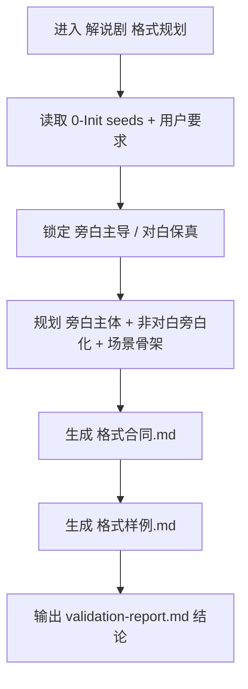
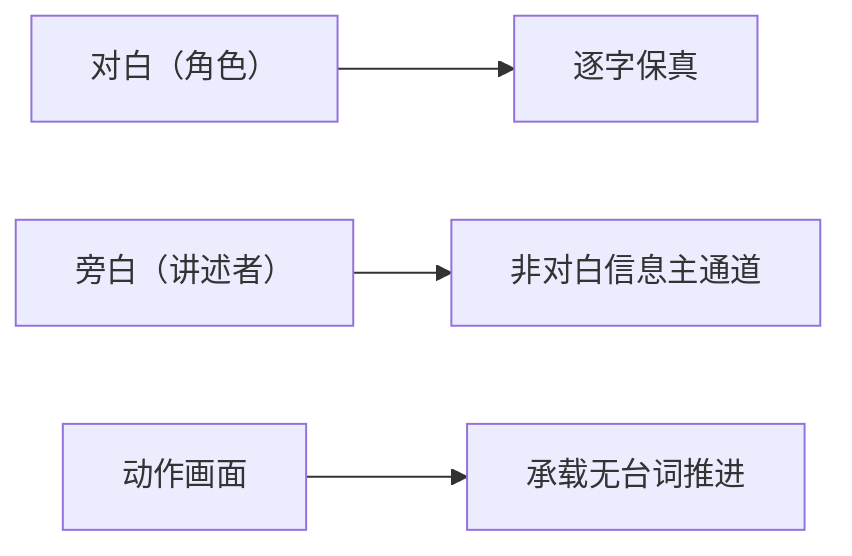

# aigc 1-规划 / 2-格式 / 解说剧

## 概述

`解说剧` 是 `2-格式` 下的旁白主导变体。

它负责把后续剧本文稿规划为“旁白主导、对白保真、非对白优先旁白化”的解说剧格式合同，并把主体口径、字段主从关系、样例与局部验收写成规划层真源。

它不直接改写整集正文，也不承担标准剧式“旁白从严”的默认边界。

## When to Use

- 用户明确要求“解说剧”“旁白主导”“讲述者带路”的消费方式。
- 项目预设已说明叙述者框架、信息解释密度或解说型节奏要求。
- 需要提前规划“非对白文本优先旁白化”的文稿格式。
- 需要把对白、旁白、动作画面之间的主从关系写成稳定合同。

## When Not to Use

- 用户没有给出解说剧信号，且项目更适合表演优先。
- 当前任务只是规划常规剧情文稿结构。
- 需要直接重写正文，而不是先建格式合同。

## 变体边界

### `解说剧` 拥有

- 解说剧字段合同
- 旁白主导的文本组织规则
- 旁白主体统一口径
- 最小解说剧格式样例

### `解说剧` 不拥有

- 标准剧式“旁白从严”默认边界
- 逐集正文全文改写
- 导演/分镜级镜头语言真源

## Reference Modules (Mandatory)

`解说剧/SKILL.md` 只保留局部合同、门槛与字段主表；专项细则以下列模块为真源：

- `references/chain-of-thought.md`
- `references/execution-flow.md`
- `references/type-strategies.md`
- `references/output-template.md`

## Visual Maps

## Canonical Landing

- 变体根目录：`projects/<项目名>/1-规划/2-格式/解说剧/`
- 主合同：`projects/<项目名>/1-规划/2-格式/解说剧/格式合同.md`
- 最小样例：`projects/<项目名>/1-规划/2-格式/解说剧/格式样例.md`
- 局部验收：`projects/<项目名>/1-规划/2-格式/解说剧/validation-report.md`

## VSM Complexity (Mandatory)

- complexity_level: `medium`
- 判定依据：需要同时处理 `旁白主导强度`、`对白保真边界`、`内心独白是否开放` 三类变量。
- 完整 VSM 四件套真源：`references/type-strategies.md`

## 核心聚焦（Mandatory）

1. 解说剧默认“旁白主导、对白保真”。
2. 非对白文本在规划层应优先进入 `旁白` 或 `动作画面`，不保留裸叙述段。
3. `旁白` 若启用，主体统一为 `讲述者`。
4. 场景仍必须按 `### 场景X：<场景信息>` 组织。
5. 规划层只定义格式与门禁，不直接改写整集正文。

## 核心约束（Mandatory）

1. 进入条件:
   - 必须存在用户或项目预设的明确解说剧信号；否则不应误用本变体。
2. 旁白主导:
   - 合同应明确 `旁白` 是非对白信息的主通道。
   - `对白` 仍需保真，不得为了统一成解说腔而吞并原始对白。
3. 主体统一:
   - `旁白` 主体统一规划为 `讲述者`，不得在合同中平行发明多个别名。
4. 动作剥离:
   - 动作信息仍应放入 `动作画面` 或对应 `*画面`，不进引号正文。
5. 内心独白:
   - 默认关闭，仅在用户额外要求时才允许作为可选扩展字段写入合同。

## 输出合同摘要

详细模板真源位于 `references/output-template.md`。本变体至少应稳定产出：

- `格式合同.md`
- `格式样例.md`
- `validation-report.md`

## Field Master

| field_id | 输出位置/字段 | 内容要求 | 证据来源 | 默认责任 Step | 质量维度 | 失败码 |
| --- | --- | --- | --- | --- | --- | --- |
| FIELD-EXP-VARIANT-01 | `格式合同.md / 变体定位` | 明确解说剧是旁白主导的格式分支 | 用户要求、项目预设 | S1 | 变体定位清晰度 | FAIL-EXP-VARIANT |
| FIELD-EXP-SCENE-02 | `格式合同.md / 场景标题规范` | 固定 `### 场景X：<场景信息>` 骨架 | 通用规划合同 | S2 | 结构一致性 | FAIL-EXP-SCENE |
| FIELD-EXP-FIELDS-03 | `格式合同.md / 允许字段` | 明确旁白主导下的字段层级与主体格式 | 参考仓字段模式 | S3 | 字段完整性 | FAIL-EXP-FIELDS |
| FIELD-EXP-NARRATION-04 | `格式合同.md / 硬门槛` | 明确非对白旁白化、主体统一与独白默认关闭 | 解说剧体裁边界 | S4 | 体裁约束准确性 | FAIL-EXP-NARRATION |
| FIELD-EXP-SAMPLE-05 | `格式样例.md` | 提供可直接示范下游写法的最小样例 | 变体合同 | S5 | 可消费性 | FAIL-EXP-SAMPLE |

## Thought Pass Map

| step_id | 聚焦字段 | 核心问题 | 生成动作 | 未达标信号 |
| --- | --- | --- | --- | --- |
| S1 | FIELD-EXP-VARIANT-01 | 为什么这里是解说剧 | 锁定旁白主导的变体定位 | 没有解说信号却误入 |
| S2 | FIELD-EXP-SCENE-02 | 场景骨架如何统一 | 固定场景标题规范 | 每集标题格式漂移 |
| S3 | FIELD-EXP-FIELDS-03 | 应保留哪些字段 | 写出旁白主导下的字段骨架 | 字段主从关系模糊 |
| S4 | FIELD-EXP-NARRATION-04 | 哪些规则必须固定 | 固化旁白化、主体统一、独白默认关闭 | 合同里出现多叙述口径 |
| S5 | FIELD-EXP-SAMPLE-05 | 下游如何直接照写 | 产出最小样例 | 样例无法示范解说流 |

## Pass Table

| field_id | Pass Standard | Fail Code | Rework Entry |
| --- | --- | --- | --- |
| FIELD-EXP-VARIANT-01 | 变体定位清楚，不混入标准剧默认边界 | FAIL-EXP-VARIANT | S1 |
| FIELD-EXP-SCENE-02 | 场景标题规范明确统一 | FAIL-EXP-SCENE | S2 |
| FIELD-EXP-FIELDS-03 | 旁白主导下的字段关系完整 | FAIL-EXP-FIELDS | S3 |
| FIELD-EXP-NARRATION-04 | 非对白旁白化、主体统一、独白开关清楚 | FAIL-EXP-NARRATION | S4 |
| FIELD-EXP-SAMPLE-05 | 样例可直接用于下游 | FAIL-EXP-SAMPLE | S5 |

## Council Runtime Inheritance (Mandatory)

`解说剧` 不单独定义顾问团运行时，而是强制继承 `1-规划` 根技能与 `2-格式` 父技能的顾问团合同。

执行规则：

1. 直接进入本叶子技能时，仍必须先读取 `projects/<项目名>/team.yaml` 与 `.agents/skills/aigc/_shared/council-runtime/module-spec.md`。
2. 若顾问团启用，则由 `策划` 先对解说剧格式选择、旁白承载边界与下游消费方式提供前置建议。
3. 父级与阶段级 `validation-report.md` 前后若命中 `评审`，仍分别按 `2-格式` 与 `1-规划` 既有闸门执行。
4. 本叶子技能不夺取主代理的 canonical 写回权。

## Root-Cause Execution Contract (Mandatory)

当出现以下症状时，必须优先修本子技能的源层合同，而不是只补某一页样例：

- 解说剧合同没有明确“旁白主导”
- `旁白` 主体在合同里漂成多个称呼
- 原始对白被错误吞进旁白规则
- 没有解说信号却把项目默认推入解说剧

必经链路：

`Symptom -> Direct Technical Cause -> Rule Source -> Meta Rule Source -> Fix Landing Points`

优先检查：

- `Rule Source`
  - `.agents/skills/aigc/1-规划/subtypes/2-格式/subtypes/解说剧/SKILL.md`
  - `.agents/skills/aigc/1-规划/subtypes/2-格式/subtypes/解说剧/CONTEXT.md`
  - `.agents/skills/aigc/1-规划/subtypes/2-格式/SKILL.md`
- `Meta Rule Source`
  - `.agents/skills/aigc/1-规划/SKILL.md`
  - `.agents/skills/aigc/SKILL.md`
  - 根 `AGENTS.md`

## 完成标准

- 已写清解说剧的进入条件与变体定位
- 已给出场景标题和允许字段合同
- 已明确旁白主体统一与非对白旁白化门禁
- 已把内心独白设为默认关闭的可选扩展
- 已产出最小格式样例

## Context Preload (Mandatory)

- 执行前先加载 `.agents/skills/aigc/1-规划/SKILL.md` 与 `CONTEXT.md`。
- 再加载 `.agents/skills/aigc/1-规划/subtypes/2-格式/SKILL.md` 与 `CONTEXT.md`。
- 最后加载本 `SKILL.md` 与本地 `CONTEXT.md`。
- 需要细化局部思维链、执行流、类型策略与模板时，继续加载本目录 `references/*.md`。
- 优先级遵循：用户显式请求 > 根 `AGENTS.md` > `.agents/skills/aigc/SKILL.md` > 上层 `1-规划/SKILL.md` > 父级 `2-格式/SKILL.md` > 本 `SKILL.md` > 各级 `CONTEXT.md`。
