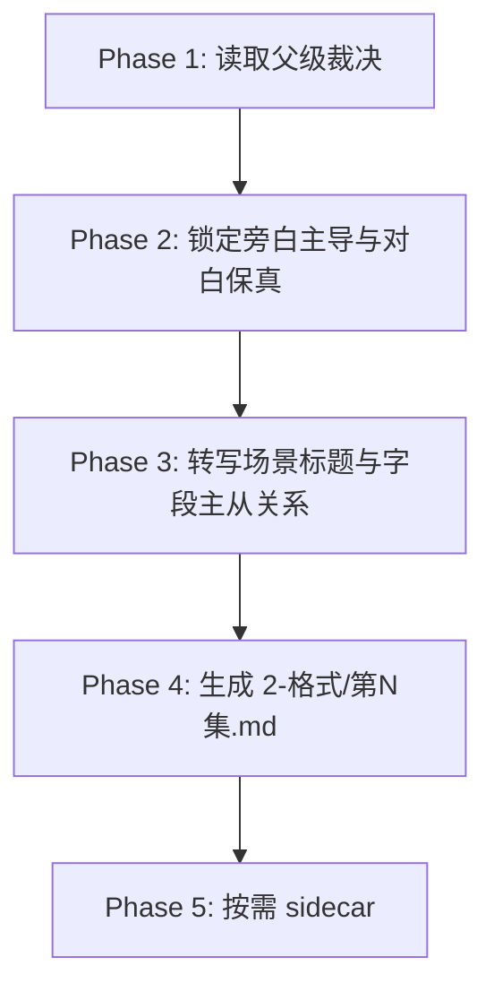

# 解说剧 / Execution Flow

本文件是 `解说剧` 的局部执行流程真源。

## Phase Flow

## Atomic Steps

1. 读取父级裁决与上游种子。
2. 明确本轮存在解说剧信号。
3. 先依据 `story-source-manifest.yaml` 或 `metadata.source_profile` 锁定场景编号粒度；若命中混合源/分镜源且锁定了 `scene_boundary`，则场景编号只按连续时空递增。
4. 若上游可解析出原场景标题或镜头块标题，优先复用这些结构证据，不得先清洗成泛化标题。
5. 若上游明确写出运镜/镜头提示，优先整理为紧跟相关 `*画面` 的 `镜头语言预设：...`；未明确写出时，不得脑补新增。
6. 把原文按解说剧格式转写为 `2-格式/第N集.md`。
7. 对分镜源，画面处理重点是规范化整理既有结构，而不是普通叙事源式补齐。
8. 确保旁白、旁白画面、动作画面、对白、镜头语言预设等字段主从关系可直接阅读。
9. 仅在调试/复核时保留 sidecar。

## Fallback

- 未发现解说信号：回到父级重新判模。
- 样例把对白吞进旁白：回到 `Phase 2` 重做主从分工。
- 内心独白默认常开：回到 `Phase 3` 收紧字段开关。
- 分镜源镜头语言被删除、挂错位置或脑补新增：回到 `Phase 5` 重做镜头语言保留。
