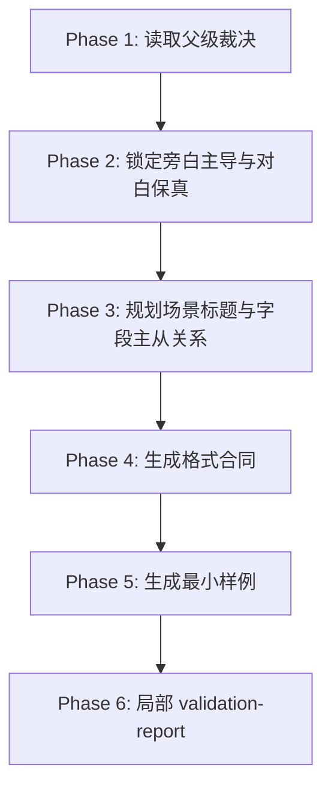

# 解说剧 / Execution Flow

本文件是 `解说剧` 的局部执行流程真源。

## Phase Flow

## Atomic Steps

1. 读取父级裁决与上游种子。
2. 明确本轮存在解说剧信号。
3. 写 `格式合同.md`：
   - 变体定位
   - 场景标题规范
   - 允许字段
   - 硬门槛
4. 写 `格式样例.md`，至少体现旁白、旁白画面、动作画面、对白四件套。
5. 写 `validation-report.md`，说明是否满足“旁白主导、对白保真”。

## Fallback

- 未发现解说信号：回到父级重新判模。
- 样例把对白吞进旁白：回到 `Phase 2` 重做主从分工。
- 内心独白默认常开：回到 `Phase 3` 收紧字段开关。
