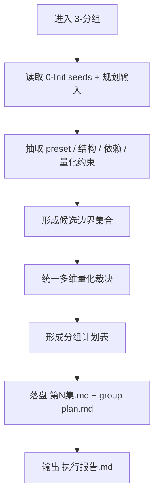
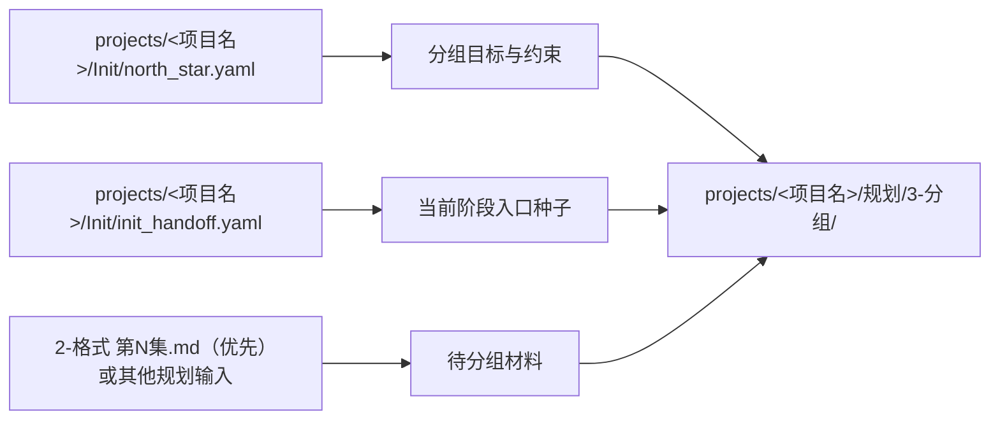

# aigc 1-规划 / 3-分组

## Skill Package Layout（对齐最新创作型规范）

- 主合同真源：`SKILL.md`
- 经验层：`CONTEXT.md`
- 标准细则模块层：`references/`
  - `references/chain-of-thought.md`
  - `references/execution-flow.md`
  - `references/type-strategies.md`
  - `references/output-template.md`
- 领域专项真源仍保留并继续生效：
  - 路由细则：`references/type-strategies.md`
  - 量化投影：`references/scene-duration-projection.md`
  - 模板真源：`templates/group-plan.md`、`templates/grouped-episode.md`、`templates/validation-report.md`
  - 校验入口：`scripts/validate_grouping.py`

硬规则：

1. 本次重构采用“主合同 + 标准细则模块 + 领域专项真源”的三层结构，不改变 `3-分组` 既有分组逻辑、量化口径和产物职责。
2. 新增四个标准 `references` 模块负责承接最新创作型规范要求的核心细则；其中统一多维量化裁决已并入 `references/type-strategies.md`，量化投影、模板与 validator 继续作为独立真源。
3. 若后续出现规则漂移，优先判定应修改哪一层真源，而不是在多个文档里重复抄写同一套细则。

## 概述

`3-分组` 负责把已经分好的逐集材料，进一步整理成下游可直接消费的“集内组级结构容器”。

它参照了 `AIGC-ZEN-VOID` 中 `3-拍摄段落` 的高价值思路，但当前阶段只继承三类能力，不继承导演阶段的专属字段：

1. 先建结构容器，再让下游填细节
2. 先抽取约束，再执行候选边界生成与归组
3. 每个组都必须可追溯、可解释、可交接

当前子技能的真源路径固定为 `projects/<项目名>/规划/3-分组/`，并沿用 `1-分集` 已锁定的 `第N集.md` 集粒度；不沿用参考仓的 `output/影片/.../2-导演/...` 路径合同。

## When to Use

- 需要把 `1-分集` 已产出的逐集文稿进一步整理成集内分组。
- 需要按叙事模块、生产波次、任务批次或镜头包建立结构分组。
- 需要为后续 `1-规划/4-节奏`、`2-组间`、`3-明细`、`4-主体` 提供组级入口，而不是直接进入细节创作。
- 需要同时落盘“分组总览 + 对应集文件 + 证据报告”，而不是只给口头建议。

## When Not to Use

- 当前任务只是分集，还没有进入“集内/项目内进一步编组”的层级。
- 当前任务已经在做导演意图、风格细化、镜头设计或主体资产，不属于规划层。
- 用户只想要一个松散建议清单，不需要形成稳定的组级交付。

## 子技能边界

### `3-分组` 拥有

- 分组目标识别
- 分组边界裁决
- 分组锚点与边界说明
- 逐集分组文档
- 分组阶段验证报告

### `3-分组` 不拥有

- 导演意图、镜头美学、风格 bible
- 视觉脚本或 shot-by-shot 重写
- 主体设计、分镜页、视频执行参数

## Visual Maps

## 任务流程摘要（Latest Creative-Skill Alignment）

`3-分组` 现按“摘要留在主合同、细则下沉到模块层”的方式组织：

1. 主流程摘要、阶段/回退关系：`references/execution-flow.md`
2. 思维链与字段落盘快照：`references/chain-of-thought.md`
3. 统一裁决方法、量化继承与 fallback：`references/type-strategies.md`
4. 产物骨架、字段到模板映射：`references/output-template.md`

硬规则：

1. 本 `SKILL.md` 保留阶段边界、硬门槛、Field Master、Root-Cause 合同与完成标准。
2. 进入执行前，必须同时读取本节摘要和对应标准模块，而不是只看任一单独文件。
3. 若某条细则已被标准模块吸收为 canonical module，本 `SKILL.md` 只保留摘要与门禁，不再平行重写整段说明。

## Canonical Landing

- 子路径根目录：`projects/<项目名>/规划/3-分组/`
- 集级主产物：`projects/<项目名>/规划/3-分组/第N集.md`
- 主计划：默认降为按需 sidecar，不属于父级全链默认交付
- 证据侧车：默认降为按需 sidecar，不属于父级全链默认交付

## 输入合同

### 必需输入

- `projects/<项目名>/Init/north_star.yaml`
- `projects/<项目名>/Init/init_handoff.yaml`
- 当前明确的待分组材料

### 合法待分组材料

- `2-格式` 已产出的逐集格式稿（默认直接输入）
- `1-分集` 产出的逐集文件
- 项目故事原文、章节草案、结构提纲
- 已有规划表、任务清单、模块列表
- 用户显式指定的镜头包、制作波次或主题模块列表

### 输入处理原则

1. 本阶段只做结构归组，不擅自改写事实顺序与内容立场。
2. 若 `projects/<项目名>/规划/2-格式/第N集.md` 已存在，默认以它作为 `3-分组` 的直接业务输入；`Init/*` 与主故事源仅作为集边界、预设保护和量化回算证据，不与 `2-格式` 并列为第二份主稿真相。
3. 若输入已包含章节、场次、模块名、任务包，默认视为有效结构锚点。
4. 用户显式指定组数、组名、分法或优先级时，优先级高于默认推断。

## 与 `1-分集` 的边界合同（Mandatory）

1. `1-分集` 是“集边界真源”；哪些集存在、如何命名、集顺序如何排列，都由 `1-分集` 决定。
2. `3-分组` 只允许在已存在的 `第N集.md` 内部做组级划分，不得新增 `第N组.md` 平行文档，不得重命名或重编号集文件。
3. 若分组诉求实际跨越集边界，必须先回到 `1-分集` 重裁边界，再恢复 `3-分组`。
4. `projects/<项目名>/规划/3-分组/第N集.md` 是该集分组结果的真源；`group-plan.md` 只能做总览，不得成为隐藏的第二真相。

## 量化真源继承合同（Mandatory）

`3-分组` 的量化机制不允许凭当前子技能重新发明一套简化版本；默认必须继承参照源 `/Volumes/AIGC/AIGC-ZEN-VOID/.agents/skills/aigc2026/2-导演/3-拍摄段落/SKILL.md` 中已沉淀的“场景顺序与时长策略规则”，并在当前仓投影到 `references/scene-duration-projection.md`。

硬规则：

1. 量化判断的主真源不是 `group_load_score`，而是：
   - 场景顺序先行
   - 时长策略优先级
   - 节奏档位与字窗公式
   - 有效字数计算
   - 默认不跨场景凑时长
   - 尾组 `< 5 秒` 并组规则
2. `episode_load_score`、`group_load_score` 只保留为规划阶段摘要指标，不得覆盖上面的硬门槛。
3. 若当前阶段尚无字段化正文，允许做“规划级估算”，但必须在 `执行报告.md` 明确标注“估算”而非“导演阶段精算”。
4. 裁决合同与模板若涉及量化判断，必须回指 `references/scene-duration-projection.md`，不得在兄弟文档各自重写一套。
5. `warn-low / warn-high / error` 只允许存在于候选分析或返工判断，不允许作为正式 `第N集.md` 的通过状态落盘。

## 分镜时间基线合同（Mandatory）

`3-分组` 当前阶段不直接生产帧级 `time_range`，但必须为下游 `5-分镜构图` 提供稳定的组总时长真源，避免把“整集时长”误读成“每组时长”。

硬规则：

1. `第N集.md` 的 episode frontmatter 必须显式维护：
   - `默认组时长`
   - `分镜组时长映射`
   - `时长偏离证据`
2. `默认组时长` 负责声明当前集默认组总时长；若无上游覆盖，默认写 `15秒`。
3. `分镜组时长映射` 只登记偏离默认值的组；无偏离时写 `{}`，不得省略成隐式规则。
4. 若 `分镜组时长映射` 非空，`时长偏离证据` 必须同时给出可追溯的上游证据；无证据不得偏离默认 `15秒`。
5. 每组的 `estimated_duration_seconds` 必须与 `分镜组时长映射 -> 默认组时长` 解析出的组总时长保持一致，不允许 frontmatter、计划表和组章节三套口径漂移。
6. 下游 `5-分镜构图` 及其 validator 读取链固定为：
   - `分镜组时长映射 -> 默认组时长 -> 切分时长策略`
7. 帧级时间字段格式、场景类型化分配、节奏联动与 `FAIL-TIME-*` 失败码统一以 `references/scene-duration-projection.md` 的下游交接协议为准；本 `SKILL.md` 不重复展开帧级切分正文。

## 量化指标合同（Mandatory）

`3-分组` 不允许只给抽象判断；默认必须把“为什么这样分”压成可复核的量化指标。当前阶段的量化分两层：

1. 主量化层：
   - 继承 `references/scene-duration-projection.md` 的场景顺序、时长策略、节奏字窗、有效字数和尾组规则。
2. 摘要量化层：
   - 用 `episode_load_score`、`group_load_score` 总结结构复杂度、转折密度和依赖压力。

### 集级指标

- `scene_unit_count`
  - 本集内可见场景或可恢复场景原子的数量。
- `duration_policy`
  - 当前集生效时长策略，来源优先级遵循 `scene-duration-projection.md`。
- `pace_tier`
  - `慢节奏 / 中节奏 / 快节奏`。
- `base_text_window`
  - 由 `生效时长 × 10 × 节奏系数` 计算。
- `warn_window`
  - 形如 `84-126` 的建议区间。
- `hard_text_window`
  - 基准字窗的 `1.1x` 上限。
- `structure_unit_count`
  - 本集内可作为分组输入的最小结构单位数。
  - 章节块、场次块、任务块、模块块、镜头包各记 `1`。
- `turning_point_count`
  - 本集内可见的二级转折、任务升级点、强 handoff 点数量。
- `hard_dependency_count`
  - “后块必须依赖前块结果才成立”的强依赖条数。
- `episode_load_score`
  - 计算公式：`structure_unit_count + turning_point_count + hard_dependency_count`

### 推荐组数区间

| `episode_load_score` | 推荐组数区间 | 默认判断 |
| --- | --- | --- |
| `1-3` | `1-2` 组 | 负载很轻，优先避免碎片化 |
| `4-6` | `2-3` 组 | 负载适中，按天然结构收束 |
| `7-9` | `3-4` 组 | 负载偏重，需要明确 handoff |
| `10-12` | `4-5` 组 | 负载很重，应降低单组复杂度 |
| `>=13` | `5-6` 组 | 若仍过重，优先回查 `1-分集` |

硬规则：

1. 实际 `group_count` 超出推荐区间时，必须在 `执行报告.md` 写明偏离理由。
2. 若 `episode_load_score >= 13` 且仍需 `>6` 组，默认判定当前集边界可能过重，必须回查 `1-分集`。

### 单组指标

- `estimated_duration_seconds`
- `effective_text_chars`
- `window_status`
  - `ok / warn-low / warn-high / error`

硬规则：

1. 正式 `第N集.md` 的分组计划表与组章节只允许 `window_status=ok`。
2. 若某组经量化后仍为 `warn-low / warn-high / error`，当前轮必须回退重分或等待上游豁免，不得继续宣称 `3-分组` 已完成。
3. 当 `primary_story_source.source_type in {storyboard_script, hybrid_story_text}` 且当前组 `source_span` 可解析为镜号范围时，`effective_text_chars` 必须由故事主源回算，不得人工拍脑袋填写。
4. 若命中了上述主源回算条件，但 `source_span` 不是可机读的镜号范围，或回算结果与填写值不一致，当前轮必须视为返工，不得继续落盘正式 `第N集.md`。
- `group_unit_count`
- `group_turning_point_count`
- `group_dependency_count`
- `group_load_score = group_unit_count + group_turning_point_count + group_dependency_count`

| `group_load_score` | 判定 |
| --- | --- |
| `1` | 过轻，默认应与相邻组合并，除非承担明确 handoff |
| `2-5` | 推荐区间 |
| `6` | `warn`，必须说明为何仍保持独立 |
| `>=7` | `FAIL-GRP-PLAN` 候选，默认应继续拆组或回查上游边界 |

### 依赖密度

- `dependency_density = hard_dependency_count / max(group_count, 1)`
- 默认判断：
  - `<= 0.8`：健康
  - `0.81-1.2`：偏重，需解释
  - `> 1.2`：`FAIL-GRP-DEP` 候选

### 最低证据要求

每个组至少必须同时具备：

- `1` 个 `structure_anchor`
- `1` 条 `boundary_reason`
- `1` 条 `dependency_note`
- `1` 条 `parallelism` 判断

缺任一项，视为 `FAIL-GRP-FILES` 候选。

## Unified Decision Canonical Source

`3-分组` 不再在 `G1/G2/G3` 之间选主路由。当前统一执行方法、边界样例与回退条件，以本目录 `references/` 为单一真源；本 `SKILL.md` 只保留硬门槛与落盘合同。

通用量化真源：`references/scene-duration-projection.md`

硬规则：

1. 必须先加载并遵守 `references/type-strategies.md` 中的“统一多维量化裁决”，再生成候选边界。
2. `preset_registry`、结构锚点、依赖闭环和量化结果是同一套裁决输入，不得再拆成互斥主路由。
3. `references/` 中的示例是执行基线，不是可随意跳过的参考阅读。

## Standard Reference Modules（Mandatory）

以下四个标准模块用于对齐最新 `skill-内容输出型` 规范；它们不替代领域专项真源，而是负责把当前子技能已有能力重新整理成稳定的模块层。

| standard module | canonical file | 负责内容 | 继续回指的领域真源 |
| --- | --- | --- | --- |
| 思维链细则 | `references/chain-of-thought.md` | `S1-S7` 的思考顺序、裁决轴、字段落盘关系 | `Field Master`、`Thought Pass Map` |
| 执行流程细则 | `references/execution-flow.md` | 阶段推进、tranche、回退与 Mermaid 主流程 | `统一裁决合同`、`Validation Entry` |
| 类型化策略细则 | `references/type-strategies.md` | 统一多维裁决、量化继承、降级与回退 | `references/type-strategies.md`、`references/scene-duration-projection.md` |
| 输出模板细则 | `references/output-template.md` | 产物职责、模板骨架、字段到模板映射 | `templates/*.md`、`scripts/validate_grouping.py` |

硬规则：

1. 标准模块是“整理层”，不是第二套领域方法论；涉及领域裁决时，仍回到 `references/type-strategies.md` 与量化投影真源。
2. 若未来要升级思维链、流程、模板说明，优先修改对应标准模块；若升级会影响阶段边界、强制字段或失败码，再回写本 `SKILL.md`。
3. 不允许在 `SKILL.md`、标准模块、领域专项 reference 三处各自静默演化出不同口径。

## 统一多维量化裁决合同（Mandatory）

分组统一按以下顺序执行：

1. 锁定不可违背的上游约束
2. 生成结构上成立的候选边界
3. 检查依赖闭环、串并行关系与下游 handoff
4. 用量化真源验证时长、字窗和有效字数
5. 在可通过的候选中，选择返工成本最低的一组边界

硬规则：

1. 裁决完成前不得直接改写对应 `第N集.md`，也不得新增 `第N组.md`。
2. `projected_group_ids` 只能作为约束或追踪索引，不能跳过当前裁决直接等同正式组数。
3. 每个组边界都必须能回答“为什么在这里切开或合并，而不是前后相邻位置”。
4. 裁决总表、边界摘要与回退细则统一写在 `references/type-strategies.md`。

## 结构容器合同（Mandatory）

1. `3-分组` 的第一责任不是发明细节，而是建立下游可消费的组级容器。
2. 每个组至少要锁定：
   - `group_id`
   - `group_name`
   - `group_goal`
   - `source_span`
   - `structure_anchor`
   - `estimated_duration_seconds`
   - `effective_text_chars`
   - `window_status`
   - `group_unit_count`
   - `group_turning_point_count`
   - `group_dependency_count`
   - `group_load_score`
   - `dependency_note`
   - `parallelism`
   - `downstream_entry`
   - `boundary_reason`
3. episode frontmatter 还必须锁定当前集的组总时长基线：
   - `默认组时长`
   - `分镜组时长映射`
4. 组级结构必须写回对应 `第N集.md`，下游应在组内继续细化，而不是重新发明分组。
5. 若存在跨组强依赖，必须在对应 `第N集.md` 与 `group-plan.md` 明确写出，不得留给下游猜测。

## Output Template Canonical Source

输出模板以本目录 `templates/` 为单一真源。本 `SKILL.md` 只保留“必须有哪些产物、产物承担什么职责”的合同，不再在正文中重写完整模板。

| artifact | canonical template | 用途 |
| --- | --- | --- |
| `group-plan.md` | `templates/group-plan.md` | 项目级或阶段级分组总览，只负责跨集摘要与边界裁决结果 |
| `第N集.md` | `templates/grouped-episode.md` | 单集分组真源，负责落盘分组表与组级容器 |
| `执行报告.md` | `templates/validation-report.md` | 证据侧车，负责输入清单、路由裁决、边界证据与验收结论 |

硬规则：

1. 生成新产物时，优先从模板实例化，不得凭记忆自由改章节骨架。
2. 模板若需升级，优先修改 `templates/`；只有产物职责或强制区块变化时才回写本 `SKILL.md`。
3. 若项目需要局部变体，只允许在模板骨架上加 mode-specific 增量，不得删掉模板要求的强制区块。
4. 详细模板说明、字段落点与模板映射统一收束到 `references/output-template.md`，避免在模板与主合同之间来回复制说明。

## Validation Entry

- 契约校验入口：`scripts/validate_grouping.py`
- 默认用途：
  - 强校验 `第N集.md` 是否齐全
  - 若存在 `group-plan.md`、`执行报告.md`，再校验其 sidecar 结构是否齐全
  - 校验集粒度未漂移到 `第N组.md`
  - 校验 frontmatter、强制章节、分组计划表、组级容器、依赖说明与报告区块
  - 校验 `默认组时长 / 分镜组时长映射` 与每组 `estimated_duration_seconds` 是否一致
- 建议命令：
  - `python3 .agents/skills/aigc/1-规划/subtypes/3-分组/scripts/validate_grouping.py --input "projects/<项目名>/规划/3-分组"`

补充规则：

1. 执行 validator 前，先对照 `references/output-template.md` 确认产物骨架与字段落点。
2. validator 负责机检结构合同；若问题属于“为什么这样分”的解释缺失，优先回查 `references/chain-of-thought.md` 与 `references/type-strategies.md`。

## Field Master

| field_id | 输出位置/字段 | 内容要求 | 证据来源 | 默认责任 Step | 质量维度 | 失败码 |
| --- | --- | --- | --- | --- | --- | --- |
| FIELD-GRP-INPUT-01 | `执行报告.md / 输入清单` | 列出全部待分组材料、顺序、范围与来源 | 输入扫描结果 | S1 | 输入覆盖率 | FAIL-GRP-INPUT |
| FIELD-GRP-DECISION-02 | `执行报告.md / 边界裁决摘要` | 明确不可动约束、主要裁决依据与终裁理由 | `north_star`、`init_handoff`、manifest、结构评估 | S2 | 裁决正确性 | FAIL-GRP-DECISION |
| FIELD-GRP-BOUNDARY-03 | `执行报告.md / 候选边界` | 列出候选分组边界、锚点与排除理由，并确认未越过 `1-分集` 集边界 | 原文结构、任务包、模块列表、逐集文件 | S3 | 边界可解释性 | FAIL-GRP-BOUNDARY |
| FIELD-GRP-PLAN-04 | `第N集.md / 分组计划表` | 在对应集文件中给出每组范围、结构锚点、时长估算、字窗状态、负载分、依赖、并行性、下游入口与边界理由；其中 `estimated_duration_seconds` 必须与 episode frontmatter 的组时长基线一致 | 边界收窄结果 | S4 | 结构稳定性 | FAIL-GRP-PLAN |
| FIELD-GRP-FILES-05 | `第N集.md / 组级容器` | 为每个组落盘固定字段、组目标、结构锚点、量化指标、字窗压力、依赖与并行性判断，并在 episode frontmatter 显式写出 `默认组时长 / 分镜组时长映射` | 最终分组方案 | S5 | 输出结构完整性 | FAIL-GRP-FILES |
| FIELD-GRP-DEP-06 | `执行报告.md / 依赖与并行性检查` | 说明哪些组可并行，哪些组需串行以及原因，并给出 `dependency_density` | 组间依赖分析 | S6 | 调度可执行性 | FAIL-GRP-DEP |
| FIELD-GRP-QA-07 | `执行报告.md / 验收结论与返工项` | 给出 PASS/FAIL、失败码与返工入口 | 全字段校验结果 | S7 | 闭环完整性 | FAIL-GRP-QA |

## Thought Pass Map

完整的思维链摘要、裁决轴定义与字段落盘快照见 `references/chain-of-thought.md`；本节保留最短可执行映射，不再扩写重复推演说明。

| step_id | 聚焦字段 | 核心问题 | 生成动作 | 未达标信号 |
| --- | --- | --- | --- | --- |
| S1 | FIELD-GRP-INPUT-01 | 输入是否完整且顺序清晰 | 扫描待分组材料并生成输入清单 | 漏材料、范围不明、顺序断裂 |
| S2 | FIELD-GRP-DECISION-02 | 当前有哪些不可违背约束与终裁依据 | 锁定约束并写明终裁理由 | 还没锁约束就开始分组 |
| S3 | FIELD-GRP-BOUNDARY-03 | 哪些边界具有真实结构价值且不跨集 | 形成候选边界与排除说明 | 只按数量平均切组或擅自改集边界 |
| S4 | FIELD-GRP-PLAN-04 | 集内分组计划是否可交接 | 在对应 `第N集.md` 中生成组级计划表与编号 | 组间职责重叠或空洞 |
| S5 | FIELD-GRP-FILES-05 | 是否能稳定落盘集级分组文档 | 输出 `第N集.md` 中的组容器 | 只有计划表，没有组级容器，或额外长出 `第N组.md` |
| S6 | FIELD-GRP-DEP-06 | 组间能否直接进入执行 | 检查依赖、串并行与交接关系 | 下游无法判断先做哪组 |
| S7 | FIELD-GRP-QA-07 | 是否可以结案 | 输出验收结论与返工入口 | 结果不可追溯或不可续跑 |

## Pass Table

| field_id | Pass Standard | Fail Code | Rework Entry |
| --- | --- | --- | --- |
| FIELD-GRP-INPUT-01 | 输入材料完整可追溯 | FAIL-GRP-INPUT | S1 |
| FIELD-GRP-DECISION-02 | 边界裁决依据完整且可审计 | FAIL-GRP-DECISION | S2 |
| FIELD-GRP-BOUNDARY-03 | 边界具备结构、依赖与量化依据 | FAIL-GRP-BOUNDARY | S3 |
| FIELD-GRP-PLAN-04 | 分组计划稳定、清晰、可交接 | FAIL-GRP-PLAN | S4 |
| FIELD-GRP-FILES-05 | 每集文件内的组级容器结构完整 | FAIL-GRP-FILES | S5 |
| FIELD-GRP-DEP-06 | 串并行关系明确可执行 | FAIL-GRP-DEP | S6 |
| FIELD-GRP-QA-07 | 有验收结论、失败码与返工入口 | FAIL-GRP-QA | S7 |

## Council Runtime Inheritance (Mandatory)

`3-分组` 不单独定义顾问团运行时，而是强制继承上层 `1-规划` 的 `Council Runtime Contract`。

执行规则：

1. 直接进入本叶子技能时，仍必须先读取 `projects/<项目名>/team.yaml` 与 `.agents/skills/aigc/_shared/council-runtime/module-spec.md`。
2. 若顾问团启用，则由 `策划` 先对分组批次、执行波次与结构裁剪提供前置建议。
3. 阶段级 `projects/<项目名>/规划/validation-report.md` 前后若命中 `评审`，仍按 `1-规划` 根技能的闸门执行。
4. 本叶子技能只产出局部分组结论，不夺取主代理的阶段 canonical 写回权。

## Root-Cause Execution Contract (Mandatory)

当出现以下症状时，必须优先修本子技能或父级路由合同，而不是只补单次分组结果：

- 已经写了若干“组”，但没有统一边界裁决摘要
- 分组结果只是平均切块，缺乏边界理由与下游入口
- 把集内分组误写成 `第N组.md` 独立文件，导致与 `1-分集` 粒度冲突
- 参考仓思路被直接照抄，导致当前仓路径与阶段边界失配
- 父级 `1-规划` 看不出何时进入 `3-分组`
- 下游执行时仍需要重新发明分组，说明当前容器不成立

必经链路：

`Symptom -> Direct Technical Cause -> Rule Source -> Meta Rule Source -> Fix Landing Points`

优先检查：

- `Rule Source`
  - `.agents/skills/aigc/1-规划/subtypes/3-分组/SKILL.md`
  - `.agents/skills/aigc/1-规划/subtypes/3-分组/references/chain-of-thought.md`
  - `.agents/skills/aigc/1-规划/subtypes/3-分组/references/execution-flow.md`
  - `.agents/skills/aigc/1-规划/subtypes/3-分组/references/type-strategies.md`
  - `.agents/skills/aigc/1-规划/subtypes/3-分组/references/output-template.md`
  - `.agents/skills/aigc/1-规划/subtypes/3-分组/references/*.md`
  - `.agents/skills/aigc/1-规划/subtypes/3-分组/templates/*.md`
  - `.agents/skills/aigc/1-规划/subtypes/3-分组/scripts/validate_grouping.py`
  - `.agents/skills/aigc/1-规划/subtypes/3-分组/CONTEXT.md`
  - `.agents/skills/aigc/1-规划/SKILL.md`
- `Meta Rule Source`
  - `.agents/skills/aigc/SKILL.md`
  - 根 `AGENTS.md`

## 完成标准

- 已明确待分组材料范围
- 已完成统一多维量化裁决
- 已加载并遵守对应 reference
- 已确认并继承 `1-分集` 的集边界
- 已形成候选边界与分组计划表
- 已完成依赖与并行性检查
- 已落盘 `group-plan.md`、对应 `第N集.md`、`执行报告.md`
- 已通过 `scripts/validate_grouping.py` 或给出未通过原因
- 已给出下一阶段唯一推荐入口

## Context Preload (Mandatory)

- 执行前先加载上层 `.agents/skills/aigc/1-规划/SKILL.md` 与 `CONTEXT.md`。
- 再加载本 `SKILL.md` 与本地 `CONTEXT.md`。
- 优先级遵循：用户显式请求 > 根 `AGENTS.md` > `.agents/skills/aigc/SKILL.md` > 上层 `1-规划/SKILL.md` > 本 `SKILL.md` > 各级 `CONTEXT.md`。
