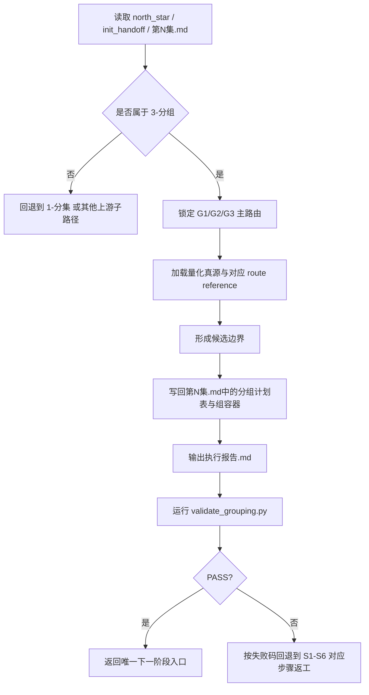

# 3-分组 · 执行流程细则

## 模块定位

- 本文件是 `3-分组` 的标准执行流程模块，用于承接最新创作型规范中的 `execution-flow` 细则层。
- 主 `SKILL.md` 保留阶段边界、强制路由、完成标准与 Root-Cause 合同。
- 本文件补足 phase、tranche、回退与协作顺序，不改变 `G1/G2/G3` 的既有判断逻辑。

## Phase Summary

| phase | 目标 | 关键动作 | 主产物 |
| --- | --- | --- | --- |
| `P1 输入锁定` | 确认是否真正进入 `3-分组` | 读取 `0-Init` 种子、`1-分集` 结果、待分组材料 | 输入清单 |
| `P2 路由裁决` | 选出唯一主路由 | 按 `G1 > G2 > G3` 做主裁决，并锁定量化真源 | 路由决议 |
| `P3 集内成组` | 形成候选边界与组容器 | 候选边界收窄、组表落盘、组级容器补齐 | `第N集.md` |
| `P4 验收闭环` | 输出证据与结论 | 依赖检查、validator 校验、PASS/FAIL 结案 | `执行报告.md` |

## Mermaid 主流程图

## Tranche 细化

### Tranche A：输入锁定

1. 读取 `projects/<项目名>/0-Init/north_star.yaml`
2. 读取 `projects/<项目名>/0-Init/init_handoff.yaml`
3. 读取 `projects/<项目名>/1-规划/1-分集/第N集.md` 或其他合法待分组材料
4. 检查是否存在跨集诉求；若存在，立即回退到 `1-分集`

### Tranche B：路由与量化锁定

1. 先按 `G1 > G2 > G3` 做唯一主路由裁决
2. 同步加载 `references/scene-duration-projection.md`
3. 再在 `references/type-strategies.md` 中跳到该主路由对应章节
4. 若主路由无法成立，先在 `执行报告.md` 记录原因，再决定降级或暂停

### Tranche C：集内成组

1. 形成候选边界列表
2. 用结构证据、量化门槛、依赖关系做收窄
3. 将最终组表写回对应 `第N集.md`
4. 为每个组补齐组目标、结构锚点、量化指标、交接约束、依赖与并行性、下游建议

### Tranche D：验证与闭环

1. 在 `执行报告.md` 写入路由决议、边界证据、依赖与并行性检查
2. 运行 `scripts/validate_grouping.py`
3. 若命中失败码，回到对应 `S1-S7`
4. 仅在 PASS 后返回唯一下一阶段入口

## 回退矩阵

| 症状 | 默认回退 | 原因 |
| --- | --- | --- |
| 分组诉求跨越集边界 | 回退到 `1-分集` | `3-分组` 不拥有集边界裁决权 |
| `G1` 预设冲突 | 停在 `G1` 记录冲突，再降级到 `G2` 或请求人工裁决 | 不能静默改写预设 |
| `G2` 结构标记弱 | 升级到 `G3` 主裁决 | 结构不足以承担边界说明 |
| `effective_text_chars > hard_text_window` | 回到候选边界收窄 | 量化硬门槛优先于边界偏好 |
| 长出 `第N组.md` | 回到模板/合同层修复 | 产物粒度越权 |
| validator 失败 | 按失败码跳回对应 `S1-S7` | 先修源层和字段缺口，再续跑 |

## 并行与串行约束

1. `G1/G2/G3` 的主裁决永远串行，不能并行投票后再拼接。
2. 主路由和量化口径锁定后，多集 `第N集.md` 的组表写回可以并行，但前提是不互相改集边界。
3. 单集内部的组生成顺序默认按 `G01 -> G02 -> G03 ...` 串行整理，以保证依赖关系明确。

## 交接出口

- 默认下游入口写入：
  - `1-规划/4-节奏`
  - 或用户明确指定的规划后续入口
- 若当前结果仍需“重新发明分组”，视为本流程尚未完成，不得提前交接。
