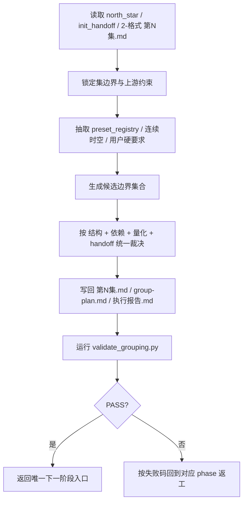

# 3-分组 · 执行流程细则

## 模块定位

- 本文件是 `3-分组` 的标准执行流程模块。
- 当前流程不再先选 `G1/G2/G3`，而是统一按“约束抽取 + 多维量化裁决”执行。

## Phase Summary

| phase | 目标 | 关键动作 | 主产物 |
| --- | --- | --- | --- |
| `P1 输入锁定` | 确认任务真的属于 `3-分组` | 读取 `0-Init` seeds、`1-分集` 结果、待分组材料 | 输入清单 |
| `P2 约束抽取` | 锁定不可违背的上游约束 | 抽取集边界、`preset_registry`、用户硬要求、连续时空边界 | 约束清单 |
| `P3 候选边界生成` | 形成可比较的边界集合 | 依据结构锚点、冲突闭环、峰值与尾钩生成候选 | 候选边界 |
| `P4 多维量化裁决` | 在候选中选出正式边界 | 同时比较结构、依赖、量化和 handoff | 边界裁决摘要 |
| `P5 落盘与验收` | 写回组表、容器并运行 validator | 输出 `第N集.md`、sidecar、校验结论 | PASS / FAIL |

## Mermaid 主流程图

## Tranche 细化

### Tranche A：输入锁定

1. 读取 `projects/<项目名>/Init/north_star.yaml`
2. 读取 `projects/<项目名>/Init/init_handoff.yaml`
3. 读取 `projects/<项目名>/Init/episode-split-plan.json`、`projects/<项目名>/规划/2-格式/第N集.md`
4. 若 `2-格式` 尚未执行，才允许临时回退到 `1-分集/第N集.md` 或其他已声明待分组材料
5. 若当前诉求跨集，立即回退 `1-分集`

### Tranche B：约束抽取

1. 从 `story-source-manifest.yaml` / `metadata.source_profile` 抽取：
   - `locked_preset_axes`
   - `preset_registry`
   - `lock_level`
   - `projected_shot_mode`
2. 将这些信息写成“不可切 / 可连续细分 / 仅参考”的边界约束
3. 用户显式“必须同组 / 必须拆开”的要求与上游 lock 同级比较，并在报告中写明优先级

### Tranche C：候选边界生成

1. 先列连续时空单元、冲突闭环、峰值、尾钩和任务包
2. 形成 2-4 套可比较边界，而不是直接拍板第一套
3. `storyboard_script / hybrid_story_text` 下优先把 `source_span` 写成可机读镜号范围

### Tranche D：多维量化裁决

1. 对每套候选同时比较：
   - 约束是否违反
   - 结构是否成立
   - 依赖闭环是否清晰
   - `effective_text_chars / window_status` 是否成立
   - 下游 handoff 是否最省返工
2. 先淘汰违反硬约束或量化失败的候选
3. 再在剩余候选中选择 handoff 最清晰的一套

### Tranche E：验证与闭环

1. 写 `group-plan.md` 的总览摘要
2. 写 `第N集.md` 的 frontmatter、计划表与组级容器
3. 写 `执行报告.md` 的边界裁决摘要、依赖检查与验收结论
4. 运行 `scripts/validate_grouping.py`
5. 若 validator 失败，优先回到对应 phase 修源字段，而不是只润色文字

## 回退矩阵

| 症状 | 默认回退 | 原因 |
| --- | --- | --- |
| 诉求跨集 | 回退 `1-分集` | `3-分组` 不拥有集边界裁决权 |
| `projected_group_ids` 与 lock 语义不清 | 回到 `P2 约束抽取` | 投影索引不能直接等于正式组界 |
| 候选边界结构成立但 handoff 混乱 | 回到 `P3` 重新收窄 | `3-分组` 的目标是可消费容器，不是均匀切块 |
| `window_status != ok` | 回到 `P4` 重判边界 | 严格 gate 下不能直接落盘 |
| 长出 `第N组.md` | 回到模板/合同层修复 | 输出粒度越权 |

## 并行与串行约束

1. 单集内部的边界裁决必须串行完成，不允许多套候选并行落盘后再拼接。
2. 多集可以并行写回，但前提是不互相改集边界。
3. 正式组号仍按 `G01 -> G02 -> G03 ...` 串行编号，以保证依赖关系可追溯。
