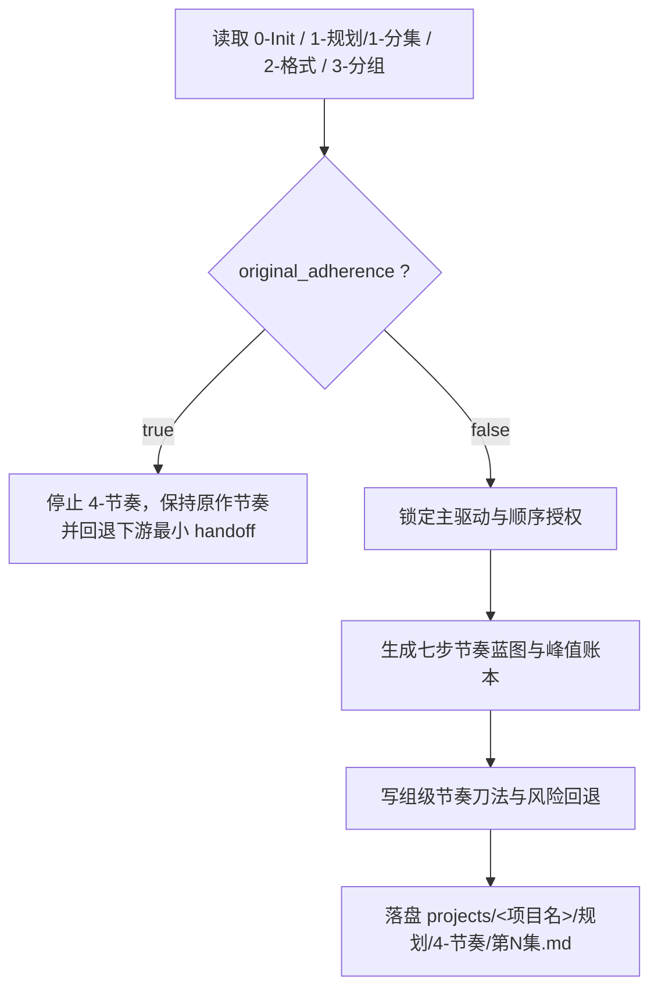

# 节奏

## 概述

`节奏` 是 `1-规划` 阶段里位于 `3-分组` 之后的集级节奏规划真源。

它负责在 `1-规划/3-分组/第N集.md` 已经稳定的前提下，把“这一集靠什么抓人、峰值放在哪里、哪些组该前置/压缩/留白、是否允许偏离原作节奏、哪些节奏法则必须交给下游”收束成独立的规划层节奏 handoff。

交付类型：`内容输出型`

本子技能已按最新内容输出型规范重构为“主合同 + references 模块细则”结构，并以当前仓 `projects/<项目名>/规划/4-节奏/` 作为唯一阶段落点。

## When to Use

- 需要在 `projects/<项目名>/规划/4-节奏/` 下为某一集生成节奏规划。
- `1-规划/3-分组/第N集.md` 已稳定，需要进一步判定主驱动、七步节奏、峰值账本与组级节奏刀法。
- `0-Init/north_star.yaml` 或 `init_handoff.yaml` 明确 `original_adherence: false`，允许在分组后做节奏重组、前置、压缩、留白或有限交叉。
- 用户明确要求“节奏 / 七步节奏蓝图 / 主驱动 / 峰值 / 节奏重排 / 原作节奏保留判断 / 钩子与 Exit 收束”。

## When Not to Use

- `0-Init` 明确 `original_adherence: true`，当前项目要求保留原作节奏、保序或禁止结构级改写。
- 当前还没有稳定分组容器，应先回到 `1-规划/3-分组`。
- 当前任务只是写本集主题、观看方式与部门级导演构思，应进入 `2-组间/导演意图`。
- 当前任务已经进入正文脚本改写，应进入 `3-明细`。

## 阶段边界

### 本技能拥有

- 集级主驱动裁决
- 七步节奏蓝图与峰值账本
- 原作节奏保留判断、顺序授权、重排边界与节奏刀法裁决
- 对分组容器的前置/压缩/留白/交叉/回收建议
- 给 `2-组间/导演意图` 与 `3-明细` 的节奏 handoff

### 本技能不拥有

- 项目级风格母体
- 项目级类型协议
- 本集完整导演构思正文
- 正文脚本改写与对白改写
- 重新发明上游不存在的剧情事实

## Visual Map

## Canonical Module References

| 模块 | 作用 | 真源文件 |
| --- | --- | --- |
| 思维链 | 承载字段主表、thought pass 与返工入口 | `references/chain-of-thought.md` |
| 执行流程 | 承载落点、workflow 与 council inheritance | `references/execution-flow.md` |
| 类型策略 | 承载 VSM 变量、情况、策略与回退 | `references/type-strategies.md` |
| 输出契约 | 承载固定区块、峰值类型与硬规则 | `references/output-template.md` |

## Execution Summary

- 本技能先做“原作节奏保留”布尔门，再做节奏蓝图；没有授权不进入结构级改写。
- canonical 主产物仍为 `projects/<项目名>/规划/4-节奏/第N集.md`
- 详细 workflow、落点与顾问团继承规则见 `references/execution-flow.md`

## Output Summary

- 输出固定区块仍为：`主驱动裁决 / 七步节奏蓝图 / 峰值账本 / 节奏执行策略 / 下游加载提示`
- 顺序授权、反机械化门禁、连续性与风险回退已下沉到 `references/output-template.md`

## Strategy Summary

- 判定顺序仍为：`原作节奏保留门 -> 主驱动 -> 七步映射 -> 峰值 -> 节奏刀法 -> 下游交接`
- 变量登记、情况判定、策略映射与回退规则见 `references/type-strategies.md`

## Field System Summary

- 字段体系现覆盖 `FIELD-RO-01` 到 `FIELD-RO-08`
- 其中 `FIELD-RO-01` 负责 `original_adherence` 门，`FIELD-RO-02` 到 `FIELD-RO-06` 承接正文区块，`FIELD-RO-07` 与 `FIELD-RO-08` 分别承接可见快照与 Gate Summary
- thought pass 与 pass table 见 `references/chain-of-thought.md`

## Root-Cause Execution Contract (Mandatory)

当出现以下症状时，必须先修本技能合同，而不是只改单次节奏文案：

- `original_adherence: true` 仍被强行做重排
- `4-节奏` 越权改写剧情事实或对白
- 七步节奏蓝图写成公式化模板打卡
- 没有分组容器却直接裁节奏
- 输出只剩“节奏更好了”，没有峰值、授权与风险回执

必经链路：

`Symptom -> Direct Technical Cause -> Rule Source -> Meta Rule Source -> Fix Landing Points`

优先检查：

- `Rule Source`
  - `.agents/skills/aigc/1-规划/subtypes/4-节奏/SKILL.md`
  - `.agents/skills/aigc/1-规划/subtypes/4-节奏/CONTEXT.md`
- `Meta Rule Source`
  - `.agents/skills/aigc/1-规划/SKILL.md`
  - `.agents/skills/aigc/0-Init/SKILL.md`
  - `.agents/skills/aigc/SKILL.md`
  - 根 `AGENTS.md`

## Context Preload (Mandatory)

- 每次调用本技能时，必须自动加载同目录 `CONTEXT.md`。
- 每次调用本技能时，建议同时读取 `references/*.md` 以获取模块细则。
- 执行前默认联合读取：
  - `projects/<项目名>/0-Init/north_star.yaml`
  - `projects/<项目名>/0-Init/init_handoff.yaml`
  - `projects/<项目名>/规划/1-分集/第N集.md`
  - `projects/<项目名>/规划/2-格式/validation-report.md`
  - `projects/<项目名>/规划/3-分组/第N集.md`
