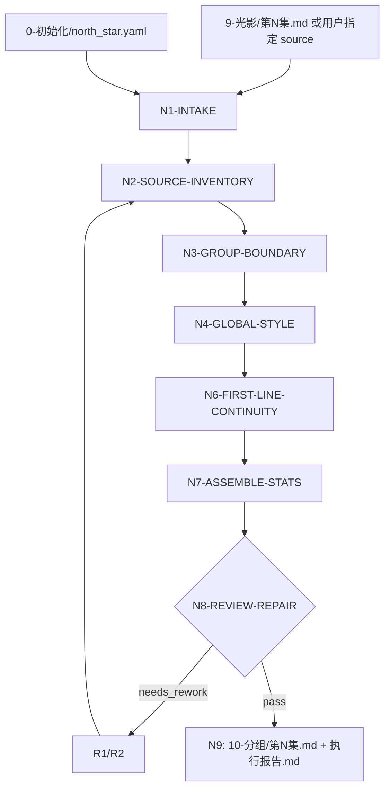

# aigc 10-分组

`10-分组` 负责把 `9-光影` 输出的逐集光影稿切分为可供主体设计、图像、画布和视频阶段消费的完整分镜组。默认上游为 `projects/aigc/<项目名>/9-光影/第N集.md`；用户显式指定其他文稿、粘贴文本或要求跳过光影稿时，以用户指定 source 优先，并在报告中记录 `source_override=true` 及被跳过的光影稿专属检查。

本技能不改写剧情事实、对白、场景顺序、分镜编号含义或上游摄影/光影内容。核心裁决是组边界、组级 `全局风格：`、首帧衔接/回龙帧内化、组底 YAML 统计和唯一 canonical 落盘。

术语：`回龙帧` 是组间连续性的内部执行口径。第二组起，当前组第一个普通 `分镜N（0-N秒）：` 或 `[0-N秒]` 时间码分镜行必须先复现上一组最后分镜的 `尾帧状态锚点`，再通过景别、机位、镜头角度、焦距、观看距离或焦点路径调整进入本组开始画面。`尾帧状态锚点` 至少包含：上一组尾帧可见主体、主体动作/姿态/运动余势、关键道具/介质/环境残留、光线/烟雾/水汽/碎片/声音余波等持续状态、已成立的保护线/战斗线/空间方位关系。若被回龙的画面点承托对白、独白、旁白或音效，首行必须同步带入对应声音内容。不得只承接情绪或空间大方向，不得直接开启新攻击、新场面或新主体动作而不复现尾帧状态锚点，不得原样复制上一组完整分镜行。若删掉下一组首行后，读者无法从画面中明确看到上一组最后分镜的主体、动作余势、关键介质/道具和光声残留，则判定 `FAIL-GROUP-12`。输出正文不得出现 `回龙帧：`、来源说明、规则说明、`增补首帧：` 或独立 `## A~B` 连接件。

## Context Loading Contract

- 每次调用 `$aigc-grouping` 时，必须同时加载同目录 `CONTEXT.md`。
- 每次调用本技能时，必须按 `Type Routing Matrix` 和 `Module Trigger Matrix` 加载被授权模块；不得因为目录存在而自动全量读取。
- 若任务绑定 `projects/aigc/<项目名>/`，必须先加载项目根 `MEMORY.md`，再加载项目根 `CONTEXT/` 中与角色、场景、道具、风格和制作约束相关的上下文文件。
- 项目任务中还必须只读消费 `projects/aigc/<项目名>/0-初始化/north_star.yaml`；若存在 `team.yaml.init_synthesis.stage_seed_summary."10-分组"`、`0-初始化/init_handoff.yaml.stage_entry_seeds.grouping_seed` 或 `north_star.yaml.创作阶段不变量.分组`，只转成 `init_team_synthesis_context`，不得触发 team 身份、旧 stage profile 或补造顾问问答。
- 核心分组边界、首帧衔接、`全局风格：` 单行整理和 YAML 语义统计必须由 LLM 直接完成；`scripts/` 只能做读取、格式扫描、时间码连续性、ID、旧字段、YAML 与机械统计校验。
- 脚本、映射表、规则模板、关键词锚点替换、句式轮换、同义改写、批量插入、正则套句、映射投影或固定分组模板不得生成或裁决分组正文、组边界、首帧衔接、`全局风格：` 单行整理或 YAML 语义统计；发现即触发 `FAIL-GROUP-SCRIPTED-PROJECTION`。
- 冲突优先级：用户显式请求 > 根 `AGENTS.md` / meta 规则 > 本 `SKILL.md` > 本 `Module Loading Matrix` 授权模块 > `agents/openai.yaml` > 项目 `MEMORY.md` > 项目 `CONTEXT/` > 本 `CONTEXT.md`。

## Runtime Spine Contract

| block_id | control_block | local_landing |
| --- | --- | --- |
| `B1` | Core Task Contract | 本节、`Input Contract`、`Output Contract` |
| `B2` | Input Contract | 必需输入、可选输入、拒绝条件 |
| `B3` | Type Routing Matrix | 光影稿、指定稿、剧本直入、repair、review 路由 |
| `B4` | Thinking-Action Node Map | N1-N9 主节点、证据、gate 和返工 |
| `B5` | Module Loading Matrix | 授权模块、禁止越权、返工目标 |
| `B5A` | Module Trigger Matrix | 任务信号 / fail code 到模块组合 |
| `B6` | Convergence Contract | 汇流条件、失败条件、返工目标 |
| `B7` | Review Gate Binding | Review question 到 gate / fail / report evidence |
| `B8` | Output Contract | 唯一输出路径、格式、命名和完成门 |
| `B9` | Learning / Context Writeback | 经验写回边界 |
| `B10` | Business Requirement Analysis Contract | 业务目标、对象、约束、成功标准、拓扑适配 |
| `B11` | Quantifiable Execution Criteria Contract | 覆盖范围、证据数量、阈值、重试 |
| `B12` | Attention Concentration Protocol | 注意力锚点、漂移检测、再集中入口 |
| `B13` | Checkpoint Contract | 高影响改动和验证检查点 |
| `B14` | Evaluation Prompt Contract | `test-prompts.json` 回归资产 |

## Business Requirement Analysis Contract

| field | requirement | evidence | fail_code |
| --- | --- | --- | --- |
| `business_goal` | 将逐集 `9-光影` 光影稿或用户指定逐集文稿切成下游可生产分镜组 | 用户请求、source、输出路径 | `FAIL-GROUP-BUSINESS-GOAL` |
| `business_object` | 被处理对象是单集内按场景排序的 `分镜N（N-N秒）：...` 行、兼容 `[N-N秒]` 行或用户指定剧本文稿 atomic unit | source inventory、scene map、shot line inventory | `FAIL-GROUP-BUSINESS-OBJECT` |
| `constraint_profile` | 保留上游事实与顺序；脚本不主创；默认 source 为 `9-光影`，指定 source 优先 | 本合同、source diff、用户指定 source | `FAIL-GROUP-CONSTRAINT` |
| `success_criteria` | 输出 `10-分组/第N集.md` 与执行报告；组 ID、风格、边界、回龙帧、YAML、保真和报告证据通过 | output manifest、review verdict、validator 输出 | `FAIL-GROUP-SUCCESS` |
| `complexity_source` | 复杂度来自 source 格式分型、14.5 秒组边界、光影稿保真、声画连续、`全局风格：` 单行整理和 YAML 统计汇流 | Type Routing、Node Map、Review Gate | `FAIL-GROUP-COMPLEXITY` |
| `topology_fit` | 先锁 source 与 north_star，再建场景/分镜清单，再裁边界，再写 `全局风格：` 单行整理和回龙帧，再统计和审查：1) 防止误改上游；2) 保证组边界可追踪；3) 保证下游生成可消费；4) 支持用户指定 source 跳过光影稿专属检查 | Visual Maps、Node Map、报告证据 | `FAIL-GROUP-TOPOLOGY-FIT` |

## Input Contract

Accepted input:

- 项目名、项目路径、单个或多个 `projects/aigc/<项目名>/9-光影/第N集.md` 光影稿文件。
- 用户指定的分镜稿、摄影稿、剧本/编导稿、粘贴文本、已有候选 `10-分组` 稿或修复目标。
- 用户要求“10-分组”“分组”“分镜组”“从 9-光影 到 10-分组”“把光影稿切分镜组”“直接用指定文稿分组”“修复 14.5 秒分组断裂”“首帧衔接”“回龙帧”等任务。

Required input:

- 可定位、可读取的单集 source；默认路径为 `projects/aigc/<项目名>/9-光影/第N集.md`。
- 可定位、可读取的 `projects/aigc/<项目名>/0-初始化/north_star.yaml`；用户提供等价风格文本时可作为 source override 证据记录。
- 至少一个目标集号，或允许默认处理 `9-光影/` / 用户指定源目录中全部 `第N集.md`。
- 标准光影路径：source 中至少有一条可识别 `分镜N（起始秒-结束秒）：...` 行，且能定位场景标题或等价场景锚点。
- 指定文稿路径：source 中存在可识别场景、动作、对白、音效、转场或分镜信息；若缺少显式时长，由 LLM 按约 14.5 秒/组规划连续时间码，并让每组最终累计结束秒以 `.5` 结尾，在报告声明时间码来源。

Optional input:

- 项目 `MEMORY.md` 中的长期衔接偏好、视觉惯性、下游视频模型限制。
- 用户指定目标组时长、最大组长、对白密度、相邻组承接偏好、指定 source override 或只审查不写回。

Reject or clarify when:

- `north_star.yaml` 或等价风格文本不可用，且用户要求正式 canonical pass。
- 默认 `9-光影/第N集.md` 不存在、不可读，用户也未提供替代 source，且无法在项目上游阶段定位可读逐集文稿。
- 用户要求脚本自动生成分组正文、首帧衔接正文或统计结论。
- 用户要求改变剧情事实、改对白、删减 source 分镜、重排场景顺序或把多集混写成一个分镜组。
- 当前项目只存在旧编号分组目录而用户未明确允许兼容回读时，应报告路径漂移；本技能 canonical 输出为 `10-分组/`。

## Mode Selection

| mode | trigger | canonical_output |
| --- | --- | --- |
| `single_episode_lighting_source` | 指定单个集号或默认光影稿单集 | `projects/aigc/<项目名>/10-分组/第N集.md` |
| `specified_source_override` | 用户显式指定非 `9-光影` source、粘贴文本或要求跳过光影稿 | 候选或 canonical 输出；报告记录 `source_override=true` 与 skipped checks |
| `direct_screenplay` | 用户指定剧本/编导稿，或缺少逐分镜时长但存在可读逐集剧本源 | LLM 规划约 14.5 秒/组且最终累计结束秒以 `.5` 结尾，报告声明时间码来源 |
| `episode_range` | 指定多个集号或集号范围 | 多个逐集分镜组稿与更新后的执行报告 |
| `all_ready_episodes` | 未指定集号但 `9-光影/` 下有 `第N集.md` | 全部可读逐集分镜组稿 |
| `repair` | 已有分组稿 ID、边界、时长、回龙帧、旧字段、YAML 或报告证据错误 | 最小修复后的分组稿与修复报告 |
| `review_only` | 用户只要求检查 `10-分组` 输出 | 审查报告，不改写正文 |

## Type Routing Matrix

| input_type | signal | route_to | required_nodes | module_load | fail_code |
| --- | --- | --- | --- | --- | --- |
| `single_episode_lighting_source` | 默认 `9-光影/第N集.md` 或单集光影稿 | `Lighting Source Path` | `N1,N2,N3,N4,N6,N7,N8,N9` | `CONTEXT.md`, `types/grouping-type-map.md`, `references/group-boundary-contract.md`, `references/north-star-projection-contract.md`, `references/statistics-yaml-contract.md`, `review/review-contract.md` | `FAIL-GROUP-TYPE-LIGHTING` |
| `specified_source_override` | 用户指定非默认 source | `Override Source Path` | `N1,N2,N3,N4,N6,N7,N8,N9` | `CONTEXT.md`, `types/grouping-type-map.md`, `references/group-boundary-contract.md`, `references/north-star-projection-contract.md`, `references/statistics-yaml-contract.md`, `review/review-contract.md` | `FAIL-GROUP-TYPE-OVERRIDE` |
| `direct_screenplay` | 剧本/编导稿直入或无分镜时长 | `Direct Screenplay Path` | `N1,N2,N3,N4,N6,N7,N8,N9` | `CONTEXT.md`, `types/grouping-type-map.md`, `references/group-boundary-contract.md`, `references/north-star-projection-contract.md`, `references/statistics-yaml-contract.md`, `review/review-contract.md` | `FAIL-GROUP-DIRECT-SCREENPLAY` |
| `repair` | 既有稿需修复 | `Repair Path` | `N1,R1,R2,N8,N9` | `CONTEXT.md`, `types/grouping-type-map.md`, `review/review-contract.md`, `scripts/` | `FAIL-GROUP-TYPE-REPAIR` |
| `review_only` | 只审查 | `Review Path` | `N1,V1,N9` | `CONTEXT.md`, `review/review-contract.md`, `scripts/` | `FAIL-GROUP-TYPE-REVIEW` |

## Field Master

| field | source | output/use | owner | gate |
| --- | --- | --- | --- | --- |
| `source_lighting_path` | 默认 `projects/aigc/<项目名>/9-光影/第N集.md` | frontmatter、执行报告、保真对照 | `N1-INTAKE` | `GATE-GROUP-01` |
| `source_override_path` | 用户指定文稿、粘贴文本或 direct screenplay source | 覆盖默认 source；报告记录 `source_override=true` | `N1-INTAKE` | `GATE-GROUP-01` / `GATE-GROUP-DIRECT-SCREENPLAY` |
| `source_state` | source 分型结果 | `complete_lighting`、`specified_override`、`direct_screenplay`、`repair` | `N1-INTAKE` | `GATE-GROUP-01D` |
| `scene_map` | source 场景标题 | 分镜组 ID 第二段和场景标题重复输出 | `N2-SOURCE-INVENTORY` | `GATE-GROUP-01A` / `GATE-GROUP-05` |
| `shot_line_inventory` | `分镜N（起始秒-结束秒）：` 或兼容 `[起始秒-结束秒]` 行 | atomic unit、时长累计、落盘时间码改写 | `N2-SOURCE-INVENTORY` / `N3-GROUP-BOUNDARY` | `GATE-GROUP-06` / `GATE-GROUP-08` |
| `group_boundary_plan` | source 分镜行、声画承托、场景边界 | `## x-y-z` 分镜组边界 | `N3-GROUP-BOUNDARY` | `GATE-GROUP-05` / `GATE-GROUP-06` |
| `global_style_projection_map` | `3-美学/画面基调/全局风格协议.md` 的 `Global Style Prompt`，以及必要的 `north_star.yaml` 项目禁区/不变量 | 每组 `全局风格：` 单行整理句 | `N4-GLOBAL-STYLE` | `GATE-GROUP-02` |
| `first_line_continuity_map` | 当前组首分镜、上一组尾分镜及尾帧状态锚点 | 每组第一个普通时间码分镜行 | `N6-FIRST-LINE-CONTINUITY` | `GATE-GROUP-14` |
| `stats_yaml` | 分组正文、角色/场景/道具证据 | 组底 YAML `字数统计`、`时长估算`、`角色`、`场景`、`道具` | `N7-ASSEMBLE-STATS` | `GATE-GROUP-11` |
| `execution_report` | N1-N8 决策证据 | `执行报告.md` | `N9-WRITEBACK-CLOSE` | `GATE-GROUP-REPORT` |

## Thinking-Action Node Map

| node_id | objective | inputs | actions | evidence | route_out | gate |
| --- | --- | --- | --- | --- | --- | --- |
| `N1-INTAKE` | 锁定项目、集号、source、模式、写回权限和注意力锚点 | 用户请求、项目根、source 文件 | 加载 skill/context；识别 `source_lighting_path`、`source_override`、`source_state`、`episode_id`、`3-美学/画面基调`、north_star 项目禁区、写回路径 | `source_manifest`, `visual_tone_manifest`, `north_star_manifest`, `business_profile`, `attention_anchor` | `N2` / `V1` / `N9` | source 不唯一、正式写回路径不明、画面基调不可用时不得继续 |
| `N2-SOURCE-INVENTORY` | 建立场景、分镜行和保真锚点 | source、types | 扫描场景标题、`分镜N（N-N秒）：` 行、兼容 `[N-N秒]` 行、对白/音效承托、现有摄影/光影信息 | `scene_map`, `shot_line_inventory`, `source_anchor_map`, `skipped_light_checks` | `N3` / `R1` | 默认光影路径漏分镜行 0；override 路径必须记录不适用检查 |
| `N3-GROUP-BOUNDARY` | 裁决约 14.5 秒分镜组边界 | N2 清单、boundary reference | 按完整 shot line / 声画 atomic unit 累计时长；通常 10-14.5 秒；不得超过 14.5 秒；每组最终累计结束秒必须以 `.5` 结尾，若自然相加不是 `.5` 结尾则在组尾上调 0.5 秒；跨场景重置组序 | `group_boundary_plan`, `duration_table`, `scene_group_index` | `N4` / `R1` | 不拆 atomic unit；超 14.5 秒必须重裁或回退 source owner |
| `N4-GLOBAL-STYLE` | 写每组 `全局风格：` | `3-美学/画面基调/全局风格协议.md`、north_star 项目禁区、当前组证据 | 按 `north-star-projection-contract.md` 的当前画面基调投影口径写单行风格：固定前置词 + 300 字以内当前组 `Global Style Prompt` 整理句 | `global_style_projection_map` | `N6` / `R1` | 每组均有单行内容；不能完整照抄母稿 |
| `N6-FIRST-LINE-CONTINUITY` | 内化首帧衔接 / 回龙帧 | 当前组首分镜、上一组尾分镜 | 首组自然整理开始画面；第二组起先提取上一组尾帧状态锚点的五类元素，再把主体、动作余势、关键道具/介质、光声残留、空间关系和必要声音承托写入首个普通时间码行 | `first_line_continuity_map`, `tail_state_anchor_map`, `sound_support_map` | `N7` / `R1` | 首行必须能看见上一组尾帧状态锚点；不输出特殊字段、规则说明、连接件；不新增剧情或改对白 |
| `N7-ASSEMBLE-STATS` | 组装正文和 YAML | N3-N6 输出 | 写 `## x-y-z`、场景标题、风格、分镜正文、YAML；统计角色/场景/道具并做同物合并 | `candidate_groups`, `stats_yaml`, `source_preservation_diff` | `N8` / `R1` | 输出结构唯一；正文保真；YAML 字段完整 |
| `N8-REVIEW-REPAIR` | 审查并最小修复候选稿 | candidate、review gates、validator | 执行 gate；可运行 validator；阻断项回到 N2-N7 或 R2，最多 3 轮 | `review_verdict`, `repair_log`, `reference_execution_matrix`, `rule_evidence_map` | `N9` / `R1` | review 未通过不得写回 canonical |
| `N9-WRITEBACK-CLOSE` | 写回唯一输出并生成报告 | passed candidate | 写入 `10-分组/第N集.md` 与 `执行报告.md`；报告记录 source、matrix、rule map、N/A、repair、残余风险 | `output_manifest`, `execution_report` | done | 正式写回不得缺执行报告 |
| `R1-ROOT-CAUSE` | 源层返工定位 | fail code、review evidence | 追到 source 分型、场景锚定、边界、风格、回龙帧、统计、模板、脚本或报告证据层 | `root_cause_trace` | `R2` / N2-N7 | 不得用泛化润色掩盖失败 |
| `R2-SYNC-REPAIR` | 修复已有分组稿 | existing draft、root cause | 只修失败组、失败字段、报告证据或 validator 误差；不得重写无关组 | `sync_patch` | `N8` | 修复后同类失败不得残留 |
| `V1-REVIEW` | 只审查分组稿 | candidate draft、source 可选 | 执行 Review Gate Binding 和机械校验，不改写正文 | `review_findings` | `N9` | findings 必须有证据、fail code 和返工目标 |

## Thought Pass Map

| pass_id | thinking_focus | action_node | pass_evidence | fail_return |
| --- | --- | --- | --- | --- |
| `P1-source` | 输入是否唯一、默认光影稿或 override 是否成立 | `N1-INTAKE` / `N2-SOURCE-INVENTORY` | `source_manifest`, `shot_line_inventory`, `skipped_light_checks` | `R1-ROOT-CAUSE` |
| `P2-boundary` | 分组边界是否以完整分镜行和约 14.5 秒为主，且最终累计结束秒以 `.5` 结尾 | `N3-GROUP-BOUNDARY` | `group_boundary_plan`, `duration_table`, `atomic_unit_table` | `N3` / `R1` |
| `P3-style` | `全局风格：` 是否取证且位置正确 | `N4-GLOBAL-STYLE` | `global_style_projection_map` | `N4` |
| `P4-continuity` | 首帧衔接/回龙帧是否内化到普通首行，是否复现尾帧状态锚点并同步声音承托 | `N6-FIRST-LINE-CONTINUITY` | `first_line_continuity_map`, `tail_state_anchor_map`, `sound_support_map` | `N6` / `R1` |
| `P5-assembly` | 正文、YAML、时间码、旧字段和保真是否可交付 | `N7-ASSEMBLE-STATS` / `N8-REVIEW-REPAIR` | `stats_yaml`, `legacy_field_scan`, `source_preservation_diff`, `review_verdict` | `N7` / `R2` |
| `P6-report` | 执行报告证据是否满足审计合同 | `N9-WRITEBACK-CLOSE` | `Reference Execution Matrix`, `Rule Evidence Map`, `N/A Justification`, `Repair Log` | `N8` |

## Visual Maps

## Module Loading Matrix

| module | load_when | authority | forbidden_use | rework_target |
| --- | --- | --- | --- | --- |
| `CONTEXT.md` | 每次调用 | 经验层、失败模式、修复策略 | 重定义输入、输出或完成门 | `Learning / Context Writeback` |
| `types/grouping-type-map.md` | N1 source 分型、override、repair | 输入状态、风险画像、策略选择 | 新增主入口或覆盖 Type Routing | `N1-INTAKE` |
| `references/group-boundary-contract.md` | 任意正式生成、repair、review | 边界、ID、时长、atomic unit、回龙帧规则 | 替代主节点或改写输出路径 | `N3-GROUP-BOUNDARY` / `N6-FIRST-LINE-CONTINUITY` |
| `references/north-star-projection-contract.md` | 任意正式生成、repair、review | `全局风格：` 单行投影 | 完整照抄全局母稿或新增风格真源 | `N4-GLOBAL-STYLE` |
| `references/statistics-yaml-contract.md` | 任意正式生成、repair、review | YAML 字段、统计口径、同物归并 | 直接生成角色/场景/道具设计稿 | `N7-ASSEMBLE-STATS` |
| `review/review-contract.md` | N8/V1 | 审查门、失败码、报告要求 | 代替业务真源或跳过返工 | `N8-REVIEW-REPAIR` |
| `templates/` | 需要输出样板或报告对齐时 | 输出格式样板 | 另立输出路径或完成门 | `Output Contract` |
| `scripts/` | 需要机械扫描、时间码、旧字段、YAML 检查时 | 只读机械校验 | 生成分组正文、边界、风格或 YAML 语义结论 | `Script And Metadata Contract` |
| `knowledge-base/grouping-heuristics.md` | N3/N6 反复出现边界/连续性失败，或用户要求经验参考 | 外部/经验资料补充 | 替代 `SKILL.md` gate 或直接主创 | `N3` / `N6` |

## Module Trigger Matrix

| trigger_signal | required_modules | load_phase | return_gate | mechanical_check |
| --- | --- | --- | --- | --- |
| `default_lighting_grouping` | `types/grouping-type-map.md`, `references/group-boundary-contract.md`, `references/north-star-projection-contract.md`, `references/statistics-yaml-contract.md`, `review/review-contract.md` | `N1-N8` | `GATE-GROUP-01` 到 `GATE-GROUP-16` | source line coverage、time ranges、YAML、旧字段 |
| `specified_source_override` | `types/grouping-type-map.md`, `references/group-boundary-contract.md`, `references/north-star-projection-contract.md`, `references/statistics-yaml-contract.md`, `review/review-contract.md` | `N1-N8` | `GATE-GROUP-SOURCE-OVERRIDE` | skipped checks 记录 |
| `direct_screenplay` | `types/grouping-type-map.md`, `references/group-boundary-contract.md`, `references/north-star-projection-contract.md`, `references/statistics-yaml-contract.md` | `N1-N7` | `GATE-GROUP-DIRECT-SCREENPLAY` | source_state 与 timecode source |
| `FAIL-GROUP-05, FAIL-GROUP-06, FAIL-GROUP-12` | `references/group-boundary-contract.md`, `review/review-contract.md` | `R1/R2` | boundary / continuity gates | duration table、first line scan |
| `FAIL-GROUP-02, FAIL-GROUP-11` | `references/north-star-projection-contract.md`, `review/review-contract.md` | `R1/R2` | style / legacy-field gates | style order scan、legacy field scan |
| `FAIL-GROUP-08, FAIL-GROUP-09` | `references/statistics-yaml-contract.md`, `scripts/` | `R1/R2` | stats / faithfulness gates | YAML parse、source diff |

## Quantifiable Execution Criteria Contract

| criteria_slot | required_content | landing_place | fail_code |
| --- | --- | --- | --- |
| `action_scope` | 单集任务处理 1 个 source；批量逐集独立执行 N1-N9；默认光影稿扫描全部 `分镜N（N-N秒）` 行 | `N2.actions` | `FAIL-GROUP-QUANT-SCOPE` |
| `evidence_count` | 每集至少 1 个 `source_manifest`、`scene_map`、`shot_line_inventory`、`group_boundary_plan`、`global_style_projection_map`、`legacy_field_scan`、`stats_yaml`、`review_verdict` | `Thinking-Action Node Map.evidence` | `FAIL-GROUP-QUANT-EVIDENCE` |
| `pass_threshold` | 阻断 gate 为 0；组内时长 `<=14.5s`；最终累计结束秒不以 `.5` 结尾的组数 0；ID 错误 0；旧连接件 0；旧字段 0；YAML 缺字段 0；source 无授权改写 0；脚本化生成、批量插入、正则套句、映射投影或固定分组模板伪差异 0 | `N8.gate` / `Convergence Contract` | `FAIL-GROUP-QUANT-THRESHOLD` |
| `retry_limit` | 同一集同一 fail code 最多 3 轮最小修复；仍失败则 blocked 并报告 source owner | `R1/R2.route_out` | `FAIL-GROUP-QUANT-RETRY` |
| `fallback_evidence` | source override、缺光影稿、无显式时长、north_star 等价文本、不可判定场景号均需报告 N/A 或降级原因 | `Review Gate Binding.report_evidence` | `FAIL-GROUP-QUANT-FALLBACK` |

## Convergence Contract

| convergence_point | pass_condition | fail_condition | evidence | rework_target |
| --- | --- | --- | --- | --- |
| `C1-source-and-style` | source 可读，north_star 或等价文本可用，模式明确 | source 缺失、集号不唯一、风格不可用 | `source_manifest`, `north_star_manifest` | `N1-INTAKE` |
| `C2-inventory` | 场景与分镜/atomic unit 可追踪 | 场景号无法定位且无报告策略；默认光影稿漏分镜行 | `scene_map`, `shot_line_inventory` | `N2-SOURCE-INVENTORY` |
| `C3-boundary` | 每组边界完整，通常 10-14.5 秒，硬上限 14.5 秒，最终累计结束秒以 `.5` 结尾 | 拆断 atomic unit、超时、跨场景混组、最终累计结束秒未以 `.5` 结尾 | `group_boundary_plan`, `duration_table` | `N3-GROUP-BOUNDARY` |
| `C4-assembly` | 组头、`全局风格：` 单行、回龙帧、YAML、保真和作者性完整性均可检查 | 旧字段、连接件、风格缺失、YAML 缺失、source 改写、脚本化生成、批量插入、正则套句、映射投影或固定模板伪差异 | `candidate_groups`, `source_preservation_diff`, `authorship_integrity_audit` | `N4-N7` |
| `C5-final` | review gate pass，报告证据完整，输出路径唯一 | 任一阻断 gate fail 或报告缺 matrix/rule map | `review_verdict`, `execution_report` | `N8-REVIEW-REPAIR` |

## Review Gate Binding

| review_question | review_gate | fail_code | rework_target | report_evidence |
| --- | --- | --- | --- | --- |
| source、north_star、source override 和 skipped checks 是否声明清楚？ | `GATE-GROUP-01` | `FAIL-GROUP-01` | `N1-INTAKE` | `source_manifest`, `north_star_manifest`, `skipped_light_checks` |
| 每组是否有场景标题行和单行 `全局风格：` 内容？ | `GATE-GROUP-02` | `FAIL-GROUP-02` | `N4-GLOBAL-STYLE` | `global_style_projection_map` |
| 分镜组 ID 是否为 `x-y-z` 且跨场景重置？ | `GATE-GROUP-05` | `FAIL-GROUP-04` | `N3-GROUP-BOUNDARY` | `scene_group_index` |
| 边界是否以完整 shot line / atomic unit 和约 14.5 秒为主，任一组不超过 14.5 秒，且最终累计结束秒以 `.5` 结尾？ | `GATE-GROUP-06` | `FAIL-GROUP-05` | `N3-GROUP-BOUNDARY` | `duration_table`, `boundary_reason` |
| 是否没有拆断同一分镜行、对白/画面承托或连续动作单元？ | `GATE-GROUP-08` | `FAIL-GROUP-06` | `N3-GROUP-BOUNDARY` | `atomic_unit_table` |
| 是否没有旧连接件或旧字段？ | `GATE-GROUP-09` | `FAIL-GROUP-07` / `FAIL-GROUP-11` | `N7-ASSEMBLE-STATS` | `legacy_field_scan` |
| source 正文是否未被无授权改写？ | `GATE-GROUP-13` | `FAIL-GROUP-09` | `N7-ASSEMBLE-STATS` | `source_preservation_diff` |
| 首帧衔接/回龙帧是否内化到普通首行，且第二组起首行能明确复现上一组尾帧状态锚点的主体、动作余势、关键道具/介质、光声残留和空间关系，并同步声音承托？ | `GATE-GROUP-14` / `GATE-GROUP-15` | `FAIL-GROUP-12` | `N6-FIRST-LINE-CONTINUITY` | `first_line_continuity_map`, `tail_state_anchor_map`, `sound_support_map` |
| direct screenplay 或无时长 source 是否声明时间码由本阶段规划？ | `GATE-GROUP-DIRECT-SCREENPLAY` | `FAIL-GROUP-DIRECT-SCREENPLAY` | `N1` / `N3` | `timecode_source_note`, `source_state` |
| 报告是否包含 Reference Execution Matrix、Rule Evidence Map、N/A、Repair Log？ | `GATE-GROUP-REPORT` | `FAIL-GROUP-REPORT-EVIDENCE` | `N8-REVIEW-REPAIR` | `execution_report_sections` |
| 分组边界、首帧衔接、组级风格和 YAML 语义统计是否由 LLM 基于 source atomic unit、north_star、组内声画连续和下游生产目标裁决，而非脚本、映射表、规则模板、关键词锚点替换、句式轮换、同义改写或固定分组模板批量生成？ | `GATE-GROUP-AUTHORSHIP` | `FAIL-GROUP-SCRIPTED-PROJECTION` | `R1-ROOT-CAUSE` -> `N3-GROUP-BOUNDARY` -> `N6-FIRST-LINE-CONTINUITY` | `authorship_integrity_audit`, `boundary_reason`, `discarded_candidate_log` |

## Root-Cause Execution Contract (Mandatory)

任何失败必须先归因再修复，不得用整体润色、重新生成或字段补空替代 root-cause 处理。

| failure_layer | symptom | root_cause_trace | repair_owner | stop_condition |
| --- | --- | --- | --- | --- |
| `source_layer` | 默认光影稿缺失、场景标题缺失、分镜行时长缺失、source override 未声明 | `source -> source_state -> skipped checks -> owner` | `N1-INTAKE` / source owner | source 不唯一或默认 source 缺 canonical 时间段且无 override 时停止 |
| `boundary_layer` | 拆断 atomic unit、跨场景混组、单组超过 14.5 秒、最终累计结束秒未以 `.5` 结尾 | `shot_line_inventory -> group_boundary_plan -> duration_table` | `N3-GROUP-BOUNDARY` | 同一 atomic unit 自身超过 14.5 秒时回退 source owner |
| `style_layer` | `全局风格：` 缺失、位置错误或证据不明 | `north_star/source evidence -> style map -> output position` | `N4-GLOBAL-STYLE` | 缺 north_star 或等价风格文本时停止 |
| `continuity_layer` | 首帧衔接缺失、尾帧状态锚点未复现、回龙帧写成字段、声音承托断裂 | `previous tail -> tail_state_anchor -> first line -> sound support` | `N6-FIRST-LINE-CONTINUITY` | 无上一组时只允许首组自然开始，不补伪回龙 |
| `assembly_layer` | YAML 缺字段、旧字段残留、正文被改写、时间码不连续 | `candidate -> validator/review -> sync_patch` | `N7-ASSEMBLE-STATS` / `R2-SYNC-REPAIR` | 修复只动失败组和失败字段 |
| `report_layer` | 执行报告缺 Reference Matrix、Rule Map、N/A 或 Repair Log | `review evidence -> report sections -> output manifest` | `N8-REVIEW-REPAIR` / `N9-WRITEBACK-CLOSE` | 证据缺失不得判定正式 pass |

## Script And Metadata Contract

| path | role |
| --- | --- |
| `scripts/README.md` | 说明脚本只能承担机械辅助，不替代 LLM 分组判断 |
| `scripts/validate_storyboard_groups.py` | 检查分镜组标题、场景标题行、`全局风格：`、旧字段、YAML、时间码连续累加、编号连续性和连接件残留；不能替代语义判断 |
| `agents/openai.yaml` | 产品入口元数据，默认提示必须显式提到 `$aigc-grouping` |

## Output Contract

- Required output:
  - `projects/aigc/<项目名>/10-分组/第N集.md`
  - `projects/aigc/<项目名>/10-分组/执行报告.md`
- Output format: Markdown 分镜组稿与 Markdown 执行报告。
- Output path: `projects/aigc/<项目名>/10-分组/`。
- Naming convention: 逐集分组稿为 `第N集.md`；分镜组 ID 为 `x-y-z`。
- Completion gate: 输入、边界、`全局风格`、首帧衔接/回龙帧、YAML、source 保真、机械校验和执行报告证据均通过；第二组起首个普通时间码行必须复现上一组尾帧状态锚点的主体、动作余势、关键道具/介质、光声残留和空间关系；旧字段 `增补首帧：`、`入场镜头：`、`出场画面：`、`画面属性：`、`画面构图：`、六类位置细节字段、`回龙帧：` 和 `## A~B` 连接件块不得出现在新产物中。
- `FAIL-GROUP-SCRIPTED-PROJECTION` 必须为 0；若候选稿由固定模板、锚点替换或句式轮换生成边界、首帧衔接、风格或 YAML 语义结论，候选稿不得表层润色通过，必须废弃并回到边界和组装节点由 LLM 重做。

## Execution Report Evidence Contract

正式写回 `projects/aigc/<项目名>/10-分组/` 时，执行报告必须包含：

- `Execution Decision Trace`：关键判断、适用规则、输入证据、取舍理由和输出落点。
- `Reference Execution Matrix`：逐条记录授权模块的 `reference`、`load_status`、`trigger_reason`、`applied_to`、`evidence_in_output`、`verdict`、`n/a_reason`。
- `Rule Evidence Map`：把 source、边界、`全局风格：`、回龙帧/尾帧状态锚点、YAML、保真、下游 handoff 等规则映射到输出位置或报告证据。
- `N/A Justification`：source override、缺光影稿、无显式时长、无需某模块等不适用理由。
- `Repair Log`：失败码、返工目标、修复结果和残余风险。

## Attention Concentration Protocol

| protocol_id | protocol | requirement | rework_entry |
| --- | --- | --- | --- |
| `ATTE-GROUP-01` | 注意力锚点声明 | 当前锚点始终是“把单集 source 切成可生产分镜组”，不是改写剧情或生成下游 prompt | `N1-INTAKE` |
| `ATTE-GROUP-02` | 注意力转移规则 | source 锁定后转 inventory；inventory 完成后转 boundary；boundary 完成后转全局风格与回龙帧；审查失败回到最近 source owner | `Thinking-Action Node Map` |
| `ATTE-GROUP-03` | 漂移检测 | 出现改剧情、重写对白、旧字段复活、脚本主创、source override 未声明、输出路径分裂即为漂移 | `Review Gate Binding` |
| `ATTE-GROUP-04` | 再集中机制 | 发现漂移时回到最近有效节点，不继续扩写当前局部文本；最终报告说明漂移与修复 | `R1-ROOT-CAUSE` |

## Checkpoint Contract

| checkpoint_id | checkpoint_trigger | required_action | pass_evidence | fail_code |
| --- | --- | --- | --- | --- |
| `CHK-GROUP-SCOPE` | 改输出路径、删除 steps、同步 registry/scripts、批量替换旧路径 | 记录影响面和验证命令 | sync manifest、rg 结果、git diff 摘要 | `FAIL-GROUP-CHECKPOINT-SCOPE` |
| `CHK-GROUP-SEMANTIC` | 定稿默认上游、source override、时长口径或回龙帧口径 | 确认业务画像、量化口径和返工入口 | business profile、quant criteria、review gate | `FAIL-GROUP-CHECKPOINT-SEMANTIC` |
| `CHK-GROUP-VALIDATION` | validator、audit 或 smoke test 失败 | 停止交付并回到 source artifact 修复 | 命令输出、失败码、返工目标 | `FAIL-GROUP-CHECKPOINT-VALIDATION` |

## Evaluation Prompt Contract

- `test-prompts.json` 必须覆盖默认光影稿分组、用户指定 source override、repair/review 至少三类典型任务。
- 修改输入口径、输出路径、模块触发或 validator 后，必须同步 `test-prompts.json`。
- 无法执行 full eval 时，最终报告必须声明 `eval_mode=dry_run` 或已运行的本地验证命令。

## Learning / Context Writeback

- 可复用失败模式、修复策略、validator 误报/漏报、source override 降级经验写入同目录 `CONTEXT.md`。
- 稳定规则才晋升到本 `SKILL.md`、reference、template 或 script。
- 项目偏好、禁区和长期口味写入项目根 `MEMORY.md`，不得写入技能 `CONTEXT.md`。
