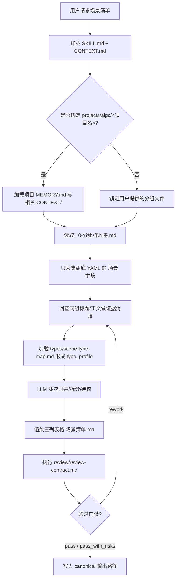
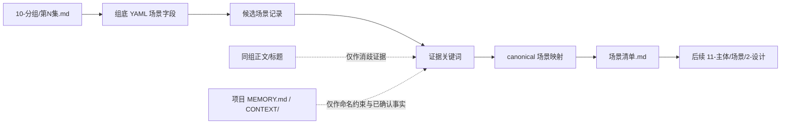
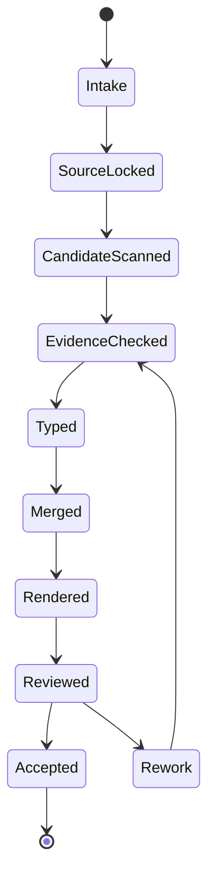

# aigc 11-主体 / 场景 / 1-清单

`场景清单` 负责从 `10-分组` 逐集分镜组稿的组底 YAML 中抽取并归并场景主体，输出供后续场景设计阶段使用的 table 式 Markdown 清单。它只建立“哪些场景需要设计”的清单真源，不扩写场景设定、不生成视觉方案、不替代后续场景设计稿。

## Context Loading Contract

- 每次调用 `$aigc-scene-list` 时，必须同时加载同目录 `CONTEXT.md`。
- 每次调用本技能时，必须同时识别并加载同目录 `types/` 中选中的类型包（单选或多选）。
- 若任务绑定 `projects/aigc/<项目名>/`，必须先加载项目根 `MEMORY.md`，再按需加载项目根 `CONTEXT/` 中与场景命名、地点设定、项目特殊偏好相关的上下文文件。
- 上游唯一准确信息来源为 `projects/aigc/<项目名>/10-分组/第N集.md` 每个分镜组底部 YAML 的 `场景` 字段；必要时只允许回查同一分镜组正文和场景标题作为证据。
- 冲突优先级：用户显式请求 > 根 `AGENTS.md` / meta 规则 > 本 `SKILL.md` > `references/` / `steps/` / `review/` / `types/` / `templates/` > `agents/openai.yaml` > 项目 `MEMORY.md` > 项目 `CONTEXT/` > 本 `CONTEXT.md`。
- 场景别名归并、代称判定、同一地点不同区域/时段的合并或拆分，必须由 LLM 直接完成；`scripts/` 只能做读取、字段检查、表格格式检查和机械校验。

## Input Contract

Accepted input:

- 项目名、项目路径、单个或多个 `projects/aigc/<项目名>/10-分组/第N集.md` 文件。
- 用户要求“场景清单”“从分组稿提取场景”“生成 11-主体/场景/1-清单”等任务。
- 已完成或部分完成的 `10-分组` 逐集稿；默认按集读取 `第N集.md`。

Required input:

- 可定位、可读取的 `projects/aigc/<项目名>/10-分组/第N集.md`。
- 每个可消费分镜组底部存在 YAML 统计块，且包含 `场景` 字段。
- 至少一个目标集号，或允许默认处理 `10-分组/` 中全部 `第N集.md`。

Optional input:

- 项目 `MEMORY.md` 中对场景命名、地域词、世界观禁区或长期风格偏好的约束。
- 项目 `CONTEXT/` 中已确认的地点表、校区/建筑结构、世界观资料或用户指定的场景命名词表。
- 用户指定是否输出或更新 `执行报告.md`。

Reject or clarify when:

- 上游 `10-分组/第N集.md` 不存在、不可读，且用户没有提供替代文件。
- 分镜组底部 YAML 缺少 `场景` 字段，或无法判断某段 YAML 属于哪个分镜组。
- 用户要求从剧情想象补充未在 `场景` 字段出现的场景；只能把正文/标题作为证据回查，不能作为新增主体的唯一来源。
- 用户要求脚本自动完成别名归并、空间拆分或创作性裁决；必须改为 LLM 主判、脚本只校验。

## Mode Selection

| mode | 触发信号 | 输出 |
| --- | --- | --- |
| `single_episode` | 指定单个 `第N集.md` 或单个集号 | 更新后的 `场景清单.md` 与可选报告 |
| `episode_range` | 指定多个集号或集号范围 | 汇总归并后的 `场景清单.md` 与可选报告 |
| `all_grouped_episodes` | 未指定集号但 `10-分组/` 下有 `第N集.md` | 全部可读集的场景清单 |
| `incremental_merge` | 既有 `场景清单.md` 存在，且 `10-分组` 新增/更新了部分 `第N集.md` | merge 更新清单、执行报告与可选 `design-manifest.yaml` |
| `repair` | 已有清单存在重复、误合、漏项、字段不齐或首次登场错误 | 最小修复后的 `场景清单.md` 与风险说明 |
| `review_only` | 用户只要求检查场景清单 | 审查报告，不改写清单，除非用户随后要求修复 |

## Reference Loading Guide

| 场景 | 必读文件 |
| --- | --- |
| 任意场景清单任务 | `references/source-and-merge-contract.md`、`steps/scene-list-workflow.md` |
| 既有清单与新增上游对账 | `../../references/incremental-reconciliation-contract.md` |
| 别名、代称、同地点不同区域/时段处理 | `types/scene-type-map.md` |
| 输出质量审查与风险报告 | `review/review-contract.md` |
| 输出样板 | `templates/output-template.md` |
| 脚本辅助边界 | `scripts/README.md` |
| 可复用经验 | `knowledge-base/scene-list-heuristics.md` |
| 产品入口元数据 | `agents/openai.yaml` |

## Visual Maps

## Execution Contract

1. 读取本 `SKILL.md + CONTEXT.md`，并在项目任务中加载项目根 `MEMORY.md` 与相关 `CONTEXT/` 文件。
2. 锁定输入集号与 `projects/aigc/<项目名>/10-分组/第N集.md` 文件；若既有 `场景清单.md` 或 `design-manifest.yaml` 存在，先读取并建立本轮 `reconcile_delta`。
3. 为每个候选项记录证据：分镜组 ID、集号、场景标题或同组正文关键词；正文和标题只能用于证据回查和命名消歧。
4. 只从每个分镜组底部 YAML 的 `场景` 字段采集候选场景；新增上游只能新增候选或补充证据，不得让旧清单被静默全量覆盖。
5. 按 `references/source-and-merge-contract.md` 与 `../../references/incremental-reconciliation-contract.md` 执行 LLM 归并：识别别名、代称、同一地点不同区域/时段、跨场景或子空间边界。
6. 按 `types/scene-type-map.md` 为每个候选判断处理类型：直接保留、别名归并、区域拆分、时段合并、跨空间拆分或风险待核。
7. merge 写回 table 式 Markdown 清单，主体字段固定为 `名称`、`首次登场`、`原文描述（关键词式）`；首次登场取所有已知来源中最早分镜组。
8. 写入 `projects/aigc/<项目名>/11-主体/场景/1-清单/场景清单.md`，并按需写入 `projects/aigc/<项目名>/11-主体/场景/1-清单/执行报告.md`；可同步更新 `projects/aigc/<项目名>/11-主体/场景/design-manifest.yaml` 的 source/subject 映射。
9. 按 `review/review-contract.md` 执行验收；可运行机械校验脚本或人工等价 review，但脚本不得替代 LLM 做归并判断。

## Script And Metadata Contract

| path | role |
| --- | --- |
| `scripts/README.md` | 说明脚本只能承担机械辅助，不替代 LLM 场景归并与拆分判断 |
| `agents/openai.yaml` | 提供产品侧入口元数据，默认提示必须显式提到 `$aigc-scene-list` |

## Field Mapping

| field_id | 输出/证据 | 内容要求 | 失败码 |
| --- | --- | --- | --- |
| `FIELD-SCENE-LIST-01` | 输入取证 | 项目路径、目标集号、上游 `10-分组/第N集.md` 可回指 | `FAIL-SCENE-LIST-01` |
| `FIELD-SCENE-LIST-02` | YAML 来源 | 每个主体来自组底 YAML `场景` 字段 | `FAIL-SCENE-LIST-02` |
| `FIELD-SCENE-LIST-03` | 证据回查 | 分镜组 ID、场景标题或正文关键词可说明首次登场与命名 | `FAIL-SCENE-LIST-03` |
| `FIELD-SCENE-LIST-04` | 归并裁决 | 别名、代称、区域、时段、子空间处理有一致理由 | `FAIL-SCENE-LIST-04` |
| `FIELD-SCENE-LIST-05` | 表格字段 | 仅使用固定主体字段：`名称`、`首次登场`、`原文描述（关键词式）` | `FAIL-SCENE-LIST-05` |
| `FIELD-SCENE-LIST-06` | 输出落盘 | canonical 路径存在，报告可选且不替代清单真源 | `FAIL-SCENE-LIST-06` |
| `FIELD-SCENE-LIST-07` | LLM-first | 脚本没有生成归并、别名裁决或创作性描述 | `FAIL-SCENE-LIST-07` |
| `FIELD-SCENE-LIST-08` | 增量 merge | 既有清单被读取并对账，新主体追加、旧主体稳定，未静默全量覆盖 | `FAIL-SCENE-LIST-08` |

## Thought Pass Map

| step_id | pass_name | input | judgment | output |
| --- | --- | --- | --- | --- |
| `PASS-SCENE-LIST-01` | 输入锁定 | 项目路径、目标集号、`10-分组/第N集.md` | 是否具备组底 YAML `场景` 字段和分镜组 ID | `input_manifest` |
| `PASS-SCENE-LIST-02` | 候选采集 | 逐组 YAML `场景` 字段 | 候选是否只来自上游 YAML，正文/标题是否仅作同组补证 | `scene_candidates` |
| `PASS-SCENE-LIST-03` | 增量对账 | 既有清单、manifest、候选场景 | 新主体、归并候选、编号/文件锚点风险是否识别 | `reconcile_delta` |
| `PASS-SCENE-LIST-04` | 场景归并 | 候选场景、场景标题、同组正文关键词 | 别名、代称、区域、时段、子空间是否应归并或拆分 | `canonical_scene_map` |
| `PASS-SCENE-LIST-05` | 首次登场裁决 | canonical 场景与出现顺序 | 最早可回指分镜组 ID 是否准确 | `first_appearance_map` |
| `PASS-SCENE-LIST-06` | 表格落盘 | canonical 映射与关键词证据 | 三列是否固定且无扩写场景设计稿 | `场景清单.md` |
| `PASS-SCENE-LIST-07` | 验收回查 | 清单与上游文件 | 来源、归并/拆分、字段和路径是否通过 review gate | `review_result` |

## Pass Table

| pass_id | must_do | evidence | Rework Entry |
| --- | --- | --- | --- |
| `PASS-SCENE-LIST-01` | 读取本技能与项目上下文，锁定 `10-分组` 输入 | input manifest | `references/source-and-merge-contract.md` |
| `PASS-SCENE-LIST-02` | 只从组底 YAML `场景` 字段采集候选 | 候选清单与分镜组 ID | `steps/scene-list-workflow.md` |
| `PASS-SCENE-LIST-03` | 对既有清单和新增上游执行 merge 对账 | `reconcile_delta` | `../../references/incremental-reconciliation-contract.md` |
| `PASS-SCENE-LIST-04` | 由 LLM 裁决别名、区域、时段和子空间归并/拆分 | canonical scene map | `types/scene-type-map.md` |
| `PASS-SCENE-LIST-05` | 选择最早分镜组作为首次登场 | first appearance map | `review/review-contract.md` |
| `PASS-SCENE-LIST-06` | 输出固定三列表格 | `场景清单.md` | `templates/output-template.md` |
| `PASS-SCENE-LIST-07` | 执行人工或等价机械验收 | review result | `review/review-contract.md` |

## Root-Cause Execution Contract (Mandatory)

出现以下问题时，必须沿链路上溯并修复源层合同：

- 从正文或场景标题新增了未出现在组底 YAML `场景` 字段中的主体。
- 把同一地点的别名拆成多个场景，或把不同空间误合成一个场景。
- 将“同一地点的不同区域/子空间”错误归并，导致后续设计无法分别制作。
- 将“同一空间的日/夜、过去/现在、正常/异化状态”机械拆分，导致重复清单膨胀。
- `首次登场` 没有指向最早出现的分镜组。
- `原文描述（关键词式）` 被扩写成设定稿、视觉设计稿或创作性文案。
- 新增部分集数后用局部结果覆盖了既有全局清单，或导致已有 `S###` 设计稿锚点漂移。
- 脚本、模板拼接或规则替代 LLM 的归并判断。

必经链路：

`Symptom -> Direct Script/Prompt Overreach -> 场景清单 Section Owner -> 10-分组 YAML Contract -> AGENTS.md LLM-first / Skill 2.0 Rule`

## Output Contract

### Required output

1. 场景清单固定写入 `projects/aigc/<项目名>/11-主体/场景/1-清单/场景清单.md`。
2. 清单必须是 table 式 Markdown。
3. 每个主体字段固定为：`名称`、`首次登场`、`原文描述（关键词式）`。
4. `名称` 是归并后的 canonical 场景名；别名、代称、同一地点的区域/时段处理结果应体现在名称或关键词中，但不得新增字段破坏主体表。
5. `首次登场` 使用最早出现该场景的分镜组 ID，必要时可附集号，例如 `第1集 1-1-1`。
6. `原文描述（关键词式）` 只写来自 YAML `场景` 字段、同组场景标题或正文证据的关键词，不扩写成场景设计。
7. 可选执行报告写入 `projects/aigc/<项目名>/11-主体/场景/1-清单/执行报告.md`，用于记录输入范围、归并风险、待核项和校验结果。
8. 可选增量状态索引写入 `projects/aigc/<项目名>/11-主体/场景/design-manifest.yaml`；它只是 sidecar，不替代 `场景清单.md`。

### Output format

| output_id | format |
| --- | --- |
| `OUTPUT-SCENE-LIST` | Markdown table |
| `OUTPUT-SCENE-LIST-REPORT` | Markdown 执行报告，可选 |

### Output path

| output_id | canonical path |
| --- | --- |
| `OUTPUT-SCENE-LIST` | `projects/aigc/<项目名>/11-主体/场景/1-清单/场景清单.md` |
| `OUTPUT-SCENE-LIST-REPORT` | `projects/aigc/<项目名>/11-主体/场景/1-清单/执行报告.md` |
| `OUTPUT-SCENE-MANIFEST` | `projects/aigc/<项目名>/11-主体/场景/design-manifest.yaml` |

### Naming convention

- 主清单固定命名为 `场景清单.md`。
- 可选报告固定命名为 `执行报告.md`。
- 场景设计稿已有 `S###` 锚点时，清单 merge 不得重排旧主体；新增主体只追加新稳定编号建议。
- 不创建 `scene-list.md`、`场景列表.md`、`清单.md` 或其他平行真源，除非用户显式指定兼容导出。
- 分镜组 ID 沿用上游 `10-分组` 的 `x-y-z`：`集-场-组`，不改写为四段式分镜帧 ID。

### Completion gate

- 已读取本 `SKILL.md + CONTEXT.md`，并在项目任务中加载项目 `MEMORY.md` 与相关项目 `CONTEXT/`。
- 已读取目标 `10-分组/第N集.md`，并能回指每个主体来自组底 YAML `场景` 字段。
- 表格只包含固定主体字段：`名称`、`首次登场`、`原文描述（关键词式）`。
- 已完成别名、代称、区域/时段、子空间与跨场景边界的 LLM 裁决，并记录风险。
- 若已有清单或 manifest，已执行 merge 对账，未静默覆盖旧清单、旧设计稿锚点或旧生成资产。
- 未使用脚本生成归并判断或创作性场景描述。
- 已执行 `review/review-contract.md` 的验收，或写明等价人工 review 结果。
