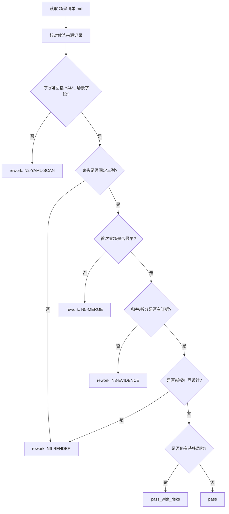

# Review Contract

## Review Goals

场景清单验收聚焦来源、归并、字段和越权边界。

## Review Flow

## Review Gates

| gate_id | gate | blocking_condition | rework_target |
| --- | --- | --- | --- |
| `GATE-SCENE-LIST-01` | Source lock | 最终清单任一场景主体不能回指组底 YAML `场景` 字段 | `N2-YAML-SCAN` |
| `GATE-SCENE-LIST-02` | Evidence boundary | 同组标题、正文、项目记忆或上下文被当作新增主体来源，而不是消歧证据 | `N3-EVIDENCE` |
| `GATE-SCENE-LIST-03` | Candidate record completeness | 候选记录缺少来源集号、分镜组 ID、YAML 原值或必要消歧关键词 | `N2-YAML-SCAN` / `N3-EVIDENCE` |
| `GATE-SCENE-LIST-04` | Merge and split decision | 别名、代称、区域、时段、状态、子空间或路线的归并/拆分没有可回查理由 | `N4-TYPE-PROFILE` / `N5-MERGE` |
| `GATE-SCENE-LIST-05` | First appearance | `首次登场` 不是归并后所有候选里最早的分镜组 ID | `N5-MERGE` |
| `GATE-SCENE-LIST-06` | Render boundary | 表格字段漂移，或 `原文描述（关键词式）` 扩写成设定稿、视觉方案、创作性文案 | `N6-RENDER` |
| `GATE-SCENE-LIST-07` | LLM-first merge | 脚本、模板或规则拼接替代 LLM 完成别名、子空间、时段状态或路线裁决 | `N5-MERGE` |
| `GATE-SCENE-LIST-08` | Risk landing | 无法裁决的归并/拆分风险没有进入待核项、finding 或执行报告 | `N7-REVIEW` |

## Fail Codes

| fail_code | meaning | route |
| --- | --- | --- |
| `FAIL-SCENE-SOURCE` | 场景主体来自 YAML `场景` 字段之外，或无法回指来源分镜组 | `N2-YAML-SCAN` |
| `FAIL-SCENE-EVIDENCE` | 命名、首次登场或归并消歧缺少同组标题/正文/项目上下文证据 | `N3-EVIDENCE` |
| `FAIL-SCENE-TYPE` | 子空间、时段、状态、路线或跨空间类型判断错误 | `N4-TYPE-PROFILE` |
| `FAIL-SCENE-MERGE` | 不同空间误合、同一空间重复拆分，或 alias/canonical 裁决无依据 | `N5-MERGE` |
| `FAIL-SCENE-RENDER` | 输出表头、关键词边界或设计扩写违反清单模板 | `N6-RENDER` |
| `FAIL-SCENE-LLM-FIRST` | 脚本或模板替代 LLM 做归并、拆分、命名或创作性判断 | `N5-MERGE` |
| `FAIL-SCENE-REVIEW` | 验收未执行、待核风险未落地，或报告证据不足 | `N7-REVIEW` |

## Checklist

| check_id | requirement | severity |
| --- | --- | --- |
| `REV-SCENE-01` | 每个场景主体都能回指至少一个组底 YAML `场景` 字段 | blocking |
| `REV-SCENE-02` | 表格字段固定为 `名称`、`首次登场`、`原文描述（关键词式）` | blocking |
| `REV-SCENE-03` | `首次登场` 是归并后最早分镜组 ID | blocking |
| `REV-SCENE-04` | 别名、代称、区域、时段、子空间处理有可解释依据 | major |
| `REV-SCENE-05` | 没有把不同空间误合，也没有把同一空间机械重复拆分 | major |
| `REV-SCENE-06` | 关键词没有扩写成场景设计、视觉方案或新增设定 | major |
| `REV-SCENE-07` | 脚本只做机械校验，没有生成归并或创作性裁决 | blocking |

## Finding Schema

| field | required | meaning |
| --- | --- | --- |
| `check_id` | yes | 命中的 review 条目。 |
| `severity` | yes | `blocking`、`major` 或 `minor`。 |
| `scene_name` | yes | 涉及的 canonical 场景名或候选值。 |
| `evidence` | yes | YAML 来源、分镜组 ID、表格行或缺失证据说明。 |
| `route` | yes | 返工目标节点：`N2-YAML-SCAN`、`N3-EVIDENCE`、`N5-MERGE` 或 `N6-RENDER`。 |
| `suggested_fix` | yes | 最小修复动作，不直接替主执行者改写真源。 |

## Verdict

| verdict | meaning |
| --- | --- |
| `pass` | 可交付 |
| `pass_with_risks` | 可交付，但报告中必须列出待核风险 |
| `rework` | 必须回到对应 workflow 节点修复 |

## Severity Routing

| severity | effect | required_action |
| --- | --- | --- |
| `blocking` | 不可交付 | 修复后重新 review。 |
| `major` | 可导致后续设计缺资产或重复资产 | 默认 rework；若证据不足但风险已记录，可 `pass_with_risks`。 |
| `minor` | 不影响清单真源但影响可读性 | 可随本轮修正或记录到报告。 |

## Provider Note

可使用 reviewer 或机械脚本辅助检查格式与来源完整性；任何 provider 输出都不得直接改写场景清单真源，必须由主执行者聚合裁决后落盘。
