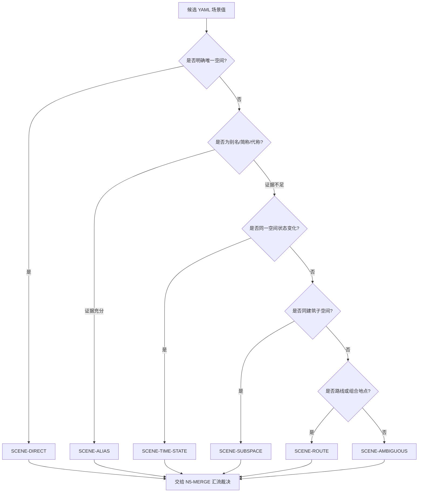

# Scene Type Map

## 类型包加载边界

- 每次调用本技能时，必须依据本文件识别并加载同目录 `types/` 中选中的类型包（单选或多选）。
- `types/` 中命中的类型包作为固定上下文加载；`knowledge-base/` 只作为按需检索、切片或向量召回的知识库，不替代类型包。

## Type Variables

| variable | question | impact |
| --- | --- | --- |
| `source_specificity` | YAML `场景` 字段是明确空间、泛称、别名还是组合地点？ | 决定是否需要证据回查与待核标记。 |
| `alias_evidence` | 同组正文、标题或项目上下文能否证明两个名称指向同一空间？ | 决定是否可归并为 canonical 名称。 |
| `asset_delta` | 时段、状态或异化变化是否需要独立场景资产？ | 决定状态类场景是否拆分。 |
| `spatial_boundary` | 房间、门口、走廊、天台、地下室等是否是可制作独立空间？ | 决定同建筑内子空间是否拆分。 |
| `route_span` | YAML 是否表达路线、镜头切换或组合地点？ | 决定是否拆成多个可制作空间。 |
| `risk_level` | 证据是否足以裁决？ | 决定直接落表还是写入待核风险。 |

## Decision Flow

## Type Profiles

| type_id | trigger | default_route | merge_policy | review_focus |
| --- | --- | --- | --- | --- |
| `SCENE-DIRECT` | YAML 场景名称清晰且唯一 | 直接保留 | 同名归并 | 首次登场 |
| `SCENE-ALIAS` | 全称/简称/代称/错别字指向同一空间 | 归并 | 使用最清晰 canonical 名称 | 关键词保留别名 |
| `SCENE-TIME-STATE` | 同一空间出现日夜、过去/现在、正常/异化等状态 | 默认归并 | 资产差异明显时拆分 | 避免重复膨胀 |
| `SCENE-SUBSPACE` | 同建筑内不同房间、门口、走廊、天台等 | 默认拆分 | 若只是泛称镜头可归并 | 避免误合 |
| `SCENE-ROUTE` | YAML 写成路线或组合地点 | 拆成可制作空间 | 保留组合证据 | 是否跨场景 |
| `SCENE-AMBIGUOUS` | 来源不足以判断是否同一空间 | 待核 | 保守保留或报告风险 | 不强行裁决 |

## Route Matrix

| type_id | required_reference | workflow_node | default_output_treatment | rework_trigger |
| --- | --- | --- | --- | --- |
| `SCENE-DIRECT` | `references/source-and-merge-contract.md` | `N5-MERGE` | 保留 canonical 名称，取最早登场 | 同名重复或首次登场错误 |
| `SCENE-ALIAS` | `references/source-and-merge-contract.md` | `N3-EVIDENCE` -> `N5-MERGE` | 归并为最清晰名称，关键词保留别名 | 归并依据不可回查 |
| `SCENE-TIME-STATE` | `knowledge-base/scene-list-heuristics.md` | `N5-MERGE` | 默认合并；资产差异明显才拆分 | 机械按昼夜/状态拆行 |
| `SCENE-SUBSPACE` | `references/source-and-merge-contract.md` | `N4-TYPE-PROFILE` -> `N5-MERGE` | 默认拆分为可制作子空间 | 大场景吞掉独立空间 |
| `SCENE-ROUTE` | `references/source-and-merge-contract.md` | `N3-EVIDENCE` -> `N5-MERGE` | 拆成可制作空间，关键词保留路线证据 | 把移动路线压成一个场景 |
| `SCENE-AMBIGUOUS` | `review/review-contract.md` | `N7-REVIEW` | 保守落表并报告待核，或请求用户确认 | 无证据强行二选一 |

## Decision Notes

- “同一地点 + 状态变化”优先问资产是否不同。
- “同一建筑 + 空间边界变化”优先问镜头是否需要独立布景。
- 代称归并必须能回查同组正文或项目上下文，不能只凭语感。
