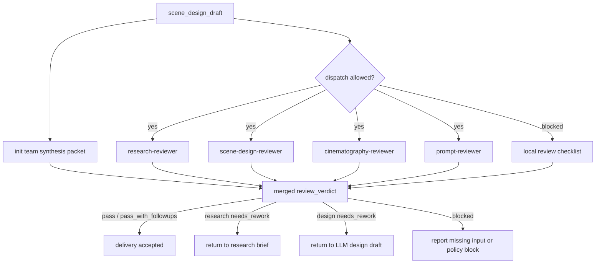

# Review Contract

本文件定义 `$aigc-scene-design` 的质量门禁、初始化综合/reviewer 路径和本地 checklist 口径。

## Default Reviewer Path

在当前上层策略允许外部 provider 调度，且用户显式要求或仓库治理合同视为已授权时，默认 reviewer 路径如下：

初始化综合消费按 `../../../_shared/team-advisor-consultation-contract.md` 执行：只读消费项目 `team.yaml.init_synthesis.stage_seed_summary."11-主体"`、`init_handoff.design_seed` 或 `north_star.yaml.创作阶段不变量.设计`，形成 `init_team_synthesis_context` 后再进入单场景设计与 reviewer 汇流；不得在本阶段解析监制 roster、请教顾问、调用 team 身份或补造顾问问答。

默认 review 必须同时读取 `references/design-output-contract.md`、`references/design-slot-review-contract.md` 与 `references/workflow-supervision-contract.md`；`SCENE-BUNDLE-01` 必须被解析为非空 slot bundle 记录。

| reviewer | scope | blocking checks |
| --- | --- | --- |
| `research-reviewer` | `research_brief`、来源姿态、冷门信息、事实/推断边界、不确定性与视觉翻译 | 无研究简报、冷门事实无来源策略、猜测伪装事实、研究无法落到可见设计 |
| `scene-design-reviewer` | Scene Design 字段、空间结构、材质、可制作资产 | 缺空间结构、缺建筑风格、不可制作 |
| `cinematography-reviewer` | 摄影字段、构图、光线、镜头逻辑 | 与场景无关、泛电影感、缺光线/镜头 |
| `prompt-reviewer` | 英文 prompt 主体 ID 开头、画面基调、场景风格、时间与地域锚点、`prompt_evidence_chain`、字符数 | 非英文、未以主体 ID 号开头、超 2000 characters、缺引用、缺时间或地域、关键 token 无证据链 |

若当前 system/developer/tool 层无法外部执行 reviewer，允许使用本地 checklist，但必须报告：

- 不可用来源层级。
- reviewer 路径。
- 实际采用的本地路径。
- 哪些 advisor / reviewer 没有外部执行。

## Reviewer Merge Map



## Review Dimensions

| dimension | checks |
| --- | --- |
| source | 每个设计稿可回指上游清单行、north star 和 team |
| structure | 模板板块齐全，`## 4. 解构` 下方先写 `主体ID号：<主体ID>`，`Scene Design` / `Cinematography` 分开 |
| research | 研究与场景类型相关，包含 `research_brief`、来源姿态、证据矩阵和不确定性处理 |
| visual_translation | 研究判断能翻译为空间结构、材料、光线、陈设、构图或 prompt token |
| story | 物语服务主题和人物关系，不新增剧情事实 |
| design | 空间结构、材质、色彩、陈设、动线和资产提示明确 |
| cinematography | 镜头、光线、构图、焦段、运动与空间匹配 |
| prompt | 英文、以主体 ID 号开头、<= 2000 characters、承接 `画面基调.Global Style Prompt + 场景风格.Scene Style Prompt`、时间和地域，并显式固定纯空镜/no people；prompt 前缀与解构主体 ID、提示词设计主体 ID 完全一致；最终英文整合 prompt 已吸收 `## 4. 解构` 的全部有效 Scene Design 与 Cinematography 信息，而不是只补前缀/后缀 |
| design_output_contract | 是否逐条检查 `references/design-output-contract.md` 的结构硬规则和 prompt 整合硬规则 |
| slot_bundle_review | 是否按 `references/design-slot-review-contract.md` 解析 `SCENE-BUNDLE-01`，并对 `required_slots` 逐项给出证据位置或缺槽 finding |
| prompt_evidence_chain | 关键 prompt token 能回指 `research_brief`、`visual_translation`、Scene Design 或 Cinematography，并包含 `deconstruction_coverage` 来说明解构槽位如何进入、合并或被剔除 |
| fixed_visual | 是否为纯空镜；无人物、人体局部、剪影、倒影或人群 |
| init_team_synthesis | 是否按 `team.yaml.init_synthesis.stage_seed_summary."11-主体"`、`init_handoff.design_seed` 或 `north_star.yaml.创作阶段不变量.设计` 形成 `init_team_synthesis_context`；采纳内容是否绑定当前思维·执行节点；是否禁止 team 身份调用、旧 stage profile 和伪顾问问答 |
| workflow_supervision | 是否按 `references/workflow-supervision-contract.md` 记录外部 provider 或本地 checklist 路径、本地 reviewer checklist 和汇流裁决 |
| boundary | 不改 `1-清单`、不生成图像、不改 registry、不触碰其他 worker 包 |
| llm_first | 核心正文不是脚本生成 |

## Review Gates

| gate_id | dimension | blocking rule | fail_code | default_rework_target | report_evidence |
| --- | --- | --- | --- | --- | --- |
| `GATE-SCENE-DESIGN-01` | `source` | 每个设计稿必须能回指项目根、`north_star.yaml`、`team.yaml.init_synthesis` 与上游 `场景清单.md` 行；缺核心来源时必须报告降级，不得静默设计 | `FAIL-SCENE-DESIGN-01` | `N2-SOURCES` | `input_manifest`、核心来源路径、目标清单行、降级说明 |
| `GATE-SCENE-DESIGN-02` | `source` / `boundary` | 场景主体必须来自上游清单或用户指定的清单主体，不得新增清单外主体或改写 `1-清单` 真源 | `FAIL-SCENE-DESIGN-02` | `N3-SELECT` | 目标主体列表、上游清单行号、跳过/新增判定 |
| `GATE-SCENE-DESIGN-03` | `research` / `visual_translation` | 研究层必须包含 `research_brief`、`source_posture`、`evidence_matrix`、`uncertainty_register` 与 `visual_translation`；冷门或高风险信息必须有来源姿态或保守处理 | `FAIL-SCENE-DESIGN-03` | `N5-RESEARCH` | 研究五件套位置、来源姿态表、不确定性处理、视觉翻译证据 |
| `GATE-SCENE-DESIGN-04` | `story` | `物语` 必须解释空间叙事功能和主题承载，不得新增剧情事件、替代剧本或安排人物入画 | `FAIL-SCENE-DESIGN-04` | `N6-DESIGN` | `物语` 段落、空间功能摘要、新增剧情/人物风险记录 |
| `GATE-SCENE-DESIGN-05` | `structure` / `design_output_contract` | `## 4. 解构` 下方必须先写 `主体ID号：<主体ID>`，并拆分 `Scene Design` 与 `Cinematography`；主体 ID 必须与提示词字段和英文 prompt 前缀一致 | `FAIL-SCENE-DESIGN-05` | `N6-DESIGN` | 解构标题、主体 ID 三处比对、双字段证据位置 |
| `GATE-SCENE-DESIGN-06` | `prompt` / `design_output_contract` | 最终英文 prompt 必须以同一主体 ID 开头，显式包含 `画面基调.Global Style Prompt + 场景风格.Scene Style Prompt`、时间锚点和地域锚点，<= 2000 characters，并整合 `## 4. 解构` 的全部有效 Scene Design 与 Cinematography 信息 | `FAIL-SCENE-DESIGN-06` | `N6-DESIGN` | prompt 字符数、开头 ID、时间/地域 token、解构槽位覆盖记录 |
| `GATE-SCENE-DESIGN-07` | `llm_first` | 场景设计正文、研究判断、解构和英文 prompt 必须由 LLM 主创；脚本只能做机械解析、校验或投影 | `FAIL-SCENE-DESIGN-07` | `N6-DESIGN` | 生成路径说明、脚本角色说明、无脚本主创证据 |
| `GATE-SCENE-DESIGN-09` | `fixed_visual` | 场景设计默认为纯空镜；摄影字段与英文 prompt 不得出现人物、人体局部、剪影、倒影、人群、背影或可识别人类存在，并必须包含等价 `empty shot / no people / no human figures` 约束 | `FAIL-SCENE-DESIGN-09` | `N6-DESIGN` | 纯空镜约束位置、禁用人类存在词检查、prompt negative token |
| `GATE-SCENE-DESIGN-10` | `prompt_evidence_chain` | 关键 prompt token 必须能回指研究、视觉翻译、Scene Design 或 Cinematography；被压缩、合并或剔除的解构槽位必须进入 `deconstruction_coverage` | `FAIL-SCENE-DESIGN-10` | `N6-DESIGN` | prompt token evidence、`deconstruction_coverage`、缺槽 finding |
| `GATE-SCENE-DESIGN-11` | `init_team_synthesis` | 初始化综合存在时，必须按 `team.yaml.init_synthesis.stage_seed_summary."11-主体"`、`init_handoff.design_seed` 或 `north_star.yaml.创作阶段不变量.设计` 形成 `init_team_synthesis_context`；采纳内容必须绑定当前 `node_id / pass_id / gate_id`，并转成节点级判断、执行取舍、局部 patch 或风险提示；不得触发 team 身份、旧 stage profile 或伪顾问问答 | `FAIL-SCENE-DESIGN-11` | `N5-RESEARCH` | `init_team_synthesis_context`、`init_synthesis_node_coverage`、初始化综合如何影响节点 |
| `GATE-SCENE-DESIGN-12` | `workflow_supervision` | 每个场景主体必须留下非空 `workflow_supervision` 记录；provider 不可用或用户禁用时必须记录阻断层级、本地 checklist、未启动 reviewer、slot bundle findings 与主 agent 汇流裁决 | `FAIL-SCENE-DESIGN-WORKFLOW` | `N7-REVIEW` | `workflow_supervision` packet、dispatch mode、unlaunched reviewers、local checklist、merge decision |
| `GATE-SCENE-DESIGN-SLOT-01` | `slot_bundle_review` | 必须解析非空 `SCENE-BUNDLE-01`，并为每个 required slot 给出证据位置；缺槽时必须形成 blocking finding 和返工入口 | `FAIL-SCENE-DESIGN-SLOT-01` | `N7-REVIEW` | slot bundle review 表、required slot evidence、缺槽 finding |

## Verdict Model

| verdict | meaning |
| --- | --- |
| `pass` | 可进入后续场景生成阶段 |
| `pass_with_followups` | 可交付，但有非阻断补强项 |
| `needs_rework` | 有阻断缺陷，必须返工 |
| `blocked` | 缺输入、缺权限或上层策略阻断 |

## Finding Shape

```yaml
finding:
  severity: critical | high | medium | low
  dimension: source | structure | research | visual_translation | story | design | cinematography | prompt | design_output_contract | slot_bundle_review | prompt_evidence_chain | fixed_visual | init_team_synthesis | workflow_supervision | boundary | llm_first
  symptom: ""
  direct_cause: ""
  source_contract: ""
  rework_target: ""
```

## Gate Rule

不得在以下情况宣布完成：

- 缺少 `north_star.yaml`、`team.yaml.init_synthesis` 或上游 `场景清单.md`，且未报告降级。
- 输出文件缺少 required sections。
- 研究层缺少 `research_brief`、`source_posture`、`uncertainty_register` 或 `visual_translation`。
- 冷门、具体或高风险事实没有来源姿态，或把 `scene_inference` / `unresolved` 写成确定事实。
- `解构` 未拆分为 `Scene Design` 和 `Cinematography`。
- `## 4. 解构` 下方缺少 `主体ID号：<主体ID>`，或该 ID 与 `## 5. 提示词设计` 主体 ID / 英文 prompt 前缀不一致。
- 英文提示词超过 2000 characters。
- 英文提示词没有以主体 ID 号开头。
- 英文提示词缺少显式时间 token 或地域 token，或时间/地域 token 不能通过 `prompt_evidence_chain` 回指来源姿态、推断或不确定性处理。
- 英文提示词只拼接主体 ID、风格、时间地域或 no people 等前缀/后缀，未覆盖 `## 4. 解构` 中 Scene Design 与 Cinematography 的全部有效空间、材质、光线、构图和镜头信息。
- 未逐条消费 `references/design-output-contract.md`，或输出结构/prompt 整合硬规则只停留在旁路文档。
- 未解析 `SCENE-BUNDLE-01`，或 required slot 缺少证据位置且未形成 blocking finding。
- `references/workflow-supervision-contract.md` 要求的 provider/local checklist/merge 记录为空。
- `prompt_evidence_chain` 缺失，或关键 prompt token 无法回指研究、视觉翻译或设计依据。
- 摄影字段或英文提示词出现人物、人体局部、剪影、倒影、人群，或未明确 `no people / no human figures`。
- 初始化综合存在时，缺少 `init_team_synthesis_context`，或采纳内容没有绑定当前 `node_id / pass_id / gate_id`，或误触发 team 身份、旧 stage profile、伪顾问问答。
- 由脚本生成核心创作正文或提示词。
- 写入范围越过 `projects/aigc/<项目名>/11-主体/场景/2-设计`。
