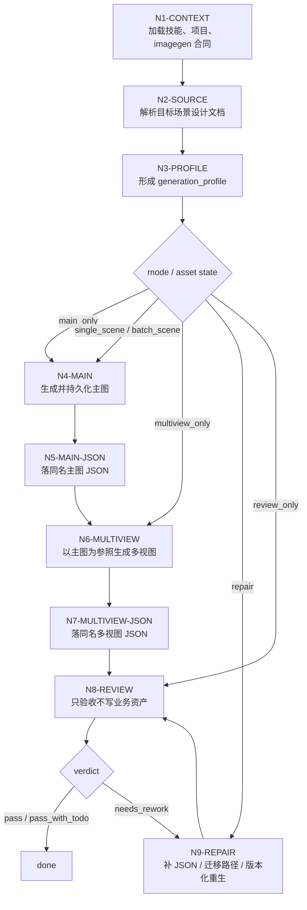
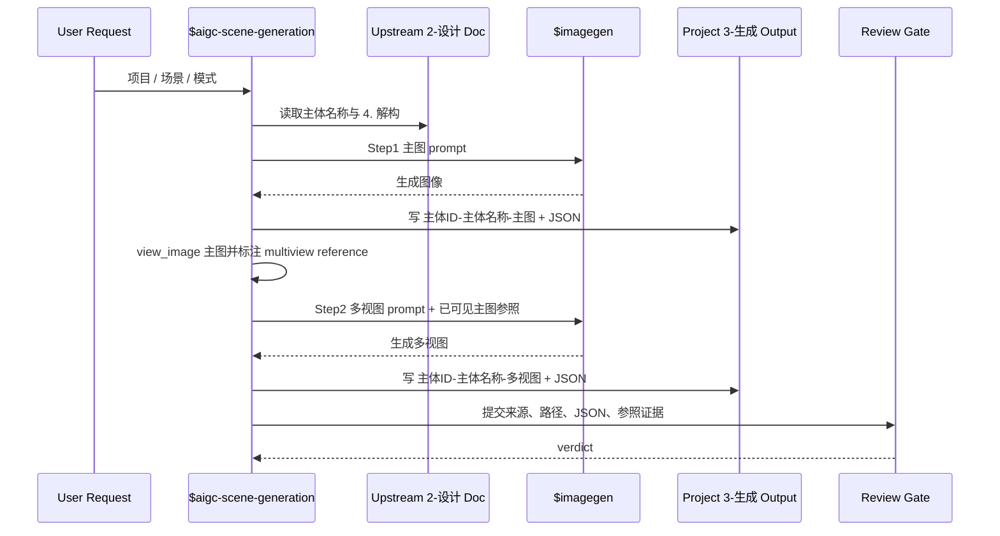

# Scene Generation Workflow

## Topology

本 workflow 是 `tree -> serial -> review loop` 的混合拓扑：先由输入和已有资产判型，再按场景逐项串行闭环生成，最后汇流到统一 review gate。批量执行时允许多个场景项在计划层并列，但每个场景内部必须保持 `source -> main -> main JSON -> multiview -> multiview JSON -> review` 的证据链。

## Node Network

| node_id | input | judgment | action | output | next_gate |
| --- | --- | --- | --- | --- | --- |
| `N1-CONTEXT` | Skill, project, imagegen contracts | Are all required contexts loaded or explicitly degraded? | Load local `SKILL.md + CONTEXT.md`, project memory/context, and `$imagegen` contract | `runtime_context` | `G1-SOURCE` |
| `N2-SOURCE` | Target project and scene design docs | Which scene docs are in scope? | Resolve target docs and extract subject name plus upstream deconstruction | `source_manifest` | `G2-DECONSTRUCTION` |
| `N3-PROFILE` | Source manifest and existing assets | Which mode applies? | Build `generation_profile` from `types/scene-generation-type-map.md` | `generation_profile` | `G3-MAIN` |
| `N4-MAIN` | Upstream `4. 解构` and `templates/scene-main-image-prompt.json` | Is Step1 needed and allowed? | Call `$imagegen` to generate `主体ID-主体名称-主图`; persist image | main image path | `G4-MAIN-JSON` |
| `N5-MAIN-JSON` | Main image path and source deconstruction | Does evidence pair exist and include `subject_id`? | Write `主体ID-主体名称-主图.json` | main prompt record | `G5-MULTIVIEW` |
| `N6-MULTIVIEW` | Main image path and multi-view template | Is the reference image available and visible in context? | `view_image` the main image, label it as scene multiview reference, then call `$imagegen` with template prompt and visible main image reference | multi-view image path | `G6-MULTIVIEW-JSON` |
| `N7-MULTIVIEW-JSON` | Multi-view image path and template payload | Does evidence pair exist and reuse the same `subject_id`? | Write `主体ID-主体名称-多视图.json` | multi-view prompt record | `G7-REVIEW` |
| `N8-REVIEW` | All assets and JSON records | Do outputs satisfy path, naming, reference, quality, boundary gates? | Run review contract or local fallback checklist | `review_verdict` | done |
| `N9-REPAIR` | Existing asset set and failing gate | Is repair mechanical or does it require regeneration permission? | Version, relocate, or reconstruct JSON from source evidence; ask before overwrite/regeneration when required | repaired asset set | `G7-REVIEW` |

## Gates

| gate_id | pass condition | fail route |
| --- | --- | --- |
| `G1-SOURCE` | Every target has a readable upstream design doc | Stop or ask for correct project/doc path |
| `G2-DECONSTRUCTION` | Upstream `4. 解构` content is recoverable | Report missing deconstruction; do not invent prompt or fall back to old English integrated prompt |
| `G3-MAIN` | Existing image conflict is resolved by permission or versioning | Version output or ask for overwrite permission |
| `G4-MAIN-JSON` | Main image is persisted under project `3-生成` | Apply imagegen output persistence repair |
| `G5-MULTIVIEW` | Main image path exists, is role-labeled as reference, and has `reference_context_status: visible_in_conversation_context` in real generation mode | Generate or locate main image first, then `view_image` it before Step2 |
| `G6-MULTIVIEW-JSON` | Multi-view image is persisted under project `3-生成` | Apply imagegen output persistence repair |
| `G7-REVIEW` | Every required image has same-name JSON and review status | Repair missing records before closeout |

## Branch Matrix

| mode | required nodes | skipped nodes | convergence |
| --- | --- | --- | --- |
| `single_scene` | `N1 -> N2 -> N3 -> N4 -> N5 -> N6 -> N7 -> N8` | none | `N8-REVIEW` |
| `batch_scene` | Repeat `N2 -> N8` per design document after shared context load | none per in-scope item | batch report or summarized verdict |
| `main_only` | `N1 -> N2 -> N3 -> N4 -> N5 -> N8` | `N6`, `N7` | main pair review |
| `multiview_only` | `N1 -> N2 -> N3 -> N6 -> N7 -> N8` | `N4`, `N5` only when valid main image already exists | multiview pair review |
| `repair` | `N1 -> N2 -> N3 -> N9 -> N8` | generation nodes unless regeneration is approved | repair verdict |
| `review_only` | `N1 -> N2 -> N3 -> N8` | all write nodes | verdict only |

## Batch Convergence

Batch mode repeats `N2` through `N8` for each target design document. A failed item should record its failure reason in the optional report while allowing completed items to retain their valid outputs.

## Failure Loop

- `G2-DECONSTRUCTION` failure is blocking: stop and report missing upstream `4. 解构`; do not route to prompt invention.
- `G3-MAIN` conflict is recoverable: version output by default or ask before overwrite.
- `G4-MAIN-JSON` and `G6-MULTIVIEW-JSON` failures route to `N9-REPAIR` because they are evidence/persistence defects.
- `G7-REVIEW` visual drift routes to regeneration only when user intent or workflow mode allows a new image; otherwise report `needs_rework`.
