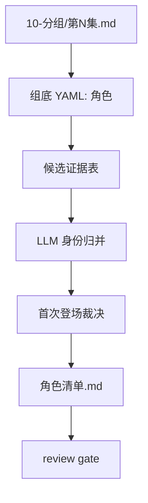

# aigc 11-主体/角色/1-清单

角色清单 Skill 2.0 包，用于从 `projects/aigc/<项目名>/10-分组/第N集.md` 每个分镜组底部 YAML 的 `角色` 字段生成 canonical 角色清单。

## Directory Tree

```text
1-清单/
├── references/
│   └── source-and-merge-contract.md
├── scripts/
│   └── README.md
├── templates/
│   └── output-template.md
├── review/
│   └── review-contract.md
├── steps/
│   └── character-list-workflow.md
├── knowledge-base/
│   └── character-list-heuristics.md
├── types/
│   └── character-identity-type-map.md
├── agents/
│   └── openai.yaml
├── CHANGELOG.md
├── SKILL.md
├── CONTEXT.md
└── README.md
```

## Quick Entry

- 调用名：`$aigc-design-character-list`
- 上游真源：`projects/aigc/<项目名>/10-分组/第N集.md` 的组底 YAML `角色` 字段。
- Canonical 输出：`projects/aigc/<项目名>/11-主体/角色/1-清单/角色清单.md`。
- 固定表头：`名称`、`首次登场`、`原文描述（关键词式）`。

## Visual Overview



## Guardrails

- 角色归并、别名判断、代称裁决由 LLM 完成。
- 脚本只能读取、抽取、校验和提示风险，不能生成 canonical 清单正文。
- 正文回查只允许用于解释同一分镜组 YAML `角色` 字段，不得绕过 YAML 另造候选。
