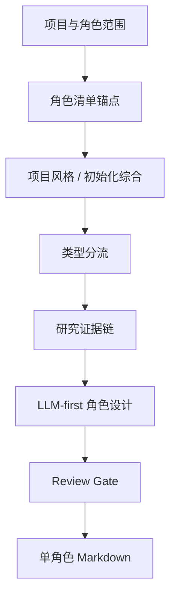

# aigc 11-主体/角色/2-设计

角色细目设计 Skill 2.0 包，用于从 `projects/aigc/<项目名>/11-主体/角色/1-清单/角色清单.md` 读取角色清单，并结合 `0-初始化/north_star.yaml` 与 `team.yaml.init_synthesis` 输出单角色设计稿。

## Directory Tree

```text
2-设计/
├── references/
│   ├── character-design-contract.md
│   ├── design-output-contract.md
│   ├── design-slot-review-contract.md
│   └── workflow-supervision-contract.md
├── scripts/
│   └── README.md
├── templates/
│   └── output-template.md
├── review/
│   └── review-contract.md
├── steps/
│   └── character-design-workflow.md
├── knowledge-base/
│   ├── character-design-heuristics.md
│   └── character-design-corpus.md
├── types/
│   └── character-design-type-map.md
├── agents/
│   └── openai.yaml
├── CHANGELOG.md
├── SKILL.md
├── CONTEXT.md
└── README.md
```

## Quick Entry

- 调用名：`$aigc-design-character-detail`
- 上游真源：`projects/aigc/<项目名>/11-主体/角色/1-清单/角色清单.md`
- 项目上下文：`projects/aigc/<项目名>/0-初始化/north_star.yaml`、`projects/aigc/<项目名>/team.yaml.init_synthesis`
- Canonical 输出：`projects/aigc/<项目名>/11-主体/角色/2-设计/C###-<角色名>.md`
- 研究层要求：身份、职业、阶层、地域年代、服饰工艺、身体姿态、审美吸引力、禁区、不确定性和 prompt evidence chain 必须转化为可见设计决策。
- 语料库触发：审美强化、妆容化、角色类型词库、服装时代语境或 prompt 审美短语命中时，必须加载 `knowledge-base/character-design-corpus.md` 并留下 `corpus_usage_trace`。

## Workflow Snapshot



## Guardrails

- 研究考据、物语、解构、服装、摄影和英文提示词由 LLM 直接创作。
- 研究考据必须形成 `evidence -> design decision -> prompt phrase`，不能只保留资料摘录。
- 脚本只能读取、校验、统计和汇总，不能生成角色设计正文。
- 默认只读消费初始化综合；本地执行只记录 verdict、finding、采纳建议和必要修复项，不调用 team 身份或旧 stage profile。
- `design-output-contract.md`、`design-slot-review-contract.md` 和 `workflow-supervision-contract.md` 必须进入入口加载、执行节点和 review gate，不得作为旁路文档漂移。
- 本技能不修改 registry、父级目录、上游清单、场景/道具技能或最终生成阶段。
- 固定为纯色背景全身定妆照，不置身剧情场景、建筑空间、街景、室内陈设或复杂环境。
- 角色设计必须强化容貌、妆发、骨相、身形和服装审美；女性角色美丽动人，男性角色英俊不凡，主角更强，正反派和功能角色都有个性化魅力。明星脸灵感只可原创转译，不得精确复刻现实人物。
- 服装可以风格化，但不得脱离项目时代、地域、阶层和职业母体；语料库词条必须原创转译，不得逐字套用成模板脸或模板服装。
- `## 4. 解构` 下方必须先写 `主体ID号：<主体ID>`，并与 `## 5. 提示词设计` 主体 ID、英文 prompt 开头保持一致。
- 输出文档文件名必须带同一主体 ID 前缀，例如 `C001-<角色名>.md`；若上游已有主体 ID，则沿用该 ID。
- 最终英文整合 prompt 的整合对象是 `## 4. 解构` 的全部有效 Identity & Story Pressure、Visual Drivers、Detailed Character Design、Detailed Costume Design 与 Cinematography 信息；只拼主体 ID、风格、服装、定妆照词或负向词等前缀/后缀不算完成。
- 英文 prompt 必须控制在 1300 characters 内，并使用自然语言负向约束，不得使用 Midjourney `--no` 参数。
- 英文 prompt 必须以主体 ID 号开头，并包含 `full-body costume fitting photo, solid color background, no scene environment` 等等价约束。
