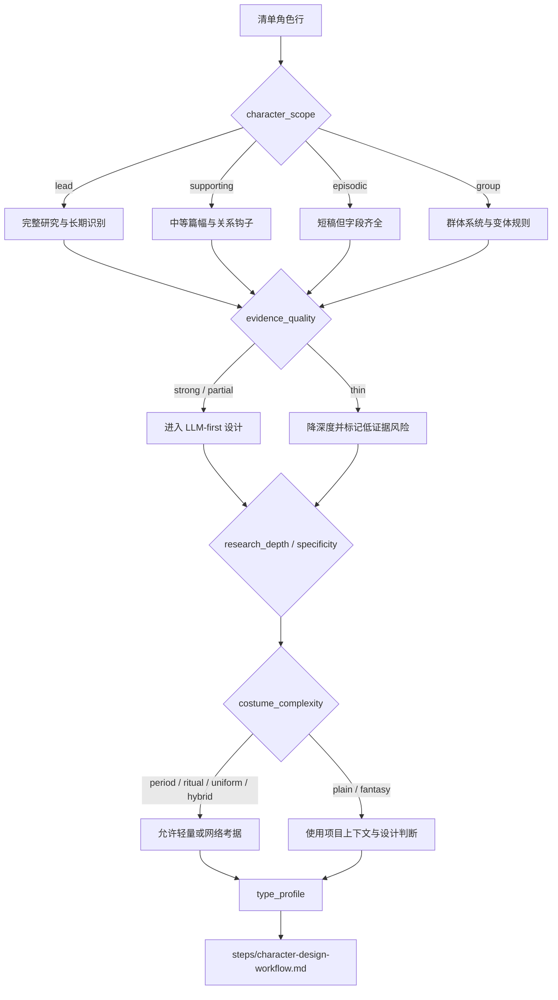

# Character Design Type Map

## 类型包加载边界

- 每次调用本技能时，必须依据本文件识别并加载同目录 `types/` 中选中的类型包（单选或多选）。
- `types/` 中命中的类型包作为固定上下文加载；`knowledge-base/` 只作为按需检索、切片或向量召回的知识库，不替代类型包。

本文件定义 `角色/2-设计` 的类型变量和分型策略。它不替代 `steps/` 的执行流程。

## Type Variables

| variable | values | use |
| --- | --- | --- |
| `character_scope` | `lead` / `supporting` / `episodic` / `group` | 决定研究、物语和细节密度 |
| `evidence_quality` | `strong` / `partial` / `thin` | 决定是否需要风险提示或上游修复建议 |
| `research_need` | `none` / `light` / `web_allowed` | 决定是否允许网络搜索 |
| `research_depth` | `anchor_only` / `profile` / `craft_deep` / `cross_checked` | 决定研究层从清单锚点到工艺考据的深度 |
| `uncertainty_level` | `low` / `medium` / `high` | 决定是否必须写待确认项、风险提示或上游修复建议 |
| `costume_complexity` | `plain` / `period` / `ritual` / `uniform` / `fantasy` / `hybrid` | 决定服装字段重点 |
| `aesthetic_priority` | `lead_heightened` / `supporting_distinctive` / `villain_charismatic` / `functional_readable` / `group_varied` | 决定容貌、妆发、身形、服装吸引力和个性魅力的强化强度 |
| `celebrity_inspiration_policy` | `allowed_originalized` / `generic_only` / `blocked` | 决定是否可用明星/演员/模特作为脸型、骨相、眼神、妆发或镜头魅力灵感；任何路线都不得精确复刻现实人物 |
| `cultural_specificity` | `generic` / `regional` / `historical` / `ethnic_or_religious` / `institutional` | 决定地域年代、礼制、职业制服和禁区审查强度 |
| `body_posture_risk` | `low` / `medium` / `high` | 决定姿态是否需要避免性化、伤病误写、刻板化或场景动作 |
| `cinematic_role` | `heroic` / `intimate` / `threat` / `comic` / `background_anchor` / `mystery` | 决定摄影字段语言 |

## Strategy Matrix

| type_profile | route | design emphasis | review risk |
| --- | --- | --- | --- |
| `lead + strong` | 完整研究、物语、视觉服装、摄影，`aesthetic_priority=lead_heightened` | 角色矛盾、长期视觉识别、跨场景一致性、最高级别美丽/英俊和服装完成度 | 避免过度百科化，避免把审美强化写成模板脸 |
| `supporting + strong/partial` | 中等篇幅设计，`aesthetic_priority=supporting_distinctive` | 与主线关系、单一强视觉钩子、服装功能、好看但不抢主角层级 | 避免主角化，避免平庸功能脸 |
| `episodic + partial/thin` | 短稿但字段齐全，`aesthetic_priority=functional_readable` | 首次登场辨识度、动作功能、镜头记忆点、干净可执行的面部/服装魅力 | 避免凭空补复杂背景，避免只靠职业标签区分 |
| `group` | 群像主体设计，`aesthetic_priority=group_varied` | 群体轮廓、统一服装系统、个体差异规则、群像中可辨认的美感变化 | 避免假装每个个体都有姓名，避免全员同脸同服装 |
| `villain / antagonist` | 按角色权重选择完整或中等篇幅，`aesthetic_priority=villain_charismatic` | 危险、锋利、阴郁、病态或怪诞魅力；反派同样好看、有压迫性和辨识度 | 避免把反派写丑、脏、乱作为唯一视觉逻辑 |
| `period/ritual/uniform` costume | 允许轻量或网络考据 | 廓形、材质、礼制、磨损和职业功能 | 避免历史/文化误写 |
| `thin evidence` | 先降深度 | 明确哪些来自清单，哪些是设计推演 | 必须标记低证据风险 |
| `regional/historical/institutional` specificity | 研究层升级为 `craft_deep` 或 `cross_checked` | 地域年代、制度身份、职业服制、禁区和不确定性 | 避免把现代泛化审美套进特定文化 |
| `high uncertainty + high specificity` | 降低断言强度，必要时请求确认 | 写清清单事实、推演和待确认项 | 不得把低证据考据写成事实 |

## Routing Map

## Web Search Routing

| condition | allowed_action | required_record |
| --- | --- | --- |
| 冷门服饰、职业或地域 | 搜索 1 到 3 个可信来源 | 来源名称、链接或摘要、使用边界 |
| 真实历史人物或事件影射 | 搜索并交叉核对 | 不把单一来源写成事实 |
| 普通现代日常角色 | 默认不搜索 | 直接用项目上下文设计 |

## Research Depth Rules

| profile signal | research_depth | required output |
| --- | --- | --- |
| 配角、普通现代、证据强、服装简单 | `profile` | 完成研究镜头与审美吸引力证据，但每镜头可短写；必须有 prompt evidence chain |
| 主角、阶层压力强、职业身份强 | `profile` 或 `craft_deep` | 职业、阶层、身体姿态和服装工艺必须转化为可见设计 |
| 年代、地域、制服、礼仪、宗教、民族或真实制度相关 | `craft_deep` 或 `cross_checked` | 地域年代、工艺、禁区和不确定性必须详写；必要时允许搜索 |
| 清单证据薄但用户要求输出 | `anchor_only` | 只做低断言推演，明确待确认项；不得虚构复杂背景 |

## Aesthetic Priority Rules

| profile signal | aesthetic_priority | required output |
| --- | --- | --- |
| 主角、核心情感线、长期复用角色 | `lead_heightened` | `Beauty / Handsomeness Target` 必须明确高吸引力目标；脸型、骨相、眼神、妆发、身形和服装完成度都要可见 |
| 重要配角、关系轴角色 | `supporting_distinctive` | 至少一个强面部/妆发钩子和一个服装钩子；好看但不压过主角 |
| 反派、对立角色、危险人物 | `villain_charismatic` | 允许锋利、阴郁、危险、病态或怪诞魅力；不得把反派简化为丑化或脏乱 |
| 功能角色、短登场角色 | `functional_readable` | 短写但要有清楚脸部辨识点、身形轮廓和服装吸引力 |
| 群像主体 | `group_varied` | 群体美感统一，个体通过脸部、发型、廓形或色彩做差异，不同成员避免同脸同服装 |

## Celebrity Inspiration Rules

| policy | allowed_action | prohibited_action |
| --- | --- | --- |
| `allowed_originalized` | 使用 1 到 2 个明星、演员或模特作为脸型、骨相、眼神、妆发、镜头魅力灵感，并转译为原创组合 | 精确复刻、换脸、同款肖像、让角色被识别为现实本人 |
| `generic_only` | 使用“明星级镜头脸 / editorial model face / cinematic leading-face quality”等泛化描述 | 写入真实人物姓名或高度可识别特征组合 |
| `blocked` | 不使用真实人物参考，只写原创审美策略 | 任何真实人物姓名、肖像模拟或现实身份暗示 |

## Prompt Evidence Chain Rules

- 英文 prompt 中的身份、服装、姿态、光线、风格与固定画面短语，都应能回指到 `research_profile` 或项目上下文。
- 英文 prompt 中的美丽/英俊、脸部骨相、眼神、妆发、身形、服装吸引力短语，都应能回指到 `Aesthetic Appeal Evidence`、`Visual Drivers` 或项目上下文。
- 如果使用明星脸灵感，英文 prompt 应写原创化审美短语，不应写成精确复刻某现实人物。
- 不允许出现研究层没有支持的特定文化符号、真实制服、宗教标识、医学特征或阶层标签。
- `full-body costume fitting photo`、`solid color background`、`no scene environment` 是固定证据，来自本技能合同，不需要外部来源。

## Depth Rules

- 所有类型都必须保留模板必填字段。
- 低证据角色可以短，但不能缺字段。
- 主角与高复杂服装角色必须在 `Detailed Costume Design` 中写到材质、层次、配件和使用痕迹。
- 主角必须在审美层明确更高的颜值、气质和服装完成度；女性主角默认美丽动人，男性主角默认英俊不凡。
- 所有正派、反派、配角和功能角色都必须至少有一个可见的面部/妆发/身形魅力点和一个服装吸引力点。
- 群像角色的提示词应强调群体系统和可重复变体，不虚构具体姓名。
- 任何类型都必须输出研究层八个镜头；差异只在深度，不在字段是否存在。
