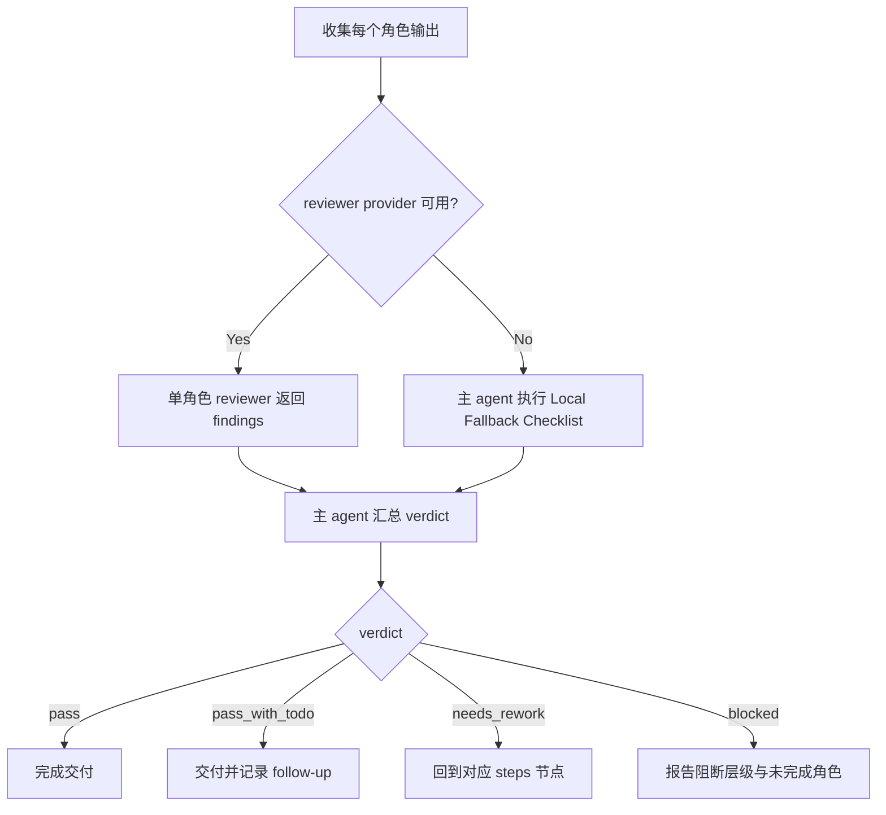

# Review Contract

本文件定义 `角色/3-生成` 的质量门禁、审查口径和 verdict 结构。

## Review Scope

检查对象：

- 主图图片与主图 JSON。
- 多视图图片与多视图 JSON。
- 上游设计文档回链。
- imagegen 执行模式与项目持久化证据。

不检查对象：

- 不重新评判角色设计是否“够好”；该职责属于 `角色/2-设计`。
- 不审查场景、道具、视频或分镜产物。

## Review Gates

| review_gate | requirement | fail code | rework target |
| --- | --- | --- | --- |
| `GATE-CHAR-GEN-01` | 每个目标主体都有可读取的上游 `2-设计` 文档、`4. 解构` 和可追溯 `subject_id` | `FAIL-SOURCE-LINK` | `N2-DESIGN` |
| `GATE-CHAR-GEN-02` | 主图 prompt 来自源设计文档 `4. 解构`，未新增主体设定，未回退引用旧英文整合 prompt | `FAIL-PROMPT-DRIFT` | `N3-MAIN-JSON` |
| `GATE-CHAR-GEN-03` | 真实生成模式下主图图片存在于 canonical 输出目录，并可作为 continuity anchor | `FAIL-MAIN-IMAGE` | `N4-MAIN-IMAGE` |
| `GATE-CHAR-GEN-04` | 多视图 JSON 的 `reference_image_path` 指向同一角色的主图 | `FAIL-REFERENCE` | `N5-MULTIVIEW-JSON` |
| `GATE-CHAR-GEN-05` | 真实生成模式下多视图图片存在于 canonical 输出目录 | `FAIL-MULTIVIEW-IMAGE` | `N6-MULTIVIEW-IMAGE` |
| `GATE-CHAR-GEN-06` | 图片与 JSON 命名符合 `<主体ID>-<主体名称>-主图/多视图`，且 subject ID 一致 | `FAIL-NAMING` | `N7-REVIEW` |
| `GATE-CHAR-GEN-07` | prompt-only 模式没有伪造图片路径，阻断原因清楚 | `FAIL-PROMPT-ONLY-CLAIM` | `N7-REVIEW` |
| `GATE-CHAR-GEN-08` | 本阶段未修改上游设计稿、父级 registry、场景/道具/视频/分镜目录或其他 worker 范围 | `FAIL-WRITE-BOUNDARY` | `N7-REVIEW` |
| `GATE-CHAR-GEN-09` | 真实生成模式下，多视图参照主图已通过 `view_image` 进入对话上下文并记录状态 | `FAIL-REFERENCE-CONTEXT` | `N5-MULTIVIEW-JSON` |
| `GATE-CHAR-GEN-10` | 未获用户显式授权时只使用 `.agents/skills/cli/imagegen`，并遵守 imagegen 当前合同和项目持久化规则 | `FAIL-EXECUTOR-DRIFT` | `N1-INTAKE` |
| `GATE-CHAR-GEN-11` | 脚本只做复制、校验或汇总，不生成、改写、批量插入、正则套句或映射投影 `prompt_text` 创作正文 | `FAIL-SCRIPT-AUTHORSHIP` | `N3-MAIN-JSON` |

## Checklist

| check_id | requirement | fail code |
| --- | --- | --- |
| `REV-CHAR-GEN-01` | 每个 JSON 都有 `subject_id`、`source_design_path`，且源文件存在 | `FAIL-SOURCE-LINK` |
| `REV-CHAR-GEN-02` | 主图 prompt 来自源设计文档 `4. 解构`，未重写主体设定，未回退引用旧英文整合 prompt | `FAIL-PROMPT-DRIFT` |
| `REV-CHAR-GEN-03` | 真实生成模式下 `<主体ID>-<主体名称>-主图.<ext>` 存在于输出目录 | `FAIL-MAIN-IMAGE` |
| `REV-CHAR-GEN-04` | 多视图 JSON 的 `reference_image_path` 指向对应主图 | `FAIL-REFERENCE` |
| `REV-CHAR-GEN-05` | 真实生成模式下 `<主体ID>-<主体名称>-多视图.<ext>` 存在于输出目录 | `FAIL-MULTIVIEW-IMAGE` |
| `REV-CHAR-GEN-06` | 图片与 JSON 命名符合 `<主体ID>-<主体名称>-主图`、`<主体ID>-<主体名称>-多视图`，且 `<主体ID>` 与 JSON 的 `subject_id` 一致 | `FAIL-NAMING` |
| `REV-CHAR-GEN-07` | prompt-only 模式没有伪造图片路径，阻断原因清楚 | `FAIL-PROMPT-ONLY-CLAIM` |
| `REV-CHAR-GEN-08` | 未修改上游 `2-设计` 文档或其他技能目录 | `FAIL-WRITE-BOUNDARY` |
| `REV-CHAR-GEN-09` | 真实生成模式下，多视图主图参照已 `view_image` 进入对话上下文，且 JSON / 报告记录 `reference_context_status: visible_in_conversation_context` | `FAIL-REFERENCE-CONTEXT` |

## Verdict Schema

```yaml
subject_name: ""
subject_id: ""
mode: "real_generation | prompt_only | review_only"
verdict: "pass | pass_with_todo | blocked | needs_rework"
source_design_path: ""
main_image_path: ""
main_prompt_json_path: ""
multiview_image_path: ""
multiview_prompt_json_path: ""
reference_image_path: ""
reference_context_status: "pending_view_image | visible_in_conversation_context | no_reference_image"
imagegen_mode: ""
findings: []
notes: ""
```

## Provider Guidance

- 默认由执行 agent 做本地 gate 审查。
- 仓库层默认使用本地 reviewer checklist 返回 findings；最终 verdict 仍由主 agent 汇总，reviewer 不拥有业务主真源改写权。
- 若不使用外部 reviewer provider，按 `SKILL.md` 的顾问与复核流程口径直接执行本地 review checklist。

## Local Fallback Checklist

当外部 reviewer provider 不可用时，主 agent 必须至少完成以下本地复核：

1. 核对每个 JSON 的 `subject_id` 与 `source_design_path` 指向存在的 `2-设计` 文档，且文件名 stem 以同一主体 ID 开头。
2. 核对主图 prompt 与设计文档 `4. 解构` 有明确回链，没有新增身份、服装、时代或叙事事实，也没有把 `提示词设计` 的英文整合 prompt 当作主源。
3. 核对多视图 JSON 的 `reference_image_path` 指向同一角色主图，且不跨角色复用；真实生成模式下确认该主图已 `view_image`，`reference_context_status` 为 `visible_in_conversation_context`。
4. 核对真实生成模式下图片文件存在，并位于 `projects/aigc/<项目名>/11-主体/角色/3-生成/`。
5. 核对 prompt-only 模式没有伪造图片路径，且 `blocked_reason` 可解释。
6. 核对本轮没有修改上游 `2-设计`、父级 registry、场景/道具目录或其他 worker 范围。

## Review Flow Map


