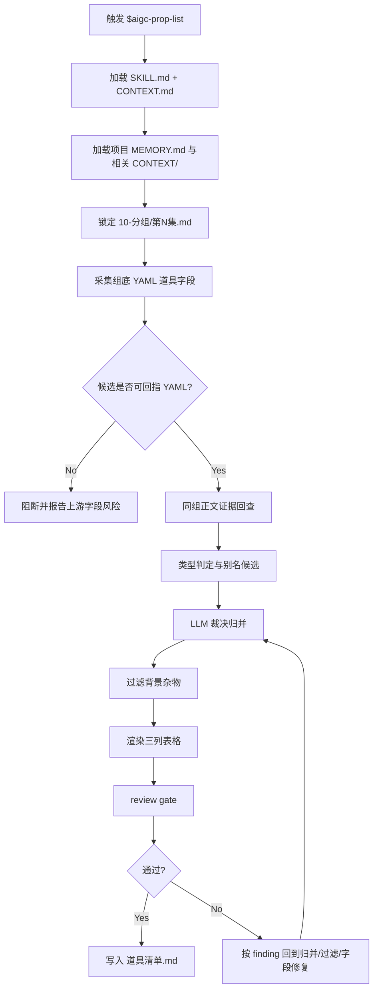
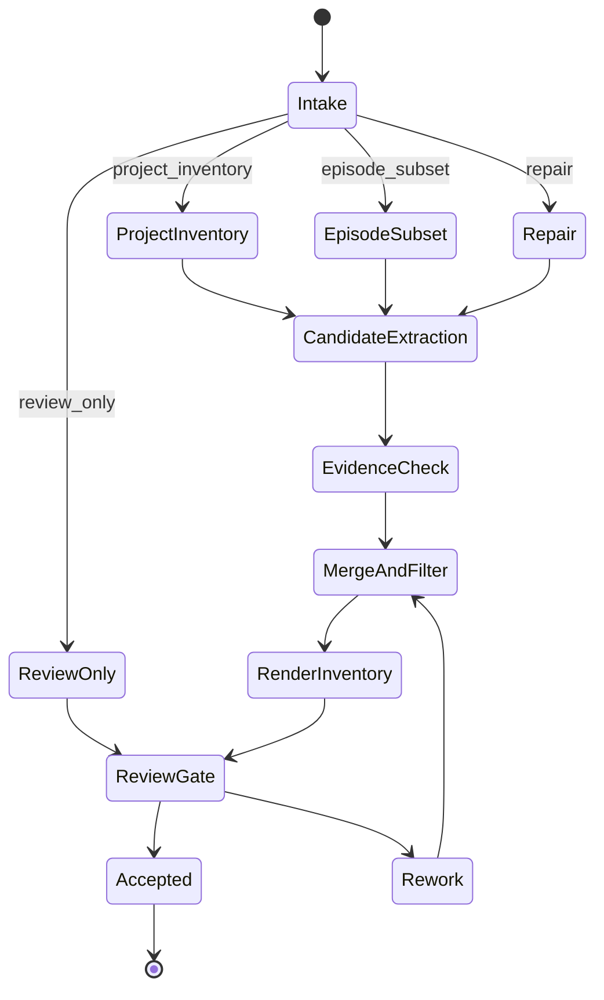
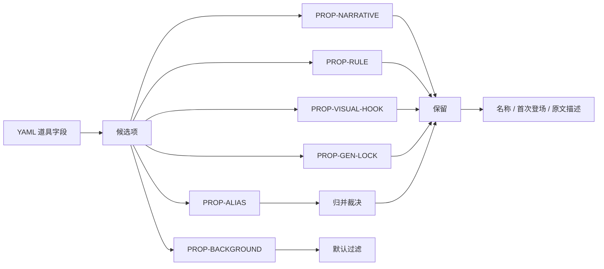

# aigc 道具 1-清单

`道具/1-清单` 负责从 `10-分组` 逐集分镜组底部 YAML 的 `道具` 字段中提取、归并并生成项目级道具清单。它不重新创作道具设定，不替代后续 `2-设计` 的造型设计，只裁决同一叙事道具在不同分镜组中的别名、代称和首次登场证据。

## Context Loading Contract

- 每次调用 `$aigc-prop-list` 时，必须同时加载同目录 `CONTEXT.md`。
- 每次调用本技能时，必须同时识别并加载同目录 `types/` 中选中的类型包（单选或多选）。
- 若任务绑定 `projects/aigc/<项目名>/`，必须先加载项目根 `MEMORY.md`，再按需加载项目根 `CONTEXT/` 中与道具、世界观、视觉规则或制作约束相关的上下文文件。
- 上游唯一准确信息来源为 `projects/aigc/<项目名>/10-分组/第N集.md` 每个分镜组底部 YAML 的 `道具` 字段；必要时只允许回查同一分镜组正文作为证据。
- 冲突优先级：用户显式请求 > 根 `AGENTS.md` / meta 规则 > 本 `SKILL.md` > `references/` / `steps/` / `review/` / `types/` / `templates/` > `agents/openai.yaml` > 项目 `MEMORY.md` > 项目 `CONTEXT/` > 本 `CONTEXT.md`。
- 道具归并、别名裁决、背景杂物过滤和清单字段措辞必须由 LLM 直接完成；`scripts/` 只能做读取、路径枚举、YAML 块定位、表格格式检查等机械辅助。
- 脚本、映射表、规则模板、关键词锚点替换、句式轮换或同义改写批量生成的道具清单判断、重要性过滤、canonical 名称、归并理由或关键词描述，直接判定为 `FAIL-PROP-LIST-PSEUDO-DIFF`；字段完整、三列表格合规或数量达标不得抵消该失败。

## Input Contract

Accepted input:

- 项目名、项目路径、单个或多个 `projects/aigc/<项目名>/10-分组/第N集.md` 文件。
- 用户要求“道具清单”“从 10-分组提取道具”“生成/修复 11-主体/道具/1-清单”等任务。
- 已完成或部分完成的 `10-分组` 逐集稿；默认处理 `10-分组/` 中全部可读 `第N集.md`。

Required input:

- 可定位、可读取的 `projects/aigc/<项目名>/10-分组/第N集.md`。
- 分镜组底部 YAML 中存在可识别的 `道具` 字段；若字段为空，只能据实记录无道具，不得从整集凭空补充。
- 可从分镜组 ID 或标题中确定 `首次登场`，格式优先为 `第N集 x-y-z`。

Optional input:

- 项目 `MEMORY.md` 中关于长期视觉钩子、禁用物件、生成锁定优先级的偏好。
- 项目 `CONTEXT/` 中已有世界观、规则物、关键道具设定或命名表。
- 用户指定的别名归并策略、清单排序方式或是否同时生成执行报告。

Reject or clarify when:

- 上游 `10-分组/第N集.md` 不存在、不可读，且用户没有提供替代分组稿。
- 用户要求脚本自动完成别名归并、叙事重要性判断或从正文创作新道具；必须改为 LLM 裁决、脚本只校验。
- 用户要求把纯背景杂物、环境陈设或不可见抽象概念全部列为道具，且没有明确生成锁定理由。
- 用户要求写入 `2-设计`、`3-生成`、角色目录或场景目录；本技能只拥有 `道具/1-清单`。

## Mode Selection

| mode | 触发信号 | 输出 |
| --- | --- | --- |
| `project_inventory` | 指定项目或默认处理全部 `10-分组/第N集.md` | `11-主体/道具/1-清单/道具清单.md` |
| `episode_subset` | 指定单集、多集或集号范围 | 覆盖指定范围证据的道具清单或局部报告 |
| `incremental_merge` | 既有 `道具清单.md` 存在，且 `10-分组` 新增/更新了部分 `第N集.md` | merge 更新清单、执行报告与可选 `design-manifest.yaml` |
| `repair` | 已有清单漏项、重复别名、背景杂物过多或首次登场错误 | 最小修复后的道具清单与必要执行报告 |
| `review_only` | 用户只要求检查清单 | 审查报告，不改写清单，除非用户随后要求修复 |

## Reference Loading Guide

| 场景 | 必读文件 |
| --- | --- |
| 任意道具清单任务 | `references/prop-list-contract.md`、`steps/prop-list-workflow.md` |
| 既有清单与新增上游对账 | `../../references/incremental-reconciliation-contract.md` |
| 别名、代称、同一叙事道具归并 | `types/prop-type-map.md`、`knowledge-base/prop-list-heuristics.md` |
| 验收、修复和 review gate | `review/review-contract.md` |
| 输出清单样板 | `templates/output-template.md` |
| 脚本辅助边界与机械校验 | `scripts/README.md` |
| 产品入口元数据 | `agents/openai.yaml` |

## Visual Maps

## Execution Contract

1. 读取本 `SKILL.md + CONTEXT.md`，并在项目任务中加载项目 `MEMORY.md` 与相关 `CONTEXT/`。
2. 锁定上游 `projects/aigc/<项目名>/10-分组/第N集.md`；若既有 `道具清单.md` 或 `design-manifest.yaml` 存在，先读取并建立本轮 `reconcile_delta`。
3. 只从每个分镜组底部 YAML 的 `道具` 字段采集候选项；新增上游只能触发 merge/append，不得静默全量覆盖旧清单。
4. 当候选项存在别名、代称、材质/状态差异或同一叙事道具多种称呼时，回查同一分镜组正文取证，由 LLM 裁决是否归并。
5. 过滤纯背景杂物；优先保留叙事道具、规则道具、视觉钩子和后续生成需要锁定的物件。
6. merge 生成 table 式 Markdown 清单，主体字段固定且只包含：`名称`、`首次登场`、`原文描述（关键词式）`；首次登场取所有已知来源中最早分镜组。
7. 写入 canonical 路径 `projects/aigc/<项目名>/11-主体/道具/1-清单/道具清单.md`；如需记录过程，可另写 `执行报告.md`；可同步更新 `projects/aigc/<项目名>/11-主体/道具/design-manifest.yaml` 的 source/subject 映射。
8. 按 `review/review-contract.md` 执行验收；可使用 `scripts/` 中说明的机械检查，但脚本不得替代 LLM 的归并与过滤判断。

## Script And Metadata Contract

| path | role |
| --- | --- |
| `scripts/README.md` | 声明脚本只能承担机械读取、定位和格式校验，不替代 LLM 主判断 |
| `agents/openai.yaml` | 提供产品侧入口元数据，默认提示必须显式提到 `$aigc-prop-list` |

## Field Mapping

| field_id | 输出/证据 | 内容要求 | 失败码 |
| --- | --- | --- | --- |
| `FIELD-PROP-LIST-01` | 输入取证 | source grouping episodes、项目记忆、相关上下文和处理范围明确 | `FAIL-PROP-LIST-01` |
| `FIELD-PROP-LIST-02` | 上游字段锁定 | 候选项来自组底 YAML `道具` 字段，必要正文回查限于同一分镜组 | `FAIL-PROP-LIST-02` |
| `FIELD-PROP-LIST-03` | 归并裁决 | 别名、代称、状态称呼和同一叙事道具多称呼已合并或说明不合并理由 | `FAIL-PROP-LIST-03` |
| `FIELD-PROP-LIST-04` | 过滤裁决 | 纯背景杂物未进入主体清单，保留项具备叙事、规则、视觉或生成锁定价值 | `FAIL-PROP-LIST-04` |
| `FIELD-PROP-LIST-05` | 主体字段 | 表格仅包含 `名称`、`首次登场`、`原文描述（关键词式）` 三列 | `FAIL-PROP-LIST-05` |
| `FIELD-PROP-LIST-06` | 输出落盘 | canonical 清单与可选执行报告路径正确 | `FAIL-PROP-LIST-06` |
| `FIELD-PROP-LIST-07` | 增量 merge | 既有清单被读取并对账，新道具追加、旧道具稳定，未静默全量覆盖 | `FAIL-PROP-LIST-07` |
| `FIELD-PROP-LIST-08` | 反脚本化伪差异 | 归并、背景杂物过滤、保留理由和关键词描述不是由映射表、规则模板、关键词锚点替换、句式轮换或同义改写批量生成；每个保留/过滤/合并结论有主体级 LLM 裁决证据 | `FAIL-PROP-LIST-PSEUDO-DIFF` |

## Thought Pass Map

| step_id | pass_name | input | judgment | output |
| --- | --- | --- | --- | --- |
| `PASS-PROP-LIST-01` | 输入锁定 | 项目路径、目标集号、`10-分组/第N集.md` | 是否具备组底 YAML `道具` 字段和分镜组 ID | `input_manifest` |
| `PASS-PROP-LIST-02` | 候选采集 | 逐组 YAML `道具` 字段 | 候选是否只来自上游 YAML，正文是否仅作同组补证 | `prop_candidates` |
| `PASS-PROP-LIST-03` | 增量对账 | 既有清单、manifest、候选道具 | 新主体、归并候选、同名文件风险是否识别 | `reconcile_delta` |
| `PASS-PROP-LIST-04` | 道具归并 | 候选项、同组正文关键词、项目记忆 | 别名、代称、状态称呼是否指向同一叙事道具 | `canonical_prop_map` |
| `PASS-PROP-LIST-05` | 杂物过滤 | canonical 候选与正文证据 | 是否具备叙事、规则、视觉钩子或生成锁定价值 | `filtered_prop_map` |
| `PASS-PROP-LIST-06` | 表格落盘 | canonical 映射与关键词证据 | 三列是否固定且无新增道具设定 | `道具清单.md` |
| `PASS-PROP-LIST-07` | 验收回查 | 清单与上游文件 | 来源、归并、过滤、字段和路径是否通过 review gate | `review_result` |

## Pass Table

| pass_id | must_do | evidence | Rework Entry |
| --- | --- | --- | --- |
| `PASS-PROP-LIST-01` | 读取本技能与项目上下文，锁定 `10-分组` 输入 | input manifest | `references/prop-list-contract.md` |
| `PASS-PROP-LIST-02` | 只从组底 YAML `道具` 字段采集候选 | 候选清单与分镜组 ID | `steps/prop-list-workflow.md` |
| `PASS-PROP-LIST-03` | 对既有清单和新增上游执行 merge 对账 | `reconcile_delta` | `../../references/incremental-reconciliation-contract.md` |
| `PASS-PROP-LIST-04` | 由 LLM 裁决别名、代称和状态称呼归并 | canonical prop map | `types/prop-type-map.md` |
| `PASS-PROP-LIST-05` | 过滤无生成锁定价值的背景杂物 | filtered prop map | `knowledge-base/prop-list-heuristics.md` |
| `PASS-PROP-LIST-06` | 输出固定三列表格 | `道具清单.md` | `templates/output-template.md` |
| `PASS-PROP-LIST-07` | 执行人工或等价机械验收 | review result | `review/review-contract.md` |
| `PASS-PROP-LIST-08` | 执行反脚本化/反模板伪差异验收 | per-prop decision evidence | 本 `SKILL.md` LLM-first gate |

## Root-Cause Execution Contract (Mandatory)

出现以下问题时，必须沿链路上溯并修复源层合同：

- 从分镜组正文、角色表、场景表或想象设定中绕过 YAML `道具` 字段新增道具。
- 脚本、模板或正则规则替代 LLM 做别名归并、重要性判断或过滤裁决。
- 把纯背景杂物、空间构件、环境氛围词批量列入道具清单。
- 同一叙事道具因别名、代称、状态描述或长短称呼不同被重复列项。
- `首次登场` 没有回指具体集号和分镜组 ID。
- 输出表格新增了主体字段，或缺少固定三列中的任一列。
- 新增部分集数后用局部结果覆盖了既有全局道具清单，或让已有道具设计稿失去清单锚点。
- 形式指标通过但清单像同一模板换道具名、锚点替换、句式轮换或同义改写批量产物，没有逐道具归并/过滤裁决。

必经链路：

`Symptom -> Direct Script/Prompt Overreach -> 道具/1-清单 Section Owner -> 10-分组 YAML Contract -> AGENTS.md LLM-first / Skill 2.0 Rule`

## Output Contract

### Required output

1. 项目级道具清单固定写入 `projects/aigc/<项目名>/11-主体/道具/1-清单/道具清单.md`。
2. 清单主体必须是 table 式 Markdown。
3. 每个主体字段固定为：`名称`、`首次登场`、`原文描述（关键词式）`。
4. 可选执行报告写入 `projects/aigc/<项目名>/11-主体/道具/1-清单/执行报告.md`，用于记录输入范围、归并说明、过滤说明和风险。
5. 可选增量状态索引写入 `projects/aigc/<项目名>/11-主体/道具/design-manifest.yaml`；它只是 sidecar，不替代 `道具清单.md`。

### Output format

| output_id | format |
| --- | --- |
| `OUTPUT-PROP-INVENTORY` | Markdown table |
| `OUTPUT-PROP-REPORT` | Markdown 执行报告，可选 |

### Output path

| output_id | canonical path |
| --- | --- |
| `OUTPUT-PROP-INVENTORY` | `projects/aigc/<项目名>/11-主体/道具/1-清单/道具清单.md` |
| `OUTPUT-PROP-REPORT` | `projects/aigc/<项目名>/11-主体/道具/1-清单/执行报告.md` |
| `OUTPUT-PROP-MANIFEST` | `projects/aigc/<项目名>/11-主体/道具/design-manifest.yaml` |

### Naming convention

- 清单文件固定命名为 `道具清单.md`。
- 可选报告固定命名为 `执行报告.md`。
- `首次登场` 优先写为 `第N集 x-y-z`；若上游 ID 缺失，写可回查的分镜组标题并在报告中列风险。
- 道具设计稿已存在时，清单 merge 不得让同一道具变成新的 canonical 主体；名称变化默认记录映射，不静默重命名文件。
- 不创建 `props.md`、`prop-list.md`、`道具表.md`、角色目录或场景目录下的平行真源。

### Completion gate

- 已读取本 `SKILL.md + CONTEXT.md`，并在项目任务中加载项目 `MEMORY.md` 与相关 `CONTEXT/`。
- 每个候选道具都可回指到 `10-分组/第N集.md` 的组底 YAML `道具` 字段。
- 别名、代称、同一叙事道具多称呼已经由 LLM 裁决归并，并可通过同一分镜组正文回查。
- 纯背景杂物已过滤，或在执行报告中说明保留理由。
- 输出 Markdown table 仅包含 `名称`、`首次登场`、`原文描述（关键词式）` 三列。
- 若已有清单或 manifest，已执行 merge 对账，未静默覆盖旧清单、旧设计稿锚点或旧生成资产。
- 未使用映射表、规则模板、关键词锚点替换、句式轮换或同义改写批量制造道具清单伪差异；疑似命中时已废弃候选稿并回到 LLM 归并/过滤节点。
- 已执行 `review/review-contract.md` 的人工 review 或等价机械格式检查，结果写入清单尾注或执行报告。
