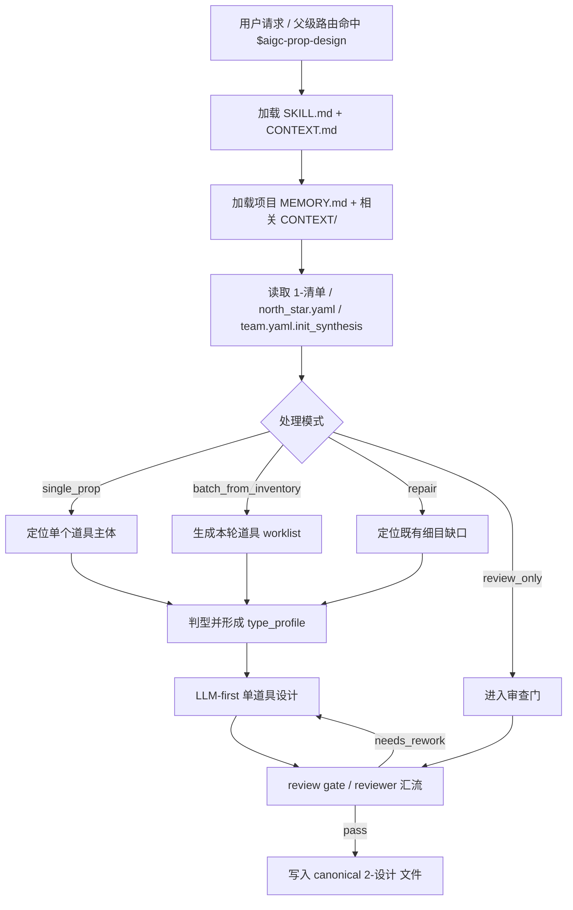
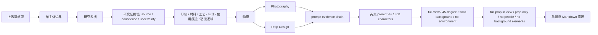
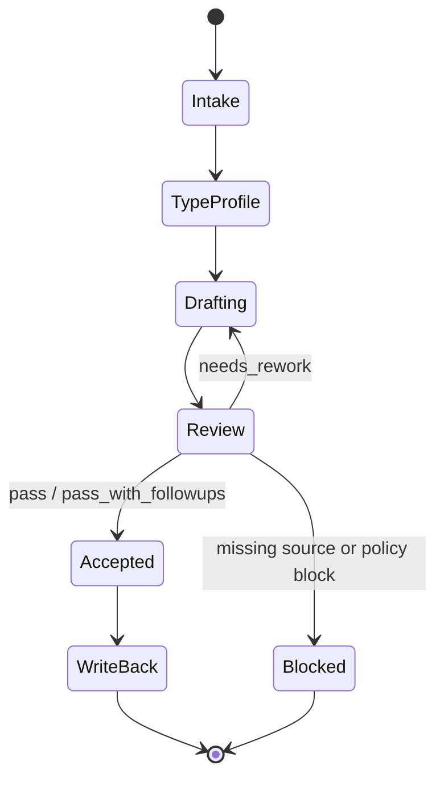

# aigc 道具 2-设计

`道具/2-设计` 负责消费上游 `道具/1-清单` 的汇总式道具清单，并结合 `3-美学/画面基调`、`3-美学/道具风格`、项目 `north_star.yaml` 与 `team.yaml.init_synthesis` 中的设计相关初始化综合上下文，为每个需要进入生成锁定的单个道具主体输出细目设计 Markdown。它不重新抽取清单，不批量改写父级 registry，也不代替 `3-生成` 产出图像。

硬性要求：不能用脚本做批量生成、批量插入、正则套句或映射投影。从上到下逐条理解目标对象，并只把 LLM 判断后的结果按照指定要求落盘。

脚本、映射表、规则模板、关键词锚点替换、句式轮换、同义改写、批量插入、正则套句或映射投影生成的研究考据、物语、Photography、Prop Design、prompt evidence chain 或英文提示词，直接判定为 `FAIL-PROP-DESIGN-PSEUDO-DIFF`；字段齐全、prompt 长度合规、ID 一致、语料库被加载或道具看似“有细节”不得抵消该失败。

## Context Loading Contract

- 每次调用 `$aigc-prop-design` 时，必须同时加载同目录 `CONTEXT.md`。
- 每次调用本技能时，必须同时加载同目录 `CONTEXT.md`。
- 每次调用本技能时，必须同时识别并加载同目录 `types/` 中选中的类型包（单选或多选）。
- 若任务绑定 `projects/aigc/<项目名>/`，必须先加载项目根 `MEMORY.md`，再按需加载项目根 `CONTEXT/` 中与道具、世界观、视觉规则、风格提示词或制作约束相关的上下文文件。
- 必须读取上游 `projects/aigc/<项目名>/11-主体/道具/1-清单/道具清单.md`；缺失时不得凭空生成完整道具设计，应回到 `1-清单` 或请求用户提供替代清单。
- 必须读取 `projects/aigc/<项目名>/3-美学/画面基调/全局风格协议.md`，抽取 `Global Style Prompt`、`Visual Gene Profile`、`Negative Traits` 等画面基调最终内容；道具设计风格词的全局部分以此为准。
- 必须解析目标道具的 `首次登场`、用户指定集号或清单中的 `episode_id`。若能推断 `第N集`，必须优先读取 `projects/aigc/<项目名>/3-美学/第N集/道具风格/道具风格协议.md`；缺失时回退 `projects/aigc/<项目名>/3-美学/道具风格/道具风格协议.md`。该协议用于抽取 `Prop Style Prompt`、材质/工艺/使用痕迹/图像执行偏好等道具风格最终内容；道具设计风格词的细目部分以此为准。
- 必须读取 `projects/aigc/<项目名>/0-初始化/north_star.yaml` 与 `projects/aigc/<项目名>/team.yaml.init_synthesis`，抽取项目北极星、主题、媒介、禁区、创作阶段不变量和设计相关初始化约束、启发、风险；不得再把 `north_star.yaml` 当作道具最终风格提示词真源。
- 初始化综合存在时，必须读取 `../../../_shared/team-advisor-consultation-contract.md`，优先消费 `team.yaml.init_synthesis.stage_seed_summary."11-主体"`、`init_handoff.design_seed` 与 `north_star.yaml.创作阶段不变量.设计`；不得在本阶段调用项目监制成员、解析叶子专属 profile、派生新顾问问题或代入顾问角色意识，只能在 LLM 道具设计前形成 `init_team_synthesis_context`。
- 研究层必须落成可审查的设计证据链：来源判断 -> 置信度/不确定性 -> 形制、材料、工艺、年代、使用痕迹、功能逻辑 -> prompt evidence token；不得停留在百科摘抄或抽象审美标签。
- 固定画面约束：道具设计默认是纯色背景上的单道具完整全貌展示，采用 45 度视角，必须完整展示道具全貌、完整轮廓与主要结构，仅展示道具本体，不做局部特写、裁切特写或半截道具画面，不需要人物或背景元素；不得置身于剧情场景、桌面环境、室内陈设、街景或人物手持情境中；英文提示词必须显式包含 `full-view prop shot, 45-degree view, full prop in view, entire prop fully visible, uncropped full silhouette, prop only, solid color background, no people, no background elements, no scene environment` 等等价约束。
- 道具设计吸引力约束：道具也必须好看、有设计感、充满可见细节和文化元素，而不是简单、平凡或只按功能还原。每个被设计道具至少要有独特轮廓、材质记忆点、工艺/装饰细节、文化或身份符号、使用痕迹和功能结构中的有效组合；关键剧情道具必须进一步强化可复现的 signature detail。
- 文化元素语境约束：文化元素必须与项目时代、地域、阶层、职业、宗教/族群禁区和道具功能逻辑相容。可以风格化、符号化、戏剧化，但不得把现代奢牌、潮牌、战术结构、赛博灯条、哥特尖刺或泛奇幻符文硬套进不匹配的历史/文化语境。
- 高质量道具语料库约束：凡进入 `single_prop`、`batch_from_inventory`、`incremental_fill` 或 `repair` 模式，且需要生成或修复道具审美、文化元素、装饰纹样、工艺细节、功能结构、使用痕迹或 prompt 设计短语时，必须加载 `knowledge-base/prop-design-corpus.md`。语料库只作为启发与原创转译库，不得替代清单锚点、项目时代语境、道具风格协议、`north_star.yaml`、`team.yaml.init_synthesis` 或本 `SKILL.md` 门禁。
- 冲突优先级：用户显式请求 > 根 `AGENTS.md` / meta 规则 > 本 `SKILL.md` > `references/` / `steps/` / `review/` / `types/` / `templates/` > `agents/openai.yaml` > 项目 `MEMORY.md` > 项目 `CONTEXT/` > 本 `CONTEXT.md`。
- 道具研究判断、物语提炼、造型解构、摄影/道具设计语言与提示词设计必须由 LLM 直接完成；`scripts/` 只能做读取、路径枚举、文件名归一、格式检查等机械辅助，不得批量生成、批量插入、正则套句或映射投影任何创作正文。

## 初始化综合消费 Execution Contract

- 本技能默认使用本地初始化综合消费 路径：主 agent 或调度层应将道具细目设计工作分发给 `Worker-Prop`，并在需要质量复核时使用独立 reviewer provider 汇流 verdict。
- 用户显式点名 `$aigc-prop-design` 或本阶段路由命中时，视为仓库层已经许可该默认 初始化综合消费 路径；不得以“用户未额外授权并行”为理由回退。
- 默认复核路径必须先按共享初始化综合消费合同读取 `team.yaml.init_synthesis.stage_seed_summary."11-主体"`、`init_handoff.design_seed` 与 `north_star.yaml.创作阶段不变量.设计`；输出只能作为 `init_team_synthesis_context` 中的节点级可执行指导、局部 patch、risk note 或 inspiration，不得直接替代单道具设计稿。
- 若初始化综合缺失，记录 `not_applicable` 或 `blocked`；不得用本地顾问问答补造 team 综合。
- 子任务可按单个道具主体拆分；每个 初始化综合消费 只负责自己领取的道具文件 patch，最终由主 agent 聚合到 canonical 输出目录。

## Multi-Subskill Continuous Workflow

本叶子技能以单道具或批量道具为执行粒度；当父级域包或用户整体命中本技能时，视为已授权按本级声明的内部节点和初始化综合消费合同连续完成道具细目设计。

- 无序号同级子技能包若未来出现，默认全选并发执行，由本技能汇总、裁决和写回唯一 canonical 输出。
- 数字序号子技能包或节点（如 `1-`、`2-`、`3-`）默认按数字升序串行执行，前一节点产物自动作为后一节点输入。
- 英文序号子技能包或路线（如 `A-`、`B-`、`C-`）默认按用户意图、父级路由或输入类型单选分流；只有用户明确要求对比、并跑或批量多路线时才多选。
- 卫星技能只承担查询、恢复、审查承接或辅助动作；不会自动改写本技能的道具设计 canonical 输出，除非父级合同或用户明确要求回接。
- 每个被调度的子技能、卫星技能或 reviewer 仍必须加载自身 `SKILL.md + CONTEXT.md`；脚本只能承担机械辅助，不得替代 LLM 道具设计主创或主 agent 最终裁决，不得批量生成、批量插入、正则套句或映射投影设计正文。

## Input Contract

Accepted input:

- 项目名、项目路径或明确的 `projects/aigc/<项目名>/`。
- 用户要求“道具设计”“道具细目设计”“从道具清单生成道具设定”“配置或执行 11-主体/道具/2-设计”等任务。
- 单个道具名称、多个道具名称、或默认处理 `道具清单.md` 中全部需要进入设计的主体。

Required input:

- 可定位的 `projects/aigc/<项目名>/11-主体/道具/1-清单/道具清单.md`。
- 清单中每项至少包含 `名称`、`首次登场`、`原文描述（关键词式）`。
- 可读取的 `projects/aigc/<项目名>/3-美学/画面基调/全局风格协议.md`、当前集优先的 `projects/aigc/<项目名>/3-美学/第N集/道具风格/道具风格协议.md`（缺失时回退 `projects/aigc/<项目名>/3-美学/道具风格/道具风格协议.md`）、`projects/aigc/<项目名>/0-初始化/north_star.yaml` 与 `projects/aigc/<项目名>/team.yaml.init_synthesis`；若缺失，必须在输出中标注缺口，不得伪造画面基调、道具风格或初始化综合上下文。

Optional input:

- 项目 `MEMORY.md` 中关于长期视觉钩子、禁用物件、材质口味、提示词风格的偏好。
- 项目 `CONTEXT/` 中已有世界观、术语表、年代考据、道具参考、生成平台限制。
- 用户指定的道具优先级、文件命名方式、是否允许网络搜索冷门资料、是否只输出草案。

Reject or clarify when:

- 上游 `1-清单/道具清单.md` 不存在，且用户没有提供替代清单。
- 用户要求脚本自动生成研究、物语、解构或提示词正文；必须改为 LLM-first。
- 用户要求本技能写入 `1-清单`、`3-生成`、角色设计、场景设计、父级 registry 或其他技能目录。
- 用户要求无来源地补造首次登场或原文描述；必须回查上游清单或请求补充。

## Mode Selection

| mode | 触发信号 | 输出 |
| --- | --- | --- |
| `single_prop` | 指定一个道具主体 | 单个道具细目设计 Markdown |
| `batch_from_inventory` | 指定项目或默认处理全部清单 | 每个道具主体一个 Markdown 文件 |
| `incremental_fill` | 上游清单 merge 后存在新增道具或 `design-manifest.yaml` 标出 `design_gaps` | 只为缺设计稿的道具补齐设计，不覆盖既有设计稿 |
| `repair` | 既有细目缺字段、提示词超长、上下游不一致或设计漂移 | 最小修复后的对应道具文件 |
| `review_only` | 用户只要求检查道具设计 | 审查报告或 findings；不改写文件，除非用户随后要求修复 |

## Reference Loading Guide

| 场景 | 必读文件 |
| --- | --- |
| 任意道具细目设计任务 | `references/prop-design-contract.md`、`steps/prop-design-workflow.md` |
| 初始化综合消费 / init team synthesis consumption | `../../../_shared/team-advisor-consultation-contract.md` |
| 反抽象语言、研究/物语/解构/prompt 的具象道具转译 | `../../../_shared/anti-abstract-language-contract.md` |
| 清单 merge 后的设计缺口补齐 | `../../references/incremental-reconciliation-contract.md` |
| 类型分流、冷门考据、规则道具或状态版本 | `types/prop-design-type-map.md`、`knowledge-base/prop-design-heuristics.md` |
| 输出结构、主体 ID 和 prompt 整合硬规则 | `references/design-output-contract.md` |
| 设计槽位 bundle 验收 | `references/design-slot-review-contract.md` |
| 初始化综合/reviewer 汇流监督 | `references/workflow-supervision-contract.md` |
| 验收、修复和 reviewer 汇流 | `review/review-contract.md` |
| 输出道具细目样板 | `templates/output-template.md` |
| 脚本辅助边界与机械校验 | `scripts/README.md` |
| 高质量道具审美语料、设计细节、文化元素、时代语境护栏 | `knowledge-base/prop-design-corpus.md` |
| 产品入口元数据 | `agents/openai.yaml` |

## Module Trigger Matrix

| module | trigger | allowed use | prohibited use | gate |
| --- | --- | --- | --- | --- |
| `knowledge-base/prop-design-corpus.md` | 任意道具细目设计、批量设计、增量补缺或 repair 中需要强化道具审美、设计细节、文化元素、装饰纹样、工艺细节、功能结构、使用痕迹或 prompt 设计短语 | 作为 LLM 创作前的道具语料、类型词库、文化元素库、工艺/材质/纹样转译库和时代语境护栏 | 逐字套用；覆盖道具清单、项目时代、用户禁区、道具风格协议或 `north_star.yaml`；把文化元素写成随机贴花；让风格化脱离时代/地域/阶层/职业母体 | `GATE-PROP-DESIGN-13`、`GATE-PROP-DESIGN-14`、`GATE-PROP-DESIGN-09`、`GATE-PROP-DESIGN-10` |

## Visual Maps

## Execution Contract

1. 读取本 `SKILL.md + CONTEXT.md`，并在项目任务中加载项目 `MEMORY.md` 与相关 `CONTEXT/`。
2. 锁定上游 `1-清单/道具清单.md` 的道具主体，并读取可选 `projects/aigc/<项目名>/11-主体/道具/design-manifest.yaml`；只对被指定、被调度或 manifest 标记为 `design_gaps` 的主体生成细目，不为空置主体补占位文件。
3. 已有设计稿默认跳过，除非用户明确要求 repair / regenerate；清单主体被归并到已有主体时，只记录 alias merge，不新建设计稿。
4. 读取 `3-美学/画面基调/全局风格协议.md`、当前集优先/项目级回退的 `3-美学/道具风格/道具风格协议.md`、`north_star.yaml` 与 `team.yaml.init_synthesis`，提取 `画面基调.Global Style Prompt + 道具风格.Prop Style Prompt` 作为道具设计风格词；`north_star.yaml` 仅提供项目北极星、视觉禁区和创作阶段不变量，`team.yaml.init_synthesis` 仅提供设计相关初始化约束、启发和风险。
5. 按共享初始化综合消费合同优先消费 `team.yaml.init_synthesis.stage_seed_summary."11-主体"`、`init_handoff.design_seed` 或 `north_star.yaml.创作阶段不变量.设计`，形成 `init_team_synthesis_context`；采纳内容必须来自当前节点、目标道具上下文和 review gate，不能退化为固定字段清单或只点名大师；不得请教项目监制顾问或派生新 team 问答。
6. 按 `types/prop-design-type-map.md` 判型，形成 `type_profile`，再进入 `steps/prop-design-workflow.md` 的单道具设计节点。
7. 由 LLM 从上到下逐个道具理解清单锚点、功能逻辑、项目风格和初始化综合后，完成研究考据、物语、Photography + Prop Design 解构与英文提示词设计；创作时必须吸收 `init_team_synthesis_context` 中已裁决的可执行指导，并同时执行 `references/design-output-contract.md` 的结构硬规则、prompt 整合硬规则和 `../../../_shared/anti-abstract-language-contract.md`。研究必须先转译为形制、材料、工艺、年代、使用痕迹、功能逻辑、设计细节、文化元素、风险/不确定性和 prompt evidence chain；“神秘、古老、高级、危险、破损、仪式感”等抽象判断必须落到具体轮廓、材质、刻痕、氧化、磨损、结构、文化符号、装饰纹样和尺度。命中 `Module Trigger Matrix` 时必须加载 `knowledge-base/prop-design-corpus.md` 并留下原创转译证据；冷门信息仅在确有必要时允许网络搜索，并在输出中标注来源或不确定性。
8. 最终英文整合提示词的整合对象是 `## 4. 解构` 的全部有效信息，而不是只拼接主体 ID、画面基调、道具风格、固定画面词或负向词等前缀/后缀；提示词必须把 Photography 与 Prop Design 中的全貌构图、45 度角度、完整轮廓、形制、材料、工艺、年代、磨损、功能逻辑、尺度和固定画面约束蒸馏成自然流畅的英文。
9. 负向约束必须用自然语言写入 prompt，例如 `avoid people, hands, character, model, body parts, tabletop scene, room set, street, landscape, props cluster, background elements, cropped prop, partial prop`，不得使用 Midjourney `--no` 参数。
10. 为每个道具锁定唯一主体 ID；若上游清单或 manifest 已有 `PROP-###` 等 ID 则沿用，否则按清单顺序生成 `PROP-###`，必要时再用安全名派生 ASCII ID。该 ID 必须同时写入 `## 4. 解构` 标题下方的 `主体ID号：<主体ID>`、`## 5. 提示词设计` 的主体 ID 字段、英文 prompt 的开头 `<主体ID>: ...`，并作为输出文件名前缀。
11. 写入 canonical 路径 `projects/aigc/<项目名>/11-主体/道具/2-设计/<主体ID>-<安全文件名>.md`，并可更新 `design-manifest.yaml` 的 `design_file` 与 `design_gaps`；不改写父级 registry、`1-清单` 或 `3-生成`。
12. 按 `review/review-contract.md`、`references/design-slot-review-contract.md` 与 `references/workflow-supervision-contract.md` 执行验收；可使用 `scripts/` 中说明的机械检查，但脚本不得替代 LLM 的设计判断。若初始化综合不可用，记录 `not_applicable` 或 `blocked`；默认 reviewer 路径启用时必须留下非空 slot bundle 验收和 supervision 记录。

## Field Mapping

| field_id | 输出/证据 | 内容要求 | 失败码 |
| --- | --- | --- | --- |
| `FIELD-PROP-DESIGN-01` | 输入取证 | 上游清单、项目记忆、north_star、team 和处理范围明确 | `FAIL-PROP-DESIGN-01` |
| `FIELD-PROP-DESIGN-02` | 单主体边界 | 每个文件只设计一个道具主体，不混入角色、场景或其他道具总稿 | `FAIL-PROP-DESIGN-02` |
| `FIELD-PROP-DESIGN-02A` | 增量补缺 | 只处理缺设计稿或用户指定 repair 的主体，未静默覆盖既有设计稿 | `FAIL-PROP-DESIGN-02A` |
| `FIELD-PROP-DESIGN-03` | 必填章节 | 名称/首次登场/原文描述复述、研究考据、物语、解构、提示词设计齐全；`## 4. 解构` 标题下方先写 `主体ID号：<主体ID>` | `FAIL-PROP-DESIGN-03` |
| `FIELD-PROP-DESIGN-04` | 初始化综合与北极星消费 | 冻结初始化综合、画面基调、道具风格和项目北极星被实际消费而非只贴名；未触发 team 身份调用或旧 stage profile | `FAIL-PROP-DESIGN-04` |
| `FIELD-PROP-DESIGN-05` | 提示词约束 | 英文提示词以主体 ID 号开头，引用 `画面基调.Global Style Prompt + 道具风格.Prop Style Prompt`，且 1300 characters 内；整合对象是 `## 4. 解构` 的全部有效 Photography + Prop Design 字段，并使用自然语言负向约束，不使用 `--no`；prompt 前缀必须与 `## 4. 解构` 和 `## 5. 提示词设计` 中的主体 ID 完全一致 | `FAIL-PROP-DESIGN-05` |
| `FIELD-PROP-DESIGN-06` | 输出落盘 | canonical 输出目录正确，文件名包含主体 ID 前缀和安全文件名，未触碰非授权范围 | `FAIL-PROP-DESIGN-06` |
| `FIELD-PROP-DESIGN-07` | 全貌展示约束 | 默认为纯色背景单道具完整全貌展示、45 度视角，完整展示道具全貌与完整轮廓，仅展示道具，不做局部特写、裁切特写或半截道具画面，不置身场景或人物手持情境，不出现背景元素 | `FAIL-PROP-DESIGN-07` |
| `FIELD-PROP-DESIGN-08` | 研究转译链 | 研究明确转化为形制、材料、工艺、年代、使用痕迹、功能逻辑、风险/不确定性 | `FAIL-PROP-DESIGN-08` |
| `FIELD-PROP-DESIGN-09` | Prompt evidence chain | 英文 prompt 中的核心视觉 token 能回指研究证据、物语或解构字段 | `FAIL-PROP-DESIGN-09` |
| `FIELD-PROP-DESIGN-10` | Init team synthesis | 已按 `team.yaml.init_synthesis.stage_seed_summary."11-主体"`、`init_handoff.design_seed` 或 `north_star.yaml.创作阶段不变量.设计` 形成 `init_team_synthesis_context`，并把节点级判断、执行取舍、局部 patch 或风险提示作为创作前上下文；缺失时有明确记录 | `FAIL-PROP-DESIGN-10` |
| `FIELD-PROP-DESIGN-11` | 反抽象设计投影 | `anti_abstract_design_projection` 或等价证据能说明抽象年代感、危险感、神秘感、仪式感和审美标签已转为具体形制、材料、工艺、磨损、功能逻辑与 prompt token | `FAIL-ANTI-ABSTRACT-DESIGN` |
| `FIELD-PROP-DESIGN-12` | 道具设计吸引力与文化细节 | 道具具备独特轮廓、材质记忆点、工艺/装饰细节、文化或身份符号、使用痕迹和功能结构中的有效组合；关键剧情道具拥有可复现 signature detail；不简单、平凡或只按功能还原 | `FAIL-PROP-DESIGN-DETAIL-CULTURE` |
| `FIELD-PROP-DESIGN-13` | 高质量语料库触发 | 命中道具审美、文化元素、设计细节、工艺/纹样、使用痕迹或 prompt 设计短语时，已加载 `knowledge-base/prop-design-corpus.md`，并把语料原创转译为当前道具的可见设计；未逐字套用或覆盖项目时代语境 | `FAIL-PROP-DESIGN-CORPUS-MISSING` |
| `FIELD-PROP-DESIGN-14` | 反模板伪差异 | 研究、物语、Photography、Prop Design、prompt evidence chain 和英文提示词不是由脚本批量生成、批量插入、正则套句、映射投影、模板槽位、关键词锚点替换、句式轮换或同义改写制造；每个道具至少有一个不可互换的形制、材质工艺、使用痕迹、功能结构或文化语境裁决证据 | `FAIL-PROP-DESIGN-PSEUDO-DIFF` |

## Root-Cause Execution Contract (Mandatory)

出现以下问题时，必须沿链路上溯并修复源层合同：

- 脚本、模板、正则拼接、批量插入或映射投影替代 LLM 生成研究、物语、解构或提示词正文。
- 道具细目没有从 `1-清单` 取证，或擅自新增上游不存在的道具主体。
- 上游清单增量更新后，没有识别缺设计稿主体，或覆盖了已有道具设计稿。
- 未读取 `3-美学/画面基调/全局风格协议.md`、当前集优先/项目级回退的 `3-美学/道具风格/道具风格协议.md`、`north_star.yaml` / `team.yaml.init_synthesis` 却声称已经使用画面基调、道具风格和初始化设计约束。
- 提示词没有英文输出、没有以主体 ID 号开头、没有引用 `画面基调.Global Style Prompt + 道具风格.Prop Style Prompt`、超过 1300 characters、包含 `--no` 参数，或只是拼接前缀后缀而未整合 `## 4. 解构` 全部有效信息。
- `## 4. 解构` 下方缺少 `主体ID号：<主体ID>`，或该值与 `## 5. 提示词设计` 的主体 ID / 英文 prompt 前缀不一致。
- 道具 prompt 或摄影字段把道具放入剧情场景、桌面环境、室内陈设、街景、人物手持情境或背景元素中，或写成局部特写、裁切特写、半截道具画面，而不是完整展示道具全貌的纯色背景 45 度单道具全貌展示。
- 研究层停留在百科信息或气氛形容词，没有转成形制、材料、工艺、年代、使用痕迹、功能逻辑和可追溯 prompt token。
- 道具研究、物语、解构或 prompt 停留在“神秘、古老、高级、危险、仪式感、压迫感”等抽象词，没有转成具体形制、材料、工艺、磨损、尺度、功能逻辑和 prompt evidence token。
- 道具设计只做简单功能还原，缺少独特轮廓、材质记忆点、工艺/装饰细节、文化元素、使用痕迹或功能结构；关键剧情道具没有可复现 signature detail。
- 命中道具审美、文化元素或设计细节任务，却没有加载 `knowledge-base/prop-design-corpus.md`，或把语料库词条逐字套用成模板道具。
- 文化元素、装饰纹样或风格化细节脱离时代/地域/阶层/职业母体，例如把现代奢牌、战术结构、赛博灯条、哥特尖刺或泛奇幻符文硬套进不匹配语境。
- 输出写到父级、`1-清单`、`3-生成`、角色/场景目录或 registry。
- 初始化综合存在却被静默跳过。
- 执行初始化综合消费时调用 team 身份、解析旧 stage profile、补造顾问问答，或没有把初始化综合转成节点级可执行判断、局部 patch 或风险提示。
- 研究/物语/解构/prompt 字段完整但不同道具只是替换道具名、材质、纹样、年代或形容词，没有道具专属设计判断。

必经链路：

`Symptom -> Direct Script/Prompt/Init Synthesis Overreach -> 道具/2-设计 Section Owner -> Prop Design Contract -> AGENTS.md LLM-first / Skill 2.0 / init-only team Rule`

## Output Contract

### Required output

1. 每个被调度道具主体输出一个 Markdown 细目设计文件。
2. 文件必须包含：`名称/首次登场/原文描述复述`、`研究考据`、`物语`、`解构`、`提示词设计`。
3. `研究考据` 必须包含研究证据链，覆盖形制、材料、工艺、年代、使用痕迹、功能逻辑、设计细节、文化元素、风险/不确定性与 prompt evidence token。
4. `解构` 必须在 `## 4. 解构` 标题下方先写 `主体ID号：<主体ID>`，再同时包含 `Photography` 与 `Prop Design` 字段。
5. `Prop Design` 必须包含道具设计吸引力判断：`Design Appeal Target`、`Signature Detail`、`Cultural Element Strategy`、`Craft / Ornament Detail`、`Period Context Guardrail`。文化元素必须原创转译且与项目时代、地域、阶层、职业和禁区相容。
6. 命中道具审美、文化元素或设计细节强化时，设计稿必须体现 `knowledge-base/prop-design-corpus.md` 的原创转译结果：至少包含具体形制、材质、工艺、装饰、文化元素、使用痕迹、功能结构中的有效组合，不得只写“精致、高级、神秘、古老”。
7. `提示词设计` 必须包含 `画面基调.Global Style Prompt` 引用、`道具风格.Prop Style Prompt` 引用、prompt evidence chain 和英文 prompt；英文 prompt 必须以主体 ID 号开头，整合 `## 4. 解构` 全部有效信息，使用自然语言负向约束而不使用 `--no`，并控制在 1300 characters 内；`## 4. 解构`、`## 5. 提示词设计` 与英文 prompt 开头三处主体 ID 必须一致。
8. 画面固定为纯色背景、单道具完整全貌展示、45 度视角，必须完整展示道具全貌、完整轮廓与主要结构，仅展示道具本体，不做局部特写、裁切特写或半截道具画面，不需要人物或背景元素，不得置身具体场景或人物手持情境。
9. 可选更新 `projects/aigc/<项目名>/11-主体/道具/design-manifest.yaml`，记录 `design_file` 和剩余 `design_gaps`；manifest 不替代设计稿真源。

### Output format

| output_id | format |
| --- | --- |
| `OUTPUT-PROP-DESIGN` | Markdown 单道具细目设计 |
| `OUTPUT-PROP-DESIGN-REPORT` | Markdown 执行/审查报告，可选 |

### Output path

| output_id | canonical path |
| --- | --- |
| `OUTPUT-PROP-DESIGN` | `projects/aigc/<项目名>/11-主体/道具/2-设计/PROP-###-<安全文件名>.md` |
| `OUTPUT-PROP-DESIGN-REPORT` | `projects/aigc/<项目名>/11-主体/道具/2-设计/执行报告.md` |
| `OUTPUT-PROP-MANIFEST` | `projects/aigc/<项目名>/11-主体/道具/design-manifest.yaml` |

### Naming convention

- 道具设计稿默认命名为 `<主体ID>-<安全文件名>.md`，例如 `PROP-001-青铜钥匙.md`；若上游清单或 manifest 已有主体 ID，则沿用该 ID 作为文件名前缀。
- `<主体ID>` 默认按上游 `道具清单.md` 的道具顺序从 `PROP-001` 起补零；已有 `PROP-###-<安全文件名>.md` 不因清单 merge 或新增道具而重排，新增道具追加下一个可用 `PROP-###`。
- `<安全文件名>` 优先使用清单中的 `名称`，去除路径分隔符、控制字符和不适合文件系统的符号。
- 同名或多状态道具保留同一 `<主体ID>`，在 `<安全文件名>` 后追加首次登场 ID 或状态。
- 已有 `<主体ID>-<安全文件名>.md` 不因清单 merge 或 canonical 名称变化而静默覆盖；名称变化默认记录映射，重命名需先同步引用。
- 不创建 `props.md`、`prop-design.md`、`道具设计总稿.md` 作为平行主真源。

### Completion gate

- 已读取本 `SKILL.md + CONTEXT.md`，并在项目任务中加载项目 `MEMORY.md` 与相关 `CONTEXT/`。
- 每个输出文件都能回指 `1-清单/道具清单.md` 的具体道具项。
- 已识别并跳过既有设计稿；仅补齐缺设计稿或用户明确指定 repair 的主体。
- 输出文件名包含主体 ID 前缀，且该 ID 与 `## 4. 解构`、`## 5. 提示词设计` 和英文 prompt 开头一致。
- `3-美学/画面基调/全局风格协议.md`、当前集优先/项目级回退的 `3-美学/道具风格/道具风格协议.md`、`north_star.yaml` 与 `team.yaml.init_synthesis` 已被实际消费；画面基调、道具风格、项目主题、项目禁区和设计相关初始化上下文缺失项已显式标注。
- 已按 `team.yaml.init_synthesis.stage_seed_summary."11-主体"`、`init_handoff.design_seed` 或 `north_star.yaml.创作阶段不变量.设计` 形成 `init_team_synthesis_context`，且采纳内容已绑定当前 `node_id / pass_id / gate_id` 并转成节点级判断、执行取舍、局部 patch 或风险提示；若不可用，已记录 `not_applicable` 或 `blocked`。
- 必填章节齐全，`Photography` 与 `Prop Design` 解构字段存在。
- 研究证据链已把来源判断转成可见设计，不确定性没有被伪装成确定史实。
- 已按 `../../../_shared/anti-abstract-language-contract.md` 完成反抽象设计投影，年代感、危险感、神秘感、仪式感和审美标签均已转成具体形制、材料、工艺、磨损、尺度、功能逻辑与 prompt token。
- 已完成道具设计吸引力与文化细节投影：道具具备独特轮廓、材质记忆点、工艺/装饰细节、文化或身份符号、使用痕迹和功能结构中的有效组合；关键剧情道具拥有可复现 signature detail；文化元素没有脱离时代、地域、阶层、职业和项目禁区。
- 已按触发条件加载 `knowledge-base/prop-design-corpus.md`，并将语料原创转译为当前道具的形制、材质、工艺、装饰、文化元素、使用痕迹和 prompt 设计；未逐字套用语料或制造时代错配。
- `## 4. 解构` 下的主体 ID、`## 5. 提示词设计` 的主体 ID 和英文 prompt 开头三者一致；英文 prompt 以主体 ID 号开头，引用 `画面基调.Global Style Prompt + 道具风格.Prop Style Prompt`，整合 `## 4. 解构` 全部有效信息，使用自然语言负向约束且不含 `--no`，不超过 1300 characters。
- prompt evidence chain 能解释关键英文 token 来自哪些研究/物语/解构字段。
- `Photography` 与英文 prompt 固定为 full-view prop shot、45-degree view、full prop in view、entire prop fully visible、uncropped full silhouette、prop only、solid color background、no people、no background elements、no scene environment。
- 未使用脚本批量生成、批量插入、正则套句、映射投影、映射表、规则模板、关键词锚点替换、句式轮换或同义改写制造道具设计伪差异；疑似命中时已废弃候选稿并回到 LLM 研究/解构/prompt 节点。
- 已执行 `review/review-contract.md` 的人工 review、外部 reviewer provider 或等价本地 review，并记录 verdict。
