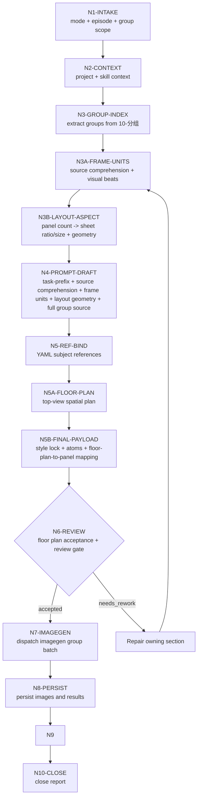

# Storyboard Sheet Workflow

本文件承载 `分镜故事板` 的思行一体化节点。业务拓扑是先串行锁源、识别 storyboard frame units、组装 prompt 和绑定主体，再按 imagegen 当前能力逐组或受控批量生成，最后统一汇流审查。

## Mermaid Workflow

## Thinking-Action Nodes

| node_id | objective | inputs | actions | evidence | route_out | gate |
| --- | --- | --- | --- | --- | --- | --- |
| `N1-INTAKE` | 锁定任务目标、mode、集号和分镜组范围 | 用户请求、目标项目 | 判定 `single_group_generate` / `episode_batch_generate` / `group_batch_generate` / `repair_and_regenerate` / `review_then_regenerate`；无 prompt-only 完成路线 | mode note | `N2` | 目标范围明确 |
| `N2-CONTEXT` | 加载项目与技能上下文 | `SKILL.md`、`CONTEXT.md`、`MEMORY.md`、项目 `CONTEXT/`、legacy optional `north_star.yaml` | 读取项目偏好与图像阶段上下文 | input manifest | `N3` | 必需 `SKILL.md`、`CONTEXT.md`、`MEMORY.md` 与项目 `CONTEXT/` 可读；legacy 文件缺失不阻断 |
| `N3-GROUP-INDEX` | 从 `10-分组` 建立组级索引 | `第N集.md` | 解析 `## x-y-z`、组正文、底部 YAML、完整分镜组内容、source shot labels 和分镜数量 | `group-index.json` | `N3A` | 每个 ID 唯一可回指 |
| `N3A-FRAME-UNITS` | 从当前分组资料理解内容并识别 storyboard panel 落点 | group index | 先记录 `source_comprehension`：叙事功能、动作链、空间/主体/道具锚点、视觉转折、必须保留事实和禁止补写项；再基于视觉节拍识别 frame units；记录 `panel_no`、`panel_image_aspect_ratio: 16:9`、`source_shot_labels`、`source_span`、`visual_beat`、`panel_description`、`panel_description_density: rich_brief`、`character_name_labels`、`annotation_plan`、`mapping_type`；不默认等同 `分镜N` | `group-index.json` | `N3B` | source comprehension 具体可追溯；每个 frame unit 可回指源正文且有 rich_brief panel 描述、角色头顶名称和标注计划 |
| `N3B-LAYOUT-ASPECT` | 按 panel 数反推整张 sheet 比例、gpt-image-2 合法尺寸与每格几何蓝图 | group index + frame units | 计算 `panel_count`；把下方文字区和标注安全边距计入 `effective_panel_slot_ratio`；枚举行列候选；为每个候选建立 `panel_geometry_blueprint`，锁定每格 `16:9 image_box` 和下方 `text_strip`；选择 `selected_grid`、`selected_sheet_aspect_ratio`、`selected_sheet_size`；记录 provider 约束、`panel_image_box_ratio_error`、分页/多 sheet 决策 | `group-index.json` / imagegen plan draft | `N4` | `selected_sheet_size` 满足 gpt-image-2 约束，`panel_geometry_blueprint` 完整，`panel_image_box_ratio_error <= 0.06`，且没有为固定画布压缩 panel |
| `N4-PROMPT-DRAFT` | 生成组级 storyboard prompt draft | group index + frame units + layout aspect decision | 添加任务执行前缀，写入 source comprehension、frame-unit plan、rich_brief panel 描述、角色头顶名称、annotation plan、layout aspect decision、panel geometry blueprint，直接接入完整分镜组内容；此时不得宣称 floor plan mapping 已完成 | prompt markdown draft | `N5` | 任务前缀、source comprehension、frame-unit、panel 描述密度、角色名、标注系统、locked 16:9 image box、sheet ratio/size 与完整性通过 |
| `N5-REF-BIND` | 保守绑定 YAML 主体参照 | prompt package、11-主体生成目录 | 多视图优先、主图次之、缺图移除槽位；为每个已绑定本地图记录 `context_role`；场景图记录空间结构与主体身份锚定 | reference manifest | `N5A` | 无猜测路径，主体保真锚定已记录 |
| `N5A-FLOOR-PLAN` | 为每个分镜组生成或锁定顶视图空间站位平面图 | prompt package、reference manifest、source comprehension、frame units、上一组 accepted floor plan | 按 `references/spatial-floor-plan-contract.md` 生成 `spatial_floor_plan`：场景边界、出入口、角色站位/朝向、道具位置、摄影机位置/方向、运动路径、frame-unit 对应关系；记录与上一平面图的 unchanged anchors、changed positions、movement logic 和 spatial consistency verdict | floor-plan manifest + floor-plans/<group_id>.png | `N5B` | 平面图为顶视图，空间关系可追溯，与上一组连续，进入内部验收 |
| `N5B-FINAL-PAYLOAD` | 在 accepted floor plan 后形成最终 imagegen payload | prompt draft、floor-plan manifest、frame units、layout aspect decision、reference manifest | 建立 `style_lock_spec`，隔离完整组稿上游风格句；逐 panel 写 `floor_plan_to_panel_mapping`；逐 panel 写 `visual_prompt_atoms`；把 prompt draft 升级为最终 prompt / imagegen plan，不让 Complete Group Source 作为风格指令 | final prompt markdown + imagegen plan draft | `N6` | style lock、visual prompt atoms 和 floor-plan-to-panel mapping 全部存在且可回指源 span / accepted floor plan |
| `N6-REVIEW` | 执行生成前审查与 floor plan acceptance | prompt、manifest、floor-plan manifest、imagegen plan draft | 检查 ID、任务执行前缀、style lock、source comprehension、frame units、visual prompt atoms、rich_brief panel 描述、角色头顶名称、annotation plan、默认 16:9、layout aspect decision、完整分镜组内容、路径、mode、主体保真策略、spatial floor plan 顶视图性质、空间连续性、acceptance verdict、floor plan to panel mapping；逐张 `view_image` 已绑定本地参照图并记录上下文状态；未通过则自动返工 owning section，不等待用户确认 | review note + floor plan acceptance | `N7` / repair | 必需项通过，参照图已可见，`spatial_floor_plan.acceptance.verdict == accepted`，且每个 panel 有 style lock / atoms / floor-plan mapping |
| `N7-IMAGEGEN` | 批量调用 imagegen | imagegen plan + accepted floor plans + final payload | 每组独立任务，使用已进入上下文的参照图、`style_lock_spec`、`visual_prompt_atoms`、accepted spatial floor plan 和 `floor_plan_to_panel_mapping`；统一标准黑白线稿分镜手稿风格基底，参照图和平面图用于主体身份/空间/道具/站位保真；按受控彩色标注系统叠加运动、机位、构图、灯光、情绪/声音/叙事强调，并在每个可见角色头顶添加与分组稿一致的黑色角色名；默认顺序或受控批量执行 | plan/result json | `N8` | 不覆盖、不越权，storyboard 空间站位与 accepted floor plan 一致，且无风格漂移词进入绘制原子 |
| `N8-PERSIST` | 持久化生成图像 | generated assets | 保存到项目目录，记录源路径 | images + results | `N9` | 项目内路径存在 |
| `N9-WRITE` | 写业务工件 | prompt、manifest、result | 写 prompt 文档、manifest、plan、report | file list | `N10` | 文件命名正确 |
| `N10-CLOSE` | 汇流交付 | 所有证据 | 总结 generated / skipped / failed 与返工入口；目标组无生成图路径时不能 pass | 执行报告 | done | review verdict `pass` 或 `pass_with_todo` 且存在生成图路径；不可恢复输入缺口只能 failed |

## Parallel Boundary

- `N1-N6` 是串行门禁，不应并发绕过；其中 `N3A` 必须由 LLM 完成源内容理解、frame units、panel 描述和标注计划，`N3B` 的候选枚举可由脚本辅助计算，但最终比例裁决和分页取舍必须由 LLM 基于内容与可读性确认，`N5A` 的空间站位、连续性判断和验收结论必须由 LLM 基于组稿、参照图和上一组 accepted floor plan 完成，`N5B` 的 style lock、visual prompt atoms 和 floor-plan-to-panel mapping 必须由 LLM 逐 panel 裁决；脚本只能辅助格式校验、manifest/路径检查和按已通过的 LLM 结果落盘。
- `N7` 默认按 `group_id` 顺序或受控批量执行；每个任务只能写自己的图片和结果记录。
- `N9-N10` 必须统一汇流，避免多个任务同时改写同一个报告文件。
