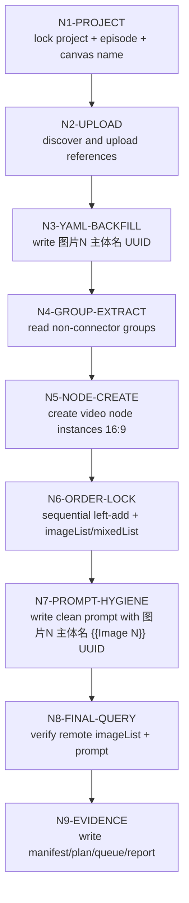

# Canvas Control Workflow

## N1-PROJECT

- Judgment: 是否已有目标画布项目，是否需要创建新版本。
- Action: `libtv project list`，缺省命名 `项目名-第N集`，冲突追加 `V2/V3`，再 `libtv project create`。
- Evidence: project name、projectUuid、冲突处理摘要。
- Gate: `GATE-LTVCTRL-PROJECT`。

## N2-UPLOAD

- Judgment: 角色、场景、道具参照图是否能唯一匹配。
- Action: 从默认目录收集图片；按本地文件名上传；记录 UUID、URL、节点名。
- Evidence: active registry、upload manifest。
- Gate: `GATE-LTVCTRL-UPLOAD`。

## N3-YAML-BACKFILL

- Judgment: 每个 YAML 主体是否有可匹配 UUID。
- Action: 回刷 `图片N 主体名 UUID`；同 UUID 复用编号；缺失跳过。
- Evidence: YAML excerpt、skipped list。
- Gate: `GATE-LTVCTRL-YAML`。

## N4-GROUP-EXTRACT

- Judgment: 哪些 `## x-y-z` 是非连接件分镜组。
- Action: 读取完整组正文和 fenced YAML，跳过 `## x-y-z~x-y-z`。
- Evidence: group list、connector skipped list。
- Gate: `GATE-LTVCTRL-GROUP`。

## N5-NODE-CREATE

- Judgment: 是否要删除旧视频节点；用户是否授权；同一 `source_group_id` 是否已有实例。
- Action: 查询 active registry 和远端已有节点；按 `vid__<source_group_id>__bNNN__rNN__vNNN` 选择新的 `video_node_instance_id` 创建 video 节点，默认 `star-video2/mixed2video/16:9/720p`，用户显式指定时覆盖默认值。已授权时才删除旧 video 节点；未授权时同一 `source_group_id` 的旧实例必须保留。
- Evidence: deleted node list、new node list、instance identity map。
- Gate: `GATE-LTVCTRL-NODE` / `GATE-LTVCTRL-NODE-IDENTITY`。

## N6-ORDER-LOCK

- Judgment: 本地 `图片N` 和远端槽位是否能一一锁定。
- Action:
  1. 从 YAML 读取 `ordered_subjects[]`。
  2. 按 `图片N` 顺序逐张执行 `--left-add <UUID>`。
  3. 直接写入 `imageList`、`mixedList`、`imageListOrder`、`mixedListOrder`。
  4. 连线后再次写入四个字段，避免入边操作扰动参数。
- Evidence: planned order、queried `data.params.imageList[]`。
- Gate: `GATE-LTVCTRL-ORDER`。

## N7-PROMPT-HYGIENE

- Judgment: prompt 是否干净且可执行。
- Action: 保留原分镜组正文；提交 prompt 的底部 YAML 主体行重排为 `图片N 主体名 {{Image N}} UUID`；删除旧 `{{Portrait N}}`、绑定表、命令说明和诊断文本。
- Evidence: final queried prompt excerpt。
- Gate: `GATE-LTVCTRL-PROMPT`。

## N8-FINAL-QUERY

- Judgment: 是否达到可运行前状态。
- Action: 查询每个视频节点；比较 `ratio`、`modeType`、`imageList`、prompt placeholders。
- Evidence: final query JSON 摘要。
- Gate: `GATE-LTVCTRL-FINAL`。

## N9-EVIDENCE

- Judgment: 本地证据是否足以复跑和审查。
- Action: 写以 `video_node_instance_id` 为前缀的 manifest、submit plan、queue record、执行报告，并更新 `source_group_id -> instances[]` registry。
- Evidence: 证据文件路径。
- Gate: `GATE-LTVCTRL-EVIDENCE`。
