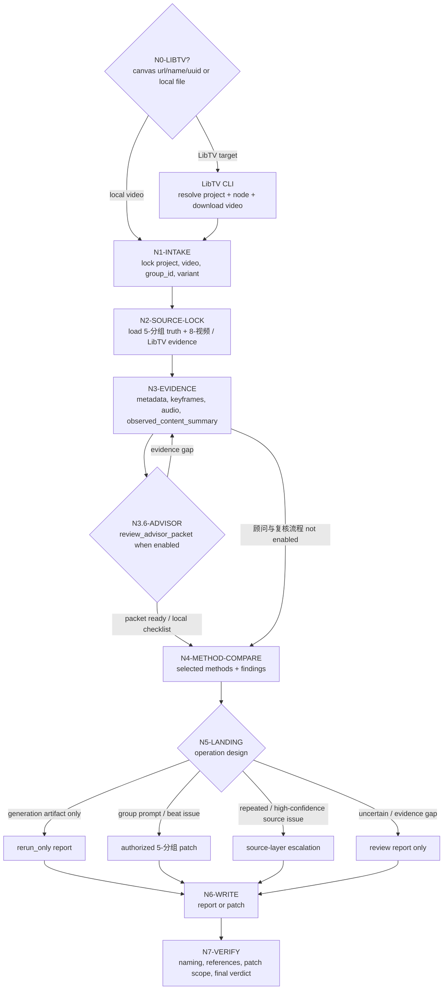
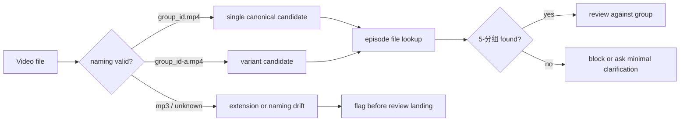
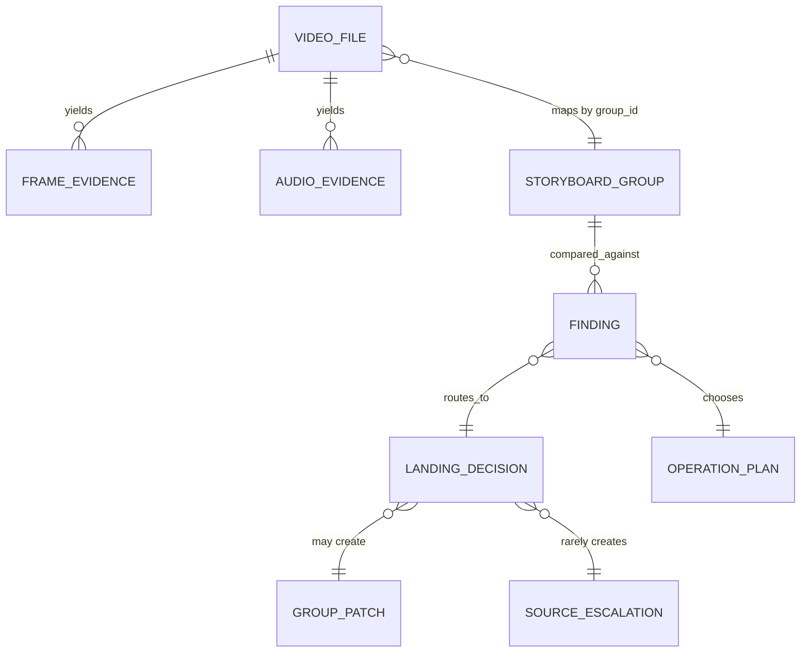

# aigc 9-审片

`9-审片` 是 AIGC 项目的视频成片审查、提示词匹配、创作质量鉴定与回写阶段。它消费 `8-视频` 下载或外部保存的实际视频素材，对照 `5-分组` 的分镜组真源、`8-视频` 的生成路线证据、用户显式给出的 prompt 和项目记忆，判断素材是否准确承载生成意图；同时评估视频本身是否存在废片级缺陷、AIGC 常见瑕疵、逻辑/一致性问题，以及创作层面的平庸、审美和艺术表达问题。

当审片目标来自 LibTV 画布时，本技能必须先结合 `.agents/skills/cli/libTV` 官方 CLI 解析画布、查询视频节点、下载真实视频并保存远端节点证据，再进入审片；不得停留在 prompt、节点 JSON、远端 URL 或画布缩略图层面做文本判断。

本技能支持用户显式提供好示例与坏示例。审片时应把示例作为当前任务的鉴赏校准证据，多维度比较后输出差异、归因和可执行改进；当示例偏好稳定、可复用且不与上层合同冲突时，将其沉淀到本技能同目录 `CONTEXT.md`，用于提升技能自身的鉴赏力。

## Multi-Subskill Continuous Workflow

当 `$aigc-video-review` 被整体调用时，视为用户授权按本技能声明的审片链路自动完成目标解析、真实视频取证、分镜组对照、审片报告和授权范围内的修复回写；在满足必要输入、显式选择和安全门后，不为每个内部节点额外确认。`N0 -> N7` 是默认自动化载体，不是固定审片方法；真正的审片方法必须按视频内容、分镜目标、prompt 证据、用户示例和风险信号动态选择。

- 数字序号节点默认按 `N0 -> N1 -> N2...` 串行执行，前一节点证据自动作为后一节点输入。
- LibTV 入口、命名定位、真实视频证据采集、prompt 对照和创作质量判断都属于同一条审片链，不得拆成互相孤立的文本判断。
- `N4-COMPARE` 必须先选择方法库中的审片方法，再形成 finding；默认三层判断是底座，不得成为遗漏表演、摄影、节奏、声音、道具、伦理、安全、AIGC 伪影或候选片比较的理由。
- `N5-LANDING` 必须把 finding 转化为具体操作，如接受、条件接受、同 prompt 重跑、修 LibTV prompt 后重提、修分组、拆并组、修资产引用、修图片顺序、修声音策略、请求补证或源层候选。
- 执行生成、重新提交、覆盖远端 prompt、修 `5-分组` 或源层文件属于受控动作；只有用户本轮明确要求或当前 landing 合同授权时才执行，并在报告中记录证据。
- 脚本和 CLI 只承担查询、下载、抽帧、统计、格式化和证据落盘；真实画面理解、错配归因、创作质量判断和修复落点由 LLM 直接完成。

## Context Loading Contract

- 每次调用 `$aigc-video-review` 时，必须同时加载同目录 `CONTEXT.md`。
- 每次调用本技能时，必须同时加载同目录 `types/type-map.md`，并按类型画像读取 `references/`、`steps/`、`review/` 中的必要细则。
- 若任务绑定 `projects/aigc/<项目名>/`，必须先加载项目根 `MEMORY.md`、`0-初始化/north_star.yaml`，再按需加载项目 `CONTEXT/` 中与视频审查、风格、角色、场景、道具或制作约束相关的上下文。
- 若输入包含 LibTV 链接、project UUID、画布名、`.libtv/project.json` 默认项目或要求重新提交，必须加载 `.agents/skills/cli/libTV/SKILL.md + CONTEXT.md`，并按需读取 `commands/project.md`、`commands/node.md` 和实际 `libtv download --help` 输出；LibTV 命令参数以 CLI help 为准。
- 若本阶段执行顾问与复核流程（包含用户显式要求、team reviewer runtime 或仓库合同视为默认启用），必须读取 `projects/aigc/<项目名>/team.yaml` 与 `../_shared/team-advisor-consultation-contract.md`，并按本文件 `Advisor Consultation Mechanism` 执行审片监制顾问请教。
- 对任何可定位的目标视频，必须定位对应分镜组：`projects/aigc/<项目名>/5-分组/第N集.md` 中的 `## x-y-z` 是审片事实对照的首要业务真源。
- 真实视频内容分析是本技能的必须条件：任何 verdict、finding、prompt 匹配、创作质量判断或上游修复，都必须先基于真实帧、联系表、运动变化和必要音频检查形成 `observed_content_summary`；不得只凭文件名、prompt、分镜组文本、manifest、LibTV 节点 JSON、远端 result URL、画布缩略图或用户预期给出审片结论。
- 冲突优先级：用户显式请求 > 根 `AGENTS.md` / meta 规则 > `.agents/skills/aigc/SKILL.md` > 本 `SKILL.md` > `references/` / `steps/` / `review/` / `types/` > `.agents/skills/aigc/5-分组/SKILL.md` > `.agents/skills/aigc/8-视频/SKILL.md` > 项目 `MEMORY.md` > 项目 `CONTEXT/` > 本 `CONTEXT.md`。

## Business Requirement Analysis

| field | decision |
| --- | --- |
| `business_goal` | 把本地或 LibTV 画布上的实际视频素材中的废片级缺陷、AIGC 常见瑕疵、提示词错配、逻辑/一致性问题、创作质量问题、命名不规范和远端生成证据漂移转化为可复查的审片结论与上游可执行修复。 |
| `business_object` | `8-视频` 下的 `.mp4` 素材、LibTV 画布视频节点、同组变体、对应 `5-分组` 分镜组、用户给定 prompt、好/坏示例、必要的 `8-视频` prompt / manifest / queue / report / LibTV node query。 |
| `constraint_profile` | 审片必须基于真实视频内容理解；LibTV 入口必须先查询并下载真实视频；不能只凭预期 prompt、分组文本、manifest、节点 JSON 或 result URL 推断；脚本只做元数据、抽帧、统计与结构校验，真实内容分析和核心判断由 LLM 完成。 |
| `success_criteria` | 能先解析审片目标并取得真实视频，再说明实际视频里发生了什么，对照分镜组意图、LibTV 远端 prompt、用户 prompt 和生成路线证据，区分 prompt 问题与模型问题，判断创作质量，吸收好坏示例校准，并给出 rerun / 5-分组修复 / 源层优化 / 鉴赏力沉淀落点。 |
| `non_goals` | 不生成新视频；不把单个模型偶发瑕疵直接升级为源层规则；不把审片报告替代 `5-分组` canonical truth。 |
| `topology_fit` | 混合型思行网络：先判型和取证，视觉/音频/命名/真源四路可并行分析；执行顾问与复核流程时加入审片监制顾问分支，最后由主 agent 统一汇流到唯一 verdict 与落盘计划。 |

## Input Contract

Accepted input:

- 单个或多个 `projects/aigc/<项目名>/8-视频/**/<分镜组ID>.mp4` 视频文件。
- 同一分镜组多个变体：`<分镜组ID>-a.mp4`、`<分镜组ID>-b.mp4`、`<分镜组ID>-c.mp4`。
- 当前项目中暂存于 `projects/aigc/<项目名>/8-视频/第N集/` 的外部下载视频。
- LibTV 画布链接 + 视频名，例如 `https://www.liblib.tv/canvas?projectId=<uuid>` + `1-1-1`；视频名默认等于明确给出的分镜组 ID。
- LibTV 画布名 + 视频名，例如 `美剧DEMO-第1集` + `1-1-1`；必须通过 `libtv project list --name` 唯一匹配画布。
- LibTV project UUID + 视频名，或当前目录 `.libtv/project.json` 已绑定项目 + 视频名。
- 用户要求“审片”“看片”“分析视频内容”“对照分镜组”“把问题改回 5-分组”“从素材反推 prompt / 分组问题”。
- `8-视频` 阶段生成的 prompt、queue、manifest、results 或执行报告，用于辅助定位生成路线和 prompt 证据。
- 用户显式提供的 prompt、好示例、坏示例、参考片段、风格标杆或反例，用于做当前任务的匹配判断与鉴赏校准。

Required input:

- 可读的视频文件，或可从项目根和分镜组 ID 搜索到唯一候选视频；若来自 LibTV，必须能通过 CLI 查询到唯一画布和唯一视频节点，并下载为本地可读视频。
- 可定位的项目根 `projects/aigc/<项目名>/`。
- 可定位的 `group_id`，优先从文件名提取；若文件名不规范，必须从用户说明、目录上下文或视频内容谨慎推断并报告不确定性。
- 可读的 `projects/aigc/<项目名>/5-分组/第N集.md`。
- 可回指的真实视频内容证据：至少包含元数据、关键帧或联系表、实际画面内容摘要；有音轨时还必须包含音频事实说明。

Reject or clarify when:

- 视频不存在或不可读，且无法从项目路径搜索到候选。
- LibTV 画布名多命中、视频节点名多命中、节点未生成视频 URL、CLI 未登录或下载失败，且无法取得本地可读视频。
- 文件名无法定位分镜组，且没有足够目录或用户上下文唯一推断。
- 用户要求在没有视频证据的情况下直接“审片结论落盘”。
- 无法观察或描述真实视频内容，却要求给出通过 / 不通过、prompt 匹配、创作质量或上游修复结论。
- 用户要求把低置信缺陷直接改到源层规则。

## Naming Contract

- 规范视频文件名：`<分镜组ID>.mp4`，例如 `1-3-1.mp4`。
- 同组变体规范：`<分镜组ID>-<variant>.mp4`，`variant` 使用小写英文字母 `a`、`b`、`c` 递增，例如 `1-3-1-a.mp4`。
- 文件名中的 `group_id` 必须是三段式 `episode-scene-group`；四段式 `shot_id` 视频素材应先回推所属 `group_id`，并在审片报告中记录命名漂移。
- 用户或外部系统若保存为 `.mp3`，只按音频素材或扩展名异常处理；视频审片 canonical 扩展名仍为 `.mp4`。若用户明确要求音频审查，可审音频但不得视作视频成片通过。
- `8-视频` 生成、下载、整理结果时也必须遵守本命名合同；不得再用 `<group_id>-<sessionId>.mp4` 作为 canonical 成片名。需要保留 sessionId 时写入 queue / results / report，而不是文件名主体。

## Reference Loading Guide

| 场景 | 读取文件 |
| --- | --- |
| 任意审片任务 | `types/type-map.md`、`steps/video-review-workflow.md`、`references/video-evidence-contract.md` |
| LibTV 链接 / project UUID / 画布名 / 远端视频节点 / 重新提交 | `references/libtv-intake-contract.md`、`.agents/skills/cli/libTV/SKILL.md + CONTEXT.md`、`commands/project.md`、`commands/node.md`、`libtv download --help` |
| 审片阶段执行顾问与复核流程 / team reviewer runtime | `../_shared/team-advisor-consultation-contract.md`，并按本 `Advisor Consultation Mechanism` 执行 |
| 明确审片维度、prompt 匹配、创作质量 | `references/review-dimensions-contract.md` |
| 需要更丰富审片点、方法选择、选片或操作设计 | `references/review-method-palette-contract.md` |
| 用户提供好示例/坏示例或要求提升鉴赏力 | `references/example-comparison-learning-contract.md`、`CONTEXT.md` |
| 文件名、变体、路径定位 | `references/video-naming-contract.md` |
| 发现落盘到 `5-分组` 或审片报告 | `references/finding-landing-contract.md`、`templates/review-report.template.md` |
| 判断是否上升源层优化 | `references/source-escalation-contract.md` |
| 质量门禁和验收 | `review/review-gate.md` |
| 脚本边界 | `scripts/README.md` |

## Advisor Consultation Mechanism

当 `9-审片` 执行顾问与复核流程时，执行语义固定为“项目审片监制顾问团请教 -> 多维审片参谋汇流 -> 鉴赏/风险上下文沉淀 -> 后续 compare、landing 和复核消费”，而不是让顾问或复核结论直接给最终 verdict、替代真实视频理解、改写 `5-分组`、改写 prompt 或决定源层修复。

1. 主 agent 先读取项目 `team.yaml`，按 `../_shared/team-advisor-consultation-contract.md` 解析监制组相关智能顾问团；优先使用 `roles.supervision.members`、`roles.supervising.members` 或其引用成员，必要时才按共享合同补位并记录原因。
2. 该流程中的顾问作为审片监制顾问运行：围绕真实视频证据包、`observed_content_summary`、对应 `5-分组` 真源、用户 prompt、`8-视频` 生成证据、好/坏示例、项目 `MEMORY.md`、`north_star.yaml`、相关 `CONTEXT/`、本技能 `PASS-REVIEW-*` 思维通过点、`N*-*` 执行节点和 review gate，代入各自角色意识、创作风格与专业水准进行参谋。
3. 顾问问题不得固定为“好不好看”或静态审片表；主 agent 必须从当前节点的 `input / judgment / action / evidence / route_out / gate / rework target` 派生问题。示例：在 `N3-EVIDENCE` 让顾问指出证据缺口，在 `N4-COMPARE` 让顾问分别判断视频本体、prompt 匹配、创作质量与示例差距，在 `N5-LANDING` 让顾问检查错配归因和修复落点是否越权。
4. 主 agent 负责裁决、去重和汇流，把顾问建议压缩成 `review_advisor_packet.must_check / must_not_accept / quality_bar / rerun_or_repair_guidance / execution_brief`，并保留 `node_ref / pass_ref / gate_ref / role_lens` 等来源锚点，作为后续 compare、landing、报告写入、阶段内修复和复审的额外上下文。
5. `review_advisor_packet` 不拥有真实视频内容事实、最终 verdict、`5-分组` canonical 写回、`8-视频` prompt 组装、源层升级或本技能 `CONTEXT.md` 鉴赏力沉淀的裁决权；顾问建议若与真实视频证据、用户显式请求、分镜组真源或本技能合同冲突，必须舍弃或降级为风险提示。
6. 若外部顾问与复核 provider 不可用，直接使用本地顾问与复核流程；不得把主 agent 本地顺序扮演写成外部 provider 已执行。

`review_advisor_packet` 的最小形态：

```yaml
review_advisor_packet:
  project_team_ref: "projects/aigc/<项目名>/team.yaml"
  stage: "9-审片"
  roster_source_note: ""
  consultation_mode: "ask-team-advisors-for-evidence-grounded-video-review"
  roster:
    - name: ""
      skill_path: ""
      source: ""
      selected_for: "video_intrinsic | prompt_alignment | creative_quality | example_calibration | landing_risk"
  consultations:
    - member: ""
      node_ref: ""
      pass_ref: ""
      gate_ref: ""
      role_lens: ""
      consultation_question: ""
      answer_summary: ""
      executable_guidance:
        - ""
      risk_flags:
        - ""
      routeback_targets:
        - node_ref: ""
          reason: ""
  must_check:
    - ""
  must_not_accept:
    - ""
  quality_bar:
    - ""
  rerun_or_repair_guidance:
    - ""
  execution_brief: ""
  local_checklist:
    findings: []
    repair_actions: []
```

## Visual Maps





```mermaid
stateDiagram-v2
    [*] --> "N1-INTAKE"
    "N1-INTAKE" --> "N2-SOURCE-LOCK"
    "N2-SOURCE-LOCK" --> "N3-EVIDENCE"
    "N3-EVIDENCE" --> "N3.6-ADVISOR": 顾问与复核流程 enabled
    "N3.6-ADVISOR" --> "N3-EVIDENCE": evidence gap
    "N3.6-ADVISOR" --> "N4-METHOD-COMPARE": packet ready / local checklist
    "N3-EVIDENCE" --> "N4-METHOD-COMPARE": 顾问与复核流程 not enabled
    "N4-METHOD-COMPARE" --> "N5-LANDING"
    "N5-LANDING" --> "N6-WRITE"
    "N6-WRITE" --> "N7-VERIFY"
    "N7-VERIFY" --> Finalized
```



## Thinking-Action Node Network

| node_id | objective | inputs | actions | evidence | route_out | gate |
| --- | --- | --- | --- | --- | --- | --- |
| `N0-LIBTV-INTAKE` | 从 LibTV 入口取得真实视频和远端生成证据 | LibTV 链接、project UUID、画布名、`.libtv/project.json`、视频名/group_id | 用 `.agents/skills/cli/libTV` 执行账号摘要验证、项目解析、节点查询、节点证据落盘、`libtv download` 下载到 `8-视频`；视频名省略时只可用明确 `group_id` 作为默认值 | projectUuid、nodeKey、remote query、result URL、download path、canonical video path | `N1-INTAKE` 或阻断 | 画布和节点唯一，真实视频可读 |
| `N1-INTAKE` | 锁定项目、视频、分镜组和变体 | 用户输入、文件路径 | 解析路径、命名、集号、group_id、variant | input manifest | `N2-SOURCE-LOCK` 或阻断 | group_id 可定位 |
| `N2-SOURCE-LOCK` | 锁定 5-分组真源和可选 8-视频 / LibTV 证据 | group_id、项目根、LibTV node query | 读取 `5-分组/第N集.md` 对应组，按需读取 prompt/manifest/report/queue/LibTV params.prompt/taskInfo/imageList/mixedList | source excerpt refs、remote generation evidence | `N3-EVIDENCE` | 组正文唯一，生成路线证据已归档 |
| `N3-EVIDENCE` | 取得并理解真实视频内容 | 视频文件 | 读取元数据、抽关键帧、生成联系表、必要时检查音频与场景切换；先描述实际画面、主体、动作、空间、节奏和可见缺陷 | metadata、keyframes、contact sheet、audio note、observed_content_summary | `N3.6-ADVISOR` 或 `N4-COMPARE` | 证据足够支撑真实视频内容分析 |
| `N3.6-ADVISOR` | 顾问与复核流程 审片监制参谋汇流 | `team.yaml`、共享顾问合同、视频证据包、`observed_content_summary`、prompt、分镜组真源、好/坏示例、当前 `PASS-REVIEW-*` / `N*-*` 节点 | 启动或按不可用说明处理 team.yaml 中明确的监制组相关智能顾问团；主 agent 从当前审片节点派生顾问问题，让顾问围绕视频本体、prompt 匹配、创作质量、示例校准和落点风险给可执行参谋 | `review_advisor_packet` 或本地 checklist 结果 | `N4-COMPARE` / `N3-EVIDENCE` | packet 已包含 roster 来源、node/pass/gate 来源、角色视角、可执行指导、风险提示和 `execution_brief`；若顾问指出证据不足，必须回到 `N3-EVIDENCE` |
| `N4-COMPARE` | 选择方法并多维对照素材、prompt 与创作质量 | 组正文、视频证据、prompt、好/坏示例、`review_advisor_packet` | 先按 `references/review-method-palette-contract.md` 选择方法，再判断视频本体、source/prompt 匹配、表演、摄影、节奏、声音、道具、伦理安全、AIGC 伪影、候选片比较和示例差距；吸收顾问参谋但不让顾问替代 verdict | `method_selection`、`method_findings`、quality verdict | `N5-LANDING` | 方法选择有理由，每条 finding 有证据和维度 |
| `N5-LANDING` | 决定落点和操作 | method finding list、quality verdict、置信度、授权状态 | 区分 landing 与 operation，设计 accept、conditional accept、rerun、LibTV prompt repair and rerun、group repair、shot split/merge、asset/image/sound repair、request evidence 或 source candidate | landing + operation plan | `N6-WRITE` | 不越权升级，不把偏好误作硬规则，受控动作有授权 |
| `N6-WRITE` | 写入 canonical 输出 | landing plan | 写审片报告；高置信时修 `5-分组`；极高置信时修源层 | changed files / report | `N7-VERIFY` | 改动可追溯 |
| `N7-VERIFY` | 验收与闭环 | 输出文件 | 检查命名、引用、patch 范围、源层升级理由 | review verdict | final | verdict 明确 |

## Finding Severity And Landing

| severity | meaning | default landing |
| --- | --- | --- |
| `P0-blocker` | 视频与分镜组错配、主体错误、不可用、严重安全/审美违背 | 审片报告 + 阻断 rerun；必要时修 `5-分组` |
| `P1-group-repair` | 分镜组提示过载、焦点不清、beat 合并、关键物缺失，且改组能直接改善 | 修对应 `5-分组/第N集.md` 的 `## group_id` |
| `P2-rerun-only` | 单次生成瑕疵、模型手部/文字/小面积伪影、prompt 清楚但模型未执行、无需改组 | 审片报告 + rerun 建议 |
| `P3-source-candidate` | 多素材重复出现，指向阶段合同、命名规则或提示模板问题 | 源层优化候选；满足升级门后才改源层 |
| `P4-quality-learning` | 用户示例显示稳定审美偏好，当前视频创作质量落差可复用 | 审片报告 + `CONTEXT.md` 鉴赏力经验候选 |

## Execution Contract

1. 按 Context Loading Contract 加载技能、项目记忆、north_star 和必要上下文。
2. 若输入是 LibTV 链接、project UUID、画布名或目录绑定项目，先执行 `N0-LIBTV-INTAKE`：解析唯一 project、查询唯一视频节点、保存远端 node query、下载真实视频到 `projects/aigc/<项目名>/8-视频/`，并记录 `libtv_input`。下载失败或视频不可读时不得继续写审片 verdict。
3. 解析视频命名：`<group_id>.mp4` 或 `<group_id>-<variant>.mp4`；命名漂移必须作为 finding 记录。LibTV 视频名默认等于明确的 `group_id`，不得在缺少 `group_id` 时凭画面猜视频名。
4. 从 `5-分组/第N集.md` 抽取对应 `## group_id` 的完整组正文、YAML、入出场或组间连接件；同时读取本地 `8-视频` prompt / manifest / queue 和 LibTV `params.prompt` / `taskInfo` / `imageList` / `mixedList` 作为生成路线证据。
5. 读取视频元数据、抽关键帧并生成联系表；有音轨时检查音频是否为空、是否过响/过弱、是否含明显非预期 BGM 或对白。
6. 在任何对照或 verdict 之前，必须先完成真实视频内容分析：用自己的话说明实际画面里出现的主体、场景空间、动作变化、镜头节奏、关键道具、音频事实和明显 AIGC 缺陷；该摘要必须能回指关键帧、联系表或音频证据。
7. 若本轮执行顾问与复核流程，必须在真实视频内容分析之后、最终 compare / landing 之前执行 `N3.6-ADVISOR`：按项目 `team.yaml` 请教审片监制顾问，或使用本地流程；顾问问题必须绑定当前 node/pass/gate。
8. 在 `N4-COMPARE` 前先形成 `method_selection`：至少覆盖真实视频理解、source / prompt 对照和创作质量底座；再按视频信号选择连续性、表演、摄影、剪辑节奏、声音、关键道具、伦理安全、AIGC 伪影、prompt 执行、候选片比较和修复设计等方法；跳过的方法必须写理由。
9. 对照实际视频与分镜组、用户 prompt、LibTV 远端 prompt、同组变体和用户示例：内容主体、空间、动作、镜头节奏、关键道具、风格、音频、连续性、prompt 匹配、创作质量和美学表达必须逐项判断；可吸收 `review_advisor_packet`，但不得让顾问替代主 agent 裁决。
10. 对 prompt 错配必须归因：优先区分 `prompt_problem`（缺失、矛盾、过载、不可执行、审美指令空泛、远端 prompt 占位污染）与 `model_problem`（prompt 清楚但模型未执行、单次 seed 漂移、模型能力边界、物理/文字/手部等生成瑕疵）。
11. 若用户提供好/坏示例，必须先提炼可观察维度，再用这些维度比较目标视频；只把稳定、可复用、非一次性偏好的结论沉淀为本技能 `CONTEXT.md` 的鉴赏力学习。
12. 形成 finding list，每条 finding 必须包含 `dimension`、`method_id`、`evidence`、`expected`、`actual`、`root_cause_guess`、`severity`、`landing`、`confidence`、`candidate_operations` 和 `chosen_operation`。
13. 设计操作时必须区分 landing 与 operation：同一 `group_repair` 可对应 `group_prompt_repair`、`shot_split_or_merge`、`asset_reference_repair`；同一 `rerun_only` 可对应 `rerun_same_prompt` 或 `rerun_with_seed_or_model_change`。
14. 若 landing 为 `5-分组`，只改对应组或其直接相邻入场/连接件；不得顺手重写整集。
15. 若用户本轮要求“更改提示词后重新提交”，必须先保存修复前 LibTV node query，再修 prompt，查询验证 prompt hygiene，最后通过 `libtv node <video_name> -p <projectUuid> --run` 提交，并把 task id、result URL、final query 和 queue record 写入证据。
16. 若 landing 为源层，必须满足 `references/source-escalation-contract.md` 的高置信升级门，并在最终说明中写明 `Symptom -> Direct Cause -> Source Owner -> AGENTS.md`。
17. 写入或更新 `projects/aigc/<项目名>/9-审片/第N集/<group_id>[-variant]-审片.md`；若执行了 `5-分组`、LibTV prompt/rerun、源层修复、`CONTEXT.md` 鉴赏力沉淀或 顾问与复核流程的顾问请教，同步记录在报告中。
18. 最终对用户输出唯一 verdict、已改文件、LibTV 任务/结果状态、思考过程、验证结果和残留风险。

## Field Master

| field_id | owner | canonical file | must contain | fail code |
| --- | --- | --- | --- | --- |
| `FIELD-REVIEW-00` | LibTV intake | review report / evidence dir | projectUuid、video node、remote query、downloaded video、canonical path | `FAIL-REVIEW-LIBTV-INTAKE` |
| `FIELD-REVIEW-01` | input lock | review report | project root、video path、group_id、variant、episode | `FAIL-REVIEW-INPUT` |
| `FIELD-REVIEW-02` | source lock | `5-分组/第N集.md` | unique group body and line anchor | `FAIL-REVIEW-SOURCE` |
| `FIELD-REVIEW-03` | real video understanding | review report | metadata、keyframes / contact sheet、audio note、observed_content_summary、content-to-evidence refs | `FAIL-REVIEW-EVIDENCE` |
| `FIELD-REVIEW-04` | finding | review report / patch | expected vs actual、severity、confidence、landing | `FAIL-REVIEW-FINDING` |
| `FIELD-REVIEW-05` | landing | `9-审片` / `5-分组` / source skill | write decision and patch scope | `FAIL-REVIEW-LANDING` |
| `FIELD-REVIEW-06` | prompt alignment | review report / `5-分组` / `8-视频` | prompt match verdict、mismatch owner、prompt/model attribution | `FAIL-REVIEW-PROMPT-MATCH` |
| `FIELD-REVIEW-07` | creative quality | review report / `CONTEXT.md` | anti-banal verdict、aesthetic rationale、example calibration | `FAIL-REVIEW-QUALITY` |
| `FIELD-REVIEW-08` | 顾问与复核流程 advisor consult | review report / execution report | 执行顾问与复核流程时 `review_advisor_packet` 已绑定 node/pass/gate、角色视角、可执行指导和本地流程 | `FAIL-REVIEW-ADVISOR` |
| `FIELD-REVIEW-09` | LibTV rerun evidence | `8-视频/libTV画布流` / review report | clean prompt query、rerun task id、final node query、result URL、queue record | `FAIL-REVIEW-LIBTV-RERUN` |
| `FIELD-REVIEW-10` | review method selection | review report | selected_methods、skipped_methods、selection_reason、coverage of user concerns and video signals | `FAIL-REVIEW-METHOD-SELECTION` |
| `FIELD-REVIEW-11` | operation design | review report / patch / LibTV evidence | candidate_operations、chosen_operation、rejected_operations_reason、authorization and closure evidence | `FAIL-REVIEW-OPERATION-DESIGN` |

## Thought Pass Map

| pass_id | focus field | core question | action | evidence |
| --- | --- | --- | --- | --- |
| `PASS-REVIEW-00` | `FIELD-REVIEW-00` | LibTV 目标是否解析成唯一画布、节点和本地真实视频 | 用 `libtv project/node/download` 查询与下载，保存远端证据 | `libtv_input` + node query + downloaded video |
| `PASS-REVIEW-01` | `FIELD-REVIEW-01` | 素材是否能唯一映射分镜组 | 解析命名和路径，必要时搜索项目 | input manifest |
| `PASS-REVIEW-02` | `FIELD-REVIEW-02` | 分镜组真源是否唯一可读 | 抽取 `## group_id` 正文和相邻衔接 | source lock note |
| `PASS-REVIEW-03` | `FIELD-REVIEW-03` | 是否真实理解了视频内容，而非只看 prompt 或分组文本 | ffprobe、抽帧、联系表、音频和切点检查，并写实际画面内容摘要 | evidence pack + observed_content_summary |
| `PASS-REVIEW-04` | `FIELD-REVIEW-04` | 缺陷是素材偶发还是上游可修 | 分级、置信度和落点判断 | finding table |
| `PASS-REVIEW-05` | `FIELD-REVIEW-05` | 是否允许写回 canonical truth | 按落点合同写报告/组修复/源层修复 | changed paths |
| `PASS-REVIEW-06` | `FIELD-REVIEW-06` | 视频是否匹配 prompt，错配应归因到哪里 | 比对 prompt、分组、manifest 和实际视频 | mismatch attribution |
| `PASS-REVIEW-07` | `FIELD-REVIEW-07` | 视频是否平庸或审美失准，示例是否形成可学习偏好 | 对比好/坏示例并提炼维度 | quality calibration note |
| `PASS-REVIEW-08` | `FIELD-REVIEW-08` | 执行顾问与复核流程时顾问参谋是否节点级、可执行且未越权 | 解析 team.yaml、派生顾问问题、汇流 packet 或使用本地 checklist | `review_advisor_packet` / local checklist |
| `PASS-REVIEW-09` | `FIELD-REVIEW-09` | 重新提交是否使用干净 prompt 并保存最终 LibTV 证据 | 修 prompt、final query、授权后 `--run`、更新 queue/report | task id + result URL + final query |
| `PASS-REVIEW-10` | `FIELD-REVIEW-10` | 是否按真实视频信号选择了适配方法，而不是套固定表或漏掉用户关注点 | 选择 method palette，记录跳过理由 | `method_selection` |
| `PASS-REVIEW-11` | `FIELD-REVIEW-11` | finding 是否转成具体可执行操作，且操作与 landing 区分清楚 | 生成 candidate / chosen / rejected operations | operation plan |

## Pass Table

| pass_id | pass standard | fail code | rework entry |
| --- | --- | --- | --- |
| `PASS-REVIEW-00` | LibTV project、node、download 和 canonical video path 全部可回指；未只凭远端文本审片 | `FAIL-REVIEW-LIBTV-INTAKE` | `references/libtv-intake-contract.md` |
| `PASS-REVIEW-01` | group_id 与 variant 明确，命名异常已记录 | `FAIL-REVIEW-INPUT` | Naming Contract |
| `PASS-REVIEW-02` | `5-分组` 中只命中一个对应组 | `FAIL-REVIEW-SOURCE` | `references/finding-landing-contract.md` |
| `PASS-REVIEW-03` | 视频内容描述来自真实帧/联系表/音频证据，并在 verdict 前完成 observed content 分析 | `FAIL-REVIEW-EVIDENCE` | `references/video-evidence-contract.md` |
| `PASS-REVIEW-04` | 每条 finding 有 expected/actual/evidence/confidence | `FAIL-REVIEW-FINDING` | `review/review-gate.md` |
| `PASS-REVIEW-05` | 写回范围与置信度匹配，不越权改源层 | `FAIL-REVIEW-LANDING` | `references/source-escalation-contract.md` |
| `PASS-REVIEW-06` | prompt 错配已区分 prompt 问题、模型问题或证据不足 | `FAIL-REVIEW-PROMPT-MATCH` | `references/review-dimensions-contract.md` |
| `PASS-REVIEW-07` | 创作质量判断有可观察依据，不把个人偏好伪装为硬门禁 | `FAIL-REVIEW-QUALITY` | `references/example-comparison-learning-contract.md` |
| `PASS-REVIEW-08` | 执行顾问与复核流程时已形成 `review_advisor_packet`，或使用本地流程；不得本地模拟说成外部 provider 调度 | `FAIL-REVIEW-ADVISOR` | `../_shared/team-advisor-consultation-contract.md` + 本 `Advisor Consultation Mechanism` |
| `PASS-REVIEW-09` | LibTV rerun 已通过 prompt hygiene 查询、task 完成状态和 final query 证据闭环 | `FAIL-REVIEW-LIBTV-RERUN` | `references/libtv-intake-contract.md#Prompt And Rerun Coupling` |
| `PASS-REVIEW-10` | 方法选择发生在真实视频理解之后，覆盖底座方法，并按视频信号扩展到适用审片点 | `FAIL-REVIEW-METHOD-SELECTION` | `references/review-method-palette-contract.md` |
| `PASS-REVIEW-11` | 每条重要 finding 有 candidate operations、chosen operation 和拒绝其他操作的理由 | `FAIL-REVIEW-OPERATION-DESIGN` | `references/review-method-palette-contract.md#Operation Palette` |

## Root-Cause Execution Contract (Mandatory)

审片发现问题时必须沿链路上溯：

`Video Symptom -> Direct Footage Cause -> 5-分组 / 8-视频 / 4-摄影 Source Owner -> Skill Contract -> AGENTS.md LLM-first / Skill 2.0 Rule`

优先判断：

1. 单次模型瑕疵：只建议 rerun，不改上游。
2. 分镜组提示过载或焦点漂移：修 `5-分组` 对应组。
3. LibTV 画布解析、远端 prompt 污染、节点查询或下载落点漂移：先修本次 `8-视频/libTV画布流` 证据和 prompt；多例稳定时再回到 `8-视频` 命名/输出合同。
4. 摄影语言长期不可动、镜头不可执行：候选上溯 `4-摄影`，但需多例证据。
5. 顾问与复核流程启用时跳过 `team.yaml` 顾问请教、顾问问题脱离审片节点、没有汇流 `review_advisor_packet`，或把本地模拟写成外部 provider 调度：回到本 `Advisor Consultation Mechanism` 和共享团队顾问合同。
6. 技能结构或模板导致系统性错误：才修技能源层，并记录高置信依据。

## Output Contract

- Required output: 审片 verdict、LibTV intake 摘要或本地视频入口摘要、真实视频内容分析、视频证据摘要、方法选择、prompt 匹配结论、创作质量判断、示例校准摘要、finding list、操作设计、顾问与复核流程的顾问 packet 摘要或本地流程、落盘动作、思考过程、验证结果；若重新提交，必须包含 task id、result URL、final query 和 queue/report 证据。
- Output format: 面向用户的简短结论 + `projects/aigc/<项目名>/9-审片/第N集/<group_id>[-variant]-审片.md` 报告；必要时还包含 `5-分组` patch 或源层 patch。
- Output path: 本技能 canonical 报告写入 `projects/aigc/<项目名>/9-审片/第N集/`；证据写入 `projects/aigc/<项目名>/9-审片/第N集/evidence/<group_id>/`；业务修复写回其 owning source，不把修复正文藏在审片报告里。
- Naming convention: 报告命名为 `<group_id>[-variant]-审片.md`；LibTV 远端查询证据命名为 `<group_id>-libtv-node-query.ndjson` / `<group_id>-libtv-final-node-query.ndjson`；本地视频仍为 `<group_id>[-variant].mp4`，task id、node key 和 result URL 只写入报告或 queue 证据。
- Completion gate: 本地或 LibTV 真实视频已取得且可读；真实视频内容分析已完成并可回指帧/联系表/音频证据；分镜组真源可回指；LibTV 入口证据可回指远端 node query/download/final query；方法选择能解释覆盖和跳过；finding 有分级、落点和操作；执行顾问与复核流程时已有 `review_advisor_packet` 或完整本地流程；所有写回都能解释为什么不只是 rerun。
