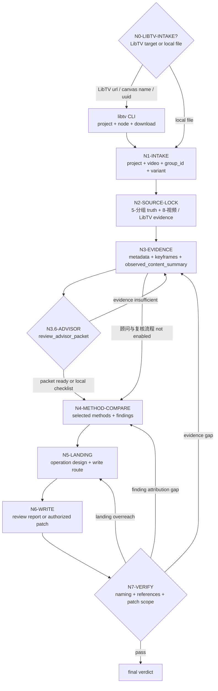

# Video Review Workflow

## Mermaid Topology

## N0 LibTV Intake

只在用户输入包含 LibTV 链接、project UUID、画布名、`.libtv/project.json` 默认项目或远端视频节点时进入。

- 加载 `.agents/skills/cli/libTV/SKILL.md + CONTEXT.md` 和必要命令文档。
- 解析 `https://www.liblib.tv/canvas?projectId=<uuid>` 中的 `projectId`；若输入是画布名，用 `libtv project list --name "<canvas_name>"` 唯一匹配。
- 视频名默认等于明确给出的 `group_id`；若缺少 `group_id` 和视频名，阻断并要求最小澄清。
- 用 `libtv node <video_name> -p <projectUuid>` 查询远端节点，保存 node query 到 `9-审片/第N集/evidence/<group_id>/`。
- 用 `libtv download -p <projectUuid> -n <video_name> -o projects/aigc/<项目名>/8-视频` 下载真实视频，必要时整理为 `<group_id>[-variant].mp4` 并记录原始下载路径。
- 将 `projectUuid`、`video_node_key`、`remote_result_url`、`taskInfo`、`params.prompt`、`imageList/mixedList`、下载路径和 canonical 视频路径写入 `libtv_input`。
- 若画布多命中、节点不存在、节点未生成 URL、下载失败或视频不可读，停止在 `FAIL-REVIEW-LIBTV-INTAKE` / `FAIL-REVIEW-EVIDENCE`，不得给审片 verdict。

## N1 Intake

- 解析项目根、视频路径、集号、group_id、variant。
- 若命名不规范，记录 `naming_drift`。
- 若视频来自 LibTV，继承 `N0` 的 `libtv_input`，并确认本地 canonical 视频存在。

## N2 Source Lock

- 打开 `projects/aigc/<项目名>/5-分组/第N集.md`。
- 抽取目标 `## group_id`。
- 读取相邻衔接段，判断首尾状态。
- 读取用户显式 prompt、`8-视频` prompt / manifest / queue / report、LibTV `params.prompt` / `taskInfo` / `imageList` / `mixedList`；没有 prompt 证据时标记 `prompt_evidence_gap`。
- 若用户提供好示例或坏示例，锁定示例路径、角色和用户标签。

## N3 Evidence Capture

- 用 `ffprobe` 读取元数据。
- 用 `ffmpeg` 抽关键帧或联系表。
- 有音轨时记录音频强度和内容类型。
- 先形成 `observed_content_summary`，说明真实视频里的主体、动作、空间、节奏、关键物、音频事实和可见缺陷。

## N3.6 Advisor Consultation

仅在执行顾问与复核流程时进入。

- 读取项目 `team.yaml` 和 `../_shared/team-advisor-consultation-contract.md`。
- 按 `SKILL.md#Advisor Consultation Mechanism` 解析审片监制顾问 roster。
- 从当前审片节点派生顾问问题，不使用固定“好不好看”题型：
  - `N3-EVIDENCE`：证据是否足够支撑真实视频理解。
  - `N4-COMPARE`：视频本体、prompt 匹配、创作质量、示例差距是否有遗漏。
  - `N5-LANDING`：rerun、group repair、source escalation、quality learning 的落点是否越权。
- 主 agent 汇流为 `review_advisor_packet`；若外部 provider 调度 不可用，使用本地 checklist，不得伪装成已执行顾问与复核流程。

## N4 Method Palette Compare

`N4` 先选择审片方法，再形成 finding。三层维度是真实视频理解、source / prompt 对照和创作质量的底座，不是固定流程上限。

底座方法：

1. 视频本身问题：基础废片、逻辑合理性、一致性、AIGC 常见瑕疵。
2. 视频和 prompt / 分镜组匹配问题：主体、动作、空间、风格、负面约束、首尾状态是否一致。
3. 创作层面质量问题：反平庸、艺术方向、美学完整性、镜头调度、节奏和记忆点。

按素材信号继续选择：

- `source_fidelity_pass`：对照剧本原文、分镜组和 prompt，查事件、人物、关系、空间、道具、动作、台词/旁白是否走偏。
- `continuity_pass`：查首尾状态、角色身份、服装、道具、站位、光线、空间轴线。
- `performance_pass`：查表演动机、眼神、微表情、肢体、情绪转折和权力关系。
- `cinematography_pass`：查机位、景别、构图、前景/遮挡、焦点转移、运动动机和观众位置。
- `editing_rhythm_pass`：查 15 秒内起承停点、信息密度、切点和接下一组能力。
- `sound_pass`：查音量、对白/旁白、环境声、BGM 和静音策略。
- `prop_object_pass`：查关键物是否出现、可读性、状态连续和替换/融化。
- `ethics_safety_pass`：查暴力、胁迫、伤害、危险行为、项目禁区和呈现方式。
- `aigc_artifact_forensics`：查手脸、伪文字、肢体、物体融化、身份漂移、空间漂移和时间闪烁。
- `prompt_execution_pass`：查 prompt 缺失、矛盾、过载、占位污染、图片顺序和负面约束。
- `candidate_selection_pass`：同组多个变体时比较共同问题、单片优势、修复成本和选片排序。
- `repair_design_pass`：把重要 finding 转成候选操作和最终操作。

必须输出：

- `selected_methods`
- `skipped_methods` and reason
- `method_findings`
- 错配归因：`prompt_problem` / `model_problem` / `mixed_cause` / `evidence_gap`
- 好/坏示例距离
- 反平庸和美学质量
- `review_advisor_packet` 中可执行的审片风险提示和质量门建议

## N5 Landing And Operation Design

- 接受优质候选：`accept_as_candidate`
- 技术可用但非最优：`conditional_accept`
- 同组多变体：`compare_variants`
- 单次瑕疵：`rerun_same_prompt`
- 多次同 prompt 失败：`rerun_with_seed_or_model_change`
- 分组文本导致：`group_prompt_repair`
- 单组承载过多 beat 或相邻组切分错误：`shot_split_or_merge`
- 角色/场景/道具/参考图错误：`asset_reference_repair`
- LibTV `imageList/mixedList` 或图片占位顺序错误：`image_order_repair`
- 音频策略、BGM、对白或静音目标不清：`sound_policy_repair`
- 下载、命名、variant 或 node key 漂移：`download_or_naming_repair`
- prompt 缺失、矛盾、过载、远端占位污染或不可执行：`group_prompt_repair`、`libtv_prompt_repair_and_rerun` 或 `source_escalation_candidate`
- prompt 清楚但模型未执行：`rerun_same_prompt`
- 用户要求更改提示词后重新提交：保存修复前 LibTV node query，修 prompt，查询验证无 `{{Portrait N}}`、无诊断/路径/绑定表污染，用户授权下执行 `libtv node <video_name> -p <projectUuid> --run`，写 task id、result URL、final query 和 queue/report 证据。
- 创作质量弱但可用：`review_only` + 重跑建议
- 用户示例形成可复用鉴赏 heuristic：`quality_learning`
- 多例系统问题：`source_escalation_candidate`
- 证据不足：`request_missing_evidence`
- 不可用但需留证避免复用：`archive_rejected_candidate`
- 顾问与复核流程的顾问指出证据或归因不足：回到 `N3-EVIDENCE` 或 `N4-COMPARE`，不得硬写最终 verdict。

每条重要 finding 必须写 `candidate_operations`、`chosen_operation` 和未选择其他操作的理由。`landing` 决定写回层级，`operation` 决定具体动作。

## N6 Write And Verify

- 写 `9-审片` 报告。
- 如有授权和高置信，写 `5-分组` 修复。
- 如有 LibTV 重新提交，写入 `8-视频/libTV画布流/第N集/<group_id>-queue-record.json` 或审片报告中的等价证据，且最终 query 必须可回指。
- 如为选片任务，写明 primary / backup / rejected 候选，不把 reject 候选静默混入可用素材。
- 如形成稳定跨项目鉴赏经验，写入本技能 `CONTEXT.md` 的 `Aesthetic Calibration Heuristics`。
- 若执行顾问与复核流程，使用 `review_advisor_packet` 摘要；不可用时直接使用本地 checklist。
- 运行相关结构检查或人工等价检查。
