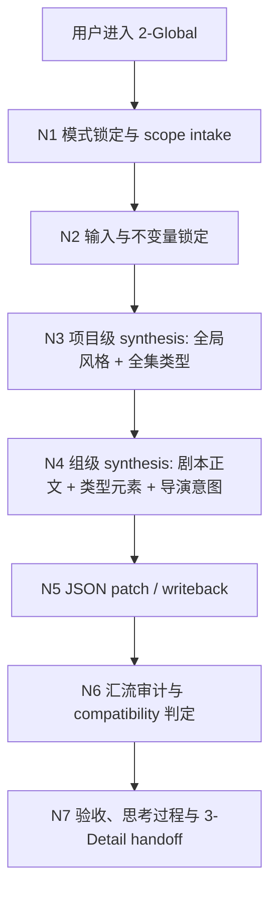
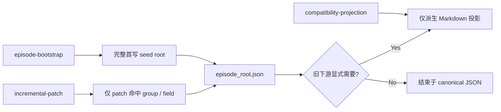
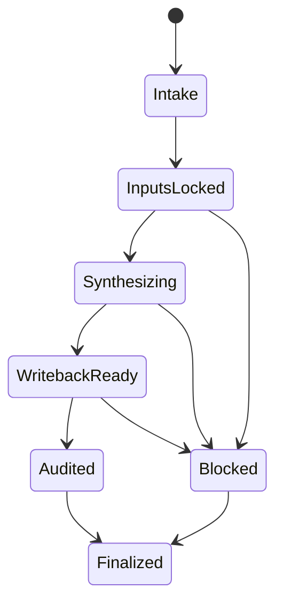
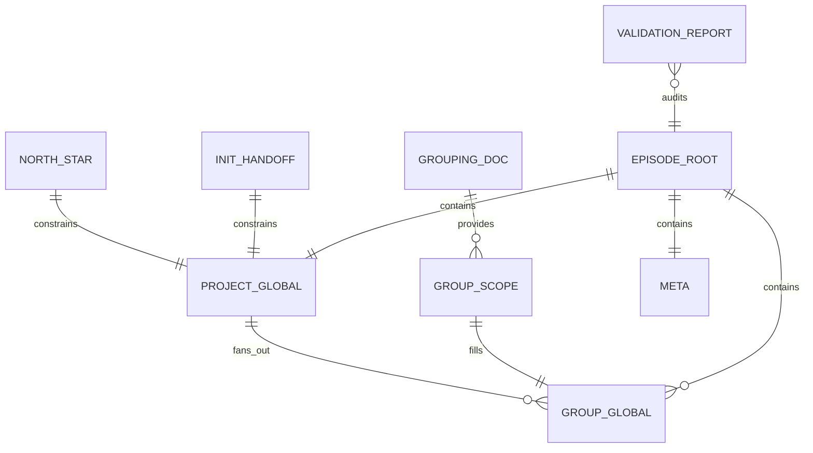

# aigc 2-Global

## Context Loading Contract

- 每次调用本技能时，必须同时加载同目录 `CONTEXT.md` 作为预加载上下文。
- 本技能默认采用 `单技能知行合一 + skeleton-first`：根 `SKILL.md` 负责主骨架、思行网络、门禁、输入输出与验收；复杂细则下沉到 `references/`，但不得形成第二真源。
- 若同目录 `CONTEXT.md` 缺失，应先补齐最小知识库骨架，或向用户明确报告阻塞；不得在未检查该上下文的情况下执行技能。
- 冲突优先级：用户显式请求 > 仓库/全局 `AGENTS.md` > `.agents/skills/aigc/SKILL.md` > 本 `SKILL.md` > 本目录 `references/*` > 本 `CONTEXT.md`。

## 概述

`2-Global` 是 `1-Planning` 与 `3-Detail` 之间的导演前置收束阶段。

它的唯一业务目标不是再写四份平行长文，而是把规划分组结果与初始化预设直接收束为一颗组级 seed root：

- 直接把结果写入 `projects/aigc/<项目名>/2-Global/episode_root.json`
- `episode_root.json` 是本阶段唯一业务真源
- `全局风格.md / 全集类型元素.md / 分组类型元素.md / 导演意图.md` 不再是默认 canonical 输出；若旧下游暂时仍依赖它们，只能作为由 JSON 派生的兼容投影

## Single-Skill Positioning

### 本技能拥有

- `2-Global/episode_root.json` 的唯一写回权
- 项目级 `全局风格 / 全集类型元素` 与组级 `全局风格 / 类型元素 / 导演意图 / 剧本正文` 的单技能内收裁决权
- 前置 advisory 的消费与采纳裁决权
- 阶段级 `validation-report.md` 的闭环写回权

### 本技能不拥有

- 在本阶段发明任何 shot-level 字段
- 把四份 Markdown 重新升格为主链真源
- 让外置导演组 contracts 或旧模板反向夺取字段写回权
- 把落盘后的 refine owner 继续交给 `监制`

## Mode Selection

`2-Global` 默认按以下三种模式之一运行：

1. `episode-bootstrap`
   - 当前集尚无 `2-Global/episode_root.json`，需要基于分组正文与 init 预设首写一颗完整 seed root。
2. `incremental-patch`
   - 当前已存在 `2-Global/episode_root.json`，需要仅对命中组或命中字段增量 patch。
3. `compatibility-projection`
   - 当前 canonical JSON 已确认，只因旧下游显式需要，才派生兼容 Markdown 投影。

选择规则：

- 没有现存 `episode_root.json` 时，默认进入 `episode-bootstrap`。
- 只修局部组、局部字段、局部 advisory 采纳结果时，进入 `incremental-patch`。
- 用户或旧下游只要求 `全局风格.md` 等衍生文件，且 JSON 已稳定时，才进入 `compatibility-projection`。
- `compatibility-projection` 不能单独替代前两种模式；它永远依附于已确认 JSON。

## Business Requirement Analysis Contract (Mandatory)

| analysis_slot | 当前结论 |
| --- | --- |
| `business_goal` | 将规划分组结果与初始化预设直接收束为 `projects/aigc/<项目名>/2-Global/episode_root.json`，并把稳定组级 seed 交给 `3-Detail` |
| `business_object` | `0-Init` 的项目基线、`1-Planning` 的当前集分组正文、已有 `episode_root.json`、项目根 `team.yaml`（若存在） |
| `constraint_profile` | `episode_root.json` 必须同时承载 `meta`、项目级 `project_global`、以及 `groups[].global`；`global.剧本正文` 必须完整整理自命中组正文；不得在本阶段发明 shot-level 字段；兼容 Markdown 若被生成，只能由 JSON 派生 |
| `success_criteria` | `episode_root.json` 已稳定写入 `meta + project_global + groups[].global`，其中 `全局风格 / 类型元素 / 导演意图` 对下游可消费、可追溯、可增量 patch；`validation-report.md` 已记录验收与阻塞 |
| `non_goals` | 不生成 shot-level 明细；不把本阶段写成平行长文流水线；不再维护第二套导演组 agent 真源 |
| `complexity_source` | 项目级稳定项与当前集组级增量并存；类型总则与组级打法要分层；又要保证 JSON 结构能直接给 `3-Detail` 消费 |
| `topology_fit` | 采用“输入锁定 -> 项目级判断 -> 组级判断 -> JSON 汇流 -> 阶段验收”的思行网络，而不是四条分离写作链 |
| `step_strategy` | 先锁不变量，再做项目级 synthesis，再做组级 synthesis，最后统一 patch-in-place 与验收；必要时仅对命中 scope 增量回写 |

## Visual Maps

## Reference Loading Guide

- 在执行节点主干前，先读取 [references/思行网络.md](references/思行网络.md)。
- 在核对字段、pass 与验收槽位时，读取 [references/字段与验收映射.md](references/字段与验收映射.md)。
- 在执行增量 patch、compat projection 或 advisory 采纳裁决时，读取 [references/增量写回与兼容投影.md](references/增量写回与兼容投影.md)。
- `references/` 只细化本技能主合同；若与本 `SKILL.md` 冲突，以本文件为准。

## Context Preload (Mandatory)

加载顺序固定为：

1. 根 `AGENTS.md`
2. `.agents/skills/aigc/SKILL.md + CONTEXT.md`
3. 本 `SKILL.md + CONTEXT.md`
4. `.agents/skills/aigc/_shared/project-runtime-layout.md`
5. `.agents/skills/aigc/_shared/group_design_seed_contract.md`
6. `.agents/skills/aigc/2-Global/_shared/IO_CONTRACT.md`
7. `.agents/skills/aigc/2-Global/_shared/branch-output-contract.md`
8. `.agents/skills/aigc/2-Global/_shared/episode_root.json`
9. `.agents/skills/aigc/2-Global/references/思行网络.md`
10. `.agents/skills/aigc/2-Global/references/字段与验收映射.md`
11. `.agents/skills/aigc/2-Global/references/增量写回与兼容投影.md`
12. `.agents/skills/aigc/_shared/council-runtime/module-spec.md`
13. `.agents/skills/aigc/_shared/council-runtime/team.template.yaml`
14. `projects/aigc/<项目名>/MEMORY.md`（若项目已绑定）
15. `projects/aigc/<项目名>/CONTEXT/` 相关文件（若存在）
16. `projects/aigc/<项目名>/team.yaml`（若存在）
17. `projects/aigc/<项目名>/0-Init/north_star.yaml`
18. `projects/aigc/<项目名>/0-Init/init_handoff.yaml`
19. `projects/aigc/<项目名>/0-Init/story-source-manifest.yaml`（若存在）
20. `projects/aigc/<项目名>/1-Planning/2-格式/第N集.md`（若存在）
21. `projects/aigc/<项目名>/1-Planning/3-分组/第N集.md`
22. `projects/aigc/<项目名>/1-Planning/3-分组/执行报告.md`（若存在）
23. `projects/aigc/<项目名>/2-Global/episode_root.json`（若存在）
24. `projects/aigc/<项目名>/2-Global/validation-report.md`（若存在）

## Shared Canonical Sources (Mandatory)

- 强制读取：`.agents/skills/aigc/2-Global/_shared/IO_CONTRACT.md`
- 强制读取：`.agents/skills/aigc/2-Global/_shared/branch-output-contract.md`
- 强制读取：`.agents/skills/aigc/_shared/project-runtime-layout.md`
- 强制读取：`.agents/skills/aigc/_shared/group_design_seed_contract.md`
- 强制读取：`.agents/skills/aigc/2-Global/_shared/episode_root.json`
- 强制读取：`.agents/skills/aigc/_shared/council-runtime/module-spec.md`
- 强制读取：`.agents/skills/aigc/_shared/council-runtime/team.template.yaml`
- 可选校验：`.agents/skills/aigc/2-Global/scripts/validate_director_intent.py`

硬规则：

1. 本阶段的第一输入根固定为 `projects/aigc/<项目名>/1-Planning/3-分组/第N集.md`。
2. 项目级稳定约束优先来自 `0-Init/north_star.yaml`、`0-Init/init_handoff.yaml` 与 `story-source-manifest.yaml`。
3. `episode_root.json` 是本阶段唯一 canonical 业务载体。
4. 本阶段必须把完整组级 seed 写入 `episode_root.json`，并同步维护 `meta.剧名 / 集数 / 组数 / 总时长`、`project_global.*` 与 `groups[].分镜组ID / global.剧本正文 / global.*`。
5. `groups[].global.剧本正文` 必须完整整理自 `1-Planning/3-分组/第N集.md` 的命中组正文，除组号标题外不得二次摘要。
6. `groups[].global.全局风格 / 类型元素 / 导演意图` 必须由本阶段直接定稿写入 JSON，不允许先写 Markdown 再抽取。
7. 兼容投影若存在，只能由 JSON 派生；不得出现“Markdown 一套、JSON 一套”的双真源。

## Total Input Contract (Mandatory)

### 必需输入

- `projects/aigc/<项目名>/1-Planning/3-分组/第N集.md`
- `projects/aigc/<项目名>/0-Init/north_star.yaml`
- `projects/aigc/<项目名>/0-Init/init_handoff.yaml`

### 可选输入

- `projects/aigc/<项目名>/0-Init/story-source-manifest.yaml`
- `projects/aigc/<项目名>/1-Planning/2-格式/第N集.md`
- `projects/aigc/<项目名>/1-Planning/3-分组/执行报告.md`
- `projects/aigc/<项目名>/team.yaml`
- `projects/aigc/<项目名>/2-Global/episode_root.json`
- 用户显式指定的风格、类型或导演偏好

### 禁止输入

- 与当前项目无关的外部参考文本
- 要求本阶段直接写 shot-level 字段或镜头 JSON 的额外指令
- 任何外置导演组 team、agent、creative method 文档作为业务真源

## Internal Capability Fusion Contract (Mandatory)

| 能力面 | 作用 | 典型输出 | 何时触发 |
| --- | --- | --- | --- |
| `global_style_engine` | 从项目级证据中提炼稳定的媒介属性、渲染底座、摄影级总体属性与禁区 | `project_global.全局风格` | 每次进入 `2-Global` 时 |
| `type_bible_engine` | 提炼项目级类型总则、观众合同与下游边界 | `project_global.全集类型元素` | 每次进入 `2-Global` 时 |
| `group_type_engine` | 将当前集各组转译为组级类型信号 | `groups[].global.类型元素` | 当前集分组稳定后 |
| `director_intent_engine` | 生成各组导演意图与 detail 放大方向 | `groups[].global.导演意图` | 当前集分组稳定后 |
| `json_writeback_engine` | 把项目级与组级结果、完整组正文与 meta 一次性写入 `episode_root.json` | `episode_seed_patch` | 上游字段稳定后 |
| `convergence_audit_engine` | 校验 JSON 结构、边界、长度窗与下游可消费性 | `convergence_report`、`writeback_patch_set` | 写回前必须触发 |
| `supervision_council_engine` | 对前置 advisory 的命中与采纳做记录 | `advisory_synthesis`、`thought_summary_note` | `team.yaml` 启用且命中 `roles.supervision` 时 |

硬规则：

1. 上述能力面全部内收在当前 `SKILL.md`，不是外置真源。
2. 任何能力面都不得绕过父 skill 直接写平行 canonical 文件。
3. 细化说明统一下沉到 `references/`，但能力 ownership 仍以本节为准。

## Field Master

字段总表以 [references/字段与验收映射.md](references/字段与验收映射.md) 为细则承载；本节保留审计所需的最小骨架：

| field_id | target_path | owner_pass | requirement |
| --- | --- | --- | --- |
| `FIELD-GLOBAL-01` | `meta.剧名 / 集数 / 组数 / 总时长` | `5-组正文入壳` | 必须与当前项目和当前集严格一致 |
| `FIELD-GLOBAL-02` | `project_global.全局风格` | `1-项目级风格` | 形成项目级统一风格前缀 |
| `FIELD-GLOBAL-03` | `project_global.全集类型元素` | `2-项目级类型` | 形成项目级类型总则 |
| `FIELD-GLOBAL-04` | `groups[].分镜组ID / global.剧本正文` | `5-组正文入壳` | 保留命中组原始正文与组标识 |
| `FIELD-GLOBAL-05` | `groups[].global.全局风格` | `1-项目级风格` | 默认继承项目级风格前缀 |
| `FIELD-GLOBAL-06` | `groups[].global.类型元素` | `3-组级类型` | 对齐当前组的类型信号 |
| `FIELD-GLOBAL-07` | `groups[].global.导演意图` | `4-导演意图` | 对齐当前组的导演执行导向；必须具备观看策略、执行抓手和禁用方向，禁止写成剧情摘句 |
| `FIELD-GLOBAL-08` | `validation-report.md` | `6-验收` | 写回验收、阻塞与根因上溯 |

## Thought Pass Map

详细节点网络见 [references/思行网络.md](references/思行网络.md)；本节保留 pass 级主干映射：

| pass_id | step_name | input | output |
| --- | --- | --- | --- |
| `P1` | `1-项目级风格` | `north_star / init_handoff / team.yaml` | `project_global.全局风格`、`groups[].global.全局风格` |
| `P2` | `2-项目级类型` | `north_star / init_handoff / 第N集分组正文` | `project_global.全集类型元素` |
| `P3` | `3-组级类型` | `project_global.全集类型元素`、`第N集分组正文` | `groups[].global.类型元素` |
| `P4` | `4-导演意图` | `第N集分组正文`、`project_global.*`、`groups[].global.类型元素` | `groups[].global.导演意图` |
| `P5` | `5-组正文入壳` | `第N集分组正文`、全部已定稿字段 | `episode_root.json` |
| `P6` | `6-验收` | `episode_root.json` | `validation-report.md` |

## Pass Table

更细粒度字段规则见 [references/字段与验收映射.md](references/字段与验收映射.md)；本节保留 pass 门禁骨架：

| pass | direct_write_target | hard_gate |
| --- | --- | --- |
| `1-项目级风格` | `project_global.全局风格`、`groups[].global.全局风格` | 不得写成具体镜头操作或工具参数 |
| `2-项目级类型` | `project_global.全集类型元素` | 不得混入某一组的临场打法 |
| `3-组级类型` | `groups[].global.类型元素` | 必须逐组对齐，不得跨组混写 |
| `4-导演意图` | `groups[].global.导演意图` | 必须可被 `3-Detail` 直接消费；不得只是剧情复述、正文截句或情绪评语 |
| `5-组正文入壳` | `meta`、`groups[].分镜组ID`、`groups[].global.剧本正文` | 必须完整保留命中组正文 |
| `6-验收` | `validation-report.md` | 必须记录阻塞、根因上溯与下一阶段回接 |

## Thinking-Action Node Contract

| node_id | objective | actions | evidence | route_out | gate |
| --- | --- | --- | --- | --- | --- |
| `N1-MODE-LOCK` | 锁定 `episode-bootstrap / incremental-patch / compatibility-projection` 与命中 scope | 判断是否已有 JSON、是否只修局部、是否只派生 compat 文件 | `mode_decision_note` | `N2` | 模式唯一，scope 唯一 |
| `N2-INPUT-LOCK` | 锁定输入与字段不变量 | 读取分组正文、init 预设、旧 JSON、team advisory 条件 | `input_lock_note`、`invariant_brief` | `N3` | 上游真源完整，禁止 shot-level 漂移 |
| `N3-PROJECT-GLOBAL` | 形成项目级 `全局风格 / 全集类型元素` | 从 init 预设、north star、必要 advisory 提炼项目级稳定项 | `project_global_patch` | `N4` | 不得混入组级临场打法 |
| `N4-GROUP-GLOBAL` | 形成组级 `剧本正文 / 全局风格 / 类型元素 / 导演意图` | 逐组整理正文、类型信号和导演导向 | `group_global_patch_set` | `N5` | 必须逐组对齐，不得跨组混写 |
| `N5-WRITEBACK` | 把项目级与组级结果汇流进 JSON | 对模板做 patch-in-place，维护 `meta + project_global + groups[].global` | `episode_seed_patch`、`writeback_patch_set` | `N6` | 只写命中 scope，不发明新壳 |
| `N6-CONVERGENCE` | 检查 canonical JSON 与 compat 条件 | 审核结构、边界、derived-only compat 资格 | `convergence_report` | `N7` | compat 只能晚于 canonical |
| `N7-CLOSURE` | 完成阶段验收、思考过程与 handoff | 写 `validation-report.md`，输出 closure triad 与 `3-Detail` handoff | `validation-report.md`、`handoff_note`、`思考过程` | 完成 | 必须可追溯、可续跑 |

硬规则：

1. 所有节点都属于同一 `SKILL.md` 统辖，不得被拆成平行真源链。
2. `N3` 先于 `N4`，`N5` 先于 `N6`，`N7` 必须最后执行。
3. 若项目根 `team.yaml.enabled == true` 且当前阶段命中 `roles.supervision`，advisory 只能在 `N2-N4` 间作为前置输入被消费，不得在 `N5` 之后成为 refine owner。
4. `incremental-patch` 只 patch 命中 `group / field / advisory scope`，不默认全量重跑。

## One-Shot Output Contract (Mandatory)

`2-Global` 的一次性输出固定为：

1. `projects/aigc/<项目名>/2-Global/episode_root.json`
   - 唯一业务真源
2. `projects/aigc/<项目名>/2-Global/validation-report.md`
   - 记录本轮验收、阻塞、根因上溯与 closure
3. `思考过程`
   - 并列说明本轮 `mode`、命中 scope、关键约束、advisory 是否采纳、为何这样 patch
   - 只作为 operator-facing reasoning 摘要，不夺取 canonical 真源地位
4. `closure triad + handoff note`
   - 说明 `root cause location / immediate fix / systemic prevention fix`
   - 给出下一入口固定为 `3-Detail`
5. 可选兼容投影
   - 仅当旧下游明确需要时，允许从 JSON 派生 `全局风格.md / 全集类型元素.md / 分组类型元素.md / 导演意图.md`
   - 这些投影不拥有真源地位

## Canonical Output Governance (Mandatory)

1. `episode_root.json` 是本阶段唯一 canonical 业务载体。
2. `validation-report.md` 是本阶段唯一 stage 验收载体。
3. 若生成兼容 Markdown，它们只能由 JSON 派生，不得先写 Markdown 再回填 JSON。
4. `全局风格` 必须服务统一画面风格锚定，不得混入具体镜头操作、具体景别或工具参数。
5. `全集类型元素` 只写项目级类型总则，不得混入当前组临场打法。
6. `类型元素` 与 `导演意图` 都必须对齐当前 `分镜组ID`。
7. `导演意图` 必须回答“观众如何看、现场如何拍、什么方向禁用”三件事；推荐字段形态为“观看策略：...；执行抓手：...；禁用...”，不得从 `global.剧本正文` 截一句当成导演判断。
8. `episode_root.json` 的 `groups[].global.*` 由当前 skill 聚合写入，但本阶段不得发明 shot-level 字段。
9. 首次落盘后的审计与验收必须回到阶段自己的 `validation-report.md` / audit 机制；不得再把 `监制` 用作 stage-end refine 的 owner。

## Acceptance Checklist (Mandatory)

完成本技能前，必须确认：

1. `projects/aigc/<项目名>/2-Global/episode_root.json` 已落盘。
2. `meta + project_global + groups[].global` 结构完整。
3. `groups[].global.剧本正文` 是完整组正文，不是摘要。
4. `groups[].global.类型元素 / 导演意图` 与命中组严格对齐。
5. `groups[].global.导演意图` 已通过三层导向复核或 `scripts/validate_director_intent.py` 校验，不像剧本正文随手截句。
6. `projects/aigc/<项目名>/2-Global/validation-report.md` 已写回，或明确记录阻塞。
7. 若生成兼容 Markdown，它们都来自已确认 JSON，而不是前置真源。
8. 下一阶段固定回接到 `projects/aigc/<项目名>/3-Detail/`。

## Root-Cause Execution Contract (Mandatory)

若本阶段失败，必须按以下格式上溯：

1. `Symptom`
2. `Direct Cause`
3. `Rule Source`
4. `Meta Rule Source`

最小上溯样式：

- `Symptom`: `episode_root.json` 字段缺失、跨组混写、compat 投影反客为主、或把组正文写成摘要
- `Direct Cause`: `mode_decision` 错误、`json_writeback` 未锁定字段边界、或把 advisory / compat 当成真源
- `Rule Source`: 本 `SKILL.md` 的 `Mode Selection`、`Thinking-Action Node Contract`、`Canonical Output Governance`
- `Meta Rule Source`: 根 `AGENTS.md` 的 `LLM-first creative authorship`、`执行深度默认规则`、`复合型技能输出治理合同`
