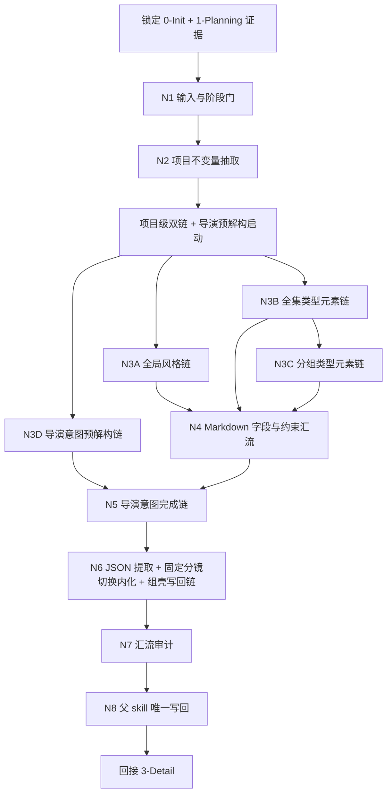
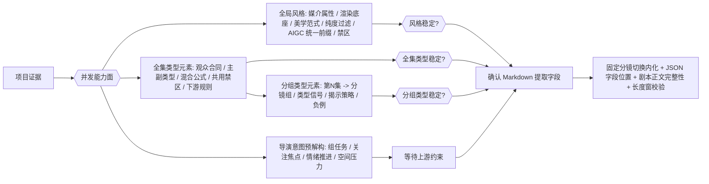
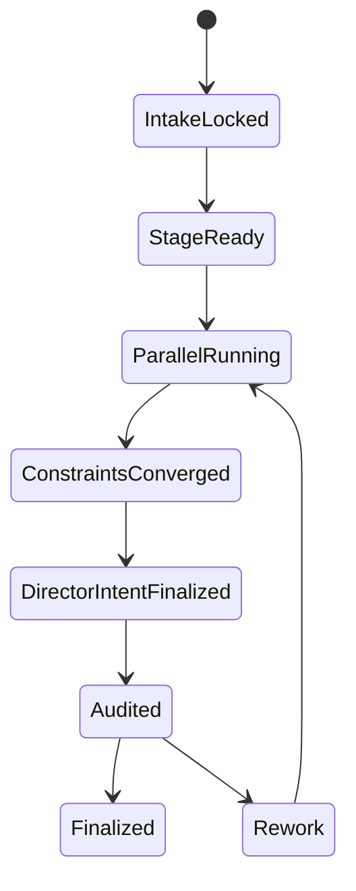
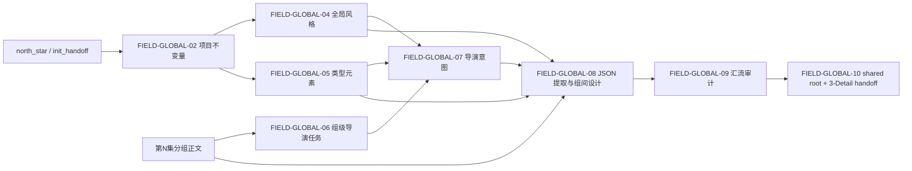

# aigc 2-Global

## 概述

`2-Global` 是 `aigc` 技能树位于 `1-Planning` 与 `3-Detail` 之间的导演前置全局合同阶段。

它不再把导演能力外包给外置导演组 contracts。从本轮开始，`全局风格`、`全集类型元素`、`分组类型元素`、`导演意图` 四个能力面全部内收在同一 `SKILL.md` 内，以“串行锁定前提 + 项目级双链并行 + 分组级双链并行 + 先在 Markdown 定稿 + 对照字段标题提取入 shared episode root”的知行合一网络完成执行。

本轮重编排遵循两个原则：

- 内容层面全量继承现有 `2-Global` 已沉淀的四份真源、模板口径、项目级/组级分层与下游 handoff 边界
- 机制层面改写为单技能真源，不再维护平行的导演组 team、角色 agent 合同或外置创作方法真源

## Skill Execution Rule (Mandatory)

`2-Global` 采用单技能内部融合模式：

- skill 自身负责输入读取、业务分析、并发链裁决、模板约束、四份 Markdown 写回、字段提取入壳、shared episode root seed、汇流审计与下游回接
- `全局风格`、`全集类型元素`、`分组类型元素`、`导演意图` 不是外置 subagents，而是父 skill 的内部能力链
- 中间只允许形成内部 `plan / note / report / patch set`，最终 canonical 写回只能由当前 `SKILL.md` 完成
- 不得再回指任何外置导演组 contracts 作为执行真源

## When to Use

- 已经有 `projects/aigc/<项目名>/1-Planning/3-分组/第N集.md`，需要进入导演前置全局合同阶段。
- 需要把初始化预设、规划分组结果与当前项目定位沉淀为四份 Markdown 长文本真源，并同步写入可被 `3-Detail` 直接继承的 shared episode root。
- 需要在阶段末段先给每个分镜组直接写入固定 `分镜切换` 数字，为 `3-Detail` 的真实切镜提供上游真值。
- 需要同时处理项目级稳定项与当前集分镜组级导演构思，但又不希望把它们混成一份空泛总稿。
- 需要按知行合一方式，把复杂导演判断写成“思行节点 + 并发链 + 汇流门”。

## When Not to Use

- 当前连 `projects/aigc/<项目名>/1-Planning/3-分组/第N集.md` 都不存在。
- 当前任务其实还是分集、剧本或分组问题，应回到 `1-Planning`。
- 当前任务已经在补镜级字段、主体、设计、画面或视频产物，应进入 `3-Detail / 4-Design / 5-Image / 6-Video`。

## Business Requirement Analysis Contract (Mandatory)

| analysis_slot | 当前结论 |
| --- | --- |
| `business_goal` | 把规划分组结果与初始化预设收束为 `全局风格.md`、`导演意图.md`、`全集类型元素.md`、`分组类型元素.md` 四份导演前置真源，并把已确认字段、固定 `分镜切换` 与完整分组正文直接写入 shared episode root |
| `business_object` | `0-Init` 的项目基线、`1-Planning` 的当前集分组正文、已有 `2-Global` 文档、shared episode root 与四个模板 |
| `constraint_profile` | `全局风格.md` 必须是项目级稳定、可被角色/场景/道具/分镜无污染继承的底层风格协议，并最终形成 AIGC 生图/生视频统一风格前缀；默认只描述媒介属性、渲染技术栈、美学范式与全局控制轴，不固定景别、镜头距离或具体对象内容，且默认禁止具体颜色词、具体材质词、构图术语与焦段/推拉摇移等摄影操作词直接进入最终字段；`全集类型元素.md` 只写项目级类型总则，`分组类型元素.md` 与 `导演意图.md` 都必须按 `第N集 -> 【x-x-x】` 组织；`2-Global/类型元素.md` 只允许作为旧项目迁移输入 fallback，不得作为新输出；`组间设计.全局风格 / 类型元素 / 导演意图` 必须分别直接提取自 Markdown 同名字段，默认字符窗为 `220 / 50 / 100`；`分镜切换` 必须以 `总时长 + 类型元素 + 导演意图 + 分组正文` 为输入，直接写成一个固定镜数，不再写预算包；`组间设计.出场角色及穿搭` 为组级服装摘要槽，`2-Global` 阶段允许先留空字符串，由 `3-Detail` 回填 `角色名-服装简述`；`剧本正文` 必须完整整理入 JSON，除组号标题外不得二次摘要；不得在本阶段发明 shot-level 明细；不再依赖外置导演组 contracts |
| `success_criteria` | 四份 Markdown 真源结构完整、项目级与组级边界清楚、每条内部链都有细致步骤、并发关系与汇流门明确，并且 shared episode root 已写入完整分镜组壳：`分镜组ID / 总时长 / 剧本正文 / 组间设计（含空或已填的出场角色及穿搭） / 分镜切换 / 空分镜明细[]`，可被 `3-Detail` 直接继承 |
| `non_goals` | 不生成 shot-level 明细；不把本阶段写成大而空的“导演宣言”；不再维护第二套导演组 agent 真源 |
| `complexity_source` | 项目级稳定项与当前集组级增量并存；全集类型总则和分组类型打法必须分层；多个能力链共享证据却关注点不同；并发与依赖关系容易打架；质量要求高于普通摘要 |
| `topology_fit` | 前段串行锁输入与不变量，中段按“全局风格 + 全集类型 + 分组类型 + 导演意图预解构”展开，`分组类型元素` 必须继承 `全集类型元素`，`导演意图` 必须等待风格/类型三层约束稳定后再完成写回，后段统一审计与写回 |
| `step_strategy` | 采用“串行主干 + 项目级双链并行 + 分组级双链并行 + 汇流审计”的思行网络，并为四个输出面分别提供细致步骤表与质量门 |

## Context Preload (Mandatory)

加载顺序固定为：

1. 根 `AGENTS.md`
2. `.agents/skills/aigc/SKILL.md + CONTEXT.md`
3. 本 `SKILL.md + CONTEXT.md`
4. `.agents/skills/aigc/_shared/project-runtime-layout.md`
5. `.agents/skills/aigc/2-Global/_shared/IO_CONTRACT.md`
6. `.agents/skills/aigc/_shared/group_design_seed_contract.md`
7. `.agents/skills/aigc/_shared/director_episode_output.schema.json`
8. `.agents/skills/aigc/_shared/director_episode_bootstrap.template.json`
9. `projects/aigc/<项目名>/0-Init/north_star.yaml`
10. `projects/aigc/<项目名>/0-Init/init_handoff.yaml`
11. `projects/aigc/<项目名>/0-Init/story-source-manifest.yaml`（若存在）
12. `projects/aigc/<项目名>/1-Planning/2-格式/第N集.md`（若存在）
13. `projects/aigc/<项目名>/1-Planning/3-分组/第N集.md`
14. `projects/aigc/<项目名>/1-Planning/3-分组/执行报告.md`（若存在）
15. 现有 `projects/aigc/<项目名>/2-Global/*.md`
16. `projects/aigc/<项目名>/3-Detail/第N集.json`（若存在）
17. 四个模板：
   - `templates/全局风格.template.md`
   - `templates/全集类型元素.template.md`
   - `templates/分组类型元素.template.md`
   - `templates/导演意图.template.md`

## Shared Canonical Sources (Mandatory)

- 强制读取：`.agents/skills/aigc/2-Global/_shared/IO_CONTRACT.md`
- 强制读取：`.agents/skills/aigc/_shared/project-runtime-layout.md`
- 强制读取：`.agents/skills/aigc/_shared/group_design_seed_contract.md`
- 强制读取：`.agents/skills/aigc/_shared/director_episode_output.schema.json`
- 强制读取：`.agents/skills/aigc/_shared/director_episode_bootstrap.template.json`
- 强制读取：
  - `.agents/skills/aigc/2-Global/templates/全局风格.template.md`
  - `.agents/skills/aigc/2-Global/templates/全集类型元素.template.md`
  - `.agents/skills/aigc/2-Global/templates/分组类型元素.template.md`
  - `.agents/skills/aigc/2-Global/templates/导演意图.template.md`

硬规则：

1. 本阶段的第一输入根固定为 `projects/aigc/<项目名>/1-Planning/3-分组/第N集.md`。
2. 项目级稳定约束优先来自 `0-Init/north_star.yaml`、`0-Init/init_handoff.yaml` 与 `story-source-manifest.yaml`。
3. `全局风格.md` 只允许维护项目级稳定总则，且最终字段默认必须保持“无污染底层风格协议”口径；`全集类型元素.md` 只允许维护项目级类型总则；`分组类型元素.md` 必须按 `第N集 -> 【x-x-x】` 组织组级类型判断；三者都不得被某一集局部气氛污染，`类型元素.md` 只允许作为旧项目迁移输入 fallback。
4. `导演意图.md` 必须按 `## 第N集 -> ### 【x-x-x】` 的层次做增量写回，并在命中组内用字段标题 `导演意图` 定稿组级摘要。
5. `3-分组` 的组标题是三段式 `分镜组ID`；四段式 `分镜ID` 属于下游 `3-Detail`。
6. 本阶段必须把 `组间设计` seed 与固定 `分镜切换` 写入 `projects/aigc/<项目名>/3-Detail/第N集.json`，并同步维护 `分镜组列表[].分镜组ID / 总时长 / 剧本正文 / 分镜切换 / 分镜明细=[]` 的组壳；`剧本正文` 必须完整整理自 `1-Planning/3-分组/第N集.md` 的命中组正文，除组号标题外不得二次摘要。
7. `组间设计.全局风格 / 类型元素 / 导演意图` 的 JSON 文本必须分别直接提取自四份 Markdown 中已确认的同名字段；写入 JSON 时只允许剥离字段标题与空白，不允许现场重写。`出场角色及穿搭` 为组级摘要槽，本阶段可先写空字符串占位。
8. `组间设计.全局风格 / 类型元素 / 导演意图` 的默认字符窗固定为 `220 / 50 / 100` 个字符以内；其中 `全局风格` 允许为 AIGC 统一风格前缀做适度放宽，但必须先在 Markdown 中确认。`出场角色及穿搭` 默认采用 `角色名-服装简述` 的短句格式。
9. 四个输出面的判断逻辑、细化步骤与质量门都必须内收在本 `SKILL.md`，不得外包给任何外置导演组 contracts。

## Total Input Contract (Mandatory)

### 必需输入

- `projects/aigc/<项目名>/1-Planning/3-分组/第N集.md`
- `projects/aigc/<项目名>/0-Init/north_star.yaml`
- `projects/aigc/<项目名>/0-Init/init_handoff.yaml`

### 可选输入

- `projects/aigc/<项目名>/0-Init/story-source-manifest.yaml`
- `projects/aigc/<项目名>/1-Planning/2-格式/第N集.md`
- `projects/aigc/<项目名>/1-Planning/3-分组/执行报告.md`
- 现有 `projects/aigc/<项目名>/2-Global/*.md`
- `projects/aigc/<项目名>/3-Detail/第N集.json`
- 用户显式指定的风格、类型或导演偏好

### 禁止输入

- 与当前项目无关的外部参考文本
- 要求本阶段直接写 shot-level 字段或镜头 JSON 的额外指令
- 任何外置导演组 team、agent、creative method 文档

### 输入处理原则

1. 先锁项目级不变量，再进入全局风格、全集类型、分组类型与导演意图链。
2. 用户显式指定范围或偏好时，用户指定优先，但不得越过项目已锁定真源。
3. 现有 `2-Global/*.md` 只作为增量 patch 依据，不作为绕开上游证据的捷径。
4. 若分组正文不稳定或关键组界不明，`类型元素`、`导演意图` 与 `group_design seed` 只能生成保守版 patch 或 `report`，不得幻想补洞。
5. shared episode root 的 `剧本正文` 必须直接整理自命中组全文；如果落盘内容更像摘要而不是原组正文，视为写回失败。

## Visual Maps

## Internal Capability Fusion Contract (Mandatory)

`2-Global` 不再把导演能力拆给外置角色文档。以下能力面全部内收为父 skill 的内部能力链：

| 能力面 | 作用 | 典型输出 | 何时触发 |
| --- | --- | --- | --- |
| `global_style_engine` | 从项目级证据中提炼稳定的媒介属性、渲染底座、美学范式、全局控制轴、禁区与下游继承约束，并收束为无污染统一风格前缀 | `global_style_plan`、`global_style_patch`、`style_note`、`style_report` | 每次进入 `2-Global` 时评估；缺风格底座或风格约束变化时强触发 |
| `type_bible_engine` | 把题材、观众合同、主副类型、混合公式、共用禁区与下游读取规则收束为项目级 `全集类型元素.md` | `type_bible_plan`、`type_bible_patch`、`project_type_note`、`type_reference_note` | 每次进入 `2-Global` 时评估；缺项目级类型总则或类型裁决变化时强触发 |
| `group_type_engine` | 继承 `全集类型元素.md`，把当前集分镜组翻译成按组可提取、可执行的 `分组类型元素.md` | `group_type_plan`、`group_type_patch`、`group_type_note`、`group_type_negative_map` | 项目级类型总则稳定后触发；当前集分组变化时强触发 |
| `director_intent_engine` | 把当前集分组结果翻译成按组可消费的导演构思 | `director_intent_plan`、`director_intent_patch`、`director_note`、`director_report` | 当前集分组已稳定时默认触发 |
| `group_design_distill_engine` | 把四份 Markdown 中已确认字段、固定分镜切换与完整分组正文提取到 shared episode root 的分镜组壳，并内化 former `镜花/1-切换` 的 fixed-shot-count 接受逻辑 | `group_design_seed_plan`、`group_design_seed_patch`、`episode_seed_patch`、`switching_rationale_note` | 风格/类型/导演意图都稳定且 Markdown 提取字段已确认后强触发 |
| `convergence_audit_engine` | 校验四个输出面与 `group_design seed` 是否边界正确、模板一致、下游可消费且无越权 | `convergence_report`、`writeback_patch_set`、`blocking_note` | 四个输出面与 seed 草案产出后、写回前必须触发 |

硬规则：

1. 这些能力面是当前 `SKILL.md` 的内部节点，不是外置真源。
2. 任何能力面都不得绕过父 skill 直接写 canonical Markdown 或 shared episode root。
3. 若未来继续细化 `2-Global`，必须直接扩写本 `SKILL.md` 的思行网络、seed 合同与模板合同，不得重新长出外置导演组平行真源。

## Topology Contract (Mandatory)

### Topology Fit

本技能采用 `串行前提锁定 + 项目级双链并行 + 分组级双链并行 + 依赖汇流` 的混合思行网络：

1. 串行主干：
   - 锁输入
   - 判阶段 readiness
   - 抽项目不变量
2. 项目级双链并行：
   - `全局风格`
   - `全集类型元素`
3. 分组级双链并行：
   - `分组类型元素`
   - `导演意图预解构`
4. 依赖汇流：
   - `分组类型元素` 必须继承 `全集类型元素` 的项目级类型总则，不得直接从分组正文另起类型总线
   - `导演意图` 的最终定稿必须等待 `全局风格 + 全集类型元素 + 分组类型元素` 的稳定约束
5. 最终收束：
   - Markdown 字段确认
   - JSON 提取与组壳写回
   - 模板与长度窗校验
   - 边界审计
   - 写回四份 Markdown 与 shared episode root
   - 回接 `3-Detail`

### Ordered / Unordered Rules

- `N1 -> N2` 固定串行。
- `N3A-GLOBAL-STYLE + N3B-TYPE-BIBLE + N3D-DIRECTOR-PREP` 默认并发。
- `N3C-GROUP-TYPE-PROTOCOL` 必须等待 `N3B-TYPE-BIBLE` 至少形成 project-level type bible 后再定稿；允许先做组级草案，但不得先写 canonical 字段。
- `N4-CONSTRAINT-CONVERGENCE` 必须等待 `N3A/N3B/N3C` 三个约束面稳定。
- `N5-DIRECTOR-FINALIZE` 必须等待 `N4` 与 `N3D` 同时通过；导演意图可预解构，但最终写回必须服从风格、全集类型与分组类型三层约束。
- `N6 -> N7 -> N8` 固定串行。
- 若用户显式只要求其中一份产物，只命中对应能力链，不补空路径。

## Thinking-Action Node Contract (Mandatory)

每个思行节点至少要定义以下字段：

| slot | 要求 |
| --- | --- |
| `node_id` | 稳定节点标识 |
| `objective` | 该节点要解决的判断/动作目标 |
| `inputs` | 进入该节点的输入与依赖 |
| `actions` | 该节点真正执行的动作 |
| `evidence` | 该节点留下的证据、产物或验证结果 |
| `route_out` | 成功、失败、分支时分别流向何处 |
| `gate` | 是否允许进入最终汇流 |

## Thinking-Action Node Network

| node_id | 对应 Step | 聚焦字段 | objective | actions | evidence | route_out | gate |
| --- | --- | --- | --- | --- | --- | --- | --- |
| `N1-INPUT-GATE` | S1 | `FIELD-GLOBAL-01` `FIELD-GLOBAL-02` | 锁定当前确属 `2-Global` 且输入齐备 | 读取 `north_star / init_handoff / 第N集分组正文`，确认阶段边界与文件存在性 | `input_lock_note`、缺口列表 | pass -> `N2`；fail -> 结束并返回 `report` | 输入与阶段边界达标后才可继续 |
| `N2-INVARIANT-LOCK` | S2 | `FIELD-GLOBAL-02` `FIELD-GLOBAL-03` | 抽出项目级不变量、全集类型边界与当前集组级范围 | 提取题材边界、观众合同、风格基线、全集类型走廊、组级范围、禁止越权项，并标记哪些属于项目级稳定项、哪些只属于当前集/当前组 | `invariant_brief`、`branch_scope_plan`、`project_vs_group_boundary_note` | pass -> `N3A/N3B/N3D`；冲突 -> 回 `S1/S2` | 不变量明确、项目级/组级边界拆开后才可并发 |
| `N3A-GLOBAL-STYLE` | S3-S4 | `FIELD-GLOBAL-04` | 形成项目级全局风格底座，并确认它作为 AIGC 生图/生视频统一风格前缀时对 `3-Detail/5-Image/6-Video` 都具有可实现指导意义 | 运行全局风格细化步骤，先锁媒介属性、渲染技术栈、美学范式与全局控制轴，再经过无污染过滤生成候选比较、禁区、继承约束、最佳示例参照与统一风格前缀，并先在 Markdown 中定稿字段标题 `全局风格` | `global_style_plan`、`global_style_patch`、`style_note`、`style_reference_note` | pass -> `N4`；fail -> 回 `S3/S4` | 项目级风格不得 episode 化；最终字段不得被具体镜头/景别/对象污染，也不能只停留在抽象形容词 |
| `N3B-TYPE-BIBLE` | S5 | `FIELD-GLOBAL-05` | 形成 `全集类型元素.md` 的项目级类型总则，锁定观众合同、主副类型、混合公式、共用禁区与下游读取规则 | 从 `north_star / init_handoff / 第N集分组正文` 中抽取项目级类型不变量，拆开“全集类型走廊”和“当前组打法”，写出类型裁决依据、参考桥段、可迁移处理逻辑、不可迁移误区，并明确 `分组类型元素.md` 必须继承哪些规则 | `type_bible_plan`、`type_bible_patch`、`project_type_note`、`type_reference_note` | pass -> `N3C/N4`；fail -> 回 `S5` | `全集类型元素.md` 只能写项目级类型总则，不得混入单组临场打法；旧 `类型元素.md` 不得作为新输出 |
| `N3C-GROUP-TYPE-PROTOCOL` | S6 | `FIELD-GLOBAL-05` | 形成 `分组类型元素.md` 的组级类型协议，并确认它能转译成后续 detail 的导演动作 | 继承 `全集类型元素.md`，按 `第N集 -> 【x-x-x】` 为每组生成主副类型、冲突引擎、揭示策略、节奏/表演/镜头倾向、参考桥段、具像化表述、wrong-genre 负例、fallback floor，并在命中组用字段标题 `类型元素` 定稿 | `group_type_plan`、`group_type_patch`、`group_type_note`、`group_type_negative_map` | pass -> `N4`；fail -> 回 `S6` 或 `N3B` | 组级类型必须可提取、可执行、可约束下游；不得改写项目级类型总则 |
| `N3D-DIRECTOR-PREP` | S7 | `FIELD-GLOBAL-06` | 提前解构当前集各组的导演任务，并预判哪些判断值得在 detail 被放大 | 逐个读取 `【x-x-x】`，提取剧情任务、关注焦点、情绪推进、空间压力、候选参考桥段、表演抓手与下游放大抓手；只产出预解构，不写最终 `导演意图` 字段 | `director_intent_plan`、`director_note`、`director_reference_candidates`、`director_focus_map` | pass -> 等待 `N4` 后进 `N5`；fail -> 回 `S7` | 仅允许预解构，不得提前定稿；必须保留可被风格/类型约束修正的空间 |
| `N4-CONSTRAINT-CONVERGENCE` | S8 | `FIELD-GLOBAL-04` `FIELD-GLOBAL-05` | 汇流风格、全集类型与分组类型约束，确认四份 Markdown 中供 JSON 直接引用的字段与位置 | 对齐 `全局风格.md` 的风格前缀、`全集类型元素.md` 的项目级类型总则、`分组类型元素.md` 的组级类型字段、禁区、无污染过滤结果、参考桥段与下游继承要求；检查 `全局风格 / 类型元素` 字段已在 Markdown 中定稿，并形成导演意图必须服从的约束桥 | `constraint_bridge_note`、`type_inheritance_note`、`detail_execution_bridge`、`md_field_anchor_note` | pass -> `N5`；fail -> 回 `N3A/N3B/N3C` | 风格、全集类型与分组类型必须先稳定；项目级规则和组级打法不得互相污染 |
| `N5-DIRECTOR-FINALIZE` | S9 | `FIELD-GLOBAL-07` | 在约束已稳定的前提下完成导演意图 patch，并把参考锚点翻译成当前组的可执行指令 | 将组级预解构翻译成 `导演意图.md` 的 `第N集/【x-x-x】` patch，补齐参考桥段、具像化表述、detail 放大方向，并先在组内定稿字段标题 `导演意图` | `director_intent_patch`、`director_report`、`director_implementation_note` | pass -> `N6`；fail -> 回 `N3D/N4` | 每组必须可被 `3-Detail` 直接消费，不能只有口号 |
| `N6-GROUP-DESIGN-DISTILL` | S10 | `FIELD-GLOBAL-08` | 把四份 Markdown 中已确认字段、固定分镜切换与完整剧本正文直接提取到 shared episode root 的组级壳，并控制长度窗 | 按 `group_design_seed_contract` 对照字段标题，直接提取 `全局风格.md` 的项目级 `全局风格`、`分组类型元素.md` 的命中组 `类型元素`、`导演意图.md` 的命中组 `导演意图`；同步核对该组 `类型元素` 是否继承 `全集类型元素.md`；再基于 `总时长 + 媒介形态 + 平台形态 + 类型元素 + 导演意图 + 组正文` 直接裁定 `分镜切换`，先判定当前 `rhythm_density_profile`：漫画/恐怖漫画默认以面板密度计数，24 秒左右分镜组通常不得低于 4 镜，常规压迫组 4-6 镜，强峰值/信息反转组 5-7 镜；短剧/竖屏短剧默认以高信息递送密度计数，24 秒左右分镜组通常不得低于 5 镜，钩子/反转/冲突升级组通常 6-9 镜；长剧/电影可按场面调度保留更长镜头，但必须说明张力如何不丢失。注意“快节奏”不是一律快速剪，恐怖/悬疑可以慢停顿，但必须保持高信息密度；低于下限必须在 `switching_rationale_note` 写明不可拆原因；并以内化 former `镜花/1-切换` 的口径写出 `switching_rationale_note`；最后将命中组全文去掉组号标题后完整写入 `分镜组列表[].剧本正文`，生成 `episode_seed_patch` | `group_design_seed_plan`、`group_design_seed_patch`、`episode_seed_patch`、`switching_rationale_note`、`type_inheritance_check`、`medium_density_check`、`rhythm_density_profile` | pass -> `N7`；fail -> 回 `N3A/N3B/N3C/N5` | 三个 seed 字段必须来自已确认 Markdown，`类型元素` 必须继承全集总则，`分镜切换` 必须是组级固定数值并满足媒介/平台/类型密度，且 `剧本正文` 必须是完整组正文 |
| `N7-CONVERGENCE-AUDIT` | S11 | `FIELD-GLOBAL-09` | 检查模板一致性、字段引用位置、剧本正文完整性、长度窗、边界正确性、媒介密度、参考锚点清晰度与下游 handoff | 运行模板对齐、项目级/组级边界检查、JSON 字段位置检查、`group_design` 长度窗检查、`分镜切换` 媒介密度检查、越权检查、空话审计、reference/bridge 审计、剧本正文完整性审计与可实现性审计 | `convergence_report`、`writeback_patch_set` | pass -> `N8`；fail -> 回目标节点返工 | 通过后才能写回 |
| `N8-WRITEBACK-HANDOFF` | S12 | `FIELD-GLOBAL-10` | 统一写回四份 Markdown、shared episode root，并回接 `3-Detail` | 先按增量策略写回四份长文本真源，再将已确认字段与组全文提取入 `第N集.json` 的分镜组壳，输出下一入口与闭环 triad | 四份 canonical 文档、shared root、`handoff_note` | Final | 仅父 skill 拥有最终写回权 |

## Capability Chain Detail (Mandatory)

### 全局风格链

| branch_step | 要从哪些方面着手 | 具体动作 | 输出要求 |
| --- | --- | --- | --- |
| `GS1` | 媒介属性与渲染技术栈 | 从 `north_star / init_handoff` 判断整片是更偏真人、2D、3D 还是混合媒介，并锁定对应渲染技术栈 | 不允许只写“高级感”“电影感” |
| `GS2` | 美学范式与叙事服务 | 选择最能服务题材与观众合同的美学范式，并解释它如何服务叙事而非只服务好看 | 必须说明为什么它属于项目级稳定项 |
| `GS3` | 全局控制轴 | 内部判断观演距离、主客观模式、炫技倾向、运镜/转场偏置、光影戏剧性、色彩振幅与母题密度 | 这些控制轴用于约束后续判断，不应直接污染最终字段 |
| `GS4` | 无污染过滤 | 将候选描述中过于具体的颜色词、材质词、构图术语、焦段/推拉摇移与对象内容清除，改写为媒介、渲染、光学或美学层术语 | 最终字段默认只描述 HOW 与 WHAT STYLE，不描述 WHAT CONTENT |
| `GS5` | 类型化语料与最佳示例参照 | 为当前风格判断寻找最贴切的成熟风格表达样本与无污染改写范例，提炼其组织方式与处理逻辑 | 必须写清“参照哪一段、借的是哪种处理逻辑”，不能只报作品名 |
| `GS6` | AIGC 统一风格前缀 | 把风格判断收束为可直接作为 AIGC 生图/生视频统一前缀的一段话，并在 Markdown 用字段标题 `全局风格` 定稿 | 可在原字数窗基础上适度放宽，但必须保持单段、稳定、可直接提取 |
| `GS7` | 对下游的继承边界 | 检查该风格是否真能被 `3-Detail/4-Design/5-Image/6-Video` 无污染继承，并明确哪些只作为节点判断、哪些可写进最终字段 | 必须对后续阶段具有可实现指导意义 |
| `GS8` | 稳定禁区与允许自由度 | 写清必须禁止的表达、谨慎使用的表达与可留给下游变化的自由度 | 必须同时给正向锚点和负向禁区 |
| `GS9` | 候选比较与增量 patch | 比较多个风格路径，只保留主路径，并生成项目级 patch 与取舍说明 | 不得并列塞进互相冲突的风格方向 |

### 全集类型元素链

| branch_step | 要从哪些方面着手 | 具体动作 | 输出要求 |
| --- | --- | --- | --- |
| `TB1` | 项目级观众合同 | 从 `north_star / init_handoff / story-source-manifest` 抽出观众为什么要看、期待怎样的类型体验、最终应得到哪种情绪兑现 | 不得只堆题材标签；必须写成项目级长期合同 |
| `TB2` | 主类型、副类型与混合公式 | 判断主类型、副类型、辅助类型的权重与先后关系，写清“谁主导、谁服务、何时转向” | 不允许多个类型平铺并列；必须有主次与转向逻辑 |
| `TB3` | 全集揭示语法与节奏母法 | 抽取整集/全集共同遵守的信息揭示、节奏递进、恐怖/喜剧/悬疑/动作等类型递送规律 | 必须能约束所有分组，不得只描述当前一个组 |
| `TB4` | 参考桥段与类型运作逻辑 | 选择适合项目级类型的成熟桥段或结构样本，说明借鉴的是类型运作、信息递送或情绪兑现机制 | 只能借处理逻辑，不能搬运剧情或模仿特定作者风格 |
| `TB5` | 共用禁区与下游读取规则 | 写清 wrong-genre、禁用 register、下游必须继承的类型边界，以及 `分组类型元素.md` 应如何继承 | 必须给 `3-Detail / 4-Design / 5-Image` 可检查的规则 |
| `TB6` | `全集类型元素.md` 定稿 | 将项目级类型总则写入 `全集类型元素.md`，并明确旧 `2-Global/类型元素.md` 不再作为新输出 | 不得混入组级打法、分镜节奏细节或当前集局部情绪 |

### 分组类型元素链

| branch_step | 要从哪些方面着手 | 具体动作 | 输出要求 |
| --- | --- | --- | --- |
| `GT1` | 继承全集类型总则 | 读取 `全集类型元素.md`，为当前集/当前组标出必须继承的观众合同、主副类型边界与共用禁区 | 未继承全集总则不得写组级字段 |
| `GT2` | 分镜组范围与组级任务 | 以 `第N集 -> 【x-x-x】` 为最小单元，从当前组冲突、信息任务与情绪任务中提炼观众在本组该期待什么 | 不得只复述剧情或只写题材标签 |
| `GT3` | 当前组主副类型权重 | 判断当前组主类型、副类型、混合公式与权重，说明本组和全集总则的差异化位置 | 必须写清主次、转向点和局部功能 |
| `GT4` | 冲突引擎、揭示策略与节奏递送 | 提炼当前组如何制造 tension、何时揭示、如何递送信息、如何控制节奏与表演强度 | 必须能指导下游镜头节奏和分镜密度 |
| `GT5` | 参考桥段与组级类型样本 | 为当前组类型组合寻找最贴切的作品或桥段样本，提炼其类型运作方式而非搬运剧情 | 必须说明参照桥段对当前组的可借鉴点 |
| `GT6` | 具像化导演打法 | 把当前组类型判断翻译成镜头组织、表演强弱、节奏推进、情绪传递、信息显隐与转场方式 | 不能停留在类型名词层 |
| `GT7` | 字段定稿与对 `3-Detail` 的落地指导 | 把当前组类型协议压成 detail 可执行的一段话，并在 Markdown 用字段标题 `类型元素` 定稿 | 必须短、准、可直接提取进 `组间设计.类型元素` |
| `GT8` | 错误类型负例、保底策略与增量 patch | 指出 wrong-genre 信号、禁用 register、fallback floor；多个候选并存时只保留主路径并记录未采纳方向 | 下游必须能据此判断“不能怎么做”；不得把互斥打法同时写进真源 |

### 导演意图链

| branch_step | 要从哪些方面着手 | 具体动作 | 输出要求 |
| --- | --- | --- | --- |
| `DI1` | 组级边界与剧情任务 | 逐个读取 `【x-x-x】`，确认每组真正承担的叙事任务 | 不得只复述剧情梗概 |
| `DI2` | 观众注意焦点 | 判断“画面里最该看见什么”，而不是“能看见什么” | 必须有单一主焦点 |
| `DI3` | 信息推进与情绪转弯 | 说明本组把什么信息推到观众面前，角色状态如何发生变化 | 必须体现动态推进 |
| `DI4` | 参考作品桥段与处理样本 | 为当前组寻找最接近的作品或桥段样本，借其镜头组织、信息揭示或情绪转弯方式 | 必须说清借鉴的是处理逻辑，不是照抄剧情 |
| `DI5` | 表演抓手与空间压力 | 写明表演重心、空间调度、气氛压力怎样服务组任务 | 不得只写“营造氛围” |
| `DI6` | 节奏与镜头处理方向 | 在风格/类型约束下判断本组节奏密度、镜头呼吸和强调方式 | 必须兼容项目级风格与类型协议 |
| `DI7` | 具像化表述与 detail 落地指令 | 把导演意图翻译成 `3-Detail` 可继续展开的镜头、表演、调度、节奏和视觉强调语言 | 必须形成可执行而非抽象的指导语 |
| `DI8` | 下游放大方向与禁用方向 | 告诉 `3-Detail` 最值得放大什么，并标出不应滑向哪里 | 必须形成直接可消费指令 |
| `DI9` | 字段定稿与局部 patch | 多个处理路径并存时只保留主路径，局部写回当前集命中组，并在组内用字段标题 `导演意图` 定稿一段话 | 不得重写未命中的集或组 |

## One-Shot Output Contract (Mandatory)

`2-Global` 的一次性输出不是多个平行草案，而是同一 bundle 内的五类结果：

1. `projects/aigc/<项目名>/2-Global/全局风格.md`
   - 项目级风格底座唯一真源
2. `projects/aigc/<项目名>/2-Global/导演意图.md`
   - 按集、按组沉淀的导演构思唯一真源
3. `projects/aigc/<项目名>/2-Global/全集类型元素.md` 与 `projects/aigc/<项目名>/2-Global/分组类型元素.md`
   - 前者持有项目级类型总则，后者持有按集、按组组织的类型化导演协议；`类型元素.md` 仅允许作为旧项目迁移输入 fallback
4. `projects/aigc/<项目名>/3-Detail/第N集.json`
   - shared episode root；本阶段写 `分镜组ID / 总时长 / 剧本正文 / 组间设计 / 分镜切换 / 分镜明细=[]` 的分镜组壳与相关 metadata
5. `closure triad + handoff note`
   - 说明 `root cause location / immediate fix / systemic prevention fix`
   - 给出下一入口固定为 `3-Detail`

## Canonical Output Governance (Mandatory)

1. `全局风格.md` 只能写项目级稳定总则；`全集类型元素.md` 只能写项目级类型总则；`分组类型元素.md` 必须按 `第N集 -> 【x-x-x】` 写组级类型判断，`类型元素.md` 只允许作为旧项目迁移输入 fallback。
2. `导演意图.md` 只写按集、按组的导演构思，并在命中组内用字段标题 `导演意图` 定稿，不得冒充项目级风格总则。
3. 四份文档都由当前 skill 聚合写回，不存在平行导演组 writeback owner。
4. shared episode root 的 `剧本正文 + 组间设计 + 分镜切换` 也由当前 skill 聚合写入，但本阶段不得发明 shot-level `分镜明细[]`。
5. JSON 写回时，`组间设计.全局风格 / 类型元素 / 导演意图` 只能直接引用 Markdown 中同名字段，不得临场改写或另起第二套摘要。
6. 现有文档或 shared root 存在时，只允许增量更新命中章节与命中组，不得整稿抹平历史内容。
7. 对 `3-Detail` 的第一结构化 handoff 以 shared episode root 为准；`2-Global/*.md` 仍保留为长文本解释载体。

## Field Master

| field_id | 输出位置/字段 | 内容要求 | 默认责任 Step | 质量维度 | 失败码 |
| --- | --- | --- | --- | --- | --- |
| `FIELD-GLOBAL-01` | 阶段定位 | 明确 `2-Global` 是 `1-Planning` 与 `3-Detail` 之间的导演前置全局合同阶段 | S1 | 边界清晰度 | FAIL-GLOBAL-01 |
| `FIELD-GLOBAL-02` | 输入与不变量 | 锁定项目级硬证据、组级范围和禁止越权项 | S2 | 输入真源一致性 | FAIL-GLOBAL-02 |
| `FIELD-GLOBAL-03` | 并发拓扑 | 明确全局风格、全集类型、分组类型、导演意图预解构之间的并发、依赖汇流与父 skill 写回边界 | S3 | 编排可执行性 | FAIL-GLOBAL-03 |
| `FIELD-GLOBAL-04` | 全局风格真源 | 项目级风格底座稳定，具备媒介属性、渲染技术栈、美学范式、全局控制轴、AIGC 统一风格前缀、参考桥段、禁区与下游继承；最终字段保持无污染底层风格协议 | S4 | 项目级稳定性 | FAIL-GLOBAL-04 |
| `FIELD-GLOBAL-05` | 类型元素真源 | `全集类型元素.md` 持有项目级观众合同、主副类型、混合公式、共用禁区与下游读取规则；`分组类型元素.md` 继承全集总则并按 `第N集 -> 【x-x-x】` 组织，每组具备主副类型、参考桥段、具像化导演打法、detail 落地导向与错误类型禁区；`类型元素.md` 不参与新输出真源 | S5-S6 | 类型化有效性 | FAIL-GLOBAL-05 |
| `FIELD-GLOBAL-06` | 导演意图预解构 | 当前集组级任务、关注焦点、情绪推进与空间压力被正确解构 | S7 | 组级分析精度 | FAIL-GLOBAL-06 |
| `FIELD-GLOBAL-07` | 导演意图写回 | `导演意图.md` 当前集命中组的 patch 具体、可消费、具备参考桥段与具像化落地指令、不过界，并在字段标题 `导演意图` 定稿组级摘要 | S9 | 下游可消费性 | FAIL-GLOBAL-07 |
| `FIELD-GLOBAL-08` | JSON 提取与组壳写回 | shared episode root 的 `剧本正文 / 全局风格 / 类型元素 / 导演意图 / 分镜切换` 已按正确字段位置写回，其中 `组间设计` 字段来自 Markdown 直接提取并满足 `220 / 50 / 100` 字符窗，`分镜切换` 来自同轮固定数值裁决，且 former `镜花/1-切换` 的 fixed-shot-count 接受逻辑已内化为 `switching_rationale_note` | S10 | 提取可消费性 | FAIL-GLOBAL-08 |
| `FIELD-GLOBAL-09` | 汇流审计 | 空话、越权、边界污染、字段错引、剧本正文摘要化、长度窗违规与依赖断裂被拦住 | S11 | 收束完整性 | FAIL-GLOBAL-09 |
| `FIELD-GLOBAL-10` | shared root + 下一阶段 handoff | 返回 triad closure，并固定回接 `3-Detail` 与 shared episode root | S12 | 闭环可执行性 | FAIL-GLOBAL-10 |

## Thought Pass Map

| step_id | 聚焦字段 | 核心问题 | 生成动作 | 未达标信号 |
| --- | --- | --- | --- | --- |
| `S1` | `FIELD-GLOBAL-01` | 当前是不是 `2-Global` 阶段问题 | 锁定阶段边界与上下游职责 | 把本阶段写成 `3-Detail` 或 `1-Planning` |
| `S2` | `FIELD-GLOBAL-02` | 当前轮必须先锁哪些不变量 | 写出输入清单、禁止越权项与组级范围 | 输入根或不变量漂移 |
| `S3` | `FIELD-GLOBAL-03` | 四个输出面如何并发且不打架 | 写出全局风格、全集类型、分组类型、导演意图预解构的并发拓扑、依赖和汇流门 | 只说“并发”，没写 `全集类型 -> 分组类型 -> 导演意图` 的依赖条件 |
| `S4` | `FIELD-GLOBAL-04` | 项目级风格底座到底稳定在哪，是否已经经过无污染过滤并能直接指导后续阶段 | 产出全局风格 patch、控制轴判断、参考桥段、无污染统一前缀与取舍说明 | 风格文档被某一集情绪污染、只剩抽象形容词，或最终字段混入景别/镜头/对象细节 |
| `S5` | `FIELD-GLOBAL-05` | 项目级类型总则如何约束所有分组与下游阶段 | 产出 `全集类型元素.md` patch、观众合同、主副类型、混合公式、参考桥段、共用禁区与下游读取规则 | 项目级类型只剩标签，或混入当前组临场打法 |
| `S6` | `FIELD-GLOBAL-05` | 分组类型协议如何继承全集总则并落到 detail 执行 | 产出 `分组类型元素.md` 按组 patch、参考桥段、具像化打法、负例与保底策略 | 只有类型词，没有导演打法或 detail 导向，未按组组织，或未继承全集类型总则 |
| `S7` | `FIELD-GLOBAL-06` | 当前集各组真正的导演任务是什么，哪些处理值得被 detail 放大 | 逐组预解构剧情任务、关注焦点、情绪推进、参考桥段候选与下游抓手 | 只复述剧情摘要，没有下游抓手 |
| `S8` | `FIELD-GLOBAL-04` `FIELD-GLOBAL-05` | 风格、全集类型与分组类型怎样变成导演意图约束与下游执行语言 | 形成约束桥接说明、type inheritance note 与 detail 执行桥 | 导演意图不受项目级风格/类型约束，组级类型未继承全集总则，或没有执行桥 |
| `S9` | `FIELD-GLOBAL-07` | 当前集导演构思是否足够具体，是否具备参考桥段与具像化指令 | 写入 `导演意图.md` 命中章节 patch，并在字段标题 `导演意图` 定稿组级摘要 | 只剩空泛口号，或只有参照名词没有具像化处理 |
| `S10` | `FIELD-GLOBAL-08` | Markdown 已确认字段、固定分镜切换与完整组正文能否被正确提取进 shared episode root，并保持 `220 / 50 / 100` 字符窗 | 生成 `group_design_seed_patch`、`episode_seed_patch` 与 `switching_rationale_note` | 字段错引、固定镜数缺失、剧本正文被摘要化、跨组混写、旧 `1-切换` 逻辑仍留在下游或超窗 |
| `S11` | `FIELD-GLOBAL-09` | 四份文档与 shared root 能否一起合法落盘，并被下游直接消费 | 执行模板/字段位置/剧本正文完整性/边界/长度窗/越权/空话/reference 可实现性审计 | 结构断裂、字段错位、边界污染、长度窗违规、参照失焦或越权写回 |
| `S12` | `FIELD-GLOBAL-10` | 如何证明本轮完成并交给下游 | 输出 triad closure、shared root seed 与 `3-Detail` 回接说明 | 没有返工入口、shared root 未落盘或下一阶段缺失 |

## Pass Table

| field_id | Pass Standard | Fail Code | Rework Entry |
| --- | --- | --- | --- |
| `FIELD-GLOBAL-01` | 阶段定位、上下游边界与四份真源职责明确 | FAIL-GLOBAL-01 | S1 |
| `FIELD-GLOBAL-02` | 项目级硬证据、组级范围与禁止越权项锁定 | FAIL-GLOBAL-02 | S2 |
| `FIELD-GLOBAL-03` | 全局风格、全集类型、分组类型、导演意图预解构的并发、依赖和写回权边界明确 | FAIL-GLOBAL-03 | S3 |
| `FIELD-GLOBAL-04` | `全局风格.md` 具备媒介属性、渲染技术栈、美学范式、控制轴、AIGC 统一风格前缀、参考桥段、禁区与下游继承，且最终字段无污染 | FAIL-GLOBAL-04 | S4 |
| `FIELD-GLOBAL-05` | `全集类型元素.md` 已锁项目级观众合同、主副类型、混合公式与共用禁区；`分组类型元素.md` 已继承全集总则并按组组织，且具备主副类型、参考桥段、导演打法、负例、保底策略与 detail 导向；`类型元素.md` 仅作旧项目迁移输入 fallback | FAIL-GLOBAL-05 | S5-S6 |
| `FIELD-GLOBAL-06` | 组级导演任务预解构具体且与 `【x-x-x】` 对齐 | FAIL-GLOBAL-06 | S7 |
| `FIELD-GLOBAL-07` | `导演意图.md` 当前集命中组的 patch 具体、可消费、具备参考桥段、具像化落地指令且不过界，并在字段标题 `导演意图` 定稿组级摘要 | FAIL-GLOBAL-07 | S8-S9 |
| `FIELD-GLOBAL-08` | `剧本正文 + 组间设计 + 分镜切换` 已按正确字段位置写入分镜组壳，其中三条组级上下文来自 Markdown 直接提取，且 fixed-shot-count 接受逻辑已在本阶段内化 | FAIL-GLOBAL-08 | S10 |
| `FIELD-GLOBAL-09` | 无空话、无越权、无项目级/组级污染、无字段错引、无剧本正文摘要化、无字符窗违规 | FAIL-GLOBAL-09 | S11 |
| `FIELD-GLOBAL-10` | 返回 triad closure，shared root 已 seed，并固定回接 `3-Detail` | FAIL-GLOBAL-10 | S12 |

## Root-Cause Execution Contract (Mandatory)

当 `2-Global` 出现以下问题时，必须先修源层而不是补单次文案：

- `2-Global` 仍回指已退役的导演组外置 contracts
- 内部能力链只有并发口号，没有写清 `全集类型 -> 分组类型 -> 导演意图` 的依赖汇流门
- `全局风格.md` 或 `分组类型元素.md` 被写成当前集情绪杂糅稿
- `全局风格` 最终字段混入具体景别、镜头距离、构图术语、具体颜色词、具体材质词或对象级内容
- `分组类型元素.md` 没有按 `第N集/【x-x-x】` 组织，或新输出仍生成 `类型元素.md`，导致 JSON 无法按组正确引用
- `分组类型元素.md` 未显式继承 `全集类型元素.md`，导致组级打法另起类型真源
- `导演意图.md` 没有回链到 `第N集/【x-x-x】`
- `导演意图` 在风格/类型约束未稳定前就提前定稿
- 风格、类型、导演意图只剩抽象词，无法指导 `3-Detail` 的实际展开
- 只写了参考作品名，没有指出具体桥段与可借鉴的处理逻辑
- 写 JSON 时重新改写了 `全局风格 / 类型元素 / 导演意图`，而不是直接引用 Markdown 已确认字段
- `分镜切换` 没有在 `2-Global` 末段直接写成固定数值，导致 `3-Detail` 又要临场决定组级镜数
- `分镜切换` 虽已固定，但没有按媒介形态、平台形态与类型任务裁定密度，例如把漫画/恐怖漫画按影视镜头低密度处理，或把短剧/竖屏短剧按长剧场面调度密度处理，导致后续缺少声效格、停顿格、反应格、钩子格、冲突升级格和局部递进格
- former `镜花/1-切换` 的 fixed-shot-count 接受逻辑仍滞留在 `3-Detail/镜花`，导致上游/下游出现第二套切换真源
- `剧本正文` 写进 shared episode root 时只剩摘要，没有完整保留命中组正文
- `组间设计` 没有 seed 到 shared episode root，或长度窗失控
- 阶段越权在 `2-Global` 发明 shot-level `分镜明细[]`

必经链路：

`Symptom -> Direct Technical Cause -> Rule Source -> Meta Rule Source -> Fix Landing Points`

优先检查：

- `Rule Source`
  - `.agents/skills/aigc/2-Global/SKILL.md`
  - `.agents/skills/aigc/2-Global/_shared/IO_CONTRACT.md`
  - `.agents/skills/aigc/2-Global/templates/*.template.md`
  - `.agents/skills/aigc/_shared/group_design_seed_contract.md`
  - `.agents/skills/aigc/_shared/director_episode_output.schema.json`
- `Meta Rule Source`
  - `AGENTS.md`
  - `.agents/skills/aigc/SKILL.md`
  - `/Users/vincentlee/.codex/skills/meta/构建/技能/skill-知行合一/SKILL.md`

面向用户的闭环固定返回：

1. root cause location
2. immediate fix
3. systemic prevention fix

## Completion Criteria

- 已建立 `2-Global` 的单技能知行合一真源。
- 已明确全局风格、全集类型、分组类型、导演意图预解构/定稿的内部能力链与并发/汇流关系。
- 已把 `全局风格 / 全集类型元素 / 分组类型元素 / 导演意图` 的细致步骤写入同一 `SKILL.md`。
- 已把 `分组类型元素.md` 固定为按组组织的真源，把 `类型元素.md` 降级为旧项目迁移输入 fallback，并把三类字段的 Markdown -> JSON 提取位置写成唯一真源。
- 已固定 shared episode root 中 `剧本正文` 必须完整保留命中组正文，不得再写成摘要。
- 已要求四个输出面都回答 `3-Detail` 可实现性、参考作品桥段与具像化表述。
- 已明确不再依赖外置导演组 contracts。
- 已锁定四份 Markdown 的长文本口径、shared episode root 的 `组间设计` seed 合同，以及 `3-Detail` 的唯一回接闭环。
