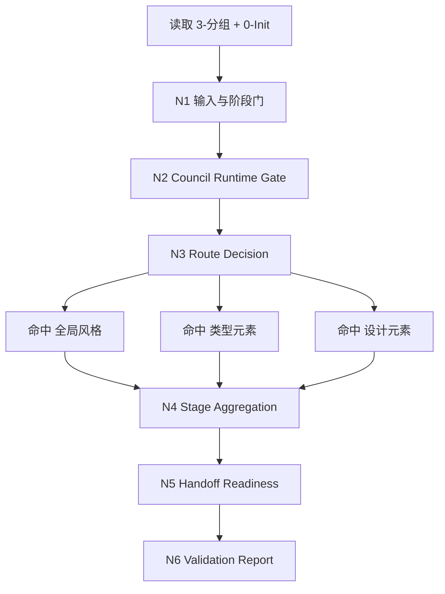
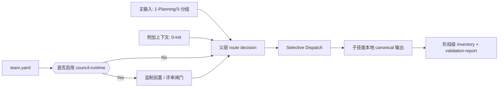
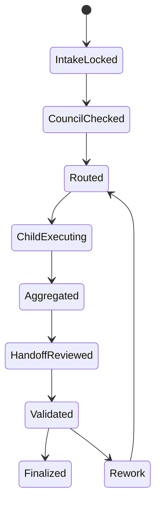

# aigc 2-Global

## 概述

`2-Global` 是 `aigc` 技能树位于 `1-Planning` 与 `3-Detail / 4-Design / 5-Image / 6-Video` 之间的全局设计阶段父 skill。

它负责把：

- `1-Planning/3-分组` 的 grouped script 与量化 handoff
- `0-Init` 的项目基线、世界约束与题材 corridor
- `全局风格 / 类型元素 / 设计元素` 三条 active 子技能

收束为 `projects/<项目名>/2-Global/` 下的项目级设计真源，并为后续 `3-Detail` 准备同一条导演链路的 handoff。

当前阶段根合同遵循两个原则：

- 机制层：父 skill 负责输入锁定、子技能路由、阶段验收、交接边界与最终 stage-level writeback
- 真源层：active 子技能各写本地 canonical 输出；`组间设计 seed` 属于 `2-Global` 阶段级预留 handoff，不在不存在的子链路上伪造写回

## Parent Positioning

`2-Global` 是 stage-local parent skill。

当前 active 子技能：

1. `全局风格`
2. `类型元素`
3. `设计元素`

当前预留但未激活的阶段槽位：

- `导演意图 / 组级导演链路`

父层拥有：

- 共享输入真源锁定
- selective dispatch
- stage-level validation
- canonical output inventory
- 向 `3-Detail` 的 handoff readiness 判定

父层不拥有：

- 替代子技能直接重写其本地 canonical 文件
- 在当前无稳定子链路时假造 `组间设计` 写回
- 直接下钻 shot-level 事实生成

## Shared Canonical Sources (Mandatory)

- `.agents/skills/aigc/_shared/project-runtime-layout.md`
- `.agents/skills/aigc/_shared/council-runtime/module-spec.md`
- `.agents/skills/aigc/1-Planning/_shared/IO_CONTRACT.md`
- `.agents/skills/aigc/1-Planning/3-分组/SKILL.md`
- `.agents/skills/aigc/0-Init/SKILL.md`
- `全局风格/SKILL.md`
- `类型元素/SKILL.md`
- `设计元素/SKILL.md`

真源分工：

- 本 `SKILL.md`：父层路由、阶段门禁、共享输入输出、handoff 与验收合同
- 子技能 `SKILL.md`：各自局部业务真源
- `project-runtime-layout.md`：阶段 runtime 目录真源
- `council-runtime/module-spec.md`：顾问团运行时真源

## When To Use

- 已完成 `1-Planning/3-分组`，需要进入全项目级导演前置设计阶段
- 需要在 `全局风格 / 类型元素 / 设计元素` 之间做选择性调度，而不是盲目全量运行
- 需要校验 `2-Global` 子技能输出是否足够支撑 `3-Detail` 或下游 `4-Design / 5-Image / 6-Video`
- 需要在阶段层统一处理共享输入、共享边界、阶段验收和 stage-level validation report

## When Not To Use

- `projects/<项目名>/1-Planning/3-分组/第N集.md` 还不存在
- 当前只是局部修一份子技能输出，不涉及阶段路由、聚合或 handoff
- 当前已经进入 `3-Detail` 的 shot-level 补齐，而不是全局设计阶段

## Business Requirement Analysis Contract (Mandatory)

| analysis_slot | 当前结论 |
| --- | --- |
| `business_goal` | 以 `1-Planning/3-分组` 为主输入、`0-Init` 为附加上下文，统一调度 `2-Global` active 子技能，形成项目级全局设计真源并完成阶段交接准备。 |
| `business_object` | `projects/<项目名>/2-Global/全局风格/全局风格设计.md`、`类型元素/全集设计.md`、`类型元素/分组设计.md`、`设计元素/设计元素.md`、`projects/<项目名>/2-Global/validation-report.md`。 |
| `constraint_profile` | grouped script 是第一主输入；`0-Init` 只补长期约束；active 子技能只写局部 canonical；未调度子技能不得补空占位；`组间设计 seed` 目前是阶段预留 handoff，不得伪造。 |
| `success_criteria` | 已明确本轮命中子技能、共享输入锁定正确、各 canonical 输出落盘、阶段级验收结论存在，并能说明是否已具备 `3-Detail` handoff readiness。 |
| `non_goals` | 不直接替代子技能写业务正文；不在当前无稳定子链路时假写 `projects/<项目名>/3-Detail/第N集.json`；不把阶段父 skill 写成第二份子技能细则。 |
| `complexity_source` | 三个 active 子技能共享同一主输入但输出类型不同；阶段级验收要同时处理已执行与未执行子技能；`3-Detail` handoff 既要对齐根合同，又要避免伪造不存在的组级导演链。 |
| `topology_fit` | 固定为“输入锁定 -> 顾问团 gate -> selective dispatch -> 子技能执行/复用 -> 阶段验收 -> handoff readiness -> stage validation”。 |
| `step_strategy` | 父 `SKILL.md` 保留主骨架、Mermaid、字段表与阶段门；子技能细则留在各自目录，不在父层重复展开。 |

## Context Preload (Mandatory)

加载顺序固定为：

1. 根 `AGENTS.md`
2. `.agents/skills/aigc/SKILL.md + CONTEXT.md`
3. 本 `SKILL.md + CONTEXT.md`
4. `.agents/skills/aigc/_shared/project-runtime-layout.md`
5. `.agents/skills/aigc/_shared/council-runtime/module-spec.md`
6. `.agents/skills/aigc/1-Planning/_shared/IO_CONTRACT.md`
7. `.agents/skills/aigc/1-Planning/3-分组/SKILL.md`
8. `.agents/skills/aigc/0-Init/SKILL.md`
9. `全局风格/SKILL.md`
10. `类型元素/SKILL.md`
11. `设计元素/SKILL.md`
12. `projects/<项目名>/1-Planning/3-分组/第N集.md`
13. `projects/<项目名>/1-Planning/3-分组/执行报告.md`
14. `projects/<项目名>/1-Planning/episode-split-plan.json`
15. `projects/<项目名>/0-Init/north_star.yaml`
16. `projects/<项目名>/0-Init/init_handoff.yaml`
17. `projects/<项目名>/team.yaml`（若存在）
18. 已有 `projects/<项目名>/2-Global/` 子技能输出

## Total Input Contract (Mandatory)

### 必需输入

- `projects/<项目名>/1-Planning/3-分组/第N集.md`
- `projects/<项目名>/1-Planning/3-分组/执行报告.md`
- `projects/<项目名>/1-Planning/episode-split-plan.json`
- `projects/<项目名>/0-Init/north_star.yaml`

### 可选输入

- `projects/<项目名>/0-Init/init_handoff.yaml`
- `projects/<项目名>/0-Init/story-source-manifest.yaml`
- `projects/<项目名>/team.yaml`
- 已有 `projects/<项目名>/2-Global/` 子技能真源
- 用户显式指定的命中子技能、剧集范围、返工范围

### 硬规则

1. `1-Planning/3-分组` 是父阶段的第一主输入，没有 grouped script 不得进入 `2-Global`。
2. `0-Init` 只作附加上下文，不得压过 grouped script 的分组事实。
3. 若 `team.yaml.enabled == true`，进入阶段根或其直达子技能前必须先按共享 `council-runtime` 判定是否启用 `监制 / 评审`。
4. 未命中的子技能不得在阶段输出中补空字段、补 placeholder、补默认内容。
5. 若用户只要求某一子技能，父层只路由该子技能并更新阶段级 inventory / validation，不默认全量运行其余子技能。

## Composite Output Governance (Mandatory)

`2-Global` 采用“子技能局部真源 + 父 skill 阶段聚合”的复合输出机制。

父 skill 默认职责：

- route decision
- selective dispatch
- stage validation
- handoff readiness summary
- `projects/<项目名>/2-Global/validation-report.md` 写回

当前 active 子技能 canonical 输出：

- `projects/<项目名>/2-Global/全局风格/全局风格设计.md`
- `projects/<项目名>/2-Global/类型元素/全集设计.md`
- `projects/<项目名>/2-Global/类型元素/分组设计.md`
- `projects/<项目名>/2-Global/设计元素/设计元素.md`

当前阶段级预留 handoff：

- `projects/<项目名>/3-Detail/第N集.json` 的 `组间设计 seed`

预留 handoff 规则：

1. `组间设计 seed` 属于 `2-Global` 阶段级 owned truth，但当前必须由未来稳定的“组级导演链路/导演意图链”或明确的父层聚合实现来完成。
2. 当前目录未存在该稳定链路时，父 skill 只允许输出 `handoff readiness` 结论，不得伪造 shared root 写回。
3. 一旦未来该链路激活，必须优先把 seed 规则写回本父 `SKILL.md`，而不是只写到子技能局部文档。

## Visual Maps

## Thinking-Action Node Network

| node_id | 对应 Step | 聚焦字段 | objective | actions | evidence | route_out | gate |
| --- | --- | --- | --- | --- | --- | --- | --- |
| `N1-INTAKE-LOCK` | `S1` | `FIELD-GLOBAL-01` `FIELD-GLOBAL-02` | 锁定 `2-Global` 阶段必需输入与项目范围 | 读取 `3-分组`、`0-Init`、既有 `2-Global` 输出，确认当前任务是否属于阶段级全局设计 | 输入清单、scope note、缺口说明 | pass -> `N2`；fail -> 结束并返回缺口 | grouped script 存在后方可继续 |
| `N2-COUNCIL-GATE` | `S2` | `FIELD-GLOBAL-03` | 判定是否启用共享顾问团运行时 | 读取 `team.yaml`，按 `council-runtime` 决定是否先纳入 `监制 / 评审` 建议 | council decision note | pass -> `N3`；降级 -> `N3` | 主代理保留 canonical 写回权 |
| `N3-ROUTE-DISPATCH` | `S3` | `FIELD-GLOBAL-04` | 做 selective dispatch | 根据用户请求、现有缺口、已有输出和阶段目标决定命中哪些 active 子技能 | route plan、selected_children | pass -> `N4`；误路由 -> 回 `S3` | 未命中子技能不得参与聚合 |
| `N4-STAGE-AGGREGATE` | `S4` | `FIELD-GLOBAL-05` `FIELD-GLOBAL-06` | 汇总本轮命中子技能结果 | 收集子技能 canonical 输出、更新 stage inventory、生成阶段级总结与风险说明 | child output inventory、aggregation note | pass -> `N5`；输出缺口 -> 回命中子技能 | 只聚合已命中输出 |
| `N5-HANDOFF-READINESS` | `S5` | `FIELD-GLOBAL-07` | 判定是否具备向 `3-Detail` 的交接条件 | 检查全局风格/类型/设计是否已足够支撑后续阶段，并判断 `组间设计 seed` 是 ready 还是 reserved | handoff readiness note、blocking note | pass -> `N6`；blocked -> `N6` | 可 blocked 但必须显式说明 |
| `N6-STAGE-VALIDATION` | `S6` | `FIELD-GLOBAL-08` | 写阶段级 `validation-report.md` 并完成闭环 | 写入阶段结论、风险、下步唯一入口与是否需要补导演链路 | validation report、next entry | done | 未写 validation report 不得完成 |

## Convergence Contract (Mandatory)

只有同时满足以下条件，`2-Global` 才允许宣布阶段完成：

1. 主输入已锁定到 `1-Planning/3-分组`
2. 本轮命中的 active 子技能 canonical 输出已落盘
3. 阶段级 inventory 能说明哪些输出已完成、哪些未执行、哪些仍预留
4. 已明确 `3-Detail` handoff readiness 是 `ready / partial / blocked`
5. `projects/<项目名>/2-Global/validation-report.md` 已写回
6. 未把不存在的 `导演意图 / 组间设计 seed` 链路伪造成已完成

## Canonical Output Contract

### Stage-Level Outputs

- `projects/<项目名>/2-Global/validation-report.md`
- 子技能 canonical 输出清单：
  - `projects/<项目名>/2-Global/全局风格/全局风格设计.md`
  - `projects/<项目名>/2-Global/类型元素/全集设计.md`
  - `projects/<项目名>/2-Global/类型元素/分组设计.md`
  - `projects/<项目名>/2-Global/设计元素/设计元素.md`

### Stage Validation Must Cover

1. 本轮命中子技能
2. 已落盘 canonical 输出
3. 未执行子技能说明
4. `3-Detail` handoff readiness
5. 预留 `组间设计 seed` 链路状态
6. 下一步唯一推荐入口

## Root-Cause Execution Contract (Mandatory)

当出现以下症状时，必须先修父级阶段合同，而不是只改单个子技能文稿：

- `2-Global` 子技能各自写作，但没有阶段级输入与路由统一
- 根 `aigc/SKILL.md` 说 `2-Global` 已 active，但本地没有父级 stage 合同
- 阶段级 validation 缺失，无法判断是否可交给 `3-Detail`
- 用户只要一个子技能，结果父层默认全量调度
- `组间设计 seed` 尚未有稳定链路，却被误写成已完成

固定追溯链：

`Symptom -> Direct Technical Cause -> Rule Source -> Meta Rule Source -> Fix Landing Points`

优先检查：

- `Rule Source`
  - 本 `SKILL.md`
  - `.agents/skills/aigc/_shared/project-runtime-layout.md`
  - `.agents/skills/aigc/_shared/council-runtime/module-spec.md`
  - 命中子技能的 `SKILL.md`
- `Meta Rule Source`
  - 根 `AGENTS.md`
  - `.agents/skills/aigc/SKILL.md`

## Field Master

| field_id | intent | canonical_landing | source_priority | owner_node |
| --- | --- | --- | --- | --- |
| `FIELD-GLOBAL-01` | 阶段输入锁定 | `validation-report.md > 输入概况` | `3-分组 > 0-Init > 既有 2-Global 输出` | `N1` |
| `FIELD-GLOBAL-02` | 阶段范围与任务归属 | `validation-report.md > 本轮范围` | `用户请求 > stage route` | `N1` |
| `FIELD-GLOBAL-03` | council runtime 决议 | `validation-report.md > 顾问团决议` | `team.yaml > council-runtime` | `N2` |
| `FIELD-GLOBAL-04` | selective dispatch 计划 | `validation-report.md > 本轮命中子技能` | `用户请求 + 输出缺口` | `N3` |
| `FIELD-GLOBAL-05` | 子技能输出 inventory | `validation-report.md > 已落盘 canonical 输出` | `命中子技能输出` | `N4` |
| `FIELD-GLOBAL-06` | 阶段聚合结论 | `validation-report.md > 阶段聚合结论` | `FIELD-GLOBAL-04 + FIELD-GLOBAL-05` | `N4` |
| `FIELD-GLOBAL-07` | handoff readiness | `validation-report.md > 交接准备度` | `全量命中输出 + reserved slot status` | `N5` |
| `FIELD-GLOBAL-08` | 阶段验收与下一入口 | `validation-report.md > 验收结论 / 下一步` | `全量字段` | `N6` |

## Thought Pass Map

| step_id | field_id | intent | failure_signal | rework_entry |
| --- | --- | --- | --- | --- |
| `S1-intake-lock` | `FIELD-GLOBAL-01` `FIELD-GLOBAL-02` | 锁定 `2-Global` 阶段上下文与当前范围 | 没锁到 `3-分组`，或把局部任务误判成全阶段重跑 | 回 `N1-INTAKE-LOCK` |
| `S2-council-gate` | `FIELD-GLOBAL-03` | 判断是否启用 `监制 / 评审` | `team.yaml` 存在却完全跳过顾问团 gate | 回 `N2-COUNCIL-GATE` |
| `S3-route-dispatch` | `FIELD-GLOBAL-04` | 做选择性调度 | 用户只要一条子链却被全量调度，或本该命中的子技能漏掉 | 回 `N3-ROUTE-DISPATCH` |
| `S4-stage-aggregate` | `FIELD-GLOBAL-05` `FIELD-GLOBAL-06` | 汇总命中子技能输出 | 未命中输出被当成已完成，或 inventory 漏写 | 回 `N4-STAGE-AGGREGATE` |
| `S5-handoff-readiness` | `FIELD-GLOBAL-07` | 判断对 `3-Detail` 的交接状态 | 把预留 `组间设计 seed` 链路写成已完成 | 回 `N5-HANDOFF-READINESS` |
| `S6-stage-validation` | `FIELD-GLOBAL-08` | 写阶段级 validation report | 没有下一入口、没有验收结论、没有 blockers | 回 `N6-STAGE-VALIDATION` |

## Pass Table

| field_id | quality_dimension | fail_code | fail_condition | rework_entry |
| --- | --- | --- | --- | --- |
| `FIELD-GLOBAL-01` | 主输入正确性 | `FAIL-GLOBAL-PRIMARY-INPUT-MISSING` | 未锁到 `1-Planning/3-分组` | `S1-intake-lock` |
| `FIELD-GLOBAL-02` | 范围判定准确性 | `FAIL-GLOBAL-SCOPE-DRIFT` | 局部任务被误判成阶段全量重跑 | `S1-intake-lock` |
| `FIELD-GLOBAL-03` | 顾问团 gate 完整性 | `FAIL-GLOBAL-COUNCIL-BYPASSED` | `team.yaml.enabled == true` 却绕过 `council-runtime` | `S2-council-gate` |
| `FIELD-GLOBAL-04` | 路由正确性 | `FAIL-GLOBAL-DISPATCH-WRONG` | 命中子技能错误或未执行 selective dispatch | `S3-route-dispatch` |
| `FIELD-GLOBAL-05` | 输出 inventory 完整性 | `FAIL-GLOBAL-INVENTORY-MISMATCH` | 已执行输出未登记，或未执行输出被误登记 | `S4-stage-aggregate` |
| `FIELD-GLOBAL-06` | 阶段聚合准确性 | `FAIL-GLOBAL-AGGREGATION-DRIFT` | 父层结论与子技能真实输出不一致 | `S4-stage-aggregate` |
| `FIELD-GLOBAL-07` | handoff 边界真实性 | `FAIL-GLOBAL-HANDOFF-FABRICATED` | 伪造 `组间设计 seed` 或误报 ready 状态 | `S5-handoff-readiness` |
| `FIELD-GLOBAL-08` | 阶段闭环完整性 | `FAIL-GLOBAL-VALIDATION-MISSING` | 未写 `validation-report.md` 或未给唯一下一入口 | `S6-stage-validation` |
