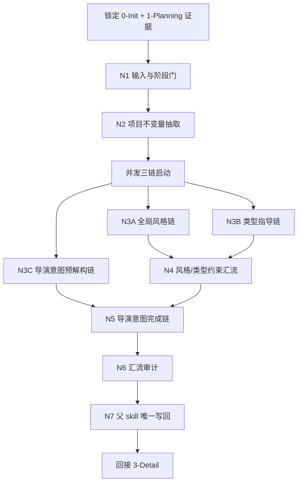
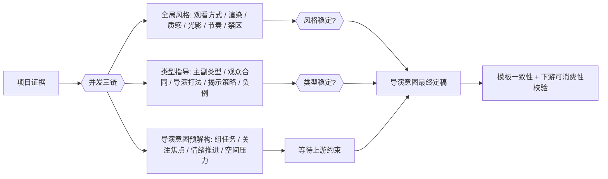
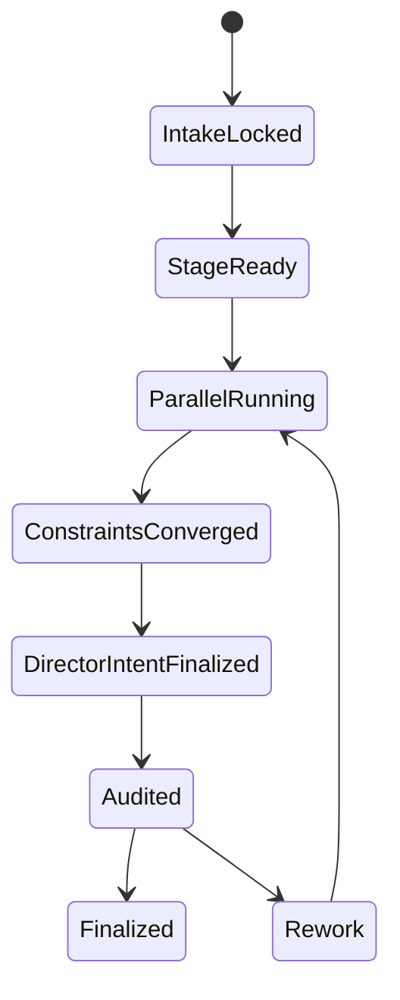
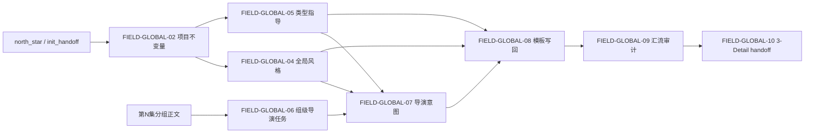

# aigc 2-Global

## 概述

`2-Global` 是 `aigc` 技能树位于 `1-Planning` 与 `3-Detail` 之间的导演前置全局合同阶段。

它不负责直接写 `3-Detail/第N集.json`，也不再把导演能力外包给外置导演组 contracts。从本轮开始，`全局风格`、`类型指导`、`导演意图` 三个能力面全部内收在同一 `SKILL.md` 内，以“串行锁定前提 + 并发展开三链 + 汇流审计写回”的知行合一网络完成执行。

本轮重编排遵循两个原则：

- 内容层面全量继承现有 `2-Global` 已沉淀的三份真源、模板口径、项目级/组级分层与下游 handoff 边界
- 机制层面改写为单技能真源，不再维护平行的导演组 team、角色 agent 合同或外置创作方法真源

## Skill Execution Rule (Mandatory)

`2-Global` 采用单技能内部融合模式：

- skill 自身负责输入读取、业务分析、并发链裁决、模板约束、三份 Markdown 写回、汇流审计与下游回接
- `全局风格`、`类型指导`、`导演意图` 不是外置 subagents，而是父 skill 的三条内部能力链
- 中间只允许形成内部 `plan / note / report / patch set`，最终 canonical 写回只能由当前 `SKILL.md` 完成
- 不得再回指任何外置导演组 contracts 作为执行真源

## When to Use

- 已经有 `projects/<项目名>/1-Planning/3-分组/第N集.md`，需要进入导演前置全局合同阶段。
- 需要把初始化预设、规划分组结果与当前项目定位沉淀为三份可被 `3-Detail` 直接消费的 Markdown 真源。
- 需要同时处理项目级稳定项与当前集分镜组级导演构思，但又不希望把它们混成一份空泛总稿。
- 需要按知行合一方式，把复杂导演判断写成“思行节点 + 并发链 + 汇流门”。

## When Not to Use

- 当前连 `projects/<项目名>/1-Planning/3-分组/第N集.md` 都不存在。
- 当前任务其实还是分集、剧本或分组问题，应回到 `1-Planning`。
- 当前任务已经在补镜级字段、主体、设计、画面或视频产物，应进入 `3-Detail / 4-Design / 5-Image / 6-Video`。

## Business Requirement Analysis Contract (Mandatory)

| analysis_slot | 当前结论 |
| --- | --- |
| `business_goal` | 把规划分组结果与初始化预设收束为 `全局风格.md`、`类型指导.md`、`导演意图.md` 三份导演前置真源，并确保它们能被 `3-Detail` 稳定消费 |
| `business_object` | `0-Init` 的项目基线、`1-Planning` 的当前集分组正文、已有 `2-Global` 文档与三个模板 |
| `constraint_profile` | 项目级总则不得被单集污染；导演意图必须按 `第N集 -> 【x-x-x】` 增量写回；不得创建 `3-Detail/第N集.json`；不再依赖外置导演组 contracts |
| `success_criteria` | 三份 Markdown 真源结构完整、项目级与组级边界清楚、每条内部链都有细致步骤、并发关系与汇流门明确，并且都能回答“如何指导 `3-Detail` 落地”“参照哪部作品的哪个桥段”“具像化表述是什么” |
| `non_goals` | 不生成 shot-level 明细；不把本阶段写成大而空的“导演宣言”；不再维护第二套导演组 agent 真源 |
| `complexity_source` | 项目级稳定项与当前集组级增量并存；三条能力链共享证据却关注点不同；并发与依赖关系容易打架；质量要求高于普通摘要 |
| `topology_fit` | 前段串行锁输入与不变量，中段三链并发展开，`导演意图` 允许并发预解构但必须等待风格/类型约束稳定后再完成写回，后段统一审计与写回 |
| `step_strategy` | 采用“串行主干 + 并发三链 + 汇流审计”的思行网络，并为三链分别提供细致步骤表与质量门 |

## Context Preload (Mandatory)

加载顺序固定为：

1. 根 `AGENTS.md`
2. `.agents/skills/aigc/SKILL.md + CONTEXT.md`
3. 本 `SKILL.md + CONTEXT.md`
4. `.agents/skills/aigc/_shared/project-runtime-layout.md`
5. `.agents/skills/aigc/2-Global/_shared/IO_CONTRACT.md`
6. `projects/<项目名>/0-Init/north_star.yaml`
7. `projects/<项目名>/0-Init/init_handoff.yaml`
8. `projects/<项目名>/0-Init/story-source-manifest.yaml`（若存在）
9. `projects/<项目名>/1-Planning/2-剧本/第N集.md`（若存在）
10. `projects/<项目名>/1-Planning/3-分组/第N集.md`
11. `projects/<项目名>/1-Planning/3-分组/执行报告.md`（若存在）
12. 现有 `projects/<项目名>/2-Global/*.md`
13. 三个模板：
   - `templates/全局风格.template.md`
   - `templates/类型指导.template.md`
   - `templates/导演意图.template.md`

## Shared Canonical Sources (Mandatory)

- 强制读取：`.agents/skills/aigc/2-Global/_shared/IO_CONTRACT.md`
- 强制读取：`.agents/skills/aigc/_shared/project-runtime-layout.md`
- 强制读取：
  - `.agents/skills/aigc/2-Global/templates/全局风格.template.md`
  - `.agents/skills/aigc/2-Global/templates/类型指导.template.md`
  - `.agents/skills/aigc/2-Global/templates/导演意图.template.md`

硬规则：

1. 本阶段的第一输入根固定为 `projects/<项目名>/1-Planning/3-分组/第N集.md`。
2. 项目级稳定约束优先来自 `0-Init/north_star.yaml`、`0-Init/init_handoff.yaml` 与 `story-source-manifest.yaml`。
3. `全局风格.md` 与 `类型指导.md` 只允许维护项目级稳定总则，不得被某一集局部气氛污染。
4. `导演意图.md` 必须按 `## 第N集 -> ### 【x-x-x】` 的层次做增量写回。
5. `3-分组` 的组标题是三段式 `分镜组ID`；四段式 `分镜ID` 属于下游 `3-Detail`。
6. 本阶段不得创建或改写 `projects/<项目名>/3-Detail/第N集.json`。
7. 三条能力链的判断逻辑、细化步骤与质量门都必须内收在本 `SKILL.md`，不得外包给任何外置导演组 contracts。

## Total Input Contract (Mandatory)

### 必需输入

- `projects/<项目名>/1-Planning/3-分组/第N集.md`
- `projects/<项目名>/0-Init/north_star.yaml`
- `projects/<项目名>/0-Init/init_handoff.yaml`

### 可选输入

- `projects/<项目名>/0-Init/story-source-manifest.yaml`
- `projects/<项目名>/1-Planning/2-剧本/第N集.md`
- `projects/<项目名>/1-Planning/3-分组/执行报告.md`
- 现有 `projects/<项目名>/2-Global/*.md`
- 用户显式指定的风格、类型或导演偏好

### 禁止输入

- 与当前项目无关的外部参考文本
- 要求本阶段直接写 shot-level 字段或镜头 JSON 的额外指令
- 任何外置导演组 team、agent、creative method 文档

### 输入处理原则

1. 先锁项目级不变量，再进入三条能力链。
2. 用户显式指定范围或偏好时，用户指定优先，但不得越过项目已锁定真源。
3. 现有 `2-Global/*.md` 只作为增量 patch 依据，不作为绕开上游证据的捷径。
4. 若分组正文不稳定或关键组界不明，`导演意图` 只能生成保守版 patch 或 `report`，不得幻想补洞。

## Visual Maps

## Internal Capability Fusion Contract (Mandatory)

`2-Global` 不再把导演能力拆给外置角色文档。以下能力面全部内收为父 skill 的内部能力链：

| 能力面 | 作用 | 典型输出 | 何时触发 |
| --- | --- | --- | --- |
| `global_style_engine` | 从项目级证据中提炼稳定观看方式、审美底座、禁区与下游继承约束 | `global_style_plan`、`global_style_patch`、`style_note`、`style_report` | 每次进入 `2-Global` 时评估；缺风格底座或风格约束变化时强触发 |
| `type_guidance_engine` | 把题材、主副类型、混合公式与导演打法收束为项目级类型协议 | `type_guidance_plan`、`type_guidance_patch`、`type_note`、`type_report` | 每次进入 `2-Global` 时评估；缺类型协议或类型裁决变化时强触发 |
| `director_intent_engine` | 把当前集分组结果翻译成按组可消费的导演构思 | `director_intent_plan`、`director_intent_patch`、`director_note`、`director_report` | 当前集分组已稳定时默认触发 |
| `convergence_audit_engine` | 校验三链是否边界正确、模板一致、下游可消费且无越权 | `convergence_report`、`writeback_patch_set`、`blocking_note` | 三链产出草案后、写回前必须触发 |

硬规则：

1. 这些能力面是当前 `SKILL.md` 的内部节点，不是外置真源。
2. 任何能力面都不得绕过父 skill 直接写 canonical Markdown。
3. 若未来继续细化 `2-Global`，必须直接扩写本 `SKILL.md` 的思行网络与模板合同，不得重新长出外置导演组平行真源。

## Topology Contract (Mandatory)

### Topology Fit

本技能采用 `串行前提锁定 + 并发三链 + 依赖汇流` 的混合思行网络：

1. 串行主干：
   - 锁输入
   - 判阶段 readiness
   - 抽项目不变量
2. 并发三链：
   - `全局风格`
   - `类型指导`
   - `导演意图预解构`
3. 依赖汇流：
   - `导演意图` 的最终定稿必须等待 `全局风格 + 类型指导` 的稳定约束
4. 最终收束：
   - 模板校验
   - 边界审计
   - 写回三份 Markdown
   - 回接 `3-Detail`

### Ordered / Unordered Rules

- `N1 -> N2` 固定串行。
- `N3A + N3B + N3C` 默认并发。
- `N3C` 允许提前做组级预解构，但 `N5` 的最终写回必须等待 `N3A/N3B` 通过约束汇流。
- `N6 -> N7` 固定串行。
- 若用户显式只要求其中一份产物，只命中对应能力链，不补空路径。

## Thinking-Action Node Contract (Mandatory)

每个思行节点至少要定义以下字段：

| slot | 要求 |
| --- | --- |
| `node_id` | 稳定节点标识 |
| `objective` | 该节点要解决的判断/动作目标 |
| `inputs` | 进入该节点的输入与依赖 |
| `actions` | 该节点真正执行的动作 |
| `evidence` | 该节点留下的证据、产物或验证结果 |
| `route_out` | 成功、失败、分支时分别流向何处 |
| `gate` | 是否允许进入最终汇流 |

## Thinking-Action Node Network

| node_id | 对应 Step | 聚焦字段 | objective | actions | evidence | route_out | gate |
| --- | --- | --- | --- | --- | --- | --- | --- |
| `N1-INPUT-GATE` | S1 | `FIELD-GLOBAL-01` `FIELD-GLOBAL-02` | 锁定当前确属 `2-Global` 且输入齐备 | 读取 `north_star / init_handoff / 第N集分组正文`，确认阶段边界与文件存在性 | `input_lock_note`、缺口列表 | pass -> `N2`；fail -> 结束并返回 `report` | 输入与阶段边界达标后才可继续 |
| `N2-INVARIANT-LOCK` | S2 | `FIELD-GLOBAL-02` `FIELD-GLOBAL-03` | 抽出项目级不变量与当前集组级范围 | 提取题材边界、观众合同、风格基线、组级范围、禁止越权项 | `invariant_brief`、`branch_scope_plan` | pass -> `N3A/N3B/N3C`；冲突 -> 回 `S1/S2` | 不变量明确后才可并发 |
| `N3A-GLOBAL-STYLE` | S3-S4 | `FIELD-GLOBAL-04` | 形成项目级全局风格底座，并确认它对 `3-Detail` 具有可实现指导意义 | 运行全局风格细化步骤，生成候选比较、禁区、继承约束、参考作品桥段、具像化表述与 `3-Detail` 落地导向 | `global_style_plan`、`global_style_patch`、`style_note`、`style_reference_note` | pass -> `N4`；fail -> 回 `S3/S4` | 项目级风格不得 episode 化，且不能只停留在抽象形容词 |
| `N3B-TYPE-GUIDANCE` | S5-S6 | `FIELD-GLOBAL-05` | 形成项目级类型指导协议，并确认它能转译成后续 detail 的导演动作 | 运行类型指导细化步骤，生成主副类型、混合公式、打法、禁区、参考作品桥段、具像化表述与 `3-Detail` 落地导向 | `type_guidance_plan`、`type_guidance_patch`、`type_note`、`type_reference_note` | pass -> `N4`；fail -> 回 `S5/S6` | 类型协议须可约束下游，且必须给出可操作的导演翻译 |
| `N3C-DIRECTOR-PREP` | S7 | `FIELD-GLOBAL-06` | 提前解构当前集各组的导演任务，并预判哪些判断值得在 detail 被放大 | 逐个读取 `【x-x-x】`，提取剧情任务、关注焦点、情绪推进、空间压力、候选参考桥段与下游放大抓手 | `director_intent_plan`、`director_note`、`director_reference_candidates` | pass -> `N5`；fail -> 回 `S7` | 仅允许预解构，不得提前定稿 |
| `N4-CONSTRAINT-CONVERGENCE` | S8 | `FIELD-GLOBAL-04` `FIELD-GLOBAL-05` | 汇流风格与类型约束，生成导演意图可用上游限制与 detail 落地桥 | 对齐风格稳定项、类型打法、禁区、具像化锚点、参考桥段与下游继承要求 | `constraint_bridge_note`、`detail_execution_bridge` | pass -> `N5`；fail -> 回 `N3A/N3B` | 风格与类型必须先稳定，且必须能翻译成下游执行语言 |
| `N5-DIRECTOR-FINALIZE` | S9 | `FIELD-GLOBAL-07` | 在约束已稳定的前提下完成导演意图 patch，并把参考锚点翻译成当前组的可执行指令 | 将组级预解构翻译成 `导演意图.md` 的 `第N集/【x-x-x】` patch，补齐参考桥段、具像化表述与 detail 放大方向 | `director_intent_patch`、`director_report`、`director_implementation_note` | pass -> `N6`；fail -> 回 `N3C/N4` | 每组必须可被 `3-Detail` 直接消费，不能只有口号 |
| `N6-CONVERGENCE-AUDIT` | S10 | `FIELD-GLOBAL-08` `FIELD-GLOBAL-09` | 检查模板一致性、边界正确性、参考锚点清晰度与下游 handoff | 运行模板对齐、项目级/组级边界检查、越权检查、空话审计、reference/bridge 审计与可实现性审计 | `convergence_report`、`writeback_patch_set` | pass -> `N7`；fail -> 回目标节点返工 | 通过后才能写回 |
| `N7-WRITEBACK-HANDOFF` | S11 | `FIELD-GLOBAL-10` | 统一写回三份 Markdown 并回接 `3-Detail` | 按增量策略写回三份真源，输出下一入口与闭环 triad | 三份 canonical 文档、`handoff_note` | Final | 仅父 skill 拥有最终写回权 |

## Capability Chain Detail (Mandatory)

### 全局风格链

| branch_step | 要从哪些方面着手 | 具体动作 | 输出要求 |
| --- | --- | --- | --- |
| `GS1` | 项目目标与观看距离 | 从 `north_star / init_handoff` 提取观众应该如何进入故事，判断观看距离与镜头亲疏关系 | 不允许只写“高级感”“电影感” |
| `GS2` | 媒介感与渲染底座 | 判断更偏写实、风格化、插画感还是纪实感，明确渲染与介质方向 | 必须说明为什么它属于项目级稳定项 |
| `GS3` | 参考作品桥段与风格锚点 | 为当前风格判断寻找可类比的作品与具体桥段，只提炼其镜头组织、质感或气压处理方式 | 必须写清“参照哪一段、借的是哪种处理逻辑”，不能只报作品名 |
| `GS4` | 质感、光影、色温、对比 | 固定材质触感、光影组织、色温走向、对比强弱与画面压力 | 要能被 `3-Detail/4-Design/5-Image/6-Video` 继承 |
| `GS5` | 具像化表述 | 把“冷峻、诗性、压迫、悬浮”等抽象词翻译成可见的画面语言、镜头关系与动作特征 | 不能停留在抽象形容词层 |
| `GS6` | 对 `3-Detail` 的落地指导 | 检查该风格是否能翻译成镜头距离、镜头运动、场面调度、主体呈现和节奏处理的具体指令 | 必须对后续 detail 具有可实现指导意义 |
| `GS7` | 稳定禁区与允许自由度 | 写清必须禁止的表达、谨慎使用的表达与可留给下游变化的自由度 | 必须同时给正向锚点和负向禁区 |
| `GS8` | 候选比较与增量 patch | 比较多个风格路径，只保留主路径，并生成项目级 patch 与取舍说明 | 不得并列塞进互相冲突的风格方向 |

### 类型指导链

| branch_step | 要从哪些方面着手 | 具体动作 | 输出要求 |
| --- | --- | --- | --- |
| `TG1` | 题材事实与观众合同 | 从故事目标、分组冲突与 init 预设中提炼观众到底该期待什么 | 不得只堆题材标签 |
| `TG2` | 主类型、副类型、混合公式 | 判断主副关系和权重，而不是把多个类型平铺并列 | 必须写清主次与混合逻辑 |
| `TG3` | 冲突引擎与揭示策略 | 提炼本项目如何制造 tension、何时揭示、如何递送信息 | 必须能指导下游镜头节奏 |
| `TG4` | 参考作品桥段与类型样本 | 为主副类型组合寻找最贴切的作品或桥段样本，提炼其类型运作方式而非搬运剧情 | 必须说明参照桥段对当前项目的可借鉴点 |
| `TG5` | 具像化导演打法 | 把类型判断翻译成镜头组织、表演强弱、节奏推进、情绪传递和信息显隐方式 | 不能停留在类型名词层 |
| `TG6` | 对 `3-Detail` 的落地指导 | 把类型协议压成 detail 可执行的镜头、表演、转场与揭示指令 | 必须对后续 detail 具有可实现指导意义 |
| `TG7` | 错误类型负例与禁区 | 指出 wrong-genre 信号、禁用 register 与保底退化策略 | 下游必须能据此判断“不能怎么做” |
| `TG8` | 候选比较与增量 patch | 只保留主路径，生成项目级 patch 与取舍说明 | 不得把互斥打法同时写进真源 |

### 导演意图链

| branch_step | 要从哪些方面着手 | 具体动作 | 输出要求 |
| --- | --- | --- | --- |
| `DI1` | 组级边界与剧情任务 | 逐个读取 `【x-x-x】`，确认每组真正承担的叙事任务 | 不得只复述剧情梗概 |
| `DI2` | 观众注意焦点 | 判断“画面里最该看见什么”，而不是“能看见什么” | 必须有单一主焦点 |
| `DI3` | 信息推进与情绪转弯 | 说明本组把什么信息推到观众面前，角色状态如何发生变化 | 必须体现动态推进 |
| `DI4` | 参考作品桥段与处理样本 | 为当前组寻找最接近的作品或桥段样本，借其镜头组织、信息揭示或情绪转弯方式 | 必须说清借鉴的是处理逻辑，不是照抄剧情 |
| `DI5` | 表演抓手与空间压力 | 写明表演重心、空间调度、气氛压力怎样服务组任务 | 不得只写“营造氛围” |
| `DI6` | 节奏与镜头处理方向 | 在风格/类型约束下判断本组节奏密度、镜头呼吸和强调方式 | 必须兼容项目级风格与类型协议 |
| `DI7` | 具像化表述与 detail 落地指令 | 把导演意图翻译成 `3-Detail` 可继续展开的镜头、表演、调度、节奏和视觉强调语言 | 必须形成可执行而非抽象的指导语 |
| `DI8` | 下游放大方向与禁用方向 | 告诉 `3-Detail` 最值得放大什么，并标出不应滑向哪里 | 必须形成直接可消费指令 |
| `DI9` | 候选比较与局部 patch | 多个处理路径并存时只保留主路径，局部写回当前集命中组 | 不得重写未命中的集或组 |

## One-Shot Output Contract (Mandatory)

`2-Global` 的一次性输出不是多个平行草案，而是同一 bundle 内的四类结果：

1. `projects/<项目名>/2-Global/全局风格.md`
   - 项目级风格底座唯一真源
2. `projects/<项目名>/2-Global/类型指导.md`
   - 项目级类型化导演协议唯一真源
3. `projects/<项目名>/2-Global/导演意图.md`
   - 按集、按组沉淀的导演构思唯一真源
4. `closure triad + handoff note`
   - 说明 `root cause location / immediate fix / systemic prevention fix`
   - 给出下一入口固定为 `3-Detail`

## Canonical Output Governance (Mandatory)

1. `全局风格.md` 和 `类型指导.md` 只能写项目级稳定总则。
2. `导演意图.md` 只写按集、按组的导演构思，不得冒充项目级风格总则。
3. 三份文档都由当前 skill 聚合写回，不存在平行导演组 writeback owner。
4. 现有文档存在时，只允许增量更新命中章节，不得整稿抹平历史内容。
5. `2-Global` 不创建 `projects/<项目名>/3-Detail/第N集.json`，也不与 `3-Detail` 争夺 episode 根文件。

## Field Master

| field_id | 输出位置/字段 | 内容要求 | 默认责任 Step | 质量维度 | 失败码 |
| --- | --- | --- | --- | --- | --- |
| `FIELD-GLOBAL-01` | 阶段定位 | 明确 `2-Global` 是 `1-Planning` 与 `3-Detail` 之间的导演前置全局合同阶段 | S1 | 边界清晰度 | FAIL-GLOBAL-01 |
| `FIELD-GLOBAL-02` | 输入与不变量 | 锁定项目级硬证据、组级范围和禁止越权项 | S2 | 输入真源一致性 | FAIL-GLOBAL-02 |
| `FIELD-GLOBAL-03` | 并发拓扑 | 明确三链并发、依赖汇流与父 skill 写回边界 | S3 | 编排可执行性 | FAIL-GLOBAL-03 |
| `FIELD-GLOBAL-04` | 全局风格真源 | 项目级风格底座稳定，具备观看方式、审美底座、参考桥段、具像化表述、detail 落地导向、禁区与下游继承 | S4 | 项目级稳定性 | FAIL-GLOBAL-04 |
| `FIELD-GLOBAL-05` | 类型指导真源 | 主副类型、混合公式、参考桥段、具像化导演打法、detail 落地导向与错误类型禁区明确 | S5 | 类型化有效性 | FAIL-GLOBAL-05 |
| `FIELD-GLOBAL-06` | 导演意图预解构 | 当前集组级任务、关注焦点、情绪推进与空间压力被正确解构 | S7 | 组级分析精度 | FAIL-GLOBAL-06 |
| `FIELD-GLOBAL-07` | 导演意图写回 | `导演意图.md` 当前集命中组的 patch 具体、可消费、具备参考桥段与具像化落地指令、不过界 | S9 | 下游可消费性 | FAIL-GLOBAL-07 |
| `FIELD-GLOBAL-08` | 模板写回 | 三份模板写回结构一致、命名统一、章节边界合法 | S10 | 模板一致性 | FAIL-GLOBAL-08 |
| `FIELD-GLOBAL-09` | 汇流审计 | 空话、越权、边界污染与依赖断裂被拦住 | S10 | 收束完整性 | FAIL-GLOBAL-09 |
| `FIELD-GLOBAL-10` | 下一阶段 handoff | 返回 triad closure，并固定回接 `3-Detail` | S11 | 闭环可执行性 | FAIL-GLOBAL-10 |

## Thought Pass Map

| step_id | 聚焦字段 | 核心问题 | 生成动作 | 未达标信号 |
| --- | --- | --- | --- | --- |
| `S1` | `FIELD-GLOBAL-01` | 当前是不是 `2-Global` 阶段问题 | 锁定阶段边界与上下游职责 | 把本阶段写成 `3-Detail` 或 `1-Planning` |
| `S2` | `FIELD-GLOBAL-02` | 当前轮必须先锁哪些不变量 | 写出输入清单、禁止越权项与组级范围 | 输入根或不变量漂移 |
| `S3` | `FIELD-GLOBAL-03` | 三条能力链如何并发且不打架 | 写出并发拓扑、依赖和汇流门 | 只说“并发”，没写依赖条件 |
| `S4` | `FIELD-GLOBAL-04` | 项目级风格底座到底稳定在哪，能否直接指导后续 `3-Detail` | 产出全局风格 patch、参考桥段、具像化表述与取舍说明 | 风格文档被某一集情绪污染，或只剩抽象形容词 |
| `S5` | `FIELD-GLOBAL-05` | 类型协议如何约束后续导演链并落到 detail 执行 | 产出类型指导 patch、参考桥段、具像化打法与禁区 | 只有类型词，没有导演打法或 detail 导向 |
| `S6` | `FIELD-GLOBAL-05` | 类型候选如何取舍 | 压缩主路径，记录未采纳方向 | 多种互斥打法并列留在主稿 |
| `S7` | `FIELD-GLOBAL-06` | 当前集各组真正的导演任务是什么，哪些处理值得被 detail 放大 | 逐组预解构剧情任务、关注焦点、情绪推进、参考桥段候选与下游抓手 | 只复述剧情摘要，没有下游抓手 |
| `S8` | `FIELD-GLOBAL-04` `FIELD-GLOBAL-05` | 风格与类型怎样变成导演意图约束与下游执行语言 | 形成约束桥接说明与 detail 执行桥 | 导演意图不受项目级约束，或没有执行桥 |
| `S9` | `FIELD-GLOBAL-07` | 当前集导演构思是否足够具体，是否具备参考桥段与具像化指令 | 写入 `导演意图.md` 局部 patch | 只剩空泛口号，或只有参照名词没有具像化处理 |
| `S10` | `FIELD-GLOBAL-08` `FIELD-GLOBAL-09` | 三份文档能否一起合法落盘，并被下游直接消费 | 执行模板/边界/越权/空话/reference 可实现性审计 | 结构断裂、边界污染、参照失焦或越权写回 |
| `S11` | `FIELD-GLOBAL-10` | 如何证明本轮完成并交给下游 | 输出 triad closure 与 `3-Detail` 回接说明 | 没有返工入口或下一阶段 |

## Pass Table

| field_id | Pass Standard | Fail Code | Rework Entry |
| --- | --- | --- | --- |
| `FIELD-GLOBAL-01` | 阶段定位、上下游边界与三份真源职责明确 | FAIL-GLOBAL-01 | S1 |
| `FIELD-GLOBAL-02` | 项目级硬证据、组级范围与禁止越权项锁定 | FAIL-GLOBAL-02 | S2 |
| `FIELD-GLOBAL-03` | 三链并发、依赖和写回权边界明确 | FAIL-GLOBAL-03 | S3 |
| `FIELD-GLOBAL-04` | `全局风格.md` 具备观看方式、审美底座、参考桥段、具像化表述、禁区与下游继承 | FAIL-GLOBAL-04 | S4 |
| `FIELD-GLOBAL-05` | `类型指导.md` 具备主副类型、参考桥段、导演打法、负例、保底策略与 detail 导向 | FAIL-GLOBAL-05 | S5-S6 |
| `FIELD-GLOBAL-06` | 组级导演任务预解构具体且与 `【x-x-x】` 对齐 | FAIL-GLOBAL-06 | S7 |
| `FIELD-GLOBAL-07` | `导演意图.md` 当前集命中组的 patch 具体、可消费、具备参考桥段、具像化落地指令且不过界 | FAIL-GLOBAL-07 | S8-S9 |
| `FIELD-GLOBAL-08` | 三份模板写回结构一致、命名统一、章节合法 | FAIL-GLOBAL-08 | S10 |
| `FIELD-GLOBAL-09` | 无空话、无越权、无项目级/组级污染 | FAIL-GLOBAL-09 | S10 |
| `FIELD-GLOBAL-10` | 返回 triad closure，并固定回接 `3-Detail` | FAIL-GLOBAL-10 | S11 |

## Root-Cause Execution Contract (Mandatory)

当 `2-Global` 出现以下问题时，必须先修源层而不是补单次文案：

- `2-Global` 仍回指已退役的导演组外置 contracts
- 三条能力链只有并发口号，没有依赖汇流门
- `全局风格.md` 或 `类型指导.md` 被写成当前集情绪杂糅稿
- `导演意图.md` 没有回链到 `第N集/【x-x-x】`
- `导演意图` 在风格/类型约束未稳定前就提前定稿
- 风格、类型、导演意图只剩抽象词，无法指导 `3-Detail` 的实际展开
- 只写了参考作品名，没有指出具体桥段与可借鉴的处理逻辑
- 阶段越权直接创建 `3-Detail/第N集.json`

必经链路：

`Symptom -> Direct Technical Cause -> Rule Source -> Meta Rule Source -> Fix Landing Points`

优先检查：

- `Rule Source`
  - `.agents/skills/aigc/2-Global/SKILL.md`
  - `.agents/skills/aigc/2-Global/_shared/IO_CONTRACT.md`
  - `.agents/skills/aigc/2-Global/templates/*.template.md`
- `Meta Rule Source`
  - `AGENTS.md`
  - `.agents/skills/aigc/SKILL.md`
  - `/Users/vincentlee/.codex/skills/meta/构建/技能/skill-知行合一/SKILL.md`

面向用户的闭环固定返回：

1. root cause location
2. immediate fix
3. systemic prevention fix

## Completion Criteria

- 已建立 `2-Global` 的单技能知行合一真源。
- 已明确三条内部能力链与并发/汇流关系。
- 已把 `全局风格 / 类型指导 / 导演意图` 的细致步骤写入同一 `SKILL.md`。
- 已要求三条能力链都回答 `3-Detail` 可实现性、参考作品桥段与具像化表述。
- 已明确不再依赖外置导演组 contracts。
- 已锁定三份 Markdown 输出的单一口径与 `3-Detail` 的唯一回接闭环。
