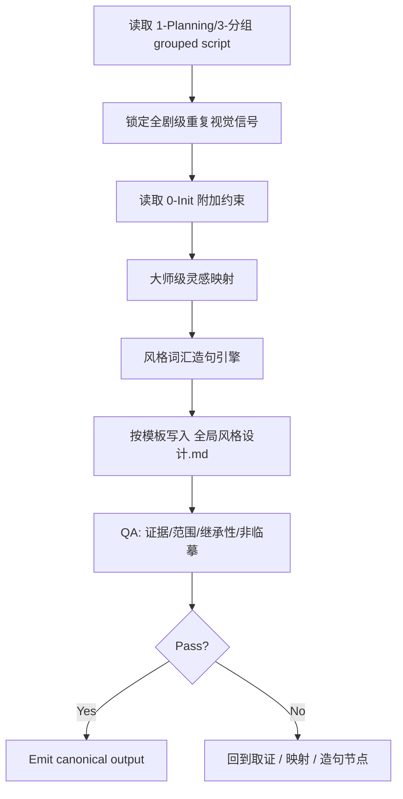
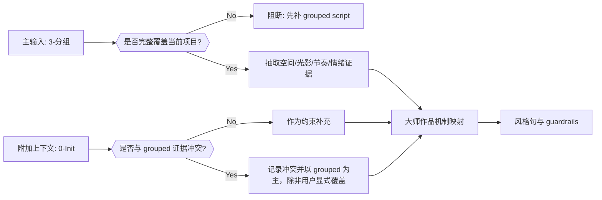
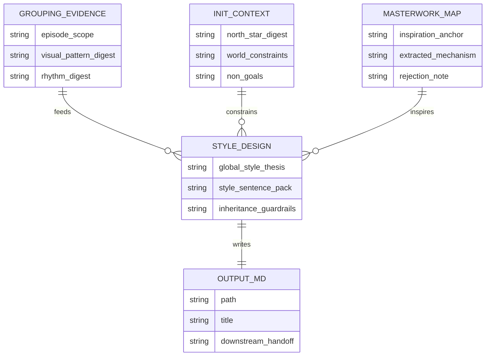

# aigc 2-Global 全局风格

## Child Positioning

`全局风格` 是 `2-Global` 下的受治理子技能，负责把全剧集的 grouped script 证据压成一个可被后续导演、设计、画面阶段继承的系列级画面风格总合同。

当前子技能真源口径：

- 主输入真源是 `1-Planning/3-分组`
- 附加上下文真源是 `0-Init`
- canonical 输出固定为 `projects/<项目名>/2-Global/全局风格/全局风格设计.md`
- 若未来父级 `2-Global` 需要额外投影 `projects/<项目名>/2-Global/全局风格.md`，该文件只能是派生摘要，不得反向充当第二真源

## Mandatory Canonical Sources

- `.agents/skills/aigc/_shared/project-runtime-layout.md`
- `.agents/skills/aigc/1-Planning/_shared/IO_CONTRACT.md`
- `.agents/skills/aigc/1-Planning/3-分组/SKILL.md`
- `.agents/skills/aigc/0-Init/SKILL.md`
- `references/execution-flow.md`
- `references/masterwork-inspiration.md`
- `references/output-template.md`
- `templates/全局风格设计.template.md`

真源分工：

- 本 `SKILL.md`：子技能总合同、节点网络、字段门禁与唯一输出落点
- `references/execution-flow.md`：执行顺序、取证顺序、失败回跳
- `references/masterwork-inspiration.md`：大师级灵感抽象法、词汇造句法与禁区
- `references/output-template.md` + `templates/全局风格设计.template.md`：Markdown 输出骨架

## When To Use

- 需要根据 `1-Planning/3-分组` 的 grouped script 为整部影片建立全局画面风格
- 需要把全剧集的空间、节奏、情绪、世界质感收束成单一的系列级视觉主张
- 需要从大师级作品中提取灵感机制，并转译成可执行的风格词汇与风格句
- 需要为 `类型元素`、`设计元素`、`3-Detail` 或后续设计/画面阶段提供统一的审美底座

## When Not To Use

- 上游还没有稳定的 `projects/<项目名>/1-Planning/3-分组/第N集.md`
- 当前需求是角色/场景/道具的对象级设计，而不是全剧级风格总合同
- 用户只要求单集局部风格补充，不要求系列级母体

## Business Requirement Analysis Contract

| slot | content |
| --- | --- |
| `business_goal` | 以 grouped script 为主证据，为整部影片生成一份系列级全局画面风格设计，并输出可复用的风格词汇与风格句。 |
| `business_object` | `projects/<项目名>/1-Planning/3-分组/第N集.md`、`执行报告.md`、`episode-split-plan.json`、`north_star.yaml`、`init_handoff.yaml`、最终 `全局风格设计.md`。 |
| `constraint_profile` | `3-分组` 是主输入，`0-Init` 只作附加约束；灵感可借大师机制，不得抄单一作品表层；输出必须面向全剧而非单集碎片。 |
| `success_criteria` | 产出中同时具备全剧视觉命题、上游证据摘要、大师灵感映射、风格词汇造句、下游继承边界，并能直接服务后续阶段。 |
| `topology_fit` | 固定主干为：输入锁定 -> 全剧归纳 -> 大师映射 -> 风格造句 -> Markdown 写回 -> QA 汇流。 |
| `non_goals` | 不在本阶段直接写镜头、角色、场景、道具的具体设计稿；不把 `0-Init` 的抽象愿景直接覆盖 `3-分组` 的可见证据。 |

## Visual Maps

## Total Input Contract (Mandatory)

父 skill 或当前执行者在进入本子技能前，必须锁定以下输入：

1. `global charter context`
   - 根 `AGENTS.md`
   - `.agents/skills/aigc/SKILL.md`
   - `.agents/skills/aigc/_shared/project-runtime-layout.md`
2. `primary evidence context`
   - `projects/<项目名>/1-Planning/3-分组/第N集.md`
   - `projects/<项目名>/1-Planning/3-分组/执行报告.md`
   - `projects/<项目名>/1-Planning/episode-split-plan.json`
3. `secondary init context`
   - `projects/<项目名>/0-Init/north_star.yaml`
   - `projects/<项目名>/0-Init/init_handoff.yaml`
   - `projects/<项目名>/0-Init/story-source-manifest.yaml`（若存在）
4. `optional context`
   - 用户显式风格偏好
   - 已有 `2-Global` 层草稿
   - 用户额外提供的参考影片或参考图册

硬规则：

1. `3-分组` 是主输入，没有 grouped script 不得直接从 `0-Init` 发明全局风格。
2. `0-Init` 只负责补齐题材、世界、约束与禁区，不得压过 grouped script 的可见证据。
3. “大师级作品灵感”必须抽象为机制、词汇和句法，不得直接模仿单一作品的标志性对象、镜头或 IP 外观。
4. 输出必须是全剧级总合同，不得退化成单集摘要拼接。

## Thinking-Action Node Network

| node_id | 对应 Step | 聚焦字段 | objective | actions | evidence | route_out | gate |
| --- | --- | --- | --- | --- | --- | --- | --- |
| `N1-INPUT-LOCK` | `S1` | `FIELD-GSTYLE-01` `FIELD-GSTYLE-02` | 锁定唯一主输入与附加上下文 | 读取 grouped script 全集、执行报告、`north_star/init_handoff`，确认项目范围 | 输入清单、episode scope、缺口说明 | 成功 -> `N2`；输入缺失 -> 回 `S1` | 没有 grouped script 不得继续 |
| `N2-SERIES-SYNTHESIS` | `S2` | `FIELD-GSTYLE-03` | 从全剧 grouped script 中提炼稳定视觉信号 | 归纳空间秩序、光影趋势、节奏密度、情绪温度、类型混合方式 | 全剧证据摘要、跨集重复模式 | 成功 -> `N3`；仍停留单集碎片 -> 回 `S2` | 必须上升到全剧视角 |
| `N3-MASTERWORK-MAP` | `S3` | `FIELD-GSTYLE-04` | 把全剧信号映射到大师级灵感机制 | 选择 2-4 个大师/作品锚点，抽取可复用机制并写明拒绝照搬项 | 灵感矩阵、借用机制、拒绝项 | 成功 -> `N4`；出现临摹倾向 -> 回 `S3` | 只能借机制不能借表皮 |
| `N4-STYLE-SENTENCE` | `S4` | `FIELD-GSTYLE-05` `FIELD-GSTYLE-06` | 生成全局风格主陈述与风格词汇造句 | 产出全剧视觉命题、风格母句、词汇组句、稳定 guardrails | 风格主陈述、风格句、词汇包 | 成功 -> `N5`；句法空泛或漂移 -> 回 `S4` | 句子必须可被下游继承 |
| `N5-WRITEBACK` | `S5` | `FIELD-GSTYLE-07` | 按模板写回 Markdown 真源 | 动态读取模板，写入 `全局风格设计.md` 各分区 | 文件落盘证据 | 成功 -> `N6`；结构错位 -> 回 `S5` | 输出路径与章节完整后方可验收 |
| `N6-QA-CONVERGENCE` | `S6` | `FIELD-GSTYLE-08` | 审核证据、范围、继承性与非临摹边界 | 检查主辅输入优先级、全剧视角、灵感抽象度、下游可用性 | QA verdict、返工入口 | pass -> `done`；fail -> 回对应节点 | 通过前不得宣布完成 |

## Convergence Contract (Mandatory)

只有同时满足以下条件，`全局风格` 才允许宣布完成：

1. 主输入明确来自 `1-Planning/3-分组`
2. `0-Init` 已作为附加上下文被消费，但没有越权改写 grouped 证据
3. 大师级灵感映射至少有 2 个锚点，且每个锚点都写清“借什么机制、不借什么表皮”
4. 已产出系列级视觉主张、风格词汇造句与稳定继承法则
5. canonical 输出已写入 `projects/<项目名>/2-Global/全局风格/全局风格设计.md`
6. 输出可以直接被 `类型元素 / 设计元素 / 3-Detail / 4-Design / 5-Image` 读取而不必重新解释

## Output Contract (Mandatory)

### Canonical Output

- `projects/<项目名>/2-Global/全局风格/全局风格设计.md`

### Child-Local Canonical Rule

- 本子技能以子目录 `全局风格/` 为唯一真源落点。
- 若未来父阶段需要平铺摘要到 `projects/<项目名>/2-Global/全局风格.md`，只能从本文件派生，不得双向编辑。

### Required Sections

输出至少包含以下板块：

1. `项目范围与输入锁定`
2. `上游 grouped script 证据摘要`
3. `初始化附加约束`
4. `大师级灵感映射`
5. `全剧视觉命题`
6. `风格词汇造句`
7. `稳定继承法则`
8. `下游使用边界`

## Root-Cause Execution Contract (Mandatory)

当出现以下症状时，必须先修源层合同，再决定是否只改某份风格文稿：

- 全局风格只靠 `0-Init` 生长，几乎不读 `3-分组`
- 输出只有漂亮形容词，没有可执行视觉机制
- “大师灵感”退化成直接模仿某部作品
- 输出是单集摘要堆叠，不是全剧风格母体
- 输出路径或章节结构不断漂移

固定追溯链：

`Symptom -> Direct Technical Cause -> Rule Source -> Meta Rule Source -> Fix Landing Points`

优先检查：

- `Rule Source`
  - 本 `SKILL.md`
  - `references/execution-flow.md`
  - `references/masterwork-inspiration.md`
  - `templates/全局风格设计.template.md`
- `Meta Rule Source`
  - 根 `AGENTS.md`
  - `.agents/skills/aigc/SKILL.md`
  - `skill-知行合一` 元技能合同

## Field Master

| field_id | intent | canonical_landing | source_priority | owner_node |
| --- | --- | --- | --- | --- |
| `FIELD-GSTYLE-01` | 锁定项目范围与输入真源 | `全局风格设计.md > 项目范围与输入锁定` | `3-分组 > 0-Init > 用户补充` | `N1` |
| `FIELD-GSTYLE-02` | 记录 grouped script 主输入证据 | `全局风格设计.md > 上游 grouped script 证据摘要` | `3-分组` | `N1` |
| `FIELD-GSTYLE-03` | 提炼全剧级视觉重复模式 | `全局风格设计.md > 全剧视觉命题` | `3-分组 + 0-Init` | `N2` |
| `FIELD-GSTYLE-04` | 大师级灵感机制映射 | `全局风格设计.md > 大师级灵感映射` | `3-分组 pattern > masterwork abstraction` | `N3` |
| `FIELD-GSTYLE-05` | 全剧风格主陈述 | `全局风格设计.md > 全剧视觉命题` | `FIELD-GSTYLE-03 + FIELD-GSTYLE-04` | `N4` |
| `FIELD-GSTYLE-06` | 风格词汇造句与母句 | `全局风格设计.md > 风格词汇造句` | `FIELD-GSTYLE-04 + FIELD-GSTYLE-05` | `N4` |
| `FIELD-GSTYLE-07` | 稳定继承法则与边界 | `全局风格设计.md > 稳定继承法则 / 下游使用边界` | `FIELD-GSTYLE-05 + 下游消费场景` | `N5` |
| `FIELD-GSTYLE-08` | QA 与交接结论 | `全局风格设计.md > 下游使用边界` | `全量字段` | `N6` |

## Thought Pass Map

| step_id | field_id | intent | failure_signal | rework_entry |
| --- | --- | --- | --- | --- |
| `S1-input-lock` | `FIELD-GSTYLE-01` `FIELD-GSTYLE-02` | 锁定全剧 grouped script 主输入与 `0-Init` 附加上下文 | 输入只读到 `north_star`，没读 grouped script | 回 `N1-INPUT-LOCK` |
| `S2-series-synthesis` | `FIELD-GSTYLE-03` | 从 grouped script 抽取跨集稳定视觉信号 | 仍停留在单集剧情概述或空泛形容词 | 回 `N2-SERIES-SYNTHESIS` |
| `S3-masterwork-map` | `FIELD-GSTYLE-04` | 把证据转成大师灵感机制映射 | 只剩“像某片/像某导演”而无机制说明 | 回 `N3-MASTERWORK-MAP` |
| `S4-style-sentence` | `FIELD-GSTYLE-05` `FIELD-GSTYLE-06` | 生成可继承的风格主陈述与风格句 | 风格句华丽但不可执行，或直接照搬参照作 | 回 `N4-STYLE-SENTENCE` |
| `S5-writeback` | `FIELD-GSTYLE-07` | 按模板写回结构化 Markdown | 章节缺失、路径错误、无继承法则 | 回 `N5-WRITEBACK` |
| `S6-qa` | `FIELD-GSTYLE-08` | 做全剧视角、非临摹、可继承 QA | 主辅输入优先级错位，或输出无法交给下游 | 回对应失败节点 |

## Pass Table

| field_id | quality_dimension | fail_code | fail_condition | rework_entry |
| --- | --- | --- | --- | --- |
| `FIELD-GSTYLE-01` | 输入真源正确性 | `FAIL-PRIMARY-INPUT-MISSING` | 未锁到 `1-Planning/3-分组` | `S1-input-lock` |
| `FIELD-GSTYLE-02` | 上游证据可追溯性 | `FAIL-GROUPING-EVIDENCE-THIN` | 没有 grouped script 摘要或 episode scope | `S1-input-lock` |
| `FIELD-GSTYLE-03` | 全剧级综合能力 | `FAIL-SERIES-SCOPE-DRIFT` | 输出仍是单集或零散段落拼接 | `S2-series-synthesis` |
| `FIELD-GSTYLE-04` | 灵感抽象质量 | `FAIL-MASTERWORK-SURFACE-COPY` | 借的是表皮，不是机制 | `S3-masterwork-map` |
| `FIELD-GSTYLE-05` | 风格主张清晰度 | `FAIL-STYLE-THESIS-WEAK` | 没有稳定的全剧视觉命题 | `S4-style-sentence` |
| `FIELD-GSTYLE-06` | 风格句可继承性 | `FAIL-SENTENCE-NOT-EXECUTABLE` | 风格词汇造句无法指导下游 | `S4-style-sentence` |
| `FIELD-GSTYLE-07` | 输出结构完整性 | `FAIL-OUTPUT-STRUCTURE-DRIFT` | 模板章节缺失或路径错误 | `S5-writeback` |
| `FIELD-GSTYLE-08` | 下游交接可用性 | `FAIL-HANDOFF-NOT-REUSABLE` | 下游无法直接消费或边界不清 | `S6-qa` |
