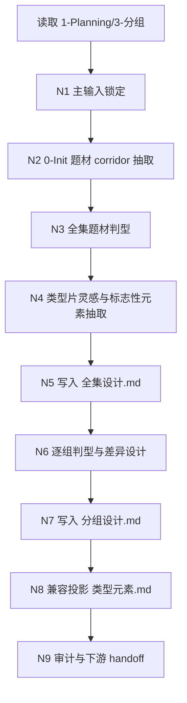
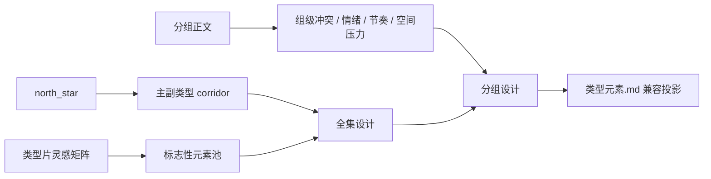
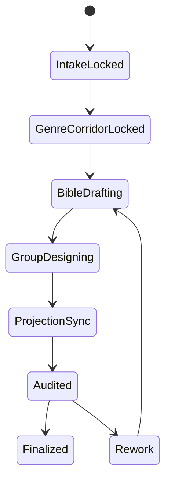

# 2-Global / 类型元素

## 概述

`类型元素` 是 `aigc/2-Global` 下专管“类型题材规划与分组级类型设计”的 leaf skill。

它的职责不是替代 `全局风格` 或 `导演意图`，而是把：

1. `1-Planning/3-分组` 已稳定的分镜组正文与组界
2. `0-Init` 已锁定的项目题材 corridor、观众合同与禁区
3. 各类类型片可复用的灵感、标志性元素与运作逻辑

收束为两份 canonical 输出：

- `projects/aigc/<项目名>/2-Global/类型元素/全集设计.md`
- `projects/aigc/<项目名>/2-Global/类型元素/分组设计.md`

并在需要兼容旧链路时，派生：

- `projects/aigc/<项目名>/2-Global/类型元素.md`

## Leaf Skill Boundary (Mandatory)

### Truth Ownership

本技能拥有：

- 创作影片的题材 corridor 判型
- 类型片灵感池与标志性元素抽取
- `全集设计.md` 的项目级类型圣经
- `分组设计.md` 的按集按组类型设计卡
- `类型元素.md` 的兼容投影规则

本技能不拥有：

- `全局风格` 的项目级风格底座真源
- `导演意图` 的按组导演调度真源
- `projects/aigc/<项目名>/3-Detail/第N集.json` 的最终组间设计写回权

### Stage Position

- 所属阶段：`2-Global`
- 默认上游：`1-Planning/3-分组`
- 默认附加上下文：`0-Init`
- 默认下游：`2-Global/导演意图`、`3-Detail`

## When to Use

- 已有 `projects/aigc/<项目名>/1-Planning/3-分组/第N集.md`，需要把项目题材与各分镜组的类型打法正式定稿。
- 需要从类型片族群中提炼灵感、标志性元素与错误示范，并把它们压成可被下游消费的设计语言。
- 需要让所有分镜组保持同一部作品的整体类型气质，同时允许局部细节、冲突引擎与节奏策略发生可控差异。
- 需要把旧的单文件 `类型元素.md` 升格为“全集真源 + 分组真源 + 兼容投影”的可治理结构。

## When Not to Use

- `1-Planning/3-分组/第N集.md` 还不存在，或组界仍不稳定。
- 当前任务是补 `全局风格` 或 `导演意图`，而不是类型题材规划。
- 当前任务已经进入 shot-level 设计、主体设计、图像或视频阶段。

## Business Requirement Analysis Contract (Mandatory)

| analysis_slot | 当前结论 |
| --- | --- |
| `business_goal` | 以 `3-分组` 结果为主输入、`0-Init` 初始化输出为附加上下文，完成影片级题材规划与组级类型设计，并把结果落成双文件真源 |
| `business_object` | `全集设计.md` 中的项目级题材 corridor、类型灵感池、标志性元素圣经；`分组设计.md` 中的按集按组设计卡 |
| `constraint_profile` | 必须先锁定项目主副类型和禁区，再做组级差异；组级设计必须能被 `3-Detail` 直接消费；不得把类型判断写成空泛宣传语 |
| `success_criteria` | 全集设计能说明“这部片是什么类型、借哪些类型片逻辑、禁止哪些误判”；分组设计能说明“每组如何延续统一类型气质并产生局部差异” |
| `non_goals` | 不直接写 `导演意图`、不直接写 `3-Detail` JSON、不过度复制外部影片、不断言具体镜头执行细节 |
| `complexity_source` | 项目级统一气质与组级差异并存；题材 inspiration 需要可追溯但不能抄袭；旧单文件链路仍需兼容 |
| `topology_fit` | 先串行锁主输入与题材 corridor，再并行做灵感池抽取与分组判型，最后汇流成双文件真源与兼容投影 |
| `step_strategy` | 采用“主输入锁定 -> 全集圣经 -> 分组设计 -> 兼容投影 -> 审计闭环”的思行网络 |

## Context Preload (Mandatory)

加载顺序固定为：

1. 根 `AGENTS.md`
2. `.agents/skills/aigc/SKILL.md + CONTEXT.md`
3. 本 `SKILL.md + CONTEXT.md`
4. `.agents/skills/aigc/_shared/project-runtime-layout.md`
5. `references/类型片灵感矩阵.md`
6. `projects/aigc/<项目名>/0-Init/north_star.yaml`
7. `projects/aigc/<项目名>/0-Init/init_handoff.yaml`
8. `projects/aigc/<项目名>/0-Init/story-source-manifest.yaml`（若存在）
9. `projects/aigc/<项目名>/1-Planning/3-分组/第N集.md`
10. `projects/aigc/<项目名>/1-Planning/3-分组/执行报告.md`（若存在）
11. 已有 `projects/aigc/<项目名>/2-Global/类型元素/全集设计.md`
12. 已有 `projects/aigc/<项目名>/2-Global/类型元素/分组设计.md`
13. 已有 `projects/aigc/<项目名>/2-Global/类型元素.md`
14. `templates/全集设计.template.md`
15. `templates/分组设计.template.md`

硬规则：

1. `1-Planning/3-分组/第N集.md` 是第一主输入根。
2. `0-Init` 只作为题材 corridor、受众承诺、禁区与长期气质附加上下文，不得反向覆盖上游已锁定分组事实。
3. 若 `全集设计.md`、`分组设计.md` 已存在，必须做增量 patch，而不是盲目全量重写。

## Canonical Source Governance (Mandatory)

### Authoritative Sources

本技能的 authoritative source 固定为：

1. `projects/aigc/<项目名>/2-Global/类型元素/全集设计.md`
2. `projects/aigc/<项目名>/2-Global/类型元素/分组设计.md`

它们分别承担：

- `全集设计.md`
  - 项目级题材 corridor
  - 类型片 inspiration 池
  - 标志性元素总则
  - 统一类型气质与禁区
  - 思考过程摘要
- `分组设计.md`
  - `第N集 -> 【分镜组ID】` 粒度的类型设计卡
  - 与全集总则的对齐点
  - 局部差异设计
  - 参考桥段与负例
  - 可供 `3-Detail` 继承的 `类型元素` 字段

### Derived Projection

`projects/aigc/<项目名>/2-Global/类型元素.md` 从现在起降级为兼容投影，不再独立持有新事实。

投影规则：

1. `项目类型总则` 只能来自 `全集设计.md` 的项目级结论。
2. `第N集 -> 【组ID】` 下的 `类型元素` 行，必须直接来自 `分组设计.md` 命中组的字段标题 `类型元素`。
3. 兼容投影只做汇编与标题重组，不得现场改写句义。
4. 若兼容投影未刷新，必须显式报告“兼容层滞后”，不得假装三份文件仍同源。

## Total Input Contract (Mandatory)

### 必需输入

- `projects/aigc/<项目名>/1-Planning/3-分组/第N集.md`
- `projects/aigc/<项目名>/0-Init/north_star.yaml`

### 可选输入

- `projects/aigc/<项目名>/0-Init/init_handoff.yaml`
- `projects/aigc/<项目名>/0-Init/story-source-manifest.yaml`
- `projects/aigc/<项目名>/1-Planning/3-分组/执行报告.md`
- 已有 `projects/aigc/<项目名>/2-Global/类型元素/全集设计.md`
- 已有 `projects/aigc/<项目名>/2-Global/类型元素/分组设计.md`
- 已有 `projects/aigc/<项目名>/2-Global/类型元素.md`

### 禁止输入

- 把其他项目的类型结论直接平移进当前项目
- 只给抽象风格词而不读取分组正文
- 直接模仿具体导演、影片或 IP 的镜头体系
- 把 shot-level 镜头调度当作本技能的首要输出

## Shared Canonical Sources (Mandatory)

- 强制读取：`.agents/skills/aigc/_shared/project-runtime-layout.md`
- 强制读取：`references/类型片灵感矩阵.md`
- 强制读取：
  - `templates/全集设计.template.md`
  - `templates/分组设计.template.md`

## Visual Maps

## Internal Thinking-Action Network (Mandatory)

| node_id | 对应 Step | 聚焦字段 | objective | actions | evidence | route_out | gate |
| --- | --- | --- | --- | --- | --- | --- | --- |
| `N1-INPUT-LOCK` | `S1` | `FIELD-TYPE-01` | 锁定唯一主输入与本轮 episode scope | 读取 `3-分组/第N集.md`，识别全部组 ID、组标题与正文范围 | 输入清单、episode scope、组索引 | 成功 -> `N2`；输入缺失 -> 回到 `S1` | 主输入唯一后方可继续 |
| `N2-INIT-CORRIDOR` | `S2` | `FIELD-TYPE-02` | 从 `0-Init` 抽取项目题材 corridor、观众合同与禁区 | 读取 `north_star.yaml` 与 `init_handoff.yaml`，压出主副类型、主题 promise、anti-goals | corridor brief、禁区表 | 成功 -> `N3`；题材冲突 -> 回到 `S2` | corridor 稳定后方可判型 |
| `N3-GENRE-DECISION` | `S3` | `FIELD-TYPE-02` | 形成影片级主副类型与混合公式 | 结合分组正文密度判断主类型、辅类型、类型混合次序与观众合同 | genre verdict、mix formula | 成功 -> `N4`；判型漂移 -> 回到 `S2/S3` | 影片主型必须先锁 |
| `N4-INSPIRATION-HARVEST` | `S4` | `FIELD-TYPE-03` | 从类型片矩阵抽取可借鉴的标志性元素与错误示范 | 命中适配类型族群，记录可借逻辑、禁借路径、可译码字段 | inspiration matrix、negative list | 成功 -> `N5`；参考失真 -> 回到 `S4` | 仅允许借“运作逻辑” |
| `N5-SERIES-BIBLE` | `S5` | `FIELD-TYPE-04` | 写出 `全集设计.md` 的项目级类型圣经 | 生成项目总则、类型片灵感池、标志性元素、统一类型气质、思考过程摘要 | `全集设计.md` 草案 | 成功 -> `N6`；项目级与组级混写 -> 回到 `S5` | 全集圣经完成后方可下钻 |
| `N6-GROUP-EXTRACT` | `S6` | `FIELD-TYPE-05` | 从分组正文抽出每组的类型任务与局部差异信号 | 为每组识别冲突引擎、揭示策略、情绪递送、空间压力、错误类型 | group extraction notes | 成功 -> `N7`；组级证据不足 -> 回到 `S6` | 每组需有证据锚点 |
| `N7-GROUP-DESIGN` | `S7` | `FIELD-TYPE-06` | 写出 `分组设计.md` | 为每组生成类型设计卡，固定 `类型元素` 字段并说明与全集总则的共性/差异 | `分组设计.md` 草案 | 成功 -> `N8`；局部差异越权 -> 回到 `S7` | 组级设计必须受全集总则约束 |
| `N8-COMPAT-PROJECT` | `S8` | `FIELD-TYPE-07` | 生成兼容投影 `类型元素.md` | 只从双文件真源汇编旧文件，不新增新句子 | 兼容投影草案 | 成功 -> `N9`；发现净新增真相 -> 回到 `S5/S7` | 兼容投影不得成为第二真源 |
| `N9-AUDIT-HANDOFF` | `S9` | `FIELD-TYPE-08` | 审计结构完整性与下游可消费性 | 核对章节、组级字段、compat 投影同步状态与 `3-Detail` 继承位 | audit report、handoff note | pass -> `done`；fail -> 对应返工节点 | 最终汇流点 |

## Full-Episode Design Contract (Mandatory)

`全集设计.md` 至少必须包含：

1. `项目类型总则`
2. `题材 corridor 与观众合同`
3. `类型片灵感池`
4. `标志性元素总表`
5. `统一类型气质与共用禁区`
6. `对分组设计的统摄规则`
7. `思考过程摘要`

硬规则：

1. 只能写项目级稳定结论，不写单组局部气氛。
2. inspiration 必须说明借的是哪类运作逻辑，不是只列片名。
3. 禁区必须可执行，例如“禁止拍成甜宠爽剧化”“禁止拍成硬科幻 exposition”。

## Group Design Contract (Mandatory)

`分组设计.md` 必须按 `## 第N集 -> ### 【分镜组ID】 组标题` 组织。

每组至少必须包含以下字段：

- `主类型`
- `副类型`
- `混合公式`
- `与全集总则的对齐点`
- `局部差异设计`
- `冲突引擎`
- `节奏与揭示策略`
- `情绪递送方式`
- `表演强度控制`
- `镜头组织倾向`
- `参考作品`
- `参考桥段`
- `借鉴的是哪种类型运作逻辑`
- `类型具像化表述`
- `对 3-Detail 的直接执行导向`
- `wrong_genre_negatives`
- `forbidden_registers`
- `fallback_floor`
- `未采纳路径`
- `不采纳原因`
- `类型元素`
- `evidence`

硬规则：

1. 每组都必须同时回答“共性从哪来，差异落在哪”。
2. `类型元素` 字段是兼容投影与下游 JSON 提取的唯一组级短句真源。
3. 不允许只写“氛围感”“电影感”这类不可执行空词。

## One-Shot Output Contract (Mandatory)

本技能的正式输出固定为：

1. `projects/aigc/<项目名>/2-Global/类型元素/全集设计.md`
2. `projects/aigc/<项目名>/2-Global/类型元素/分组设计.md`
3. `projects/aigc/<项目名>/2-Global/类型元素.md`（仅兼容投影）

输出中的 `思考过程` 只允许以“判型路径 / inspiration 取舍 / 不采纳原因”的结构化摘要出现，不写冗长流水账。

## Convergence Contract (Mandatory)

只有同时满足以下条件，本技能才允许宣布完成：

1. `全集设计.md` 已锁项目级主副类型、灵感池、标志性元素与禁区。
2. `分组设计.md` 已对命中 episode 的全部组生成设计卡。
3. 每组的 `类型元素` 字段已生成，可直接供兼容层与下游消费。
4. `类型元素.md` 若存在兼容需求，已由双文件真源派生完成。
5. 未出现“项目级总则被单组细节污染”或“单组差异脱离全集总则”的双真源漂移。

## Root-Cause Execution Contract (Mandatory)

当 `类型元素` 阶段出现以下症状时，必须优先修本技能源层，而不是直接重写某个组文案：

- 输出只有旧 `类型元素.md`，没有双文件真源
- 全集设计与分组设计互相重复或互相打架
- inspiration 只有片名，没有可执行标志性元素
- 组级判断无法回答“整体一致、局部差异”是如何成立的
- 下游只剩抽象口号，无法继承到 `3-Detail`

必经链路：

`Symptom -> Direct Technical Cause -> Rule Source -> Meta Rule Source -> Fix Landing Points`

优先检查：

- `Rule Source`
  - 本 `SKILL.md`
  - `templates/全集设计.template.md`
  - `templates/分组设计.template.md`
  - `references/类型片灵感矩阵.md`
- `Meta Rule Source`
  - 根 `AGENTS.md`
  - `skill-知行合一`

## Completion Standard

完成时必须能明确回答：

1. 这部片的主副类型与观众合同是什么。
2. 借了哪些类型片运作逻辑，而不是复制了哪些作品表层。
3. 每个分镜组如何在统一类型气质中做出局部差异。
4. 旧 `类型元素.md` 是否已被刷新为兼容投影。

## Field Mapping

| step_id | field_id | intent | failure_signal | rework_entry |
| --- | --- | --- | --- | --- |
| `lock-primary-input` | `FIELD-TYPE-01` | 锁定 `3-分组` 主输入与 episode scope | 组 ID 漂移、组界不稳 | 回到 `N1` |
| `extract-genre-corridor` | `FIELD-TYPE-02` | 锁项目级题材 corridor 与禁区 | 主副类型前后矛盾 | 回到 `N2/N3` |
| `harvest-inspirations` | `FIELD-TYPE-03` | 抽取可借鉴的类型片运作逻辑 | 只有片名，没有逻辑 | 回到 `N4` |
| `write-series-bible` | `FIELD-TYPE-04` | 定稿 `全集设计.md` | 项目级与组级混写 | 回到 `N5` |
| `extract-group-signals` | `FIELD-TYPE-05` | 提取每组的局部差异信号 | 组级证据不足 | 回到 `N6` |
| `write-group-design` | `FIELD-TYPE-06` | 定稿 `分组设计.md` | 无法体现整体一致与局部差异 | 回到 `N7` |
| `sync-compat-projection` | `FIELD-TYPE-07` | 刷新旧链路兼容层 | compat 文件出现净新增真相 | 回到 `N8` |
| `audit-and-handoff` | `FIELD-TYPE-08` | 审计双文件真源与下游可消费性 | 下游无法直接继承 | 回到对应节点 |
