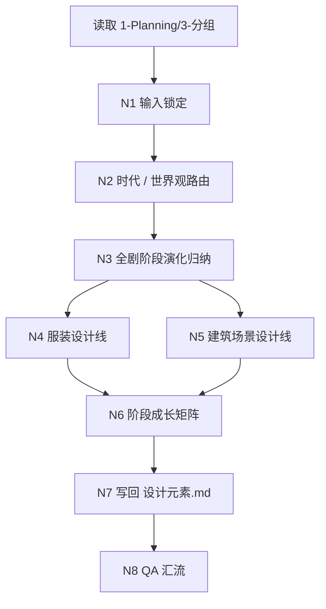
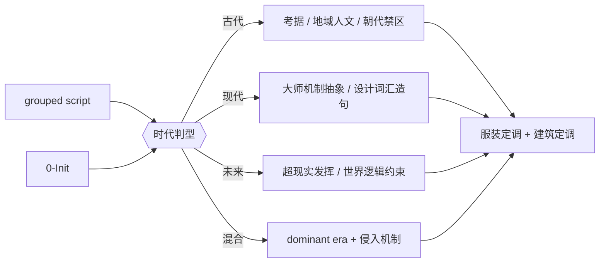
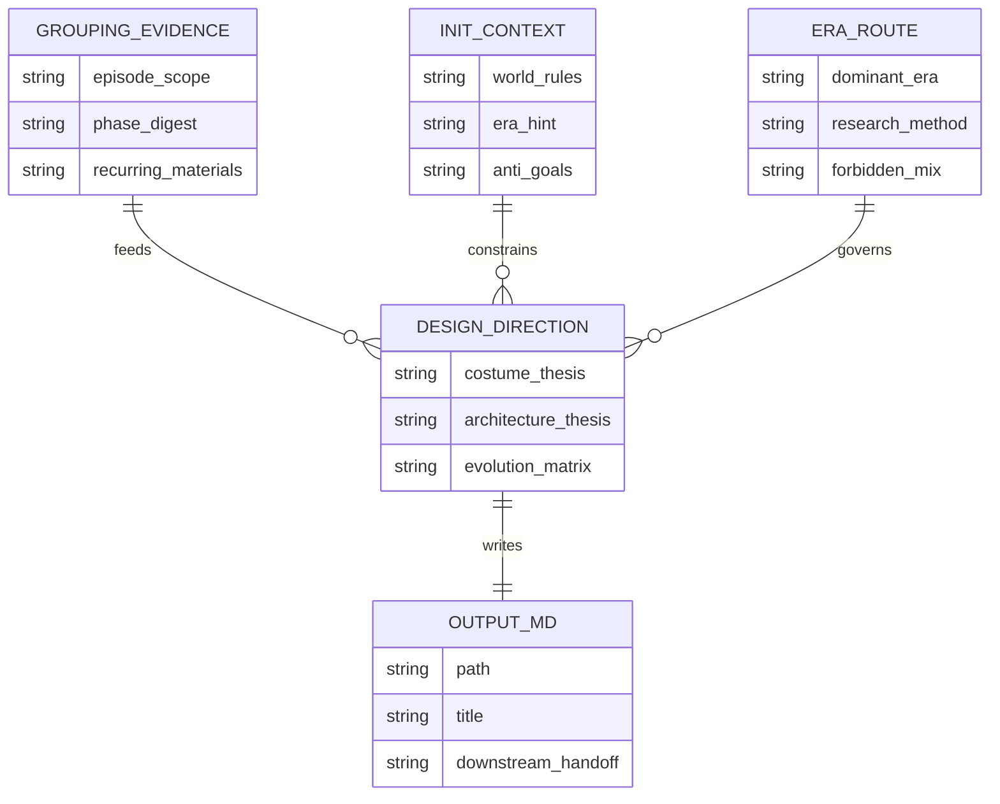
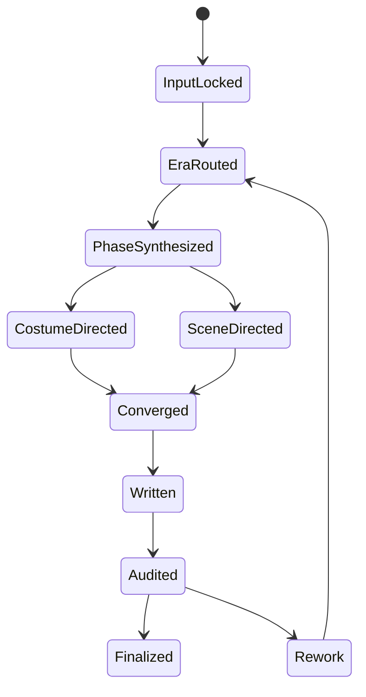

# 2-Global / 设计元素

## Child Positioning

`设计元素` 是 `aigc/2-Global` 下专管“服装 + 建筑场景定调”的受治理子技能。

它的职责不是直接替代 `4-Design/服装` 或 `4-Design/场景`，而是把：

1. `1-Planning/3-分组` 已锁定的 grouped script 作为第一主输入
2. `0-Init` 已稳定的世界观、题材、受众与禁区作为附加上下文
3. 时代属性与世界观一致性作为强路由门
4. 全剧不同阶段的成长性、变化性与设计转场作为阶段性设计母体

收束为一份项目级设计定调真源：

- `projects/aigc/<项目名>/2-Global/设计元素/设计元素.md`

## Truth Ownership

本技能拥有：

- 全剧级服装设计定调
- 全剧级建筑场景设计定调
- 时代属性路由与对应研究/借鉴策略
- 分阶段设计成长与变化矩阵
- 下游 `4-Design/服装` 与 `4-Design/场景` 可继承的设计母句、设计禁区与演化轨迹

本技能不拥有：

- 逐角色、逐服装对象的最终设计写回权
- 逐场景对象的结构化设计卡写回权
- `3-Detail/第N集.json` 的组间设计 seed 写回权
- 具体镜头、单体道具、单角色 prompt 的最终落盘权

## Stage Position

- 所属阶段：`2-Global`
- 默认上游：`1-Planning/3-分组`
- 默认附加上下文：`0-Init`
- 默认下游：`4-Design/服装`、`4-Design/场景`、`5-Image`、`6-Video`

## Mandatory Canonical Sources

- `.agents/skills/aigc/_shared/project-runtime-layout.md`
- `.agents/skills/aigc/1-Planning/_shared/IO_CONTRACT.md`
- `.agents/skills/aigc/1-Planning/3-分组/SKILL.md`
- `.agents/skills/aigc/0-Init/SKILL.md`
- `references/execution-flow.md`
- `references/era-routing.md`
- `references/output-template.md`
- `templates/设计元素.template.md`

真源分工：

- 本 `SKILL.md`：子技能总合同、思行网络、时代路由门、输出边界
- `references/execution-flow.md`：读取顺序、分支回退、设计汇流顺序
- `references/era-routing.md`：古代 / 现代 / 未来 / 混合型时代路由与设计禁区
- `references/output-template.md` + `templates/设计元素.template.md`：Markdown 输出骨架

## When To Use

- 已有 `projects/aigc/<项目名>/1-Planning/3-分组/第N集.md`，需要为整部影片建立服装与建筑场景的总设计定调。
- 需要把题材时代属性显式纳入设计逻辑，而不是只写抽象审美形容词。
- 需要让服装与建筑场景在同一世界观下形成统一设计语言，并允许不同叙事阶段发生成长与变化。
- 需要为古代、现代、未来或混合型题材建立不同的研究/借鉴方法。
- 需要为下游 `4-Design` 提供“可继承的设计母句 + 禁区 + 演化轨迹”。

## When Not To Use

- 上游还没有稳定的 `1-Planning/3-分组/第N集.md`。
- 当前任务是直接设计单个角色服装稿或单个场景卡，而不是建立全剧级设计母体。
- 用户只要单集临时视觉补丁，不要求项目级服装/建筑设计定调。

## Business Requirement Analysis Contract

| analysis_slot | 当前结论 |
| --- | --- |
| `business_goal` | 以 `3-分组` 为主输入、`0-Init` 为附加上下文，产出一份同时覆盖服装与建筑场景的项目级设计元素母体。 |
| `business_object` | `第N集.md` grouped scripts、`执行报告.md`、`episode-split-plan.json`、`north_star.yaml`、`init_handoff.yaml`、最终 `设计元素.md`。 |
| `constraint_profile` | 必须先做时代/世界观路由，再决定服装与建筑场景的设计方法；古代重考据，现代重大师机制抽象，未来重超现实但必须可回指世界逻辑；全剧阶段成长必须显式写出。 |
| `success_criteria` | 输出同时具备时代判型、服装定调、建筑场景定调、阶段成长矩阵、设计词汇造句、明确禁区与下游 handoff。 |
| `non_goals` | 不直接替代 `4-Design` 的对象级设计稿；不写 shot-level 调度；不把 `0-Init` 直接变成未经 grouped script 验证的设计结论。 |
| `complexity_source` | 时代路由、服装/建筑双线并行、全剧多阶段演化、世界观一致性与下游可继承性同时存在。 |
| `topology_fit` | 固定主干为：输入锁定 -> 时代路由 -> 全剧阶段归纳 -> 服装线 / 建筑场景线 -> 演化矩阵 -> Markdown 写回 -> QA 汇流。 |
| `step_strategy` | 采用“串行锁真源 + 条件时代分支 + 双设计线并行 + 单文件汇流”的混合思行网络。 |

## Context Preload (Mandatory)

加载顺序固定为：

1. 根 `AGENTS.md`
2. `.agents/skills/aigc/SKILL.md + CONTEXT.md`
3. 本 `SKILL.md + CONTEXT.md`
4. `.agents/skills/aigc/_shared/project-runtime-layout.md`
5. `.agents/skills/aigc/1-Planning/_shared/IO_CONTRACT.md`
6. `.agents/skills/aigc/1-Planning/3-分组/SKILL.md`
7. `.agents/skills/aigc/0-Init/SKILL.md`
8. `references/execution-flow.md`
9. `references/era-routing.md`
10. `projects/aigc/<项目名>/1-Planning/3-分组/第N集.md`
11. `projects/aigc/<项目名>/1-Planning/3-分组/执行报告.md`（若存在）
12. `projects/aigc/<项目名>/1-Planning/episode-split-plan.json`
13. `projects/aigc/<项目名>/0-Init/north_star.yaml`
14. `projects/aigc/<项目名>/0-Init/init_handoff.yaml`
15. `projects/aigc/<项目名>/0-Init/story-source-manifest.yaml`（若存在）
16. 已有 `projects/aigc/<项目名>/2-Global/全局风格/全局风格设计.md`（若存在，仅作横向对齐）
17. 已有 `projects/aigc/<项目名>/2-Global/设计元素/设计元素.md`（若存在，用于增量 patch）
18. `templates/设计元素.template.md`

硬规则：

1. `1-Planning/3-分组` 是第一主输入，没有 grouped script 不得只凭 `0-Init` 发明设计定调。
2. `0-Init` 只负责补齐世界观、题材与禁区，不得压过 grouped script 的可见叙事证据。
3. 若已有 `设计元素.md`，默认增量 patch，而不是盲目整稿重写。
4. 若存在 `全局风格设计.md`，它只能作为审美底座横向校对，不能取代本技能的时代/对象双线设计判断。

## Total Input Contract (Mandatory)

### 必需输入

- `projects/aigc/<项目名>/1-Planning/3-分组/第N集.md`
- `projects/aigc/<项目名>/0-Init/north_star.yaml`

### 可选输入

- `projects/aigc/<项目名>/1-Planning/3-分组/执行报告.md`
- `projects/aigc/<项目名>/1-Planning/episode-split-plan.json`
- `projects/aigc/<项目名>/0-Init/init_handoff.yaml`
- `projects/aigc/<项目名>/0-Init/story-source-manifest.yaml`
- `projects/aigc/<项目名>/2-Global/全局风格/全局风格设计.md`
- 已有 `projects/aigc/<项目名>/2-Global/设计元素/设计元素.md`
- 用户补充的历史参考、设计偏好、当代大师名录或题材禁区

### 禁止输入

- 不经解释地平移其他项目的服装或建筑风格结论
- 只给抽象风格词，不回看 grouped script 的实际阶段变化
- 把古代题材写成跨朝代混搭而不说明世界观许可机制
- 把现代题材直接写成品牌/作品复刻
- 把未来题材写成无世界逻辑支撑的随机炫技

## Era Routing Contract (Mandatory Digest)

时代路由完整细则以 `references/era-routing.md` 为准；本阶段至少执行以下 digest：

1. `古代题材`
   - 先锁定朝代 / 地域 / 阶层 / 人文气候 / 工艺条件。
   - 服装与建筑都必须明确“可借证据”和“禁止穿越借用”的边界。
   - 若 grouped script 与 `0-Init` 对朝代/地域表达模糊，必须写成保守区间，不得擅自拍死具体朝代细节。
2. `现代题材`
   - 可大胆借用当代服装设计师与建筑设计师的机制。
   - 借的是结构语言、比例、材料逻辑、气质和词汇句法，不是 logo、秀场造型或单体建筑复制。
   - 必须产出可供下游直接复用的设计词汇造句。
3. `未来题材`
   - 允许更强超现实主义发挥，但必须解释技术水平、资源结构、社会秩序或美学宗教如何支撑该设计。
   - 服装与建筑场景必须来自同一未来世界，而不是各自飞。
4. `混合型 / 架空型`
   - 必须先声明 dominant era，再声明允许侵入的次级时代语汇及其世界观解释。

## Visual Maps

## Thinking-Action Node Network

| node_id | 对应 Step | 聚焦字段 | objective | actions | evidence | route_out | gate |
| --- | --- | --- | --- | --- | --- | --- | --- |
| `N1-INPUT-LOCK` | `S1` | `FIELD-DESIGN-01` `FIELD-DESIGN-02` | 锁定 grouped script 主输入与项目范围 | 读取 `第N集.md`、`执行报告.md`、`north_star/init_handoff`，确认全集范围、阶段范围与缺口 | 输入清单、episode scope、缺口说明 | 成功 -> `N2`；输入缺失 -> 回 `S1` | 没有 grouped script 不得继续 |
| `N2-ERA-WORLD-ROUTE` | `S2` | `FIELD-DESIGN-03` `FIELD-DESIGN-04` | 形成时代判型与世界观约束路由 | 结合 `3-分组` 与 `0-Init`，判定古代 / 现代 / 未来 / 混合，记录研究方法与禁止混搭项 | era verdict、route note、禁区表 | 成功 -> `N3`；时代路由不稳 -> 回 `S2` | 必须先锁时代路由 |
| `N3-PHASE-SYNTHESIS` | `S3` | `FIELD-DESIGN-05` | 从 grouped script 提炼全剧阶段变化与重复设计信号 | 归纳角色阶层变化、空间秩序变化、社会气候、材料倾向、文明压力与叙事阶段 | phase digest、变化节点、重复模式 | 成功 -> `N4/N5`；仍停留单集碎片 -> 回 `S3` | 必须上升到全剧或阶段级视角 |
| `N4-COSTUME-DIRECTION` | `S4` | `FIELD-DESIGN-06` `FIELD-DESIGN-07` | 为服装建立时代正确且可继承的设计定调 | 按时代路由输出 silhouette、材质、纹样、色谱、配饰与设计词汇母句；写清研究依据与禁借项 | costume thesis、costume lexicon、forbidden mix | 成功 -> `N6`；服装线失真 -> 回 `S4` | 服装判断必须服从时代路由 |
| `N5-SCENE-DIRECTION` | `S5` | `FIELD-DESIGN-08` `FIELD-DESIGN-09` | 为建筑场景建立世界观一致的设计定调 | 按时代路由输出建筑语言、空间秩序、材料工法、陈设密度与设计词汇母句；写清研究依据与禁借项 | architecture thesis、scene lexicon、forbidden mix | 成功 -> `N6`；建筑场景线失真 -> 回 `S5` | 建筑判断必须服从时代路由 |
| `N6-EVOLUTION-ARC` | `S6` | `FIELD-DESIGN-10` `FIELD-DESIGN-11` | 收束全剧阶段成长与变化矩阵 | 把服装线与建筑线映射到开端 / 发展 / 转折 / 后段等阶段，写出可增长、可衰败、可异化的设计规则 | evolution matrix、phase guardrails | 成功 -> `N7`；阶段变化空泛 -> 回 `S6` | 必须写清变化不是随机漂移 |
| `N7-WRITEBACK` | `S7` | `FIELD-DESIGN-12` | 按模板写回 Markdown 真源 | 动态读取模板，写入 `设计元素.md` 章节、设计母句与阶段矩阵 | 文件落盘证据 | 成功 -> `N8`；结构错位 -> 回 `S7` | 路径与章节完整后方可验收 |
| `N8-QA-CONVERGENCE` | `S8` | `FIELD-DESIGN-13` | 审核时代正确性、双设计线完整性与下游可用性 | 检查主辅输入优先级、时代路由正确性、服装/建筑双线、阶段变化、禁区与 handoff | QA verdict、返工入口 | pass -> `done`；fail -> 回对应节点 | 通过前不得宣布完成 |

## Convergence Contract (Mandatory)

只有同时满足以下条件，`设计元素` 才允许宣布完成：

1. 主输入明确来自 `1-Planning/3-分组`，`0-Init` 已作为附加上下文被消费。
2. 已明确时代路由，并写出对应的研究/借鉴方法与禁止混搭项。
3. 已同时产出服装定调与建筑场景定调，不能只写其中一条线。
4. 已写出全剧或多阶段的成长 / 变化矩阵，不能只给静态设计总则。
5. 对古代题材，已写清历史地域人文与时代禁区；对现代题材，已写清大师机制抽象与词汇造句；对未来题材，已写清超现实发挥的世界逻辑。
6. canonical 输出已写入 `projects/aigc/<项目名>/2-Global/设计元素/设计元素.md`。
7. 输出可直接被 `4-Design/服装`、`4-Design/场景` 与后续画面阶段继承，而不必重新解释。

## Output Contract (Mandatory)

### Canonical Output

- `projects/aigc/<项目名>/2-Global/设计元素/设计元素.md`

### Child-Local Canonical Rule

- 本子技能以子目录 `设计元素/` 为唯一真源落点。
- 若未来父阶段需要投影 `projects/aigc/<项目名>/2-Global/设计元素.md`，只能从本文件派生，不得双向编辑。

### Required Sections

输出至少包含以下板块：

1. `项目范围与输入锁定`
2. `世界观与时代判型`
3. `上游 grouped script 证据摘要`
4. `初始化附加约束`
5. `服装设计定调`
6. `建筑场景设计定调`
7. `阶段成长与变化矩阵`
8. `时代专属 guardrails`
9. `下游 handoff 与使用边界`

## Root-Cause Execution Contract (Mandatory)

当出现以下症状时，必须先修源层合同，再决定是否只改某份设计文稿：

- 输出只剩抽象审美词，没有时代判型与研究方法
- 服装与建筑场景来自不同世界观，互相打架
- 古代题材出现明显跨朝代、跨地域误植却没有解释
- 现代题材退化成直接临摹某位设计师或某栋建筑
- 未来题材只有炫技，没有文明逻辑
- 输出没有阶段成长变化，像静态 moodboard
- 输出路径或章节结构不断漂移

固定追溯链：

`Symptom -> Direct Technical Cause -> Rule Source -> Meta Rule Source -> Fix Landing Points`

优先检查：

- `Rule Source`
  - 本 `SKILL.md`
  - `references/execution-flow.md`
  - `references/era-routing.md`
  - `templates/设计元素.template.md`
- `Meta Rule Source`
  - 根 `AGENTS.md`
  - `.agents/skills/aigc/SKILL.md`
  - `skill-知行合一` 元技能合同

## Field Master

| field_id | intent | canonical_landing | source_priority | owner_node |
| --- | --- | --- | --- | --- |
| `FIELD-DESIGN-01` | 锁定项目范围与输入真源 | `设计元素.md > 项目范围与输入锁定` | `3-分组 > 0-Init > 用户补充` | `N1` |
| `FIELD-DESIGN-02` | 记录 grouped script 主输入证据 | `设计元素.md > 上游 grouped script 证据摘要` | `3-分组` | `N1` |
| `FIELD-DESIGN-03` | 锁定时代判型 | `设计元素.md > 世界观与时代判型` | `3-分组 + 0-Init` | `N2` |
| `FIELD-DESIGN-04` | 记录时代研究/借鉴方法与禁区 | `设计元素.md > 世界观与时代判型` | `FIELD-DESIGN-03 + 时代路由` | `N2` |
| `FIELD-DESIGN-05` | 提炼全剧阶段变化与设计信号 | `设计元素.md > 上游 grouped script 证据摘要` | `3-分组 + episode-split-plan` | `N3` |
| `FIELD-DESIGN-06` | 服装设计主陈述 | `设计元素.md > 服装设计定调` | `FIELD-DESIGN-03 + FIELD-DESIGN-05` | `N4` |
| `FIELD-DESIGN-07` | 服装设计词汇造句与禁借项 | `设计元素.md > 服装设计定调` | `FIELD-DESIGN-06 + 时代研究` | `N4` |
| `FIELD-DESIGN-08` | 建筑场景设计主陈述 | `设计元素.md > 建筑场景设计定调` | `FIELD-DESIGN-03 + FIELD-DESIGN-05` | `N5` |
| `FIELD-DESIGN-09` | 建筑场景设计词汇造句与禁借项 | `设计元素.md > 建筑场景设计定调` | `FIELD-DESIGN-08 + 时代研究` | `N5` |
| `FIELD-DESIGN-10` | 阶段成长矩阵 | `设计元素.md > 阶段成长与变化矩阵` | `FIELD-DESIGN-05 + FIELD-DESIGN-06 + FIELD-DESIGN-08` | `N6` |
| `FIELD-DESIGN-11` | 时代专属 guardrails | `设计元素.md > 时代专属 guardrails` | `FIELD-DESIGN-03 + FIELD-DESIGN-04` | `N6` |
| `FIELD-DESIGN-12` | 输出结构与写回证据 | `设计元素.md > 全文结构` | `template + 全量字段` | `N7` |
| `FIELD-DESIGN-13` | QA 与 handoff 结论 | `设计元素.md > 下游 handoff 与使用边界` | `全量字段` | `N8` |

## Thought Pass Map

| step_id | field_id | intent | failure_signal | rework_entry |
| --- | --- | --- | --- | --- |
| `S1-input-lock` | `FIELD-DESIGN-01` `FIELD-DESIGN-02` | 锁定 grouped script 主输入与全集范围 | 输入只读 `north_star`，未锁到 grouped script | 回 `N1-INPUT-LOCK` |
| `S2-era-route` | `FIELD-DESIGN-03` `FIELD-DESIGN-04` | 决定时代路由、研究方法与禁区 | 时代判型漂移，或缺失研究/借鉴方法 | 回 `N2-ERA-WORLD-ROUTE` |
| `S3-phase-synthesis` | `FIELD-DESIGN-05` | 抽取全剧阶段变化与重复设计信号 | 仍停留单集梗概或静态 moodboard | 回 `N3-PHASE-SYNTHESIS` |
| `S4-costume-direction` | `FIELD-DESIGN-06` `FIELD-DESIGN-07` | 生成服装设计主陈述与词汇母句 | 服装定调失去时代正确性或只剩表层参考 | 回 `N4-COSTUME-DIRECTION` |
| `S5-scene-direction` | `FIELD-DESIGN-08` `FIELD-DESIGN-09` | 生成建筑场景设计主陈述与词汇母句 | 建筑场景定调失去世界观一致性或只剩空泛审美词 | 回 `N5-SCENE-DIRECTION` |
| `S6-evolution-arc` | `FIELD-DESIGN-10` `FIELD-DESIGN-11` | 写出成长变化矩阵与时代 guardrails | 没有阶段变化，或 guardrails 不能约束下游 | 回 `N6-EVOLUTION-ARC` |
| `S7-writeback` | `FIELD-DESIGN-12` | 按模板写回结构化 Markdown | 章节缺失、路径错误、结构漂移 | 回 `N7-WRITEBACK` |
| `S8-qa` | `FIELD-DESIGN-13` | 做时代正确性、双线完整性与 handoff QA | 输出不可被下游继承，或主辅输入优先级错位 | 回对应失败节点 |

## Pass Table

| field_id | quality_dimension | fail_code | fail_condition | rework_entry |
| --- | --- | --- | --- | --- |
| `FIELD-DESIGN-01` | 输入真源正确性 | `FAIL-DESIGN-PRIMARY-INPUT-MISSING` | 未锁到 `1-Planning/3-分组` | `S1-input-lock` |
| `FIELD-DESIGN-02` | grouped 证据可追溯性 | `FAIL-DESIGN-GROUPING-EVIDENCE-THIN` | 没有 grouped script 证据摘要或 phase 范围 | `S1-input-lock` |
| `FIELD-DESIGN-03` | 时代判型稳定性 | `FAIL-DESIGN-ERA-ROUTE-DRIFT` | 古代/现代/未来/混合判型摇摆不定 | `S2-era-route` |
| `FIELD-DESIGN-04` | 研究/借鉴方法正确性 | `FAIL-DESIGN-ERA-METHOD-WEAK` | 缺失研究路径、机制抽象或禁借项 | `S2-era-route` |
| `FIELD-DESIGN-05` | 全剧阶段综合能力 | `FAIL-DESIGN-PHASE-SCOPE-WEAK` | 输出仍是静态单阶段描述 | `S3-phase-synthesis` |
| `FIELD-DESIGN-06` | 服装主张清晰度 | `FAIL-DESIGN-COSTUME-THESIS-WEAK` | 服装定调空泛或偏离时代 | `S4-costume-direction` |
| `FIELD-DESIGN-07` | 服装词汇可继承性 | `FAIL-DESIGN-COSTUME-LEXICON-WEAK` | 没有可复用设计母句，或直接抄袭现成设计 | `S4-costume-direction` |
| `FIELD-DESIGN-08` | 建筑场景主张清晰度 | `FAIL-DESIGN-SCENE-THESIS-WEAK` | 建筑场景定调空泛或脱离世界观 | `S5-scene-direction` |
| `FIELD-DESIGN-09` | 建筑场景词汇可继承性 | `FAIL-DESIGN-SCENE-LEXICON-WEAK` | 没有可复用设计母句，或直接复制建筑表皮 | `S5-scene-direction` |
| `FIELD-DESIGN-10` | 成长变化可执行性 | `FAIL-DESIGN-EVOLUTION-FLAT` | 没有阶段成长 / 变化矩阵 | `S6-evolution-arc` |
| `FIELD-DESIGN-11` | 时代禁区清晰度 | `FAIL-DESIGN-GUARDRAIL-WEAK` | 没写明跨朝代 / 复刻 / 炫技禁区 | `S6-evolution-arc` |
| `FIELD-DESIGN-12` | 输出结构完整性 | `FAIL-DESIGN-OUTPUT-STRUCTURE-DRIFT` | 模板章节缺失或路径错误 | `S7-writeback` |
| `FIELD-DESIGN-13` | 下游 handoff 可用性 | `FAIL-DESIGN-HANDOFF-NOT-REUSABLE` | 下游无法直接继承或边界不清 | `S8-qa` |
