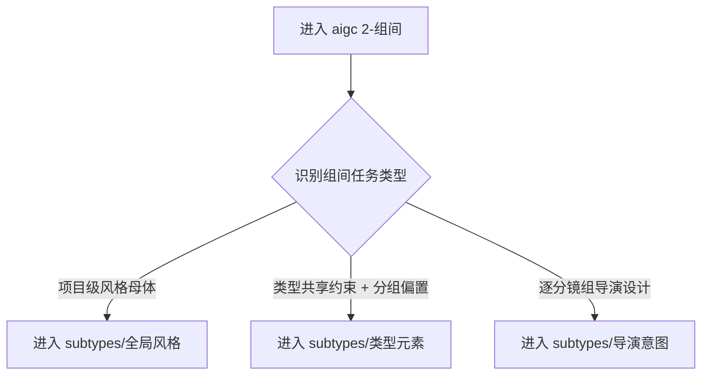

# aigc 2-组间

## 概述

`2-组间` 是 `aigc` 技能树的组间设计阶段真源。

它负责把 `1-规划` 已经稳定的结构结果，转成可被 `3-明细` 消费的组间共享约束与组间动态设计真源。当前阶段的 canonical 子路径包括：

1. `全局风格`
2. `类型元素`
3. `导演意图`

本阶段先回答三件事：

1. 当前属于哪一种组间任务
2. 应进入哪个唯一主子路径
3. 组间真源应落到哪里，如何交给 `3-明细`

本次结构已按最新内容输出型规范重构为：

- `SKILL.md` 只保留阶段主合同、边界、门禁、回指和 Mermaid 摘要
- `references/` 承载思维链、执行流程、路由策略与输出契约细则
- 三个 `subtypes/*` 继续作为唯一可执行子技能入口；分组后的节奏蓝图改由 `1-规划/subtypes/4-节奏` 提供

## When to Use

- 需要围绕 `projects/<项目名>/编导/第N集.json` 建立组间共享或组间动态真源。
- 需要在 `3-明细` 前先锁全组一致的风格、半一致半动态的类型元素，或逐组导演意图。
- 需要判断当前任务属于 `全局风格 / 类型元素 / 导演意图` 中的哪一类。

## When Not to Use

- 任务仍属于 `0-Init` 或 `1-规划`，尚未形成稳定项目种子或结构容器。
- 当前任务已经是正文脚本、镜头脚本或主体设计，应进入 `3-明细` 或后续阶段。
- 用户只想查看阶段状态，而不是建设组间产物。

## 阶段职责边界

### `2-组间` 拥有

- 所有分镜组共用的全局风格真源
- 兼具全组一致项与分组偏置项的类型协议真源
- 按集承载、按分镜组展开的导演意图真源
- `projects/<项目名>/编导/第N集.json` 中的组级设计字段
- `projects/<项目名>/编导/validation-report.md` 中的阶段验收与 patch 记录

### `2-组间` 不拥有

- `1-规划` 的分集、格式与分组结构合同
- `3-明细` 的正文、镜头脚本与对白落盘
- `4-主体` 的角色、场景、道具资产真源

## Visual Maps

## Canonical Module References

| 模块 | 作用 | 真源文件 |
| --- | --- | --- |
| 思维链 | 承载字段主表、thought pass 与返工入口 | `references/chain-of-thought.md` |
| 执行流程 | 承载 council runtime、落点与阶段流程 | `references/execution-flow.md` |
| 类型策略 | 承载子路径路由矩阵、tranche、回退策略 | `references/type-strategies.md` |
| 输出契约 | 承载阶段级交付与子路径总表 | `references/output-template.md` |
| 运行时布局 | 承载项目目录真源与统一根文件路径 | `../_shared/project-runtime-layout.md` |

硬规则：

1. 根 `SKILL.md` 是唯一主合同；`references/` 是模块化细则承载层，不是并行第二真源。
2. 路由、流程、字段与输出模板若需升级，优先回写对应 `references/*.md`。
3. 三个子路径依然是唯一可执行入口；根技能只负责判路与阶段治理，不代写叶子产物。

## Route Summary

- 默认 tranche precedence：`全局风格 -> 类型元素 -> 导演意图`
- 若任务只命中一个子路径，则只推荐一个主入口
- 若命中 `导演意图`，必须先确认项目级 `全局风格 + 类型元素` 已稳定，且目标分组容器已经成立
- 若命中“主驱动 / 七步 / 峰值 / 节奏重排”诉求，先回查 `1-规划/4-节奏` 是否已存在；未存在则先补规划层节奏 handoff
- 详细路由矩阵、触发信号与 unknown 回退见 `references/type-strategies.md`

## Execution Summary

- 进入阶段后，先判定是否启用 `team.yaml` 顾问团运行时
- 再读取 `0-Init` 与 `1-规划` 结果，锁定唯一主子路径
- 再读取 `.agents/skills/aigc/_shared/project-runtime-layout.md`，确认本阶段的 canonical runtime 是 `projects/<项目名>/编导/第N集.json`
- 执行前默认加载已落盘的整份 `projects/<项目名>/编导/第N集.json` 作为 patch 上下文；若文件不存在，则先自动初始化再进入 patch
- 若当前任务混入节奏蓝图裁决，优先读取 `1-规划/4-节奏/第N集.md`
- 最终产物统一 patch 回 `projects/<项目名>/编导/第N集.json`，并以 `projects/<项目名>/编导/validation-report.md` 做阶段验收
- 详细 council runtime 与完整流程见 `references/execution-flow.md`

## Output Summary

- 根技能负责阶段级落点、阶段验收与下一阶段 handoff
- 子技能分别负责：全组一致的 `全局风格`、全组半一致半动态的 `类型元素`，以及逐组展开的 `导演意图`
- 分组后的节奏蓝图由 `1-规划/4-节奏` 提供，`2-组间` 负责消费而非重建
- `2-组间` 在首次进入且根文件缺失时负责自动 bootstrap `projects/<项目名>/编导/第N集.json`
- `2-组间` 只负责 patch `final_output.main_content.分镜组列表[]` 下的组级字段，不另起第二正文或第二集文件
- 结构化真源统一继承 `.agents/skills/aigc/_shared/director_episode_output.schema.json`，不在阶段内另起平行字段壳
- 各子路径主产物、thinking sidecar 与阶段输出总表见 `references/output-template.md`

## Unified Root File Output Governance (Mandatory)

`2-组间` 的标准输出机制固定为“单一根文件真源 + 子技能 sidecar + 父级 patch 聚合”：

1. `projects/<项目名>/编导/第N集.json` 是唯一业务真相，只承载最终组级事实，不承载各子技能的完整创作过程稿。
2. 子技能默认直接对自己负责的字段做 `field patch`，不得先各写一份平行主稿再让父级二次汇总。
3. 子技能若需要保留完整三段式创作过程，必须落到本子技能 sidecar，而不是重复灌入统一根文件。
4. sidecar 默认允许采用三段式 `MD`：`元数据 / 思维链 / 主内容`；它是工作侧车，不是 episode 真源。
5. 父级根技能负责在执行前完整加载 `projects/<项目名>/编导/第N集.json`，在执行后聚合并校验各子技能 `field patch`，再统一落盘。
6. 若 shared schema 当前仍保留顶层 `thinking_chain`，该字段只允许承载父级精简决策摘要、patch provenance 或阶段级验收摘要，不允许重复塞入子技能完整思维链。
7. 任何子技能都不得创建第二份 episode 主文件、第二份 JSON 根稿、或第二份“汇总后总稿”。

对应引用路径固定如下：

- 统一根文件结构真源：`.agents/skills/aigc/_shared/director_episode_output.schema.json`
- 项目运行时真源：`.agents/skills/aigc/_shared/project-runtime-layout.md`
- 本阶段输出模板真源：`references/output-template.md`
- 子技能局部写位与 sidecar 规则：各自 `references/execution-flow.md` / `references/type-strategies.md`

## Selective Dispatch And Aggregation Contract (Mandatory)

`2-组间` 的子技能调度默认是选择性的，而不是为了结构完整做全量运行：

1. 父级根技能必须先做 route decision，明确本轮 `selected_subskills[]`，再进入执行。
2. 只有命中的子技能才允许在本轮执行并返回 `field patch`。
3. 聚合器只接收并合并 `selected_subskills[]` 的有效 patch，不得把未命中子技能视为隐式参与者。
4. 未调度子技能与总 `json` 无关，禁止为了“结构完整”而补空聚合。
5. 若某字段在本轮没有命中对应子技能，则该字段保持现状，不创建空字段、不覆盖既有值、不写默认占位。
6. 若多个子技能同时命中，仍必须先按 tranche precedence 排序，再按序聚合，不得把并发候选误当作“同时全写”许可。
7. 阶段验收、validation-report 与 patch provenance 只记录本轮实际调度到的子技能，不记录未执行子技能的伪状态。

本合同与上一节的输出治理合同共同约束：

- `Unified Root File Output Governance` 解决“根文件放什么、sidecar 放什么”
- `Selective Dispatch And Aggregation Contract` 解决“哪些子技能本轮进入聚合、哪些完全与总 json 无关”

## Field System Summary

- 阶段字段体系仍保持 `FIELD-DIR-ROOT-01` 到 `FIELD-DIR-HANDOFF-04`
- 具体的字段主表、thought pass 与 pass table 已下沉到 `references/chain-of-thought.md`

## Root-Cause Execution Contract (Mandatory)

当出现以下症状时，必须先修 `2-组间` 的源层合同：

- 子技能存在，但父级没有路由合同
- 共享约束与分组动态落点混乱
- `2-组间` 没有在统一根文件上 patch，而是另写一份阶段文件
- `导演意图` 越权替 `3-明细` 写镜级明细
- `全局风格` 与 `类型元素` 的先后和依赖不清
- 组间产物落点漂移出 `projects/<项目名>/编导/第N集.json`

必经链路：

`Symptom -> Direct Technical Cause -> Rule Source -> Meta Rule Source -> Fix Landing Points`

优先检查：

- `Rule Source`
  - `.agents/skills/aigc/2-组间/SKILL.md`
  - `.agents/skills/aigc/2-组间/CONTEXT.md`
  - `.agents/skills/aigc/2-组间/subtypes/*/SKILL.md`
- `Meta Rule Source`
  - `.agents/skills/aigc/SKILL.md`
  - 根 `AGENTS.md`

## Field Master

| field_id | 输出位置/字段 | 内容要求 | 默认责任 Step | 质量维度 | 失败码 |
| --- | --- | --- | --- | --- | --- |
| FIELD-DIR-ROOT-01 | 阶段定位 | 明确 `2-组间` 是脚本前的组间真源层 | S1 | 阶段边界清晰度 | FAIL-DIR-ROOT-01 |
| FIELD-DIR-ROUTE-02 | 子路径路由矩阵 | 明确三个子路径的进入条件、tranche 与落点 | S2 | 路由完整性 | FAIL-DIR-ROUTE-02 |
| FIELD-DIR-LAND-03 | Canonical Landing | 锁定 `projects/<项目名>/编导/第N集.json` 及组级字段责任 | S3 | 落点一致性 | FAIL-DIR-LAND-03 |
| FIELD-DIR-HANDOFF-04 | 阶段闭环 | 说明如何交给 `3-明细` | S4 | 交接可执行性 | FAIL-DIR-HANDOFF-04 |

## Thought Pass Map

| step_id | 聚焦字段 | 核心问题 | 生成动作 | 未达标信号 |
| --- | --- | --- | --- | --- |
| S1 | FIELD-DIR-ROOT-01 | `2-组间` 到底负责什么 | 锁定阶段边界 | 把组间设计写成脚本或规划 |
| S2 | FIELD-DIR-ROUTE-02 | 当前任务应进入哪个子路径 | 写路由矩阵与 tranche | 只有目录，没有入口 |
| S3 | FIELD-DIR-LAND-03 | 产物应落到哪里 | 固定路径 | 共享约束与分组动态落点混乱 |
| S4 | FIELD-DIR-HANDOFF-04 | 如何交给 `3-明细` | 写阶段闭环 | 能写但无法续跑 |

## Pass Table

| field_id | Pass Standard | Fail Code | Rework Entry |
| --- | --- | --- | --- |
| FIELD-DIR-ROOT-01 | 阶段边界清楚且不越权 | FAIL-DIR-ROOT-01 | S1 |
| FIELD-DIR-ROUTE-02 | 子路径、tranche、进入条件、落点完整 | FAIL-DIR-ROUTE-02 | S2 |
| FIELD-DIR-LAND-03 | 所有产物路径一致 | FAIL-DIR-LAND-03 | S3 |
| FIELD-DIR-HANDOFF-04 | 有验收与唯一下一入口 | FAIL-DIR-HANDOFF-04 | S4 |

## Context Preload (Mandatory)

- 每次调用本技能时，必须自动加载同目录 `CONTEXT.md`。
- 每次调用本技能时，建议同时按需读取 `references/*.md` 以获取模块细则。
- 每次调用本技能时，必须额外读取 `.agents/skills/aigc/_shared/project-runtime-layout.md` 与已落盘或待初始化的 `projects/<项目名>/编导/第N集.json`。
- 若进入具体子路径，继续加载对应 `subtypes/<子路径>/SKILL.md` 与 `CONTEXT.md`。
- 若项目根 `team.yaml.enabled == true`，继续加载 `.agents/skills/aigc/_shared/council-runtime/module-spec.md`。
- 优先级遵循：用户显式请求 > 根 `AGENTS.md` > `.agents/skills/aigc/SKILL.md` > 本 `SKILL.md` > 本 `CONTEXT.md`。
