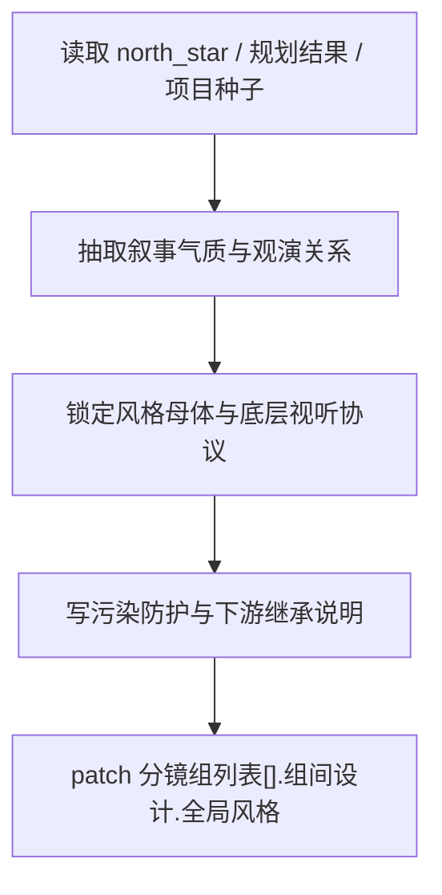

# 全局风格

## 概述

`全局风格` 是 `2-组间` 阶段的全组一致风格母体真源。

它负责先解构叙事与世界观，再把项目的视觉底座、观演距离、媒介属性、渲染技术栈、美学范式、节奏锚定与项目级 `director_intent` 母合同锁定，最后把结果沉淀为所有分镜组都必须一致继承、且不会被单组偏置污染的底层风格协议。

交付类型：`内容输出型`

本子技能已按最新内容输出型规范重构为“主合同 + references 模块细则”结构，不改变原有输出区块、路径与阶段边界。

## When to Use

- 需要为 `projects/<项目名>/编导/第N集.json` 中所有分镜组建立共用的全局风格字段 patch。
- 用户要求“先定这部片的整体风格/世界质感/导演观看方式/底层视听协议”。
- 下游 `类型元素`、`导演意图`、`3-明细` 缺少统一风格底座，容易各自漂移。

## When Not to Use

- 当前任务是为某一集写局部导演构思，应进入 `导演意图`。
- 当前任务是为某一集收束导演理解，应进入 `导演意图`。
- 当前任务是为某一集建立节奏蓝图、峰值与重排策略，应进入 `1-规划/4-节奏`。
- 当前任务只是做结构规划、分集或分组，应回到 `1-规划`。

## 阶段边界

### 本技能拥有

- 叙事与世界的风格解构
- 项目级风格母体
- 观演距离与底层视听协议
- 项目级媒介属性、渲染技术栈与美学范式
- 项目级节奏锚定与信息密度基线
- 项目级 `director_intent` 母合同
- 风格禁区与污染防护
- 给下游阶段的风格继承说明

### 本技能不拥有

- 类型片主副裁决与类型打法
- 某一集、某一分组的导演意图
- 某一集的导演意图与节奏蓝图
- `3-明细` 的正文与镜头脚本

## Visual Map

## Canonical Module References

| 模块 | 作用 | 真源文件 |
| --- | --- | --- |
| 思维链 | 承载字段主表、thought pass 与返工入口 | `references/chain-of-thought.md` |
| 执行流程 | 承载落点、workflow 与 council inheritance | `references/execution-flow.md` |
| 类型策略 | 承载 VSM 变量、情况、策略与回退 | `references/type-strategies.md` |
| 输出契约 | 承载固定区块与硬规则 | `.agents/skills/aigc/2-组间/references/output-template.md` |

## Execution Summary

- 本技能负责全组一致的风格协议，不越权写成单组偏置或对象级细节
- 默认链路为：先解构叙事与世界，再锁媒介/渲染/美学/节奏/项目级导演协议，最后蒸馏 `style_motherbody.style_backbone_en` 与 `style_prompt`
- 若用户显式要求原文直通，则切换到 `Canonical Style Lock` 保真模式，不对原文做净化式改写
- canonical 主产物已收口为 `projects/<项目名>/编导/第N集.json` 中的 `分镜组列表[].组间设计.全局风格` 字段 patch
- 详细 workflow、落点与顾问团继承规则见 `references/execution-flow.md`

## Output Summary

- 输出固定区块现至少覆盖：`项目风格一句话 / 叙事与世界解构 / 观演关系 / 风格基础协议 / 节奏锚定 / 项目级 director_intent 母合同 / 风格母体 / 污染防护 / 下游继承提示 / Legacy 兼容视图`
- 用户显式锁定时，额外输出 `Canonical Style Lock`
- 固定区块定义与硬规则统一继承父级 `.agents/skills/aigc/2-组间/references/output-template.md`，本技能不再定义本地 output-template 真源

## Strategy Summary

- 判定顺序现为：`叙事与世界 -> 用户锁定 -> 媒介/美学 -> 节奏锚定 -> 污染风险 -> 下游继承`
- 变量登记、情况判定、策略映射与回退规则见 `references/type-strategies.md`

## Field System Summary

- 字段体系现覆盖 `FIELD-GS-01` 到 `FIELD-GS-13`
- 其中 `FIELD-GS-01` 到 `FIELD-GS-11` 对齐统一根文件中的全局风格字段投影区块，`FIELD-GS-12` 与 `FIELD-GS-13` 分别承接可见快照与 Gate Summary
- thought pass 与 pass table 见 `references/chain-of-thought.md`

## Root-Cause Execution Contract (Mandatory)

当出现以下症状时，必须先修本技能合同，而不是只改单次风格文案：

- 风格 bible 写成参考词清单，无法继承
- `类型元素` 和 `导演意图` 读取到的风格口径不同
- 项目级风格真源被某一集内容污染
- 媒介属性、渲染技术栈或美学范式缺席，只剩空泛气氛词
- 项目节奏锚定缺席，导致下游只能各自猜测信息密度
- 项目级 `director_intent` 母合同缺席，导致逐组导演理解各写各的
- 风格防护缺失，导致题材串味

必经链路：

`Symptom -> Direct Technical Cause -> Rule Source -> Meta Rule Source -> Fix Landing Points`

优先检查：

- `Rule Source`
  - `.agents/skills/aigc/2-组间/subtypes/全局风格/SKILL.md`
  - `.agents/skills/aigc/2-组间/subtypes/全局风格/CONTEXT.md`
- `Meta Rule Source`
  - `.agents/skills/aigc/2-组间/SKILL.md`
  - `.agents/skills/aigc/SKILL.md`
  - 根 `AGENTS.md`

## Context Preload (Mandatory)

- 每次调用本技能时，必须自动加载同目录 `CONTEXT.md`。
- 每次调用本技能时，建议同时读取 `references/*.md` 以获取模块细则。
- 优先级固定为：用户显式请求 > 根 `AGENTS.md` > `.agents/skills/aigc/SKILL.md` > `.agents/skills/aigc/2-组间/SKILL.md` > 本 `SKILL.md` > 本 `CONTEXT.md`。
