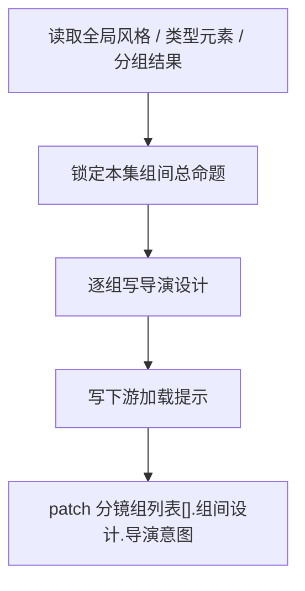

# 导演意图

## 概述

`导演意图` 是 `2-组间` 阶段按集承载、按分镜组展开的导演设计真源。

它负责把项目级的 `全局风格 + 类型元素` 收束到某一集中的各个分镜组，让后续 `3-明细` 能直接知道“这一组最该看见什么、观众该被怎样带进情绪、通过谁的眼睛进入、这一组为什么要这样被放大、适合借哪类参照桥段锚定场面机制，以及这些抽象意图要怎样翻译给摄影/美术/声音/表演/剪辑”。

若需要独立的 `主驱动 / 七步节奏蓝图 / 峰值账本 / 顺序授权` 裁决，则先进入上游 `1-规划/4-节奏`。

交付类型：`内容输出型`

本子技能已按最新内容输出型规范重构为“主合同 + references 模块细则”结构，不改变原有输出区块、路径与阶段边界。

## When to Use

- 需要为 `projects/<项目名>/编导/第N集.json` 中某一集的各个分镜组写导演意图字段 patch。
- `1-规划/3-分组/第N集.md` 已给出该集的组级容器，需要逐组收束导演理解。
- 用户要求“写每个分镜组该怎么被看见/每组该怎么放大/逐组导演意图怎么落”。

## When Not to Use

- 当前还没有项目级风格与类型协议，应先补 `全局风格` 与 `类型元素`。
- 当前任务只是项目整体风格与类型判断，不是逐组导演设计。
- 当前任务已经进入镜头脚本或正文扩写，应进入 `3-明细`。

## 阶段边界

### 本技能拥有

- 某一集的组间总命题
- 按分组组织的导演构思
- 分组级 `参照桥段锚点` 的选用边界
- 主题表达、组间观看规则、情绪推进与下游提示
- 把抽象导演判断翻译成部门级执行法则
- 给 `3-明细` 的逐组加载说明

### 本技能不拥有

- 项目级风格母体
- 项目级类型协议
- 具体镜头脚本与分镜页

## Visual Map

## Canonical Module References

| 模块 | 作用 | 真源文件 |
| --- | --- | --- |
| 思维链 | 承载字段主表、thought pass 与返工入口 | `references/chain-of-thought.md` |
| 执行流程 | 承载落点、workflow 与 council inheritance | `references/execution-flow.md` |
| 类型策略 | 承载 VSM 变量、情况、策略与回退 | `references/type-strategies.md` |
| 输出契约 | 承载固定区块、组级最小回答项与硬规则 | `.agents/skills/aigc/2-组间/references/output-template.md` |

## Execution Summary

- 本技能负责按集承载、按组展开的导演设计，不越权改写项目总纲或脚本正文
- canonical 主产物已收口为 `projects/<项目名>/编导/第N集.json` 中的 `分镜组列表[].组间设计.导演意图` 字段 patch
- 详细 workflow、落点与顾问团继承规则见 `references/execution-flow.md`

## Output Summary

- 输出固定区块仍为：`本集组间总命题 / 组间观看规则 / 分组导演设计 / 组间情绪推进 / 下游加载提示`
- 五个导演维度、组级最小回答项、部门翻译层与粒度边界统一继承父级 `.agents/skills/aigc/2-组间/references/output-template.md`，本技能不再定义本地 output-template 真源
- 若输出 JSON，统一继承 `.agents/skills/aigc/_shared/director_episode_output.schema.json`

## Strategy Summary

- 判定顺序仍为：`上游真源 -> 分组容器 -> 本集命题/视点 -> 五维度覆盖 -> 部门翻译 -> 下游交接`
- 变量登记、情况判定、策略映射与回退规则见 `references/type-strategies.md`

## Field System Summary

- 字段体系仍保持 `FIELD-DI-01` 到 `FIELD-DI-05`
- thought pass 与 pass table 见 `references/chain-of-thought.md`

## Root-Cause Execution Contract (Mandatory)

当出现以下症状时，必须先修合同：

- 导演意图写成项目口号或风格复读
- 各组构思高度同质化
- 没有分组容器却强行落笔
- 只有情绪形容词，没有部门可执行后果
- 粒度越权滑成镜头脚本或分镜表
- 下游脚本无法从中读取明确导演理解

必经链路：

`Symptom -> Direct Technical Cause -> Rule Source -> Meta Rule Source -> Fix Landing Points`

优先检查：

- `Rule Source`
  - `.agents/skills/aigc/2-组间/subtypes/导演意图/SKILL.md`
  - `.agents/skills/aigc/2-组间/subtypes/导演意图/CONTEXT.md`
- `Meta Rule Source`
  - `.agents/skills/aigc/2-组间/SKILL.md`
  - `.agents/skills/aigc/1-规划/subtypes/3-分组/SKILL.md`
  - 根 `AGENTS.md`

## Context Preload (Mandatory)

- 每次调用本技能时，必须自动加载同目录 `CONTEXT.md`。
- 每次调用本技能时，建议同时读取 `references/*.md` 以获取模块细则。
- 执行前默认联合读取：
  - 完整的 `projects/<项目名>/编导/第N集.json`
  - 其中已稳定的 `分镜组列表[].组间设计.全局风格 / 类型元素`
  - `1-规划/3-分组/第N集.md` 的对应集结果
