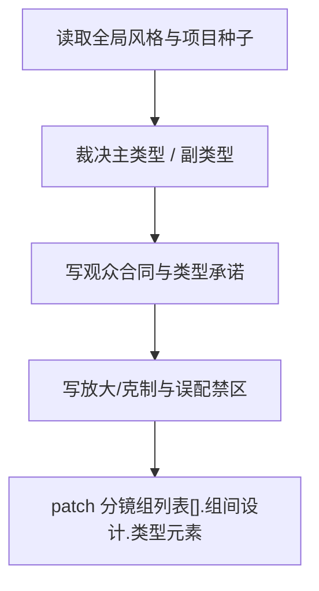

# 类型元素

## 概述

`类型元素` 是 `2-组间` 阶段的组间类型协议真源。

它负责把“这是什么片、观众应先得到什么感受、哪些类型元素在所有分镜组都必须成立、哪些元素只在特定分镜组应被放大、哪些表达必须克制、哪些错误寄生绝不能混进来”收束成一个稳定的类型 playbook。

交付类型：`内容输出型`

本子技能已按最新内容输出型规范重构为“主合同 + references 模块细则”结构，不改变原有输出区块、路径与阶段边界。

## When to Use

- 需要为 `projects/<项目名>/编导/第N集.json` 建立“全组一致 + 分组偏置”的类型字段 patch。
- 用户要求“先定这是什么类型片/类型元素怎么抓/风格不要跑偏”。
- `3-明细`、`导演意图` 缺少主副类型与类型化导演后果。

## When Not to Use

- 当前只需定义项目整体视听母体，应先进入 `全局风格`。
- 当前任务是逐分镜组导演设计，应进入 `导演意图`。
- 当前任务是单集节奏蓝图或重排裁决，应进入 `1-规划/4-节奏`。

## 阶段边界

### 本技能拥有

- 主副类型裁决
- 类型承诺与观众合同
- 类型元素的全组一致规则与分组偏置规则
- 错误寄生与题材污染防护
- 给下游阶段的类型指导

### 本技能不拥有

- 项目级风格母体
- 逐分镜组导演设计正文
- 单集节奏蓝图与重排裁决
- 正文脚本或镜头脚本

## Visual Map

## Canonical Module References

| 模块 | 作用 | 真源文件 |
| --- | --- | --- |
| 思维链 | 承载字段主表、thought pass 与返工入口 | `references/chain-of-thought.md` |
| 执行流程 | 承载落点、workflow 与 council inheritance | `references/execution-flow.md` |
| 类型策略 | 承载 VSM 变量、情况、策略与回退 | `references/type-strategies.md` |
| 输出契约 | 承载固定区块与硬规则 | `.agents/skills/aigc/2-组间/references/output-template.md` |

## Execution Summary

- 本技能负责组间类型协议，不越权代写逐组导演设计或正文
- canonical 主产物已收口为 `projects/<项目名>/编导/第N集.json` 中的 `分镜组列表[].组间设计.类型元素` 字段 patch
- 详细 workflow、落点与顾问团继承规则见 `references/execution-flow.md`

## Output Summary

- 输出固定区块仍为：`主副类型裁决 / 观众合同 / 类型承诺 / 放大与克制 / 误配禁区 / 下游阶段指导`
- 固定区块定义与硬规则统一继承父级 `.agents/skills/aigc/2-组间/references/output-template.md`，本技能不再定义本地 output-template 真源

## Strategy Summary

- 判定顺序仍为：`主副类型 -> 世界成立性 -> 误配禁区 -> 下游指导`
- 变量登记、情况判定、策略映射与回退规则见 `references/type-strategies.md`

## Field System Summary

- 字段体系仍保持 `FIELD-TE-01` 到 `FIELD-TE-06`
- thought pass 与 pass table 见 `references/chain-of-thought.md`

## Root-Cause Execution Contract (Mandatory)

当出现以下症状时，必须先修本技能合同：

- 只给类型标签，没有导演后果
- 混合题材平均分配，主从不清
- 世界与类型互相打架
- 下游根本拿不到类型指导

必经链路：

`Symptom -> Direct Technical Cause -> Rule Source -> Meta Rule Source -> Fix Landing Points`

优先检查：

- `Rule Source`
  - `.agents/skills/aigc/2-组间/subtypes/类型元素/SKILL.md`
  - `.agents/skills/aigc/2-组间/subtypes/类型元素/CONTEXT.md`
- `Meta Rule Source`
  - `.agents/skills/aigc/2-组间/SKILL.md`
  - `.agents/skills/aigc/SKILL.md`
  - 根 `AGENTS.md`

## Context Preload (Mandatory)

- 每次调用本技能时，必须自动加载同目录 `CONTEXT.md`。
- 每次调用本技能时，建议同时读取 `references/*.md` 以获取模块细则。
- 若 `全局风格` 已存在，应优先联合读取其主产物。
