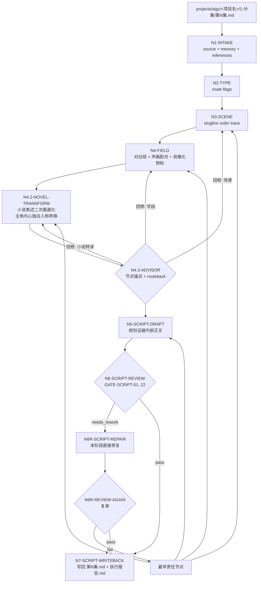
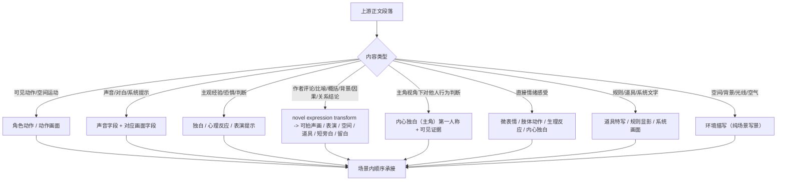

# aigc 2-编剧

`2-编剧` 负责把 `1-分集` 的逐集原文投影为影视剧本结构。它只做忠实剧本改编、场景标题解析、声画字段分流、对白冻结、小说表述二次画面化和环境字段纯化，不做导演创作内核提炼、高潮画面强化、视觉美学组织、表演工艺控制、演员控制或氛围意境深化。导演层职责归属 `3-导演`，表演层职责归属 `4-表演`。

## Context Loading Contract

- 每次调用 `$aigc-screenwriting` 时，必须同时加载同目录 `CONTEXT.md`。
- 每次调用本技能时，必须同时加载同目录 `CONTEXT.md`。
- 每次调用本技能时，必须同时识别并加载同目录 `types/` 中选中的类型包（单选或多选）。
- 若任务绑定 `projects/aigc/<项目名>/`，必须先加载项目根 `MEMORY.md`，再按需加载项目根 `CONTEXT/` 中与当前剧本改编相关的上下文；若历史项目仍使用 `CONTEXT/`，只读取与本轮相关的文件。
- 若本阶段执行顾问与复核流程（包含用户显式要求或仓库合同视为默认启用），必须读取 `projects/aigc/<项目名>/team.yaml` 与 `../_shared/team-advisor-consultation-contract.md`，优先解析 `roles.supervision.stage_profiles."2-编剧"` 作为编剧监制载入 profile，再按共享合同回退旧字段；主 agent 必须把顾问请教绑定到当前 workflow 节点、`Thought Pass Map`、review gate 和目标集上下文，要求顾问代入各自角色意识、创作风格与专业水准参与节点判断、执行取舍、证据补强和风险提示，并在 LLM 剧本投影前把可执行结论沉淀为 `advisor_consultation_packet` 作为后续任务上下文。
- 上游正文真源固定为 `projects/aigc/<项目名>/1-分集/第N集.md`，除非用户显式指定其他逐集正文文件。
- 冲突优先级：用户显式请求 > 根 `AGENTS.md` / meta 规则 > 本 `SKILL.md` > `references/` / `types/` / `review/` / `templates/` > `agents/openai.yaml` > 项目 `MEMORY.md` > 项目 `CONTEXT/` > 本 `CONTEXT.md`。
- 新的稳定失败模式或可复用打法先写入 `CONTEXT.md`；只有稳定为强制规则后再晋升到 `SKILL.md` 或对应分区。

## Multi-Subskill Continuous Workflow

当本主技能包被整体调用时，视为用户已授权按本级声明的同级子技能包、阶段分区或内部连续节点自动完成整个技能组任务；在满足本技能必要输入、显式选择和安全门后，不再为"是否继续下一步"额外确认。

- 无序号同级子技能包默认全选并发执行，由本主技能包汇总、裁决和写回唯一 canonical 输出。
- 数字序号子技能包或节点默认按数字升序串行执行，前一节点产物自动作为后一节点输入。
- 英文序号子技能包或路线默认按用户意图、父级路由或输入类型单选分流；只有用户明确要求对比、并跑或批量多路线时才多选。
- 卫星技能不自动并入编剧主链；只有父级路由或用户请求明确命中查询、恢复、复核、桥接等旁路职责时，才加载对应卫星 `SKILL.md + CONTEXT.md` 并把结果回接给本技能裁决。
- 连续调度不得绕过本技能的阻断门：缺少必需输入、上游正文不可读、破坏性覆盖未授权、子技能缺失或路线歧义会造成错误 canonical 写回时，必须先停下并给出最小澄清或不可用说明。
- 每个被调度的子技能包仍必须加载自身 `SKILL.md + CONTEXT.md`；脚本只能承担机械辅助，不得替代 LLM 剧本判断或父级最终裁决。

## Input Contract

Accepted input:

- 项目名、项目路径或单个 `projects/aigc/<项目名>/1-分集/第N集.md` 文件。
- 用户要求"编剧""剧本改编""把分集改成剧本""按集生成编剧稿""从 1-分集 到 2-编剧"等任务。
- 已完成或部分完成的 `1-分集` 输出；可按单集、集号范围或全量分集执行。

Required input:

- 可定位的上游逐集正文文件。
- 至少一个目标集号，或允许默认处理 `1-分集/` 中全部 `第N集.md`。

Optional input:

- 项目 `MEMORY.md` 中的长期偏好、禁区、风格要求。
- `CONTEXT/` 中的角色、世界观、类型和制作约束。
- 用户额外指定的字段、标题风格、下游分组解析要求。

Reject or clarify when:

- 上游文件不存在、不是可读文本，或 `【剧本正文】` 后没有可承接正文。
- 用户要求压缩、摘要、重排、删减剧情事实，且未明确这是非 canonical 候选稿。
- 用户要求对白润色、同义替换、语序调整；此类请求与对白冻结冲突，必须先确认是否放弃本技能 canonical 输出。
- 用户要求新增对白、新场景、新桥段、新规则、新因果强化或新事件结果；这属于 `C-authorized_adaptation`，不允许混入默认 canonical，必须另行授权并作为候选稿处理。
- 用户要求直接生成分镜组、摄影方案、镜头运动、景别选择或图像提示词；应分别转交下游 `3-导演`、`5-摄影`、`6-分组` 或 `8-图像` 等阶段。
- 用户要求导演级创作判断（戏剧问题提炼、高潮画面强化、视觉美学组织）或表演工艺控制（演员任务、微表情控制、场面调度）；应转交 `3-导演` 或 `4-表演`。

## Mode Selection

| mode | 触发信号 | 输出 |
| --- | --- | --- |
| `single_episode` | 指定单个 `第N集.md` 或单个集号 | `projects/aigc/<项目名>/2-编剧/第N集.md` |
| `episode_range` | 指定多个集号或范围 | 多个逐集编剧稿与更新后的执行报告 |
| `all_ready_episodes` | 未指定集号但 `1-分集/` 下有连续 `第N集.md` | 全部可读逐集编剧稿 |
| `repair` | 已有编剧稿存在字段缺失、声画错配、场景标题漂移、对白不保真、小说表述未转化或环境字段不纯 | 最小修复后的逐集编剧稿与问题报告 |
| `stage_end_review_repair` | 任一非 `review_only` 编剧任务完成候选稿后自动进入 | 阶段内 review -> 直接修复 -> 复审 -> canonical 写回 |
| `review_only` | 用户只要求检查 `2-编剧` 输出 | 审查报告，不改写正文，除非用户随后要求修复 |

## Reference Loading Guide

| 场景 | 必读文件 |
| --- | --- |
| 任意编剧任务 | `references/script-adaptation-contract.md` |
| 字段分流、声画配对、对白冻结、环境字段纯化 | `references/field-routing-and-audio-visual-contract.md` |
| 小说式表述、作者评论、主角视角判断、心理内视、比喻象征、抽象概括、往日常态句、背景说明和因果/关系结论的二次画面化 | `references/novel-to-screen-language-contract.md` |
| 信息差、观众知道/角色知道、悬念释放顺序 | `references/information-asymmetry-contract.md` |
| 场景时长体感、信息密度、beat 数量和转出方式 | `references/scene-rhythm-contract.md` |
| 关键对白的戏剧动作、潜台词和下游表演提示 | `references/dialogue-subtext-contract.md` |
| 观众心理模型 | `../_shared/audience-psychology-model-contract.md` |
| 好莱坞级编剧创作质量细则 | `references/hollywood-quality-spec.md` |
| 编剧创作阶段执行顾问与复核流程 | `../_shared/team-advisor-consultation-contract.md`，并按本 `Advisor Consultation Mechanism` 执行 |
| 判断输入类型与改编策略 | `types/source-to-script-type-map.md` |
| 验收、修复和 review gate | `review/review-contract.md`（创建后） |
| 输出样板 | `templates/output-template.md`、`templates/episode-script.template.md` |
| 脚本辅助边界与机械校验 | `scripts/README.md` |
| 可复用经验 | `knowledge-base/directing-heuristics.md` |
| 产品入口元数据 | `agents/openai.yaml` |

## Output Contract

### Required output

1. 逐集编剧稿固定写入 `projects/aigc/<项目名>/2-编剧/第N集.md`。
2. 阶段执行报告写入或更新 `projects/aigc/<项目名>/2-编剧/执行报告.md`。
3. 每个逐集编剧稿必须包含 frontmatter、`【剧本正文】`、场景标题和字段标签；正文必须完整承接上游原文信息量与顺序。
4. 对白逐字保真，字段标题固定为 `对白（真实角色名，语态/状态短语）`；独白、内心独白、旁白、音效必须显式带主体或来源，并使用中文双引号。
5. 同一集内完全相同 slugline 只在首次出现时打印场景标题，后续 beat 直接接正文。

### Output format

| output_id | format |
| --- | --- |
| `OUTPUT-SCREENWRITING-EPISODE` | Markdown 编剧稿 |
| `OUTPUT-SCREENWRITING-REPORT` | Markdown 执行报告 |

### Output path

| output_id | canonical path |
| --- | --- |
| `OUTPUT-SCREENWRITING-EPISODE` | `projects/aigc/<项目名>/2-编剧/第N集.md` |
| `OUTPUT-SCREENWRITING-REPORT` | `projects/aigc/<项目名>/2-编剧/执行报告.md` |

### Naming convention

- 逐集编剧稿命名为 `第N集.md`。
- 阶段报告命名为 `执行报告.md`。
- 不创建 `Episode N.md`、`第N集-编剧.md`、`script.md` 等平行真源。

### Completion gate

- 已读取本 `SKILL.md + CONTEXT.md`，并在项目任务中加载项目 `MEMORY.md` 与相关 `CONTEXT/`。
- 上游 `1-分集/第N集.md` 可回指，输出 frontmatter 记录 `source_episode_path`。
- 上游剧情事实、信息量与顺序完整承接，无摘要、删减、自由改写或因果重排。
- 对白逐字保真；字段标题使用 `对白（角色名，语态/状态短语）`，不得把 `原文角色`、`角色名`、`某人` 等占位词当作角色名；第二项要灵动、自然、鲜活地展示说话时的角色状态；引号内没有动作描写。
- 声画字段就近配对：`对白 -> 对白画面`、`独白/内心独白 -> 独白画面/内心独白画面`、`旁白 -> 旁白画面`、`音效 -> 音效画面`。
- 字段纯度：声音字段只写可听文本或声音本体，画面字段只写可见画面、表演、空间或承托；无混写。
- 场景标题满足阿拉伯数字编号 + 好莱坞标准 slugline，同一 slugline 不重复开新场景。
- 上游存在小说式作者评论、主角视角判断、心理内视、文学比喻、象征句、抽象概括、往日常态句、背景说明、因果解释、关系结论时，已执行 `novel_expression_transform_pass` 二次画面化；对白仍逐字冻结，不改写引号内对白。
- `内心独白（角色）` 的引号内默认采用该角色当下第一人称心声；从第三人称小说叙述转入时，凡指代独白主体自身的"他/她/其/角色名"必须改成"我/我的/自己"或更自然的当下口吻。`内心独白画面` 仍使用第三人称可拍画面描述。
- `角色动作` / `动作画面` 只写可拍摄身体动作或空间运动，不得出现"试图、想要、打算、意图"等主观预判或心理意图词。"感到恶心/难受/愤怒"等主观情绪必须转成 `表情特写`、可感知 `心理反应`、肢体动作、生理反应或主角内心独白。
- `表情特写` 是正式可选字段，用于关键面部表演 beat：只写眉、眼、眼睑、眨眼频率、鼻翼、嘴角、唇线、咬肌、下颌、喉头或皮肤状态等可见变化；必须有上游触发或当前声画压力，不写情绪标签、心理解释、机位、景别或镜头运动。
- `环境描写` 只写场景本身的可见写景材料，不承载人物动作、对白引出、剧情结果、心理解释或规则说明；同一 slugline 内环境可因剧情推进多次刷新。
- 终稿字段不得泄露内部任务说明、占位句或规则复述。
- 关键场景已形成 `information_asymmetry_map` 与 `scene_rhythm_profile`；关键对白已形成 `dialogue_subtext_map`。若某集不适用，执行报告必须说明 `not_applicable` 的上游依据。
- 已运行 `scripts/validate_script_projection.py` 或执行等价人工 review；若发现阻断项，已在本阶段内完成最小直接修复并复审通过，结果写入 `执行报告.md`。
- 执行报告包含 `novel_expression_transform_evidence`、`protagonist_inner_voice_evidence` 和 `objective_action_purity_evidence`。
- 执行报告包含 `information_asymmetry_map`、`scene_rhythm_profile` 和 `dialogue_subtext_map`，证明新增能力进入编剧层证据链。
- 关键场景必须有信息差标注。
- 关键场景必须有观众心理基线和冲突遗产标注，至少说明 `audience_knowledge_state`、`audience_psychology_seed` 与 `conflict_legacy_seed`；低信息过场可标注 `not_applicable` 并说明上游依据。
- 关键对白必须有潜台词戏剧动作标注。
- 每个场景必须有 scene_rhythm_profile。
- 独白/内心独白不超过总 beat 30%。

## Stage-End Review-Repair Contract

`2-编剧` 不另设独立"润色"阶段。每次生成或修复候选编剧稿后，必须在本阶段内部完成末段审计和直接修复闭环，只有复审通过的结果才允许写回 canonical `2-编剧/第N集.md`。

固定执行语义：

1. `N5-SCRIPT-DRAFT` 产物先视为 `candidate_script`，不是终稿。
2. `N6-SCRIPT-REVIEW` 按 `review/review-contract.md` 审计保真、对白冻结、声画配对、slugline、字段纯度、环境字段纯化、小说表述二次画面化、主角内心独白人称转换、动作客观性、主观情绪转译、LLM-first 边界、占位泄露、声音本体、具像化、环境氛围承托和小说表达转译。
3. 若 verdict 为 `needs_rework`，必须在本阶段直接执行 `N6R-SCRIPT-REPAIR`，只修字段投影、可拍性、声画承托、slugline、具像化、声音本体、环境纯度、环境氛围、小说表达转译、主角内心独白人称和格式证据；不得改写上游剧情事实、对白和事件顺序。
4. 修复后必须执行 `N6R-REVIEW-AGAIN`；复审仍失败时继续最小修复循环，或在源层冲突、输入缺失、权限不可用时输出不可用说明，不得把失败稿推进下游。
5. `review_only` 只产出审查报告，不自动修复；除此之外的生成、批量和 repair 模式都默认启用本闭环。
6. `执行报告.md` 必须记录本轮 review verdict、repair actions、复审结果、未修复风险和是否允许进入 `3-导演`。

## Advisor Consultation Mechanism

当 `2-编剧` 执行顾问与复核流程时，执行语义固定为"项目监制顾问团请教 -> 编剧参谋汇流 -> 上下文沉淀 -> 后续编剧任务消费"，而不是让顾问或复核结论直接主创或改写 canonical 编剧稿。

1. 主 agent 先读取项目 `team.yaml`，按 `../_shared/team-advisor-consultation-contract.md` 的 `Team Roster Resolution` 解析编剧阶段监制 roster；优先使用 `roles.supervision.stage_profiles."2-编剧".members / members_ref`，再按共享合同回退到通用 `roles.supervision.members`、旧 `roles.supervising.*`、旧 `roles.production.*`、`team_setup.shared_agents` 或 `roles.planning.members`，必要时才按 team 根索引动态补位并记录原因。
2. 该流程中的顾问作为编剧监制顾问运行：围绕当前集上游正文、项目 `MEMORY.md`、相关 `CONTEXT/`、类型策略、本文件 `Thought Pass Map` 中对应 `pass_id`、以及 `review/review-contract.md` 中相关 `gate_id`，代入各自角色意识、创作风格与专业水准进行参谋。
3. 顾问问题不得固定为预设字段清单；主 agent 必须从当前技能包本身的思维·执行节点派生问题，让顾问参与该节点的判断、动作、证据、route_out、gate 和失败回路设计。顾问可以提出节点级执行建议、风险提示、取舍理由或局部 patch，但不得绕过节点网络直接主创终稿。
4. 主 agent 负责裁决、去重和汇流，把顾问建议压缩成 `advisor_consultation_packet.must_do / must_not_do / inspiration_to_use / execution_brief`，并保留 `node_ref / pass_ref / gate_ref / role_lens` 等来源锚点，作为 LLM 剧本投影、阶段内修复和复审的额外上下文继续执行后续任务。
5. `advisor_consultation_packet` 不拥有上游逐集正文、对白冻结、场景顺序、字段合同或 canonical 写回权；顾问建议若与上游真源或本技能合同冲突，必须舍弃或降级为风险提示。
6. 若外部顾问与复核 provider 不可用，直接使用本地顾问与复核流程；不得把主 agent 本地顺序扮演写成外部 provider 已执行。

## Field Mapping

| field_id | 输出/证据 | 内容要求 | 失败码 |
| --- | --- | --- | --- |
| `FIELD-SCRIPT-01` | 输入取证 | source episode、项目记忆、CONTEXT、目标集号明确 | `FAIL-SCRIPT-01` |
| `FIELD-SCRIPT-02` | 场景标题 | `### 场景N：内景/外景 场所 - 日/夜`，同 slugline 同编号 | `FAIL-SCRIPT-02` |
| `FIELD-SCRIPT-03` | 文本保真 | 剧情事实、顺序、对白完整承接 | `FAIL-SCRIPT-03` |
| `FIELD-SCRIPT-04` | 声画配对 | 对白/独白/旁白/音效与对应画面字段就近成组 | `FAIL-SCRIPT-04` |
| `FIELD-SCRIPT-05` | 字段纯度 | 声音字段只写可听文本或声音本体，画面字段只写可见画面 | `FAIL-SCRIPT-05` |
| `FIELD-SCRIPT-06` | 场景画面 | 每个场景至少有一条正式剧本画面字段 | `FAIL-SCRIPT-06` |
| `FIELD-SCRIPT-07` | 输出落盘 | `2-编剧/第N集.md` 与 `执行报告.md` 可复查 | `FAIL-SCRIPT-07` |
| `FIELD-SCRIPT-08` | 对白冻结 | 对白逐字保真，标题格式正确，角色名非占位，语态灵动自然 | `FAIL-SCRIPT-08` |
| `FIELD-SCRIPT-09` | Team advisor consult | 执行顾问与复核流程时已按 `team.yaml` 请教项目监制顾问，并把基于当前节点的参谋指导沉淀为后续任务上下文；不可用时有本地 checklist 结果 | `FAIL-SCRIPT-09` |
| `FIELD-SCRIPT-10` | 阶段末闭环 | candidate 已审计、阻断项已直接修复并复审，执行报告记录 verdict 和 repair actions | `FAIL-SCRIPT-10` |
| `FIELD-SCRIPT-11` | 动作客观性 | `角色动作` / `动作画面` 只写可拍客观动作、神态、语气和生理反应；无主观意图词"试图/想要/打算/意图"；直接情绪感受已转成 `表情特写`、可感知反应、肢体动作、生理反应或主角内心独白 | `FAIL-SCRIPT-11` |
| `FIELD-SCRIPT-12` | 占位泄露 | 终稿无内部规则句、模板占位句或任务说明 | `FAIL-SCRIPT-12` |
| `FIELD-SCRIPT-13` | 声音本体 | 声音字段写声音本体而非事件说明、时间说明或叙述概括 | `FAIL-SCRIPT-13` |
| `FIELD-SCRIPT-14` | 具像化 | 画面字段回答"摄影机看见什么"，而非"观众理解什么"；无抽象概念、解释性因果或作者判断 | `FAIL-SCRIPT-14` |
| `FIELD-SCRIPT-15` | 环境纯度与氛围 | `环境描写` 只写场景写景材料；不承载人物动作、对白引出或心理解释；允许在关键场补自然景物氛围承托但不新增事件 | `FAIL-SCRIPT-15` |
| `FIELD-SCRIPT-16` | 创作证据 | 执行报告包含 `novel_expression_transform_evidence`、`protagonist_inner_voice_evidence` 和 `objective_action_purity_evidence`，证明小说转译、主角内心独白人称转换和动作客观性不是只停留在文档规则层 | `FAIL-SCRIPT-16` |
| `FIELD-SCRIPT-17` | 小说表述二次画面化 | 作者评论、主角视角判断、心理内视、比喻象征、抽象概括、往日常态句、背景说明、因果解释和关系结论已转成可拍声画、表演、空间、道具、群像、主角内心独白、短旁白或留白；对白仍逐字冻结；主角内心独白人称已从小说第三人称转成第一人称 | `FAIL-SCRIPT-17` |
| `FIELD-SCRIPT-18` | 表情特写 | 关键面部表演 beat 可落入 `表情特写`；该字段必须有上游触发或当前声画压力，只写具体面部可见变化，不写情绪标签、心理解释、机位、景别或镜头运动；普通非面部反应仍落 `心理反应`、`对白画面` 或 `角色动作` | `FAIL-SCRIPT-18` |
| `FIELD-SCRIPT-19` | 信息差设计 | 关键场景有 `information_asymmetry_map`：观众知道什么、角色知道什么、什么被隐藏、何时释放以及悬念机制明确 | `FAIL-INFORMATION-ASYMMETRY` |
| `FIELD-SCRIPT-20` | 场景节奏 | 关键场景有 `scene_rhythm_profile`：时长体感、信息密度、beat 数量、节奏类型和转出方式已裁决 | `FAIL-SCENE-RHYTHM` |
| `FIELD-SCRIPT-21` | 对白潜台词 | 关键对白有 `dialogue_subtext_map`，能说明表面话语背后的戏剧动作和对下游表演/摄影的承托 | `FAIL-DIALOGUE-SUBTEXT` |
| `FIELD-SCRIPT-22` | 观众心理基线 | 关键场景有 `audience_knowledge_state`、`audience_psychology_seed` 和 `conflict_legacy_seed`，能说明观众此刻知道什么、期待/害怕/渴望什么以及冲突如何继承给导演层 | `FAIL-AUDIENCE-PSYCHOLOGY` |

## Thought Pass Map

| step_id | pass_name | input | judgment | output |
| --- | --- | --- | --- | --- |
| `PASS-SCRIPT-01` | 输入取证 | `1-分集/第N集.md`、项目记忆、CONTEXT | 是否具备可承接逐集正文与目标集号 | `input_lock` |
| `PASS-SCRIPT-02` | 类型路由与场景解析 | 上游正文结构、场景线索、`types/source-to-script-type-map.md` | 改编类型画像是否成立，slugline、场景编号和场景顺序是否稳定 | `type_profile`、`scene_map` |
| `PASS-SCRIPT-03` | 字段分流 | 上游叙事句、对白、声音、动作 | 声音字段与画面字段是否可分离并就近配对 | `field_routing_plan` |
| `PASS-SCRIPT-04` | 小说表述二次画面化 | `field_routing_plan`、上游小说段落、对白锁 | 是否把作者评论、主角视角判断、心理内视、比喻象征、抽象概括、往日常态句、背景说明、因果解释和关系结论转成可拍声画、表演、空间、道具、群像、主角内心独白、短旁白或留白，且不改对白、不补无关前史；主角内心独白人称是否已转成第一人称 | `novel_expression_transform_evidence` / `protagonist_inner_voice_evidence` |
| `PASS-SCRIPT-05` | 动作客观性与表情落点审查 | `field_routing_plan`、`novel_expression_transform_evidence` | `角色动作` / `动作画面` 是否只写客观可拍文本；"试图/想要/打算/意图"等主观意图词是否已清除；直接情绪感受是否已按主落点转成 `表情特写`、微表情、肢体动作、生理反应或内心独白；关键面部 beat 是否有正式字段落点 | `objective_action_purity_evidence`、`facial_expression_anchor_evidence` |
| `PASS-SCRIPT-06` | 环境字段纯化 | `field_routing_plan`、上游正文 | `环境描写` 是否只含场景写景材料；是否混入人物动作、对白引出、剧情结果、心理解释或规则说明；关键场景是否有必要氛围承托 | `environment_purity_evidence` |
| `PASS-SCRIPT-07` | 剧本投影 | `field_routing_plan`、`novel_expression_transform_evidence`、`objective_action_purity_evidence`、`environment_purity_evidence` 与上游正文 | 是否完整承接事实、顺序、对白、小说表述二次画面化、动作客观性、环境纯度和字段纯度 | `episode_script` |
| `PASS-SCRIPT-08` | 验收回写 | 编剧稿、校验结果 | 是否满足保真、声画、场景、对白冻结、字段纯度、小说表达转译、动作客观性、环境纯度和输出门禁 | `review_result` |
| `PASS-SCRIPT-09` | 直接修复复审 | `review_result`、candidate 编剧稿、修复稿 | 阻断项是否已在本阶段最小修复并复审通过 | `review_repair_result` |
| `PASS-SCRIPT-10` | 信息差/节奏/潜台词 | 场景表、字段分流、对白锁、信息差/节奏/潜台词合同 | 关键场景是否完成信息差、场景节奏和对白戏剧动作设计，且未新增剧情事实或对白 | `information_asymmetry_map`、`scene_rhythm_profile`、`dialogue_subtext_map` |

## Pass Table

| pass_id | pass standard | fail code | Rework Entry |
| --- | --- | --- | --- |
| `PASS-SCRIPT-01` | 上游逐集正文、项目记忆和目标集号明确 | `FAIL-SCRIPT-01` | `Input Contract` |
| `PASS-SCRIPT-02` | 场景标题使用稳定编号和好莱坞 slugline | `FAIL-SCRIPT-02` | `references/script-adaptation-contract.md` |
| `PASS-SCRIPT-03` | 声画字段分流纯净且就近配对 | `FAIL-SCRIPT-04` | `references/field-routing-and-audio-visual-contract.md` |
| `PASS-SCRIPT-04` | 小说式作者评论、主角视角判断、心理内视、比喻象征、抽象概括、往日常态句、背景说明、因果解释和关系结论已二次画面化；对白没有被润色、拆改或新增；主角内心独白人称已从第三人称转成第一人称；没有无关过往、物品来历或回忆性补充 | `FAIL-SCRIPT-17` | `references/novel-to-screen-language-contract.md` |
| `PASS-SCRIPT-05` | `角色动作` / `动作画面` 只写客观可拍动作、神态、语气和生理反应；无"试图/想要/打算/意图"等主观意图词；直接情绪感受已转成 `表情特写`、可感知反应、肢体动作、生理反应或内心独白；关键面部 beat 不缺字段落点 | `FAIL-SCRIPT-11` / `FAIL-SCRIPT-18` | `references/field-routing-and-audio-visual-contract.md` |
| `PASS-SCRIPT-06` | `环境描写` 只含场景写景材料，不承载人物动作/对白引出/心理解释/规则说明；关键场景有氛围承托但不新增事件 | `FAIL-SCRIPT-15` | `references/field-routing-and-audio-visual-contract.md` |
| `PASS-SCRIPT-07` | 剧情事实、顺序和对白完整保真，字段纯度、小说表达转译、动作客观性和环境纯度均通过 | `FAIL-SCRIPT-03` | `references/script-adaptation-contract.md` |
| `PASS-SCRIPT-08` | 输出路径、执行报告、review gate 齐全 | `FAIL-SCRIPT-07` | `review/review-contract.md` |
| `PASS-SCRIPT-09` | review 阻断项已直接修复并复审；未通过时不写 canonical 终稿 | `FAIL-SCRIPT-10` | `Stage-End Review-Repair Contract` |
| `PASS-SCRIPT-10` | 信息差、观众心理基线、场景节奏、对白潜台词已形成可传递证据；内心独白/旁白没有挤占影视呈现 | `FAIL-INFORMATION-ASYMMETRY` / `FAIL-AUDIENCE-PSYCHOLOGY` / `FAIL-SCENE-RHYTHM` / `FAIL-DIALOGUE-SUBTEXT` | `references/information-asymmetry-contract.md` / `../_shared/audience-psychology-model-contract.md` / `references/scene-rhythm-contract.md` / `references/dialogue-subtext-contract.md` |

## Pass-to-Node Mapping Table

Pass 是思维/验收通过点，node 是执行节点；`N4.3-ADVISOR` 是条件顾问执行节点，不新增 `PASS-SCRIPT-*` 编号。执行顾问与复核流程时，它以当前活跃 pass 和最早责任节点为锚点汇流顾问意见。

| pass_id | node_id | pass_standard | evidence_consumed | output_evidence |
| --- | --- | --- | --- | --- |
| `PASS-SCRIPT-01` | `N1-INTAKE` | 上游逐集正文、项目记忆和目标集号明确 | 上游分集稿、项目 MEMORY.md、相关 CONTEXT/ | `source_episode_path`、`reference_load_manifest` |
| `PASS-SCRIPT-02` | `N2-TYPE` / `N3-SCENE` | 类型画像与场景标题同时稳定；类型策略不改变保真，slugline 不漂移 | `types/source-to-script-type-map.md`、上游正文结构、场景线索、`references/script-adaptation-contract.md` | `type_profile`、`route_flags`、`scene_slugline_table`、`scene_order_trace` |
| `PASS-SCRIPT-03` | `N4-FIELD` | 声画字段分流纯净且就近配对 | 上游段落、场景表、`references/field-routing-and-audio-visual-contract.md` | `field_projection_map`、`dialogue_lock_map`、`audio_visual_pairing_map` |
| `PASS-SCRIPT-04` | `N4.2-NOVEL-TRANSFORM` | 小说式表述已二次画面化；主角内心独白人称已转成第一人称 | `field_projection_map`、上游段落、`references/novel-to-screen-language-contract.md` | `novel_expression_transform_evidence`、`protagonist_inner_voice_evidence` |
| `PASS-SCRIPT-05` | `N4-FIELD` / `N4.2-NOVEL-TRANSFORM` | 动作字段客观可拍；无主观意图词；直接情绪感受已转成可感知反应；关键面部 beat 已落 `表情特写` 或有明确相邻字段承托 | `field_projection_map`、`novel_expression_transform_evidence`、动作字段和 `表情特写` 抽查 | `objective_action_purity_evidence`、`facial_expression_anchor_evidence` |
| `PASS-SCRIPT-06` | `N4-FIELD` | 环境字段纯净，必要环境刷新与氛围承托不新增事件 | 上游段落、场景表、环境字段抽查 | `environment_purity_evidence`、`environment_refresh_map` |
| `PASS-SCRIPT-07` | `N5-SCRIPT-DRAFT` | 剧情事实、顺序和对白完整保真，字段纯度、小说表达转译、动作客观性和环境纯度均通过 | 所有上游证据、`advisor_consultation_packet`（如有） | `第N集.md` 草稿、`faithful_projection_trace` |
| `PASS-SCRIPT-08` | `N6-SCRIPT-REVIEW` | 输出路径、执行报告、review gate 齐全 | candidate 草稿、上游正文、`review/review-contract.md`、`thinking_action_node_ledger` | `review_result`、`gate_to_node_repair_map` |
| `PASS-SCRIPT-09` | `N6R-SCRIPT-REPAIR` / `N6R-REVIEW-AGAIN` / `N7-SCRIPT-WRITEBACK` | review 阻断项已直接修复并复审；未通过时不写 canonical 终稿 | `review_result`、candidate 草稿、修复稿、repair actions | `review_repair_result`、`2-编剧/第N集.md`、`执行报告.md` |
| `PASS-SCRIPT-10` | `N3-SCENE` / `N4-FIELD` / `N4.2-NOVEL-TRANSFORM` / `N6-SCRIPT-REVIEW` | 关键信息释放、观众心理基线、冲突遗产、场景节奏和对白戏剧动作已在编剧层锁定 | `information-asymmetry-contract.md`、`../_shared/audience-psychology-model-contract.md`、`scene-rhythm-contract.md`、`dialogue-subtext-contract.md` | `information_asymmetry_map`、`audience_knowledge_state`、`audience_psychology_seed`、`conflict_legacy_seed`、`scene_rhythm_profile`、`dialogue_subtext_map` |

## GATE-SCRIPT Definitions

共 22 道 review gate，编号 `GATE-SCRIPT-01` 至 `GATE-SCRIPT-22`：

| gate_id | gate_name | 校验内容 |
| --- | --- | --- |
| `GATE-SCRIPT-01` | 输出路径 | 编剧稿写入 `2-编剧/第N集.md`，执行报告写入 `2-编剧/执行报告.md` |
| `GATE-SCRIPT-02` | Frontmatter | 包含 `项目名`、`集数`、`stage`、`source_episode_path`、`output_path`、`adaptation_mode`、`dialogue_lock`、`audio_visual_pairing`、`slugline_policy` |
| `GATE-SCRIPT-03` | Faithfulness | 上游剧情事实、顺序和信息量完整承接，无摘要、删减或因果重排 |
| `GATE-SCRIPT-04` | Dialogue lock | 对白逐字保真，标题格式 `对白（角色名，语态/状态短语）`，角色名非占位，语态灵动自然，引号内无动作 |
| `GATE-SCRIPT-05` | AV pairing | 声音字段与对应画面字段就近配对 |
| `GATE-SCRIPT-06` | Scene visuals | 每个场景至少有一条正式剧本画面字段 |
| `GATE-SCRIPT-07` | Slugline | 阿拉伯数字编号 + 好莱坞标准 slugline，同一 slugline 不重复开新场景 |
| `GATE-SCRIPT-08` | Action purity | `角色动作` / `动作画面` 只写客观可拍文本，无主观意图词 |
| `GATE-SCRIPT-09` | LLM-first | 核心剧本化改编由 LLM 直接完成，脚本只做机械辅助 |
| `GATE-SCRIPT-10` | Concrete visuals | 画面字段回答"摄影机看见什么"，无抽象概念、解释性因果或作者判断 |
| `GATE-SCRIPT-11` | Sound literal | 声音字段写声音本体，非事件说明或叙述概括 |
| `GATE-SCRIPT-12` | Placeholder leak | 终稿无内部规则句、模板占位句或任务说明 |
| `GATE-SCRIPT-13` | Environment purity | `环境描写` 只含场景写景材料，不承载人物动作、对白引出、心理解释或规则说明 |
| `GATE-SCRIPT-14` | Atmospheric environment | 关键场景的 `环境描写` 有自然景物氛围承托，且承托不新增事件、线索或因果 |
| `GATE-SCRIPT-15` | Novel-to-screen language | 作者评论、主角视角判断、心理内视、比喻象征、抽象概括、往日常态句、背景说明、因果解释和关系结论已二次画面化；对白未被改写；主角内心独白人称已转成第一人称 |
| `GATE-SCRIPT-16` | Protagonist inner voice | 主角视角下对他人行为的判断已进入 `内心独白（主角）` 而非客观第三方概括；主角自指已从小说第三人称转成第一人称 |
| `GATE-SCRIPT-17` | Objective action purity | `角色动作` / `动作画面` 不含"试图/想要/打算/意图"等主观预判；直接情绪感受已转成 `表情特写`、微表情、肢体动作、生理反应或主角内心独白 |
| `GATE-SCRIPT-18` | Facial expression close-up | `表情特写` 作为正式可选字段存在；若使用，必须只写具体面部变化并有触发来源，不写情绪标签、心理解释、机位、景别或镜头运动；若上游关键情绪明显集中在面部变化，不能只散落为无字段的泛化表情词 |
| `GATE-SCRIPT-19` | Information asymmetry | 关键场景已形成 `information_asymmetry_map`，能说明观众/角色/隐藏信息的状态、揭示与保留点、悬念机制和下游导演消费口径 |
| `GATE-SCRIPT-20` | Scene rhythm | 关键场景已形成 `scene_rhythm_profile`，能说明时长体感、信息密度、beat 数量、节奏类型、留白和转出方式 |
| `GATE-SCRIPT-21` | Dialogue subtext | 关键对白已形成 `dialogue_subtext_map`，语气/状态之外还有戏剧动作；内心独白、旁白或解释性心理文字不过度挤占影视显示 |
| `GATE-SCRIPT-22` | Audience psychology baseline | 关键场景已形成 `audience_knowledge_state`、`audience_psychology_seed` 与 `conflict_legacy_seed`，能被 `3-导演` 继续扩展为 `audience_psychology_map` 与 `conflict_legacy_transfer`；小说转译没有提前泄露观众应未知信息 |

## Root-Cause Execution Contract (Mandatory)

出现以下问题时，必须先修源层合同或输出边界，而不是补临时说明：

- 对白被润色、改写、删减或换序。
- 用摘要替代完整剧情承接。
- 将小说作者评论、主角视角判断、心理内视、文学比喻、抽象概括、往日常态句、背景说明、因果解释或关系结论原样塞进画面字段，或把这些叙述改写成新增对白。
- `动作画面` / `角色动作` 混入心理解释、章节名、抽象判断，或出现"试图、想要、打算、意图"等主观预判/心理意图词。
- 主角视角下对他人行为的判断被写成客观第三方概括，而不是主角内心独白。
- `内心独白（主角）` 承接第三人称小说叙述时仍以"他/她/其/角色名"指代主角自身。
- "感到恶心/难受/愤怒"等主观情绪感受被直接写入终稿，而不是按主落点转成 `表情特写`、可感知 `心理反应`、肢体动作、生理反应或主角内心独白。
- 关键面部表演 beat 没有 `表情特写` 或相邻字段承托，或 `表情特写` 退化成"悲伤/愤怒/复杂"等情绪标签、心理解释、摄影机位、景别或镜头运动。
- `环境描写` 混入人物动作、对白引出、剧情结果、心理解释或规则说明。
- `环境描写` 在关键情绪场、压迫场、离别场或类型氛围场只写地点点缀，没有自然景物氛围承托；或新增自然景物后造成新事件、线索、阻碍、因果或结果。
- 画面字段写抽象概念、解释性因果、作者判断或心理感受。
- 声音字段与画面字段混写，或没有就近配对。
- 同一 slugline 因叙事 beat 变化反复开新场景。
- 声音字段写事件说明、时间说明或叙述概括，而非声音本体。
- 内部任务说明或规则复述泄露到终稿字段正文。
- 为补足剧本质感新增与当前主线无关的人物过往背景、物品来历或回忆性信息。
- 脚本生成或模板拼接替代 LLM 的核心剧本化创作判断。
- 输出写到旧合并阶段目录或其他平行目录，绕过 `projects/aigc/<项目名>/2-编剧/第N集.md`。
- 执行顾问与复核流程时跳过 `team.yaml` 监制顾问请教、把顾问问题固定成脱离当前节点的题型清单、没有把节点级参谋指导沉淀为后续上下文，或把主 agent 本地模拟顾问说成外部 provider 调度。
- review 发现阻断项后未在本阶段直接修复和复审，却把候选稿写成终稿或推进下游。

必经链路：`Symptom -> Direct Cause -> Skill Contract Source -> AGENTS.md LLM-first / Skill 2.0 Rule`。

## Visual Maps

## Execution Rules

- 核心剧本化改编必须由 LLM 直接完成；脚本只允许读取、统计、格式检查、字段覆盖和声画配对校验。
- `2-编剧` 是 `1-分集` 的影视剧本结构投影，不得压缩、摘要、删减剧情事实或自由改写剧情因果。
- 除新增 frontmatter、`【剧本正文】`、场景标题与字段标签外，必须完整承接上游原文信息量和顺序。
- `2-编剧` 不负责导演创作内核（戏剧问题、人物压力、观众位置、可拍执行策略）、高潮画面强化、视觉美学组织、画面主轴建立、终结画面尾钩、表演工艺控制（演员任务、微表情控制、场面调度深化）或氛围意境深化（五感框架、意境技法）。这些分别归属 `3-导演` 和 `4-表演`。
- 字段细则、声画配对、对白冻结和 slugline 稳定规则以 `references/field-routing-and-audio-visual-contract.md` 为准。
- 小说表述二次画面化以 `references/novel-to-screen-language-contract.md` 为准；作者评论、心理内视、比喻象征、概括叙述、背景说明、因果解释和关系结论必须先判叙事功能再转成可拍声画、表演、空间、道具、群像、短旁白或留白，且不得改写引号内对白。
- 好莱坞级质量目标以 `references/hollywood-quality-spec.md` 为准，但质量提升不得凌驾于事实保真和对白冻结之上。
- 当执行顾问与复核流程时，先按共享团队顾问合同解析 `team.yaml.roles.supervision.stage_profiles."2-编剧"` 或共享回退路径，再把当前节点、`Thought Pass Map` 的 pass、相关 review gate 和目标集上下文转化为顾问任务；顾问必须代入角色意识、创作风格和专业水准参与节点判断、执行取舍、证据补强与风险提示，主 agent 只吸收可执行指导和风险提示，综合为带节点锚点的 `advisor_consultation_packet` 后沉淀进后续 LLM 剧本投影、阶段内修复和复审上下文。
- 顾问意见不得替代上游逐集正文、对白冻结、场景顺序或编剧主真源；若外部顾问与复核 provider 不可用，直接使用本地顾问与复核流程。
- 候选稿不得跳过阶段末 review-repair 闭环直接成为终稿；review 发现阻断项时，必须在本阶段直接最小修复并复审，或明确阻断源层。
- `角色动作` / `动作画面` 只写镜头可实拍的客观动作、神态、语气、生理反应和空间运动；不得写"试图、想要、打算、意图"等主观预判或心理意图。
- `心理反应` 不是内心解释字段，只写观众可通过画面、声音或演员表演接收到的反应。
- `环境描写` 只承载场景本身的写景画面，服务美术、置景、情绪烘托和场景进入感，不承载剧情推进、人物动作或心理解释；同一 slugline 内可因环境焦点变化多次出现。
- 任何字段都不得输出任务说明、占位说明或规则复述。

## Script And Metadata Contract

| path | role |
| --- | --- |
| `scripts/README.md` | 说明脚本只做机械辅助，不替代 LLM 剧本创作判断 |
| `scripts/validate_script_projection.py` | 对输出执行字段、场景标题、声画配对和基础保真标记校验 |
| `agents/openai.yaml` | 提供产品侧入口元数据，默认提示必须显式提到 `$aigc-screenwriting` |
