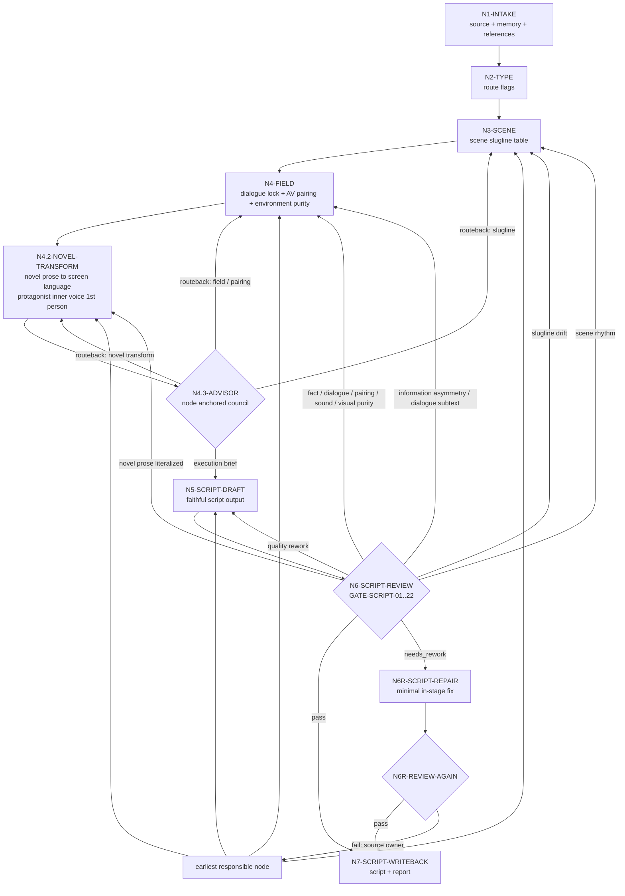
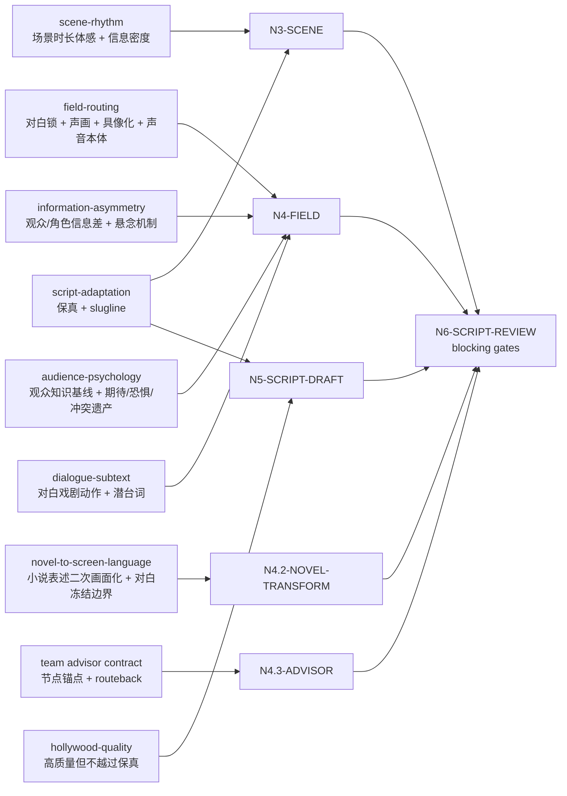

# Directing Workflow

## Business Requirement Analysis

| slot | value |
| --- | --- |
| `business_goal` | 将逐集小说原文投影为忠实、可拍、可分组的编剧稿 |
| `business_object` | `projects/aigc/<项目名>/1-分集/第N集.md` |
| `constraint_profile` | 原文信息量保真、对白冻结、声画配对、slugline 稳定、小说表述二次画面化、主角内心独白保留、动作客观可拍、关键面部 beat 有 `表情特写` 或相邻字段承托、环境字段纯化、环境氛围承托、LLM-first、顾问与复核流程 监制顾问上下文沉淀 |
| `success_criteria` | 输出能完整承接上游，且把小说原文中已有事件、关系、心理、信息差和高点转成编剧层面可拍、可分组、可执行的剧本正文 |
| `non_goals` | 不做导演创作内核提炼、不做高潮画面强化、不做视觉美学组织、不做表演工艺控制、不做演员控制、不做氛围意境深化、不重写剧情 |
| `complexity_source` | 场景解析、字段分流、声画配对、对白冻结、小说表述二次画面化、主角内心独白人称转换、动作客观性、环境纯度、环境氛围承托、保真与质量的优先级协调 |
| `topology_fit` | 串行主干 + 类型分支 + 顾问与复核流程的顾问分支 + review 回路 |

## Reference-To-Node Coverage

| reference | consumed_by | node evidence | blocking gate |
| --- | --- | --- | --- |
| `references/script-adaptation-contract.md` | `N1-INTAKE` / `N3-SCENE` / `N5-SCRIPT-DRAFT` / `N6-SCRIPT-REVIEW` | `source_episode_path`、`scene_slugline_table`、`faithful_projection_trace`、frontmatter | `FAIL-SOURCE` / `FAIL-FAITHFULNESS` / `FAIL-SLUGLINE` |
| `references/field-routing-and-audio-visual-contract.md` | `N4-FIELD` / `N5-SCRIPT-DRAFT` / `N6-SCRIPT-REVIEW` | `dialogue_lock_map`、`audio_visual_pairing_map`、`concrete_visual_risk_map`、`objective_action_purity_map`、`facial_expression_anchor_map`、`sound_literal_risk_map`、`environment_purity_map`、`environment_refresh_map`、`placeholder_leak_risk_map` | `FAIL-DIALOGUE` / `FAIL-PAIRING` / `FAIL-ACTION-PURITY` / `FAIL-FACIAL-EXPRESSION-FIELD` / `FAIL-CONCRETE-VISUAL` / `FAIL-SOUND-LITERAL` / `FAIL-PLACEHOLDER-LEAK` / `FAIL-ENVIRONMENT-PURITY` |
| `references/novel-to-screen-language-contract.md` | `N4.2-NOVEL-TRANSFORM` / `N5-SCRIPT-DRAFT` / `N6-SCRIPT-REVIEW` | `novel_expression_transform_evidence`、`expression_type_map`、`screen_strategy_map`、`protagonist_pov_judgment_map`、`habitual_summary_risk_map`、`backstory_expansion_risk_map`、`literal_prose_risk_map` | `FAIL-NOVEL-TO-SCREEN-LANGUAGE` / `FAIL-DIALOGUE` |
| `references/information-asymmetry-contract.md` | `N4-FIELD` / `N5-SCRIPT-DRAFT` / `N6-SCRIPT-REVIEW` | `information_asymmetry_map`、`audience_pov_alignment`、`suspense_mechanism` | `FAIL-INFORMATION-ASYMMETRY` |
| `references/scene-rhythm-contract.md` | `N3-SCENE` / `N5-SCRIPT-DRAFT` / `N6-SCRIPT-REVIEW` | `scene_rhythm_profile`、`scene_duration_feel`、`information_density`、`transition_out_method` | `FAIL-SCENE-RHYTHM` |
| `references/dialogue-subtext-contract.md` | `N4-FIELD` / `N5-SCRIPT-DRAFT` / `N6-SCRIPT-REVIEW` | `dialogue_subtext_map`、`dramatic_action_tags`、`subtext_behavior_hint` | `FAIL-DIALOGUE-SUBTEXT` |
| `../_shared/audience-psychology-model-contract.md` | `N4-FIELD` / `N4.2-NOVEL-TRANSFORM` / `N6-SCRIPT-REVIEW` | `audience_knowledge_state`、`audience_psychology_seed`、`conflict_legacy_seed` | `GATE-SCRIPT-22` |
| `references/hollywood-quality-spec.md` | `N5-SCRIPT-DRAFT` / `N6-SCRIPT-REVIEW` | `hollywood_quality_notes`、`quality_rework_targets` | `hollywood_quality: needs_rework` |
| `../_shared/team-advisor-consultation-contract.md` | `N4.3-ADVISOR` / `N6-SCRIPT-REVIEW` | `advisor_consultation_packet`、`advisor_routeback_targets`、`local_checklist` | `FAIL-ADVISOR-CONSULT` |

## Thinking-Action Node Contract

`steps/directing-workflow.md` 中的节点不是普通 checklist。每次执行 `2-编剧` 时，主 agent 必须把每个实际经过的节点记录为 `thinking_action_node_ledger`，并让 review 能反查"判断、动作、证据、路由、gate"是否同时发生。

节点最小字段固定如下：

| field | requirement |
| --- | --- |
| `node_id` | 稳定节点 ID，必须能回指下方 `Thinking-Action Nodes` 表 |
| `judgment_question` | 当前节点必须先判断什么，不能只写"执行某 pass" |
| `decision` | 本轮判断结果；可为 `pass / needs_rework / blocked / routeback / not_applicable` |
| `actions_taken` | 实际执行动作，必须说明投影、取舍、删除、补证、分流或回修动作 |
| `evidence_keys` | 本节点产出的证据字段或文件锚点 |
| `route_out` | 下一节点、回修节点或阻断出口 |
| `gate_status` | 本节点 gate 是否通过；失败时写 `fail_code` 和最早责任节点 |
| `source_owner` | 失败或降级时对应的合同 owner，例如 `field-routing`、`novel-to-screen-language`、`review` |

节点退化判定：

- 只有动作描述、没有 `judgment_question`，视为 checklist 退化。
- 只有"已优化/已增强/已影视化"等结论、没有 `evidence_keys`，视为证据退化。
- 只有 `route_out` 到下一步、没有失败回路，视为路由退化。
- 只在报告里列节点名、终稿正文没有对应字段内嵌，视为投影退化。
- 新增 reference、gate 或 evidence 时，必须同步更新本文件的 `Reference-To-Node Coverage`、`Thinking-Action Nodes`、`Failure Loops` 和 Mermaid。

报告中的最小形态：

```yaml
thinking_action_node_ledger:
  - node_id: "N4.2-NOVEL-TRANSFORM"
    judgment_question: "上游段落中作者评论、主角视角判断、心理内视、比喻象征、抽象概括等小说式表述是否已识别并锁定 source_function 与 screen_strategy？"
    decision: "pass | needs_rework | blocked | routeback | not_applicable"
    actions_taken:
      - "将作者评论转成画面、声音、表演、空间、道具、群像、主角内心独白、短旁白或留白"
    evidence_keys:
      - "novel_expression_transform_evidence"
      - "expression_type_map"
    route_out: "N5-SCRIPT-DRAFT"
    gate_status:
      passed: true
      fail_code: ""
    source_owner: "references/novel-to-screen-language-contract.md"
```

## Learning Integration Review Closure

本 workflow 作为 `2-编剧` 的纯编剧层，不包含导演级或表演级学习型合同。若上游合同（如 `novel-to-screen-language-contract.md`）在本轮有显著修改，必须在执行报告中说明静态接入点、真实样例或等价 smoke 检查、未覆盖风险和下一次生产运行的观察点。

- `N6-SCRIPT-REVIEW` 必须检查 `thinking_action_node_ledger` 是否覆盖本轮经过的关键节点，尤其是 `N4-FIELD`、`N4.2-NOVEL-TRANSFORM`、`N5-SCRIPT-DRAFT` 和 `N7-SCRIPT-WRITEBACK`。
- 若新增或显著修改了学习型合同，必须在本轮执行报告中加入 `learning_integration_review_evidence`。
- 若本轮没有真实项目剧集可运行，允许在 `learning_integration_review_evidence.status` 标注 `static_only`，但不得把它写成 fully verified。

## PASS-SCRIPT Definitions

Pass 是思维/验收通过点，node 是执行节点；`N4.3-ADVISOR` 是条件顾问节点，不单独占用 `PASS-SCRIPT-*` 编号。执行顾问与复核流程时，顾问节点必须绑定当前活跃 pass、对应 node 和 review gate。

| pass_id | owner node | judgment | required evidence | fail route |
| --- | --- | --- | --- | --- |
| `PASS-SCRIPT-01` | `N1-INTAKE` | 上游逐集正文、项目记忆、目标集号和加载边界是否锁定 | `source_episode_path`、`reference_load_manifest` | `N1-INTAKE` |
| `PASS-SCRIPT-02` | `N2-TYPE` / `N3-SCENE` | 类型画像是否服务保真改编，slugline 和场景顺序是否稳定 | `type_profile`、`route_flags`、`scene_slugline_table`、`scene_order_trace` | `N2-TYPE` / `N3-SCENE` |
| `PASS-SCRIPT-03` | `N4-FIELD` | 字段分流、对白冻结、声画配对和具像化预检是否成立 | `field_projection_map`、`dialogue_lock_map`、`audio_visual_pairing_map`、`concrete_visual_risk_map` | `N4-FIELD` |
| `PASS-SCRIPT-04` | `N4.2-NOVEL-TRANSFORM` | 小说式表述是否完成二次画面化，主角内心独白是否第一人称化 | `novel_expression_transform_evidence`、`expression_type_map`、`protagonist_pov_judgment_map` | `N4.2-NOVEL-TRANSFORM` |
| `PASS-SCRIPT-05` | `N4-FIELD` / `N4.2-NOVEL-TRANSFORM` | 动作字段是否客观可拍，主观意图词和直接情绪词是否已转译；关键面部 beat 是否落入 `表情特写` 或有相邻字段承托 | `objective_action_purity_map`、`objective_action_purity_evidence`、`facial_expression_anchor_map`、`facial_expression_anchor_evidence` | `N4-FIELD` |
| `PASS-SCRIPT-06` | `N4-FIELD` | `环境描写` 是否只承载场景写景材料，必要环境刷新是否就近落入正文 | `environment_purity_map`、`environment_refresh_map`、`environment_purity_evidence` | `N4-FIELD` |
| `PASS-SCRIPT-07` | `N5-SCRIPT-DRAFT` | LLM 剧本投影是否保真、冻结对白并内嵌全部前序证据 | `faithful_projection_trace`、candidate `第N集.md` | `N5-SCRIPT-DRAFT` |
| `PASS-SCRIPT-08` | `N6-SCRIPT-REVIEW` | review gate、节点 ledger 和输出路径是否完整 | `review_result`、`thinking_action_node_ledger`、`gate_to_node_repair_map` | `N6-SCRIPT-REVIEW` |
| `PASS-SCRIPT-09` | `N6R-SCRIPT-REPAIR` / `N6R-REVIEW-AGAIN` / `N7-SCRIPT-WRITEBACK` | 阻断项是否已最小修复并复审通过，canonical 写回是否安全 | `repair actions`、`re-review verdict`、final path | `N6R-SCRIPT-REPAIR` 或最早责任节点 |
| `PASS-SCRIPT-10` | `N3-SCENE` / `N4-FIELD` / `N6-SCRIPT-REVIEW` | 信息差、观众心理基线、场景节奏和对白潜台词是否在编剧层形成可传递证据，而非留给导演/表演凭空补 | `information_asymmetry_map`、`audience_knowledge_state`、`audience_psychology_seed`、`conflict_legacy_seed`、`scene_rhythm_profile`、`dialogue_subtext_map` | `N3-SCENE` / `N4-FIELD` |

## Thinking-Action Nodes

| node_id | objective | inputs | actions | evidence | route_out | gate |
| --- | --- | --- | --- | --- | --- | --- |
| `N1-INTAKE` | 锁定项目、集号、上游正文真源和本轮加载边界 | 用户请求、项目根、`1-分集/` | 定位目标集，读取 `SKILL.md + CONTEXT.md`、项目 `MEMORY.md`、相关 `CONTEXT/`，建立本轮 reference load manifest | `source_episode_path`、目标输出路径、`reference_load_manifest` | `N2-TYPE` | 上游文件可读，加载边界不缺失 |
| `N2-TYPE` | 形成 `type_profile` 与节点策略开关 | 上游正文结构、`types/source-to-script-type-map.md` | 判断显式场景/纯小说/系统密集/对白密集/内压密集/单地点多 beat/高点密集等类型，并标记必须增强的 pass | `type_profile`、`route_flags` | `N3-SCENE` | 改编策略不违背保真，类型策略不会变成剧情重写 |
| `N3-SCENE` | 解析并稳定场景 slugline | 上游段落、type_profile、`references/script-adaptation-contract.md`、`references/scene-rhythm-contract.md` | 按真实地点/空间范围和日夜建立场景表；同 slugline 去重；只因真实空间/时间变化开新场景；为每个场景建立 `scene_rhythm_profile`，裁决时长体感、信息密度、beat 数量和转出方式 | `scene_slugline_table`、`scene_order_trace`、`scene_rhythm_profile` | `N4-FIELD` | 每个场景标题符合 slugline 规则，且场景顺序可回指上游；关键场景有节奏画像，不把场景密度和留白全部推给导演 |
| `N4-FIELD` | 字段分流、对白冻结、声画配对、信息差与具像化预检 | 上游段落、场景表、`references/field-routing-and-audio-visual-contract.md`、`references/information-asymmetry-contract.md`、`references/dialogue-subtext-contract.md`、`../_shared/audience-psychology-model-contract.md` | 逐段投影为声音字段、画面字段、动作、心理、系统、规则、道具、群像等；建立对白原文清单；对每个声音字段绑定对应画面字段；单独判定 `环境描写` 是否只写场景写景材料；为关键面部表演 beat 标记 `表情特写` 或相邻字段承托；标记同一 slugline 内空间/背景/光线/空气/材质焦点变化是否需要环境刷新；为关键场景建立观众/角色信息状态、揭示/保留内容、悬念机制、观众知识基线、期待/恐惧/渴望种子和冲突继承状态；为关键对白标记戏剧动作（试探、回避、施压、示弱、结盟等）；建立 `dialogue_subtext_map`；建立 `information_asymmetry_map`；标记动作字段中主观意图词、抽象画面、声音说明和模板/规则占位泄露风险 | `field_projection_map`、`dialogue_lock_map`、`audio_visual_pairing_map`、`information_asymmetry_map`、`audience_knowledge_state`、`audience_psychology_seed`、`conflict_legacy_seed`、`dialogue_subtext_map`、`concrete_visual_risk_map`、`objective_action_purity_map`、`facial_expression_anchor_map`、`sound_literal_risk_map`、`environment_purity_map`、`environment_refresh_map`、`placeholder_leak_risk_map` | `N4.2-NOVEL-TRANSFORM` | 字段纯度、对白冻结、声画配对、信息差标注、观众心理基线、对白戏剧动作、顺序承接、环境纯度、表情特写落点、动作客观可拍和反抽象预检成立；同一场景内环境刷新不被误删；无内部任务说明进入正文 |
| `N4.2-NOVEL-TRANSFORM` | 小说表述二次画面化 | `field_projection_map`、`audience_knowledge_state`、`audience_psychology_seed`、上游段落、场景表、`dialogue_lock_map`、`references/novel-to-screen-language-contract.md`、`../_shared/audience-psychology-model-contract.md` | 识别作者评论、主角视角判断、心理内视、直接情绪感受、比喻象征、抽象概括、体现重复/熟悉/往日常态的总结句、背景说明、因果解释、关系结论、感官散文、回忆/认知补叙和规则说明；为每条高风险表述锁定 `source_function` 与 `screen_strategy`，转为画面、声音、表演、空间、道具、群像、主角内心独白、短旁白或留白；同步检查转译是否提前泄露观众应未知的信息，或重复释放观众已知信息；标记无关人物过往、物品来历和回忆性补充并删除；明确对白只冻结不加工 | `novel_expression_transform_evidence`、`expression_type_map`、`screen_strategy_map`、`protagonist_pov_judgment_map`、`audience_disclosure_guard`、`habitual_summary_risk_map`、`backstory_expansion_risk_map`、`literal_prose_risk_map` | `N4.3-ADVISOR`（非 顾问与复核流程则跳至 `N5-SCRIPT-DRAFT`） | 小说式表达不得原样进入画面字段；主角视角判断不得写成客观第三方概括；不得提前泄露观众心理合同要求保留的信息；无新增事实、对白、事件、因果、规则、线索、无关前史/物品来历或摄影越权；旁白若保留必须有画面证据承托 |
| `N4.3-ADVISOR` | 项目监制顾问请教（顾问与复核流程） | `team.yaml`、`../_shared/team-advisor-consultation-contract.md`、当前节点上下文 | 按 SKILL.md Advisor Consultation Mechanism 解析项目监制 roster；主 agent 把当前节点、`pass_id`、相关 review gate 和目标集上下文转化为顾问任务；顾问代入角色意识、创作风格和专业水准参与节点判断、执行取舍、证据补强与风险提示；主 agent 综合为 `advisor_consultation_packet` 沉淀进后续 LLM 剧本投影上下文 | `advisor_consultation_packet`、`advisor_routeback_targets` | `N5-SCRIPT-DRAFT`（routeback 时回到最早责任节点） | 顾问任务绑定当前思维·执行节点；上下文沉淀为 `advisor_consultation_packet`；若 routeback 触发，回到 `N3-SCENE`（场景/slugline）、`N4-FIELD`（字段/声画）或 `N4.2-NOVEL-TRANSFORM`（小说转译） |
| `N5-SCRIPT-DRAFT` | LLM 直出逐集编剧稿 | 场景表、字段映射、对白锁、`scene_rhythm_profile`、`information_asymmetry_map`、`audience_knowledge_state`、`audience_psychology_seed`、`conflict_legacy_seed`、`dialogue_subtext_map`、`novel_expression_transform_evidence`、`advisor_consultation_packet`（如有）、上游正文 | 写入 frontmatter、`【剧本正文】`、场景标题和字段化正文；把场景节奏、信息差、观众心理基线、对白戏剧动作、小说表述转译和顾问上下文拆入对应句段但不改写上游真源或对白；模板占位和内部规则只能指导写作，不得输出到正文 | `第N集.md` 草稿、`faithful_projection_trace` | `N6-SCRIPT-REVIEW` | 小说转译上下文未越权；信息释放、观众心理基线和对白戏剧动作可被下游消费；无第二字段体系，无场景末尾总结块，无占位/规则说明泄露 |
| `N6-SCRIPT-REVIEW` | 保真、对白、声画、slugline、小说转译、信息差、观众心理、场景节奏、对白潜台词、思维·执行节点与质量门禁 | candidate 草稿、上游正文、`review/review-contract.md`、各节点证据、`thinking_action_node_ledger` | 运行机械校验或人工 review；逐项执行 `GATE-SCRIPT-01..22`；检查每个关键节点是否具备 `judgment_question / actions_taken / evidence_keys / route_out / gate_status / source_owner`；把 finding 映射到最早责任节点和 source owner | 校验结果、问题清单、`thinking_action_node_ledger`、`gate_to_node_repair_map`、repair targets | `N6R-SCRIPT-REPAIR` 或 `N7-SCRIPT-WRITEBACK` | 无阻断项才可写回；质量建议不得掩盖保真、对白、声画、小说转译、信息差、观众心理、节奏、潜台词或节点退化问题 |
| `N6R-SCRIPT-REPAIR` | 阶段内直接修复阻断项 | `repair targets`、candidate 草稿、上游正文、责任节点证据 | 最小修复字段投影、声画配对、slugline、具像化、声音本体、环境纯度、环境氛围、小说表达转译、主角内心独白人称和格式证据；不改上游事实和对白 | repaired draft、repair actions、updated node evidence | `N6R-REVIEW-AGAIN` | 修复范围不越权；若需要改事实/对白/事件顺序，立即 blocked |
| `N6R-REVIEW-AGAIN` | 复审修复稿 | repaired draft、上游正文、repair actions、updated node evidence | 复跑阻断 gate；通过则准入写回，失败则回最早责任节点 | re-review verdict、unresolved source owner | `N7-SCRIPT-WRITEBACK` 或 `N3-SCENE` / `N4-FIELD` / `N4.2-NOVEL-TRANSFORM` / `N5-SCRIPT-DRAFT` / `N6R-SCRIPT-REPAIR` | 复审通过或明确阻断 |
| `N7-SCRIPT-WRITEBACK` | 落盘、报告和下游 handoff | 最终编剧稿、校验证据、所有 planning evidence、`thinking_action_node_ledger` | 写入 `2-编剧/第N集.md` 和 `执行报告.md`；报告记录 `thinking_action_node_ledger`、`novel_expression_transform_evidence`、`learning_integration_review_evidence`、review/repair/re-review | 文件路径、verdict、handoff status、node ledger status | done | 输出路径、节点 ledger、报告证据和下游准入状态完整 |

## Branch Rules

- 若 `type_profile.dialogue_dense == true`，先建立对白原文清单，再写声画配对。
- 若 `type_profile.system_rule_dense == true`，优先使用 `系统画面`、`规则显影`、`旁白（系统提示）` 和 `道具特写`。
- 若 `type_profile.inner_pressure_dense == true`，优先使用 `独白`、`内心独白` 和可拍 `表演提示`；内视不得塞入 `动作画面`。
- 若上游存在主角视角下对他人行为、语气、沉默或动机的主观判断，必须优先转成 `内心独白（主角）` 或主角观察到的可见/可听证据 + 主角反应，不得写成客观第三方概括。
- 若 `objective_action_purity_map` 发现 `角色动作` / `动作画面` 含"试图、想要、打算、意图"等主观意图词，必须回到 `N4-FIELD`，改成客观可拍动作、神态、语气、生理反应或主角内心独白。
- 若 `facial_expression_anchor_map` 发现关键面部 beat 只剩“悲伤/愤怒/表情复杂”等标签，或散落在无字段的泛化表情词中，必须回到 `N4-FIELD`，改为正式 `表情特写` 或转入更合适的 `对白画面`、`心理反应`、`角色动作`。
- 若 `type_profile.single_location_multi_beat == true`，必须先建立 slugline 去重表，避免 beat 变化导致重复场景标题。
- 若 `dialogue_lock_map` 未建立，或 `audio_visual_pairing_map` 无法证明每条声音字段有就近画面承托，不得进入 `N4.2-NOVEL-TRANSFORM`。
- 若 `environment_purity_map` 发现 `环境描写` 承载人物动作、对白引出、剧情结果、心理解释或任务说明，必须回到 `N4-FIELD` 拆入 `角色动作`、`对白画面`、`群像画面`、`道具特写` 或声音字段。
- 若 `environment_refresh_map` 发现同一 slugline 内从室内到门廊/室外边界、主厅到角落、桌案到窗边、船舱到船舷，或光线、空气、材质、背景层发生可见变化，但终稿只有开篇环境描写，必须在变化 beat 附近追加新的 `环境描写`。
- 若 `placeholder_leak_risk_map` 发现字段正文包含内部规则句、模板占位句或任务说明，不得进入 `N5-SCRIPT-DRAFT`；必须改成具体剧本文字或删除。
- 若关键场景没有 `information_asymmetry_map`，或无法说明观众、角色和隐藏信息的状态差，必须回到 `N4-FIELD`。
- 若关键场景缺少 `audience_knowledge_state`、`audience_psychology_seed` 或 `conflict_legacy_seed`，导致观众知道什么、期待什么、害怕什么、冲突如何继承无法传递给 `3-导演`，必须回到 `N4-FIELD`。
- 若场景没有 `scene_rhythm_profile`，或节奏画像无法说明时长体感、信息密度、beat 数量和转出方式，必须回到 `N3-SCENE`。
- 若关键对白只有语气/状态标签，没有戏剧动作或潜台词行为，必须回到 `N4-FIELD` 补 `dialogue_subtext_map`。
- 若内心独白、旁白或解释性心理文字超过全稿 beat 的 30%，必须回到 `N4-FIELD` / `N4.2-NOVEL-TRANSFORM` 削减为可拍声画、行为或留白。
- 字段分流后必须进入 `N4.2-NOVEL-TRANSFORM`；若上游存在作者评论、主角视角判断、心理内视、直接情绪感受、文学比喻、抽象概括、往日常态句、背景说明、因果解释或关系结论，必须形成 `novel_expression_transform_evidence`，且不能改写或新增对白，不能新增无关过往、物品来历或回忆性补充。
- `N4.2-NOVEL-TRANSFORM` 完成后默认进入 `N5-SCRIPT-DRAFT`；若用户要求或 顾问与复核流程启动，必须先进入 `N4.3-ADVISOR`。编剧阶段不做导演创作内核提炼（归属 `3-导演`）。
- 若用户要求或 顾问与复核流程启动，`N4.3-ADVISOR` 必须在 `N5-SCRIPT-DRAFT` 前完成；顾问参谋必须绑定当前思维·执行节点并只转化为 `advisor_consultation_packet` 上下文，不直接写正文，不替换上游事实、对白或事件顺序。
- 若 `N4.3-ADVISOR` 发现前置节点证据不成立，必须产出 `advisor_routeback_targets` 并回到最早责任节点：场景/slugline 问题回 `N3-SCENE`，字段分流或声画配对问题回 `N4-FIELD`，小说表述直译问题回 `N4.2-NOVEL-TRANSFORM`；回修后重新进入 `N4.3-ADVISOR` 汇流。
- 若任一关键节点无法在 `thinking_action_node_ledger` 中说明 `judgment_question / actions_taken / evidence_keys / route_out / gate_status / source_owner`，不得进入 `N7-SCRIPT-WRITEBACK`；必须回到该节点补判断、动作、证据、路由和 gate。
- 若用户要求"C 路线"新增对白、新桥段、新因果、新规则或新事件结果，必须阻断 canonical 写回并另行授权为候选稿，不得混入 `2-编剧` 默认主线。

## Failure Loops

| symptom | route_back |
| --- | --- |
| 上游事实缺失或顺序漂移 | `N4-FIELD` |
| 对白不保真 | `N5-SCRIPT-DRAFT` |
| 声画未配对或混写 | `N4-FIELD` |
| `环境描写` 写成人物动作、对白引出、剧情说明或规则占位 | `N4-FIELD` |
| `对白画面`、`群像画面` 等字段输出模板说明而非具体画面 | `N4-FIELD` |
| 小说作者评论、主角视角判断、心理内视、比喻象征、抽象概括、往日常态句、背景说明、因果解释或关系结论原样进入画面字段，或被改写成新增对白 | `N4.2-NOVEL-TRANSFORM` |
| 主角视角下对他人行为的判断被写成客观第三方总结，或主角内心独白被误删 | `N4.2-NOVEL-TRANSFORM` |
| `角色动作` / `动作画面` 出现"试图、想要、打算、意图"等主观预判词，或直接写"感到恶心/难受/愤怒" | `N4-FIELD` |
| `表情特写` 缺失于关键面部 beat，或写成情绪标签、心理解释、摄影机位、景别、镜头运动 | `N4-FIELD` |
| 为解释心理或关系新增无关人物过往、物品来历或回忆性信息 | `N4.2-NOVEL-TRANSFORM` |
| slugline 重复编号 | `N3-SCENE` |
| 顾问与复核流程 启用但缺 team.yaml 监制顾问请教、节点锚点、个人风格参谋或上下文沉淀 | `N4.3-ADVISOR` |
| 顾问指出场景、字段或小说转译前置证据不成立，但流程仍继续下游 | 最早责任节点：`N3-SCENE` / `N4-FIELD` / `N4.2-NOVEL-TRANSFORM` |
| 思维·执行节点只有 checklist 动作，没有判断问题、证据、路由、gate 或 source owner | 对应最早责任节点 + `N6-SCRIPT-REVIEW` |
| 学习型新合同只在文档中引用，没有真实样例、静态 smoke 状态或残余风险说明 | `N6-SCRIPT-REVIEW` / `N7-SCRIPT-WRITEBACK` |
| 关键场景没有信息差地图，观众知道什么、角色知道什么和悬念保留点不清 | `N4-FIELD` |
| 关键场景没有观众心理基线、期待/恐惧/渴望种子或冲突继承状态，下游无法继续消费观众体验 | `N4-FIELD` |
| 场景时长体感、信息密度、beat 数量和转出方式没有裁决，导致剧本只保真不控节奏 | `N3-SCENE` |
| 关键对白只有“冷冷地/紧张地”等语气状态，没有试探、回避、施压、结盟等戏剧动作 | `N4-FIELD` |
| 内心独白或旁白占比过高，成稿像有声小说而非影视剧本 | `N4-FIELD` / `N4.2-NOVEL-TRANSFORM` |
| 整稿只有结构规整或表达漂亮，没有戏剧问题、人物压力或可拍执行策略 | 导演层职责归属 `3-导演`，不在 `2-编剧` 阻断范围内 |
| 质量不足但保真通过 | `N5-SCRIPT-DRAFT` |
| review 阻断项可在本阶段修复 | `N6R-SCRIPT-REPAIR` |
| 修复后复审仍失败 | 回到最早责任节点：`N3-SCENE` / `N4-FIELD` / `N4.2-NOVEL-TRANSFORM` / `N5-SCRIPT-DRAFT` |

## Mermaid




