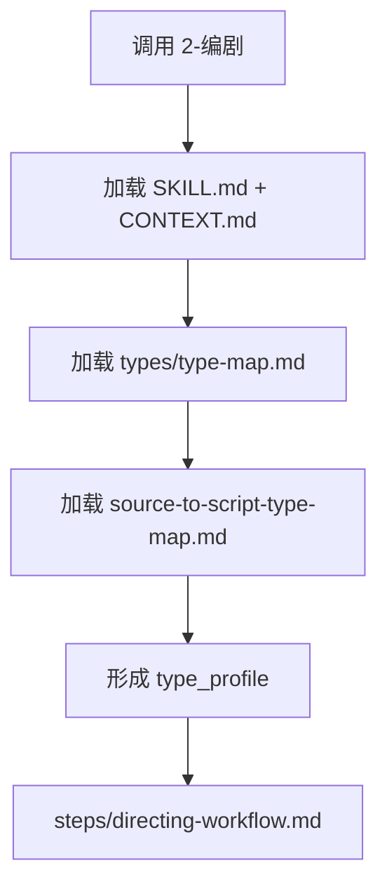

# Type Map

## Package Index

| package | role |
| --- | --- |
| `source-to-script-type-map.md` | 判断上游逐集正文到编剧稿的投影类型、字段分流策略和修复入口 |

## Default Package Rule

- 默认加载 `source-to-script-type-map.md`；终结画面、跨集连续性和表演弧线属于 `3-导演` / `4-表演` 后续阶段，不在 `2-编剧` 类型包内提前加载。
- 若用户提供多个输入形态，先由该类型包形成 `type_profile`，再进入 `steps/directing-workflow.md`。
- 本索引只负责类型包发现，不替代 `SKILL.md` 的输入、输出、顾问与复核流程 或 review 合同。

## Loading Flow

