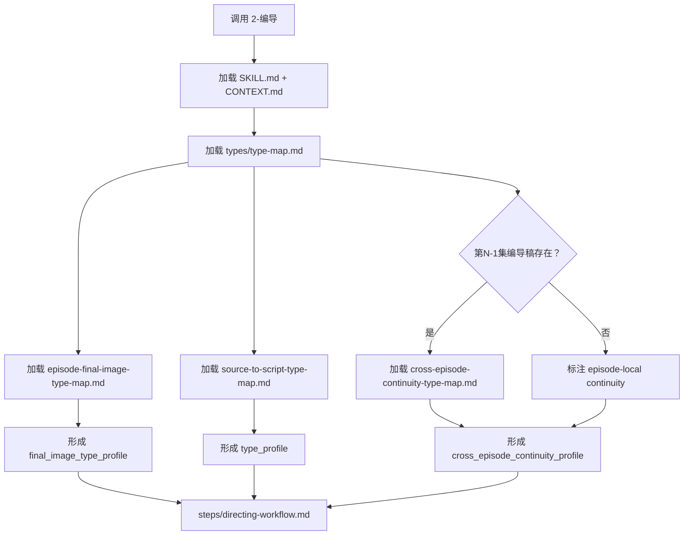

# Type Map

## Package Index

| package | role |
| --- | --- |
| `source-to-script-type-map.md` | 判断上游逐集正文到编导稿的投影类型、字段分流策略和修复入口 |
| `episode-final-image-type-map.md` | 判断每集终结画面的尾钩类型、下一集关联状态、剧透风险和手法匹配 |
| `cross-episode-continuity-type-map.md` | 判断跨集视觉母题延续、表演弧线、道具状态和空间连续性 |

## Default Package Rule

- 默认加载 `source-to-script-type-map.md` 和 `episode-final-image-type-map.md`；当处理第 N 集且第 N-1 集编导稿存在时，还需加载 `cross-episode-continuity-type-map.md`。
- 若用户提供多个输入形态，先由该类型包形成 `type_profile`，再进入 `steps/directing-workflow.md`。
- 本索引只负责类型包发现，不替代 `SKILL.md` 的输入、输出、subagents 或 review 合同。

## Loading Flow

