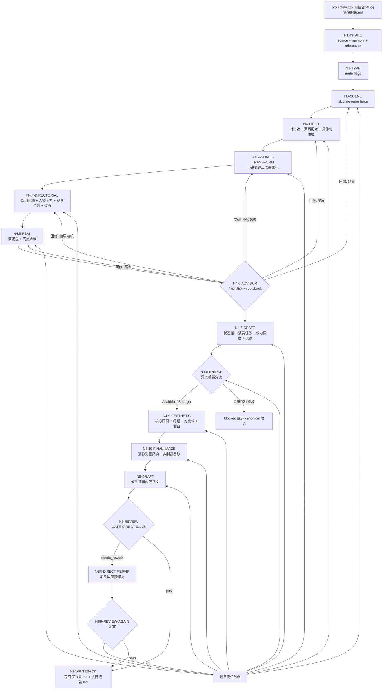
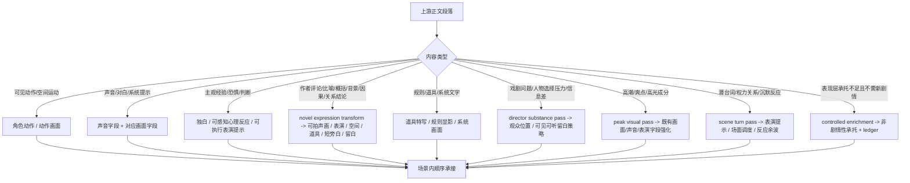

# aigc 2-编导

`2-编导` 负责把 `1-分集` 的逐集原文投影为影视剧本化结构。它只做按集剧本化改编、场景标题解析、声画字段分流、编导级表演任务和场面调度预设，不做剧情摘要、事实删减、因果重写、分镜组切分、摄影执行或设计资产生成。

## Context Loading Contract

- 每次调用 `$aigc-directing` 时，必须同时加载同目录 `CONTEXT.md`。
- 每次调用本技能时，必须同时加载同目录 `CONTEXT.md`。
- 每次调用本技能时，必须同时识别并加载同目录 `types/` 中选中的类型包（单选或多选）。
- 若任务绑定 `projects/aigc/<项目名>/`，必须先加载项目根 `MEMORY.md`，再按需加载项目根 `CONTEXT/` 中与当前剧本化改编相关的上下文；若历史项目仍使用 `CONTEXT/`，只读取与本轮相关的文件。
- 若本阶段启动 subagents 模式（包含用户显式要求或仓库合同视为默认启用），必须读取 `projects/aigc/<项目名>/team.yaml` 与 `../_shared/team-advisor-consultation-contract.md`，以 `team.yaml` 中明确的监制组相关智能顾问团作为编导监制；主 agent 必须把顾问请教绑定到当前 `steps/directing-workflow.md` 的思维·执行节点、`Thought Pass Map`、review gate 和目标集上下文，要求顾问代入各自角色意识、创作风格与专业水准参与节点判断、执行取舍、证据补强和风险提示，并在 LLM 剧本化投影前把可执行结论沉淀为 `advisor_consultation_packet` 作为后续任务上下文。
- 上游正文真源固定为 `projects/aigc/<项目名>/1-分集/第N集.md`，除非用户显式指定其他逐集正文文件。
- 冲突优先级：用户显式请求 > 根 `AGENTS.md` / meta 规则 > 本 `SKILL.md` > `references/` / `steps/` / `types/` / `review/` / `templates/` > `agents/openai.yaml` > 项目 `MEMORY.md` > 项目 `CONTEXT/` > 本 `CONTEXT.md`。
- 新的稳定失败模式或可复用打法先写入 `CONTEXT.md`；只有稳定为强制规则后再晋升到 `SKILL.md` 或对应分区。

## Multi-Subskill Continuous Workflow

当本主技能包被整体调用时，视为用户已授权按本级声明的同级子技能包、阶段分区或内部连续节点自动完成整个技能组任务；在满足本技能必要输入、显式选择和安全门后，不再为“是否继续下一步”额外确认。

- 无序号同级子技能包默认全选并发执行，由本主技能包汇总、裁决和写回唯一 canonical 输出。
- 数字序号子技能包或节点（如 `1-`、`2-`、`3-`）默认按数字升序串行执行，前一节点产物自动作为后一节点输入。
- 英文序号子技能包或路线（如 `A-`、`B-`、`C-`）默认按用户意图、父级路由或输入类型单选分流；只有用户明确要求对比、并跑或批量多路线时才多选。
- 卫星技能只承担查询、恢复、审查承接或辅助动作；不会因连续调度自动改写 `2-编导` canonical 输出，除非父级合同或用户明确要求回接。
- 连续调度不得绕过本技能的阻断门：缺少必需输入、上游正文不可读、破坏性覆盖未授权、子技能缺失或路线歧义会造成错误 canonical 写回时，必须先停下并给出最小澄清或阻断报告。
- 每个被调度的子技能包仍必须加载自身 `SKILL.md + CONTEXT.md`；脚本只能承担机械辅助，不得替代 LLM 剧本化判断或父级最终裁决。

## Input Contract

Accepted input:

- 项目名、项目路径或单个 `projects/aigc/<项目名>/1-分集/第N集.md` 文件。
- 用户要求“编导”“剧本化改编”“把分集改成剧本”“按集生成编导稿”“从 1-分集 到 2-编导”等任务。
- 已完成或部分完成的 `1-分集` 输出；可按单集、集号范围或全量分集执行。

Required input:

- 可定位的上游逐集正文文件。
- 至少一个目标集号，或允许默认处理 `1-分集/` 中全部 `第N集.md`。

Optional input:

- 项目 `MEMORY.md` 中的长期偏好、禁区、风格要求。
- `CONTEXT/` 中的角色、世界观、类型和制作约束。
- 用户额外指定的字段、标题风格、下游分组解析要求。
- 用户要求“更影视化”“适当新增可拍承托”“增强场景/表演层次”时，可触发 B 路线 `controlled_enrichment`，但不等于授权新增剧情。

Reject or clarify when:

- 上游文件不存在、不是可读文本，或 `【剧本正文】` 后没有可承接正文。
- 用户要求压缩、摘要、重排、删减剧情事实，且未明确这是非 canonical 候选稿。
- 用户要求对白润色、同义替换、语序调整；此类请求与对白冻结冲突，必须先确认是否放弃本技能 canonical 输出。
- 用户要求新增对白、新场景、新桥段、新规则、新因果强化或新事件结果；这属于 `C-authorized_adaptation`，不允许混入默认 canonical，必须另行授权并作为候选稿处理。
- 用户要求直接生成分镜组、图像提示词或视频请求；应分别转交下游阶段。

## Mode Selection

| mode | 触发信号 | 输出 |
| --- | --- | --- |
| `single_episode` | 指定单个 `第N集.md` 或单个集号 | `projects/aigc/<项目名>/2-编导/第N集.md` |
| `episode_range` | 指定多个集号或范围 | 多个逐集编导稿与更新后的执行报告 |
| `all_ready_episodes` | 未指定集号但 `1-分集/` 下有连续 `第N集.md` | 全部可读逐集编导稿 |
| `controlled_enrichment` | 用户要求“更影视化/适当新增可拍承托”，或质量门发现表现层承托不足但无需新增剧情 | canonical 编导稿 + `controlled_enrichment_ledger` |
| `repair` | 已有编导稿存在字段缺失、声画错配、场景标题漂移、对白不保真 | 最小修复后的逐集编导稿与问题报告 |
| `stage_end_review_repair` | 任一非 `review_only` 编导任务完成候选稿后自动进入 | 阶段内 review -> 直接修复 -> 复审 -> canonical 写回 |
| `review_only` | 用户只要求检查 `2-编导` 输出 | 审查报告，不改写正文，除非用户随后要求修复 |

## Subagents Execution Mechanism

当 `2-编导` 启动 subagents 模式时，执行语义固定为“项目监制顾问团请教 -> 编导参谋汇流 -> 上下文沉淀 -> 后续编导任务消费”，而不是让 subagents 直接主创或改写 canonical 编导稿。

1. 主 agent 先读取项目 `team.yaml`，按 `../_shared/team-advisor-consultation-contract.md` 解析监制组相关智能顾问团；优先使用 `roles.supervision.members`、`roles.supervising.members` 或其引用成员，必要时才按共享合同补位并记录原因。
2. 被启动的 subagents 作为编导监制顾问运行：围绕当前集上游正文、项目 `MEMORY.md`、相关 `CONTEXT/`、类型策略、`steps/directing-workflow.md` 中当前或即将进入的 `node_id`、本文件 `Thought Pass Map` 中对应 `pass_id`、以及 `review/review-contract.md` 中相关 `gate_id`，代入各自角色意识、创作风格与专业水准进行参谋。
3. 顾问问题不得固定为预设字段清单；主 agent 必须从当前技能包本身的思维·执行节点派生问题，让顾问参与该节点的判断、动作、证据、route_out、gate 和失败回路设计。顾问可以提出节点级执行建议、风险提示、取舍理由或局部 patch，但不得绕过节点网络直接主创终稿。
4. 主 agent 负责裁决、去重和汇流，把顾问建议压缩成 `advisor_consultation_packet.must_do / must_not_do / inspiration_to_use / execution_brief`，并保留 `node_ref / pass_ref / gate_ref / role_lens` 等来源锚点，作为 LLM 剧本化投影、阶段内修复和复审的额外上下文继续执行后续任务。
5. `advisor_consultation_packet` 不拥有上游逐集正文、对白冻结、场景顺序、字段合同或 canonical 写回权；顾问建议若与上游真源或本技能合同冲突，必须舍弃或降级为风险提示。
6. 若真实 subagent dispatch 被 system / developer / tool / user 上层策略阻断，必须在执行报告中记录阻断层级、原计划顾问路径、实际降级路径和未启动成员；不得把主 agent 本地顺序扮演写成真实 subagents 已执行。

## Reference Loading Guide

| 场景 | 必读文件 |
| --- | --- |
| 任意编导任务 | `references/script-adaptation-contract.md`、`steps/directing-workflow.md` |
| 编导创作阶段启动 subagents 模式 / team reviewer runtime | `../_shared/team-advisor-consultation-contract.md`，并按本 `Subagents Execution Mechanism` 执行 |
| 字段分流、声画配对、对白冻结 | `references/field-routing-and-audio-visual-contract.md` |
| 心理反应字段、主角内心独白保留、主观内压可感知化、演员表演反应与 GETability 证据 | `references/psychological-reaction-contract.md` |
| 小说式表述、作者评论、主角视角判断、心理内视、比喻象征、抽象概括、往日常态句、背景说明和因果/关系结论的二次画面化 | `references/novel-to-screen-language-contract.md` |
| 编导创作内核、戏剧问题、人物压力、观众体验与可拍执行策略 | `references/directorial-authorship-contract.md` |
| 高潮画面识别与重点强化 | `references/climax-visual-treatment-contract.md` |
| 好莱坞级编剧创作质量细则 | `references/hollywood-quality-spec.md` |
| 场景戏剧功能、潜台词、场面调度与演员任务 | `references/performance-and-scene-craft-contract.md` |
| B 路线受控新增式 / 非剧情性承托增强 | `references/controlled-enrichment-contract.md` |
| 整集视觉主轴、母题链、材质/色彩弧、节奏曲线和呼应目标 | `references/episode-visual-spine-contract.md` |
| 单场画面美学、视觉母题变奏、对比轴、景境氛围、画面节奏和留白 | `references/visual-aesthetic-contract.md` |
| 每集终结画面、迷你彩蛋尾钩、下一集非剧透关联 | `references/episode-final-image-contract.md`、`types/episode-final-image-type-map.md` |
| 判断输入类型与改编策略 | `types/source-to-script-type-map.md`、`types/episode-final-image-type-map.md` |
| 验收、修复和 review gate | `review/review-contract.md` |
| 阶段末审计后直接修复闭环 | 本 `Stage-End Review-Repair Contract`、`steps/directing-workflow.md`、`review/review-contract.md` |
| 输出样板 | `templates/output-template.md`、`templates/episode-script.template.md` |
| 脚本辅助边界与机械校验 | `scripts/README.md` |
| 可复用经验 | `knowledge-base/directing-heuristics.md` |
| 产品入口元数据 | `agents/openai.yaml` |

## Output Contract

### Required output

1. 逐集编导稿固定写入 `projects/aigc/<项目名>/2-编导/第N集.md`。
2. 阶段执行报告写入或更新 `projects/aigc/<项目名>/2-编导/执行报告.md`。
3. 每个逐集编导稿必须保留新增 frontmatter、`【剧本正文】`、场景标题和字段标签；正文必须完整承接上游原文信息量与顺序。
4. 对白逐字保真，字段标题固定为 `对白（真实角色名，语态/状态短语）`；独白、内心独白、旁白、音效必须显式带主体或来源，并使用中文双引号。
5. 同一集内完全相同 slugline 只在首次出现时打印场景标题，后续 beat 直接接正文。
6. 启用 `controlled_enrichment` 时，执行报告必须包含 `controlled_enrichment_ledger`，逐项记录新增承托细节的上游锚点、目标字段、用途和风险检查。

### Output format

| output_id | format |
| --- | --- |
| `OUTPUT-DIRECTING-EPISODE` | Markdown 编导稿 |
| `OUTPUT-DIRECTING-REPORT` | Markdown 执行报告 |

### Output path

| output_id | canonical path |
| --- | --- |
| `OUTPUT-DIRECTING-EPISODE` | `projects/aigc/<项目名>/2-编导/第N集.md` |
| `OUTPUT-DIRECTING-REPORT` | `projects/aigc/<项目名>/2-编导/执行报告.md` |

### Naming convention

- 逐集编导稿命名为 `第N集.md`。
- 阶段报告命名为 `执行报告.md`。
- 不创建 `Episode N.md`、`第N集-编导.md`、`script.md` 等平行真源。

### Completion gate

- 已读取本 `SKILL.md + CONTEXT.md`，并在项目任务中加载项目 `MEMORY.md` 与相关 `CONTEXT/`。
- 上游 `1-分集/第N集.md` 可回指，输出 frontmatter 记录 `source_episode_path`。
- 上游剧情事实、信息量与顺序完整承接，无摘要、删减、自由改写或因果重排。
- 对白逐字保真；字段标题使用 `对白（角色名，语态/状态短语）`，不得把 `原文角色`、`角色名`、`某人` 等占位词当作角色名；第二项要灵动、自然、鲜活地展示说话时的角色状态，不强制一词或以“地”结尾；引号内没有动作描写。
- 声画字段就近配对：`对白 -> 对白画面`、`独白/内心独白 -> 独白画面/内心独白画面`、`旁白 -> 旁白画面`、`音效 -> 音效画面`。
- `内心独白（角色）` 的引号内默认采用该角色当下第一人称心声；从第三人称小说叙述转入内心独白时，凡指代独白主体自身的“他/她/其/角色名”必须改成“我/我的/自己”或更自然的当下口吻。只有第三人称明确指向其他角色、引用医学/规则文本，或刻意写自我疏离并在执行报告留证时，才可保留第三人称。`内心独白画面` 仍使用第三人称可拍画面描述。
- 每个场景至少有一条正式剧本画面字段；`环境描写` 只写场景本身的写景画面，通常可在场景开篇建立地点、空间、光线和氛围，也可在同一 slugline 内因剧情发展、人物进入新的可见背景、室内外边界、角落、门廊、窗边、船舷、光线/空气/材质焦点变化而再次出现；`角色动作` / `动作画面` 只写可拍摄身体动作或空间运动，并在上游或场景压力需要时体现快慢、停顿、节奏和力度；环境与动作不得互相吞并。
- 终稿字段不得泄露内部任务说明、占位句或规则复述，例如“本场按上游原文顺序承接...”“说话者的视线...”“不新增事件结果”“引号内不加入动作”。
- 上游出现小说式作者评论、主角视角下对他人行为的主观判断、心理内视、文学比喻、象征句、抽象概括、体现重复/熟悉/往日常态的总结句、背景说明、因果解释、关系结论、感官散文或武侠/玄幻抽象时，必须执行 `novel_expression_transform_pass`：先判断叙事功能，再二次转成画面、声音、表演、空间、道具、群像、主角内心独白、短旁白或留白；对白仍逐字冻结，不能把小说叙述改成新增台词。与当前主线无关的人物过往、物品来历、回忆性补充不得进入 canonical。
- 关键场景必须执行 `director_substance_pass`：从上游原文提炼戏剧问题、人物选择压力、观众位置、场景状态差和可拍执行策略，并把创作判断内嵌到剧本句段；不得只做结构规整或漂亮改写。
- 上游存在高潮画面成分时，必须执行 `peak_visual_pass`：识别 1-3 个高点或最强 `micro_payoff`，并把强化结果落入既有正式画面/声音/表演字段，不新增剧情事实或对白。
- 关键场景必须执行 `scene_turn_pass`：从上游中提取进入状态、压力源、转折点和退出状态，并落入画面、声音、道具、场面调度、表演提示或群像反应。
- 每集必须先按 `references/episode-visual-spine-contract.md` 建立 `episode_visual_spine`：形成整集视觉问题、母题链、材质/色彩弧、节奏曲线、呼应目标和克制规则；关键场景、强情绪场、压迫场、离别场、高潮场和类型氛围场再按 `references/visual-aesthetic-contract.md` 执行 `visual_aesthetic_pass`，形成核心画面、视觉气质、母题变化、对比轴、景境氛围、画面节奏和留白取舍，并内嵌到既有字段；不得新增终稿字段、摄影方案或剧情事实。
- 每集必须按 `types/episode-final-image-type-map.md` 形成 `final_image_type_profile`，再按 `references/episode-final-image-contract.md` 建立 `episode_final_image_plan`：终结画面作为迷你彩蛋尾钩，应与下一集真实有关联但不剧透，并从本集最后的剧情、情绪、视觉母题、道具状态或高点余波丝滑顺延；可选环境描写式、道具特写式、情绪酝酿式或高潮结尾式，最终只落入既有字段，不新增 `终结画面` 正文字段、剧情事实、对白或摄影方案。
- 上游心理、潜台词、信任变化、权力压迫、沉默反应必须按 `references/psychological-reaction-contract.md` 与 `references/performance-and-scene-craft-contract.md` 转成主角内心独白、可执行演员任务、身体行为、表情、呼吸、停顿、道具动作、空间关系、声音余波、群体反应或环境/道具状态差；不得停留在解释性结论。`心理反应` 字段必须“可 GET”：观众应能通过演员表演、画面或声音接收到反应，不能写成抽象想象、内心散文、因果解释或离开文字无法感知的主角心理。描写人物动作时只写镜头可实拍的客观动作、神态和语气，不得写“试图、想要、打算、意图”等主观预判或心理意图；“感到恶心/难受/愤怒”等主观情绪必须转成微表情、肢体动作、生理反应或主角内心独白。视线只是候选变量，不得把多个转场、潜台词或未出口对白连续写成“避开对方 / 看向远方 / 顺着视线望去”的固定模板。
- `场面调度` 只能写人物、空间、道具、视线和权力关系，不得写摄影机位、景别、镜头运动或分镜编号。
- `道具特写` 只写信息载体、规则显影物、关键物件、线索痕迹、归属关系或状态变化的可见信息；不得写成固定物件清单、心理解释、推理结论或新增功能。
- `scene_dramatic_map / performance_task_map / blocking_power_map` 是规划证据，终稿不得在场景末尾或分镜组末尾总结式列出 `表演提示`、`场面调度`；必须拆入对应 `角色动作`、`对白画面`、`道具特写`、`群像画面`、声音和反应字段；只有空间结构、自然景物、自然条件、空气介质、光照状态、承载面、围护面、静置物件、整体氛围和同一场景内的环境刷新可拆入 `环境描写`。
- B 路线 `controlled_enrichment` 只允许补环境氛围/景境承托、群体反应、表演外显、场面调度、声音/道具/余波承托；每一项必须有上游锚点和 `risk_check`。
- `controlled_enrichment` 不得新增对白、事件、桥段、因果、规则、线索、人物动机或事件结果；无法证明安全的新增项默认删除。
- 启动 subagents 模式时，已按 `team.yaml` 监制组相关智能顾问团形成带 `node_ref / pass_ref / gate_ref / role_lens` 来源锚点的 `advisor_consultation_packet`，并把基于当前思维·执行节点的参谋指导作为后续 LLM 投影、修复和复审上下文；若被上层阻断，执行报告已记录降级说明。
- 执行报告包含 `novel_expression_transform_evidence`、`psychological_reaction_evidence`、`protagonist_inner_voice_evidence`、`objective_action_purity_evidence`、`director_substance_evidence`、`visual_aesthetic_evidence.episode_visual_spine`、`visual_aesthetic_evidence.scene_items` 和 `episode_final_image_evidence`；若本轮是机械修复或特例降级，必须说明哪些创作证据未补齐以及原因。
- 场景标题满足阿拉伯数字编号 + 好莱坞标准 slugline，且同一 slugline 不重复开新场景。
- 已运行 `scripts/validate_script_projection.py` 或执行等价人工 review；若发现阻断项，已在本阶段内完成最小直接修复并复审通过，结果写入 `执行报告.md`。

## Stage-End Review-Repair Contract

`2-编导` 不另设独立“润色”阶段。每次生成或修复候选编导稿后，必须在本阶段内部完成末段审计和直接修复闭环，只有复审通过的结果才允许写回 canonical `2-编导/第N集.md`。

固定执行语义：

1. `N5-DRAFT` 产物先视为 `candidate_script`，不是终稿。
2. `N6-REVIEW` 按 `review/review-contract.md` 审计保真、对白冻结、声画配对、slugline、字段纯度、小说表述二次画面化、心理反应可感知化、具像化、声音本体、编导创作内核、高潮画面、场景状态差、演员任务、场面调度内嵌、画面美学组织、controlled enrichment 和 LLM-first 边界。
3. 若 verdict 为 `needs_rework`，必须在本阶段直接执行 `N6R-DIRECT-REPAIR`，只修字段投影、可拍性、声画承托、slugline、具像化、声音本体、编导内核证据、高点承托、表演/调度内嵌、画面美学内嵌、受控增强留证或格式证据；不得改写上游剧情事实、对白和事件顺序。
4. 修复后必须执行 `N6R-REVIEW-AGAIN`；复审仍失败时继续最小修复循环，或在源层冲突、输入缺失、权限阻断时输出阻断报告，不得把失败稿推进下游。
5. `review_only` 只产出审查报告，不自动修复；除此之外的生成、批量和 repair 模式都默认启用本闭环。
6. `执行报告.md` 必须记录本轮 review verdict、repair actions、复审结果、未修复风险和是否允许进入 `3-摄影`。

## Visual Maps

## Execution Rules

- 核心剧本化改编必须由 LLM 直接完成；脚本只允许读取、统计、格式检查、字段覆盖和声画配对校验。
- `2-编导` 是 `1-分集` 的影视剧本化结构投影，不得压缩、摘要、删减剧情事实或自由改写剧情因果。
- 除新增 frontmatter、`【剧本正文】`、场景标题与字段标签外，必须完整承接上游原文信息量和顺序。
- 编导质量不以结构规整或表达漂亮为充分条件；必须按 `references/directorial-authorship-contract.md` 形成 `director_substance_plan`，把上游原文中的戏剧问题、人物压力、观众位置、信息释放、表演发动机、空间/道具/声音发动机转成可执行正文。
- 当启动 subagents 模式时，先按共享团队顾问合同解析 `team.yaml` 中明确的监制组相关智能顾问团，再把当前 `steps/directing-workflow.md` 的节点、`Thought Pass Map` 的 pass、相关 review gate 和目标集上下文转化为顾问任务；顾问必须代入角色意识、创作风格和专业水准参与节点判断、执行取舍、证据补强与风险提示，主 agent 只吸收可执行指导和风险提示，综合为带节点锚点的 `advisor_consultation_packet` 后沉淀进后续 LLM 剧本化投影、阶段内修复和复审上下文。
- 顾问意见不得替代上游逐集正文、对白冻结、场景顺序或编导主真源；若真实 subagent dispatch 被上层阻断，必须在执行报告中记录阻断层级、原计划顾问路径、实际降级路径和未启动成员。
- 候选稿不得跳过阶段末 review-repair 闭环直接成为终稿；review 发现阻断项时，必须在本阶段直接最小修复并复审，或明确阻断源层。
- 字段细则、声画配对、对白冻结和 slugline 稳定规则以 `references/field-routing-and-audio-visual-contract.md` 为准。
- 小说表述二次画面化以 `references/novel-to-screen-language-contract.md` 为准；作者评论、心理内视、比喻象征、概括叙述、背景说明、因果解释和关系结论必须先判叙事功能再转成可拍声画、表演、空间、道具、群像、短旁白或留白，且不得改写引号内对白。
- 高潮画面处理以 `references/climax-visual-treatment-contract.md` 为准；其职责是识别并强化上游已存在的满足兑现点，不得制造新的事件、对白或因果。
- 好莱坞级质量目标以 `references/hollywood-quality-spec.md` 为准，但质量提升不得凌驾于事实保真和对白冻结之上。
- 场景戏剧功能、潜台词、演员任务、沉默反应和权力关系调度以 `references/performance-and-scene-craft-contract.md` 为准；其职责是把上游已有心理和关系变化转成可执行戏剧动作，不得新增对白、事件或摄影方案。
- 受控新增式以 `references/controlled-enrichment-contract.md` 为准；B 路线只补表现层承托，必须写入 `controlled_enrichment_ledger`，不得替代 `C-authorized_adaptation`。
- 整集视觉主轴以 `references/episode-visual-spine-contract.md` 为准；它组织整集视觉问题、母题链、材质/色彩弧、节奏曲线、呼应目标和克制规则，不替代单场戏剧功能。
- 单场画面美学以 `references/visual-aesthetic-contract.md` 为准；它只组织核心画面、视觉气质、母题变化、对比轴、景境氛围、画面节奏和留白，不新增字段、摄影方案或剧情事实。
- 每集终结画面以 `references/episode-final-image-contract.md` 为准；它作为迷你彩蛋尾钩，负责让本集最后一个画面/声音/动作落点与下一集真实关联但不剧透，并从本集内容自然顺延，不新增事实、对白或正文字段。

## Script And Metadata Contract

| path | role |
| --- | --- |
| `scripts/README.md` | 说明脚本只做机械辅助，不替代 LLM 剧本化创作判断 |
| `scripts/validate_script_projection.py` | 对输出执行字段、场景标题、声画配对和基础保真标记校验 |
| `agents/openai.yaml` | 提供产品侧入口元数据，默认提示必须显式提到 `$aigc-directing` |

## Field Mapping

| field_id | 输出/证据 | 内容要求 | 失败码 |
| --- | --- | --- | --- |
| `FIELD-DIRECT-01` | 输入取证 | source episode、项目记忆、CONTEXT、目标集号明确 | `FAIL-DIRECT-01` |
| `FIELD-DIRECT-02` | 场景标题 | `### 场景N：内景/外景 场所 - 日/夜`，同 slugline 同编号 | `FAIL-DIRECT-02` |
| `FIELD-DIRECT-03` | 文本保真 | 剧情事实、顺序、对白完整承接 | `FAIL-DIRECT-03` |
| `FIELD-DIRECT-04` | 声画配对 | 对白/独白/旁白/音效与对应画面字段就近成组 | `FAIL-DIRECT-04` |
| `FIELD-DIRECT-05` | 字段纯度 | 声音字段只写可听文本或声音本体，画面字段只写可见画面 | `FAIL-DIRECT-05` |
| `FIELD-DIRECT-06` | 质量门禁 | 好莱坞级场景目的、冲突、动作、表演任务、潜台词行为和场面调度清晰；不写摄影越权字段 | `FAIL-DIRECT-06` |
| `FIELD-DIRECT-07` | 输出落盘 | `2-编导/第N集.md` 与 `执行报告.md` 可复查 | `FAIL-DIRECT-07` |
| `FIELD-DIRECT-08` | 高潮画面 | 上游高点或最强 `micro_payoff` 被识别并落入可拍字段，无新增事实 | `FAIL-DIRECT-08` |
| `FIELD-DIRECT-09` | Team advisor consult | 启动 subagents 模式时已按 `team.yaml` 请教项目监制顾问，并把基于当前思维·执行节点的参谋指导沉淀为后续任务上下文；阻断时有降级报告 | `FAIL-DIRECT-09` |
| `FIELD-DIRECT-10` | 阶段末闭环 | candidate 已审计、阻断项已直接修复并复审，执行报告记录 verdict 和 repair actions | `FAIL-DIRECT-10` |
| `FIELD-DIRECT-11` | 表演与场景工艺 | 关键场景有状态差；心理、潜台词、权力关系和沉默反应被转成主角内心独白、可执行表演/调度/反应证据；`心理反应` 必须可见、可听或可演，动作字段只写客观可拍动作/神态/语气，并内嵌到对应剧本句段 | `FAIL-DIRECT-11` |
| `FIELD-DIRECT-12` | Controlled enrichment | B 路线新增项均为非剧情性承托，有上游锚点、目标字段、用途和风险检查；无新增对白/事件/因果/规则 | `FAIL-DIRECT-12` |
| `FIELD-DIRECT-13` | 编导创作干货 | 关键场景有 `director_substance_plan` 级创作判断：戏剧问题、人物压力、观众位置、信息释放和可拍执行策略，并已内嵌进正文 | `FAIL-DIRECT-13` |
| `FIELD-DIRECT-14` | 占位泄露与环境纯度 | 终稿无内部规则句、模板占位句或任务说明；`环境描写` 不承载人物动作、对白引出、剧情结果或心理解释 | `FAIL-DIRECT-14` |
| `FIELD-DIRECT-15` | 画面美学 | 整集有视觉主轴；关键场景有核心画面、视觉气质、母题/变化、对比轴、景境氛围、节奏和留白取舍，并内嵌到既有字段；无摄影越权或审美词空转 | `FAIL-DIRECT-15` |
| `FIELD-DIRECT-16` | 创作证据 | 执行报告包含 `novel_expression_transform_evidence`、`director_substance_evidence`、`episode_visual_spine`、`visual_aesthetic_evidence` 和 `episode_final_image_evidence`，证明小说转译、编导判断、画面美学和终结画面尾钩不是只停留在文档规则层 | `FAIL-DIRECT-16` |
| `FIELD-DIRECT-17` | 小说表述二次画面化 | 作者评论、主角视角判断、心理内视、比喻象征、抽象概括、往日常态句、背景说明、因果解释和关系结论已转成可拍声画、表演、空间、道具、群像、主角内心独白、短旁白或留白；对白仍逐字冻结，无无关过往/物品来历/回忆性补充 | `FAIL-DIRECT-17` |
| `FIELD-DIRECT-18` | 终结画面尾钩 | 每集有 `episode_final_image_plan`；尾钩与下一集真实相关但不剧透，并从本集内容丝滑顺延，落入既有字段且无新增事实、对白或摄影越权 | `FAIL-DIRECT-18` |

## Thought Pass Map

| step_id | pass_name | input | judgment | output |
| --- | --- | --- | --- | --- |
| `PASS-DIRECT-01` | 输入取证 | `1-分集/第N集.md`、项目记忆、CONTEXT | 是否具备可承接逐集正文与目标集号 | `input_lock` |
| `PASS-DIRECT-02` | 场景解析 | 上游正文与场景线索 | slugline、场景编号和场景顺序是否稳定 | `scene_map` |
| `PASS-DIRECT-03` | 字段分流 | 上游叙事句、对白、声音、动作 | 声音字段与画面字段是否可分离并就近配对 | `field_routing_plan` |
| `PASS-DIRECT-03A` | 小说表述二次画面化 | `field_routing_plan`、上游小说段落、对白锁 | 是否把作者评论、主角视角判断、心理内视、比喻象征、抽象概括、往日常态句、背景说明、因果解释和关系结论转成可拍声画、表演、空间、道具、群像、主角内心独白、短旁白或留白，且不改对白、不补无关前史 | `novel_expression_transform_evidence` / `protagonist_inner_voice_evidence` |
| `PASS-DIRECT-04` | 编导创作内核 | `field_routing_plan`、`novel_expression_transform_evidence`、场景表与上游正文 | 是否提炼出戏剧问题、人物压力、观众位置、信息释放和可拍执行策略，而非只做结构/文采处理 | `director_substance_plan` |
| `PASS-DIRECT-05` | 高潮画面处理 | `field_routing_plan`、`director_substance_plan` 与上游正文 | 是否存在高潮/爽点/高光成分，是否需要强化为可拍字段 | `peak_visual_plan` |
| `PASS-DIRECT-06` | 顾问请教汇流 | `team.yaml`、共享顾问合同、上游正文、`steps/directing-workflow.md`、`Thought Pass Map`、`director_substance_plan` 与相关 review gate | 是否已把当前思维·执行节点转化为顾问任务，并将角色意识、创作风格和专业水准参谋汇流为带节点锚点的可执行上下文 | `advisor_consultation_packet` |
| `PASS-DIRECT-07` | 表演与场景工艺 | 场景表、字段路由、编导创作内核、高点计划、顾问包 | 是否把场景状态差、潜台词、演员任务、权力关系和沉默反应转成主角内心独白或客观可拍执行计划，并清除动作字段中的主观意图词 | `scene_dramatic_map` / `performance_task_map` / `objective_action_purity_evidence` |
| `PASS-DIRECT-08` | B 路线受控增强 | `scene_dramatic_map`、`performance_task_map`、`director_substance_plan`、`peak_visual_plan` 与上游正文 | 是否需要非剧情性承托新增；每项新增是否有上游锚点和风险检查 | `controlled_enrichment_ledger` |
| `PASS-DIRECT-08A` | 画面美学组织 | 场景表、字段路由、编导创作内核、高点计划、表演工艺、受控增强证据与上游正文 | 是否形成整集视觉主轴、核心画面、视觉气质、母题变化、对比轴、景境氛围、节奏和留白取舍，且不越过保真和摄影边界 | `episode_visual_spine` / `visual_aesthetic_plan` |
| `PASS-DIRECT-08B` | 终结画面尾钩 | 上游末场、`final_image_type_profile`、`peak_visual_plan`、`episode_visual_spine`、`visual_aesthetic_plan`、下一集可读上下文或本集局部推断 | 是否形成迷你彩蛋尾钩，既关联下一集又不剧透，并从本集相关内容自然顺延 | `episode_final_image_plan` |
| `PASS-DIRECT-09` | LLM 剧本化投影 | `field_routing_plan`、`novel_expression_transform_evidence`、`director_substance_plan`、`peak_visual_plan`、`advisor_consultation_packet`、`scene_dramatic_map`、`controlled_enrichment_ledger`、`visual_aesthetic_plan`、`episode_final_image_plan` 与上游正文 | 是否完整承接事实、顺序、对白、小说表述二次画面化、高点承托、表演调度内嵌、画面美学、终结画面尾钩、编导创作干货和受控增强边界 | `episode_script` |
| `PASS-DIRECT-10` | 验收回写 | 编导稿与校验结果 | 是否满足保真、声画、场景、高潮画面、编导创作干货、表演工艺、controlled enrichment 和输出门禁 | `review_result` |
| `PASS-DIRECT-11` | 直接修复复审 | `review_result`、candidate 编导稿、修复稿 | 阻断项是否已在本阶段最小修复并复审通过 | `review_repair_result` |

## Pass Table

| pass_id | pass standard | fail code | Rework Entry |
| --- | --- | --- | --- |
| `PASS-DIRECT-01` | 上游逐集正文、项目记忆和目标集号明确 | `FAIL-DIRECT-01` | `Input Contract` |
| `PASS-DIRECT-02` | 场景标题使用稳定编号和好莱坞 slugline | `FAIL-DIRECT-02` | `references/script-adaptation-contract.md` |
| `PASS-DIRECT-03` | 声画字段分流纯净且就近配对 | `FAIL-DIRECT-04` | `references/field-routing-and-audio-visual-contract.md` |
| `PASS-DIRECT-03A` | 小说式作者评论、主角视角判断、心理内视、比喻象征、抽象概括、往日常态句、背景说明、因果解释和关系结论已二次画面化；对白没有被润色、拆改或新增；没有无关过往、物品来历或回忆性补充 | `FAIL-DIRECT-17` | `references/novel-to-screen-language-contract.md` |
| `PASS-DIRECT-04` | 关键场景有编导级创作判断，能把上游原文转成戏剧问题、人物压力、观众体验和可拍策略 | `FAIL-DIRECT-13` | `references/directorial-authorship-contract.md` |
| `PASS-DIRECT-05` | 上游高点被识别，且强化不新增事实、对白或因果 | `FAIL-DIRECT-08` | `references/climax-visual-treatment-contract.md` |
| `PASS-DIRECT-06` | 启动 subagents 模式时完成项目监制顾问请教，且顾问任务同步于当前思维·执行节点、上下文沉淀或记录降级 | `FAIL-DIRECT-09` | `../_shared/team-advisor-consultation-contract.md` + 本 `Subagents Execution Mechanism` |
| `PASS-DIRECT-07` | 心理、潜台词、权力关系和沉默反应被转成主角内心独白或可执行表演/调度计划，并要求终稿内嵌；动作字段无主观意图词，不新增对白或摄影方案 | `FAIL-DIRECT-11` | `references/performance-and-scene-craft-contract.md` |
| `PASS-DIRECT-08` | B 路线新增项只属于非剧情性承托，且有完整 `controlled_enrichment_ledger` | `FAIL-DIRECT-12` | `references/controlled-enrichment-contract.md` |
| `PASS-DIRECT-08A` | 整集有视觉主轴；关键场景有视觉核心、画面层级、母题变化、对比轴、景境氛围和留白取舍；美学增强不新增事实或摄影方案 | `FAIL-DIRECT-15` | `references/visual-aesthetic-contract.md` |
| `PASS-DIRECT-08B` | 终结画面作为迷你彩蛋尾钩，能非剧透地关联下一集，并从本集内容丝滑顺延到最后既有字段 | `FAIL-DIRECT-18` | `references/episode-final-image-contract.md` |
| `PASS-DIRECT-09` | 剧情事实、顺序和对白完整保真，且编导创作干货、表演工艺与受控增强未越权 | `FAIL-DIRECT-03` | `steps/directing-workflow.md` |
| `PASS-DIRECT-10` | 输出路径、执行报告和 review gate 齐全 | `FAIL-DIRECT-07` | `review/review-contract.md` |
| `PASS-DIRECT-11` | review 阻断项已直接修复并复审；未通过时不写 canonical 终稿 | `FAIL-DIRECT-10` | `Stage-End Review-Repair Contract` |

## Root-Cause Execution Contract (Mandatory)

出现以下问题时，必须沿链路上溯并修复源层合同：

- 对白被润色、改写、删减或换序。
- 用摘要替代完整剧情承接。
- 将小说作者评论、主角视角判断、心理内视、文学比喻、抽象概括、往日常态句、背景说明、因果解释或关系结论原样塞进画面字段，或把这些叙述改写成新增对白。
- `动作画面` / `角色动作` 混入心理解释、章节名、抽象判断、“没有人知道”类叙述句，或出现“试图、想要、打算、意图”等主观预判/心理意图词。
- 主角视角下对他人行为的判断被写成客观第三方概括，而不是主角内心独白、可感知心理反应或可拍承托。
- `内心独白（主角）` 承接第三人称小说叙述时仍以“他/她/其/角色名”指代主角自身，导致角色心声变成旁白口吻；应改为第一人称心声，画面承托字段再保留第三人称。
- “感到恶心/难受/愤怒”等主观情绪感受被直接写入终稿，而不是转成微表情、肢体动作、生理反应或主角内心独白。
- 为补足剧本质感新增与当前主线无关的人物过往背景、物品来历或回忆性信息。
- `环境描写` 混入人物动作、对白引出、剧情结果、心理解释、关系结论或固定承接规则；或误以为同一场景标题下只能在开篇出现一次，导致室内到室外、主厅到角落、背景变化、光线/空气/材质变化没有环境刷新。
- `环境描写` 在关键情绪场、压迫场、离别场或类型氛围场只写地点点缀，没有景境承托；或新增自然景物后造成新事件、线索、阻碍、因果或结果。
- 关键场景没有核心画面、视觉层级、母题变化、对比轴、画面节奏或留白取舍；或用“电影感/高级感/宿命感”等抽象审美词替代可见画面。
- 整集画面没有 `episode_visual_spine`，每场各自好看但缺少可记忆的视觉母题链、材质/色彩弧、节奏曲线和呼应目标。
- 每集结尾没有 `episode_final_image_plan`，或终结画面只是剧情总结/硬塞预告/剧透下一集，未形成从本集内容自然顺延的迷你彩蛋尾钩。
- `对白画面` 输出“说话者的视线、手部动作...”之类说明性模板句，而不是具体可见承托。
- 内部任务说明或规则复述泄露到终稿字段正文。
- 声音字段与画面字段混写，或没有就近配对。
- 同一 slugline 因叙事 beat 变化反复开新场景。
- 上游存在明显高潮/爽点/高光成分，但编导稿把它压平成普通叙述，或为了强化高点新增事实、对白、事件结果。
- 编导稿只有结构严谨或文字漂亮，但没有从上游原文提炼戏剧问题、人物选择压力、观众位置、信息释放和可拍执行策略。
- 心理、潜台词、权力关系、沉默或场景转折仍停留在解释性结论，未转成演员可执行任务或场面调度。
- 将 `表演提示`、`场面调度` 作为场景末尾或分镜组末尾的总结块列出，而不是拆入对应剧本句段。
- `场面调度` 写成摄影机位、景别、镜头运动或分镜方案，造成 `2-编导` 越权到下游摄影。
- B 路线受控增强没有 `controlled_enrichment_ledger`，或新增项缺少上游锚点、目标字段、用途和风险检查。
- 把 `controlled_enrichment` 当成自由新增式，新增对白、事件、桥段、因果、规则、线索、人物动机或事件结果。
- 脚本生成或模板拼接替代 LLM 的核心剧本化创作判断。
- 启动 subagents 模式时跳过 `team.yaml` 监制顾问请教、把顾问问题固定成脱离当前思维·执行节点的题型清单、没有把节点级参谋指导沉淀为后续上下文，或把主 agent 本地模拟顾问当成真实 dispatch。
- review 发现阻断项后未在本阶段直接修复和复审，却把候选稿写成终稿或推进下游。

必经链路：

`Symptom -> Direct Script/Prompt/Subagent Overreach -> 2-编导 Section Owner -> AGENTS.md LLM-first / Subagent / Skill 2.0 Rule`
