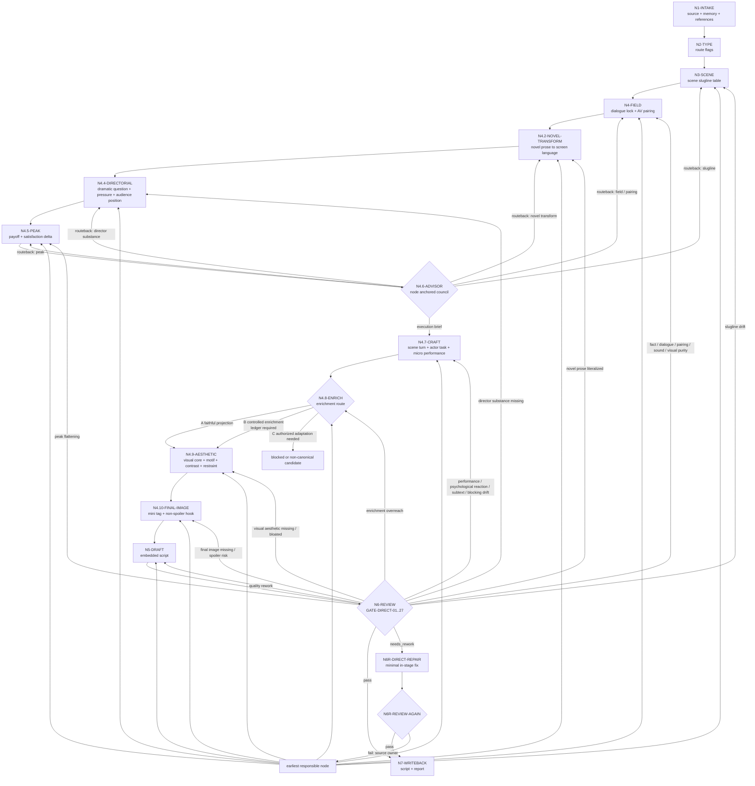
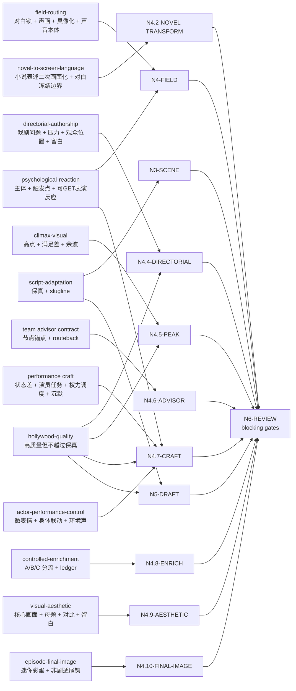

# Directing Workflow

## Business Requirement Analysis

| slot | value |
| --- | --- |
| `business_goal` | 将逐集小说原文投影为忠实、可拍、可分组的编导稿 |
| `business_object` | `projects/aigc/<项目名>/1-分集/第N集.md` |
| `constraint_profile` | 原文信息量保真、对白冻结、声画配对、slugline 稳定、小说表述二次画面化、主角内心独白保留、动作客观可拍、心理反应可感知化、角色演技控制、编导创作内核、高潮兑现、场景状态差、表演/调度内嵌、画面美学组织、终结画面尾钩、controlled enrichment 留证、LLM-first、subagents 监制顾问上下文沉淀 |
| `success_criteria` | 输出能完整承接上游，且把小说原文中已有事件、关系、心理、信息差和高点转成导演、演员、声音与下游分组可执行的剧本正文 |
| `non_goals` | 不做分镜组切分、不生成图像提示词、不重写剧情 |
| `complexity_source` | 场景解析、字段分流、声画配对、编导创作内核、高潮画面识别、监制顾问参谋汇流、戏剧功能、潜台词、场面调度、演员任务、画面美学组织、终结画面类型化尾钩、受控增强边界、保真与质量的优先级协调 |
| `topology_fit` | 串行主干 + 类型分支 + subagents 顾问分支 + review 回路 |

## Reference-To-Node Coverage

| reference | consumed_by | node evidence | blocking gate |
| --- | --- | --- | --- |
| `references/script-adaptation-contract.md` | `N1-INTAKE` / `N3-SCENE` / `N5-DRAFT` / `N6-REVIEW` | `source_episode_path`、`scene_slugline_table`、`faithful_projection_trace`、frontmatter | `FAIL-SOURCE` / `FAIL-FAITHFULNESS` / `FAIL-SLUGLINE` |
| `references/field-routing-and-audio-visual-contract.md` | `N4-FIELD` / `N5-DRAFT` / `N6-REVIEW` | `dialogue_lock_map`、`audio_visual_pairing_map`、`concrete_visual_risk_map`、`objective_action_purity_map`、`sound_literal_risk_map`、`environment_purity_map`、`placeholder_leak_risk_map` | `FAIL-DIALOGUE` / `FAIL-PAIRING` / `FAIL-ACTION-PURITY` / `FAIL-CONCRETE-VISUAL` / `FAIL-SOUND-LITERAL` / `FAIL-PLACEHOLDER-LEAK` / `FAIL-ENVIRONMENT-PURITY` |
| `references/psychological-reaction-contract.md` | `N4-FIELD` / `N4.7-CRAFT` / `N5-DRAFT` / `N6-REVIEW` | `psychological_reaction_getability_map`、`protagonist_inner_voice_map`、`subjective_emotion_projection_map`、`psychological_reaction_plan`、`psychological_reaction_evidence`、`protagonist_inner_voice_evidence`、`embedded_craft_targets` | `FAIL-CONCRETE-VISUAL` / `FAIL-PERFORMANCE-TASK` / `FAIL-CREATIVE-EVIDENCE` |
| `references/novel-to-screen-language-contract.md` | `N4.2-NOVEL-TRANSFORM` / `N5-DRAFT` / `N6-REVIEW` | `novel_expression_transform_evidence`、`expression_type_map`、`screen_strategy_map`、`protagonist_pov_judgment_map`、`habitual_summary_risk_map`、`backstory_expansion_risk_map`、`literal_prose_risk_map` | `FAIL-NOVEL-TO-SCREEN-LANGUAGE` / `FAIL-DIALOGUE` |
| `references/directorial-authorship-contract.md` | `N4.4-DIRECTORIAL` / `N4.5-PEAK` / `N4.6-ADVISOR` / `N4.7-CRAFT` / `N5-DRAFT` | `director_substance_plan`、`adaptation_payload`、`director_substance_evidence` | `FAIL-DIRECTOR-SUBSTANCE` |
| `references/climax-visual-treatment-contract.md` | `N4.5-PEAK` / `N5-DRAFT` / `N6-REVIEW` | `peak_visual_plan`、`peak_visual_candidates`、`micro_payoff`、`cost_or_aftershock` | `FAIL-PEAK-VISUAL` |
| `references/performance-and-scene-craft-contract.md` | `N4.7-CRAFT` / `N5-DRAFT` / `N6-REVIEW` | `scene_dramatic_map`、`performance_task_map`、`blocking_power_map`、`integration_targets` | `FAIL-SCENE-TURN` / `FAIL-PERFORMANCE-TASK` / `FAIL-CINEMATOGRAPHY-OVERREACH` / `FAIL-PERFORMANCE-SUMMARY-BLOCK` |
| `references/actor-performance-control-contract.md` | `N4.7-CRAFT` / `N4.8-ENRICH` / `N5-DRAFT` / `N6-REVIEW` | `actor_performance_control_plan`、`emotion_motive_map`、`micro_expression_map`、`body_linkage_map`、`ambient_performance_support_map`、`actor_performance_control_evidence` | `FAIL-PERFORMANCE-TASK` / `FAIL-CONCRETE-VISUAL` / `FAIL-CREATIVE-EVIDENCE` |
| `references/controlled-enrichment-contract.md` | `N4.8-ENRICH` / `N5-DRAFT` / `N6-REVIEW` | `enrichment_route_decision`、`controlled_enrichment_ledger` | `FAIL-CONTROLLED-ENRICHMENT` |
| `references/episode-visual-spine-contract.md` | `N4.9-AESTHETIC` / `N5-DRAFT` / `N6-REVIEW` | `episode_visual_spine`、`visual_question`、`motif_chain`、`material_and_color_arc`、`rhythm_curve`、`callback_targets` | `FAIL-VISUAL-AESTHETIC` / `FAIL-CREATIVE-EVIDENCE` |
| `references/visual-aesthetic-contract.md` | `N4.9-AESTHETIC` / `N5-DRAFT` / `N6-REVIEW` | `visual_aesthetic_plan`、`core_image`、`image_motif_map`、`contrast_axis_map`、`atmospheric_palette`、`restraint_notes` | `FAIL-VISUAL-AESTHETIC` |
| `references/episode-final-image-contract.md` / `types/episode-final-image-type-map.md` | `N2-TYPE` / `N4.10-FINAL-IMAGE` / `N5-DRAFT` / `N6-REVIEW` | `final_image_type_profile`、`episode_final_image_plan`、`final_image_method`、`next_episode_relation`、`spoiler_boundary`、`final_field_projection` | `FAIL-EPISODE-FINAL-IMAGE` / `FAIL-CREATIVE-EVIDENCE` |
| `references/hollywood-quality-spec.md` | `N4.4-DIRECTORIAL` / `N4.5-PEAK` / `N4.7-CRAFT` / `N5-DRAFT` / `N6-REVIEW` | `hollywood_quality_notes`、`embedded_craft_targets`、`quality_rework_targets` | `hollywood_quality: needs_rework` |
| `../_shared/team-advisor-consultation-contract.md` | `N4.6-ADVISOR` / `N6-REVIEW` | `advisor_consultation_packet`、`advisor_routeback_targets`、`downgrade` | `FAIL-ADVISOR-CONSULT` |

## Thinking-Action Node Contract

`steps/directing-workflow.md` 中的节点不是普通 checklist。每次执行 `2-编导` 时，主 agent 必须把每个实际经过的节点记录为 `thinking_action_node_ledger`，并让 review 能反查“判断、动作、证据、路由、gate”是否同时发生。

节点最小字段固定如下：

| field | requirement |
| --- | --- |
| `node_id` | 稳定节点 ID，必须能回指下方 `Thinking-Action Nodes` 表 |
| `judgment_question` | 当前节点必须先判断什么，不能只写“执行某 pass” |
| `decision` | 本轮判断结果；可为 `pass / needs_rework / blocked / routeback / not_applicable` |
| `actions_taken` | 实际执行动作，必须说明投影、取舍、删除、补证、分流或回修动作 |
| `evidence_keys` | 本节点产出的证据字段或文件锚点 |
| `route_out` | 下一节点、回修节点或阻断出口 |
| `gate_status` | 本节点 gate 是否通过；失败时写 `fail_code` 和最早责任节点 |
| `source_owner` | 失败或降级时对应的合同 owner，例如 `field-routing`、`actor-performance-control`、`review` |

节点退化判定：

- 只有动作描述、没有 `judgment_question`，视为 checklist 退化。
- 只有“已优化/已增强/已影视化”等结论、没有 `evidence_keys`，视为证据退化。
- 只有 `route_out` 到下一步、没有失败回路，视为路由退化。
- 只在报告里列节点名、终稿正文没有对应字段内嵌，视为投影退化。
- 新增 reference、gate 或 evidence 时，必须同步更新本文件的 `Reference-To-Node Coverage`、`Thinking-Action Nodes`、`Failure Loops` 和 Mermaid。

报告中的最小形态：

```yaml
thinking_action_node_ledger:
  - node_id: "N4.7-CRAFT"
    judgment_question: "关键情绪 beat 是否仍停留在情绪标签或模板表情？"
    decision: "pass | needs_rework | blocked | routeback | not_applicable"
    actions_taken:
      - "将上游触发点转成表层/压制/隐藏动机、微表情、身体联动、环境声和微动态限制"
    evidence_keys:
      - "actor_performance_control_evidence"
      - "integration_targets"
    route_out: "N4.8-ENRICH"
    gate_status:
      passed: true
      fail_code: ""
    source_owner: "references/actor-performance-control-contract.md"
```

## Learning Integration Review Closure

上一轮 `code-reviewer` 审查结论：角色演技学习成果已接入 `references`、workflow、review gate、模板和 `CONTEXT.md`，但仍存在“静态合同已接入，不等于真实生成时一定产出合格证据”的残余风险。

本 workflow 因此新增以下闭环：

- `N6-REVIEW` 必须检查 `thinking_action_node_ledger` 是否覆盖本轮经过的关键节点，尤其是 `N4.7-CRAFT`、`N5-DRAFT`、`N6-REVIEW` 和 `N7-WRITEBACK`。
- 若新增或显著修改了学习型合同，例如 `actor-performance-control-contract.md`，必须在本轮执行报告中加入 `learning_integration_review_evidence`，说明静态接入点、真实样例或等价 smoke 检查、未覆盖风险和下一次生产运行的观察点。
- 若本轮没有真实项目剧集可运行，允许在 `learning_integration_review_evidence.status` 标注 `static_only`，但不得把它写成 fully verified；review 必须把残余风险保留在报告中。
- 后续真实编导产物一旦触发该合同，应把至少一个关键情绪 beat 的 `source_anchor -> actor_performance_control_evidence -> embedded_in_fields` 作为样例写入执行报告。

## Thinking-Action Nodes

| node_id | objective | inputs | actions | evidence | route_out | gate |
| --- | --- | --- | --- | --- | --- | --- |
| `N1-INTAKE` | 锁定项目、集号、上游正文真源和本轮加载边界 | 用户请求、项目根、`1-分集/` | 定位目标集，读取 `SKILL.md + CONTEXT.md`、项目 `MEMORY.md`、相关 `CONTEXT/`，建立本轮 reference load manifest | `source_episode_path`、目标输出路径、`reference_load_manifest` | `N2-TYPE` | 上游文件可读，加载边界不缺失 |
| `N2-TYPE` | 形成 `type_profile`、`final_image_type_profile` 与节点策略开关 | 上游正文结构、下一集可读状态、`types/source-to-script-type-map.md`、`types/episode-final-image-type-map.md` | 判断显式场景/纯小说/系统密集/对白密集/内压密集/单地点多 beat/高点密集等类型；判断终结画面的下一集关联状态、anchor surface、hook promise、剧透风险、连续方式和优先手法，并标记必须增强的 pass | `type_profile`、`final_image_type_profile`、`route_flags` | `N3-SCENE` | 改编策略不违背保真，类型策略不会变成剧情重写或下一集剧透 |
| `N3-SCENE` | 解析并稳定场景 slugline | 上游段落、type_profile、`references/script-adaptation-contract.md` | 按真实地点/空间范围和日夜建立场景表；同 slugline 去重；只因真实空间/时间变化开新场景 | `scene_slugline_table`、`scene_order_trace` | `N4-FIELD` | 每个场景标题符合 slugline 规则，且场景顺序可回指上游 |
| `N4-FIELD` | 字段分流、对白冻结、声画配对与具像化预检 | 上游段落、场景表、`references/field-routing-and-audio-visual-contract.md`、`references/psychological-reaction-contract.md` | 逐段投影为声音字段、画面字段、动作、心理、系统、规则、道具、群像等；建立对白原文清单；对每个声音字段绑定对应画面字段；单独判定 `环境描写` 是否只写场景写景材料；标记同一 slugline 内空间/背景/光线/空气/材质焦点变化是否需要环境刷新；按心理反应细则标记主体、上游触发点、可见/可听/可演通道、主角内心独白需求和错误心理解释风险；标记动作字段中主观意图词、抽象画面、小说内视、直接情绪感受、声音说明和模板/规则占位泄露风险 | `field_projection_map`、`dialogue_lock_map`、`audio_visual_pairing_map`、`concrete_visual_risk_map`、`objective_action_purity_map`、`psychological_reaction_getability_map`、`protagonist_inner_voice_map`、`subjective_emotion_projection_map`、`sound_literal_risk_map`、`environment_purity_map`、`environment_refresh_map`、`placeholder_leak_risk_map` | `N4.2-NOVEL-TRANSFORM` | 字段纯度、对白冻结、声画配对、顺序承接、环境纯度、动作客观可拍、心理反应可感知化、主角内心独白保留和反抽象预检成立；同一场景内环境刷新不被误删；无内部任务说明进入正文 |
| `N4.2-NOVEL-TRANSFORM` | 小说表述二次画面化 | `field_projection_map`、上游段落、场景表、`dialogue_lock_map`、`references/novel-to-screen-language-contract.md` | 识别作者评论、主角视角判断、心理内视、直接情绪感受、比喻象征、抽象概括、体现重复/熟悉/往日常态的总结句、背景说明、因果解释、关系结论、感官散文、武侠/玄幻抽象、回忆/认知补叙和规则说明；为每条高风险表述锁定 `source_function` 与 `screen_strategy`，转为画面、声音、表演、空间、道具、群像、主角内心独白、短旁白或留白；标记无关人物过往、物品来历和回忆性补充并删除；明确对白只冻结不加工 | `novel_expression_transform_evidence`、`expression_type_map`、`screen_strategy_map`、`protagonist_pov_judgment_map`、`habitual_summary_risk_map`、`backstory_expansion_risk_map`、`literal_prose_risk_map` | `N4.4-DIRECTORIAL` | 小说式表达不得原样进入画面字段；主角视角判断不得写成客观第三方概括；无新增事实、对白、事件、因果、规则、线索、无关前史/物品来历或摄影越权；旁白若保留必须有画面证据承托 |
| `N4.4-DIRECTORIAL` | 编导创作内核 | `field_projection_map`、`novel_expression_transform_evidence`、场景表、上游正文、`dialogue_lock_map`、`references/directorial-authorship-contract.md`、`references/hollywood-quality-spec.md` | 对关键场景执行 `director_substance_pass`：提炼戏剧问题、观众位置、人物主动目标、阻碍、隐藏恐惧、选择压力、进入/转折/退出状态、信息释放、表演发动机、空间/道具/声音发动机、节奏取舍和 `adaptation_payload` | `director_substance_plan`、`adaptation_payload`、`hollywood_quality_notes` | `N4.5-PEAK` | 每个关键判断能回指上游；不是漂亮改写或结构整理；无新增事实、对白、桥段或摄影越权；必须说明哪些内容该显影、该发声、该留白 |
| `N4.5-PEAK` | 高潮画面识别与强化计划 | `field_projection_map`、`director_substance_plan`、上游段落、`references/climax-visual-treatment-contract.md`、质量规范 | 识别 1-3 个上游高点或最强 `micro_payoff`，锁 `source_evidence / audience_desire / promise_source / character_anchor / payoff_mode / build_up / delivery_action / satisfaction_delta / visual_payload / audio_payload / cost_or_aftershock`；必要时标注 `payoff_variation_axis` | `peak_visual_plan`、`peak_visual_candidates`、`micro_payoff` | `N4.6-ADVISOR` | 高点可回指上游，强化只提高画面/声音/表演/空间/余波密度，不新增事实、对白、胜负、死亡、反转或因果 |
| `N4.6-ADVISOR` | subagents 编导监制参谋汇流 | `team.yaml`、共享顾问合同、上游正文、场景表、字段映射、小说转译证据、编导创作内核、高潮画面计划、项目 `MEMORY.md`、相关 `CONTEXT/`、当前 `node_id/pass_id/gate_id` | 启动或按阻断报告处理 team.yaml 中明确的监制组相关智能顾问团；主 agent 将当前思维·执行节点的 judgment、actions、evidence、route_out、gate 与失败回路转化为顾问任务；顾问代入角色意识、创作风格和专业水准参与节点判断、执行取舍、证据补强、回修建议和风险提示；主 agent 汇流为后续任务上下文 | `advisor_consultation_packet`、`advisor_routeback_targets` 或降级报告 | `N3-SCENE` / `N4-FIELD` / `N4.2-NOVEL-TRANSFORM` / `N4.4-DIRECTORIAL` / `N4.5-PEAK` / `N4.7-CRAFT` | packet 已包含 roster 来源、`node_ref/pass_ref/gate_ref/role_lens`、可执行指导、风险提示、`routeback_targets` 和 `execution_brief`；若顾问发现前置节点证据不成立，必须先回修对应节点 |
| `N4.7-CRAFT` | 场景戏剧功能、潜台词、演员任务与角色演技控制 | 场景表、字段映射、`director_substance_plan`、高潮画面计划、`advisor_consultation_packet`、`references/performance-and-scene-craft-contract.md`、`references/psychological-reaction-contract.md`、`references/actor-performance-control-contract.md` | 执行 `scene_turn_pass / actor_task_pass / blocking_power_pass / silence_reaction_pass / psychological_reaction_pass / protagonist_inner_voice_pass / objective_action_purity_pass / actor_performance_control_pass`；把心理、潜台词、关系变化、权力关系和沉默反应转成主角内心独白、目标、阻碍、策略、停顿、视线、身体距离、道具动作、空间占位、微表情、非面部生理联动、环境声音和声音余波；对关键情绪 beat 建立 `trigger -> surface_emotion / suppressed_emotion / hidden_motive -> micro_expression -> body_linkage -> ambient_support -> micro_dynamics`；若使用 `心理反应` 字段，必须锁定上游触发点、心理功能、演员任务、GETability 通道和内嵌字段；若进入动作字段，必须删除主观意图词 | `scene_dramatic_map`、`performance_task_map`、`blocking_power_map`、`silence_reaction_map`、`psychological_reaction_plan`、`actor_performance_control_plan`、`emotion_motive_map`、`micro_expression_map`、`body_linkage_map`、`ambient_performance_support_map`、`psychological_reaction_evidence`、`actor_performance_control_evidence`、`protagonist_inner_voice_evidence`、`objective_action_purity_evidence`、`integration_targets`、`embedded_craft_targets` | `N4.8-ENRICH` | 不新增事实、对白、事件顺序、无关前史或摄影越权信息；表演任务可执行；关键情绪 beat 不停留在情绪标签或模板表情；动作字段客观可拍；`心理反应` 有主体、有上游触发点、可见/可听/可演；主角内心判断已进入主角内心独白或可感知反应；规划结果必须进入对应句段，不作为场景末尾总结块 |
| `N4.8-ENRICH` | B 路线受控增强判定与留证 | `scene_dramatic_map`、`performance_task_map`、`actor_performance_control_plan`、`director_substance_plan`、`peak_visual_plan`、上游正文、`references/controlled-enrichment-contract.md`、`references/actor-performance-control-contract.md` | 判定 `A-faithful_projection / B-controlled_enrichment / C-authorized_adaptation`；只允许 B 路线补环境、群体反应、表演外显、场面调度、声音/道具/余波承托；若学习稿式演技控制需要补充，只能补微表情、身体联动、环境声、沉默余波和非剧情性瑕疵，不得新增人物动机；为每个新增项记录 `source_anchor / added_detail / target_field / purpose / risk_check` | `enrichment_route_decision`、`controlled_enrichment_ledger` 或 `enrichment_mode: none` | `N4.9-AESTHETIC` | 每个新增项有上游锚点；删掉该项后剧情事实仍完全不变；无新增对白、事件、因果、规则、线索或人物动机；新增演技承托不变成新外貌设定、伤病设定或剧情线索 |
| `N4.9-AESTHETIC` | 画面美学组织与景境层次 | 场景表、字段映射、`director_substance_plan`、`peak_visual_plan`、`scene_dramatic_map`、`performance_task_map`、`controlled_enrichment_ledger`、上游正文、`references/episode-visual-spine-contract.md`、`references/visual-aesthetic-contract.md` | 先按 `episode-visual-spine` 建立 `episode_visual_spine`：锁定整集视觉问题、母题链、材质/色彩弧、节奏曲线、呼应目标和克制规则；再按 `visual-aesthetic` 执行 `visual_aesthetic_pass`：为关键场景锁定 `visual_tone / visual_core / image_hierarchy / motif_and_variation / contrast_axis / atmospheric_scenery / rhythm_and_negative_space / restraint`，并规划它们进入 `环境描写`、`角色动作`、`对白画面`、`道具特写`、`群像画面` 或声音承托字段 | `episode_visual_spine`、`visual_aesthetic_plan`、`core_image`、`image_motif_map`、`contrast_axis_map`、`atmospheric_palette`、`visual_rhythm_notes`、`restraint_notes` | `N4.10-FINAL-IMAGE` | 整集视觉主轴和单场美学计划能回指上游或 B 路线留证；只提升画面层级、气质、节奏和留白，不新增事实、对白、线索、障碍、结果或摄影方案 |
| `N4.10-FINAL-IMAGE` | 每集终结画面与迷你彩蛋尾钩 | 上游末场、下一集可读状态、`final_image_type_profile`、`episode_visual_spine`、`visual_aesthetic_plan`、`peak_visual_plan`、`scene_dramatic_map`、`references/episode-final-image-contract.md` | 建立 `episode_final_image_plan`：锁定本集来源锚点、下一集关联方向、剧透边界、丝滑顺延方式、尾钩表层吸引力、环境描写式/道具特写式/情绪酝酿式/高潮结尾式手法和落入字段；若下一集不可读，标注 `episode-local inference` | `episode_final_image_plan`、`final_image_method`、`next_episode_relation`、`spoiler_boundary`、`final_field_projection`、`final_image_risk_check` | `N5-DRAFT` | 尾钩与下一集真实相关或明确本集局部推断；不剧透下一集具体事件、台词、答案或结果；不新增事实、对白、线索、道具、规则或摄影方案 |
| `N5-DRAFT` | LLM 直出逐集编导稿 | 场景表、字段映射、对白锁、`novel_expression_transform_evidence`、`psychological_reaction_evidence`、`actor_performance_control_evidence`、`protagonist_inner_voice_evidence`、`objective_action_purity_evidence`、`director_substance_plan`、高潮画面计划、`advisor_consultation_packet`、`scene_dramatic_map`、`performance_task_map`、`actor_performance_control_plan`、`integration_targets`、`controlled_enrichment_ledger`、`visual_aesthetic_plan`、`episode_final_image_plan` | 写入 frontmatter、`【剧本正文】`、场景标题和字段化正文；把小说表述转译、主角内心独白、心理反应可感知化、角色演技控制、动作客观可拍、编导创作内核、顾问参谋、高潮承托、戏剧功能、表演任务、调度关系、沉默余波、画面美学、终结画面尾钩和受控增强上下文拆入对应句段但不改写上游真源或对白；模板占位和内部规则只能指导写作，不得输出到正文 | `第N集.md` 草稿、`faithful_projection_trace` | `N6-REVIEW` | 未使用脚本主创；小说转译、主角内心独白、心理反应、角色演技控制、动作客观可拍、编导创作干货、顾问、peak、craft、aesthetic、final image 和 enrichment 上下文未越权；无第二字段体系，无场景末尾总结块，无占位/规则说明泄露 |
| `N6-REVIEW` | 保真、对白、声画、slugline、编导干货、思维·执行节点与质量门禁 | candidate 草稿、上游正文、`review/review-contract.md`、各节点证据、`thinking_action_node_ledger`、`learning_integration_review_evidence` | 运行机械校验或人工 review；逐项执行 `GATE-DIRECT-01..27`；检查每个关键节点是否具备 `judgment_question / actions_taken / evidence_keys / route_out / gate_status / source_owner`；把 finding 映射到最早责任节点和 source owner | 校验结果、问题清单、`thinking_action_node_ledger`、`learning_integration_review_evidence`、`gate_to_node_repair_map`、repair targets | `N6R-DIRECT-REPAIR` 或 `N7-WRITEBACK` | 无阻断项才可写回；质量建议不得掩盖保真、对白、声画、小说转译、编导内核、表演调度、画面美学、终结画面、增强越权或节点退化问题 |
| `N6R-DIRECT-REPAIR` | 阶段内直接修复阻断项 | `repair targets`、candidate 草稿、上游正文、责任节点证据 | 最小修复字段投影、声画配对、slugline、具像化、声音本体、高点承托、编导内核证据、表演/调度内嵌、画面美学内嵌、终结画面尾钩内嵌、受控增强留证或报告证据；不改上游事实和对白 | repaired draft、repair actions、updated node evidence | `N6R-REVIEW-AGAIN` | 修复范围不越权；若需要改事实/对白/事件顺序，立即 blocked |
| `N6R-REVIEW-AGAIN` | 复审修复稿 | repaired draft、上游正文、repair actions、updated node evidence | 复跑阻断 gate；通过则准入写回，失败则回最早责任节点 | re-review verdict、unresolved source owner | `N7-WRITEBACK` 或 `N3/N4/N4.2/N4.4/N4.5/N4.7/N4.8/N4.9/N4.10/N5/N6R` | 复审通过或明确阻断 |
| `N7-WRITEBACK` | 落盘、报告和下游 handoff | 最终编导稿、校验证据、所有 planning evidence、`thinking_action_node_ledger` | 写入 `2-编导/第N集.md` 和 `执行报告.md`；报告记录 `thinking_action_node_ledger`、`learning_integration_review_evidence`、`novel_expression_transform_evidence`、`psychological_reaction_evidence`、`actor_performance_control_evidence`、`director_substance_evidence`、`visual_aesthetic_evidence.episode_visual_spine`、`visual_aesthetic_evidence.scene_items`、`episode_final_image_evidence`、`advisor_consultation_packet`、`controlled_enrichment_ledger`、review/repair/re-review | 文件路径、verdict、handoff status、node ledger status | done | 输出路径、节点 ledger、报告证据和下游准入状态完整 |

## Branch Rules

- 若 `type_profile.dialogue_dense == true`，先建立对白原文清单，再写声画配对。
- 若 `type_profile.system_rule_dense == true`，优先使用 `系统画面`、`规则显影`、`旁白（系统提示）` 和 `道具特写`。
- 若 `type_profile.inner_pressure_dense == true`，必须加载 `references/psychological-reaction-contract.md`，优先使用 `独白`、`内心独白`、可感知的 `心理反应` 与可执行 `表演提示`；`心理反应` 必须落到身体、表情、呼吸、停顿、声线、道具或空间反应，不得把内视塞入 `动作画面` 或心理字段。
- 若上游存在主角视角下对他人行为、语气、沉默或动机的主观判断，必须优先转成 `内心独白（主角）` 或主角观察到的可见/可听证据 + 主角反应，不得写成客观第三方概括。
- 若 `objective_action_purity_map` 发现 `角色动作` / `动作画面` 含“试图、想要、打算、意图”等主观意图词，必须回到 `N4-FIELD` 或 `N4.7-CRAFT`，改成客观可拍动作、神态、语气、生理反应或主角内心独白。
- 若 `type_profile.single_location_multi_beat == true`，必须先建立 slugline 去重表，避免 beat 变化导致重复场景标题。
- 若 `dialogue_lock_map` 未建立，或 `audio_visual_pairing_map` 无法证明每条声音字段有就近画面承托，不得进入 `N4.2-NOVEL-TRANSFORM`。
- 若 `environment_purity_map` 发现 `环境描写` 承载人物动作、对白引出、剧情结果、心理解释或任务说明，必须回到 `N4-FIELD` 拆入 `角色动作`、`对白画面`、`群像画面`、`道具特写` 或声音字段。
- 若 `environment_refresh_map` 发现同一 slugline 内从室内到门廊/室外边界、主厅到角落、桌案到窗边、船舱到船舷，或光线、空气、材质、背景层发生可见变化，但终稿只有开篇环境描写，必须在变化 beat 附近追加新的 `环境描写`。
- 若 `placeholder_leak_risk_map` 发现字段正文包含内部规则句、模板占位句或任务说明，不得进入 `N5-DRAFT`；必须改成具体剧本文字或删除。
- 字段分流后必须进入 `N4.2-NOVEL-TRANSFORM`；若上游存在作者评论、主角视角判断、心理内视、直接情绪感受、文学比喻、抽象概括、往日常态句、背景说明、因果解释或关系结论，必须形成 `novel_expression_transform_evidence`，且不能改写或新增对白，不能新增无关过往、物品来历或回忆性补充。
- `N4.2-NOVEL-TRANSFORM` 后必须进入 `N4.4-DIRECTORIAL`；若关键场景只能得到结构、字段或漂亮改写而没有戏剧问题、人物压力、观众位置和可拍执行策略，不能进入 `N4.5-PEAK`。
- 若 `director_substance_plan` 缺少 `adaptation_payload.must_make_visible / must_make_audible / must_leave_unsaid`，视为编导判断不可执行，回到 `N4.4-DIRECTORIAL`。
- 若上游出现行动结果、认知翻转、关系暖点、规则显影、奇观、怪异落点或高超对决，必须进入 `N4.5-PEAK`；强化落入既有字段，不新增 `高潮画面` 字段作为第二解析体系。
- 若启动 subagents 模式，`N4.6-ADVISOR` 必须在 `N4.7-CRAFT`、`N4.8-ENRICH` 与 `N5-DRAFT` 前完成；顾问参谋必须绑定当前思维·执行节点并只转化为 `advisor_consultation_packet` 上下文，不直接写正文，不替换上游事实、对白或事件顺序。
- 若 `N4.6-ADVISOR` 发现前置节点证据不成立，必须产出 `advisor_routeback_targets` 并回到最早责任节点：场景/slugline 问题回 `N3-SCENE`，字段分流或声画配对问题回 `N4-FIELD`，小说表述直译问题回 `N4.2-NOVEL-TRANSFORM`，编导创作内核空泛回 `N4.4-DIRECTORIAL`，高点识别或强化越权问题回 `N4.5-PEAK`；回修后重新进入 `N4.6-ADVISOR` 汇流，不得把前置问题仅作为 packet 建议继续下游。
- 若上游存在心理变化、主角视角判断、试探、隐瞒、信任变化、权力压迫、沉默反应或关系转折，必须进入 `N4.7-CRAFT`，把它们转成主角内心独白、表演任务、场面调度、道具/视线行为、微表情、非面部生理联动、环境声、可感知 `心理反应` 或沉默余波，不新增对白。
- 若关键情绪 beat 只得到“愤怒/开心/难过/紧张/害羞”等标签，或只有皱眉瞪眼流泪等模板化表情，必须按 `references/actor-performance-control-contract.md` 回到 `N4.7-CRAFT` 建立 `actor_performance_control_plan`；至少明确上游触发点、情绪动机、微表情、身体联动和微动态取舍。
- 若 `N4.7-CRAFT` 只产出规划摘要而没有 `integration_targets / embedded_craft_targets`，不得进入 `N5-DRAFT`。
- 若任一关键节点无法在 `thinking_action_node_ledger` 中说明 `judgment_question / actions_taken / evidence_keys / route_out / gate_status / source_owner`，不得进入 `N7-WRITEBACK`；必须回到该节点补判断、动作、证据、路由和 gate。
- 若用户要求“更影视化/适当新增可拍承托/景境更有氛围”，或 craft/peak pass 发现表现层承托不足，进入 `N4.8-ENRICH`；B 路线只允许非剧情性承托新增，必须产出 `controlled_enrichment_ledger`。
- `N4.8-ENRICH` 后必须进入 `N4.9-AESTHETIC`；若整集没有 `episode_visual_spine`，或关键场景没有核心画面、视觉气质、母题变化、对比轴、节奏或留白取舍，不得进入 `N5-DRAFT`。
- `N4.9-AESTHETIC` 后必须进入 `N4.10-FINAL-IMAGE`；若没有 `episode_final_image_plan`，或尾钩没有通过 `final_image_type_profile` 完成手法匹配，不得进入 `N5-DRAFT`。
- 若下一集正文可读，`N4.10-FINAL-IMAGE` 只允许提取关联方向，不得搬运下一集事件、台词、反转、角色身份或结果；若下一集不可读，必须标注 `episode-local inference`，不得硬造下一集事实。
- 若用户要求或节点需求触发 C 路线新增对白、新桥段、新因果、新规则或新事件结果，必须阻断 canonical 写回并另行授权为候选稿，不得混入 `2-编导` 默认主线。

## Failure Loops

| symptom | route_back |
| --- | --- |
| 上游事实缺失或顺序漂移 | `N4-FIELD` |
| 对白不保真 | `N5-DRAFT` |
| 声画未配对或混写 | `N4-FIELD` |
| `环境描写` 写成人物动作、对白引出、剧情说明或规则占位 | `N4-FIELD` |
| `对白画面`、`群像画面` 等字段输出模板说明而非具体画面 | `N4-FIELD` |
| 小说作者评论、主角视角判断、心理内视、比喻象征、抽象概括、往日常态句、背景说明、因果解释或关系结论原样进入画面字段，或被改写成新增对白 | `N4.2-NOVEL-TRANSFORM` |
| `心理反应` 没有主体、没有上游触发点、缺少可见/可听/可演通道，或写成抽象内心解释 | `N4.7-CRAFT` |
| 主角视角下对他人行为的判断被写成客观第三方总结，或主角内心独白被误删 | `N4.7-CRAFT` |
| `角色动作` / `动作画面` 出现“试图、想要、打算、意图”等主观预判词，或直接写“感到恶心/难受/愤怒” | `N4-FIELD` / `N4.7-CRAFT` |
| 为解释心理或关系新增无关人物过往、物品来历或回忆性信息 | `N4.2-NOVEL-TRANSFORM` |
| 编导稿只有结构规整或表达漂亮，没有戏剧问题、人物压力、观众体验或可拍执行策略 | `N4.4-DIRECTORIAL` |
| 上游高点被压平成普通叙述，或强化时新增事实 | `N4.5-PEAK` |
| slugline 重复编号 | `N3-SCENE` |
| subagents 启用但缺 team.yaml 监制顾问请教、节点锚点、个人风格参谋或上下文沉淀 | `N4.6-ADVISOR` |
| 顾问指出场景、字段、小说转译、编导内核或高点前置证据不成立，但流程仍继续下游 | 最早责任节点：`N3-SCENE` / `N4-FIELD` / `N4.2-NOVEL-TRANSFORM` / `N4.4-DIRECTORIAL` / `N4.5-PEAK` |
| 心理、潜台词或权力关系仍是解释句，演员不可执行，或在场景末尾总结式列出 | `N4.7-CRAFT` |
| 关键情绪 beat 只有情绪标签或模板化表情，缺少上游触发点、情绪动机、微表情、身体联动、环境声或微动态限制 | `N4.7-CRAFT` |
| 思维·执行节点只有 checklist 动作，没有判断问题、证据、路由、gate 或 source owner | 对应最早责任节点 + `N6-REVIEW` |
| 学习型新合同只在文档中引用，没有真实样例、静态 smoke 状态或残余风险说明 | `N6-REVIEW` / `N7-WRITEBACK` |
| 沉默和反应被新增对白替代，或场面调度写成摄影方案 | `N4.7-CRAFT` |
| controlled enrichment 新增项缺少上游锚点，或新增了对白/事件/因果/规则 | `N4.8-ENRICH` |
| 整集没有视觉主轴，或关键场景画面没有核心、主次、对比、母题、节奏或留白，或用抽象审美词替代可见画面 | `N4.9-AESTHETIC` |
| 终结画面缺失、尾钩没有类型化匹配、硬塞下一集预告、剧透下一集，或无法从本集内容丝滑顺延 | `N4.10-FINAL-IMAGE` |
| 质量不足但保真通过 | `N5-DRAFT` |
| review 阻断项可在本阶段修复 | `N6R-DIRECT-REPAIR` |
| 修复后复审仍失败 | 回到最早责任节点：`N3-SCENE` / `N4-FIELD` / `N4.2-NOVEL-TRANSFORM` / `N4.4-DIRECTORIAL` / `N4.5-PEAK` / `N4.7-CRAFT` / `N4.8-ENRICH` / `N4.9-AESTHETIC` / `N4.10-FINAL-IMAGE` / `N5-DRAFT` |

## Mermaid




