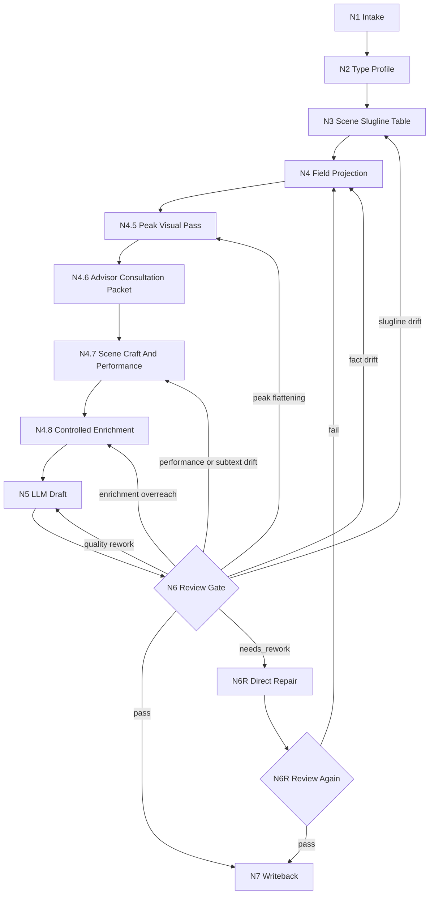

# Directing Workflow

## Business Requirement Analysis

| slot | value |
| --- | --- |
| `business_goal` | 将逐集小说原文投影为忠实、可拍、可分组的编导稿 |
| `business_object` | `projects/aigc/<项目名>/1-分集/第N集.md` |
| `constraint_profile` | 原文信息量保真、对白冻结、声画配对、slugline 稳定、controlled enrichment 留证、LLM-first、subagents 监制顾问上下文沉淀 |
| `success_criteria` | 输出能完整承接上游，并可被下游分组/摄影/设计消费 |
| `non_goals` | 不做分镜组切分、不生成图像提示词、不重写剧情 |
| `complexity_source` | 场景解析、字段分流、声画配对、高潮画面识别、监制顾问参谋汇流、戏剧功能、潜台词、场面调度、演员任务、受控增强边界、保真与质量的优先级协调 |
| `topology_fit` | 串行主干 + 类型分支 + subagents 顾问分支 + review 回路 |

## Thinking-Action Nodes

| node_id | objective | inputs | actions | evidence | route_out | gate |
| --- | --- | --- | --- | --- | --- | --- |
| `N1-INTAKE` | 锁定项目、集号、上游正文真源 | 用户请求、项目根、`1-分集/` | 定位目标集，读取 `SKILL.md + CONTEXT.md`、项目记忆和相关预设 | `source_episode_path`、目标输出路径 | `N2-TYPE` | 上游文件可读 |
| `N2-TYPE` | 形成 `type_profile` | 上游正文结构 | 读取 `types/source-to-script-type-map.md`，判断显式场景/纯小说/系统密集/对白密集等类型 | `type_profile` | `N3-SCENE` | 改编策略不违背保真 |
| `N3-SCENE` | 解析并稳定场景 slugline | 上游段落、type_profile | 按真实地点/空间范围和日夜建立场景表；同 slugline 去重 | `scene_slugline_table` | `N4-FIELD` | 每个场景标题符合 slugline 规则 |
| `N4-FIELD` | 字段分流与声画配对 | 上游段落、场景表 | 逐段投影为声音字段、画面字段、动作、心理、系统、规则、道具、群像等 | `field_projection_map` | `N4.5-PEAK` | 字段纯度和顺序成立 |
| `N4.5-PEAK` | 高潮画面识别与强化计划 | `field_projection_map`、上游段落、质量规范 | 识别 1-3 个上游高点或最强 `micro_payoff`，锁 `source_evidence / audience_desire / promise_source / character_anchor / payoff_mode / build_up / delivery_action / satisfaction_delta / visual_payload / audio_payload / aftershock` | `peak_visual_plan` | `N4.6-ADVISOR` | 高点可回指上游，强化不新增事实或对白 |
| `N4.6-ADVISOR` | subagents 编导监制参谋汇流 | `team.yaml`、共享顾问合同、上游正文、场景表、字段映射、高潮画面计划、项目 `MEMORY.md` 与相关 `CONTEXT/` | 启动或按阻断报告处理 team.yaml 中明确的监制组相关智能顾问团；要求顾问代入专业视角和个人风格，对结构投影、场景目的、表演任务、声画承托、高潮兑现和保真风险提出参谋指导；主 agent 汇流为后续任务上下文 | `advisor_consultation_packet` 或降级报告 | `N4.7-CRAFT` | packet 已包含 roster 来源、问题类型、可执行指导、风险提示和 `execution_brief` |
| `N4.7-CRAFT` | 场景戏剧功能、潜台词与演员任务设计 | 场景表、字段映射、高潮画面计划、`advisor_consultation_packet`、`references/performance-and-scene-craft-contract.md` | 为关键场景形成 `entry_state / pressure_source / active_want / obstacle / turning_point / exit_state`；把心理、潜台词、关系变化转成表演任务、场面调度、沉默反应和道具/视线行为，并规划如何内嵌到对应剧本句段 | `scene_dramatic_map`、`performance_task_map`、`blocking_power_map`、`integration_targets` | `N4.8-ENRICH` | 不新增事实、对白、事件顺序或摄影越权信息；表演任务可执行，且不作为场景末尾总结块 |
| `N4.8-ENRICH` | B 路线受控增强判定与留证 | `scene_dramatic_map`、`performance_task_map`、`peak_visual_plan`、上游正文、`references/controlled-enrichment-contract.md` | 判断是否需要 `controlled_enrichment`；只允许补环境、群体反应、表演外显、场面调度、声音/道具/余波承托；为每个新增项记录 `source_anchor / added_detail / target_field / risk_check` | `controlled_enrichment_ledger` 或 `enrichment_mode: none` | `N5-DRAFT` | 每个新增项有上游锚点；无新增对白、事件、因果、规则或线索 |
| `N5-DRAFT` | LLM 直出逐集编导稿 | 场景表、字段映射、高潮画面计划、`advisor_consultation_packet`、`scene_dramatic_map`、`performance_task_map`、`integration_targets`、`controlled_enrichment_ledger` | 写入 frontmatter、`【剧本正文】`、场景标题和字段化正文，并把顾问参谋、戏剧功能、表演任务和受控增强上下文拆入对应句段但不改写上游真源 | `第N集.md` 草稿 | `N6-REVIEW` | 未使用脚本主创；顾问、craft 和 enrichment 上下文未越权；无场景末尾总结块 |
| `N6-REVIEW` | 保真、对白、声画、slugline 与质量门禁 | candidate 草稿、上游正文、`review/review-contract.md` | 运行机械校验或人工 review；定位阻断项和 source owner | 校验结果、问题清单、repair targets | `N6R-DIRECT-REPAIR` 或 `N7-WRITEBACK` | 无阻断项才可写回 |
| `N6R-DIRECT-REPAIR` | 阶段内直接修复阻断项 | `repair targets`、candidate 草稿、上游正文 | 最小修复字段投影、声画配对、slugline、具像化、声音本体、高点承托或格式证据；不改上游事实和对白 | repaired draft、repair actions | `N6R-REVIEW-AGAIN` | 修复范围不越权 |
| `N6R-REVIEW-AGAIN` | 复审修复稿 | repaired draft、上游正文、repair actions | 复跑阻断 gate；通过则准入写回，失败则回最早责任节点 | re-review verdict | `N7-WRITEBACK` 或 `N3/N4/N4.5/N4.7/N5/N6R` | 复审通过或明确阻断 |
| `N7-WRITEBACK` | 落盘与报告 | 最终编导稿、校验证据 | 写入 `2-编导/第N集.md` 和 `执行报告.md` | 文件路径、verdict | done | 输出路径和报告完整 |

## Branch Rules

- 若 `type_profile.dialogue_dense == true`，先建立对白原文清单，再写声画配对。
- 若 `type_profile.system_rule_dense == true`，优先使用 `系统画面`、`规则显影`、`旁白（系统提示）` 和 `道具特写`。
- 若 `type_profile.inner_pressure_dense == true`，优先使用 `独白`、`内心独白`、`心理反应` 与 `表演提示`，不得把内视塞入 `动作画面`。
- 若 `type_profile.single_location_multi_beat == true`，必须先建立 slugline 去重表，避免 beat 变化导致重复场景标题。
- 若上游出现行动结果、认知翻转、关系暖点、规则显影、奇观、怪异落点或高超对决，必须进入 `N4.5-PEAK`；强化落入既有字段，不新增 `高潮画面` 字段作为第二解析体系。
- 若启动 subagents 模式，`N4.6-ADVISOR` 必须在 `N4.7-CRAFT`、`N4.8-ENRICH` 与 `N5-DRAFT` 前完成；顾问参谋只转化为 `advisor_consultation_packet` 上下文，不直接写正文，不替换上游事实、对白或事件顺序。
- 若上游存在心理变化、试探、隐瞒、信任变化、权力压迫、沉默反应或关系转折，必须进入 `N4.7-CRAFT`，把它们转成表演任务、场面调度、道具/视线行为或沉默余波，不新增对白。
- 若用户要求“更影视化/适当新增可拍承托”，或 craft/peak pass 发现表现层承托不足，进入 `N4.8-ENRICH`；B 路线只允许非剧情性承托新增，必须产出 `controlled_enrichment_ledger`。

## Failure Loops

| symptom | route_back |
| --- | --- |
| 上游事实缺失或顺序漂移 | `N4-FIELD` |
| 对白不保真 | `N5-DRAFT` |
| 声画未配对或混写 | `N4-FIELD` |
| 上游高点被压平成普通叙述，或强化时新增事实 | `N4.5-PEAK` |
| slugline 重复编号 | `N3-SCENE` |
| subagents 启用但缺 team.yaml 监制顾问请教、个人风格参谋或上下文沉淀 | `N4.6-ADVISOR` |
| 心理、潜台词或权力关系仍是解释句，演员不可执行，或在场景末尾总结式列出 | `N4.7-CRAFT` |
| 沉默和反应被新增对白替代，或场面调度写成摄影方案 | `N4.7-CRAFT` |
| controlled enrichment 新增项缺少上游锚点，或新增了对白/事件/因果/规则 | `N4.8-ENRICH` |
| 质量不足但保真通过 | `N5-DRAFT` |
| review 阻断项可在本阶段修复 | `N6R-DIRECT-REPAIR` |
| 修复后复审仍失败 | 回到最早责任节点：`N3-SCENE` / `N4-FIELD` / `N4.5-PEAK` / `N4.7-CRAFT` / `N4.8-ENRICH` / `N5-DRAFT` |

## Mermaid

