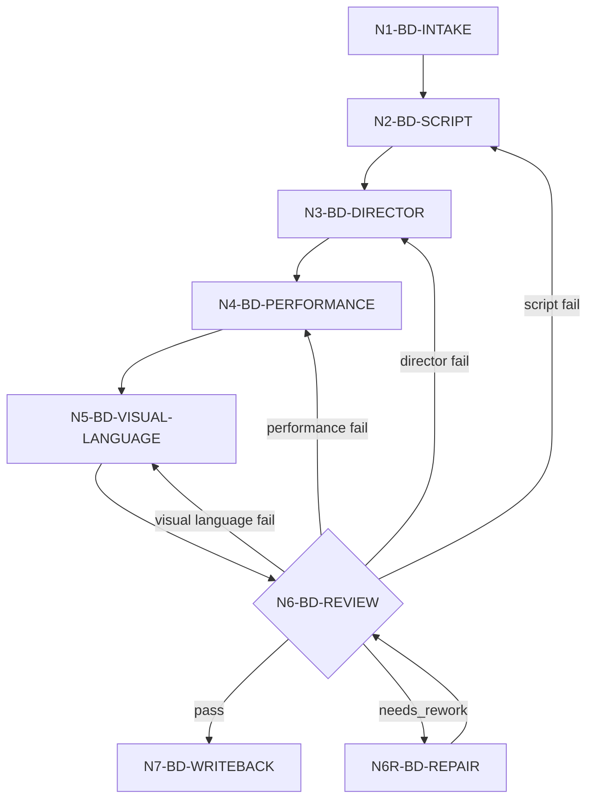

# Writing-Directing Workflow

本文件定义 `2-编导` 的总执行拓扑。`2-编导` script layer、director layer、performance layer 的步骤不再作为独立阶段串行写回，而是作为本阶段内部三层证据链汇流到同一个 `2-编导/第N集.md`。

## Business Requirement Analysis

| slot | value |
| --- | --- |
| `business_goal` | 将逐集小说原文转成保真、可拍、可演、可听、可被 `3-运动` 强化并继续被 `4-摄影` 消费的编导稿 |
| `business_object` | `projects/aigc/<项目名>/1-分集/第N集.md` |
| `constraint_profile` | 保真、对白冻结、声画配对、客观叙事派生语音受控、导演判断不改事实、表演工艺不改对白、全稿画面化语言、LLM-first |
| `success_criteria` | 输出唯一 `2-编导/第N集.md`，同时包含 script/director/performance 三层证据、场景字段证据索引和结构化 `3-运动` handoff，且没有旧 3/4 新真源 |
| `non_goals` | 不写分镜明细、不写图像提示词、不改上游分集、不生成旧阶段主稿 |
| `topology_fit` | 串行三层主干 + 初始化综合旁路 + review 修复回路 |

## Integration Invariants

| invariant | design requirement | verification |
| --- | --- | --- |
| 单候选体 | `N2/N3/N4/N5` 持续改写同一个 `candidate_writing_directing`，不产出并列主稿 | `output_path_check` 只能指向 `2-编导/第N集.md` |
| 连续画面化 | 画面化语言从 `N2-BD-SCRIPT` 开始随字段生成同步发生，`N5` 只做全稿压实 | 每层 evidence 都有可见/可听/可演正文落点 |
| 场景字段证据 | 关键判断必须进入 `scene_field_evidence_index`，带 `source_anchor`、`target_field`、`embedded_in_text` 和 `repair_owner` | `GATE-BD-16` |
| 下游交接 | `N5/N7` 产出 `visual_unit_candidate_map` 和 `motion_enrichment_handoff`，供 `3-运动` 强化角色运动并继续交给 `4-摄影` | `GATE-BD-18` |
| 不越权摄影 | 编导稿只提供画面性句子、表演状态、空间关系和声音承托，不写机位/景别/运镜/编号/prompt | `stage_boundary_check` |

## Reference-To-Node Coverage

| reference | consumed_by | node evidence | blocking gate |
| --- | --- | --- | --- |
| `script-adaptation-contract.md` / `field-routing-and-audio-visual-contract.md` | `N2-BD-SCRIPT` | `script_layer_evidence` | `GATE-BD-02` |
| `novel-to-screen-language-contract.md` / `narration-to-voice-adaptation-contract.md` / `information-asymmetry-contract.md` / `scene-rhythm-contract.md` / `dialogue-subtext-contract.md` | `N2-BD-SCRIPT` | `novel_expression_transform_evidence`、`narration_to_voice_adaptation_map`、`information_asymmetry_map`、`scene_rhythm_profile`、`dialogue_subtext_map` | `GATE-BD-03` / `GATE-BD-19` |
| `directorial-authorship-contract.md` / `visual-aesthetic-contract.md` / `atmosphere-and-mood-contract.md` | `N3-BD-DIRECTOR` | `director_layer_evidence` | `GATE-BD-04` |
| `climax-visual-treatment-contract.md` / `anticlimax-strategy-contract.md` / `episode-final-image-contract.md` | `N3-BD-DIRECTOR` | `peak_visual_plan`、`anticlimax_directive`、`episode_final_image_plan` | `GATE-BD-05` |
| `psychological-reaction-contract.md` / `actor-performance-control-contract.md` / `performance-and-scene-craft-contract.md` | `N4-BD-PERFORMANCE` | `performance_layer_evidence` | `GATE-BD-06` |
| `character-arc-performance-contract.md` / `ensemble-performance-contract.md` / `physiological-realism-contract.md` | `N4-BD-PERFORMANCE` | `character_arc_profile`、`ensemble_layers`、`physiological_realism_evidence` | `GATE-BD-07` |
| `../_shared/concrete-visual-language-contract.md` | `N5-BD-VISUAL-LANGUAGE` / `N6-BD-REVIEW` | `concrete_visual_language_evidence` | `GATE-BD-08` |
| `review/review-contract.md` | `N6-BD-REVIEW` / `N6R-BD-REPAIR` | `review_result`、`repair_actions` | `GATE-BD-17` |
| `templates/output-template.md` | `N7-BD-WRITEBACK` | `scene_field_evidence_index`、`motion_enrichment_handoff` | `GATE-BD-16` / `GATE-BD-18` |

## Thinking-Action Node Contract

每次执行 `2-编导` 时，执行报告必须包含 `thinking_action_node_ledger`。节点记录至少包含：

| field | requirement |
| --- | --- |
| `node_id` | 稳定节点 ID，必须回指本文件节点表 |
| `judgment_question` | 当前节点先判断什么 |
| `decision` | `pass / needs_rework / blocked / routeback / not_applicable` |
| `actions_taken` | 实际投影、补证、删除、分流或回修动作 |
| `evidence_keys` | 本节点产出的证据字段或文件锚点 |
| `route_out` | 下一节点、回修节点或阻断出口 |
| `gate_status` | 通过状态；失败写 `fail_code` 和最早责任节点 |
| `source_owner` | 失败或降级时的合同 owner |

`evidence_keys` 不得只写层级名称；关键创作判断必须能回指 `scene_field_evidence_index` 中的具体 `source_anchor -> target_field -> embedded_in_text`。

## Thinking-Action Nodes

| node_id | objective | inputs | actions | evidence | route_out | gate |
| --- | --- | --- | --- | --- | --- | --- |
| `N1-BD-INTAKE` | 锁定项目、集号、上游正文真源和加载边界 | 用户请求、项目根、`1-分集/` | 读取技能和项目上下文，建立 reference load manifest 与证据索引骨架 | `input_lock`、`source_episode_path`、`scene_field_evidence_index` | `N2-BD-SCRIPT` | `GATE-BD-01` |
| `N2-BD-SCRIPT` | 完成保真剧本化和基础声画字段 | 上游正文、script refs、类型画像 | slugline、字段分流、对白冻结、小说转译、客观叙事派生语音裁决、信息差、节奏、潜台词、长对白节拍；同步记录字段落点 | `script_layer_evidence`、`narration_to_voice_adaptation_map`、`scene_field_evidence_index` | `N3-BD-DIRECTOR` | `GATE-BD-02` / `GATE-BD-03` / `GATE-BD-19` |
| `N3-BD-DIRECTOR` | 注入导演级戏剧和视觉判断 | script evidence、director refs、north star | 戏剧问题、人物压力、观众位置、视觉主轴、氛围、声音、高潮/反高潮、尾钩；同步写入可拍锚点 | `director_layer_evidence`、`scene_field_evidence_index` | `N4-BD-PERFORMANCE` | `GATE-BD-04` / `GATE-BD-05` |
| `N4-BD-PERFORMANCE` | 把导演判断转成演员可执行表演 | director evidence、performance refs | 心理反应、五层表演、台词交付、潜台词行为、调度、沉默、角色弧线、群戏、生理真实性；同步写入行为锚点 | `performance_layer_evidence`、`scene_field_evidence_index` | `N5-BD-VISUAL-LANGUAGE` | `GATE-BD-06` / `GATE-BD-07` |
| `N5-BD-VISUAL-LANGUAGE` | 全稿具像画面语言审查 | candidate 编导稿、共享具像语言合同 | 清除抽象、概念、解释和内部规则句，把判断投到可见/可听/可演锚点，形成摄影可消费画面单元候选 | `concrete_visual_language_evidence`、`visual_unit_candidate_map` | `N6-BD-REVIEW` | `GATE-BD-08` |
| `N6-BD-REVIEW` | 阶段末审查 | candidate、上游真源、review contract | 执行 gate，映射 finding 到最早责任节点 | `review_result`、`gate_to_node_repair_map` | `N6R-BD-REPAIR` or `N7-BD-WRITEBACK` | `GATE-BD-17` |
| `N6R-BD-REPAIR` | 本阶段最小修复 | findings、candidate、责任节点证据 | 修字段、具像化、导演/表演内嵌、报告证据；不改事实和对白 | `repair_actions`、`re_review_verdict` | `N6-BD-REVIEW` | 修复不越权 |
| `N7-BD-WRITEBACK` | 写回 canonical 编导稿和报告 | final 编导稿、证据、review pass、`visual_unit_candidate_map` | 写入 `2-编导/第N集.md` 与 `执行报告.md`，报告记录结构化 `motion_enrichment_handoff`，并可保留后续 `cinematography_handoff` | `writeback_result`、`motion_enrichment_handoff` | done | `GATE-BD-18` |

## Branch Rules

- 若上游是对白密集场景，先锁 `long_dialogue_beat_map`，再进入台词交付，不得先凭表演感觉重切台词。
- 若上游客观叙事具备语音化潜力，先按 `narration-to-voice-adaptation-contract.md` 判定是否可转对白/独白；不通过 gate 的叙事只能画面化、旁白化或留白，不得由 director/performance layer 再补成新台词。
- 若 director layer 需要受控增强，只能新增表现层承托，并记录 `controlled_enrichment_ledger`；任何新增剧情、对白、因果或规则必须阻断。
- 若 performance layer 出现机位、景别、运镜或分镜编号，删除并改写为人物站位、距离、声线、呼吸和动作链。
- 若 visual language pass 发现概念标签无法投到具体声画，回到最早责任节点，不允许用解释性总结交付。
- 若证据只有层级摘要，没有 `source_anchor`、`target_field` 或 `embedded_in_text`，回到最早产生该判断的节点补证。
- 若 `visual_unit_candidate_map` 无法说明哪些正文句子可被 `3-运动` 强化并继续被 `4-摄影` 消费，回到 `N5-BD-VISUAL-LANGUAGE` 补齐；若其中出现机位、景别、运镜、编号或 prompt，按越权删除。
- 若历史 director layer 或 performance layer 产物作为参考输入，只能作为只读 legacy evidence，不得覆盖 `1-分集` 和本阶段合同。

## Failure Loops

| symptom | route_back |
| --- | --- |
| 上游事实缺失、顺序漂移、对白不保真 | `N2-BD-SCRIPT` |
| 小说解释句、抽象心理、概括叙述未画面化，或客观叙事派生语音无证据/越权 | `N2-BD-SCRIPT` |
| 导演判断只有审美词，没有人物压力、观众位置或可拍策略 | `N3-BD-DIRECTOR` |
| 视觉主轴、氛围、声音或尾钩新增剧情事实 | `N3-BD-DIRECTOR` |
| 心理反应、潜台词、权力关系写成解释句 | `N4-BD-PERFORMANCE` |
| 台词表演改写了引号内对白 | `N4-BD-PERFORMANCE` |
| 全稿仍有概念标签或内部规则句 | `N5-BD-VISUAL-LANGUAGE` |
| 报告证据缺少场景字段锚点 | 产生该判断的最早节点 |
| 摄影交接没有结构化画面单元候选 | `N5-BD-VISUAL-LANGUAGE` |
| review 阻断项可在本阶段修复 | `N6R-BD-REPAIR` |
| 修复后复审仍失败 | 回最早责任节点或 blocked |

## Mermaid

