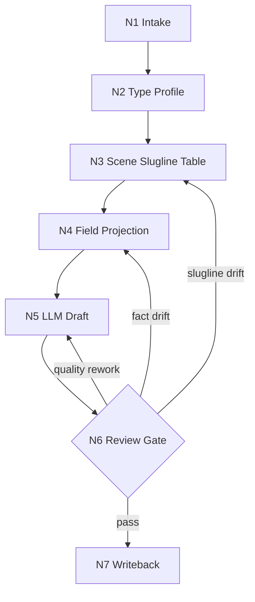

# Directing Workflow

## Business Requirement Analysis

| slot | value |
| --- | --- |
| `business_goal` | 将逐集小说原文投影为忠实、可拍、可分组的编导稿 |
| `business_object` | `projects/aigc/<项目名>/1-分集/第N集.md` |
| `constraint_profile` | 原文信息量保真、对白冻结、声画配对、slugline 稳定、LLM-first |
| `success_criteria` | 输出能完整承接上游，并可被下游分组/摄影/设计消费 |
| `non_goals` | 不做分镜组切分、不生成图像提示词、不重写剧情 |
| `complexity_source` | 场景解析、字段分流、声画配对、保真与质量的优先级协调 |
| `topology_fit` | 串行主干 + 类型分支 + review 回路 |

## Thinking-Action Nodes

| node_id | objective | inputs | actions | evidence | route_out | gate |
| --- | --- | --- | --- | --- | --- | --- |
| `N1-INTAKE` | 锁定项目、集号、上游正文真源 | 用户请求、项目根、`1-分集/` | 定位目标集，读取 `SKILL.md + CONTEXT.md`、项目记忆和相关预设 | `source_episode_path`、目标输出路径 | `N2-TYPE` | 上游文件可读 |
| `N2-TYPE` | 形成 `type_profile` | 上游正文结构 | 读取 `types/source-to-script-type-map.md`，判断显式场景/纯小说/系统密集/对白密集等类型 | `type_profile` | `N3-SCENE` | 改编策略不违背保真 |
| `N3-SCENE` | 解析并稳定场景 slugline | 上游段落、type_profile | 按真实地点/空间范围和日夜建立场景表；同 slugline 去重 | `scene_slugline_table` | `N4-FIELD` | 每个场景标题符合 slugline 规则 |
| `N4-FIELD` | 字段分流与声画配对 | 上游段落、场景表 | 逐段投影为声音字段、画面字段、动作、心理、系统、规则、道具、群像等 | `field_projection_map` | `N5-DRAFT` | 字段纯度和顺序成立 |
| `N5-DRAFT` | LLM 直出逐集编导稿 | 场景表、字段映射、质量规范 | 写入 frontmatter、`【剧本正文】`、场景标题和字段化正文 | `第N集.md` 草稿 | `N6-REVIEW` | 未使用脚本主创 |
| `N6-REVIEW` | 保真、对白、声画、slugline 与质量门禁 | 草稿、上游正文 | 运行机械校验或人工 review；修复阻断项 | 校验结果、问题清单 | `N7-WRITEBACK` 或 `N4-FIELD` | 阻断项清零 |
| `N7-WRITEBACK` | 落盘与报告 | 最终编导稿、校验证据 | 写入 `2-编导/第N集.md` 和 `执行报告.md` | 文件路径、verdict | done | 输出路径和报告完整 |

## Branch Rules

- 若 `type_profile.dialogue_dense == true`，先建立对白原文清单，再写声画配对。
- 若 `type_profile.system_rule_dense == true`，优先使用 `系统画面`、`规则显影`、`旁白（系统提示）` 和 `道具特写`。
- 若 `type_profile.inner_pressure_dense == true`，优先使用 `独白`、`内心独白`、`心理反应` 与 `表演提示`，不得把内视塞入 `动作画面`。
- 若 `type_profile.single_location_multi_beat == true`，必须先建立 slugline 去重表，避免 beat 变化导致重复场景标题。

## Failure Loops

| symptom | route_back |
| --- | --- |
| 上游事实缺失或顺序漂移 | `N4-FIELD` |
| 对白不保真 | `N5-DRAFT` |
| 声画未配对或混写 | `N4-FIELD` |
| slugline 重复编号 | `N3-SCENE` |
| 质量不足但保真通过 | `N5-DRAFT` |

## Mermaid

