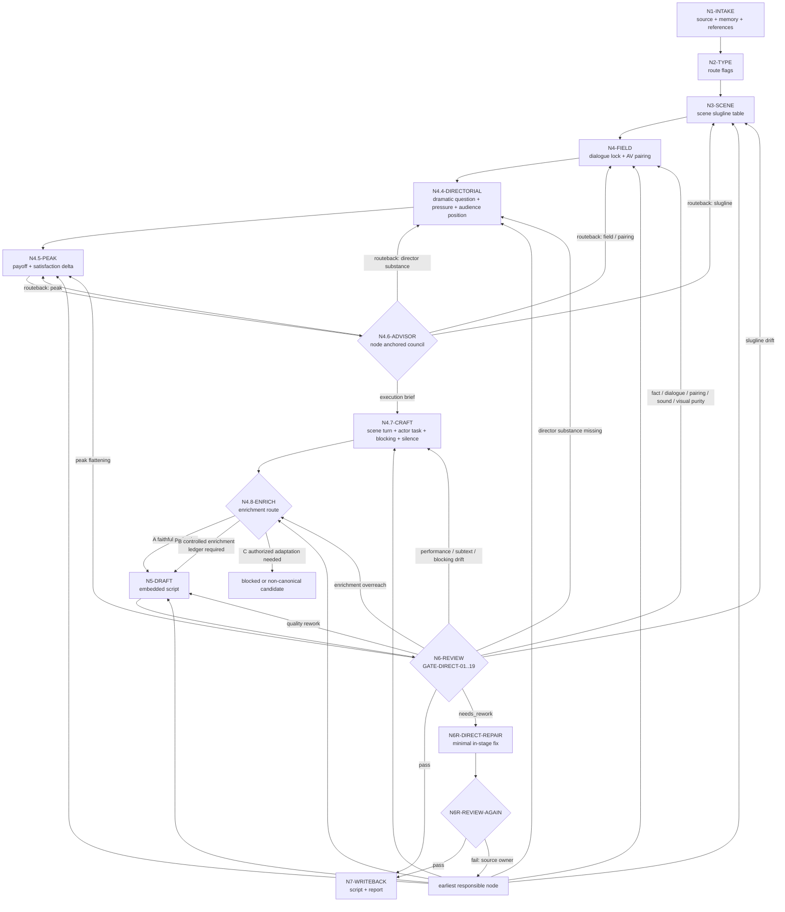
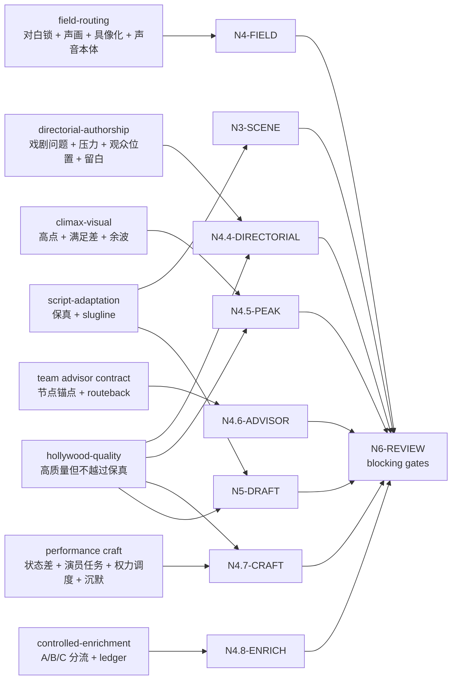

# Directing Workflow

## Business Requirement Analysis

| slot | value |
| --- | --- |
| `business_goal` | 将逐集小说原文投影为忠实、可拍、可分组的编导稿 |
| `business_object` | `projects/aigc/<项目名>/1-分集/第N集.md` |
| `constraint_profile` | 原文信息量保真、对白冻结、声画配对、slugline 稳定、编导创作内核、高潮兑现、场景状态差、表演/调度内嵌、controlled enrichment 留证、LLM-first、subagents 监制顾问上下文沉淀 |
| `success_criteria` | 输出能完整承接上游，且把小说原文中已有事件、关系、心理、信息差和高点转成导演、演员、声音与下游分组可执行的剧本正文 |
| `non_goals` | 不做分镜组切分、不生成图像提示词、不重写剧情 |
| `complexity_source` | 场景解析、字段分流、声画配对、编导创作内核、高潮画面识别、监制顾问参谋汇流、戏剧功能、潜台词、场面调度、演员任务、受控增强边界、保真与质量的优先级协调 |
| `topology_fit` | 串行主干 + 类型分支 + subagents 顾问分支 + review 回路 |

## Reference-To-Node Coverage

| reference | consumed_by | node evidence | blocking gate |
| --- | --- | --- | --- |
| `references/script-adaptation-contract.md` | `N1-INTAKE` / `N3-SCENE` / `N5-DRAFT` / `N6-REVIEW` | `source_episode_path`、`scene_slugline_table`、`faithful_projection_trace`、frontmatter | `FAIL-SOURCE` / `FAIL-FAITHFULNESS` / `FAIL-SLUGLINE` |
| `references/field-routing-and-audio-visual-contract.md` | `N4-FIELD` / `N5-DRAFT` / `N6-REVIEW` | `dialogue_lock_map`、`audio_visual_pairing_map`、`concrete_visual_risk_map`、`sound_literal_risk_map` | `FAIL-DIALOGUE` / `FAIL-PAIRING` / `FAIL-ACTION-PURITY` / `FAIL-CONCRETE-VISUAL` / `FAIL-SOUND-LITERAL` |
| `references/directorial-authorship-contract.md` | `N4.4-DIRECTORIAL` / `N4.5-PEAK` / `N4.6-ADVISOR` / `N4.7-CRAFT` / `N5-DRAFT` | `director_substance_plan`、`adaptation_payload`、`director_substance_evidence` | `FAIL-DIRECTOR-SUBSTANCE` |
| `references/climax-visual-treatment-contract.md` | `N4.5-PEAK` / `N5-DRAFT` / `N6-REVIEW` | `peak_visual_plan`、`peak_visual_candidates`、`micro_payoff`、`cost_or_aftershock` | `FAIL-PEAK-VISUAL` |
| `references/performance-and-scene-craft-contract.md` | `N4.7-CRAFT` / `N5-DRAFT` / `N6-REVIEW` | `scene_dramatic_map`、`performance_task_map`、`blocking_power_map`、`integration_targets` | `FAIL-SCENE-TURN` / `FAIL-PERFORMANCE-TASK` / `FAIL-CINEMATOGRAPHY-OVERREACH` / `FAIL-PERFORMANCE-SUMMARY-BLOCK` |
| `references/controlled-enrichment-contract.md` | `N4.8-ENRICH` / `N5-DRAFT` / `N6-REVIEW` | `enrichment_route_decision`、`controlled_enrichment_ledger` | `FAIL-CONTROLLED-ENRICHMENT` |
| `references/hollywood-quality-spec.md` | `N4.4-DIRECTORIAL` / `N4.5-PEAK` / `N4.7-CRAFT` / `N5-DRAFT` / `N6-REVIEW` | `hollywood_quality_notes`、`embedded_craft_targets`、`quality_rework_targets` | `hollywood_quality: needs_rework` |
| `../_shared/team-advisor-consultation-contract.md` | `N4.6-ADVISOR` / `N6-REVIEW` | `advisor_consultation_packet`、`advisor_routeback_targets`、`downgrade` | `FAIL-ADVISOR-CONSULT` |

## Thinking-Action Nodes

| node_id | objective | inputs | actions | evidence | route_out | gate |
| --- | --- | --- | --- | --- | --- | --- |
| `N1-INTAKE` | 锁定项目、集号、上游正文真源和本轮加载边界 | 用户请求、项目根、`1-分集/` | 定位目标集，读取 `SKILL.md + CONTEXT.md`、项目 `MEMORY.md`、相关 `CONTEXT/`，建立本轮 reference load manifest | `source_episode_path`、目标输出路径、`reference_load_manifest` | `N2-TYPE` | 上游文件可读，加载边界不缺失 |
| `N2-TYPE` | 形成 `type_profile` 与节点策略开关 | 上游正文结构、`types/source-to-script-type-map.md` | 判断显式场景/纯小说/系统密集/对白密集/内压密集/单地点多 beat/高点密集等类型，并标记必须增强的 pass | `type_profile`、`route_flags` | `N3-SCENE` | 改编策略不违背保真，且不会把类型策略变成剧情重写 |
| `N3-SCENE` | 解析并稳定场景 slugline | 上游段落、type_profile、`references/script-adaptation-contract.md` | 按真实地点/空间范围和日夜建立场景表；同 slugline 去重；只因真实空间/时间变化开新场景 | `scene_slugline_table`、`scene_order_trace` | `N4-FIELD` | 每个场景标题符合 slugline 规则，且场景顺序可回指上游 |
| `N4-FIELD` | 字段分流、对白冻结、声画配对与具像化预检 | 上游段落、场景表、`references/field-routing-and-audio-visual-contract.md` | 逐段投影为声音字段、画面字段、动作、心理、系统、规则、道具、群像等；建立对白原文清单；对每个声音字段绑定对应画面字段；标记抽象画面、小说内视和声音说明风险 | `field_projection_map`、`dialogue_lock_map`、`audio_visual_pairing_map`、`concrete_visual_risk_map`、`sound_literal_risk_map` | `N4.4-DIRECTORIAL` | 字段纯度、对白冻结、声画配对、顺序承接和反抽象预检成立 |
| `N4.4-DIRECTORIAL` | 编导创作内核 | `field_projection_map`、场景表、上游正文、`dialogue_lock_map`、`references/directorial-authorship-contract.md`、`references/hollywood-quality-spec.md` | 对关键场景执行 `director_substance_pass`：提炼戏剧问题、观众位置、人物主动目标、阻碍、隐藏恐惧、选择压力、进入/转折/退出状态、信息释放、表演发动机、空间/道具/声音发动机、节奏取舍和 `adaptation_payload` | `director_substance_plan`、`adaptation_payload`、`hollywood_quality_notes` | `N4.5-PEAK` | 每个关键判断能回指上游；不是漂亮改写或结构整理；无新增事实、对白、桥段或摄影越权；必须说明哪些内容该显影、该发声、该留白 |
| `N4.5-PEAK` | 高潮画面识别与强化计划 | `field_projection_map`、`director_substance_plan`、上游段落、`references/climax-visual-treatment-contract.md`、质量规范 | 识别 1-3 个上游高点或最强 `micro_payoff`，锁 `source_evidence / audience_desire / promise_source / character_anchor / payoff_mode / build_up / delivery_action / satisfaction_delta / visual_payload / audio_payload / cost_or_aftershock`；必要时标注 `payoff_variation_axis` | `peak_visual_plan`、`peak_visual_candidates`、`micro_payoff` | `N4.6-ADVISOR` | 高点可回指上游，强化只提高画面/声音/表演/空间/余波密度，不新增事实、对白、胜负、死亡、反转或因果 |
| `N4.6-ADVISOR` | subagents 编导监制参谋汇流 | `team.yaml`、共享顾问合同、上游正文、场景表、字段映射、编导创作内核、高潮画面计划、项目 `MEMORY.md`、相关 `CONTEXT/`、当前 `node_id/pass_id/gate_id` | 启动或按阻断报告处理 team.yaml 中明确的监制组相关智能顾问团；主 agent 将当前思维·执行节点的 judgment、actions、evidence、route_out、gate 与失败回路转化为顾问任务；顾问代入角色意识、创作风格和专业水准参与节点判断、执行取舍、证据补强、回修建议和风险提示；主 agent 汇流为后续任务上下文 | `advisor_consultation_packet`、`advisor_routeback_targets` 或降级报告 | `N3-SCENE` / `N4-FIELD` / `N4.4-DIRECTORIAL` / `N4.5-PEAK` / `N4.7-CRAFT` | packet 已包含 roster 来源、`node_ref/pass_ref/gate_ref/role_lens`、可执行指导、风险提示、`routeback_targets` 和 `execution_brief`；若顾问发现前置节点证据不成立，必须先回修对应节点 |
| `N4.7-CRAFT` | 场景戏剧功能、潜台词与演员任务设计 | 场景表、字段映射、`director_substance_plan`、高潮画面计划、`advisor_consultation_packet`、`references/performance-and-scene-craft-contract.md` | 执行 `scene_turn_pass / actor_task_pass / blocking_power_pass / silence_reaction_pass`；把心理、潜台词、关系变化、权力关系和沉默反应转成目标、阻碍、策略、停顿、视线、身体距离、道具动作、空间占位和声音余波，并规划内嵌目标 | `scene_dramatic_map`、`performance_task_map`、`blocking_power_map`、`silence_reaction_map`、`integration_targets`、`embedded_craft_targets` | `N4.8-ENRICH` | 不新增事实、对白、事件顺序或摄影越权信息；表演任务可执行；规划结果必须进入对应句段，不作为场景末尾总结块 |
| `N4.8-ENRICH` | B 路线受控增强判定与留证 | `scene_dramatic_map`、`performance_task_map`、`director_substance_plan`、`peak_visual_plan`、上游正文、`references/controlled-enrichment-contract.md` | 判定 `A-faithful_projection / B-controlled_enrichment / C-authorized_adaptation`；只允许 B 路线补环境、群体反应、表演外显、场面调度、声音/道具/余波承托；为每个新增项记录 `source_anchor / added_detail / target_field / purpose / risk_check` | `enrichment_route_decision`、`controlled_enrichment_ledger` 或 `enrichment_mode: none` | `N5-DRAFT` | 每个新增项有上游锚点；删掉该项后剧情事实仍完全不变；无新增对白、事件、因果、规则、线索或人物动机 |
| `N5-DRAFT` | LLM 直出逐集编导稿 | 场景表、字段映射、对白锁、`director_substance_plan`、高潮画面计划、`advisor_consultation_packet`、`scene_dramatic_map`、`performance_task_map`、`integration_targets`、`controlled_enrichment_ledger` | 写入 frontmatter、`【剧本正文】`、场景标题和字段化正文；把编导创作内核、顾问参谋、高潮承托、戏剧功能、表演任务、调度关系、沉默余波和受控增强上下文拆入对应句段但不改写上游真源 | `第N集.md` 草稿、`faithful_projection_trace` | `N6-REVIEW` | 未使用脚本主创；编导创作干货、顾问、peak、craft 和 enrichment 上下文未越权；无第二字段体系，无场景末尾总结块 |
| `N6-REVIEW` | 保真、对白、声画、slugline、编导干货与质量门禁 | candidate 草稿、上游正文、`review/review-contract.md`、各节点证据 | 运行机械校验或人工 review；逐项执行 `GATE-DIRECT-01..19`；把 finding 映射到最早责任节点和 source owner | 校验结果、问题清单、`gate_to_node_repair_map`、repair targets | `N6R-DIRECT-REPAIR` 或 `N7-WRITEBACK` | 无阻断项才可写回；质量建议不得掩盖保真、对白、声画、编导内核、表演调度或增强越权问题 |
| `N6R-DIRECT-REPAIR` | 阶段内直接修复阻断项 | `repair targets`、candidate 草稿、上游正文、责任节点证据 | 最小修复字段投影、声画配对、slugline、具像化、声音本体、高点承托、编导内核证据、表演/调度内嵌、受控增强留证或报告证据；不改上游事实和对白 | repaired draft、repair actions、updated node evidence | `N6R-REVIEW-AGAIN` | 修复范围不越权；若需要改事实/对白/事件顺序，立即 blocked |
| `N6R-REVIEW-AGAIN` | 复审修复稿 | repaired draft、上游正文、repair actions、updated node evidence | 复跑阻断 gate；通过则准入写回，失败则回最早责任节点 | re-review verdict、unresolved source owner | `N7-WRITEBACK` 或 `N3/N4/N4.4/N4.5/N4.7/N4.8/N5/N6R` | 复审通过或明确阻断 |
| `N7-WRITEBACK` | 落盘、报告和下游 handoff | 最终编导稿、校验证据、所有 planning evidence | 写入 `2-编导/第N集.md` 和 `执行报告.md`；报告记录 `director_substance_evidence`、`advisor_consultation_packet`、`controlled_enrichment_ledger`、review/repair/re-review | 文件路径、verdict、handoff status | done | 输出路径、报告证据和下游准入状态完整 |

## Branch Rules

- 若 `type_profile.dialogue_dense == true`，先建立对白原文清单，再写声画配对。
- 若 `type_profile.system_rule_dense == true`，优先使用 `系统画面`、`规则显影`、`旁白（系统提示）` 和 `道具特写`。
- 若 `type_profile.inner_pressure_dense == true`，优先使用 `独白`、`内心独白`、`心理反应` 与 `表演提示`，不得把内视塞入 `动作画面`。
- 若 `type_profile.single_location_multi_beat == true`，必须先建立 slugline 去重表，避免 beat 变化导致重复场景标题。
- 若 `dialogue_lock_map` 未建立，或 `audio_visual_pairing_map` 无法证明每条声音字段有就近画面承托，不得进入 `N4.4-DIRECTORIAL`。
- 字段分流后必须进入 `N4.4-DIRECTORIAL`；若关键场景只能得到结构、字段或漂亮改写而没有戏剧问题、人物压力、观众位置和可拍执行策略，不能进入 `N4.5-PEAK`。
- 若 `director_substance_plan` 缺少 `adaptation_payload.must_make_visible / must_make_audible / must_leave_unsaid`，视为编导判断不可执行，回到 `N4.4-DIRECTORIAL`。
- 若上游出现行动结果、认知翻转、关系暖点、规则显影、奇观、怪异落点或高超对决，必须进入 `N4.5-PEAK`；强化落入既有字段，不新增 `高潮画面` 字段作为第二解析体系。
- 若启动 subagents 模式，`N4.6-ADVISOR` 必须在 `N4.7-CRAFT`、`N4.8-ENRICH` 与 `N5-DRAFT` 前完成；顾问参谋必须绑定当前思维·执行节点并只转化为 `advisor_consultation_packet` 上下文，不直接写正文，不替换上游事实、对白或事件顺序。
- 若 `N4.6-ADVISOR` 发现前置节点证据不成立，必须产出 `advisor_routeback_targets` 并回到最早责任节点：场景/slugline 问题回 `N3-SCENE`，字段分流或声画配对问题回 `N4-FIELD`，编导创作内核空泛回 `N4.4-DIRECTORIAL`，高点识别或强化越权问题回 `N4.5-PEAK`；回修后重新进入 `N4.6-ADVISOR` 汇流，不得把前置问题仅作为 packet 建议继续下游。
- 若上游存在心理变化、试探、隐瞒、信任变化、权力压迫、沉默反应或关系转折，必须进入 `N4.7-CRAFT`，把它们转成表演任务、场面调度、道具/视线行为或沉默余波，不新增对白。
- 若 `N4.7-CRAFT` 只产出规划摘要而没有 `integration_targets / embedded_craft_targets`，不得进入 `N5-DRAFT`。
- 若用户要求“更影视化/适当新增可拍承托”，或 craft/peak pass 发现表现层承托不足，进入 `N4.8-ENRICH`；B 路线只允许非剧情性承托新增，必须产出 `controlled_enrichment_ledger`。
- 若用户要求或节点需求触发 C 路线新增对白、新桥段、新因果、新规则或新事件结果，必须阻断 canonical 写回并另行授权为候选稿，不得混入 `2-编导` 默认主线。

## Failure Loops

| symptom | route_back |
| --- | --- |
| 上游事实缺失或顺序漂移 | `N4-FIELD` |
| 对白不保真 | `N5-DRAFT` |
| 声画未配对或混写 | `N4-FIELD` |
| 编导稿只有结构规整或表达漂亮，没有戏剧问题、人物压力、观众体验或可拍执行策略 | `N4.4-DIRECTORIAL` |
| 上游高点被压平成普通叙述，或强化时新增事实 | `N4.5-PEAK` |
| slugline 重复编号 | `N3-SCENE` |
| subagents 启用但缺 team.yaml 监制顾问请教、节点锚点、个人风格参谋或上下文沉淀 | `N4.6-ADVISOR` |
| 顾问指出场景、字段、编导内核或高点前置证据不成立，但流程仍继续下游 | 最早责任节点：`N3-SCENE` / `N4-FIELD` / `N4.4-DIRECTORIAL` / `N4.5-PEAK` |
| 心理、潜台词或权力关系仍是解释句，演员不可执行，或在场景末尾总结式列出 | `N4.7-CRAFT` |
| 沉默和反应被新增对白替代，或场面调度写成摄影方案 | `N4.7-CRAFT` |
| controlled enrichment 新增项缺少上游锚点，或新增了对白/事件/因果/规则 | `N4.8-ENRICH` |
| 质量不足但保真通过 | `N5-DRAFT` |
| review 阻断项可在本阶段修复 | `N6R-DIRECT-REPAIR` |
| 修复后复审仍失败 | 回到最早责任节点：`N3-SCENE` / `N4-FIELD` / `N4.4-DIRECTORIAL` / `N4.5-PEAK` / `N4.7-CRAFT` / `N4.8-ENRICH` / `N5-DRAFT` |

## Mermaid

