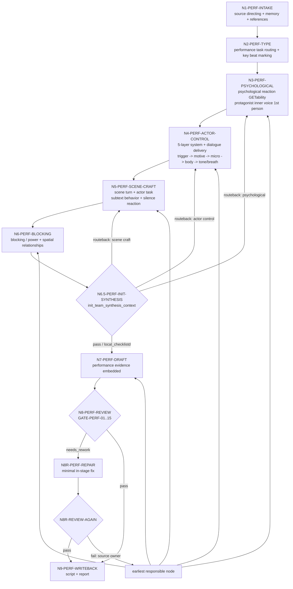
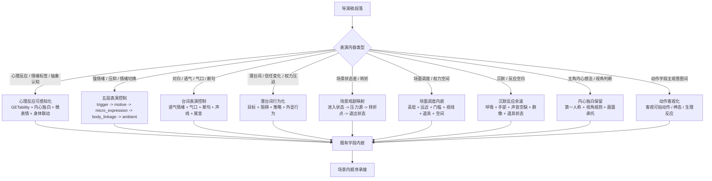

# Directing Workflow

## Business Requirement Analysis

| slot | value |
| --- | --- |
| `business_goal` | 在 `2-编导` director layer 逐集稿基础上，把导演级戏剧决策转化为可执行的演员表演材料：心理反应可感知化、演员演技五层控制、台词表演、潜台词行为化、场景戏剧映射、场面调度/权力关系、沉默反应余波和主角内心独白保留 |
| `business_object` | `projects/aigc/<项目名>/2-编导/第N集.md` |
| `constraint_profile` | 不改写剧情事实、不修改对白、不改变场景顺序和字段标签；消费上游 `long_dialogue_beat_map` 但不重新断句；只在既有字段中增加表演密度、微表情、身体联动、台词语气情绪、气口断句、长对白交付链、环境声承托和空间关系；心理反应 GETability、五层表演控制、台词表演、潜台词行为化、场景状态差、场面调度内嵌、沉默反应、主角内心独白第一人称、动作客观可拍、转场多样性、LLM-first、初始化团队综合只作冻结上下文 |
| `success_criteria` | 输出能完整承接上游导演稿，且把关键情绪 beat 的心理反应、演员任务、台词表演、潜台词、场面调度、沉默反应和主角内心独白转成演员能演、镜头能拍、观众能 GET 的材料 |
| `non_goals` | 不做对白保真检查、字段格式化、slugline 修正（归属 `2-编导` script layer）；不做导演创作内核提炼、高潮画面强化、视觉美学组织（归属 `2-编导` director layer）；不生成分镜明细、摄影方案或图像/视频资产 |
| `complexity_source` | 心理反应可感知化、五层表演控制（触发点/情绪动机/微表情/身体联动/环境声）、台词语气情绪与气口断句控制、长对白逐 beat 交付、潜台词行为化、场景戏剧映射、场面调度/权力关系、沉默反应余波、主角内心独白人称转换、动作字段客观可拍、转场多样性、表演初始化团队综合汇流、保真与表演密度的优先级协调 |
| `topology_fit` | 串行主干 + 初始化综合消费分支 + review 回路 |

## Reference-To-Node Coverage

| reference | consumed_by | node evidence | blocking gate |
| --- | --- | --- | --- |
| `references/psychological-reaction-contract.md` | `N3-PERF-PSYCHOLOGICAL` / `N7-PERF-DRAFT` / `N8-PERF-REVIEW` | `psychological_reaction_getability_map`、`protagonist_inner_voice_map`、`subjective_emotion_projection_map`、`psychological_reaction_plan`、`psychological_reaction_evidence`、`protagonist_inner_voice_evidence` | `FAIL-CONCRETE-VISUAL` / `FAIL-PERFORMANCE-TASK` / `FAIL-CREATIVE-EVIDENCE` |
| `types/type-map.md` / `types/performance-evidence-type-map.md` | `N2-PERF-TYPE` / `N8-PERF-REVIEW` | `performance_type_profile`、证据字段 owner、required shape、consumed_by | `FAIL-PERFORMANCE-TASK` / `FAIL-CREATIVE-EVIDENCE` |
| `../references/performance-style-directive-contract.md` | `N2-PERF-TYPE` / `N4-PERF-ACTOR-CONTROL` / `N7-PERF-DRAFT` / `N8-PERF-REVIEW` | `performance_style_directive`、`performance_style_consumption_evidence`、`style_axis_application` | `FAIL-PERFORMANCE-STYLE-CONSUMPTION` |
| `../_shared/audience-psychology-model-contract.md` | `N5-PERF-SCENE-CRAFT` / `N7-PERF-DRAFT` / `N8-PERF-REVIEW` | `audience_psychology_map`、`conflict_legacy_transfer`、`audience_psychology_performance_evidence`、`audience_knowledge_layering` | `FAIL-AUDIENCE-PSYCHOLOGY-CONSUMPTION` |
| `../_shared/emotional-rhythm-map-contract.md` | `N2-PERF-TYPE` / `N4-PERF-ACTOR-CONTROL` / `N7-PERF-DRAFT` / `N8-PERF-REVIEW` | `emotional_rhythm_map`、`scene_emotional_register`、`genre_emotional_coloring`、`emotional_register_performance_evidence` | `FAIL-EMOTIONAL-RHYTHM-CONSUMPTION` |
| `references/actor-performance-control-contract.md` | `N4-PERF-ACTOR-CONTROL` / `N7-PERF-DRAFT` / `N8-PERF-REVIEW` | `actor_performance_control_plan`、`emotion_motive_map`、`micro_expression_map`、`body_linkage_map`、`dialogue_delivery_map`、`long_dialogue_delivery_map`、`ambient_performance_support_map`、`actor_performance_control_evidence`、`dialogue_performance_evidence` | `FAIL-PERFORMANCE-TASK` / `FAIL-CONCRETE-VISUAL` / `FAIL-CREATIVE-EVIDENCE` / `FAIL-PERF-03A` / `FAIL-LONG-DIALOGUE-DELIVERY` |
| `references/character-arc-performance-contract.md` | `N2-PERF-TYPE` / `N4-PERF-ACTOR-CONTROL` / `N8-PERF-REVIEW` | `character_arc_profile`、`arc_stage`、`performance_evolution`、`arc_anchor_scene` | `FAIL-CHARACTER-ARC-PERFORMANCE` |
| `references/physiological-realism-contract.md` | `N4-PERF-ACTOR-CONTROL` / `N7-PERF-DRAFT` / `N8-PERF-REVIEW` | `physiological_realism_evidence`、`physiological_transition`、`physiological_causal_chain` | `FAIL-PHYSIOLOGICAL-REALISM` |
| `references/performance-and-scene-craft-contract.md` | `N4-PERF-ACTOR-CONTROL` / `N5-PERF-SCENE-CRAFT` / `N6-PERF-BLOCKING` / `N7-PERF-DRAFT` / `N8-PERF-REVIEW` | `scene_dramatic_map`、`performance_task_map`、`dialogue_performance_map`、`blocking_power_map`、`integration_targets` | `FAIL-SCENE-TURN` / `FAIL-PERFORMANCE-TASK` / `FAIL-PERF-03A` / `FAIL-CINEMATOGRAPHY-OVERREACH` / `FAIL-PERFORMANCE-SUMMARY-BLOCK` |
| `references/ensemble-performance-contract.md` | `N2-PERF-TYPE` / `N5-PERF-SCENE-CRAFT` / `N8-PERF-REVIEW` | `ensemble_layers`、`foreground_driver`、`foreground_reactor`、`midground_aware`、`background_ambient` | `FAIL-ENSEMBLE-PERFORMANCE` |
| `../_shared/concrete-visual-language-contract.md` | `N3-PERF-PSYCHOLOGICAL` / `N4-PERF-ACTOR-CONTROL` / `N5-PERF-SCENE-CRAFT` / `N6-PERF-BLOCKING` / `N7-PERF-DRAFT` / `N8-PERF-REVIEW` | `concrete_visual_language_evidence`、`conceptual_regression_risk_map`、具像表演语言投影目标 | `FAIL-CONCRETE-PERFORMANCE-LANGUAGE` |
| `../_shared/team-advisor-consultation-contract.md` | `N6.5-PERF-INIT-SYNTHESIS` / `N7-PERF-DRAFT` / `N8-PERF-REVIEW` | `init_team_synthesis_context`、`init_synthesis_node_coverage`、本地 checklist 结果 | `FAIL-PERF-13A` |

## Thinking-Action Node Contract

`steps/directing-workflow.md` 中的节点不是普通 checklist。每次执行 `2-编导` performance layer 时，主 agent 必须把每个实际经过的节点记录为 `thinking_action_node_ledger`，并让 review 能反查"判断、动作、证据、路由、gate"是否同时发生。

节点最小字段固定如下：

| field | requirement |
| --- | --- |
| `node_id` | 稳定节点 ID，必须能回指下方 `Thinking-Action Nodes` 表 |
| `judgment_question` | 当前节点必须先判断什么，不能只写"执行某 pass" |
| `decision` | 本轮判断结果；可为 `pass / needs_rework / blocked / routeback / not_applicable` |
| `actions_taken` | 实际执行动作，必须说明投影、取舍、删除、补证、分流或回修动作 |
| `evidence_keys` | 本节点产出的证据字段或文件锚点 |
| `route_out` | 下一节点、回修节点或阻断出口 |
| `gate_status` | 本节点 gate 是否通过；失败时写 `fail_code` 和最早责任节点 |
| `source_owner` | 失败或降级时对应的合同 owner，例如 `psychological-reaction`、`actor-performance-control`、`performance-and-scene-craft`、`review` |

节点退化判定：

- 只有动作描述、没有 `judgment_question`，视为 checklist 退化。
- 只有"已优化/已增强/已影视化"等结论、没有 `evidence_keys`，视为证据退化。
- 只有 `route_out` 到下一步、没有失败回路，视为路由退化。
- 只在报告里列节点名、终稿正文没有对应字段内嵌，视为投影退化。
- 新增 reference、gate 或 evidence 时，必须同步更新本文件的 `Reference-To-Node Coverage`、`Thinking-Action Nodes`、`Failure Loops` 和 Mermaid。

报告中的最小形态：

```yaml
thinking_action_node_ledger:
  - node_id: "N4-PERF-ACTOR-CONTROL"
    judgment_question: "关键情绪 beat 是否仍停留在情绪标签或模板表情？五层表演控制证据是否到位？"
    decision: "pass | needs_rework | blocked | routeback | not_applicable"
    actions_taken:
      - "将上游触发点转成表层/压制/隐藏动机、微表情、身体联动、环境声和微动态限制"
    evidence_keys:
      - "actor_performance_control_evidence"
      - "integration_targets"
    route_out: "N5-PERF-SCENE-CRAFT"
    gate_status:
      passed: true
      fail_code: ""
    source_owner: "references/actor-performance-control-contract.md"
```

## Learning Integration Review Closure

本 workflow 作为 `2-编导` performance layer 的纯表演层，其核心学习型合同为 `actor-performance-control-contract.md`。

本 workflow 因此新增以下闭环：

- `N8-PERF-REVIEW` 必须检查 `thinking_action_node_ledger` 是否覆盖本轮经过的关键节点，尤其是 `N3-PERF-PSYCHOLOGICAL`、`N4-PERF-ACTOR-CONTROL`、`N5-PERF-SCENE-CRAFT`、`N7-PERF-DRAFT` 和 `N9-PERF-WRITEBACK`。
- 若新增或显著修改了学习型合同，例如 `actor-performance-control-contract.md`，必须在本轮执行报告中加入 `learning_integration_review_evidence`，说明静态接入点、真实样例或等价 smoke 检查、未覆盖风险和下一次生产运行的观察点。
- 若本轮没有真实项目剧集可运行，允许在 `learning_integration_review_evidence.status` 标注 `static_only`，但不得把它写成 fully verified；review 必须把残余风险保留在报告中。
- 后续真实表演产物一旦触发该合同，应把至少一个关键情绪 beat 的 `source_anchor -> actor_performance_control_evidence -> embedded_in_fields` 作为样例写入执行报告。

## Thinking-Action Nodes

| node_id | objective | inputs | actions | evidence | route_out | gate |
| --- | --- | --- | --- | --- | --- | --- |
| `N1-PERF-INTAKE` | 锁定项目、集号、`2-编导` director layer 和本轮加载边界 | 用户请求、项目根、`2-编导/` | 定位目标集，读取 `SKILL.md + CONTEXT.md`、项目 `MEMORY.md`、`0-初始化/north_star.yaml`、`team.yaml.init_synthesis`、相关 `CONTEXT/`，建立本轮 reference load manifest | `source_director_layer_path`、目标输出路径、`reference_load_manifest` | `N2-PERF-TYPE` | 上游 director layer 可读，加载边界不缺失；不触发 team 成员身份调用 |
| `N2-PERF-TYPE` | 形成表演类型路由、角色弧线、群戏层次、导演风格和情绪音域标记 | 导演稿字段行、上游正文、`performance_style_directive`、`emotional_rhythm_map.scene_emotional_register`、`genre_emotional_coloring`、`types/type-map.md`、`types/performance-evidence-type-map.md`、`references/psychological-reaction-contract.md`、`references/performance-and-scene-craft-contract.md`、`references/actor-performance-control-contract.md`、`references/character-arc-performance-contract.md`、`references/ensemble-performance-contract.md`、`../references/performance-style-directive-contract.md`、`../_shared/emotional-rhythm-map-contract.md` | 判断当前内容属于心理反应、情绪触发、台词表演、潜台词行为、场面调度、沉默反应还是主角内心独白；形成 `performance_type_profile`；消费导演表演风格基调，锁定角色外放度、身体性、声线和面具/真实轴；消费情绪音域与类型底色，标记哪些场景应克制、蓄压、爆发或冷却；标记角色在本集/本场的弧线阶段、变化方向和关键锚点；多人场面标记 `ensemble_layers`；标记哪些场景需要五层表演控制、哪些对白需要逐句语气情绪与气口断句控制，并锁定后续证据字段 owner；检查角色弧线阶段（arc_stage），决定本集表演强度基线；标记群戏场景的 ensemble_layers 分配；消费 emotional_rhythm_map 的 scene_emotional_register 决定表演强度层级 | `performance_type_profile`、`performance_style_consumption_evidence`、`emotional_register_performance_evidence`、`character_arc_profile`、`ensemble_layers`、`performance_task_map`、`dialogue_performance_map` | `N3-PERF-PSYCHOLOGICAL` | 类型路由不改变上游事实、对白和字段标签；导演风格、情绪音域、角色弧线和群戏层次能回指上游/导演证据；证据字段 owner 不漂移 |
| `N3-PERF-PSYCHOLOGICAL` | 心理反应可感知化（GETability、主角内心独白、主观情感投影） | 导演稿中所有 `心理反应`、情绪描述和心理解释、`references/psychological-reaction-contract.md` | 逐条检查心理反应：锁定主体、上游触发点、可见/可听/可演通道；关键心理 beat 至少两个通道；需要语言化的内容转入 `内心独白（主角）`，主角自指统一为第一人称；标记主角视角下对他人行为的判断并转入主角内心独白或主角反应；标记抽象解释风险并转译为微表情、肢体动作、生理反应、呼吸、声音、道具或空间变化 | `psychological_reaction_plan`、`psychological_reaction_evidence`、`psychological_reaction_getability_map`、`protagonist_inner_voice_map`、`protagonist_inner_voice_evidence` | `N4-PERF-ACTOR-CONTROL` | 每条心理反应有主体、触发点、至少一个 GETability 通道；无"意识到/觉得/明白/崩溃/震惊/害怕"等抽象解释；主角自指为第一人称；主角视角判断不写客观概括 |
| `N4-PERF-ACTOR-CONTROL` | 演员表演控制（导演风格 + 情绪音域 + 角色弧线 + 生理真实性 + 五层系统 + 台词表演） | 关键情绪 beat、所有对白字段、上游 `long_dialogue_beat_map`、`performance_style_consumption_evidence`、`emotional_register_performance_evidence`、`character_arc_profile`、`performance_task_map`、`dialogue_performance_map`、`psychological_reaction_evidence`、`references/actor-performance-control-contract.md`、`references/character-arc-performance-contract.md`、`references/physiological-realism-contract.md`、`references/performance-and-scene-craft-contract.md` | 对关键情绪 beat 建立 `trigger -> surface_emotion / suppressed_emotion / hidden_motive -> micro_expression -> body_linkage -> ambient_support -> micro_dynamics`；按导演表演风格限制外放度、身体性、声线和面具/真实轴；按场景情绪音域决定哪些层级要完整展开、哪些应克制留白；消费 `character_arc_profile` 决定表演强度、压抑/释放方向和本集变化；检查大哭、怒、跑、怕、惊、冷热等强状态后的生理残留与过渡；对每段对白建立 `tone_state -> emotional_pressure -> breath_point -> pause_pattern -> voice/ending -> paired_body/opponent_reaction`；对上游长对白节拍建立 `long_dialogue_delivery_map`，逐 beat 标注气口/连续气息、停顿、重音、尾音、身体联动和对手反应；锁定上游触发点、情绪动机、微表情变量、非面部身体变量、台词语气情绪、气口断句和环境声或微动态限制；对情绪状态切换执行生理真实性检查：愤怒到平静需要过渡、哭泣到正常需要恢复；消费 character_arc_profile 决定五层控制的方向性（角色在弧线上往哪个方向变化） | `actor_performance_control_plan`、`style_axis_application`、`character_arc_performance_evidence`、`physiological_realism_evidence`、`emotion_motive_map`、`micro_expression_map`、`body_linkage_map`、`dialogue_delivery_map`、`long_dialogue_delivery_map`、`dialogue_performance_evidence`、`ambient_performance_support_map`、`actor_performance_control_evidence` | `N5-PERF-SCENE-CRAFT` | 关键情绪 beat 不停留在情绪标签或模板表情；导演风格、情绪音域、角色弧线、五层证据和生理过渡齐全；每段对白有语气情绪状态，关键对白有气口/断句/声线/尾音或对手反应承托；长对白逐 beat 有交付链且不改写/重切上游文本；取舍可回指上游触发点 |
| `N5-PERF-SCENE-CRAFT` | 场景戏剧映射 + 观众知情层级 + 演员任务 + 群戏层次 + 潜台词行为化 + 沉默反应 | 场景表、字段映射、`actor_performance_control_plan`、`ensemble_layers`、`psychological_reaction_evidence`、`audience_psychology_map`、`conflict_legacy_transfer`、上游正文、`references/performance-and-scene-craft-contract.md`、`references/ensemble-performance-contract.md`、`../_shared/audience-psychology-model-contract.md` | 执行 `scene_turn_pass / actor_task_pass / audience_knowledge_layering_pass / ensemble_performance_pass / silence_reaction_pass / subtext_behavior_pass`；把潜台词、信任变化、权力压迫和未出口对白转成带目的的行为（目标+阻碍+策略+外显）；根据观众与角色知情差决定角色是否表现”多知道/少知道/误判/隐瞒”，并用沉默、迟疑、抢话、错拍反应或群戏注意力差体现；群戏按 `foreground_driver / foreground_reactor / midground_aware / background_ambient` 分配注意力、信息量和强度；把沉默和反应空白写成可见/可听状态变化；为每个关键场景锁定进入状态、压力源、转折点和退出状态；转场多元选择，不连续依赖视线动作；群戏场景按 ensemble_layers 分配表演任务：前景五层、反应者三层、知觉者一层、背景受控动态限制；标记角色在群戏中的 layer_shift 时机（何时从背景升至中景或前景） | `scene_dramatic_map`、`performance_task_map`、`audience_psychology_performance_evidence`、`ensemble_performance_evidence`、`silence_reaction_map`、`monologue_budget_evidence`、`integration_targets` | `N6-PERF-BLOCKING` | 不新增事实、对白、事件顺序或摄影越权信息；观众心理消费真实影响知情层级和表演张力；群戏有层次而非人人同强度；潜台词转为带目的行为而非情绪结论；沉默用呼吸/手部/道具/群像/声音空缺/动作余波承托；场景状态差落入既有字段而非解释性新增 |
| `N6-PERF-BLOCKING` | 场面调度 / 权力关系 / 空间站位 | 场景表、空间关系、`scene_dramatic_map`、`performance_task_map`、上游正文、`references/performance-and-scene-craft-contract.md` | 执行 `blocking_power_pass`；通过高低/远近/门槛/视线/道具归属/身体距离/空间隔离表现权力关系；把 `表演提示` 和 `场面调度` 拆入对应 beat 的既有字段，不得在场景末尾以总结块列出；场面调度只写人物、空间、道具、视线和权力关系，不写摄影机位、景别、镜头运动或分镜编号 | `blocking_power_map`、`integration_targets`（更新） | `N6.5-PERF-INIT-SYNTHESIS` | 权力关系通过可拍变量表现；场面调度已拆入 beat；无场景末尾总结块；场面调度不写摄影方案 |
| `N6.5-PERF-INIT-SYNTHESIS` | 初始化团队综合汇流 | `team.yaml.init_synthesis.stage_seed_summary."2-编导"`、`init_handoff.writing_directing_seed`、`north_star.yaml.创作阶段不变量.编导`、当前 `PASS-PERF-*` / `N*-PERF-*` 节点、`performance_task_map`、项目 `MEMORY.md` 与相关 `CONTEXT/` | 只读取冻结初始化综合；主 agent 从当前思维·执行节点提取相关表演约束、风险和可执行启发，汇流为后续任务上下文；不得调用 team 成员身份、不得解析旧 stage profile、不得伪造顾问回答 | `init_team_synthesis_context` | `N7-PERF-DRAFT` | context 已包含 `synthesis_sources`、node/pass/gate 来源、可执行指导、风险提示和 `execution_brief`；缺失时记录 `not_applicable` 或 `blocked` |
| `N7-PERF-DRAFT` | LLM 直出逐集表演稿 | 场景表、字段映射、`performance_style_consumption_evidence`、`audience_psychology_performance_evidence`、`emotional_register_performance_evidence`、`monologue_budget_evidence`、`psychological_reaction_evidence`、`actor_performance_control_evidence`、`dialogue_performance_evidence`、`protagonist_inner_voice_evidence`、`objective_action_purity_evidence`、`scene_dramatic_map`、`performance_task_map`、`blocking_power_map`、`integration_targets`、`init_team_synthesis_context`、`concrete_visual_language_evidence`、`../_shared/concrete-visual-language-contract.md`、上游导演稿正文 | 在完整保留上游导演稿结构、字段标签、对白和顺序的前提下，把导演表演风格、观众知情层级、情绪音域预算、心理反应可感知化、五层表演控制、台词表演、潜台词行为化、场景状态差、场面调度权力关系、沉默反应余波和主角内心独白拆入对应句段的既有字段；每段对白标题第二项写清语气/情绪/状态，关键对白就近写气口、断句、停顿、声线、重音、尾音或对手反应；内心独白和旁白不过度挤占，能外显的心理信息优先回收到表演、动作、沉默或可感知反应；把“关系变化/权力压迫/内心崩塌/情绪复杂/演员克制”等抽象判断改写为身体、呼吸、声线、停顿、空间距离、道具互动或对手反应；吸收初始化综合上下文但不改写上游真源；模板占位和内部规则只能指导写作，不得输出到正文 | `第N集.md` 表演稿草稿、`faithful_performance_trace`、`concrete_visual_language_evidence` | `N8-PERF-REVIEW` | 不改写上游剧情事实、对白、场景标题和字段顺序；每段对白有台词表演锚点；导演风格、观众心理、情绪音域和独白预算已内嵌而不是留在报告里；表演判断以具像创作干货内嵌，不以"已执行XX pass"或抽象概念总结形式泄露；无场景末尾总结块；无第二字段体系；初始化综合上下文未越权 |
| `N8-PERF-REVIEW` | 心理反应、导演风格消费、观众心理消费、情绪节奏消费、独白预算、具像表演语言、角色弧线、生理真实性、五层表演控制、台词表演、群戏层次、潜台词行为化、场景状态差、场面调度、沉默反应、内心独白、动作纯度、初始化综合汇流、原文保真与质量门禁 | candidate 表演稿、上游导演稿正文、`review/review-contract.md`、各节点证据、`concrete_visual_language_evidence`、`init_team_synthesis_context`、`thinking_action_node_ledger`、`learning_integration_review_evidence` | 运行机械校验或人工 review；逐项执行 `GATE-PERF-01..15`；检查每个关键节点是否具备 `judgment_question / actions_taken / evidence_keys / route_out / gate_status / source_owner`；检查表演稿、初始化综合、报告证据和最终字段是否把上游画面化成果重新抽象化；把 finding 映射到最早责任节点和 source owner | 校验结果、问题清单、`thinking_action_node_ledger`、`learning_integration_review_evidence`、`gate_to_node_repair_map`、repair targets | `N8R-PERF-REPAIR` 或 `N9-PERF-WRITEBACK` | 无阻断项才可写回；质量建议不得掩盖心理反应、导演风格、观众心理、情绪节奏、独白预算、具像表演语言、角色弧线、生理真实性、五层控制、台词表演、群戏层次、潜台词、场面调度、沉默、内心独白、动作纯度、初始化综合或节点退化问题 |
| `N8R-PERF-REPAIR` | 阶段内直接修复阻断项 | `repair targets`、candidate 表演稿、上游导演稿正文、责任节点证据 | 最小修复表演密度、微表情、身体联动、台词语气情绪、气口断句、环境声、场面调度内嵌、沉默承托、内心独白人称、动作字段纯度、潜台词行为化和格式证据；不改上游剧情事实、对白和事件顺序 | repaired draft、repair actions、updated node evidence | `N8R-REVIEW-AGAIN` | 修复范围不越权；若需要改事实/对白/事件顺序，立即 blocked |
| `N8R-REVIEW-AGAIN` | 复审修复稿 | repaired draft、上游导演稿正文、repair actions、updated node evidence | 复跑阻断 gate；通过则准入写回，失败则回最早责任节点 | re-review verdict、unresolved source owner | `N9-PERF-WRITEBACK` 或 `N3-PERF-PSYCHOLOGICAL` / `N4-PERF-ACTOR-CONTROL` / `N5-PERF-SCENE-CRAFT` / `N6-PERF-BLOCKING` / `N7-PERF-DRAFT` / `N8R-PERF-REPAIR` | 复审通过或明确阻断 |
| `N9-PERF-WRITEBACK` | 落盘、报告和下游 handoff | 最终表演稿、校验证据、所有 planning evidence、`init_team_synthesis_context`、`thinking_action_node_ledger` | 写入 `2-编导/第N集.md` 和 `执行报告.md`；报告记录 `init_team_synthesis_context`、`thinking_action_node_ledger`、`learning_integration_review_evidence`、`psychological_reaction_evidence`、`actor_performance_control_evidence`、`dialogue_performance_evidence`、`protagonist_inner_voice_evidence`、`objective_action_purity_evidence`、`scene_dramatic_map`、`performance_task_map`、`blocking_power_map`、`concrete_visual_language_evidence`、`integration_targets`、review/repair/re-review | 文件路径、verdict、handoff status、node ledger status | done | 输出路径、节点 ledger、报告证据和下游准入状态完整 |

## Branch Rules

- 若 `performance_task_map` 发现关键情绪 beat 只有"愤怒/开心/难过/紧张/害羞"等标签，或只有皱眉瞪眼流泪等模板化表情，必须按 `references/actor-performance-control-contract.md` 回到 `N4-PERF-ACTOR-CONTROL` 建立 `actor_performance_control_plan`；至少明确上游触发点、情绪动机、微表情、身体联动和微动态取舍。
- 若缺少 `performance_style_consumption_evidence`，或角色外放度、身体性、声线和面具/真实轴没有回指 `2-编导` director layer 的 `performance_style_directive`，必须回到 `N2-PERF-TYPE` / `N4-PERF-ACTOR-CONTROL`。
- 若缺少 `emotional_register_performance_evidence`，或 `suppressed/cold/violent/released` 等场景被演成同一强度，必须回到 `N2-PERF-TYPE` / `N4-PERF-ACTOR-CONTROL`。
- 若关键角色没有 `character_arc_profile`，或表演强度不随本集弧线变化，必须回到 `N2-PERF-TYPE` / `N4-PERF-ACTOR-CONTROL`。
- 若强情绪、奔跑、寒冷、哭泣、恐惧或震惊之后没有生理过渡，必须回到 `N4-PERF-ACTOR-CONTROL` 补 `physiological_realism_evidence`。
- 若 `dialogue_performance_map` 发现任一 `对白（角色）` 缺少第二项，或第二项只有空泛情绪标签，或关键对白没有气口、断句、停顿、声线、重音、尾音或对手反应承托，必须回到 `N4-PERF-ACTOR-CONTROL` 补 `dialogue_performance_evidence`；若上游含 `long_dialogue_beat_map` 但缺少 `long_dialogue_delivery_map`，同样回到 `N4-PERF-ACTOR-CONTROL`；修复不得改写引号内对白。
- 若 `psychological_reaction_getability_map` 发现 `心理反应` 只能靠字段标题理解，正文没有可见/可听/可演载体，必须回到 `N3-PERF-PSYCHOLOGICAL` 转译。
- 若 `concrete_visual_language_evidence` 或 `conceptual_regression_risk_map` 发现心理、情绪、潜台词、关系、权力、演员任务、初始化综合或报告证据被写成抽象概念、心理解释、情绪标签或表演意图总结，必须回到最早责任节点：心理抽象回 `N3-PERF-PSYCHOLOGICAL`，演员控制抽象回 `N4-PERF-ACTOR-CONTROL`，潜台词/场景工艺抽象回 `N5-PERF-SCENE-CRAFT`，调度抽象回 `N6-PERF-BLOCKING`，投影抽象回 `N7-PERF-DRAFT`。
- 若 `protagonist_inner_voice_map` 发现主角视角下对他人行为的判断被写成客观第三方概括，必须回到 `N3-PERF-PSYCHOLOGICAL` 改入主角内心独白或主角反应。
- 若 `内心独白（主角）` 引号内主角自指仍为第三人称"他/她/其/角色名"，必须回到 `N3-PERF-PSYCHOLOGICAL` 统一为第一人称。
- 若潜台词、信任变化、权力压迫、未出口对白仍停留在"他不信任她""她是在试探他""两人关系发生变化"等结论句，必须回到 `N5-PERF-SCENE-CRAFT` 转为带目的的行为。
- 若缺少 `audience_psychology_performance_evidence`，或表演张力没有体现观众与角色的知情差、期待/恐惧/渴望和冲突遗产，必须回到 `N5-PERF-SCENE-CRAFT`。
- 若 `monologue_budget_evidence` 显示内心独白、旁白或解释性心理文字挤占影视呈现，必须回到 `N3-PERF-PSYCHOLOGICAL` / `N5-PERF-SCENE-CRAFT`，把可外显信息转成表演、动作、沉默或可感知反应。
- 若群戏中所有人同等强度表演，或无法区分前景行动者、前景反应者、中景知情者和背景环境参与者，必须回到 `N5-PERF-SCENE-CRAFT` 补 `ensemble_layers`。
- 若 `角色动作` / `动作画面` 混入"试图、想要、打算、意图"等主观预判词，或把"感到恶心/难受/愤怒"等主观情绪直接写入终稿，必须回到 `N5-PERF-SCENE-CRAFT` 或 `N7-PERF-DRAFT` 改成客观可拍动作、神态、语气、生理反应或主角内心独白。
- 若沉默和反应只写空白，未用呼吸、手部、道具、群像、声音空缺或动作余波承托，必须回到 `N5-PERF-SCENE-CRAFT` 补承托。
- 若连续两个 beat 以上用视线承担未出口信息或下一场压力，没有从声音、道具、群像、空间或动作中断中多元选择，必须回到 `N5-PERF-SCENE-CRAFT` 修正转场多样性。
- 若规划层 `表演提示` 或 `场面调度` 在场景末尾以总结块列出，未拆入对应 beat 的既有字段，必须回到 `N6-PERF-BLOCKING` 重新内嵌。
- 若 `场面调度` 写成摄影机位、景别、镜头运动或分镜方案，必须回到 `N6-PERF-BLOCKING` 改为人物、空间、道具、视线和权力关系。
- 若任一关键节点无法在 `thinking_action_node_ledger` 中说明 `judgment_question / actions_taken / evidence_keys / route_out / gate_status / source_owner`，不得进入 `N9-PERF-WRITEBACK`；必须回到该节点补判断、动作、证据、路由和 gate。
- 若 `N4-PERF-ACTOR-CONTROL` 只产出规划摘要而没有 `integration_targets`，不得进入 `N7-PERF-DRAFT`。
- 若初始化综合可用但缺少 `init_team_synthesis_context`，必须回到 `N6.5-PERF-INIT-SYNTHESIS`；不得把主 agent 本地顺序综合表述成 team 成员或外部 provider 调度。
- 若用户要求"C 路线"新增对白、新场景、新桥段、新因果、新规则或新事件结果，必须阻断 canonical 写回并另行授权为候选稿，不得混入 `2-编导` performance layer 默认主线。
- 若情绪状态瞬间切换没有生理过渡（如上一秒大哭下一秒平静），回到 `N4-PERF-ACTOR-CONTROL` 补生理过渡。
- 若群戏场景所有角色同等强度表演，回到 `N5-PERF-SCENE-CRAFT` 按 ensemble_layers 重新分配。
- 若角色表演跨集无变化，回到 `N2-PERF-TYPE` 检查 character_arc_profile。

## Failure Loops

| symptom | route_back |
| --- | --- |
| `心理反应` 只能靠字段标题理解，正文没有可见/可听/可演载体；只写"意识到/觉得/明白/崩溃/震惊/害怕"等抽象认知 | `N3-PERF-PSYCHOLOGICAL` |
| 表演稿、初始化综合或执行报告把心理、情绪、潜台词、关系、权力或演员任务写成抽象概念、解释性总结或表演意图，而不是具体身体、声线、呼吸、停顿、空间距离、道具互动或对手反应 | 最早责任节点：`N3-PERF-PSYCHOLOGICAL` / `N4-PERF-ACTOR-CONTROL` / `N5-PERF-SCENE-CRAFT` / `N6-PERF-BLOCKING` / `N7-PERF-DRAFT` |
| 主角视角下对他人行为的判断被写成客观第三方概括，或主角内心独白被误删 | `N3-PERF-PSYCHOLOGICAL` |
| `内心独白（主角）` 引号内主角自指仍为第三人称 | `N3-PERF-PSYCHOLOGICAL` |
| 关键情绪 beat 只有"愤怒/难过/开心/紧张/害羞"等情绪标签或皱眉/瞪眼/流泪/大笑等模板化表情，缺少上游触发点、情绪动机、微表情、身体联动、环境声或微动态限制 | `N4-PERF-ACTOR-CONTROL` |
| 表演没有接收导演层 `performance_style_directive`，角色外放度、身体性、声线或面具/真实轴像重新自由发挥 | `N2-PERF-TYPE` / `N4-PERF-ACTOR-CONTROL` |
| 表演没有接收 `emotional_rhythm_map`，每场都同强度演满或同强度克制 | `N2-PERF-TYPE` / `N4-PERF-ACTOR-CONTROL` |
| 角色每场戏都像独立重置，没有承接本集/跨集角色弧线阶段 | `N2-PERF-TYPE` / `N4-PERF-ACTOR-CONTROL` |
| 强情绪或强身体状态后立刻恢复平静，没有眼眶、呼吸、肌肉、汗、冷颤等生理残留 | `N4-PERF-ACTOR-CONTROL` |
| 五层表演控制证据缺失：无法说明触发点、无法区分表层/压制/隐藏情绪、没有微表情变量或非面部身体变量 | `N4-PERF-ACTOR-CONTROL` |
| 每段对白缺少语气/情绪/状态，或关键对白缺少气口、断句、停顿、声线、重音、尾音、对手反应承托 | `N4-PERF-ACTOR-CONTROL` |
| 上游长对白节拍没有逐 beat 气口、重音、尾音、身体联动和对手反应链，或被重新断句/合并吞并 | `N4-PERF-ACTOR-CONTROL` |
| 潜台词、信任变化、权力压迫、未出口对白仍停留在结论句，未转为带目的的行为 | `N5-PERF-SCENE-CRAFT` |
| 观众心理没有进入表演，无法看出角色知情层级、观众期待/恐惧/渴望或冲突遗产对反应强度的影响 | `N5-PERF-SCENE-CRAFT` |
| 内心独白、旁白或解释性心理文字挤占影视呈现，未回收到可见/可听/可演反应 | `N3-PERF-PSYCHOLOGICAL` / `N5-PERF-SCENE-CRAFT` |
| 群戏没有表演层次，前景、中景、背景角色注意力和信息量同等强度 | `N5-PERF-SCENE-CRAFT` |
| 沉默和反应只写空白，未用呼吸、手部、道具、群像、声音空缺或动作余波承托 | `N5-PERF-SCENE-CRAFT` |
| 连续两个 beat 以上用视线承担未出口信息，没有多元选择 | `N5-PERF-SCENE-CRAFT` |
| `角色动作` / `动作画面` 混入"试图、想要、打算、意图"等主观预判词，或把主观情绪直接写入终稿 | `N5-PERF-SCENE-CRAFT` |
| 没有 `scene_dramatic_map`，关键场景只有平铺直叙，没有状态差 | `N5-PERF-SCENE-CRAFT` |
| 权力关系只写关系结论，没有通过高低/远近/门槛/视线/道具/空间隔离表现 | `N6-PERF-BLOCKING` |
| 规划层 `表演提示` 或 `场面调度` 在场景末尾以总结块列出，未拆入对应 beat 的既有字段 | `N6-PERF-BLOCKING` |
| `场面调度` 写成摄影机位、景别、镜头运动或分镜方案 | `N6-PERF-BLOCKING` |
| 改写了上游对白、删减了剧情事实、重排了场景顺序或改变了字段标签内容 | `N7-PERF-DRAFT` |
| 内部任务说明或规则复述泄露到终稿字段正文 | `N7-PERF-DRAFT` |
| 思维·执行节点只有 checklist 动作，没有判断问题、证据、路由、gate 或 source owner | 对应最早责任节点 + `N8-PERF-REVIEW` |
| 学习型新合同只在文档中引用，没有真实样例、静态 smoke 状态或残余风险说明 | `N8-PERF-REVIEW` / `N9-PERF-WRITEBACK` |
| 初始化综合存在但缺少 `init_team_synthesis_context`，或误调用 team 身份技能/旧 stage profile | `N6.5-PERF-INIT-SYNTHESIS` |
| 为补足表演质量新增与当前主线无关的人物过往、物品来历或回忆性信息 | `N7-PERF-DRAFT` |
| 脚本或模板拼接替代 LLM 的表演工艺判断 | `N7-PERF-DRAFT` |
| 声音字段与画面字段混写，或没有就近配对 | `N7-PERF-DRAFT` |
| 质量不足但保真通过 | `N7-PERF-DRAFT` |
| review 阻断项可在本阶段修复 | `N8R-PERF-REPAIR` |
| 修复后复审仍失败 | 回到最早责任节点：`N3-PERF-PSYCHOLOGICAL` / `N4-PERF-ACTOR-CONTROL` / `N5-PERF-SCENE-CRAFT` / `N6-PERF-BLOCKING` / `N7-PERF-DRAFT` |

## Mermaid




