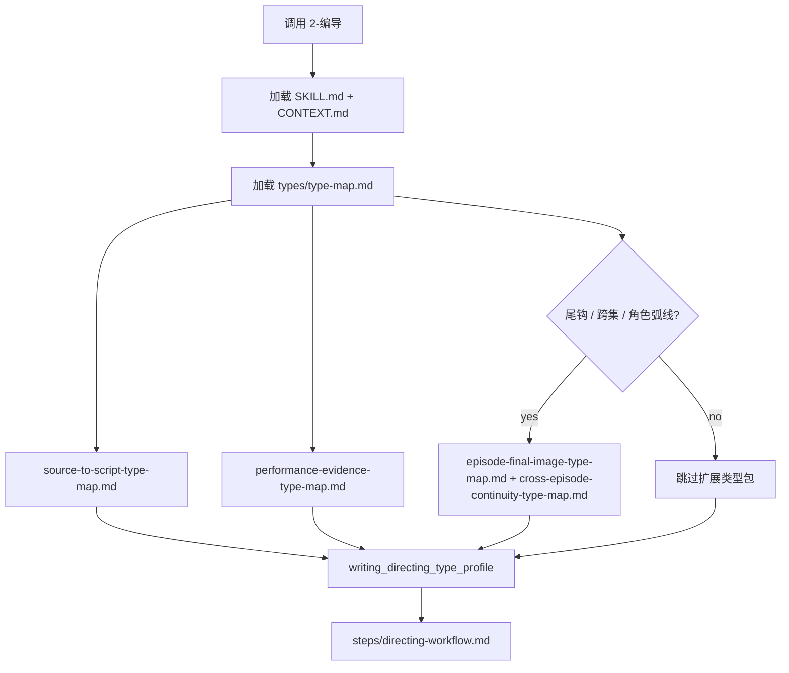

# Type Map

## Package Index

| package | role |
| --- | --- |
| `source-to-script-type-map.md` | 判断上游逐集正文到保真剧本层的投影类型、字段分流策略和修复入口 |
| `performance-evidence-type-map.md` | 统一心理反应、演员控制、台词交付、潜台词行为、场面调度和群戏证据字段 |
| `episode-final-image-type-map.md` | 判断本集是否需要终结画面、尾钩、反高潮或余波视觉处理 |
| `cross-episode-continuity-type-map.md` | 处理跨集角色弧线、视觉母题、信息承接与尾钩回调 |

## Default Package Rule

- 默认加载 `source-to-script-type-map.md` 与 `performance-evidence-type-map.md`。
- 存在尾钩、高潮、反高潮、终结画面、跨集回调、角色弧线或群戏持续关系时，额外加载 `episode-final-image-type-map.md` 与 `cross-episode-continuity-type-map.md`。
- 类型包只负责形成 `writing_directing_type_profile`；核心创作判断仍由 LLM 在 `steps/directing-workflow.md` 的 script/director/performance/visual language 节点完成。

## Loading Flow

