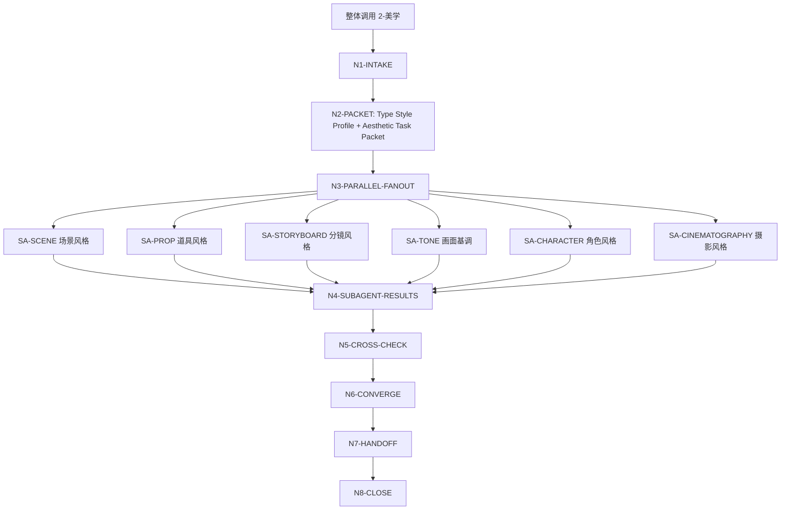
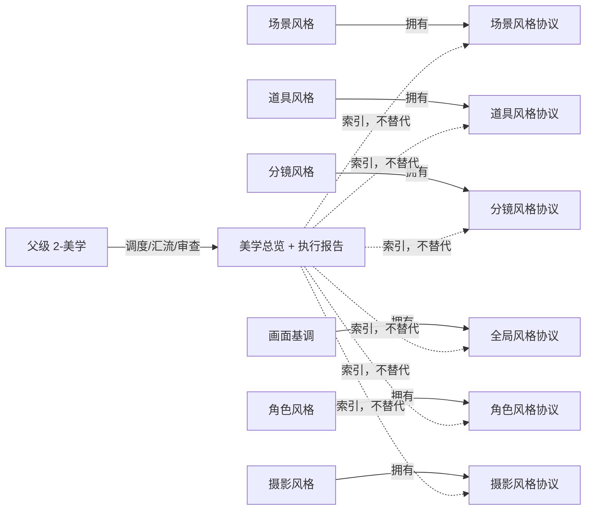

# aigc 2-美学

`2-美学` 是 AIGC 影片项目在 `1-分集` 后立即执行的题材类型与视觉美学研究配置主入口。它先从 `1-分集` 涉及的全部故事源内容中解析最佳适配题材类型、规范化题材轴、标志性元素、题材专属表现技巧和下游继承边界，写成项目级 `类型风格.md`；再把一次“整体美学设定”请求路由给 6 个同级子技能，并在父级层面完成输入包分发、并发调度、结果汇流、冲突审查和项目级交接。

当 `.agents/skills/aigc/2-美学` 作为整体调用时，必须视为同时调用以下 6 个 subagents，并分别并发执行：

1. `.agents/skills/aigc/2-美学/场景风格`
2. `.agents/skills/aigc/2-美学/道具风格`
3. `.agents/skills/aigc/2-美学/分镜风格`
4. `.agents/skills/aigc/2-美学/画面基调`
5. `.agents/skills/aigc/2-美学/角色风格`
6. `.agents/skills/aigc/2-美学/摄影风格`

本主入口不替代任何子技能的局部合同，不直接创作 6 类风格正文，也不把子技能输出压缩成父级单稿。父级只拥有整体路由、输入共享、汇流检查、交接索引和冲突报告权。

## Context Loading Contract

- 每次调用本技能时，必须同时加载同目录 `CONTEXT.md`。
- 每次调用 `$aigc-aesthetic-suite` 或 `.agents/skills/aigc/2-美学` 时，必须同时加载本目录 `SKILL.md + CONTEXT.md`。
- 若任务绑定 `projects/aigc/<项目名>/`，必须先加载项目根 `MEMORY.md`，再加载项目根 `CONTEXT/` 中与分集故事源、世界观、美术、参考图/视频、禁区、长期审美偏好或下游模型限制相关的文件。
- 项目任务必须从 `projects/aigc/<项目名>/MEMORY.md` 构造 `project_memory_init_context`，消费初始化用户要求、团队配置与协作偏好、资料吸收摘要和阶段上下文读取指南；该上下文只作为审美研究约束和启发，不触发 team 身份、顾问问答或 `team.yaml` 生成。
- 父级整体调用必须为 6 个 subagents 构造同一份 `Aesthetic Task Packet`，包含项目路径、`1-分集` 全量故事源清单、样本范围、`type_style_profile`、用户显式要求、项目记忆、参考资料、写回权限和禁止项。
- 正式生成、repair 或 review 时，必须加载 `../_shared/upstream-context-application-contract.md`，并在父级执行报告中记录 `Upstream Context Application Map`：说明 `1-分集` 或用户指定 source 如何约束 `类型风格.md` 与 6 路风格协议，哪些剧情/人物/场景/道具事实必须保留，哪些只作为风格信号。
- 每个 subagent 必须独立加载自身 `SKILL.md + CONTEXT.md`，并按自身 Output Contract 产出局部协议与执行报告。
- 整体调用不得因为 `画面基调`、`摄影风格` 或其他上游协议尚未产出而降级为串行执行；缺失的跨子技能依赖在对应 subagent 输出中标记为 `candidate` 或 `dependency_gap`，并由父级汇流报告记录。
- 核心审美判断、风格抽象、提示词蒸馏和冲突裁决必须由 LLM 直接完成；脚本只可承担读取、整理、校验、索引生成、字数统计和污染扫描。
- 硬性要求：不能用脚本做批量生成、批量插入、正则套句或映射投影。从上到下逐条理解目标对象，并只把 LLM 判断后的结果按照指定要求落盘。
- 父级汇流时若发现任一子协议由脚本、映射表、规则模板、关键词锚点替换、句式轮换、同义改写、批量插入、正则套句或映射投影生成，或 6 路协议只靠替换锚点伪装差异化，直接 fail；父级不得用总览摘要替其补救。
- 冲突优先级：用户显式请求 > 根 `AGENTS.md` / meta 规则 > `.agents/skills/aigc/SKILL.md` > 本 `SKILL.md` > 子技能 `SKILL.md` > 项目 `MEMORY.md` > 项目 `CONTEXT/` > 本 `CONTEXT.md` > 子技能 `CONTEXT.md`。

## Runtime Spine Contract

| block_id | control_block | local_landing |
| --- | --- | --- |
| `B1` | 核心任务、非目标和禁止项 | `Core Task Contract` / `Runtime Guardrails` |
| `B2` | 输入、必要字段和澄清条件 | `Input Contract` |
| `B3` | 整体/局部/审查/修复路由 | `Type Routing Matrix` / `Mode Selection` |
| `B4` | 父级节点、subagent fan-out、证据和 gate | `Thinking-Action Node Map` / `Visual Maps` |
| `B5` | 子技能加载授权和禁止越权 | `Module Loading Matrix` / `Subagent Routing Matrix` |
| `B6` | 6 路输出汇流条件和失败条件 | `Convergence Contract` |
| `B7` | 审查问题、失败码和返工入口 | `Review Gate Binding` |
| `B8` | 父级输出索引、汇流报告和写回门 | `Output Contract` |
| `B9` | 经验写回和项目记忆边界 | `Learning / Context Writeback` |
| `B10-B14` | 业务画像、量化口径、注意力、检查点和评估资产 | `Business Requirement Analysis Contract`、`Quantifiable Execution Criteria Contract`、`Attention Concentration Protocol`、`Checkpoint Contract`、`Evaluation Prompt Contract` |
| `B15` | `2-美学` 到 `4-编剧` 的题材轴交接 | `Genre Axis Handoff Contract` / `Type Style Profile Contract` |

## Multi-Subskill Continuous Workflow

本父级入口按 Skill 2.0 子技能调度语义执行，但用户本轮已明确覆盖默认顺序：当 `2-美学` 作为整体调用时，6 个同级子技能全部启用 subagents 并发执行。

- 无序号：本目录下 6 个无序号子技能在整体调用中默认全选，不因缺少数字前缀而跳过。
- 数字序号：根 `.agents/skills/aigc/SKILL.md` 中的 `2-美学` 阶段仍属于 AIGC 主链的数字阶段；进入本阶段后，阶段内部不再按数字串行拆分。
- 英文序号：本目录没有 `A-`、`B-` 互斥候选；不得把 6 个子技能解释成单选候选。
- 卫星：本目录下 6 个风格包在父级整体调用中不是卫星旁路，而是被父级显式声明参与聚合的并发 subagents；查询、恢复或审查类卫星技能若未来加入，默认不参与 6 路主汇流，除非本 `SKILL.md` 显式声明。
- `SKILL.md + CONTEXT.md`：每个 subagent 都必须成对加载自身 `SKILL.md + CONTEXT.md`，父级不得只读子技能 `SKILL.md` 或只读父级经验层。

整体调用固定并发集合：

| dispatch_slot | subagent | required_context_pair | participation |
| --- | --- | --- | --- |
| `SA-SCENE` | `场景风格` | 子目录 `场景风格/`；成对加载 SKILL.md + CONTEXT.md | required |
| `SA-PROP` | `道具风格` | 子目录 `道具风格/`；成对加载 SKILL.md + CONTEXT.md | required |
| `SA-STORYBOARD` | `分镜风格` | 子目录 `分镜风格/`；成对加载 SKILL.md + CONTEXT.md | required |
| `SA-TONE` | `画面基调` | 子目录 `画面基调/`；成对加载 SKILL.md + CONTEXT.md | required |
| `SA-CHARACTER` | `角色风格` | 子目录 `角色风格/`；成对加载 SKILL.md + CONTEXT.md | required |
| `SA-CINEMATOGRAPHY` | `摄影风格` | 子目录 `摄影风格/`；成对加载 SKILL.md + CONTEXT.md | required |

## Core Task Contract

Accepted tasks:

- 将 `2-美学` 作为分集后的第一研究配置阶段运行，为一个 AIGC 影片项目生成含规范化题材轴交接字段的 `类型风格.md` 并并发生成 6 类美学协议。
- 根据同一份 `1-分集` 全量故事源、项目设定、参考图/视频或用户审美要求，先完成题材类型研究和 `genre_axis_handoff_profile`，再分发给 `场景风格`、`道具风格`、`分镜风格`、`画面基调`、`角色风格`、`摄影风格` 6 个 subagents。
- 对 6 个局部协议执行父级汇流审查，检查风格边界、跨子技能冲突、候选状态、依赖缺口、输出路径和下游 handoff。
- 汇总生成 `projects/aigc/<项目名>/2-美学/类型风格.md`、`projects/aigc/<项目名>/2-美学/美学总览.md` 与 `projects/aigc/<项目名>/2-美学/执行报告.md`。
- 审查或修复 2-美学阶段已有输出中的缺项、路由错误、子技能未并发执行、父级聚合越权、依赖缺口未报告或下游交接不完整。

Non-goals:

- 不把 6 个子技能合并成一个超级 prompt 或一份父级总稿。
- 不跳过任一子技能；整体调用时 6 个 subagents 必须全部启用。
- 不让父级直接代写 `场景风格协议.md`、`道具风格协议.md`、`分镜风格协议.md`、`全局风格协议.md`、`角色风格协议.md` 或 `摄影风格协议.md` 的核心正文。
- 不生成具体角色卡、场景清单、道具清单、分镜正文、镜头参数、图片或视频。
- 不反向修改 `1-分集`、`5-导演`、`6-分镜`、`7-摄影`、`8-分组`、`3-主体`、`9-图像` 或 `10-画布` 的业务真源；`backup/5-表演`、`backup/6-氛围`、`backup/9-光影` 只作显式 legacy 回读。

Runtime persona:

- 角色：AIGC 美学总监与风格阶段调度官（Aesthetic Showrunner / Style Stage Orchestrator）。
- 专业域：视觉开发、影视美术、角色/场景/道具风格、摄影语法、分镜节奏、AIGC 下游一致性控制。
- 执行姿态：父级只调度与审查，核心创作交给对应 subagent；汇流时以一致性、边界和可继承性为中心。

## Business Requirement Analysis Contract

| field | requirement | evidence | fail_code |
| --- | --- | --- | --- |
| `business_goal` | 将 2-美学整体阶段一次性完成题材类型研究、6 个风格子技能并发执行，并生成父级汇流索引与报告 | 用户请求、项目路径、`1-分集` 全量故事源、参考资料 | `FAIL-AES-BUSINESS-GOAL` |
| `business_object` | 被处理对象是 `类型风格.md` 与 2-美学阶段的 6 类风格协议集合，不是单个协议、具体资产或下游生成任务 | 子技能清单、输出路径、任务范围 | `FAIL-AES-BUSINESS-OBJECT` |
| `constraint_profile` | 整体调用必须 6 路并发、LLM-first、父级不代写子正文、不创建第二真源、依赖缺口显式报告 | 用户额外强调、本 SKILL 禁止项、根规则 | `FAIL-AES-CONSTRAINT` |
| `success_criteria` | `类型风格.md` 完成且含 `genre_axis_handoff_profile`，可供 `4-编剧` 继承规范化题材轴；6 个 subagents 均完成局部输出或返回阻断原因；父级生成总览、执行报告、依赖缺口和下游 handoff | Output Contract、Review Gate Binding、Genre Axis Handoff Contract | `FAIL-AES-SUCCESS` |
| `complexity_source` | 复杂度来自全量分集故事源归纳、题材类型裁决、题材轴规范化、多子技能并发、同源输入分发、跨协议依赖缺口、风格冲突审查和下游继承边界 | route 说明、type style profile、genre_axis_handoff_profile、subagent result matrix | `FAIL-AES-COMPLEXITY` |
| `topology_fit` | 先锁定 `1-分集` 全量故事源，再形成 `类型风格.md` 与 `genre_axis_handoff_profile`，再构造输入包并 6 路并发 fan-out，再收集局部结果，再父级一致性审查，再写总览与报告；该拓扑保证编剧前先定题材美学上下文，并保留每个子技能的局部真源 | Visual Maps、节点表、汇流报告、Genre Axis Classification | `FAIL-AES-TOPOLOGY-FIT` |

拓扑适配理由至少满足三条：

- `显式并发`：整体调用直接 fan-out 到 6 个 subagents，避免父级把 2-美学误判成单技能或串行链。
- `编剧前置上下文`：`类型风格.md` 在 `4-编剧` 前完成，避免剧本先行后再倒推题材表现规则。
- `局部真源保留`：每个风格协议仍由对应子技能拥有，父级只聚合索引和冲突审查。
- `同源可比`：6 个 subagents 消费同一份 `Aesthetic Task Packet`，父级可审查风格一致性和证据口径。
- `依赖透明`：并发导致的画面基调/摄影风格未先产出问题不隐瞒，统一进入 `dependency_gap` 和返工建议。

## Input Contract

Required input:

- 任务明确命中 `.agents/skills/aigc/2-美学`、`$aigc-aesthetic-suite`、`2-美学整体`、`美学系列整体` 或等价表述；或上游 `.agents/skills/aigc/SKILL.md` 将任务路由到 `2-美学` 阶段。
- 至少一种可读取来源：`projects/aigc/<项目名>/1-分集/`、项目设定、用户粘贴文本、参考图/视频说明、参考作品说明或已有候选美学资料；正式主链默认要求优先读取 `1-分集` 涉及的全部故事源内容。
- 若要求正式写回 `projects/aigc/<项目名>/2-美学/`，必须能定位项目根，并确认该项目可写。

Optional input:

- 具体集数、样本范围、参考图/视频路径、参考作品名称、禁用风格、下游模型限制、是否覆盖已有协议、是否只做审查。
- 项目根 `MEMORY.md` 中长期审美偏好、禁区和特殊元素。
- 当输入来源、用户目标或上游阶段明确指向 `第N集` 时，必须锁定 `episode_scope=第N集`；`画面基调` 仍是项目级全局 singleton，不进入逐集路径，其余 5 个风格协议和父级总览按本集写回。

Reject or clarify when:

- 用户只要求单个风格子任务，且没有整体调用意图；此时路由到对应子技能，不启动 6 路并发。
- 用户要求父级直接代写 6 个协议正文但禁止调用子技能；这违反复合型输出治理和局部真源边界。
- 用户要求脚本自动生成美学创作正文；这违反 LLM-first 主创规则。
- 正式写回目标项目不可定位，且用户没有授权在当前回复中交付候选结果。

## Mode Selection

| mode | trigger | route | subagent_policy |
| --- | --- | --- | --- |
| `overall_parallel` | 命中 `2-美学` 整体、系列整体、全套美学、一次性做完整美学阶段 | 父级 `N1-N8`；6 subagents 全部 fan-out | 必须并发启用 6 个 subagents |
| `single_child_route` | 用户只点名单一风格，例如只要 `角色风格` 或只修 `摄影风格` | 直接路由到对应子技能 | 不启动父级整体 fan-out |
| `partial_named_route` | 用户明确点名 2-5 个子技能，且没有说整体 | 只调度被点名子技能，父级只做轻量汇流 | 不补齐未点名子技能 |
| `review_existing_suite` | 用户只要求检查已有 2-美学阶段输出 | 父级审查已有文件和子技能报告 | 不重新创作，除非发现缺项需返工 |
| `repair_suite_route` | 用户指出整体路由失败、漏掉子技能、并发未执行或聚合越权 | 定位失败源，修父级入口或返工子技能 | 只重跑失败/缺失 subagents，除非用户要求整体重跑 |

## Output Object Scope Contract

`2-美学` 的输出对象按“全局底层协议 + 逐集风格覆盖”分层治理：

| scope_type | applies_to | trigger | canonical_scope | path_rule |
| --- | --- | --- | --- | --- |
| `global_singleton` | `画面基调` | 任意项目级、整季或单集来源 | 项目唯一全局视觉底层协议 | 固定写入 `projects/aigc/<项目名>/2-美学/画面基调/`；不得创建 `2-美学/第N集/画面基调/` |
| `type_style_singleton` | `类型风格.md` | 任意项目级、整季、全量分集或单集来源 | 项目唯一题材类型与表现技巧上下文 | 固定写入 `projects/aigc/<项目名>/2-美学/类型风格.md`；不得创建 `2-美学/第N集/类型风格.md` |
| `episode_scoped` | `场景风格`、`道具风格`、`分镜风格`、`角色风格`、`摄影风格` 和父级总览 | 输入或目标明确为 `第N集`、单集剧本、单集阶段推进或 workflow 指定 episode | 当前集的风格覆盖与父级汇流结果 | 写入 `projects/aigc/<项目名>/2-美学/第N集/<子技能>/`；父级写入 `projects/aigc/<项目名>/2-美学/第N集/` |
| `series_baseline` | `场景风格`、`道具风格`、`分镜风格`、`角色风格`、`摄影风格` 和父级总览 | 输入为整季、多集汇总、项目设定或用户明确要求项目级基线 | 项目/整季默认风格基线 | 沿用 `projects/aigc/<项目名>/2-美学/<子技能>/` 和 `projects/aigc/<项目名>/2-美学/` |

Downstream consumption rule: `4-编剧` 必须读取 `类型风格.md` 作为题材类型上下文；后续逐集阶段若能推断 `第N集`，必须优先读取 `episode_scoped` 风格协议，缺失时回退到 `series_baseline`；`画面基调/全局风格协议.md` 始终只从 `global_singleton` 读取。

## Type Style Profile Contract

`类型风格.md` 是 `2-美学` 父级拥有的项目级 singleton，不由 6 个子技能替代，也不按集复制。它必须基于 `1-分集` 涉及的全部故事源内容，由 LLM 直接判断题材类型、规范化题材轴和题材专属表现技巧；脚本只允许辅助读取、清单、统计和校验。

题材轴交接由 `references/genre-axis-handoff-contract.md` 约束。它不是子技能，只是 `类型风格.md` 的字段与证据合同；不得创建 `2-美学/题材类型/` 平行技能包来替代父级题材判定。

必备分析对象：

- 全量 `1-分集` source manifest：列出参与判断的集数、故事源、缺失项和样本边界。
- 最佳适配题材类型：至少包含 1 个主题材、0-3 个副题材、题材融合逻辑和观众类型承诺。
- 规范化题材轴交接：必须输出 `genre_axis_handoff_profile`，包含 `raw_genre_label`、`primary_genre_axis`、`primary_genre_name`、`secondary_genre_axes`、`classification_basis`、`source_anchor_evidence`、`genre_confidence`、`genre_conflict_state`、`fallback_policy` 和 `screenwriting_handoff`。
- 标志性元素：人物关系、核心冲突、世界规则、空间/道具/职业/制度/仪式元素、反复出现的视觉或叙事符号。
- 题材专属表现技巧：信息释放、冲突推进、爽点/悬念/情绪爆点、视听表达、场景组织、角色出场、对白密度、尾钩方式。
- 视觉与叙事联动规则：哪些题材规则交给画面基调、场景/角色/道具风格、分镜/摄影风格，哪些交给 `4-编剧`。
- 下游上下文 handoff：明确 `4-编剧` 必须继承什么、不得继承什么、遇到题材冲突时回到哪个 source anchor。
- 反漂移边界：列出不适配题材、禁止套用的流行风格、不得用泛化标签替代的具体判断。

`类型风格.md` required sections:

```markdown
# 类型风格

## Source Manifest
## Best-Fit Genre Type
## Genre Axis Classification
## Secondary Genre And Audience Promise
## Signature Element Matrix
## Genre-Specific Expression Techniques
## Visual-Narrative Style Rules
## Downstream Context Handoff
## Anti-Drift Boundaries
```

`Genre Axis Classification` 最低表格：

| raw_genre_label | primary_genre_axis | primary_genre_name | secondary_genre_axes | classification_basis | source_anchor_evidence | genre_confidence | genre_conflict_state | fallback_policy | screenwriting_handoff |
| --- | --- | --- | --- | --- | --- | --- | --- | --- | --- |

## Style Dimension Taxonomy Contract

6 个子技能的风格解析维度必须按“核心维度 / 校准锚点 / 边界与负面 / 下游 handoff”分层治理，避免把锚点、禁区、prompt 摘要或下游执行项混成同一组核心维度。

| layer | owner | allowed_content | forbidden_drift |
| --- | --- | --- | --- |
| `core_style_dimensions` | 各子技能 `N4` 维度矩阵 | 当前风格层真正拥有的审美、制作、组织或观看属性 | 把艺术家名单、负面禁区、具体资产、具体镜头、生成参数写成核心维度 |
| `calibration_anchors` | 子技能锚点矩阵或证据映射 | 艺术家、导演、作品、工作室、参考图/视频的匹配维度和禁用边界 | 只堆名字，或反向替代核心维度分析 |
| `boundaries_and_negative_traits` | `Negative Traits`、`Boundary Matrix`、`Contamination/Boundary Scan` | 禁止项、污染扫描、下游越权边界、文化/制作风险 | 把禁区混入 prompt 作为正向风格，或让父级总览替代子协议 |
| `downstream_handoff` | 父级 `Downstream Handoff Map` 与子技能继承边界 | 下游应继承什么、不继承什么、缺失依赖如何标记 | 把 handoff 摘要当作新的 canonical 风格真源 |

整体调用仍按父级并发语义执行：6 个子技能同时 fan-out；若某个子技能需要但尚未拥有 `画面基调`、`摄影风格` 或其他依赖，只能在自身输出中标记 `candidate` / `dependency_gap`，不得把整体执行降级为串行链。

## Type Routing Matrix

| input_type | signal | route_to | required_nodes | module_load | fail_code |
| --- | --- | --- | --- | --- | --- |
| `overall_parallel` | `2-美学` 作为整体调用，或用户要求 6 类美学一次性完整执行 | `Aesthetic Suite Parallel Path` | `N1,N2,N3,N4,N5,N6,N7,N8` | SA-SCENE, SA-PROP, SA-STORYBOARD, SA-TONE, SA-CHARACTER, SA-CINEMATOGRAPHY | `FAIL-AES-TYPE-OVERALL` |
| `single_child_route` | 只命中一个子技能名或 `$aigc-*style` | `Direct Child Path` | `N1,C1,N8` | SA-SCENE, SA-PROP, SA-STORYBOARD, SA-TONE, SA-CHARACTER, SA-CINEMATOGRAPHY | `FAIL-AES-TYPE-SINGLE` |
| `partial_named_route` | 明确点名多个但少于 6 个子技能 | `Partial Child Path` | `N1,C1,N5,N6,N8` | SA-SCENE, SA-PROP, SA-STORYBOARD, SA-TONE, SA-CHARACTER, SA-CINEMATOGRAPHY | `FAIL-AES-TYPE-PARTIAL` |
| `review_existing_suite` | 检查、审查、验收已有 2-美学输出 | `Suite Review Path` | `N1,V1,N6,N8` | 本 `CONTEXT.md`；按缺项读取子技能报告 | `FAIL-AES-TYPE-REVIEW` |
| `repair_suite_route` | 漏路由、并发失败、输出缺项、聚合冲突 | `Suite Repair Path` | `N1,R1,R2,N5,N6,N8` | 本 `CONTEXT.md`；失败子技能 `SKILL.md` | `FAIL-AES-TYPE-REPAIR` |

## Subagent Routing Matrix

| subagent_id | route_name | skill_dir | canonical_output | report_output | parent_truth_boundary |
| --- | --- | --- | --- | --- | --- |
| `SA-SCENE` | `场景风格` | `.agents/skills/aigc/2-美学/场景风格/` | `episode_scoped`: `projects/aigc/<项目名>/2-美学/第N集/场景风格/场景风格协议.md`；`series_baseline`: `projects/aigc/<项目名>/2-美学/场景风格/场景风格协议.md` | 同目录 `执行报告.md` | 父级只记录路径、状态、冲突和 handoff，不改写场景正文 |
| `SA-PROP` | `道具风格` | `.agents/skills/aigc/2-美学/道具风格/` | `episode_scoped`: `projects/aigc/<项目名>/2-美学/第N集/道具风格/道具风格协议.md`；`series_baseline`: `projects/aigc/<项目名>/2-美学/道具风格/道具风格协议.md` | 同目录 `执行报告.md` | 父级只记录路径、状态、冲突和 handoff，不写具体道具 |
| `SA-STORYBOARD` | `分镜风格` | `.agents/skills/aigc/2-美学/分镜风格/` | `episode_scoped`: `projects/aigc/<项目名>/2-美学/第N集/分镜风格/分镜风格协议.md`；`series_baseline`: `projects/aigc/<项目名>/2-美学/分镜风格/分镜风格协议.md` | 同目录 `执行报告.md` | 父级只记录路径、状态、冲突和 handoff，不写分镜正文 |
| `SA-TONE` | `画面基调` | `.agents/skills/aigc/2-美学/画面基调/` | `global_singleton`: `projects/aigc/<项目名>/2-美学/画面基调/全局风格协议.md` | `projects/aigc/<项目名>/2-美学/画面基调/执行报告.md` | 父级只记录路径、状态、冲突和 handoff，不扩写全局风格 prompt，不按集复制 |
| `SA-CHARACTER` | `角色风格` | `.agents/skills/aigc/2-美学/角色风格/` | `episode_scoped`: `projects/aigc/<项目名>/2-美学/第N集/角色风格/角色风格协议.md`；`series_baseline`: `projects/aigc/<项目名>/2-美学/角色风格/角色风格协议.md` | 同目录 `执行报告.md` | 父级只记录路径、状态、冲突和 handoff，不写角色卡 |
| `SA-CINEMATOGRAPHY` | `摄影风格` | `.agents/skills/aigc/2-美学/摄影风格/` | `episode_scoped`: `projects/aigc/<项目名>/2-美学/第N集/摄影风格/摄影风格协议.md`；`series_baseline`: `projects/aigc/<项目名>/2-美学/摄影风格/摄影风格协议.md` | 同目录 `执行报告.md` | 父级只记录路径、状态、冲突和 handoff，不写具体镜头参数或摄影正文 |

整体调用的 fan-out 顺序在报告中按用户指定序列展示：`场景风格 -> 道具风格 -> 分镜风格 -> 画面基调 -> 角色风格 -> 摄影风格`。执行语义是并发，不是按展示顺序串行。

## Thinking-Action Node Map

| node_id | objective | inputs | actions | evidence | route_out | gate |
| --- | --- | --- | --- | --- | --- | --- |
| `N1-INTAKE` | 锁定整体/局部模式、项目根和输入来源 | 用户请求、项目路径、已有资料 | 判定 mode；形成 `business_profile`；加载父级 `SKILL.md + CONTEXT.md`；若绑定项目，加载项目 `MEMORY.md` 和相关 `CONTEXT/` | `task_profile`、`business_profile`、`source_manifest` | `N2` / `C1` / `V1` / `R1` | 整体模式不得少于 6 个 subagents；正式写回必须有项目根 |
| `N2-PACKET` | 构造题材风格画像、题材轴交接与共享输入包 | N1 输出、`1-分集` 全量故事源、项目资料、用户要求、`references/genre-axis-handoff-contract.md` | 先生成 `type_style_profile` 和 `genre_axis_handoff_profile`，解析最佳适配题材、规范化题材轴、标志性元素、题材专属表现技巧、视觉叙事联动规则和下游 handoff；再生成 `Aesthetic Task Packet`，包含来源、`episode_scope`、边界、禁区、写回权限、参考资料和候选依赖状态 | `type_style_profile`、`genre_axis_handoff_profile`、`aesthetic_task_packet` | `N3` | `type_style_profile` 必须可写成 `类型风格.md`；`genre_axis_handoff_profile` 必须可写入 `Genre Axis Classification` 并供 `4-编剧` 选择 `genre_axis`；packet 必须可供 6 个 subagents 消费；不得包含父级代写正文；`画面基调` 不继承逐集写回路径 |
| `N3-PARALLEL-FANOUT` | 并发启用 6 个 subagents | `aesthetic_task_packet`、Subagent Routing Matrix | 同时启动 `SA-SCENE`、`SA-PROP`、`SA-STORYBOARD`、`SA-TONE`、`SA-CHARACTER`、`SA-CINEMATOGRAPHY`；每个 subagent 独立加载自身 `SKILL.md + CONTEXT.md` | `subagent_dispatch_matrix`，必须 6 行 | `N4` | dispatch 缺任一 subagent 即失败；不得改为串行补跑 |
| `N4-SUBAGENT-RESULTS` | 收集局部结果 | 6 个 subagent 输出 | 收集每个 subagent 的 `status`、canonical path、report path、prompt status、dependency gaps、fail codes | `subagent_result_matrix`，必须 6 行 | `N5` | 每个 subagent 必须返回 `pass/candidate/blocked` 之一和证据路径 |
| `N5-CROSS-CHECK` | 父级一致性与边界审查 | `subagent_result_matrix`、6 个局部协议摘要 | 检查画面基调继承、角色/场景/道具边界、摄影/分镜边界、参考污染、候选状态、下游 handoff | `cross_style_consistency_report`、`dependency_gap_matrix` | `N6` / `R1` | 冲突必须定位到具体 subagent 和字段；父级不得直接改子协议正文 |
| `N6-CONVERGE` | 生成类型风格、父级总览和执行报告 | N2-N5 输出 | 固定写 `类型风格.md`，其中必须包含 `Genre Axis Classification` 和 `genre_axis_handoff_profile`；再按 `episode_scope` 写 `第N集/美学总览.md`、`第N集/执行报告.md` 或项目级 `美学总览.md`、`执行报告.md`；列出题材画像、题材轴交接、6 路状态、路径、提示词摘要、依赖缺口和下游继承建议 | `type_style_document`、`genre_axis_handoff_profile`、`suite_overview`、`suite_execution_report` | `N7` | `类型风格.md` 是题材上下文和题材轴交接真源；总览只做索引和摘要，不成为 6 个局部协议或题材包的第二真源；不得创建 `2-美学/题材类型/` 子技能；不得把画面基调或类型风格复制到逐集目录 |
| `N7-HANDOFF` | 建立下游交接 | `类型风格.md`、`genre_axis_handoff_profile`、父级总览、6 个局部协议 | 明确交给 `3-主体`、`4-编剧`、`5-导演`、`6-分镜`、`7-摄影`、`8-分组`、`9-图像`、`10-画布` 的继承字段和禁区；交给 `4-编剧` 时必须包含 `raw_genre_label`、`primary_genre_axis`、`secondary_genre_axes`、`classification_basis`、`source_anchor_evidence`、`genre_confidence`、`genre_conflict_state` 和 `fallback_policy` | `downstream_handoff_map`、`screenwriting_genre_axis_handoff` | `N8` | 每个下游至少说明继承什么、不继承什么；`3-主体` 必须继承题材类型、标志性元素、题材专属表现技巧和角色/场景/道具风格边界用于主体注册表；`4-编剧` 必须继承规范化题材轴、原始题材标签、证据锚点、题材置信度、冲突状态、标志性元素和题材专属表现技巧，不得无证据推翻项目级主题材 |
| `N8-CLOSE` | 完成交付 | 汇流证据 | 输出最终状态、验证结果、残余风险和需要返工的 subagents | `final_report` | done | 只有一个父级 final output；阻断项不得标记为 pass |
| `C1-CHILD-ROUTE` | 单子技能或部分子技能路由 | 用户点名子技能 | 只调度被点名子技能；若用户未说整体，不自动补齐 6 个 | `child_route_manifest` | `N5` / `N8` | 路由必须与用户点名一致 |
| `V1-REVIEW` | 审查已有 2-美学输出 | 已有输出路径、报告 | 按目标 scope 检查 6 个 canonical output、6 个报告、父级总览、依赖缺口和下游 handoff；`画面基调` 只查全局 singleton | `review_findings` | `N6` / `R1` | findings 必须有文件路径或明确缺失项；不得要求逐集 `画面基调` |
| `R1-ROOT-CAUSE` | 定位路由/汇流失败源 | 失败报告、缺失文件、用户反馈 | 判断失败来自父级路由、subagent 缺失、子技能阻断、并发执行未发生、输出路径漂移或父级越权 | `root_cause_trace` | `R2` | 不得只修表面总览 |
| `R2-REPAIR` | 修复路由或返工缺失单元 | `root_cause_trace` | 修父级合同、重跑失败 subagent、补报告证据或更新 handoff；只改源层和受影响输出 | `repair_log` | `N5` | 修复后必须回到父级 cross-check |

## Visual Maps





## Module Loading Matrix

| module | load_when | authority | forbidden_use | rework_target |
| --- | --- | --- | --- | --- |
| `CONTEXT.md` | 每次调用父级入口 | 经验层、整体路由失败模式、并发汇流 heuristics | 重定义父级节点、输出路径、6 路并发规则 | `Learning / Context Writeback` |
| `../_shared/upstream-context-application-contract.md` | 任意整体生成、repair、review，或 `FAIL-AES-UPSTREAM-CONTEXT` | 规定上游分集故事源和项目上下文如何被 6 路风格协议应用、保真和举证 | 替代任一子技能风格主创、让父级代写子协议、把剧情 source 复制成风格口号 | `N1-INTAKE` / `N5-CROSS-CHECK` / `N6-CONVERGE` |
| `references/genre-axis-handoff-contract.md` | 任意生成、repair 或 review `类型风格.md`；或触发 `FAIL-AES-GENRE-AXIS-HANDOFF`、`FAIL-AES-GENRE-AXIS-EVIDENCE`、`FAIL-AES-GENRE-AXIS-FALLBACK` | 约束 `genre_axis_handoff_profile` 字段、允许题材轴、证据要求和交给 `4-编剧` 的归属边界 | 变成第 7 个子技能；替代 6 个风格 subagents；创作剧本细节；改写 `4-编剧/types/` 策略卡 | `N2-PACKET` / `N6-CONVERGE` / `N7-HANDOFF` / `GATE-AES-11-TYPE-STYLE` |
| `SA-SCENE` | `overall_parallel` 或命中 `场景风格` | 执行场景风格协议局部创作与报告；运行时加载 `场景风格/` 的 SKILL.md + CONTEXT.md | 被父级压缩、改写或跳过 | `SA-SCENE` |
| `SA-PROP` | `overall_parallel` 或命中 `道具风格` | 执行道具风格协议局部创作与报告；运行时加载 `道具风格/` 的 SKILL.md + CONTEXT.md | 被父级压缩、改写或跳过 | `SA-PROP` |
| `SA-STORYBOARD` | `overall_parallel` 或命中 `分镜风格` | 执行分镜风格协议局部创作与报告；运行时加载 `分镜风格/` 的 SKILL.md + CONTEXT.md | 被父级压缩、改写或跳过 | `SA-STORYBOARD` |
| `SA-TONE` | `overall_parallel` 或命中 `画面基调` | 执行全局画面基调协议局部创作与报告；运行时加载 `画面基调/` 的 SKILL.md + CONTEXT.md | 被父级压缩、改写或跳过 | `SA-TONE` |
| `SA-CHARACTER` | `overall_parallel` 或命中 `角色风格` | 执行角色风格协议局部创作与报告；运行时加载 `角色风格/` 的 SKILL.md + CONTEXT.md | 被父级压缩、改写或跳过 | `SA-CHARACTER` |
| `SA-CINEMATOGRAPHY` | `overall_parallel` 或命中 `摄影风格` | 执行摄影风格协议局部创作与报告；运行时加载 `摄影风格/` 的 SKILL.md + CONTEXT.md | 被父级压缩、改写或跳过 | `SA-CINEMATOGRAPHY` |

## Module Trigger Matrix

| trigger_signal | required_modules | load_phase | return_gate | rework_target | mechanical_check |
| --- | --- | --- | --- | --- | --- |
| `overall_parallel / FAIL-AES-TYPE-OVERALL / FAIL-AES-DISPATCH-MISSING / FAIL-AES-CONTEXT-LOAD` | SA-SCENE, SA-PROP, SA-STORYBOARD, SA-TONE, SA-CHARACTER, SA-CINEMATOGRAPHY | `N3-PARALLEL-FANOUT` | `N4-SUBAGENT-RESULTS` | `N3-PARALLEL-FANOUT` | `subagent_dispatch_matrix` 必须 6 行 |
| `upstream_context_application / FAIL-AES-UPSTREAM-CONTEXT` | `../_shared/upstream-context-application-contract.md`, SA-SCENE, SA-PROP, SA-STORYBOARD, SA-TONE, SA-CHARACTER, SA-CINEMATOGRAPHY | `N1 -> N6` | `GATE-AES-10-UPSTREAM-CONTEXT` | `N5-CROSS-CHECK` | `Upstream Context Application Map` 证明同一故事源如何约束 6 路协议 |
| `genre_axis_handoff / FAIL-AES-GENRE-AXIS-HANDOFF / FAIL-AES-GENRE-AXIS-EVIDENCE / FAIL-AES-GENRE-AXIS-FALLBACK` | `references/genre-axis-handoff-contract.md` | `N2-PACKET -> N7-HANDOFF` | `GATE-AES-11-TYPE-STYLE` | `N2-PACKET` | `genre_axis_handoff_profile` 与 `Genre Axis Classification` 存在；`primary_genre_axis` 属于 `wuxia/xuanhuan/kehuan/mohuan/generic` |
| `single_child_route / FAIL-AES-TYPE-SINGLE` | SA-SCENE, SA-PROP, SA-STORYBOARD, SA-TONE, SA-CHARACTER, SA-CINEMATOGRAPHY | `C1-CHILD-ROUTE` | 子技能自身 Output Contract | `C1-CHILD-ROUTE` | `child_route_manifest` 只包含用户点名子技能 |
| `partial_named_route / FAIL-AES-TYPE-PARTIAL` | SA-SCENE, SA-PROP, SA-STORYBOARD, SA-TONE, SA-CHARACTER, SA-CINEMATOGRAPHY | `C1-CHILD-ROUTE` | `N5-CROSS-CHECK` | `C1-CHILD-ROUTE` | 不补齐未点名子技能 |
| `review_existing_suite / FAIL-AES-TYPE-REVIEW / FAIL-AES-REPORT-EVIDENCE / FAIL-AES-HANDOFF` | `CONTEXT.md` | `V1-REVIEW` | `N6-CONVERGE` | `V1-REVIEW` | findings 必须有路径或缺失项 |
| `repair_suite_route / FAIL-AES-TYPE-REPAIR / FAIL-AES-CROSS-CONFLICT / FAIL-AES-DEPENDENCY-HIDDEN / FAIL-AES-PARENT-OVERREACH / FAIL-AES-ROUTE` | CONTEXT.md, SA-SCENE, SA-PROP, SA-STORYBOARD, SA-TONE, SA-CHARACTER, SA-CINEMATOGRAPHY | `R2-REPAIR` | `N5-CROSS-CHECK` | `R2-REPAIR` | `repair_log` 必须定位失败 subagent 或父级节点 |

## Convergence Contract

| convergence_point | pass_condition | fail_condition | evidence | rework_target |
| --- | --- | --- | --- | --- |
| `N4-SUBAGENT-RESULTS` | 整体调用收齐 6 行 `subagent_result_matrix` | 任一 subagent 无状态、无路径或无阻断原因 | `subagent_result_matrix` | `N3-PARALLEL-FANOUT` |
| `N5-CROSS-CHECK` | 冲突、候选状态和依赖缺口均有定位 | 存在未说明冲突或隐藏依赖缺口 | `cross_style_consistency_report`、`dependency_gap_matrix` | `N5-CROSS-CHECK` |
| `N5A-UPSTREAM-CONTEXT-APPLIED` | 同一份 `Aesthetic Task Packet` 的剧本事实、人物/场景/道具约束和风格信号已投影到 6 路协议，且未把子协议写成互相无关的世界 | 6 路协议各自发明人物、场景、调性或视觉规则；父级只说已读取剧本但无应用证据 | `upstream_context_application_map`、`subagent_result_matrix` | `N1-INTAKE` / `N5-CROSS-CHECK` |
| `N2A-GENRE-AXIS-HANDOFF` | `genre_axis_handoff_profile` 已写入 `类型风格.md` 的 `Genre Axis Classification`，主题材轴、原始标签、证据锚点、置信度、冲突状态和 fallback 均可供 `4-编剧` 消费 | 只有自然语言题材标签；缺 `primary_genre_axis`；缺 source anchor；把题材判断外包给未声明的 `2-美学/题材类型/` 子技能；或让美学直接写编剧情节策略 | `genre_axis_handoff_profile`、`Genre Axis Classification`、`screenwriting_genre_axis_handoff` | `N2-PACKET` / `N6-CONVERGE` / `N7-HANDOFF` |
| `N5-ANTI-SCRIPTED-SUITE` | 6 路结果均通过各自 anti-scripted gate，且不存在同一模板句架换子技能名、参考锚点或关键词的伪差异化 | 子协议或父级摘要出现脚本化生成、批量插入、正则套句、映射投影、句式复用、锚点替换或同义改写批量痕迹 | `anti_scripted_suite_audit` | `N5-CROSS-CHECK` / 对应 subagent |
| `N6-CONVERGE` | 父级总览只做索引、摘要和 handoff | 父级总览替代局部协议正文 | `suite_overview`、canonical path list | `N6-CONVERGE` |
| `N8-CLOSE` | pass/candidate/blocked 结论与 6 路状态一致 | 有 blocked subagent 但父级标记 pass | `final_report` | `R2-REPAIR` |

Pass conditions:

- `overall_parallel` 模式下，`subagent_dispatch_matrix` 必须包含 6 个 subagents，且全部进入并发执行。
- `subagent_result_matrix` 必须包含 6 行，每行有 `status`、`canonical_output`、`report_output`、`dependency_gap`、`fail_code`。
- 6 个子技能局部协议不得被父级总览替代；父级总览只包含摘要、路径、状态和 handoff。
- 所有 `blocked` 或 `candidate` 状态必须在父级 `dependency_gap_matrix` 中解释原因。
- `anti_scripted_suite_audit` 必须证明 6 路协议不是脚本批量生成、批量插入、正则套句、映射投影、同一模板句式换锚点、换对象名或同义改写批量生成。
- 正式写回时，父级 `执行报告.md` 必须包含 `Execution Decision Trace`、`Subagent Dispatch Matrix`、`Reference Execution Matrix`、`Upstream Context Application Map`、`Rule Evidence Map`、`N/A Justification` 和 `Repair Log`。

Fail conditions:

- 整体调用时少于 6 个 subagents。
- 将 6 个子技能串行化执行且未说明用户显式改写并发要求。
- 父级直接代写或覆盖子技能 canonical 协议正文。
- 子技能输出缺执行报告，但父级仍标记 pass。
- 存在风格冲突、依赖缺口或下游 handoff 缺失，却未在父级报告中记录。
- 任一子协议或父级摘要存在脚本化生成、批量插入、正则套句、映射投影、模板句式复用、关键词锚点替换、句式轮换或同义改写批量生成痕迹。

## Review Gate Binding

| review_question | review_gate | fail_code | rework_target | report_evidence |
| --- | --- | --- | --- | --- |
| 是否识别为整体调用？ | `GATE-AES-01-ROUTE` | `FAIL-AES-ROUTE` | `N1-INTAKE` | `task_profile`、用户触发词 |
| 整体调用是否启用 6 个 subagents？ | `GATE-AES-02-DISPATCH` | `FAIL-AES-DISPATCH-MISSING` | `N3-PARALLEL-FANOUT` | `subagent_dispatch_matrix` 6 行 |
| 6 个 subagents 是否分别加载自身 `SKILL.md + CONTEXT.md`？ | `GATE-AES-03-CONTEXT` | `FAIL-AES-CONTEXT-LOAD` | `N3-PARALLEL-FANOUT` | 每个 subagent 的 required context |
| 父级是否避免代写子技能核心正文？ | `GATE-AES-04-TRUTH-BOUNDARY` | `FAIL-AES-PARENT-OVERREACH` | `N6-CONVERGE` | canonical path 与父级摘要边界 |
| 并发导致的依赖缺口是否显式记录？ | `GATE-AES-05-DEPENDENCY` | `FAIL-AES-DEPENDENCY-HIDDEN` | `N5-CROSS-CHECK` | `dependency_gap_matrix` |
| 跨协议风格是否一致且无越权污染？ | `GATE-AES-06-CONSISTENCY` | `FAIL-AES-CROSS-CONFLICT` | `N5-CROSS-CHECK` / 对应 subagent | `cross_style_consistency_report` |
| 输出路径和下游 handoff 是否完整？ | `GATE-AES-07-HANDOFF` | `FAIL-AES-HANDOFF` | `N7-HANDOFF` | `downstream_handoff_map` |
| 父级执行报告证据是否完整？ | `GATE-AES-08-REPORT` | `FAIL-AES-REPORT-EVIDENCE` | `N6-CONVERGE` | 报告六类证据区块 |
| 6 路协议是否都无脚本化生成、批量插入、正则套句、映射投影、模板句式复用、锚点替换伪差异化或同义改写批量生成痕迹？ | `GATE-AES-09-ANTI-SCRIPTED-SUITE` | `FAIL-AES-SCRIPTED-SUITE` | `N5-CROSS-CHECK` / 对应 subagent | `anti_scripted_suite_audit` |
| 上游分集故事源、项目记忆和参考资料是否被明确投影为 6 路风格约束，并能证明 source anchor、local decision 和 preservation check，而不是只说“已参考故事源”？ | `GATE-AES-10-UPSTREAM-CONTEXT` | `FAIL-AES-UPSTREAM-CONTEXT` | `N1-INTAKE` / `N5-CROSS-CHECK` / 对应 subagent | `upstream_context_application_map` |
| `类型风格.md` 是否基于全量 `1-分集` 故事源完成题材类型、规范化题材轴、标志性元素、题材专属表现技巧和 `4-编剧` handoff？ | `GATE-AES-11-TYPE-STYLE` | `FAIL-AES-TYPE-STYLE-MISSING` / `FAIL-AES-GENRE-AXIS-HANDOFF` / `FAIL-AES-GENRE-AXIS-EVIDENCE` | `N2-PACKET` / `N6-CONVERGE` / `N7-HANDOFF` | `type_style_profile`、`genre_axis_handoff_profile`、`Genre Axis Classification`、`类型风格.md`、source manifest |

## Output Contract

Required output: 父级必须输出项目级 `类型风格.md`、当前 scope 的 `美学总览.md` 与 `执行报告.md`；`类型风格.md` 必须包含 `genre_axis_handoff_profile` 对应的 `Genre Axis Classification`。整体调用还要求 6 个子技能各自产出 canonical 协议和执行报告，或返回明确 `blocked/candidate` 状态。`类型风格.md` 与 `画面基调` 的 canonical output 始终是项目级 singleton，其余 5 个子技能在 `episode_scope=第N集` 时按集写回。

Output format: Markdown。父级 `类型风格.md` 包含题材类型、规范化题材轴、标志性元素、题材专属表现技巧和下游上下文 handoff；父级 `美学总览.md` 只包含来源、6 路结果矩阵、prompt 索引、依赖缺口、跨风格一致性备注和下游 handoff；父级 `执行报告.md` 包含结构化审计证据。

Output path: 项目绑定且允许写回时，父级始终写入 `projects/aigc/<项目名>/2-美学/类型风格.md`；再按 scope 写回：`episode_scoped` 写入 `projects/aigc/<项目名>/2-美学/第N集/美学总览.md` 和 `projects/aigc/<项目名>/2-美学/第N集/执行报告.md`；`series_baseline` 写入 `projects/aigc/<项目名>/2-美学/美学总览.md` 和 `projects/aigc/<项目名>/2-美学/执行报告.md`。无项目根时在当前回复中交付候选包并标记 `writeback_status: not_applicable`。

Naming convention: 父级文件固定使用 `类型风格.md`、`美学总览.md` 与 `执行报告.md`；子技能文件名沿用各自 `SKILL.md` 的 Output Contract，不由父级改名。

Completion gate: `overall_parallel` 模式必须有 `type_style_profile`、`genre_axis_handoff_profile`、`类型风格.md`、6 行 dispatch、6 行 result、父级 cross-check、`upstream_context_application_map`、`anti_scripted_suite_audit`、父级 handoff 和完整报告证据；任一子技能 `blocked`、`FAIL-AES-UPSTREAM-CONTEXT`、`FAIL-AES-SCRIPTED-SUITE`、`FAIL-AES-GENRE-AXIS-HANDOFF` 或 `类型风格.md` 缺失时父级不得判定为 `pass`。

If project-bound and writeback is authorized, parent outputs:

- `type_style_singleton`: `projects/aigc/<项目名>/2-美学/类型风格.md`
- `episode_scoped`: `projects/aigc/<项目名>/2-美学/第N集/美学总览.md`
- `episode_scoped`: `projects/aigc/<项目名>/2-美学/第N集/执行报告.md`
- `series_baseline`: `projects/aigc/<项目名>/2-美学/美学总览.md`
- `series_baseline`: `projects/aigc/<项目名>/2-美学/执行报告.md`

Required child outputs in `overall_parallel` mode when `episode_scope=第N集`:

- `projects/aigc/<项目名>/2-美学/第N集/场景风格/场景风格协议.md`
- `projects/aigc/<项目名>/2-美学/第N集/场景风格/执行报告.md`
- `projects/aigc/<项目名>/2-美学/第N集/道具风格/道具风格协议.md`
- `projects/aigc/<项目名>/2-美学/第N集/道具风格/执行报告.md`
- `projects/aigc/<项目名>/2-美学/第N集/分镜风格/分镜风格协议.md`
- `projects/aigc/<项目名>/2-美学/第N集/分镜风格/执行报告.md`
- `projects/aigc/<项目名>/2-美学/画面基调/全局风格协议.md`
- `projects/aigc/<项目名>/2-美学/画面基调/执行报告.md`
- `projects/aigc/<项目名>/2-美学/第N集/角色风格/角色风格协议.md`
- `projects/aigc/<项目名>/2-美学/第N集/角色风格/执行报告.md`
- `projects/aigc/<项目名>/2-美学/第N集/摄影风格/摄影风格协议.md`
- `projects/aigc/<项目名>/2-美学/第N集/摄影风格/执行报告.md`

Required child outputs in `overall_parallel` mode when producing a `series_baseline`:

- `projects/aigc/<项目名>/2-美学/场景风格/场景风格协议.md`
- `projects/aigc/<项目名>/2-美学/场景风格/执行报告.md`
- `projects/aigc/<项目名>/2-美学/道具风格/道具风格协议.md`
- `projects/aigc/<项目名>/2-美学/道具风格/执行报告.md`
- `projects/aigc/<项目名>/2-美学/分镜风格/分镜风格协议.md`
- `projects/aigc/<项目名>/2-美学/分镜风格/执行报告.md`
- `projects/aigc/<项目名>/2-美学/画面基调/全局风格协议.md`
- `projects/aigc/<项目名>/2-美学/画面基调/执行报告.md`
- `projects/aigc/<项目名>/2-美学/角色风格/角色风格协议.md`
- `projects/aigc/<项目名>/2-美学/角色风格/执行报告.md`
- `projects/aigc/<项目名>/2-美学/摄影风格/摄影风格协议.md`
- `projects/aigc/<项目名>/2-美学/摄影风格/执行报告.md`

`美学总览.md` required sections:

```markdown
# 2-美学总览

## Source Manifest
## Type Style Summary
## Genre Axis Handoff Summary
## Subagent Result Matrix
## Style Prompt Index
## Dependency Gap Matrix
## Cross-Style Consistency Notes
## Downstream Handoff Map
```

`执行报告.md` required sections:

```markdown
# 2-美学执行报告

## Execution Decision Trace
## Type Style Profile Evidence
## Genre Axis Handoff Evidence
## Subagent Dispatch Matrix
## Reference Execution Matrix
## Upstream Context Application Map
## Rule Evidence Map
## Anti Scripted Suite Audit
## N/A Justification
## Repair Log
## Final Verdict
```

If no project root is bound, return the same structure in the chat response as a candidate package and mark `writeback_status: not_applicable`.

## Quantifiable Execution Criteria Contract

| criteria_slot | required_content | landing_place | fail_code |
| --- | --- | --- | --- |
| `action_scope` | 整体调用必须调度 6 个 subagents；部分调用只调度用户点名数量 | `N3.actions` / `C1.actions` | `FAIL-AES-QUANT-SCOPE` |
| `evidence_count` | `subagent_dispatch_matrix` 6 行、`subagent_result_matrix` 6 行、`dependency_gap_matrix` 至少覆盖全部 candidate/blocked 项 | `N3/N4/N5.evidence` | `FAIL-AES-QUANT-EVIDENCE` |
| `pass_threshold` | 6 个 subagents 全部返回 `pass` 或可接受的 `candidate`；任何 `blocked` 或 anti-scripted suite failure 必须使父级 verdict 不得为 pass | `Convergence Contract` | `FAIL-AES-QUANT-THRESHOLD` |
| `retry_limit` | 同一缺失或冲突最多返工 2 次；仍失败则标记 `blocked` 并报告需用户补输入 | `R2-REPAIR` | `FAIL-AES-QUANT-RETRY` |
| `fallback_evidence` | 无法真实并发工具执行时，必须在报告中声明 `parallel_semantics: simulated/coordination-only` 并仍保留 6 路独立结果 | `执行报告.md` | `FAIL-AES-QUANT-FALLBACK` |

## Attention Concentration Protocol

| protocol_id | protocol | requirement | rework_entry |
| --- | --- | --- | --- |
| `ATTE-AES-01` | 注意力锚点 | 当前锚点始终是“2-美学整体入口 = 6 subagents 并发 + 父级汇流”，不是单一风格正文 | `N1-INTAKE` |
| `ATTE-AES-02` | 转移规则 | 输入包完成后转 fan-out；fan-out 完成后转结果矩阵；结果矩阵完成后转 cross-check；cross-check 完成后转总览和 handoff | `Thinking-Action Node Map` |
| `ATTE-AES-03` | 漂移检测 | 少于 6 个 subagents、改成串行、父级代写子正文、总览替代局部协议、依赖缺口未记录即为漂移 | `Review Gate Binding` |
| `ATTE-AES-04` | 再集中机制 | 发现漂移时回到最近有效节点：路由漂移回 N1，调度漂移回 N3，汇流漂移回 N5，输出漂移回 N6 | `R1-ROOT-CAUSE` |

## Checkpoint Contract

| checkpoint_id | checkpoint_trigger | required_action | pass_evidence | fail_code |
| --- | --- | --- | --- | --- |
| `CHK-AES-SCOPE` | 覆盖已有 2-美学输出、删除旧协议、改变整体 6 路并发规则 | 确认用户授权或记录用户本轮明确要求 | 影响路径、覆盖范围、保留策略 | `FAIL-AES-CHECKPOINT-SCOPE` |
| `CHK-AES-SEMANTIC` | 定稿并发拓扑、父级真源边界或下游 handoff | 确认业务画像、量化口径和边界表完整 | `business_profile`、Subagent Routing Matrix | `FAIL-AES-CHECKPOINT-SEMANTIC` |
| `CHK-AES-VALIDATION` | 子技能 blocked、报告缺证、路径缺失或冲突未解 | 不得标记 pass，回到对应返工节点 | fail code、repair target、残余风险 | `FAIL-AES-CHECKPOINT-VALIDATION` |

## Evaluation Prompt Contract

本父级入口的回归评估至少覆盖以下典型 prompts；若未来补 `test-prompts.json`，必须保持这些语义：

- `aes-overall-001`：用户要求“对某项目执行 2-美学整体阶段”，期望 6 个 subagents 并发。
- `aes-single-001`：用户只要求“角色风格”，期望直接路由到角色风格，不补齐 6 个。
- `aes-repair-001`：用户指出整体调用漏掉摄影风格，期望定位 `FAIL-AES-DISPATCH-MISSING` 并返工。

## Field Mapping

| source_field | parent_field | downstream_use |
| --- | --- | --- |
| `类型风格.md.Genre Axis Classification` | `genre_axis_handoff_profile` / `screenwriting_genre_axis_handoff` | 供 `4-编剧` 选择 `genre_axis`、加载对应 `types/genre/*.md` 或 fallback，并记录 `Type Axis Selection Map` |
| 6 个 subagent 的 `source_manifest` | `Source Manifest` | 证明 6 路同源或差异来源 |
| 6 个 subagent 的 prompt | `Style Prompt Index` | 供下游快速继承，不替代原协议 |
| 6 个 subagent 的 `dependency_gap` | `Dependency Gap Matrix` | 决定是否需要后续顺序校准 |
| 6 个 subagent 的 `negative traits` / 禁区 | `Cross-Style Consistency Notes` | 防止下游污染和风格冲突 |
| 6 个 subagent 的 canonical path | `Downstream Handoff Map` | 交给 `3-主体`、`4-编剧`、`5-导演`、`6-分镜`、`7-摄影`、`8-分组`、`9-图像`、`10-画布` |

## Root-Cause Execution Contract

当整体调用失败时，必须按以下链路追因：

`Symptom -> Parent Route Failure / Subagent Failure / Output Boundary Failure -> Source Artifact -> Repair Target -> Verification Evidence`

常见失败映射：

- 漏掉任一子技能：修 `Subagent Routing Matrix`、`N3-PARALLEL-FANOUT` 和执行调度，不在父级总览补空段落。
- `类型风格.md` 只有自然语言题材标签，没有 `Genre Axis Classification`：回 `N2-PACKET` 加载 `references/genre-axis-handoff-contract.md`，补 `genre_axis_handoff_profile`、source anchor 和 `screenwriting_handoff`，不得新建 `2-美学/题材类型/` 子技能规避父级职责。
- 子技能 blocked：回到对应子技能 `SKILL.md` 的输入或 gate，不由父级代写正文。
- 画面基调和角色/场景/道具冲突：记录冲突字段，返工相关子技能或标记 candidate，不让父级覆盖局部协议。
- 父级总览变成第二真源：收缩为索引、摘要、路径和 handoff，并保留子技能 canonical output。

## Learning / Context Writeback

- 父级整体路由、并发汇流、依赖缺口、跨协议冲突和 handoff 经验写入本目录 `CONTEXT.md`。
- 单个子技能的局部失败模式写入对应子技能 `CONTEXT.md`，不要写到父级经验层。
- 用户明确要求“以后这个项目都按某种审美偏好/禁区执行”且任务绑定项目时，写入项目根 `MEMORY.md`，不要写入本技能经验层。
- 稳定且可复用的整体路由规则，后续可从本 `CONTEXT.md` 晋升到本 `SKILL.md`。
