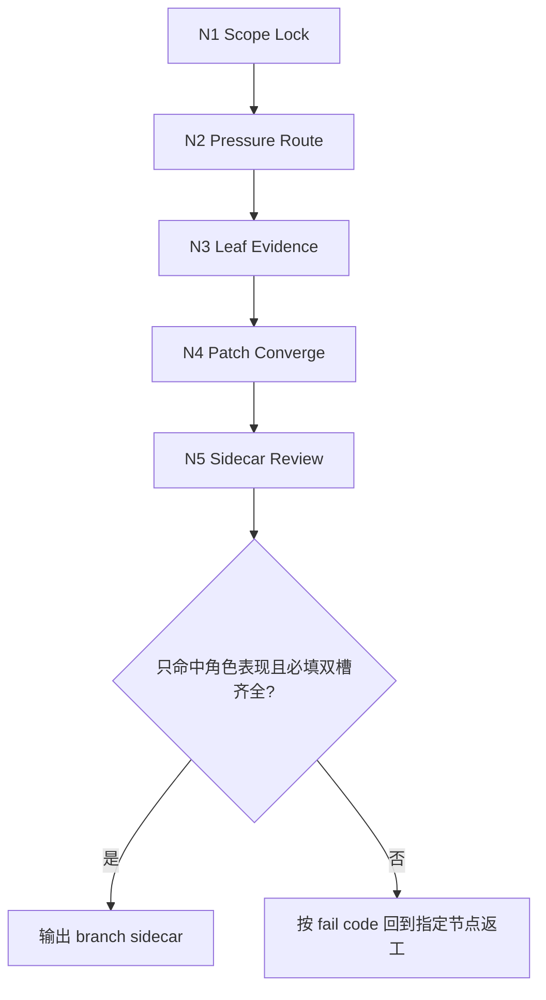
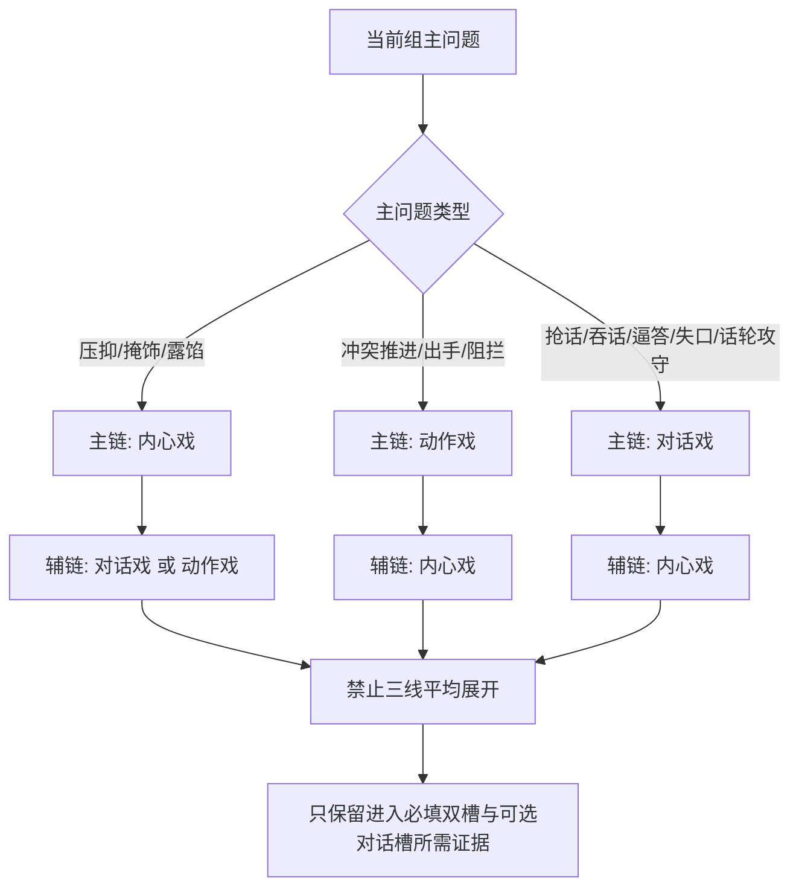
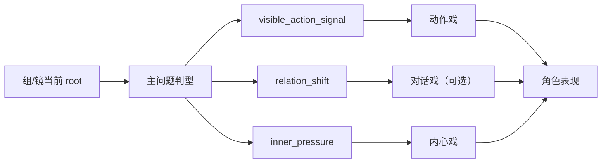

# 3-Detail / 1-水月 / 1-角色表现

## Context Loading Contract

- 每次调用本技能时，必须同时加载同目录 `CONTEXT.md`。
- 必须回读父层 `1-水月/SKILL.md`、`3-Detail/SKILL.md`、`_shared/branch-output-contract.md`、`_shared/branch-review-contract.md`。
- 必须同时回读同目录 `module-spec.yaml`、`module-guide.md` 与本地叶子模块目录：
  - `内心戏/module-spec.yaml + module-guide.md`
  - `动作戏/module-spec.yaml + module-guide.md`
  - `对话戏/module-spec.yaml + module-guide.md`
- 冲突优先级：用户显式请求 > 根 `AGENTS.md` / `aigc/3-Detail` 父合同 > 本 `SKILL.md` > 本 `CONTEXT.md` > `module-guide.md` / 叶子说明。

## Parent Positioning

`1-角色表现` 的职责不是再写一份人物 prose，而是把当前组/镜的表演压强、行为目的、内里意图与按需出现的对白发法收束成可直接写回 `分镜明细[].角色表现` 的 canonical object。

### 本 branch 拥有

- `分镜明细[].角色表现`
- `projects/aigc/<项目名>/3-Detail/水月/角色表现/第N集.branch-patch.json`
- 从 `内心戏 / 动作戏 / 对话戏` 中选择主链与辅链，并把叶子收益收束成最小双槽 + 可选对话槽 patch

### 本 branch 不拥有

- `运动表现 / 氛围表现 / 视觉强化`
- `分镜构图 / 摄影美学 / 运镜手法 / 转场特效`
- 第二份人物小传、剧情摘要或对白赏析
- 空间路径、机位、景别、镜头运动的裁决权

## Canonical Sources

- `../../SKILL.md`
- `../SKILL.md`
- `../../_shared/branch-output-contract.md`
- `../../_shared/branch-review-contract.md`
- `../../_shared/node-pack-contract.md`
- `../../_shared/creative-guidance-contract.md`
- `../../../_shared/director_episode_output.schema.json`
- `module-spec.yaml`
- `module-guide.md`
- `内心戏/module-spec.yaml`
- `动作戏/module-spec.yaml`
- `对话戏/module-spec.yaml`

真源分工：

- 本 `SKILL.md`
  - 锁执行入口、节点网络、路由门、输出合同与返工入口
- `module-spec.yaml`
  - branch 级 patch contract、merge policy 与质量门
- `module-guide.md`
  - branch 级创作解释层与 route bias
- 三个叶子 `module-spec.yaml + module-guide.md`
  - 提供局部证据提炼方式，不拥有 shared root 写回权

## Business Requirement Analysis Contract

| analysis_slot | 当前结论 |
| --- | --- |
| `business_goal` | 把当前分镜组/分镜中的人物压力、行为目的和内里意图，稳定收束成 `角色表现.动作戏 / 内心戏` 必填双槽，并在存在明确对白或话轮攻守时补 `对话戏`，而不是生成第二份 prose。 |
| `business_object` | `projects/aigc/<项目名>/3-Detail/第N集.json` 当前 root、命中组/镜 scope、`projects/aigc/<项目名>/3-Detail/水月/角色表现/第N集.branch-patch.json`。 |
| `constraint_profile` | 只写 `角色表现`；必须先回读最新 root；三叶子只能作为 route 与证据来源，不得平均展开；必填双槽必须可演、可见、可回指当前戏，对话槽只在明确对白存在时补入。 |
| `success_criteria` | patch 可直接落入 schema 必填双槽；能回答“这一拍身体怎么动、哪股意图被压在动作底下”，并在有明确对白时补“谁先发、谁截断、谁吞回”；sidecar 含 `thinking_process / patch_payload / review_trace`；target path 无越权。 |
| `non_goals` | 不补运动表现、不补空间抒情、不补镜头语言、不总结人物关系史。 |
| `complexity_source` | 复杂度来自“先判当前主问题，再选择主链/辅链，再把叶子证据压回 schema 必填双槽与可选对话槽”，而不是字段数量。 |
| `topology_fit` | 固定为 `scope lock -> 压强判型 -> 叶子选路 -> 证据提炼 -> 双槽汇流 + 可选对话槽 -> sidecar 写回/自检`。 |
| `step_strategy` | 先判主问题，再选一条主链和最多一条辅链；第三条叶子只在当前镜缺关键证据时补位，不默认全开。 |

## Context Preload

1. 根 `AGENTS.md`
2. `.agents/skills/aigc/SKILL.md + CONTEXT.md`
3. `.agents/skills/aigc/3-Detail/SKILL.md + CONTEXT.md`
4. `../SKILL.md + CONTEXT.md`
5. 本 `SKILL.md + CONTEXT.md`
6. `../../_shared/branch-output-contract.md`
7. `../../_shared/branch-review-contract.md`
8. `../../_shared/node-pack-contract.md`
9. `../../_shared/creative-guidance-contract.md`
10. `../../../_shared/director_episode_output.schema.json`
11. `module-spec.yaml`
12. `module-guide.md`
13. `内心戏/module-spec.yaml + module-guide.md`
14. `动作戏/module-spec.yaml + module-guide.md`
15. `对话戏/module-spec.yaml + module-guide.md`
16. `projects/aigc/<项目名>/3-Detail/第N集.json`
17. `projects/aigc/<项目名>/1-Planning/3-分组/第N集.md`（若存在）
18. 已存在的 `角色表现/第N集.branch-patch.json`（若存在）

## Total Input Contract

### 必需输入

- `projects/aigc/<项目名>/3-Detail/第N集.json`
- 当前命中的 group / shot scope

### 可选输入

- `projects/aigc/<项目名>/1-Planning/3-分组/第N集.md`
- 已存在的 branch process sidecar
- 组间 `出场角色及穿搭`

### 硬规则

1. 每次生成前都要重新读取当前 root，不能沿用前一 branch 的旧快照。
2. `角色表现` 只能回答“这一拍怎么演”，不能偷写运动表现、氛围表现或镜头术语。
3. 必须先判断当前主问题，再决定 `内心戏 / 动作戏 / 对话戏` 的主链和辅链；不得默认三线平均发力。
4. canonical 主槽固定为 `动作戏 / 内心戏`；若当前拍存在明确对白、话轮攻守、抢话、吞话、截断或失口，再补可选 `对话戏`。不得再把旧 `表演目标 / 关系施压 / 服装锚点` 当 canonical。
5. 若结果需要精确位置/位移/调度说明，必须回交 `2-运动表现`，不能在本 branch 越权吸收。

## Output Contract

### branch process sidecar

- 路径：`projects/aigc/<项目名>/3-Detail/水月/角色表现/第N集.branch-patch.json`

### canonical field object

`分镜明细[].角色表现` 至少包含：

- `动作戏`
  - 直接对齐 `动作戏` 叶子，回答这一拍身体或外显动作怎样成立。
- `对话戏`（可选）
  - 直接对齐 `对话戏` 叶子。仅在当前拍存在明确对白、话轮攻守、抢话、吞话、截断或失口时填写。重点不是复述对白内容，而是回答谁先发、谁截断、谁吞回，以及这一拍用什么腔调、语态、断句、气口、停顿与潜台词带压。
- `内心戏`
  - 直接对齐 `内心戏` 叶子，回答哪股内里情绪或意图被压在动作底下。

字段分工硬门：

1. `动作戏` 只回答“这一拍身体或外显动作怎样成立”，不得直接复写“谁压谁”结论。
2. `对话戏` 只回答“这一拍的对白或话轮怎样成立”，若当前拍没有明确对话则默认省略，不得为了凑结构硬造台词攻守，也不得把 schema 写成台词内容摘要。
3. `内心戏` 只回答“哪股内里情绪或意图被压在动作底下”，不得抄回 `动作戏 / 对话戏` 的 prose。
4. `动作戏 / 内心戏` 为必填；`对话戏` 若出现，也不得出现 `…`、半截短语或机械截断残句。若当前证据不足，应回读上游 `动作画面 / 对白画面`，不能靠截断补位。

### sidecar 最低要求

- `thinking_process`
- `patch_payload`
- `target_json_paths`
- `review_trace`

### patch_payload 硬门

1. target path 只命中 `分镜明细[].角色表现`
2. `patch_payload` 必须符合 schema 必填双槽；若有明确对白再补可选 `对话戏`
3. 不得把叶子说明原样拼贴成三段 prose
4. `动作戏 / 内心戏` 不得是同句、近似复句或互相包含的机械改写；若填写 `对话戏`，它也不得与前两槽机械同句
5. 任何槽位不得使用 `…` 或半截短语代替完整可演句

## Skeleton-First Module Contract

- 本 `SKILL.md` 只保留执行骨架、节点门、字段门和返工入口。
- `module-guide.md` 与三个叶子 `module-guide.md` 只解释“为什么这样写、常见误用和审美尺度”，不是第二真源。
- 若 `module-guide.md` 的路由逻辑与本 `SKILL.md` 冲突，以本 `SKILL.md` 的节点门和输出合同为准；稳定的新路由应先回收进本 `SKILL.md`，再保留到说明层。

## Visual Maps

## Thinking-Action Network

| node_id | field_id | objective | actions | evidence | route_out | gate |
| --- | --- | --- | --- | --- | --- | --- |
| `N1-SCOPE-LOCK` | `FIELD-CHAR-01` | 锁定当前 episode/group/shot 与最新 root | 读取当前 root、命中 scope、已有 sidecar 与 `出场角色及穿搭` | `scope_lock_note` | -> `N2` | scope 唯一，且 root 为最新 |
| `N2-PRESSURE-ROUTE` | `FIELD-CHAR-02` | 判断这一拍的主问题与主链/辅链 | 识别谁承压、谁主动、关系往哪边偏；确定主链 + 最多一条辅链 | `route_decision_note` | -> `N3` | 禁止三线平均展开 |
| `N3-LEAF-EVIDENCE` | `FIELD-CHAR-03` | 从叶子模块提炼可见证据 | 按选中路由抽取 `visible_emotion_signal / action_intent / relation_shift` | `leaf_evidence_pack` | -> `N4` | 证据必须可见、可演、非越权 |
| `N4-PATCH-CONVERGE` | `FIELD-CHAR-04` | 把叶子证据收束成 schema 双槽 + 可选对话槽 | 将证据压成 `动作戏 / 内心戏`，若存在明确对白或话轮攻守再补 `对话戏`，删掉解释句与剧情摘要 | `character_patch` | -> `N5` | 必填双槽齐全，且不是第二份 prose |
| `N5-SIDECAR-REVIEW` | `FIELD-CHAR-05` | 写 branch sidecar 并完成自检 | 写 `thinking_process / patch_payload / target_json_paths / review_trace`；核对 target path | `branch_review_note` | pass -> done | sidecar 完整，且只命中 `角色表现` |

## Lite Field Contract

| field_id | output_slot | pass_standard | fail_code | rework_entry |
| --- | --- | --- | --- | --- |
| `FIELD-CHAR-01` | 当前 root + scope | 命中 episode/group/shot 唯一，且使用最新 root | `FAIL-CHAR-01` | `N1-SCOPE-LOCK` |
| `FIELD-CHAR-02` | route decision | 已锁定主链和辅链，不做三线平均展开 | `FAIL-CHAR-02` | `N2-PRESSURE-ROUTE` |
| `FIELD-CHAR-03` | leaf evidence pack | 至少有可见表演证据与关系证据；若缺行为入口，回补对应叶子 | `FAIL-CHAR-03` | `N3-LEAF-EVIDENCE` |
| `FIELD-CHAR-04` | `分镜明细[].角色表现` | `动作戏 / 内心戏` 必填，`对话戏` 按需出现，且每槽回答的问题不同 | `FAIL-CHAR-04` | `N4-PATCH-CONVERGE` |
| `FIELD-CHAR-05` | branch process sidecar | `thinking_process / patch_payload / review_trace / target_json_paths` 完整，且 target path 不越权 | `FAIL-CHAR-05` | `N5-SIDECAR-REVIEW` |

## Root-Cause Execution Contract

出现以下任一情况，必须先修源层，再继续写 patch：

- `SKILL.md` 仍是薄壳入口，而路由与节点判断只留在 `module-guide.md`
- 默认把 `内心戏 / 动作戏 / 对话戏` 三条叶子平均展开
- `角色表现` 开始承担 `运动表现 / 氛围表现 / 镜头语言`
- `动作戏` 写成机位、景别或镜头运动说明
- `动作戏` 与 `对话戏` 反复复用同一句，导致槽位失去分工
- sidecar 缺 `thinking_process / patch_payload / review_trace`

优先修复落点：

1. 本 `SKILL.md` 的节点网络与字段门
2. `CONTEXT.md` 的失效类型与修复顺序
3. `module-guide.md` 与叶子说明中的漂移细则

## Completion Gate

1. branch process sidecar 已写回。
2. `patch_payload` 只命中 `分镜明细[].角色表现`。
3. `角色表现` 满足 schema 必填槽：`动作戏 / 内心戏`；若当前拍有明确对白或话轮攻守，再补 `对话戏`。
4. `thinking_process / patch_payload / review_trace / target_json_paths` 完整。
