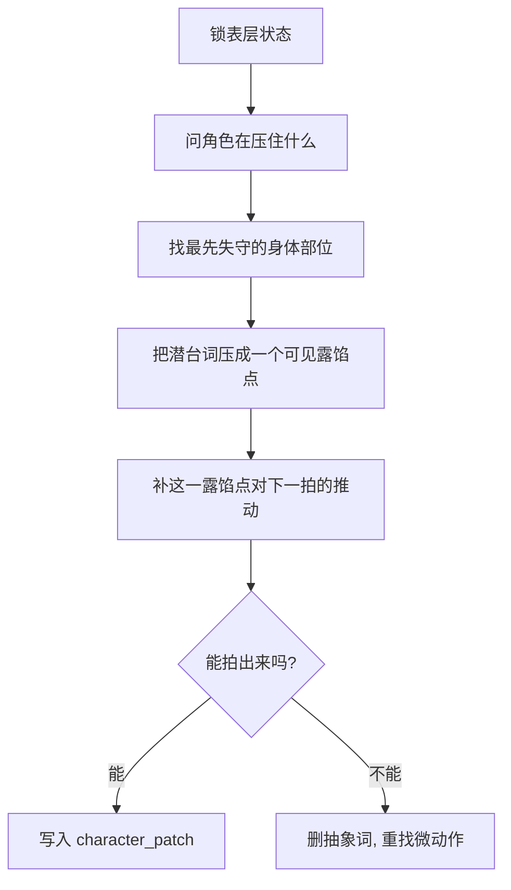

# 内心戏 模块说明

## 定位

- 本叶子负责参照共享 [角色表现总则](../module-spec.yaml)，把隐性压力、掩饰和潜台词翻译成身体和神态上的可见露馅点。
- 它不负责完整解释人物心理史，也不负责替角色决定外部调度；重点是“身体哪一处在说真话”。
- 它服务的是 `character_patch` 中的 `hidden_pressure / visible_tell / emotional_aftershock / subtext_micro_signal`，不是写一段心理独白。

## 创作目标

- 让“表层状态”和“真实压力”之间出现一道能被镜头看见的裂缝。
- 给演员一个明确可抓的微动作，不让情绪只停在抽象词。
- 让露馅点自然推动下一拍，而不是停在漂亮但无后果的细节上。

## 思维·执行链

## 节点拆解

| 节点 | 思考问题 | 执行动作 | 结果要求 |
| --- | --- | --- | --- |
| `I1-表层锁定` | 角色表面上在维持什么 | 写清他在装镇定、装强硬、装无所谓还是装顺从 | 有一个明确表层姿态 |
| `I2-压力识别` | 他真正压住的是什么 | 找到恐惧、心虚、眷恋、愤怒、迟疑等真实压力来源 | 有一个真实压力核 |
| `I3-露馅定位` | 身体最先哪里失守 | 从眼神、呼吸、嘴角、肩颈、手部、步伐里找首个破口 | 有一个可拍的微动作 |
| `I4-余震连接` | 这一露馅点怎样推进下一拍 | 补它如何被对方察觉、如何让角色失守或更用力掩饰 | 有因果，不停在静态细节 |

## 具体创作方法

### 1. 先写“装什么”，再写“露什么”

- 角色若没有表层维持，露馅点就没有反差。
- 最稳的写法是先给一个表层动作或姿态，再让身体某处偷偷拆台。

### 2. 微动作只保留第一破口

- 优先级通常是：眼神、呼吸、嘴角、肩颈、手部、脚步。
- 不要一口气把全身都写上；只保留最先失守的一处，其他留给汇流层自然吸收。

### 3. 潜台词必须能外显

- “嘴上说没事，手却捏紧杯沿”比“他其实很紧张”更有效。
- 若潜台词无法落到可见部位，说明还在解释，不在创作。

### 4. 露馅点必须带后果

- 它要么让对方察觉到破绽，要么让角色自己更慌、更硬、更急。
- 没有后果的露馅点只是装饰，不是戏。

## 常见判型

| 判型 | 典型信号 | 写法抓手 | 推荐余震 |
| --- | --- | --- | --- |
| `掩饰型` | 话说得稳，身体不稳 | 先写维持，再写细小失守 | 被对方看穿或自己更用力掩饰 |
| `强压型` | 情绪被硬生生压住 | 把呼吸、喉结、肩颈或手部写成“忍住”的形状 | 下一拍更僵、更狠或更冷 |
| `失守型` | 情绪快溢出来 | 露馅点稍大，但仍要具体 | 当场失态、打断、停顿或避开 |
| `回收型` | 露了一瞬又收回去 | 先破，再迅速收 | 张力留给对话戏接手 |

## 写作抓手

- 眼神：飘、躲、钉住、发空、迟一拍。
- 呼吸：屏住、乱掉、急促后强压回去。
- 嘴角/下颌：绷、抖、咬住、收得过紧。
- 肩颈/背部：僵、塌、悬住、突然发紧。
- 手部：捏、攥、停、错位、没处安放。

## 延展变体

- 若本拍偏对白攻守，把露馅点设计成会被对方立刻捕捉的信号，方便 `对话戏` 接棒。
- 若本拍偏 `action-push`，把露馅点压在出手前或出手后的瞬间，让它解释动作的力度变化。
- 若本拍偏 `emotional-pressure`，可以把内心戏写成“三段微波动”：先压住、再露馅、再回收。

## 失真与修正

- 若写成“他很紧张”“她很难过”，说明还停在抽象心理说明。
- 若微动作太多，保留最先露馅的一处，其余交给正文汇流时消化。
- 若身体没有说出和嘴巴不同的信息，说明潜台词还没真正外显。
- 若露馅点与下一拍无关，就补回“它如何推动下一拍”的连接。
