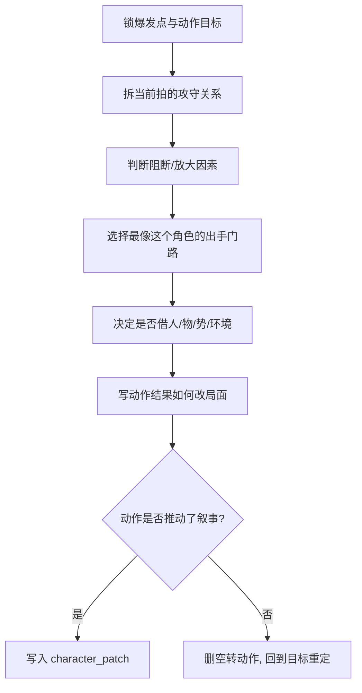

# 动作戏 模块说明

## 定位

- 本叶子负责参照共享 [角色表现总则](../module-spec.yaml)，把人物行为写成角色化的叙事动作链。
- 它不负责镜头运动，也不负责单独解释人物情绪；重点是“这个角色会怎么做”，不是“一般人会怎么做”。
- 它服务的是 `character_patch` 中的 `action_intent / resistance_point / outcome_shift / characterized_action_style`，要让行为既改局面，也带角色味道。
- 它的默认审美标尺按“香港武侠动作电影黄金武指”落地：招路要清、攻守要明、劲路要准、角色门路要见人，不能只是热闹。

## 创作目标

- 把动作写成有目的、有阻断、有结果的叙事节点。
- 把“角色个性”压进动作方式，而不是靠旁白补充性格描述。
- 把交手写出拆招、反制、借势和改局，而不是抽象描述“打得很精彩”。
- 让动作天然带出情绪和关系变化，但不越权承担空间调度说明。
- 让读者能直接想见一套可拍、可演、可拆解的动作设计，而不是只看到一串动词。

## 思维·执行链

## 节点拆解

| 节点 | 思考问题 | 执行动作 | 结果要求 |
| --- | --- | --- | --- |
| `A1-爆发点锁定` | 为什么这一拍必须动手或动身 | 明确抢、拦、逼、夺、护、逃、压、断中的主目标和爆发时刻 | 动作有起因，不空转 |
| `A2-攻守拆拍` | 这一拍是谁先动、谁应对、谁反制 | 把交手拆成 2-4 个清楚拍点，不写混战团块 | 攻守关系能被看见 |
| `A3-阻断识别` | 是什么让这一步变难、变险或变狠 | 写清人、物、环境、关系或体能上的阻断点 | 动作有压力来源 |
| `A4-角色化出手` | 为什么是这个人会这样动 | 用词、节奏和出手选择体现门路、身法、克制、狠劲、机变等角色痕迹 | 任何人不可直接套用 |
| `A5-借势借物` | 这一拍是否借了桌、门、墙、楼梯、兵器、衣袖、距离差 | 保留最有收益的一处借势或借物 | 动作更有武指设计感 |
| `A6-结果改局` | 这一做怎样改变局面 | 交代得手、失手、逼退、断招、换位、夺势、露破绽等后果 | 下一拍有明确承接 |

## 具体创作方法

### 1. 动作句必须有“前因-出手-应对-后果”

- 没有前因的动作像随机表演。
- 没有后果的动作像热闹填充。
- 没有应对的动作像单人摆姿势，不像真正交手。
- 最稳结构通常是：因为受阻/着急/决意，所以人物以某种角色化方式出手，对方被迫应对或反制，局面因此改变。

### 2. 黄金武指感不靠“很猛”，靠拆招清楚

- 好动作不是一串“打、踢、翻、闪”，而是能看出谁先取势、谁被逼转手、谁用更巧的办法改局。
- 同样是“逼近”，可以是“抢半步切进中线”“借桌沿一撑侧身抢位”“先虚晃一记再锁腕逼退”。
- 读者应能看出每一拍的主次，而不是只能感到热闹。

### 3. 角色化不靠形容词，靠门路和动作方式

- 同样是“递过去”，可以是“硬塞”“试探着递”“几乎砸过去”“稳稳按到对方面前”。
- 同样是“出手”，有人走直线硬压，有人先试探后封门，有人借小动作诱对方失位。
- 个性最好压在动词选择、动作节奏、出手顺序和收手方式里，而不是额外解释“他一向很强势”。

### 4. 动作要借势借物，不要悬空乱打

- 香港武侠动作片的高级感，常来自人和环境、兵器、衣物、门窗、阶梯之间的关系。
- 不必每拍都借物，但关键一拍若能借势，会比单纯“挥拳踢腿”更像经过武指设计。
- 可写“借门框拧身卸力”“顺着桌角一压夺回中线”“借衣袖一带逼得对方露门”。

### 5. 动作要改局，不要只添热闹

- 每个动作节点都要回答：它改变了什么。
- 改变可以很小，但必须真实，比如打断节奏、逼近一步、抢回主导、暴露心虚、拉开距离。
- 如果动作结束后局面毫无变化，这段动作多半只是热闹填充。

### 6. 角色动作和空间动作要分权

- “他猛地跨过去，一把攥住对方手腕”属于本叶子可写。
- “镜头跟着推近”“画面切到侧面”不属于本叶子。
- “借廊柱拧身让开半尺，反手把人逼回栏边”中的方位若需进一步精确，交给 `运动表现` 补足。

## 黄金武指尺度

- 先看人，再看招：动作先服务人物门路、身份、气质，再谈花样。
- 先看攻守，再看华彩：每一拍都要知道谁先手、谁吃亏、谁反制。
- 先看改局，再看漂亮：好看的动作必须改变关系、局势或心理压迫。
- 能少不多：宁可保留三四拍清楚有效的动作，也不要堆十几个泛化动词。

## 常见判型

| 判型 | 典型场景 | 写法抓手 | 应保留的后果 |
| --- | --- | --- | --- |
| `试探拆招型` | 不确定对方底子，先试再逼 | 先留轻探，再写对方应对，最后看谁抢到下一手 | 关系温度或强弱判断变化 |
| `强攻破局型` | 冲突需要被迅速推前 | 动词直接、有压迫感，但必须写出对方被迫怎么接 | 局面被强行改写 |
| `一击定势型` | 关键一拍决定主导权 | 抓住最像角色的一记关键动作，不贪多 | 场上主导权被改写 |
| `围困脱身型` | 角色需要从压制或包围中脱出 | 利用借势、借物、换位写脱身逻辑 | 距离、位置或气势被重排 |
| `失手反制型` | 想掌控却出了偏差 | 保留动作偏差、对方反应和反噬 | 下一拍压力更大 |

## 写作抓手

- 起手词：抢、切、封、压、逼、挑、带、拧、截、抢进、抢位。
- 应对词：格住、卸开、闪让、回封、架住、硬接、借力后撤、反扣。
- 借势词：借桌角、借门框、借栏杆、借衣袖、借台阶、顺墙、贴身、抢中线。
- 结果词：逼退、断招、换手、失衡、露门、错位、僵住、夺势、翻盘、压回去。

## 延展变体

- 若当前组偏 `action-push`，可把动作戏写成“三节点”：蓄势、拆招、改局。
- 若当前组兼有强情绪，可在动作前后各留一个短促的内心信号，让行为更有由来。
- 若当前组的主要收益其实是对白交换，就让动作只保留最关键的一个行为节点，把话轮张力交给 `对话戏` 去放大。
- 若当前组需要武侠感但不宜满篇招式，可只保留一记最见门路的关键动作，让“会不会打、怎么打”在一拍里见人。

## 失真与修正

- 若动作很多但局面没变，说明动作链没有真正推动叙事。
- 若一段里只有连续动词，没有谁先手、谁应对、谁吃亏，说明还没有写出拆招关系。
- 若动作句开始混入推拉摇移等术语，说明越权到了运镜层。
- 若动作对谁都适用，说明还没参照共享 `角色表现` 总则落成角色化动作。
- 若一味写“凌厉、迅疾、如风、狠辣”之类形容词，说明还没有把劲路落成具体动作设计。
- 若角色在空地上反复挥打却不借任何人、物、势，说明动作设计感不足。
- 若全是连续动作却没有目的，删掉空转动作，只保留关键行为节点。
